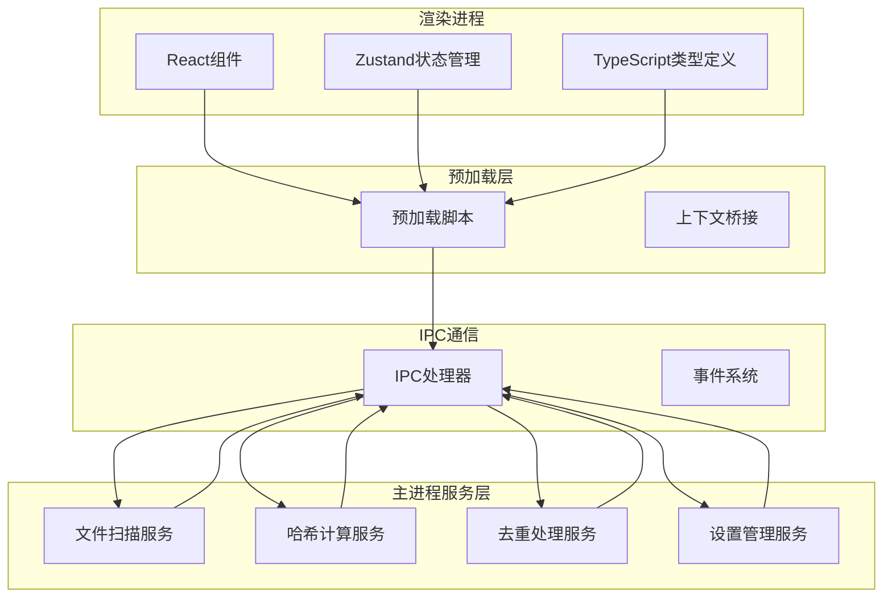
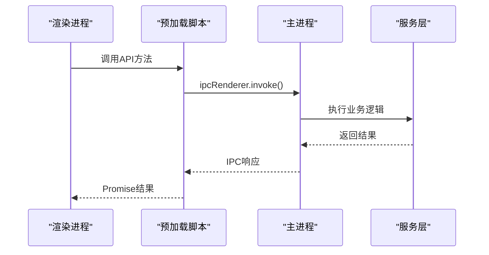
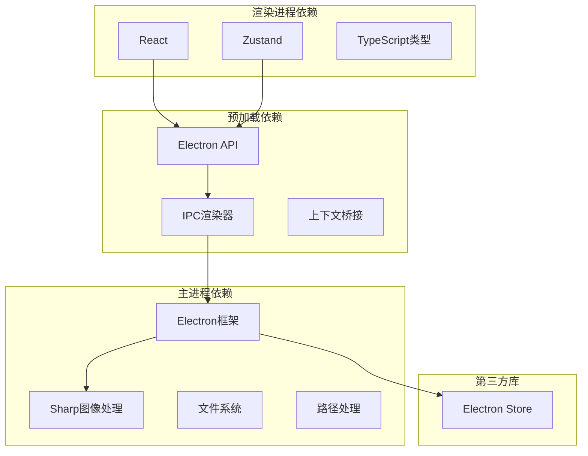

# API参考手册

<cite>
**本文档引用的文件**
- [src/main/ipc/index.ts](file://src/main/ipc/index.ts)
- [src/main/services/scanner.service.ts](file://src/main/services/scanner.service.ts)
- [src/main/services/hash.service.ts](file://src/main/services/hash.service.ts)
- [src/main/services/dedup.service.ts](file://src/main/services/dedup.service.ts)
- [src/main/services/settings.service.ts](file://src/main/services/settings.service.ts)
- [src/preload/index.ts](file://src/preload/index.ts)
- [src/preload/index.d.ts](file://src/preload/index.d.ts)
- [src/renderer/src/types/index.ts](file://src/renderer/src/types/index.ts)
- [src/renderer/src/stores/scanStore.ts](file://src/renderer/src/stores/scanStore.ts)
- [src/renderer/src/stores/dedupStore.ts](file://src/renderer/src/stores/dedupStore.ts)
- [src/renderer/src/stores/settingsStore.ts](file://src/renderer/src/stores/settingsStore.ts)
- [src/renderer/src/components/CompareStep.tsx](file://src/renderer/src/components/CompareStep.tsx)
- [src/renderer/src/components/ExecuteStep.tsx](file://src/renderer/src/components/ExecuteStep.tsx)
- [package.json](file://package.json)
</cite>

## 目录
1. [简介](#简介)
2. [项目结构](#项目结构)
3. [核心组件](#核心组件)
4. [架构概览](#架构概览)
5. [详细组件分析](#详细组件分析)
6. [依赖关系分析](#依赖关系分析)
7. [性能考虑](#性能考虑)
8. [故障排除指南](#故障排除指南)
9. [结论](#结论)
10. [附录](#附录)

## 简介

Redophoto是一个基于Electron的桌面应用程序，专门用于照片去重处理。该应用提供了完整的照片扫描、哈希计算、去重处理和设置管理功能。本文档详细记录了所有公共API接口，包括文件操作API、哈希计算API、去重处理API和设置管理API，并提供了TypeScript类型定义参考、IPC通信数据格式规范和使用示例。

## 项目结构

Redophoto采用模块化架构设计，主要分为以下层次：



**图表来源**
- [src/main/ipc/index.ts:1-156](file://src/main/ipc/index.ts#L1-L156)
- [src/preload/index.ts:1-123](file://src/preload/index.ts#L1-L123)

**章节来源**
- [src/main/ipc/index.ts:1-156](file://src/main/ipc/index.ts#L1-L156)
- [src/preload/index.ts:1-123](file://src/preload/index.ts#L1-L123)

## 核心组件

### 文件扫描服务
负责扫描指定文件夹中的照片文件，支持递归遍历和文件过滤。

### 哈希计算服务
提供SHA-256和pHash两种哈希算法，用于照片去重识别。

### 去重处理服务
实现智能去重逻辑，支持精确匹配和相似度匹配。

### 设置管理服务
提供应用配置的持久化存储和管理功能。

**章节来源**
- [src/main/services/scanner.service.ts:1-86](file://src/main/services/scanner.service.ts#L1-L86)
- [src/main/services/hash.service.ts:1-180](file://src/main/services/hash.service.ts#L1-L180)
- [src/main/services/dedup.service.ts:1-209](file://src/main/services/dedup.service.ts#L1-L209)
- [src/main/services/settings.service.ts:1-34](file://src/main/services/settings.service.ts#L1-L34)

## 架构概览

应用采用客户端-服务器架构，通过IPC（Inter-Process Communication）实现主进程和渲染进程之间的通信。



**图表来源**
- [src/preload/index.ts:61-123](file://src/preload/index.ts#L61-L123)
- [src/main/ipc/index.ts:22-156](file://src/main/ipc/index.ts#L22-L156)

## 详细组件分析

### 文件操作API

#### selectFolder API
用于选择照片文件夹。

**函数签名**
```typescript
selectFolder(): Promise<string | null>
```

**参数**
- 无参数

**返回值**
- `Promise<string | null>`: 返回选中的文件夹路径，如果取消选择则返回null

**错误处理**
- 当用户取消文件选择对话框时，返回null
- 文件夹访问权限不足时，抛出异常

**使用示例**
```typescript
// 在渲染进程中调用
const folderPath = await window.api.selectFolder()
if (folderPath) {
  console.log('选择了文件夹:', folderPath)
}
```

**最佳实践**
- 检查返回值是否为null
- 提供用户友好的错误提示
- 支持拖拽文件夹到应用窗口

**章节来源**
- [src/preload/index.ts:68-70](file://src/preload/index.ts#L68-L70)
- [src/main/ipc/index.ts:32-39](file://src/main/ipc/index.ts#L32-L39)

#### scanFolder API
扫描指定文件夹中的照片文件。

**函数签名**
```typescript
scanFolder(folderPath: string): Promise<FileInfo[]>
```

**参数**
- `folderPath: string`: 要扫描的文件夹路径

**返回值**
- `Promise<FileInfo[]>`: 返回文件信息数组

**错误处理**
- 文件夹不存在时抛出异常
- 权限不足时跳过不可访问的文件
- I/O错误时跳过损坏的文件

**使用示例**
```typescript
// 在渲染进程中调用
try {
  const files = await window.api.scanFolder('/path/to/photos')
  console.log(`找到 ${files.length} 个文件`)
} catch (error) {
  console.error('扫描失败:', error)
}
```

**最佳实践**
- 使用进度监听器显示扫描进度
- 支持大文件夹的分批处理
- 实现超时机制防止长时间阻塞

**章节来源**
- [src/preload/index.ts:69-70](file://src/preload/index.ts#L69-L70)
- [src/main/ipc/index.ts:42-53](file://src/main/ipc/index.ts#L42-L53)
- [src/main/services/scanner.service.ts:28-85](file://src/main/services/scanner.service.ts#L28-L85)

### 哈希计算API

#### computeHashes API
计算文件的SHA-256哈希值。

**函数签名**
```typescript
computeHashes(files: FileInfo[]): Promise<HashResult[]>
```

**参数**
- `files: FileInfo[]`: 文件信息数组

**返回值**
- `Promise<HashResult[]>`: 返回哈希计算结果数组

**错误处理**
- 单个文件计算失败时，对应结果的sha256字段设为'ERROR'
- I/O错误时跳过该文件
- 内存不足时抛出异常

**使用示例**
```typescript
// 计算文件哈希
const hashResults = await window.api.computeHashes(selectedFiles)
const validHashes = hashResults.filter(result => result.sha256 !== 'ERROR')
console.log(`成功计算 ${validHashes.length} 个文件的哈希`)
```

**最佳实践**
- 使用批量处理提高性能
- 实现进度回调显示计算进度
- 缓存计算结果避免重复计算

**章节来源**
- [src/preload/index.ts:73-75](file://src/preload/index.ts#L73-L75)
- [src/main/ipc/index.ts:56-68](file://src/main/ipc/index.ts#L56-L68)
- [src/main/services/hash.service.ts:29-56](file://src/main/services/hash.service.ts#L29-L56)

#### computePhashes API
计算文件的pHash（感知哈希）值。

**函数签名**
```typescript
computePhashes(files: FileInfo[]): Promise<PhashResult[]>
```

**参数**
- `files: FileInfo[]`: 文件信息数组

**返回值**
- `Promise<PhashResult[]>`: 返回pHash计算结果数组

**错误处理**
- 单个文件计算失败时，对应结果的phash字段为空字符串
- 图像处理失败时跳过该文件
- 内存不足时抛出异常

**使用示例**
```typescript
// 计算pHash
const phashResults = await window.api.computePhashes(selectedFiles)
const validPhashes = phashResults.filter(result => result.phash !== '')
console.log(`成功计算 ${validPhashes.length} 个文件的pHash`)
```

**最佳实践**
- pHash计算相对耗时，建议异步处理
- 配置合适的阈值进行相似度比较
- 结合SHA-256和pHash提高去重准确性

**章节来源**
- [src/preload/index.ts:75-76](file://src/preload/index.ts#L75-L76)
- [src/main/ipc/index.ts:70-83](file://src/main/ipc/index.ts#L70-L83)
- [src/main/services/hash.service.ts:132-159](file://src/main/services/hash.service.ts#L132-L159)

### 去重处理API

#### groupDuplicates API
根据哈希结果对重复文件进行分组。

**函数签名**
```typescript
groupDuplicates(data: {
  hashResults: HashResult[]
  phashResults?: PhashResult[]
  phashThreshold?: number
}): Promise<DuplicateGroup[]>
```

**参数**
- `data: Object`: 包含以下属性的对象
  - `hashResults: HashResult[]`: SHA-256哈希结果数组
  - `phashResults?: PhashResult[]`: pHash结果数组（可选）
  - `phashThreshold?: number`: pHash相似度阈值（默认5）

**返回值**
- `Promise<DuplicateGroup[]>`: 返回重复文件分组数组

**错误处理**
- 忽略计算失败的哈希结果
- pHash结果为空时跳过相应文件
- 输入数据格式不正确时抛出异常

**使用示例**
```typescript
// 分组重复文件
const duplicateGroups = await window.api.groupDuplicates({
  hashResults,
  phashResults,
  phashThreshold: 5
})
console.log(`发现 ${duplicateGroups.length} 组重复文件`)
```

**最佳实践**
- 先进行精确匹配，再进行相似度匹配
- 合理设置pHash阈值平衡准确性和性能
- 实现分组缓存避免重复计算

**章节来源**
- [src/preload/index.ts:78-83](file://src/preload/index.ts#L78-L83)
- [src/main/ipc/index.ts:85-107](file://src/main/ipc/index.ts#L85-L107)
- [src/main/services/dedup.service.ts:43-115](file://src/main/services/dedup.service.ts#L43-L115)

#### executeDedup API
执行去重操作并处理文件。

**函数签名**
```typescript
executeDedup(data: {
  decisions: DedupDecision[]
  settings: DedupSettings
  sourceFolder: string
  files: FileInfo[]
}): Promise<{ success: number; errors: string[] }>
```

**参数**
- `data: Object`: 包含以下属性的对象
  - `decisions: DedupDecision[]`: 用户决策数组
  - `settings: DedupSettings`: 去重设置
  - `sourceFolder: string`: 源文件夹路径
  - `files: FileInfo[]`: 文件信息数组

**返回值**
- `Promise<{ success: number; errors: string[] }>`: 返回执行结果对象
  - `success: number`: 成功处理的文件数量
  - `errors: string[]`: 失败的文件列表及错误信息

**错误处理**
- 文件删除失败时记录错误但继续处理其他文件
- 文件复制失败时记录错误但继续处理其他文件
- 权限不足时抛出异常

**使用示例**
```typescript
// 执行去重
const result = await window.api.executeDedup({
  decisions: dedupStore.getDecisionsArray(),
  settings: {
    outputMode: 'copy',
    outputFolderName: 'Deduplicated'
  },
  sourceFolder: folderPath,
  files: files
})
console.log(`成功处理: ${result.success} 个文件`)
```

**最佳实践**
- 在执行前验证用户决策的完整性
- 提供进度回调显示处理进度
- 实现撤销机制以防误操作
- 备份重要文件避免数据丢失

**章节来源**
- [src/preload/index.ts:85-91](file://src/preload/index.ts#L85-L91)
- [src/main/ipc/index.ts:109-142](file://src/main/ipc/index.ts#L109-L142)
- [src/main/services/dedup.service.ts:117-209](file://src/main/services/dedup.service.ts#L117-L209)

### 设置管理API

#### getSettings API
获取应用当前设置。

**函数签名**
```typescript
getSettings(): Promise<AppSettings>
```

**参数**
- 无参数

**返回值**
- `Promise<AppSettings>`: 返回应用设置对象

**错误处理**
- 存储读取失败时返回默认设置
- 配置文件损坏时恢复默认值

**使用示例**
```typescript
// 获取应用设置
const settings = await window.api.getSettings()
console.log('当前设置:', settings)
```

**最佳实践**
- 在应用启动时自动加载设置
- 提供设置验证和回滚机制
- 支持热更新设置变更

**章节来源**
- [src/preload/index.ts:98-99](file://src/preload/index.ts#L98-L99)
- [src/main/ipc/index.ts:153-154](file://src/main/ipc/index.ts#L153-L154)
- [src/main/services/settings.service.ts:24-33](file://src/main/services/settings.service.ts#L24-L33)

#### setSettings API
更新应用设置。

**函数签名**
```typescript
setSettings(s: Partial<AppSettings>): Promise<AppSettings>
```

**参数**
- `s: Partial<AppSettings>`: 部分设置对象

**返回值**
- `Promise<AppSettings>`: 返回更新后的完整设置

**错误处理**
- 存储写入失败时返回当前设置
- 参数验证失败时抛出异常
- 配置冲突时合并策略处理

**使用示例**
```typescript
// 更新设置
const updatedSettings = await window.api.setSettings({
  hashMode: 'both',
  phashThreshold: 8
})
console.log('更新后的设置:', updatedSettings)
```

**最佳实践**
- 实现设置变更的原子性操作
- 提供撤销和重做功能
- 记录设置变更历史

**章节来源**
- [src/preload/index.ts:99-100](file://src/preload/index.ts#L99-L100)
- [src/main/ipc/index.ts:153-154](file://src/main/ipc/index.ts#L153-L154)
- [src/main/services/settings.service.ts:28-33](file://src/main/services/settings.service.ts#L28-L33)

### IPC通信数据格式规范

#### 进度事件格式

**扫描进度 (scan:progress)**
```typescript
interface ScanProgress {
  phase: 'scanning' | 'hashing' | 'phashing' | 'grouping' | 'done'
  current: number
  total: number
  percentage: number
}
```

**哈希进度 (hash:progress)**
```typescript
interface ScanProgress {
  phase: 'scanning' | 'hashing' | 'phashing'
  current: number
  total: number
  percentage: number
}
```

**去重进度 (dedup:progress)**
```typescript
interface DedupProgress {
  current: number
  total: number
  currentFile: string
  percentage: number
}
```

#### 事件类型定义

**窗口控制事件**
- `window:minimize`: 最小化窗口
- `window:maximize`: 最大化/还原窗口  
- `window:close`: 关闭窗口

**文件操作事件**
- `folder:select`: 选择文件夹
- `folder:scan`: 扫描文件夹

**哈希计算事件**
- `hash:computeAll`: 计算SHA-256哈希
- `phash:computeAll`: 计算pHash

**去重处理事件**
- `dedup:group`: 分组重复文件
- `dedup:execute`: 执行去重操作

**章节来源**
- [src/main/ipc/index.ts:22-156](file://src/main/ipc/index.ts#L22-L156)
- [src/preload/index.ts:47-59](file://src/preload/index.ts#L47-L59)

### TypeScript类型定义参考

#### 文件信息类型
```typescript
interface FileInfo {
  id: string
  path: string
  name: string
  size: number
  ext: string
  modifiedTime: number
}
```

#### 哈希结果类型
```typescript
interface HashResult {
  id: string
  sha256: string
}

interface PhashResult {
  id: string
  phash: string
}
```

#### 去重相关类型
```typescript
interface DuplicateGroup {
  groupId: string
  hash: string
  matchType: 'exact' | 'similar'
  files: FileInfo[]
}

interface DedupDecision {
  groupId: string
  keepFileIds: string[]
  deleteFileIds: string[]
}

interface DedupSettings {
  outputMode: 'copy' | 'delete'
  outputFolderName: string
}
```

#### 应用设置类型
```typescript
interface AppSettings {
  hashMode: 'sha256' | 'phash' | 'both'
  phashThreshold: number
  outputMode: 'copy' | 'delete'
  outputFolderSuffix: string
}
```

**章节来源**
- [src/renderer/src/types/index.ts:1-58](file://src/renderer/src/types/index.ts#L1-L58)
- [src/preload/index.d.ts:1-52](file://src/preload/index.d.ts#L1-L52)

## 依赖关系分析



**图表来源**
- [package.json:13-34](file://package.json#L13-L34)
- [src/main/ipc/index.ts:1-18](file://src/main/ipc/index.ts#L1-L18)

**章节来源**
- [package.json:1-51](file://package.json#L1-L51)

## 性能考虑

### 批量处理优化
- 文件扫描：每批处理50个文件，避免长时间阻塞UI线程
- SHA-256计算：每批处理20个文件，使用Promise.all并发处理
- pHash计算：每批处理5个文件，减少内存占用

### 内存管理
- 使用生成器模式处理大量文件
- 及时清理临时文件和缓存
- 实现垃圾回收触发机制

### 网络和I/O优化
- 异步文件操作避免阻塞主线程
- 进度回调提供用户体验反馈
- 错误重试机制提高可靠性

## 故障排除指南

### 常见问题及解决方案

**文件扫描失败**
- 检查文件夹权限
- 验证磁盘空间充足
- 确认文件路径有效

**哈希计算错误**
- 检查文件完整性
- 验证磁盘空间
- 确认Sharp库正确安装

**去重执行失败**
- 检查目标文件夹权限
- 验证磁盘空间充足
- 确认文件未被其他程序占用

**设置保存失败**
- 检查配置文件权限
- 验证磁盘空间
- 确认Electron Store正常工作

**章节来源**
- [src/main/services/scanner.service.ts:36-85](file://src/main/services/scanner.service.ts#L36-L85)
- [src/main/services/hash.service.ts:19-27](file://src/main/services/hash.service.ts#L19-L27)
- [src/main/services/dedup.service.ts:132-209](file://src/main/services/dedup.service.ts#L132-L209)
- [src/main/services/settings.service.ts:17-33](file://src/main/services/settings.service.ts#L17-L33)

## 结论

Redophoto应用提供了完整的照片去重解决方案，具有以下特点：

1. **模块化设计**：清晰的服务分离和职责划分
2. **高性能处理**：多线程和批量处理优化
3. **用户友好**：直观的界面和详细的进度反馈
4. **可靠稳定**：完善的错误处理和恢复机制
5. **可扩展性**：良好的架构支持功能扩展

该API参考手册涵盖了所有公共接口的详细文档，包括参数说明、返回值类型、错误处理和使用示例，为开发者提供了完整的开发指导。

## 附录

### API版本兼容性

**版本1.0.0**
- 初始版本发布
- 支持基本的文件扫描、哈希计算和去重功能
- 完整的TypeScript类型定义

### 迁移指南

**从v0.x到v1.0.0的迁移**
1. 更新TypeScript类型导入路径
2. 检查IPC事件名称变更
3. 验证错误处理机制
4. 测试新版本的性能改进

### 最佳实践建议

1. **错误处理**：始终检查API调用的返回值
2. **进度监控**：使用进度回调提供用户体验
3. **资源管理**：及时释放文件句柄和内存
4. **安全性**：验证用户输入和文件路径
5. **性能优化**：合理使用批量处理和异步操作