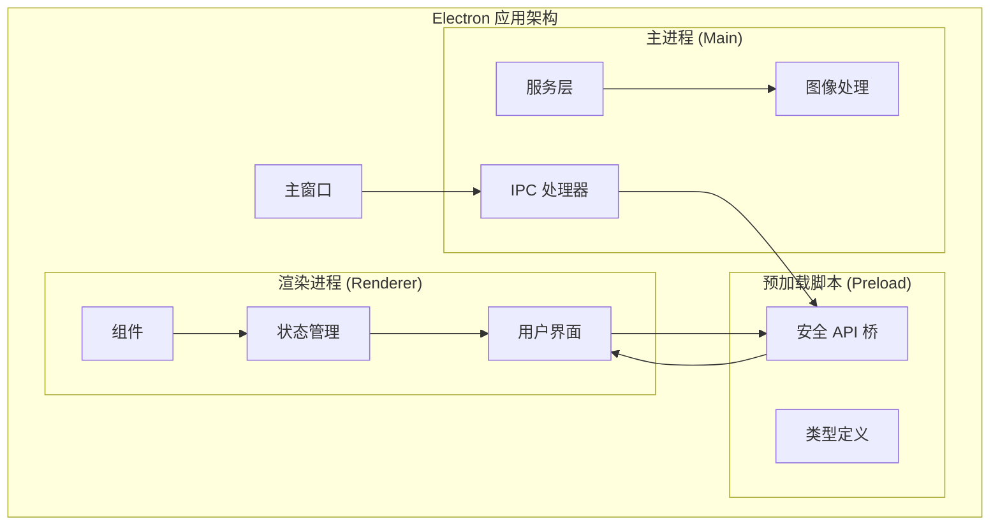
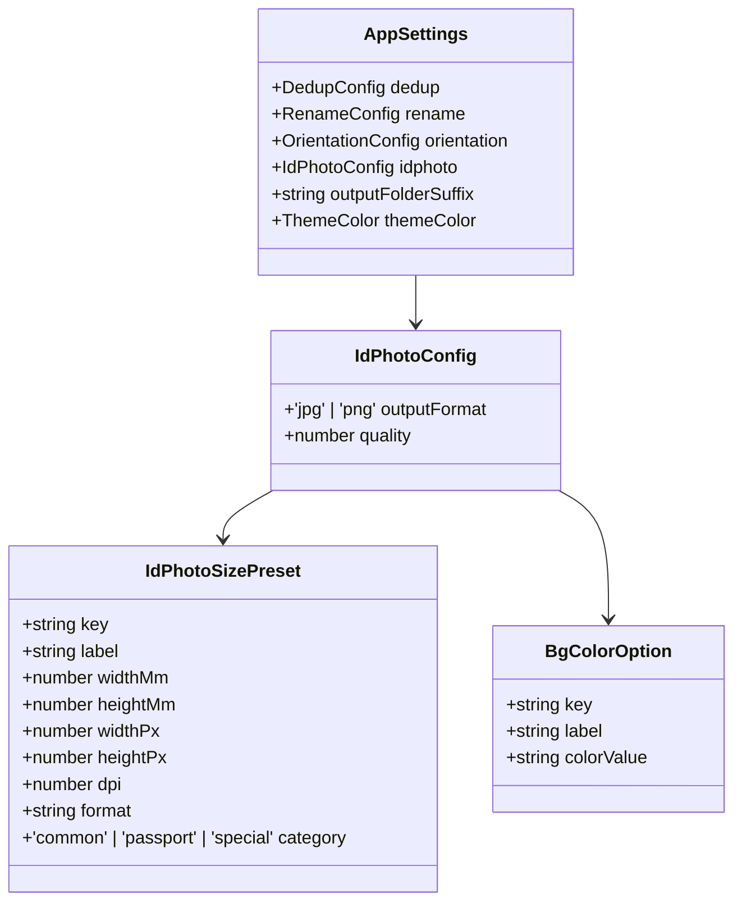
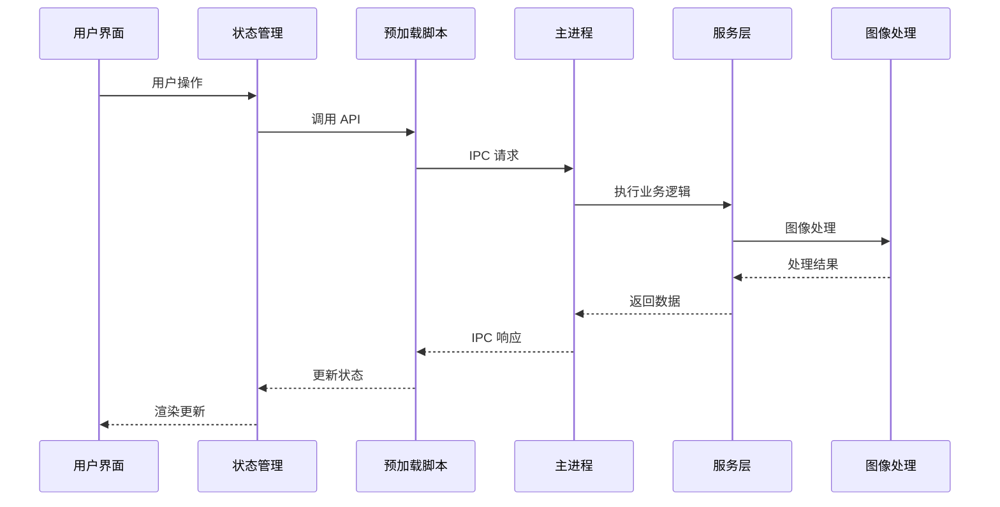
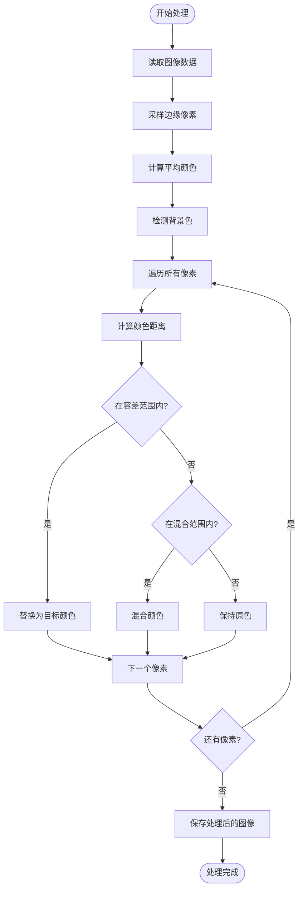
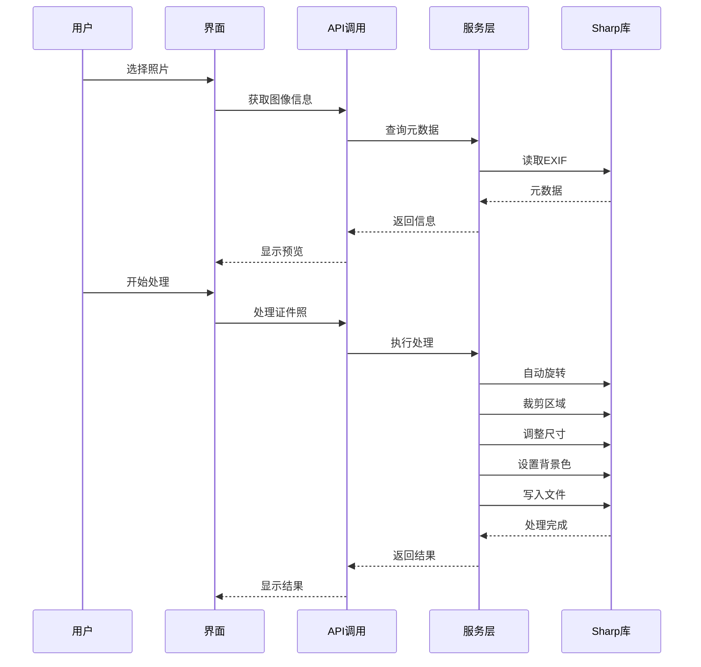
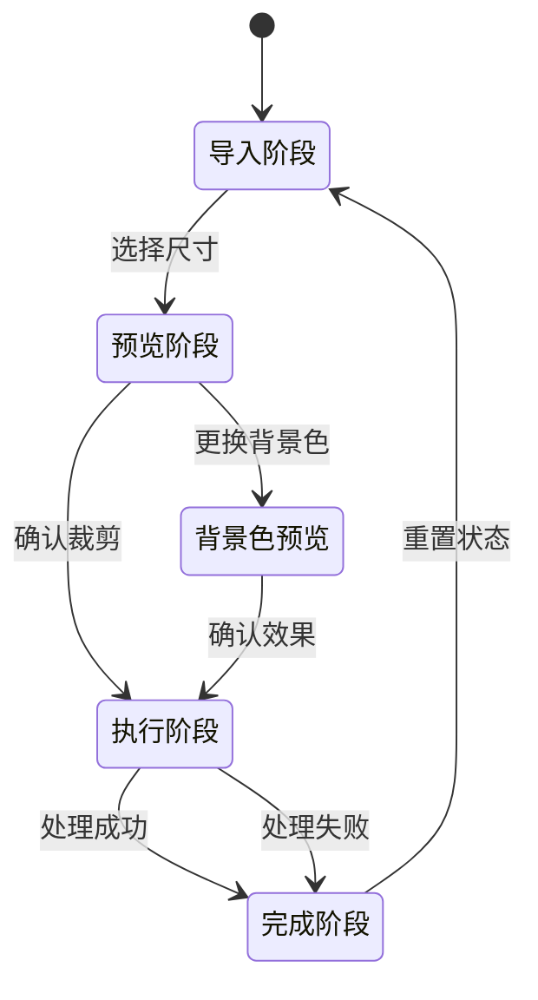
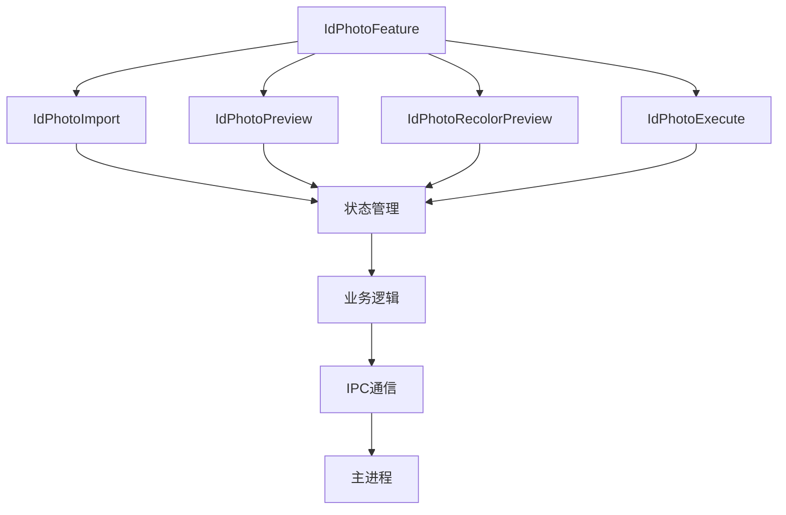
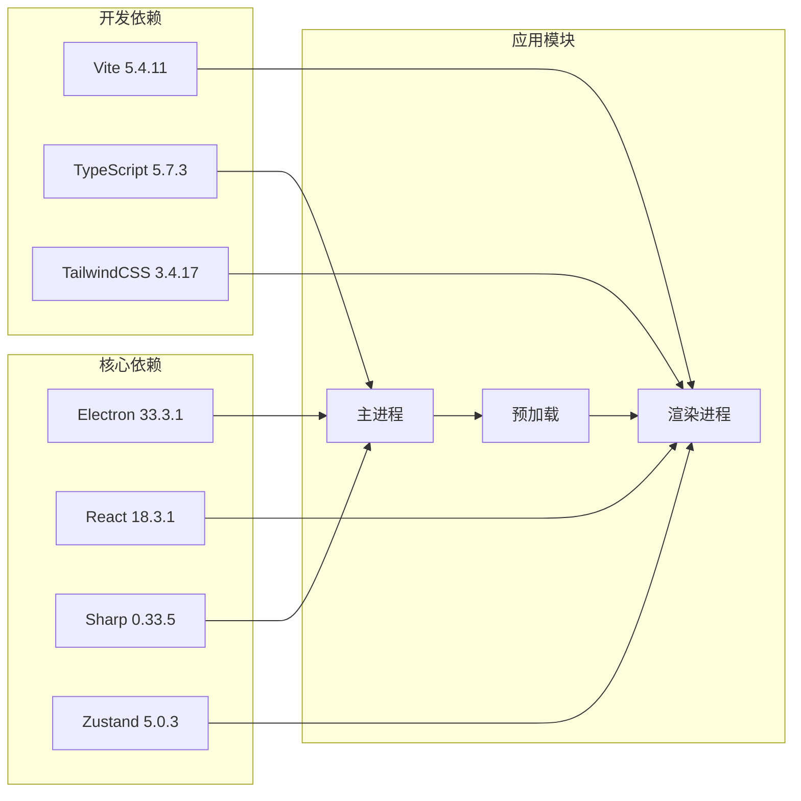
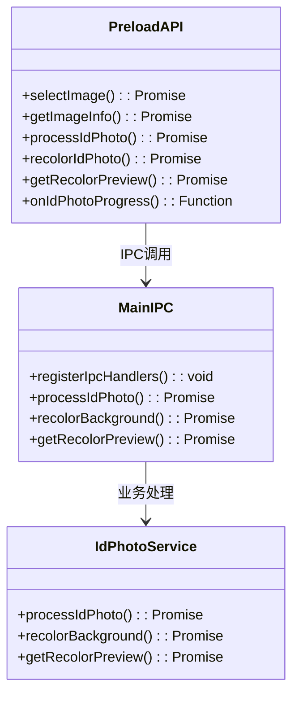
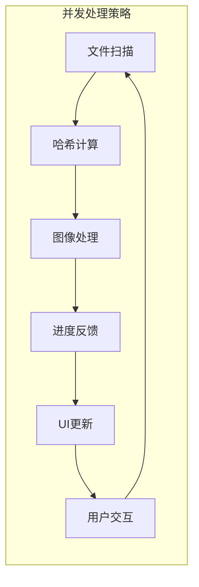

# ID照片类型定义

<cite>
**本文档引用的文件**
- [idphoto.service.ts](file://src/main/services/idphoto.service.ts)
- [idphoto.ts](file://src/renderer/src/types/idphoto.ts)
- [index.ts](file://src/renderer/src/types/index.ts)
- [idphotoStore.ts](file://src/renderer/src/stores/idphotoStore.ts)
- [IdPhotoFeature.tsx](file://src/renderer/src/components/idphoto/IdPhotoFeature.tsx)
- [IdPhotoImport.tsx](file://src/renderer/src/components/idphoto/IdPhotoImport.tsx)
- [IdPhotoPreview.tsx](file://src/renderer/src/components/idphoto/IdPhotoPreview.tsx)
- [IdPhotoExecute.tsx](file://src/renderer/src/components/idphoto/IdPhotoExecute.tsx)
- [index.ts](file://src/main/ipc/index.ts)
- [index.ts](file://src/preload/index.ts)
- [package.json](file://package.json)
</cite>

## 目录
1. [简介](#简介)
2. [项目结构](#项目结构)
3. [核心组件](#核心组件)
4. [架构概览](#架构概览)
5. [详细组件分析](#详细组件分析)
6. [依赖关系分析](#依赖关系分析)
7. [性能考虑](#性能考虑)
8. [故障排除指南](#故障排除指南)
9. [结论](#结论)

## 简介

ReDoPhoto 是一个基于 Electron 的桌面照片管理工具，专注于提供专业的证件照制作功能。本文档详细分析了 ID 照片类型定义系统，包括数据结构、处理流程、用户界面设计以及前后端通信机制。

该系统支持多种证件照尺寸标准（如中国常用的一寸、二寸证件照），提供智能背景色替换功能，并具备完整的进度跟踪和错误处理机制。

## 项目结构

ReDoPhoto 采用典型的 Electron 应用架构，分为主进程（main）、预加载脚本（preload）和渲染进程（renderer）三个部分：



**图表来源**
- [index.ts:45-373](file://src/main/ipc/index.ts#L45-L373)
- [index.ts:1-295](file://src/preload/index.ts#L1-L295)

**章节来源**
- [package.json:1-50](file://package.json#L1-L50)

## 核心组件

### 数据类型定义

系统的核心数据类型主要定义在以下文件中：

#### 主进程服务类型
- `IdPhotoProcessParams`: 证件照处理参数接口
- `RecolorParams`: 背景色替换参数接口  
- `CropRect`: 裁剪矩形接口
- `ImageInfo`: 图像信息接口

#### 渲染进程类型
- `IdPhotoSizePreset`: 证件照尺寸预设接口
- `BgColorOption`: 背景色选项接口
- `IdPhotoProgress`: 处理进度接口

**章节来源**
- [idphoto.service.ts:3-35](file://src/main/services/idphoto.service.ts#L3-L35)
- [idphoto.ts:1-42](file://src/renderer/src/types/idphoto.ts#L1-L42)

### 配置系统

应用使用统一的配置系统管理各种设置：



**图表来源**
- [index.ts:58-70](file://src/renderer/src/types/index.ts#L58-L70)
- [idphoto.ts:1-193](file://src/renderer/src/types/idphoto.ts#L1-L193)

**章节来源**
- [index.ts:58-70](file://src/renderer/src/types/index.ts#L58-L70)
- [idphoto.ts:43-193](file://src/renderer/src/types/idphoto.ts#L43-L193)

## 架构概览

ReDoPhoto 的 ID 照片处理采用分层架构设计，确保前后端分离和类型安全：



**图表来源**
- [index.ts:347-371](file://src/main/ipc/index.ts#L347-L371)
- [index.ts:277-291](file://src/preload/index.ts#L277-L291)

## 详细组件分析

### 证件照尺寸预设系统

系统内置了全面的证件照尺寸标准，涵盖常用尺寸、护照签证和特殊用途：

#### 尺寸分类

```mermaid
graph LR
subgraph "常用尺寸"
A[1寸<br/>25×35mm<br/>295×413px@300dpi]
B[2寸<br/>35×49mm<br/>413×579px@300dpi]
C[小1寸<br/>22×32mm<br/>260×378px@300dpi]
D[小2寸<br/>35×45mm<br/>413×531px@300dpi]
E[大1寸<br/>33×48mm<br/>390×567px@300dpi]
F[大2寸<br/>35×53mm<br/>413×626px@300dpi]
end
subgraph "护照/签证"
G[护照<br/>33×48mm<br/>390×567px@300dpi]
H[美国签证<br/>51×51mm<br/>600×600px@300dpi]
I[申根签证<br/>35×45mm<br/>413×531px@300dpi]
J[日本签证<br/>45×45mm<br/>531×531px@300dpi]
end
subgraph "特殊用途"
K[驾驶证<br/>22×32mm<br/>260×378px@300dpi]
L[社保卡<br/>26×32mm<br/>358×441px@350dpi]
end
```

**图表来源**
- [idphoto.ts:43-179](file://src/renderer/src/types/idphoto.ts#L43-L179)

#### 背景色选项

系统提供灵活的背景色选择：
- 保持原背景
- 白色背景
- 蓝色背景（默认企业色）
- 红色背景（符合某些证件要求）

**章节来源**
- [idphoto.ts:181-186](file://src/renderer/src/types/idphoto.ts#L181-L186)

### 图像处理引擎

#### 背景色检测算法

系统采用智能背景色检测算法，通过采样边缘像素计算平均值：



**图表来源**
- [idphoto.service.ts:121-172](file://src/main/services/idphoto.service.ts#L121-L172)
- [idphoto.service.ts:233-318](file://src/main/services/idphoto.service.ts#L233-L318)

#### 处理流程

图像处理包含多个阶段，每个阶段都有进度反馈：



**图表来源**
- [idphoto.service.ts:55-116](file://src/main/services/idphoto.service.ts#L55-L116)
- [IdPhotoPreview.tsx:237-273](file://src/renderer/src/components/idphoto/IdPhotoPreview.tsx#L237-L273)

**章节来源**
- [idphoto.service.ts:55-116](file://src/main/services/idphoto.service.ts#L55-L116)
- [IdPhotoPreview.tsx:237-273](file://src/renderer/src/components/idphoto/IdPhotoPreview.tsx#L237-L273)

### 状态管理系统

#### Zustand 状态存储

使用 Zustand 管理 ID 照片功能的状态：



**图表来源**
- [idphotoStore.ts:4-45](file://src/renderer/src/stores/idphotoStore.ts#L4-L45)

#### 组件层次结构



**图表来源**
- [IdPhotoFeature.tsx:12-23](file://src/renderer/src/components/idphoto/IdPhotoFeature.tsx#L12-L23)
- [idphotoStore.ts:49-94](file://src/renderer/src/stores/idphotoStore.ts#L49-L94)

**章节来源**
- [idphotoStore.ts:49-94](file://src/renderer/src/stores/idphotoStore.ts#L49-L94)
- [IdPhotoFeature.tsx:12-23](file://src/renderer/src/components/idphoto/IdPhotoFeature.tsx#L12-L23)

## 依赖关系分析

### 核心依赖

系统的关键依赖包括：



**图表来源**
- [package.json:14-36](file://package.json#L14-L36)

### IPC 通信架构

前后端通信通过 IPC 实现，确保安全性：



**图表来源**
- [index.ts:171-292](file://src/preload/index.ts#L171-L292)
- [index.ts:347-371](file://src/main/ipc/index.ts#L347-L371)

**章节来源**
- [index.ts:171-292](file://src/preload/index.ts#L171-L292)
- [index.ts:347-371](file://src/main/ipc/index.ts#L347-L371)

## 性能考虑

### 图像处理优化

系统在图像处理方面采用了多项优化策略：

1. **渐进式处理**: 每个处理步骤都有进度反馈，避免长时间无响应
2. **内存管理**: 使用流式处理避免大图像占用过多内存
3. **批量处理**: 对于大量文件采用批处理模式
4. **缓存机制**: 预览图缓存减少重复计算

### 并发处理



## 故障排除指南

### 常见问题及解决方案

#### 图像处理失败
- **症状**: 处理过程中出现错误提示
- **原因**: 文件格式不支持或文件损坏
- **解决**: 检查文件格式是否为支持的格式（JPG、PNG、BMP、WebP）

#### 背景色检测不准确
- **症状**: 背景色替换效果不佳
- **原因**: 背景与主体颜色相近
- **解决**: 调整容差参数或手动选择更明显的背景色

#### 性能问题
- **症状**: 处理速度慢或内存占用高
- **原因**: 处理大尺寸图像或同时处理多个文件
- **解决**: 关闭其他应用程序释放内存，或降低图像质量设置

**章节来源**
- [idphoto.service.ts:109-115](file://src/main/services/idphoto.service.ts#L109-L115)
- [idphoto.service.ts:311-317](file://src/main/services/idphoto.service.ts#L311-L317)

## 结论

ReDoPhoto 的 ID 照片类型定义系统展现了现代桌面应用的最佳实践：

1. **类型安全**: 完整的 TypeScript 类型定义确保编译时检查
2. **模块化设计**: 清晰的分层架构便于维护和扩展
3. **用户体验**: 流畅的进度反馈和直观的界面设计
4. **性能优化**: 智能的图像处理算法和内存管理策略

该系统为证件照制作提供了专业级的功能，包括多尺寸支持、智能背景色处理、进度跟踪等特性，满足了用户对高质量证件照的需求。