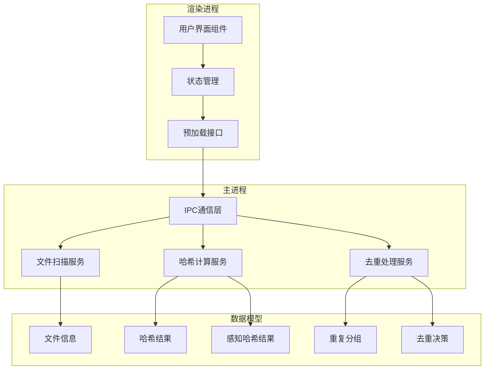
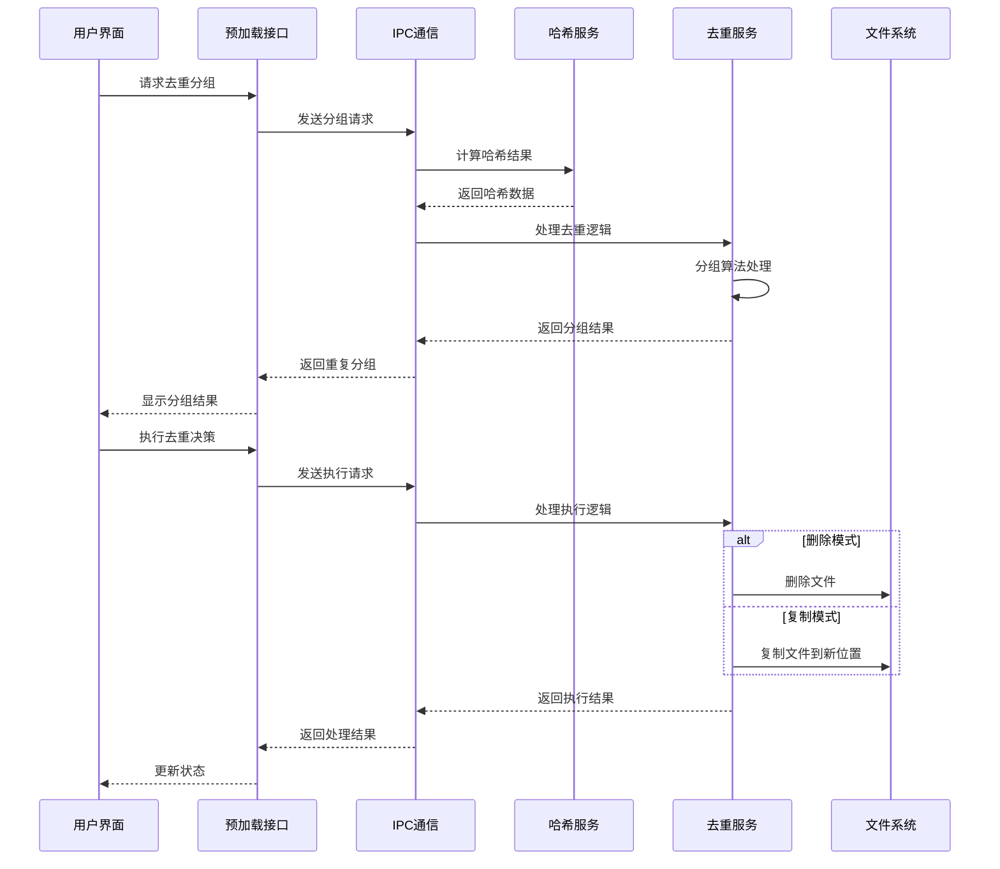
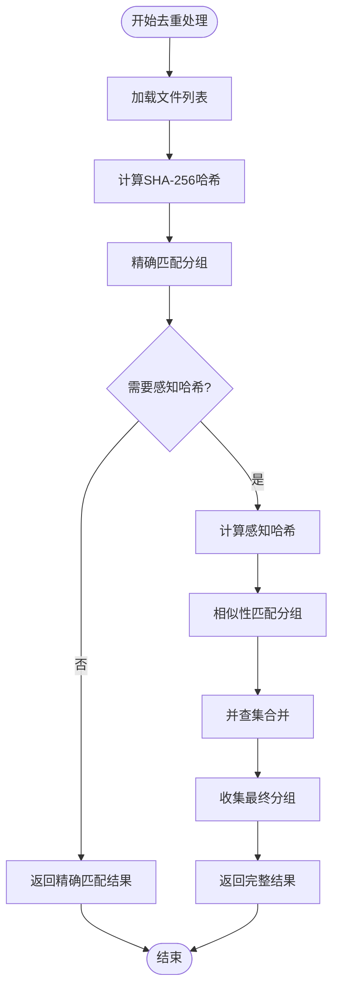
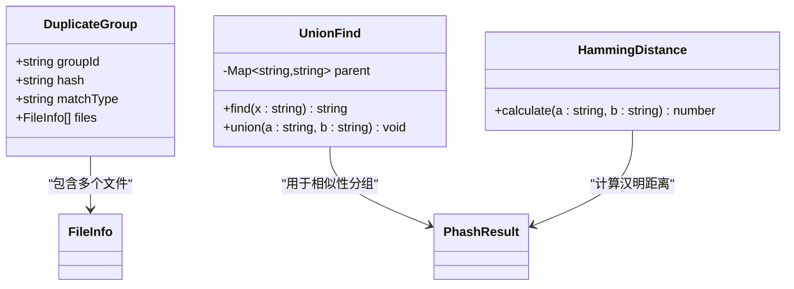
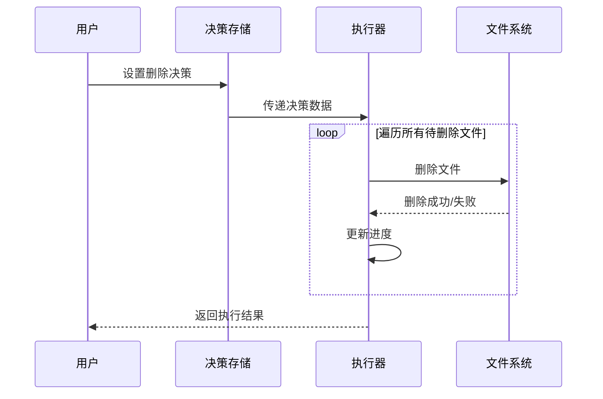
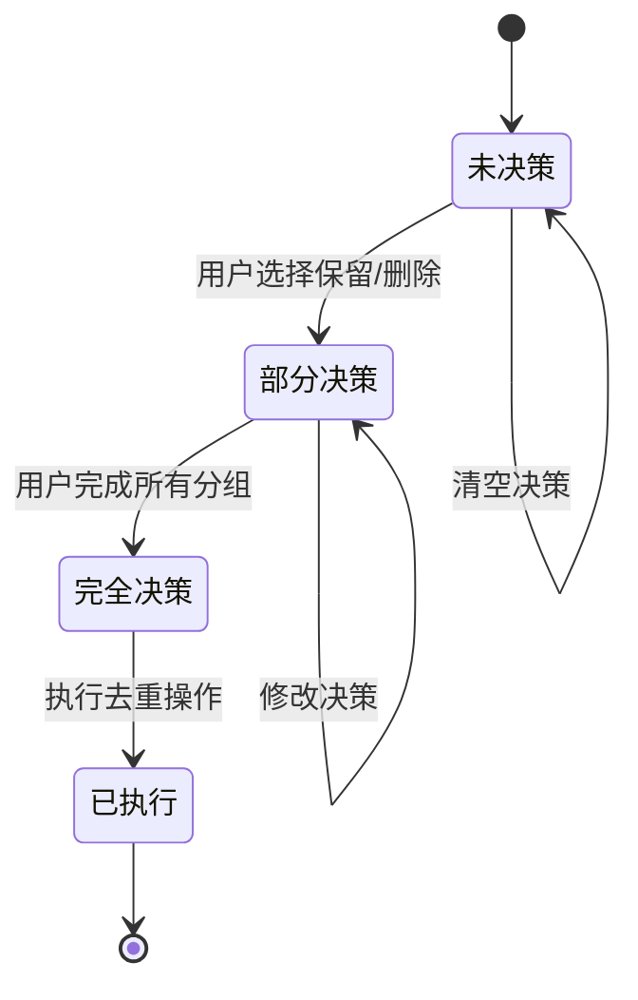
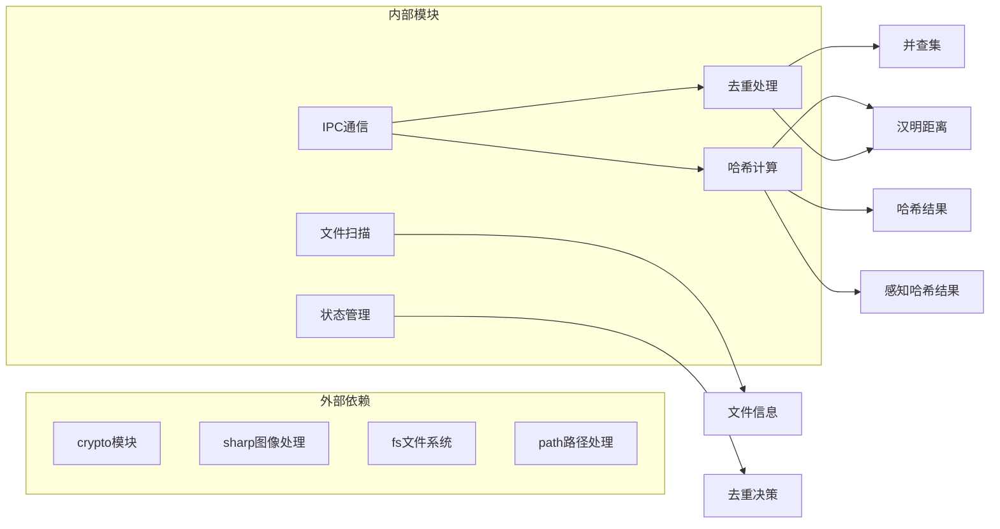

# 去重处理API

<cite>
**本文档引用的文件**
- [src/main/services/dedup.service.ts](file://src/main/services/dedup.service.ts)
- [src/main/services/hash.service.ts](file://src/main/services/hash.service.ts)
- [src/main/ipc/index.ts](file://src/main/ipc/index.ts)
- [src/preload/index.ts](file://src/preload/index.ts)
- [src/renderer/src/stores/dedupStore.ts](file://src/renderer/src/stores/dedupStore.ts)
- [src/renderer/src/components/CompareStep.tsx](file://src/renderer/src/components/CompareStep.tsx)
- [src/renderer/src/stores/scanStore.ts](file://src/renderer/src/stores/scanStore.ts)
- [src/main/services/scanner.service.ts](file://src/main/services/scanner.service.ts)
</cite>

## 目录
1. [简介](#简介)
2. [项目结构](#项目结构)
3. [核心组件](#核心组件)
4. [架构概览](#架构概览)
5. [详细组件分析](#详细组件分析)
6. [依赖关系分析](#依赖关系分析)
7. [性能考虑](#性能考虑)
8. [故障排除指南](#故障排除指南)
9. [结论](#结论)
10. [附录](#附录)

## 简介

红ophoto应用的去重处理API提供了强大的重复文件检测和管理功能。该系统通过组合使用SHA-256精确匹配和感知哈希相似性检测，实现了对图像文件的智能去重处理。

本API的核心功能包括：
- **重复文件分组**：将具有相同内容或高度相似内容的文件自动分组
- **去重决策执行**：根据用户选择执行删除或复制操作
- **多策略匹配**：支持精确匹配和相似性匹配两种模式
- **批量处理**：支持大规模文件集的高效处理

## 项目结构

红ophoto应用采用Electron架构，前端使用React，后端使用TypeScript。去重处理API主要分布在以下模块：

**图表来源**
- [src/main/ipc/index.ts:85-142](file://src/main/ipc/index.ts#L85-L142)
- [src/main/services/dedup.service.ts:43-130](file://src/main/services/dedup.service.ts#L43-L130)
- [src/preload/index.ts:61-99](file://src/preload/index.ts#L61-L99)

**章节来源**
- [src/main/ipc/index.ts:39-155](file://src/main/ipc/index.ts#L39-L155)
- [src/preload/index.ts:1-99](file://src/preload/index.ts#L1-L99)

## 核心组件

### 数据模型定义

系统使用强类型数据模型确保数据完整性：

**DuplicateGroup** - 重复文件分组
- `groupId`: 分组唯一标识符
- `hash`: 匹配哈希值（精确匹配时为SHA-256，相似匹配时为感知哈希）
- `matchType`: 匹配类型，'exact' 或 'similar'
- `files`: 文件列表

**DedupDecision** - 去重决策
- `groupId`: 对应的分组标识
- `keepFileIds`: 保留的文件ID数组
- `deleteFileIds`: 删除的文件ID数组

**DedupSettings** - 去重设置
- `outputMode`: 输出模式，'copy' 或 'delete'
- `outputFolderName`: 输出文件夹名称

**章节来源**
- [src/main/services/dedup.service.ts:7-23](file://src/main/services/dedup.service.ts#L7-L23)
- [src/preload/index.ts:22-38](file://src/preload/index.ts#L22-L38)

### 主要API接口

#### groupDuplicates 函数
负责将文件分组为重复项，支持双重匹配策略：

**参数结构**：
- `files`: FileInfo[] - 扫描到的文件列表
- `hashResults`: HashResult[] - SHA-256哈希计算结果
- `phashResults`: PhashResult[] - 感知哈希计算结果（可选）
- `phashThreshold`: number - 感知哈希阈值，默认5

**返回值**：DuplicateGroup[] - 重复文件分组列表

#### executeDedup 函数
执行去重决策，支持删除和复制两种模式：

**参数结构**：
- `decisions`: DedupDecision[] - 用户的去重决策
- `allFiles`: FileInfo[] - 所有文件信息
- `groups`: DuplicateGroup[] - 重复分组
- `settings`: DedupSettings - 去重设置
- `sourceFolder`: string - 源文件夹路径
- `onProgress`: 回调函数 - 进度通知

**返回值**：Promise<{success: number, errors: string[]}> - 执行结果

**章节来源**
- [src/main/services/dedup.service.ts:43-130](file://src/main/services/dedup.service.ts#L43-L130)

## 架构概览

红ophoto的去重处理API采用分层架构设计，确保了良好的模块化和可维护性：

**图表来源**
- [src/main/ipc/index.ts:85-142](file://src/main/ipc/index.ts#L85-L142)
- [src/main/services/dedup.service.ts:117-130](file://src/main/services/dedup.service.ts#L117-L130)

### 核心处理流程

系统采用两阶段去重策略：

1. **精确匹配阶段**：使用SHA-256哈希进行完全相同的文件识别
2. **相似匹配阶段**：使用感知哈希和汉明距离进行视觉相似的文件识别

**图表来源**
- [src/main/services/dedup.service.ts:43-115](file://src/main/services/dedup.service.ts#L43-L115)

**章节来源**
- [src/main/services/dedup.service.ts:43-115](file://src/main/services/dedup.service.ts#L43-L115)

## 详细组件分析

### 去重分组算法

#### 精确匹配实现
系统首先使用SHA-256哈希进行精确匹配，这是最可靠的重复检测方式：

**图表来源**
- [src/main/services/dedup.service.ts:7-18](file://src/main/services/dedup.service.ts#L7-L18)
- [src/main/services/dedup.service.ts:25-41](file://src/main/services/dedup.service.ts#L25-L41)
- [src/main/services/hash.service.ts:161-168](file://src/main/services/hash.service.ts#L161-L168)

#### 相似性匹配实现
对于精确匹配未覆盖的文件，系统使用感知哈希进行相似性检测：

**汉明距离计算**：
- 使用感知哈希的二进制表示
- 计算两个哈希之间的不同位数
- 阈值控制相似性敏感度

**并查集算法**：
- 用于建立文件间的相似性关系
- 支持动态连通性检测
- 实现高效的分组算法

**章节来源**
- [src/main/services/dedup.service.ts:74-115](file://src/main/services/dedup.service.ts#L74-L115)
- [src/main/services/hash.service.ts:161-168](file://src/main/services/hash.service.ts#L161-L168)

### 去重决策执行

#### 删除模式实现
删除模式直接从文件系统移除重复文件：

**图表来源**
- [src/main/services/dedup.service.ts:132-160](file://src/main/services/dedup.service.ts#L132-L160)

#### 复制模式实现
复制模式将保留的文件复制到新的输出文件夹：

**文件选择策略**：
- 保留决策中指定的文件
- 非重复文件集中的所有文件
- 自动跳过重复文件集中的其他文件

**目录结构保持**：
- 保持原始文件夹结构
- 在输出文件夹中重建目录层次
- 确保相对路径的一致性

**章节来源**
- [src/main/services/dedup.service.ts:162-208](file://src/main/services/dedup.service.ts#L162-L208)

### 状态管理与用户界面

#### 决策存储管理
系统使用Zustand状态管理库维护去重决策：

**图表来源**
- [src/renderer/src/stores/dedupStore.ts:18-82](file://src/renderer/src/stores/dedupStore.ts#L18-L82)

#### UI交互流程
用户界面提供直观的去重决策界面：

**分组卡片显示**：
- 展示每个重复分组的文件列表
- 提供快速选择按钮（保留左侧/右侧）
- 显示文件详细信息（大小、扩展名、修改时间）

**决策统计**：
- 显示总分组数和已决策数
- 提供一键全选功能
- 实时更新决策状态

**章节来源**
- [src/renderer/src/stores/dedupStore.ts:1-82](file://src/renderer/src/stores/dedupStore.ts#L1-L82)
- [src/renderer/src/components/CompareStep.tsx:72-87](file://src/renderer/src/components/CompareStep.tsx#L72-L87)

## 依赖关系分析

### 模块间依赖

**图表来源**
- [src/main/services/dedup.service.ts:1-6](file://src/main/services/dedup.service.ts#L1-L6)
- [src/main/services/hash.service.ts:1-4](file://src/main/services/hash.service.ts#L1-L4)

### 数据流依赖

系统的数据流遵循严格的单向依赖关系：

1. **扫描阶段**：Scanner → FileInfo
2. **哈希计算**：Hash → HashResult/PhashResult  
3. **去重分组**：Dedup → DuplicateGroup
4. **用户决策**：Store → DedupDecision
5. **执行阶段**：Dedup → 文件系统操作

**章节来源**
- [src/main/services/dedup.service.ts:1-6](file://src/main/services/dedup.service.ts#L1-L6)
- [src/main/services/hash.service.ts:1-4](file://src/main/services/hash.service.ts#L1-L4)

## 性能考虑

### 并发处理优化

系统采用批处理和并发计算策略：

**哈希计算批处理**：
- SHA-256批大小：20个文件/批
- 感知哈希批大小：5个文件/批
- 批间异步延迟避免阻塞主线程

**内存管理**：
- 使用Map数据结构进行快速查找
- 及时清理临时计算结果
- 控制同时处理的文件数量

### 算法复杂度分析

**精确匹配阶段**：
- 时间复杂度：O(n)
- 空间复杂度：O(n)
- 其中n为文件总数

**相似性匹配阶段**：
- 时间复杂度：O(k²) 其中k为候选文件数
- 空间复杂度：O(k)
- 使用并查集优化连接操作

**整体性能**：
- 总体时间复杂度：O(n + k²)
- 通过精确匹配过滤减少相似性计算量
- 汉明距离阈值控制计算范围

### 错误恢复机制

系统具备完善的错误处理和恢复能力：

**文件访问错误**：
- 单个文件读取失败不影响整体处理
- 错误文件标记为特殊状态继续处理
- 提供详细的错误日志和恢复建议

**内存不足处理**：
- 动态调整批处理大小
- 及时释放中间结果
- 监控内存使用情况

**进度持久化**：
- 定期保存处理进度
- 支持断点续传
- 异常恢复后继续处理

## 故障排除指南

### 常见问题诊断

**去重结果不准确**：
1. 检查哈希计算是否正常完成
2. 验证感知哈希阈值设置是否合理
3. 确认文件权限和访问权限

**执行阶段错误**：
1. 检查目标文件夹写入权限
2. 验证磁盘空间充足
3. 确认文件路径有效性

**内存使用过高**：
1. 减少同时处理的文件数量
2. 调整批处理大小参数
3. 监控系统资源使用情况

### 调试工具和方法

**日志记录**：
- 详细记录每个处理步骤
- 包含文件路径和处理结果
- 支持错误堆栈跟踪

**性能监控**：
- 实时监控CPU和内存使用
- 记录关键操作耗时
- 提供性能瓶颈分析

**章节来源**
- [src/main/services/dedup.service.ts:132-160](file://src/main/services/dedup.service.ts#L132-L160)
- [src/main/services/hash.service.ts:36-56](file://src/main/services/hash.service.ts#L36-L56)

## 结论

红ophoto的去重处理API通过精心设计的双阶段匹配策略和高效的算法实现，为用户提供了一个强大而易用的重复文件管理解决方案。

**核心优势**：
- **准确性高**：结合精确匹配和相似性匹配，确保去重结果的可靠性
- **性能优秀**：采用批处理和并发计算，支持大规模文件集处理
- **用户体验好**：直观的界面和灵活的决策机制
- **稳定性强**：完善的错误处理和恢复机制

**技术特色**：
- 基于感知哈希的视觉相似性检测
- 并查集算法实现高效的分组
- 双模式执行策略满足不同需求
- 完整的状态管理和进度跟踪

该API为图像管理和文件组织提供了专业的技术支持，能够有效帮助用户清理重复文件，节省存储空间并提高文件管理效率。

## 附录

### 使用流程示例

#### 基本去重流程
1. 扫描目标文件夹
2. 计算SHA-256哈希
3. 计算感知哈希（可选）
4. 分组重复文件
5. 用户确认决策
6. 执行去重操作

#### 高级配置选项
- **感知哈希阈值**：控制相似性检测的严格程度
- **批处理大小**：平衡处理速度和内存使用
- **输出模式**：选择删除或复制策略
- **文件夹结构**：保持或重新组织文件布局

### API参考

**groupDuplicates 参数**：
- `hashResults`: 必需，SHA-256计算结果
- `phashResults`: 可选，感知哈希计算结果
- `phashThreshold`: 可选，默认5，相似性阈值

**executeDedup 参数**：
- `decisions`: 必需，用户决策列表
- `settings`: 必需，去重设置
- `sourceFolder`: 必需，源文件夹路径
- `files`: 可选，完整文件信息列表

**章节来源**
- [src/main/ipc/index.ts:85-142](file://src/main/ipc/index.ts#L85-L142)
- [src/preload/index.ts:78-91](file://src/preload/index.ts#L78-L91)