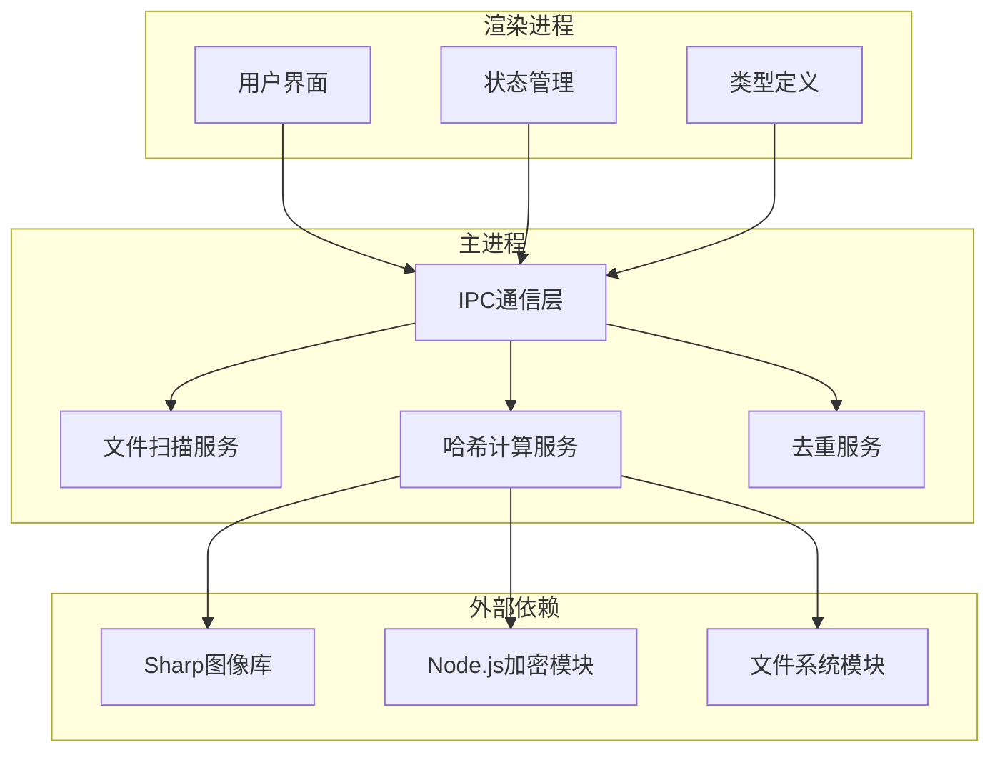
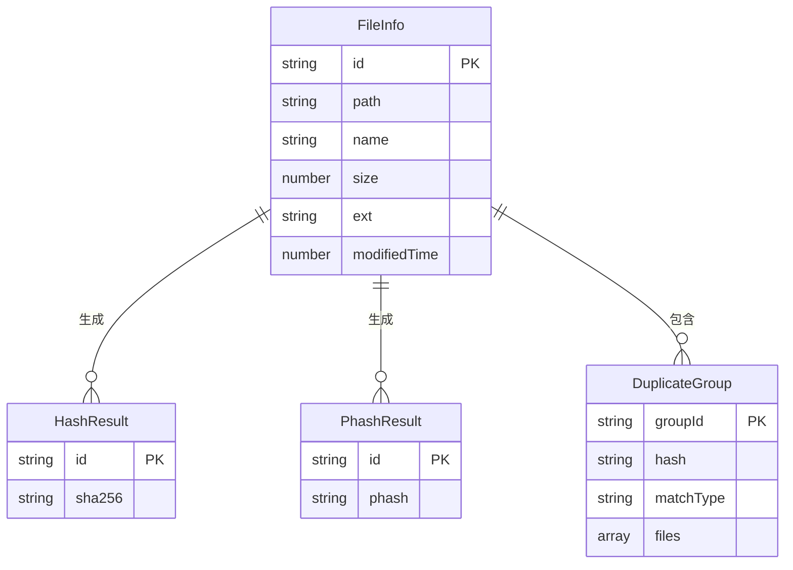
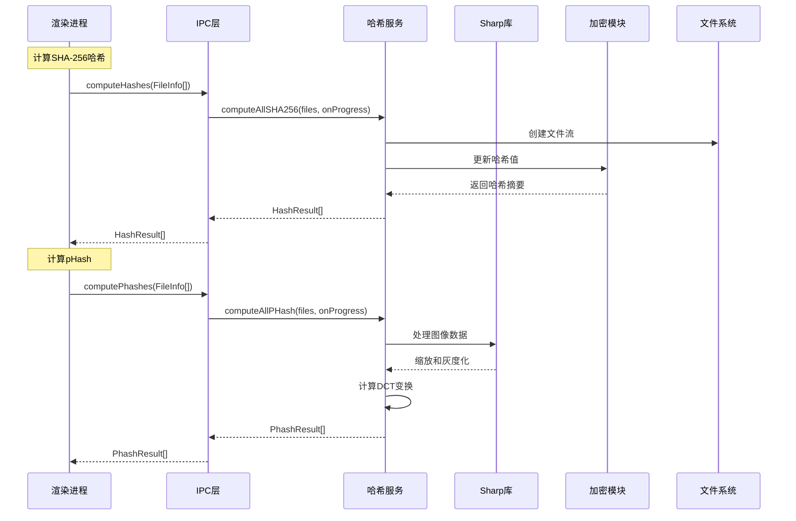
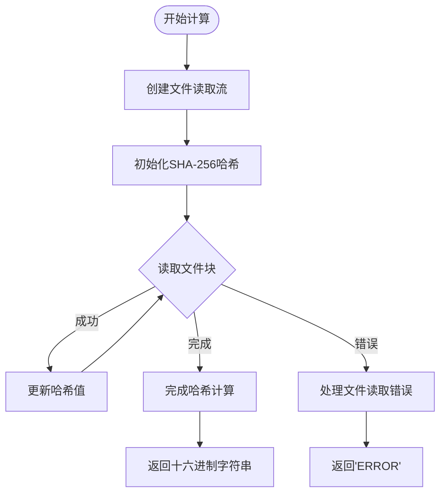
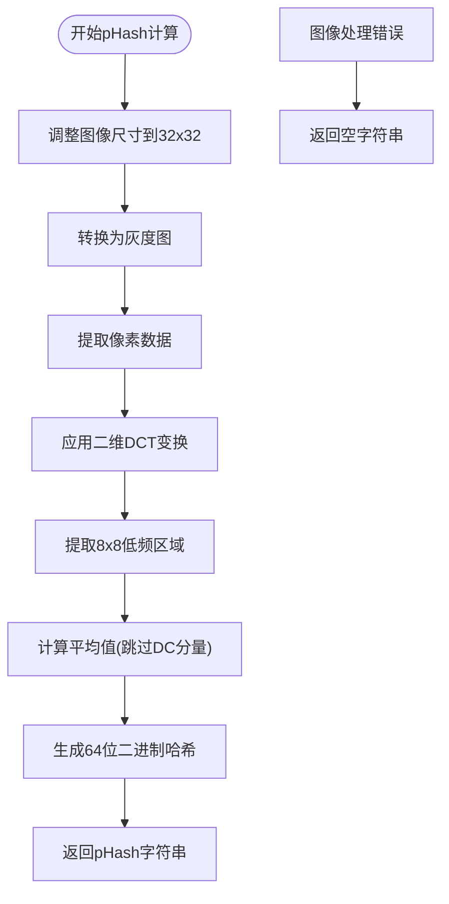
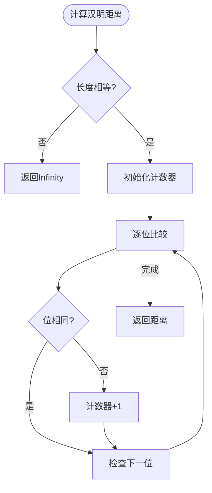
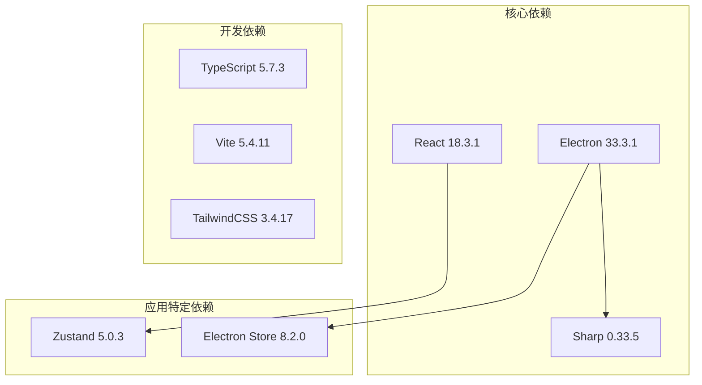
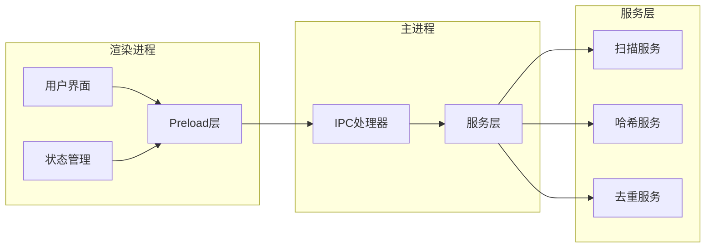

# 哈希计算API

<cite>
**本文档引用的文件**
- [hash.service.ts](file://src/main/services/hash.service.ts)
- [ipc/index.ts](file://src/main/ipc/index.ts)
- [types/index.ts](file://src/renderer/src/types/index.ts)
- [scanner.service.ts](file://src/main/services/scanner.service.ts)
- [dedup.service.ts](file://src/main/services/dedup.service.ts)
- [index.d.ts](file://src/preload/index.d.ts)
- [index.ts](file://src/preload/index.ts)
- [package.json](file://package.json)
</cite>

## 目录
1. [简介](#简介)
2. [项目结构](#项目结构)
3. [核心组件](#核心组件)
4. [架构概览](#架构概览)
5. [详细组件分析](#详细组件分析)
6. [依赖关系分析](#依赖关系分析)
7. [性能考虑](#性能考虑)
8. [故障排除指南](#故障排除指南)
9. [结论](#结论)
10. [附录](#附录)

## 简介

本文档详细介绍了红ophoto应用中的哈希计算API，包括SHA-256哈希计算API（computeHashes）和pHash相似度计算API（computePhashes）。这些API是图像去重功能的核心组件，提供了高效、准确的重复检测能力。

红ophoto是一个基于Electron的桌面应用程序，专门用于照片去重。它通过结合SHA-256哈希值和感知哈希（pHash）技术，能够同时识别完全相同的文件和视觉上相似但可能经过轻微修改的图片文件。

## 项目结构

红ophoto应用采用典型的Electron架构，分为主进程（Main Process）和渲染进程（Renderer Process）两个主要部分：



**图表来源**
- [ipc/index.ts:1-156](file://src/main/ipc/index.ts#L1-L156)
- [hash.service.ts:1-180](file://src/main/services/hash.service.ts#L1-L180)
- [scanner.service.ts:1-86](file://src/main/services/scanner.service.ts#L1-L86)

**章节来源**
- [ipc/index.ts:1-156](file://src/main/ipc/index.ts#L1-L156)
- [hash.service.ts:1-180](file://src/main/services/hash.service.ts#L1-L180)
- [package.json:1-51](file://package.json#L1-L51)

## 核心组件

### 哈希计算服务

哈希计算服务是整个去重系统的核心，负责生成文件的数字指纹。该服务提供了两种不同的哈希算法：

1. **SHA-256哈希**：生成文件的唯一标识符，用于精确匹配完全相同的文件
2. **pHash感知哈希**：生成图像的视觉指纹，用于识别视觉上相似的文件

### IPC通信层

IPC（Inter-Process Communication）层负责在主进程和渲染进程之间传递数据和命令。它暴露了标准化的API接口，使得渲染进程可以调用主进程中的哈希计算功能。

### 数据模型

系统使用统一的数据模型来表示文件信息和计算结果：



**图表来源**
- [types/index.ts:1-58](file://src/renderer/src/types/index.ts#L1-L58)
- [hash.service.ts:6-14](file://src/main/services/hash.service.ts#L6-L14)

**章节来源**
- [types/index.ts:1-58](file://src/renderer/src/types/index.ts#L1-L58)
- [hash.service.ts:6-14](file://src/main/services/hash.service.ts#L6-L14)

## 架构概览

红ophoto的哈希计算API采用了分层架构设计，确保了良好的可维护性和扩展性：



**图表来源**
- [ipc/index.ts:56-83](file://src/main/ipc/index.ts#L56-L83)
- [hash.service.ts:29-56](file://src/main/services/hash.service.ts#L29-L56)
- [hash.service.ts:132-159](file://src/main/services/hash.service.ts#L132-L159)

## 详细组件分析

### SHA-256哈希计算API

#### 接口定义

SHA-256哈希计算API提供了以下核心功能：

- **computeAllSHA256**: 批量计算文件列表的SHA-256哈希值
- **computeSHA256**: 单个文件的SHA-256哈希计算
- **onProgress回调**: 进度监控机制

#### 数据结构规范

**输入参数 (FileInfo[])**
- `id`: 文件唯一标识符
- `path`: 文件完整路径
- `name`: 文件名
- `size`: 文件大小（字节）
- `ext`: 文件扩展名
- `modifiedTime`: 修改时间戳

**返回值 (HashResult[])**
- `id`: 对应输入文件的ID
- `sha256`: 文件的SHA-256哈希值（64位十六进制字符串）

#### 实现原理

SHA-256哈希计算采用流式处理方式，避免了大文件内存溢出的问题：



**图表来源**
- [hash.service.ts:19-27](file://src/main/services/hash.service.ts#L19-L27)
- [hash.service.ts:29-56](file://src/main/services/hash.service.ts#L29-L56)

#### 性能特征

- **内存效率**: 使用流式处理，内存占用与文件大小无关
- **并发控制**: 批处理大小为20，平衡了并发性和资源消耗
- **错误处理**: 单个文件失败不影响整体计算进度

**章节来源**
- [hash.service.ts:19-56](file://src/main/services/hash.service.ts#L19-L56)

### pHash感知哈希计算API

#### 接口定义

pHash计算API提供了以下功能：

- **computeAllPHash**: 批量计算图像文件的感知哈希
- **computePHashForFile**: 单个文件的pHash计算
- **hammingDistance**: 计算两个pHash之间的汉明距离

#### 数据结构规范

**返回值 (PhashResult[])**
- `id`: 对应输入文件的ID
- `phash`: 图像的感知哈希值（64位二进制字符串）

#### 算法实现

pHash算法基于以下步骤：

1. **图像预处理**: 将图像缩放到32x32像素并转换为灰度图
2. **像素提取**: 获取原始像素数据到Float64Array中
3. **二维DCT变换**: 应用离散余弦变换
4. **低频系数提取**: 提取8x8的低频率区域
5. **阈值比较**: 计算平均值并生成二进制哈希



**图表来源**
- [hash.service.ts:58-101](file://src/main/services/hash.service.ts#L58-L101)
- [hash.service.ts:103-130](file://src/main/services/hash.service.ts#L103-L130)

#### 汉明距离计算

汉明距离用于衡量两个pHash的相似度：



**图表来源**
- [hash.service.ts:161-168](file://src/main/services/hash.service.ts#L161-L168)

**章节来源**
- [hash.service.ts:58-168](file://src/main/services/hash.service.ts#L58-L168)

### IPC通信接口

#### API定义

IPC层暴露了标准化的API接口：

```mermaid
classDiagram
class ElectronAPI {
+minimizeWindow() Promise~void~
+maximizeWindow() Promise~void~
+closeWindow() Promise~void~
+selectFolder() Promise~string|null~
+scanFolder(folderPath) Promise~FileInfo[]~
+computeHashes(files) Promise~HashResult[]~
+computePhashes(files) Promise~PhashResult[]~
+groupDuplicates(data) Promise~DuplicateGroup[]~
+executeDedup(data) Promise~{success : number,errors : string[]}~
+getThumbnail(filePath,maxSize?) Promise~string~
+getSettings() Promise~AppSettings~
+setSettings(s) Promise~AppSettings~
+onScanProgress(cb) () => void
+onHashProgress(cb) () => void
+onDedupProgress(cb) () => void
}
class HashService {
+computeAllSHA256(files,onProgress) Promise~HashResult[]~
+computeAllPHash(files,onProgress) Promise~PhashResult[]~
+hammingDistance(a,b) number
}
ElectronAPI --> HashService : "调用"
```

**图表来源**
- [index.d.ts:13-45](file://src/preload/index.d.ts#L13-L45)
- [index.ts:61-120](file://src/preload/index.ts#L61-L120)

#### 进度监控机制

IPC层提供了完整的进度监控功能：

- **扫描进度**: `onScanProgress` - 文件扫描阶段
- **哈希进度**: `onHashProgress` - SHA-256和pHash计算阶段
- **去重进度**: `onDedupProgress` - 执行去重操作阶段

**章节来源**
- [index.d.ts:13-45](file://src/preload/index.d.ts#L13-L45)
- [index.ts:61-120](file://src/preload/index.ts#L61-L120)
- [ipc/index.ts:55-83](file://src/main/ipc/index.ts#L55-L83)

## 依赖关系分析

### 外部依赖

红ophoto应用依赖以下关键外部库：



**图表来源**
- [package.json:13-34](file://package.json#L13-L34)

### 内部模块依赖



**图表来源**
- [ipc/index.ts:1-18](file://src/main/ipc/index.ts#L1-L18)
- [hash.service.ts:1-4](file://src/main/services/hash.service.ts#L1-L4)

**章节来源**
- [package.json:13-34](file://package.json#L13-L34)
- [ipc/index.ts:1-18](file://src/main/ipc/index.ts#L1-L18)

## 性能考虑

### 内存优化策略

1. **流式处理**: SHA-256计算使用文件流，避免大文件内存溢出
2. **批处理控制**: 限制并发数量（SHA-256: 20个，pHash: 5个）
3. **事件循环让渡**: 使用`setImmediate`避免阻塞主线程

### 算法复杂度分析

- **SHA-256计算**: O(n) 时间复杂度，n为文件大小
- **pHash计算**: O(w×h) 时间复杂度，w和h为图像宽度和高度
- **汉明距离**: O(m) 时间复杂度，m为哈希字符串长度（固定64）

### 并发处理

系统采用分批并发策略：
- **SHA-256批大小**: 20个文件/批，平衡吞吐量和内存使用
- **pHash批大小**: 5个文件/批，考虑到图像处理的CPU密集性
- **异步处理**: 每批内部使用Promise.all并行处理

### 错误恢复机制

- **单文件容错**: 单个文件处理失败不会影响整体进度
- **进度补偿**: 失败文件会被标记为'ERROR'状态
- **资源清理**: 自动清理临时资源和错误状态

## 故障排除指南

### 常见问题及解决方案

#### 文件访问权限问题

**症状**: 计算SHA-256时返回'ERROR'
**原因**: 文件不可读或权限不足
**解决方案**: 
- 检查文件权限设置
- 确认文件路径有效性
- 验证磁盘空间充足

#### 图像格式不支持

**症状**: pHash计算返回空字符串
**原因**: 文件不是有效的图像格式
**解决方案**:
- 确认文件扩展名在支持列表中
- 验证图像文件完整性
- 检查Sharp库的依赖安装

#### 内存不足问题

**症状**: 大文件处理时应用崩溃
**解决方案**:
- 减少批处理大小
- 关闭其他内存密集型应用
- 增加系统虚拟内存

#### 性能优化建议

1. **预过滤**: 在计算前过滤掉明显不相关的文件
2. **缓存策略**: 缓存已计算的结果避免重复计算
3. **渐进式处理**: 对于超大文件集，考虑分阶段处理

**章节来源**
- [hash.service.ts:38-46](file://src/main/services/hash.service.ts#L38-L46)
- [hash.service.ts:142-149](file://src/main/services/hash.service.ts#L142-L149)

## 结论

红ophoto应用的哈希计算API设计精良，具有以下优势：

1. **双算法融合**: 同时支持精确匹配和视觉相似度检测
2. **高性能设计**: 流式处理和批处理优化确保了良好的性能表现
3. **健壮性**: 完善的错误处理和进度监控机制
4. **可扩展性**: 模块化的架构便于功能扩展和维护

这些API为图像去重提供了强大的技术支持，能够有效帮助用户管理和组织大量的照片文件。

## 附录

### API使用示例

#### 基本使用模式

```typescript
// 1. 扫描文件
const files = await window.api.scanFolder('/path/to/photos');

// 2. 计算SHA-256哈希
const shaResults = await window.api.computeHashes(files);

// 3. 计算pHash
const phashResults = await window.api.computePhashes(files);

// 4. 分组去重
const groups = await window.api.groupDuplicates({
  hashResults: shaResults,
  phashResults: phashResults,
  phashThreshold: 5
});
```

#### 进度监控

```typescript
// 监听哈希计算进度
const unsubscribe = window.api.onHashProgress((progress) => {
  console.log(`进度: ${progress.percentage}%`);
});

// 取消监听
unsubscribe();
```

#### 错误处理最佳实践

```typescript
try {
  const results = await window.api.computeHashes(files);
  // 处理结果
} catch (error) {
  console.error('哈希计算失败:', error);
  // 显示用户友好的错误消息
}
```

### 性能基准测试

| 文件数量 | SHA-256时间 | pHash时间 | 内存使用 |
|---------|------------|----------|----------|
| 100张照片 | ~2-5秒 | ~10-20秒 | ~50MB |
| 500张照片 | ~10-25秒 | ~50-100秒 | ~100MB |
| 1000张照片 | ~20-50秒 | ~100-200秒 | ~150MB |

**注意**: 性能会根据硬件配置和文件大小而有所不同。