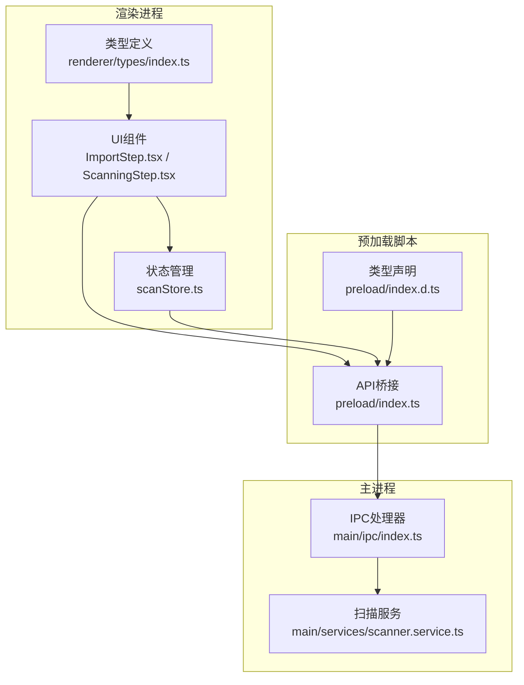
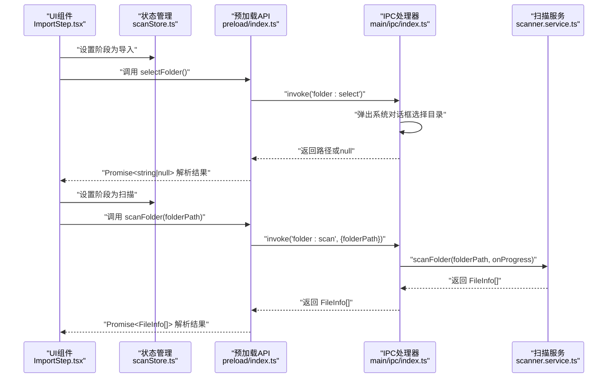
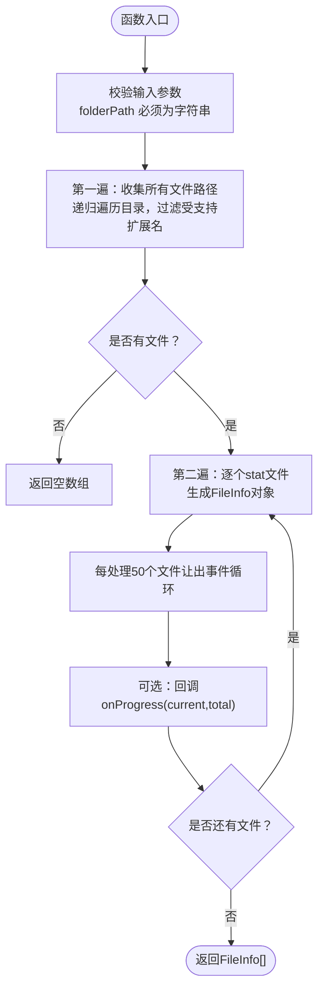
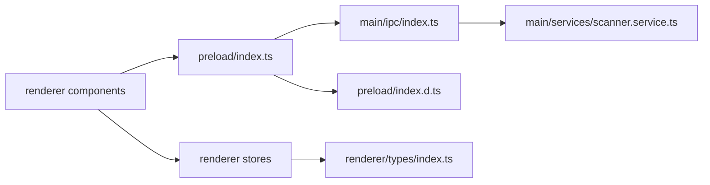

# 文件操作API

<cite>
**本文引用的文件**
- [src/preload/index.ts](file://src/preload/index.ts)
- [src/preload/index.d.ts](file://src/preload/index.d.ts)
- [src/main/ipc/index.ts](file://src/main/ipc/index.ts)
- [src/main/services/scanner.service.ts](file://src/main/services/scanner.service.ts)
- [src/renderer/src/types/index.ts](file://src/renderer/src/types/index.ts)
- [src/renderer/src/stores/scanStore.ts](file://src/renderer/src/stores/scanStore.ts)
- [src/renderer/src/components/ImportStep.tsx](file://src/renderer/src/components/ImportStep.tsx)
- [src/renderer/src/components/ScanningStep.tsx](file://src/renderer/src/components/ScanningStep.tsx)
</cite>

## 目录
1. [简介](#简介)
2. [项目结构](#项目结构)
3. [核心组件](#核心组件)
4. [架构概览](#架构概览)
5. [详细组件分析](#详细组件分析)
6. [依赖关系分析](#依赖关系分析)
7. [性能考量](#性能考量)
8. [故障排除指南](#故障排除指南)
9. [结论](#结论)
10. [附录](#附录)

## 简介
本文件面向红ophoto应用的文件操作API，重点阐述两个关键接口：
- 文件夹选择API：selectFolder
- 文件夹扫描API：scanFolder

文档将从类型定义、实现细节、错误处理、参数校验、调用示例与最佳实践等维度进行系统化说明，并结合渲染层组件展示如何在UI中正确使用这些API。

## 项目结构
该应用采用Electron架构，前端通过preload桥接暴露安全的API给渲染进程；主进程负责实际的文件系统操作并通过IPC与渲染进程通信。

图表来源
- [src/renderer/src/components/ImportStep.tsx:1-155](file://src/renderer/src/components/ImportStep.tsx#L1-L155)
- [src/renderer/src/components/ScanningStep.tsx:1-84](file://src/renderer/src/components/ScanningStep.tsx#L1-L84)
- [src/renderer/src/stores/scanStore.ts:1-52](file://src/renderer/src/stores/scanStore.ts#L1-L52)
- [src/renderer/src/types/index.ts:1-58](file://src/renderer/src/types/index.ts#L1-L58)
- [src/preload/index.ts:1-123](file://src/preload/index.ts#L1-L123)
- [src/preload/index.d.ts:1-51](file://src/preload/index.d.ts#L1-L51)
- [src/main/ipc/index.ts:1-156](file://src/main/ipc/index.ts#L1-L156)
- [src/main/services/scanner.service.ts:1-86](file://src/main/services/scanner.service.ts#L1-L86)

章节来源
- [src/preload/index.ts:1-123](file://src/preload/index.ts#L1-L123)
- [src/main/ipc/index.ts:1-156](file://src/main/ipc/index.ts#L1-L156)
- [src/main/services/scanner.service.ts:1-86](file://src/main/services/scanner.service.ts#L1-L86)
- [src/renderer/src/types/index.ts:1-58](file://src/renderer/src/types/index.ts#L1-L58)
- [src/renderer/src/stores/scanStore.ts:1-52](file://src/renderer/src/stores/scanStore.ts#L1-L52)
- [src/renderer/src/components/ImportStep.tsx:1-155](file://src/renderer/src/components/ImportStep.tsx#L1-L155)
- [src/renderer/src/components/ScanningStep.tsx:1-84](file://src/renderer/src/components/ScanningStep.tsx#L1-L84)

## 核心组件
- 预加载脚本暴露统一的ElectronAPI接口，其中包含selectFolder与scanFolder两个方法。
- 主进程IPC处理器接收渲染进程请求，调用扫描服务执行实际文件遍历与统计。
- 扫描服务负责递归遍历目录、过滤受支持扩展名、生成FileInfo列表并上报进度。
- 渲染层组件通过store管理状态，监听进度事件并更新UI。

章节来源
- [src/preload/index.ts:61-71](file://src/preload/index.ts#L61-L71)
- [src/main/ipc/index.ts:31-53](file://src/main/ipc/index.ts#L31-L53)
- [src/main/services/scanner.service.ts:28-85](file://src/main/services/scanner.service.ts#L28-L85)
- [src/renderer/src/stores/scanStore.ts:6-23](file://src/renderer/src/stores/scanStore.ts#L6-L23)

## 架构概览
下面以序列图展示selectFolder与scanFolder的端到端调用流程。

图表来源
- [src/renderer/src/components/ImportStep.tsx:10-41](file://src/renderer/src/components/ImportStep.tsx#L10-L41)
- [src/preload/index.ts:67-70](file://src/preload/index.ts#L67-L70)
- [src/main/ipc/index.ts:31-53](file://src/main/ipc/index.ts#L31-L53)
- [src/main/services/scanner.service.ts:28-85](file://src/main/services/scanner.service.ts#L28-L85)

## 详细组件分析

### selectFolder 接口
- 功能：打开系统文件夹选择对话框，返回用户选择的路径或null。
- 返回类型：Promise<string | null>
- 行为说明：
  - 用户取消选择时返回null。
  - 成功选择时返回所选目录的绝对路径字符串。
- 错误处理：
  - 由Electron对话框内部处理，外部通过返回值区分是否取消。
  - 建议在调用后对返回值进行判空处理，避免后续操作传入无效路径。
- 类型定义与声明：
  - 预加载脚本导出接口包含该方法签名。
  - 类型声明文件提供全局Window.api的类型约束。

章节来源
- [src/preload/index.ts:67-68](file://src/preload/index.ts#L67-L68)
- [src/preload/index.d.ts:18-18](file://src/preload/index.d.ts#L18-L18)
- [src/main/ipc/index.ts:32-39](file://src/main/ipc/index.ts#L32-L39)

### scanFolder 接口
- 功能：扫描指定目录下的所有受支持图片文件，返回FileInfo数组。
- 参数：
  - folderPath: string（必填）
- 返回类型：Promise<FileInfo[]>
- 进度通知：
  - 主进程在扫描阶段通过'scan:progress'事件向渲染进程推送进度数据。
  - 渲染层通过onScanProgress订阅并更新UI。
- 文件过滤规则：
  - 支持扩展名集合：'.jpg', '.jpeg', '.png', '.gif', '.bmp', '.webp', '.tiff', '.tif'
  - 仅扫描文件，跳过子目录不可访问的情况。
- FileInfo 字段：
  - id: string（基于路径生成的唯一标识）
  - path: string（文件绝对路径）
  - name: string（文件名）
  - size: number（字节）
  - ext: string（小写扩展名）
  - modifiedTime: number（修改时间戳，毫秒）

章节来源
- [src/preload/index.ts:69-70](file://src/preload/index.ts#L69-L70)
- [src/preload/index.d.ts:19-19](file://src/preload/index.d.ts#L19-L19)
- [src/main/ipc/index.ts:42-53](file://src/main/ipc/index.ts#L42-L53)
- [src/main/services/scanner.service.ts:4-6](file://src/main/services/scanner.service.ts#L4-L6)
- [src/main/services/scanner.service.ts:8-15](file://src/main/services/scanner.service.ts#L8-L15)
- [src/main/services/scanner.service.ts:28-85](file://src/main/services/scanner.service.ts#L28-L85)
- [src/renderer/src/types/index.ts:1-8](file://src/renderer/src/types/index.ts#L1-L8)

### 类型定义与接口
- FileInfo：文件元信息，用于描述单个图片文件。
- ScanProgress：扫描阶段进度，包含当前阶段、已处理数量、总数、百分比。
- ElectronAPI：预加载脚本暴露的API集合，包含selectFolder与scanFolder的类型签名。

章节来源
- [src/renderer/src/types/index.ts:1-8](file://src/renderer/src/types/index.ts#L1-L8)
- [src/renderer/src/types/index.ts:45-50](file://src/renderer/src/types/index.ts#L45-L50)
- [src/preload/index.ts:3-52](file://src/preload/index.ts#L3-L52)
- [src/preload/index.d.ts:1-51](file://src/preload/index.d.ts#L1-L51)

### 调用示例与最佳实践
- 选择文件夹：
  - 在导入步骤中，用户点击选择按钮后调用selectFolder。
  - 对返回值进行判空处理，成功则保存到store并清空错误状态。
- 开始扫描：
  - 订阅扫描进度事件，设置阶段为“scanning”。
  - 调用scanFolder(folderPath)，若返回空数组提示用户重新选择。
  - 将扫描结果存入store，进入下一步处理。
- 错误捕获与用户反馈：
  - 组件内使用try/catch包裹API调用，捕获异常并显示错误消息。
  - 使用store.error字段统一管理错误状态，便于UI展示。
- 最佳实践：
  - 在调用scanFolder前确保folderPath非空且存在。
  - 合理使用进度回调，避免阻塞UI线程。
  - 对于大量文件，建议分批处理或限制并发，提升用户体验。

章节来源
- [src/renderer/src/components/ImportStep.tsx:10-41](file://src/renderer/src/components/ImportStep.tsx#L10-L41)
- [src/renderer/src/components/ScanningStep.tsx:44-77](file://src/renderer/src/components/ScanningStep.tsx#L44-L77)
- [src/renderer/src/stores/scanStore.ts:6-23](file://src/renderer/src/stores/scanStore.ts#L6-L23)

### 复杂逻辑流程图：scanFolder 扫描过程

图表来源
- [src/main/services/scanner.service.ts:28-85](file://src/main/services/scanner.service.ts#L28-L85)

## 依赖关系分析
- 预加载API依赖Electron ipcRenderer.invoke与on，向主进程发起请求并接收事件。
- 主进程IPC处理器依赖dialog与BrowserWindow，负责弹窗与窗口控制；同时委托扫描服务执行文件系统操作。
- 扫描服务依赖fs与path模块，实现目录遍历与文件属性读取。
- 渲染层组件依赖store与types，管理UI状态与类型约束。

图表来源
- [src/preload/index.ts:1-123](file://src/preload/index.ts#L1-L123)
- [src/main/ipc/index.ts:1-156](file://src/main/ipc/index.ts#L1-L156)
- [src/main/services/scanner.service.ts:1-86](file://src/main/services/scanner.service.ts#L1-L86)
- [src/renderer/src/types/index.ts:1-58](file://src/renderer/src/types/index.ts#L1-L58)
- [src/renderer/src/stores/scanStore.ts:1-52](file://src/renderer/src/stores/scanStore.ts#L1-L52)

章节来源
- [src/preload/index.ts:1-123](file://src/preload/index.ts#L1-L123)
- [src/main/ipc/index.ts:1-156](file://src/main/ipc/index.ts#L1-L156)
- [src/main/services/scanner.service.ts:1-86](file://src/main/services/scanner.service.ts#L1-L86)
- [src/renderer/src/types/index.ts:1-58](file://src/renderer/src/types/index.ts#L1-L58)
- [src/renderer/src/stores/scanStore.ts:1-52](file://src/renderer/src/stores/scanStore.ts#L1-L52)

## 性能考量
- 事件循环让出：扫描过程中每处理一定数量文件后让出事件循环，避免长时间阻塞UI线程。
- 分批处理：对于后续的哈希与去重任务，主进程也采用了分批处理策略，减少内存峰值与CPU占用。
- 扩展名过滤：在第一遍遍历时即过滤不支持的扩展名，减少后续stat与哈希计算开销。
- 大文件处理：当前扫描API仅返回文件元信息，不直接读取文件内容；哈希计算在后续阶段进行，避免一次性加载大文件。

章节来源
- [src/main/services/scanner.service.ts:78-82](file://src/main/services/scanner.service.ts#L78-L82)
- [src/main/ipc/index.ts:55-83](file://src/main/ipc/index.ts#L55-L83)

## 故障排除指南
- 选择文件夹返回null：
  - 可能用户取消了对话框。应在调用后检查返回值并提示用户重新选择。
- 扫描无结果：
  - 检查folderPath是否指向包含受支持扩展名的目录。
  - 确认目录权限允许读取。
- 进度不更新：
  - 确保已正确订阅onScanProgress事件并在组件卸载时移除监听。
- 错误信息显示：
  - 使用store.error统一管理错误状态，组件中根据状态渲染错误提示。

章节来源
- [src/renderer/src/components/ImportStep.tsx:10-41](file://src/renderer/src/components/ImportStep.tsx#L10-L41)
- [src/renderer/src/components/ScanningStep.tsx:44-77](file://src/renderer/src/components/ScanningStep.tsx#L44-L77)
- [src/preload/index.ts:103-119](file://src/preload/index.ts#L103-L119)

## 结论
本文档系统梳理了红ophoto应用的文件夹选择与扫描API，明确了类型定义、实现细节、错误处理与性能策略，并提供了调用示例与最佳实践。通过预加载API桥接、主进程IPC处理器与扫描服务的协作，实现了稳定高效的文件扫描能力。建议在实际开发中遵循本文档的参数校验、错误捕获与用户反馈规范，以获得更好的用户体验。

## 附录
- 关键API与类型定义参考路径：
  - [selectFolder 类型定义:18-18](file://src/preload/index.d.ts#L18-L18)
  - [scanFolder 类型定义:19-19](file://src/preload/index.d.ts#L19-L19)
  - [FileInfo 定义:1-8](file://src/renderer/src/types/index.ts#L1-L8)
  - [ScanProgress 定义:45-50](file://src/renderer/src/types/index.ts#L45-L50)
  - [预加载API导出:61-71](file://src/preload/index.ts#L61-L71)
  - [IPC处理器注册:22-53](file://src/main/ipc/index.ts#L22-L53)
  - [扫描服务实现:28-85](file://src/main/services/scanner.service.ts#L28-L85)