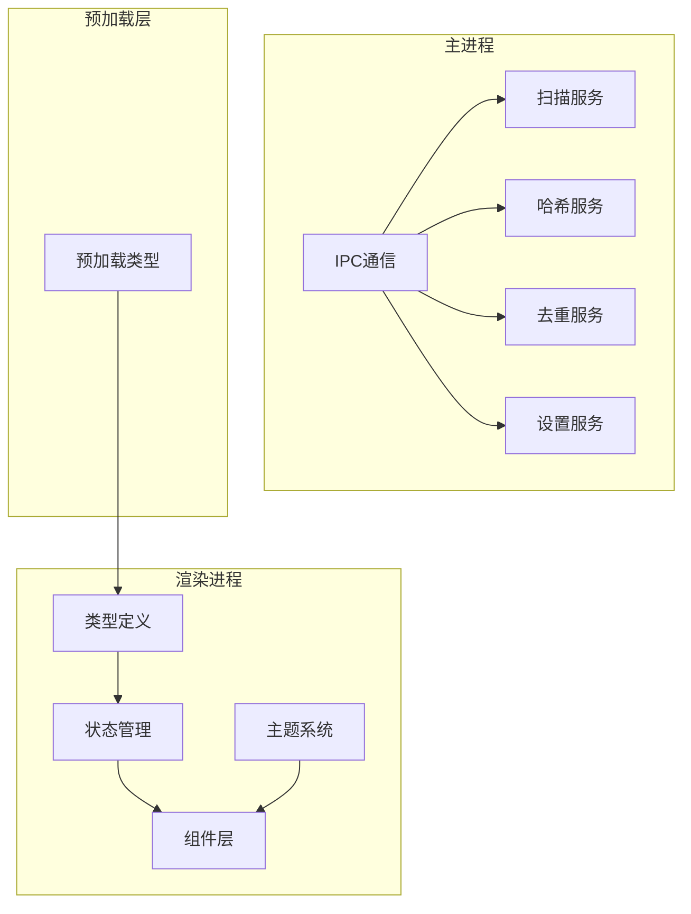
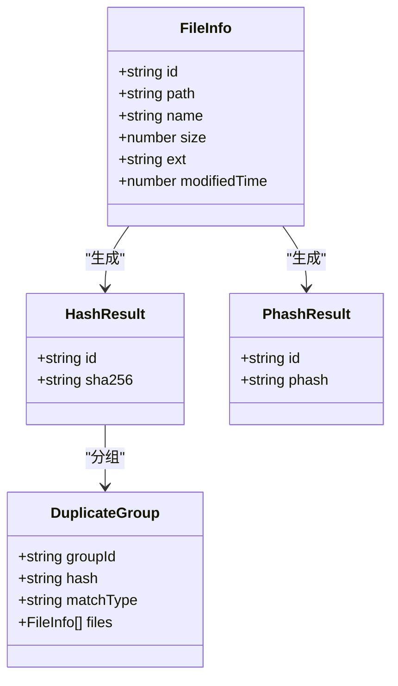
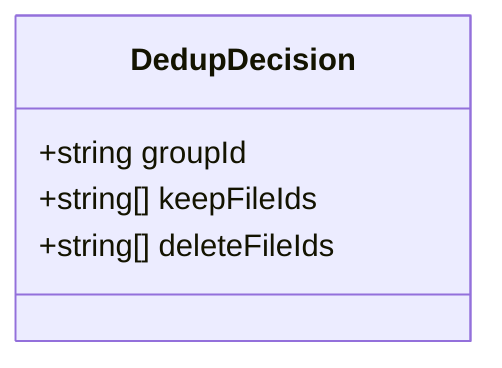
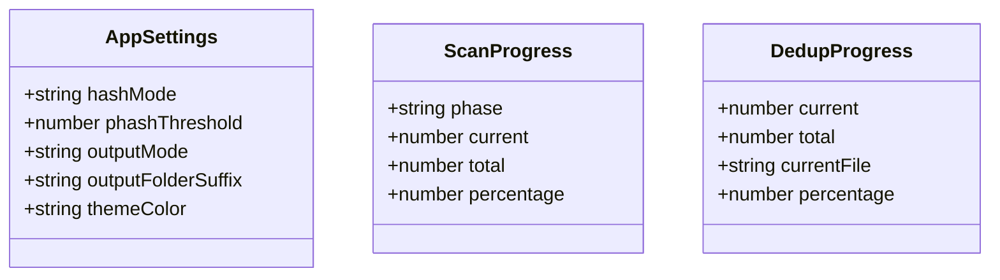
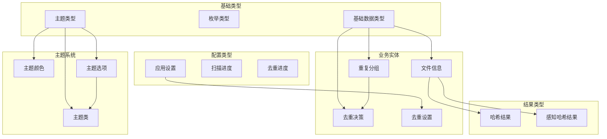
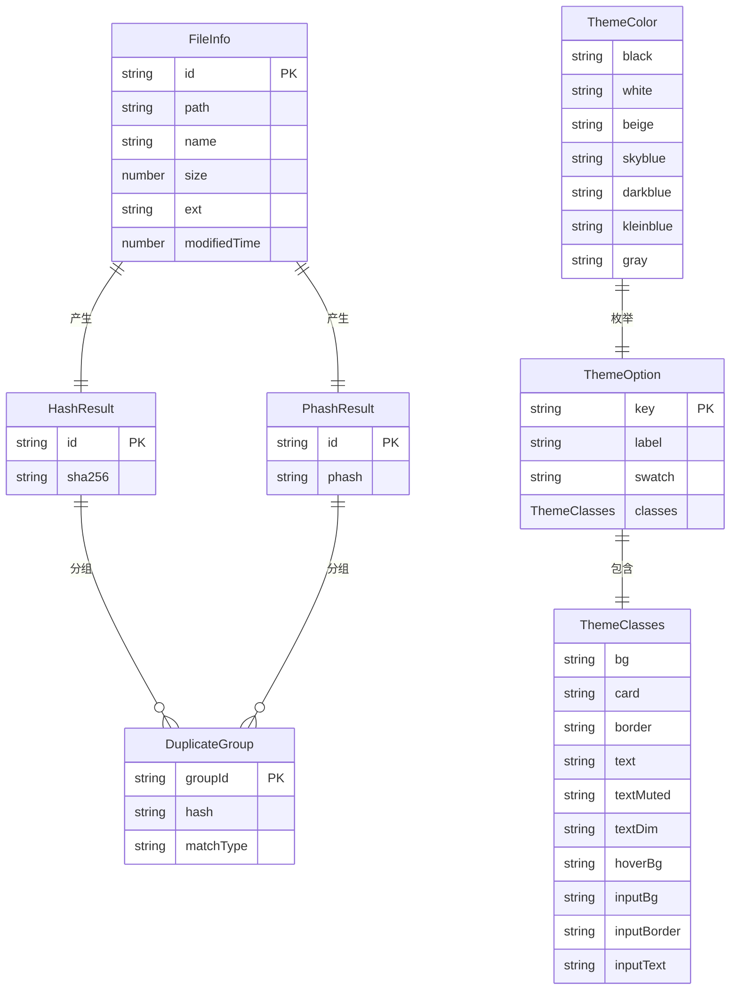
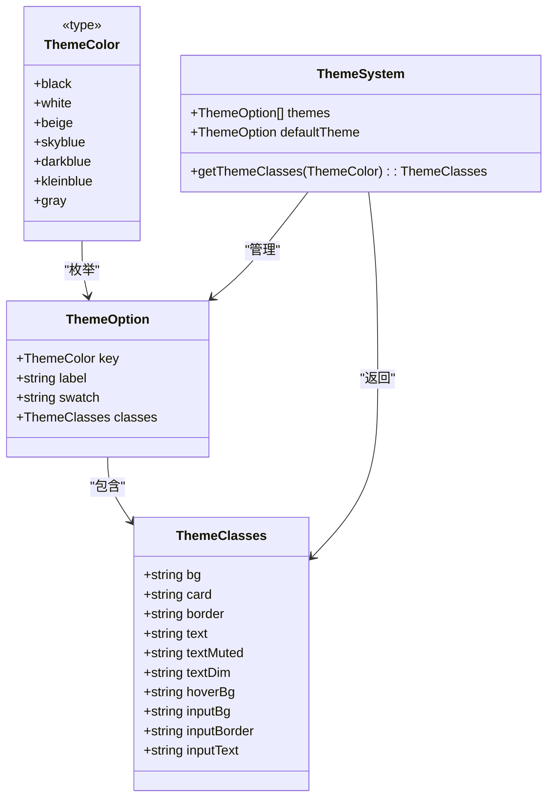
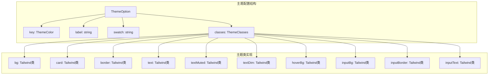
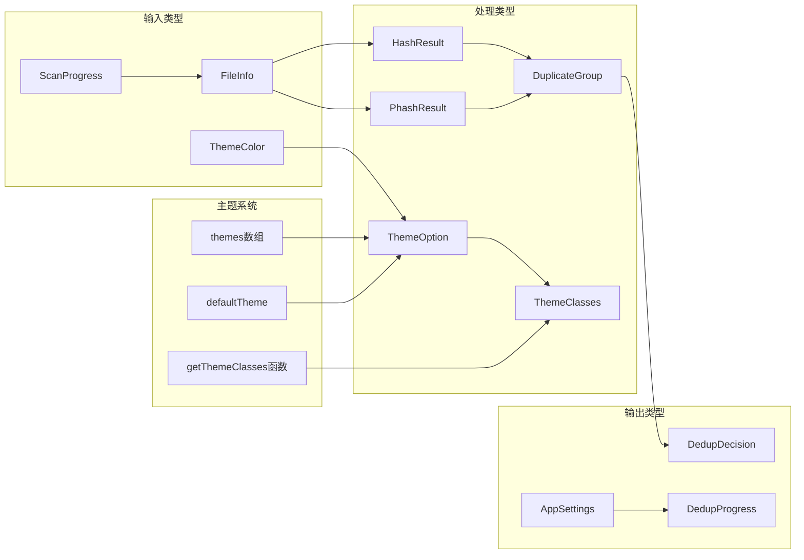

# 类型定义参考

<cite>
**本文档引用的文件**
- [src/main/services/dedup.service.ts](file://src/main/services/dedup.service.ts)
- [src/main/services/hash.service.ts](file://src/main/services/hash.service.ts)
- [src/main/services/scanner.service.ts](file://src/main/services/scanner.service.ts)
- [src/main/services/settings.service.ts](file://src/main/services/settings.service.ts)
- [src/preload/index.d.ts](file://src/preload/index.d.ts)
- [src/renderer/src/types/index.ts](file://src/renderer/src/types/index.ts)
- [src/renderer/src/types/theme.ts](file://src/renderer/src/types/theme.ts)
- [src/renderer/src/stores/dedupStore.ts](file://src/renderer/src/stores/dedupStore.ts)
- [src/renderer/src/stores/scanStore.ts](file://src/renderer/src/stores/scanStore.ts)
- [src/renderer/src/stores/settingsStore.ts](file://src/renderer/src/stores/settingsStore.ts)
- [src/renderer/src/App.tsx](file://src/renderer/src/App.tsx)
- [src/renderer/src/components/SettingsPanel.tsx](file://src/renderer/src/components/SettingsPanel.tsx)
- [src/renderer/src/components/CompareStep.tsx](file://src/renderer/src/components/CompareStep.tsx)
- [src/renderer/src/components/ExecuteStep.tsx](file://src/renderer/src/components/ExecuteStep.tsx)
- [src/renderer/src/components/ImportStep.tsx](file://src/renderer/src/components/ImportStep.tsx)
- [src/renderer/src/components/ScanningStep.tsx](file://src/renderer/src/components/ScanningStep.tsx)
- [src/renderer/src/components/TitleBar.tsx](file://src/renderer/src/components/TitleBar.tsx)
</cite>

## 更新摘要
**所做更改**
- 更新主题颜色系统类型定义：将ThemeColor枚举中的'qing'替换为'gray'
- 为ThemeClasses接口添加inputBg、inputBorder、inputText三个新属性
- 更新所有主题配置中的颜色映射，确保与新的input属性一致
- 更新应用设置类型以反映最新的主题颜色配置

## 目录
1. [简介](#简介)
2. [项目结构](#项目结构)
3. [核心组件](#核心组件)
4. [架构概览](#架构概览)
5. [详细组件分析](#详细组件分析)
6. [主题颜色系统](#主题颜色系统)
7. [依赖分析](#依赖分析)
8. [性能考虑](#性能考虑)
9. [故障排除指南](#故障排除指南)
10. [结论](#结论)

## 简介
本参考文档为红ophoto应用提供完整的TypeScript类型定义说明，涵盖文件扫描、哈希计算、去重处理、设置管理和主题颜色系统等核心功能模块的类型系统。文档重点解释FileInfo、HashResult、PhashResult、DuplicateGroup、DedupDecision、AppSettings等关键类型的设计意图、数据结构和使用模式，以及新增的主题颜色系统类型定义。

## 项目结构
红ophoto采用Electron架构，包含主进程服务层、渲染进程类型系统和主题颜色系统三大部分：

**图表来源**
- [src/main/services/scanner.service.ts](file://src/main/services/scanner.service.ts)
- [src/main/services/hash.service.ts](file://src/main/services/hash.service.ts)
- [src/main/services/dedup.service.ts](file://src/main/services/dedup.service.ts)
- [src/main/services/settings.service.ts](file://src/main/services/settings.service.ts)
- [src/preload/index.d.ts](file://src/preload/index.d.ts)
- [src/renderer/src/types/theme.ts](file://src/renderer/src/types/theme.ts)

**章节来源**
- [src/main/services/scanner.service.ts](file://src/main/services/scanner.service.ts)
- [src/main/services/hash.service.ts](file://src/main/services/hash.service.ts)
- [src/main/services/dedup.service.ts](file://src/main/services/dedup.service.ts)
- [src/main/services/settings.service.ts](file://src/main/services/settings.service.ts)
- [src/preload/index.d.ts](file://src/preload/index.d.ts)
- [src/renderer/src/types/theme.ts](file://src/renderer/src/types/theme.ts)

## 核心组件

### 文件信息类型体系
文件信息类型是整个应用的核心抽象，用于描述扫描到的媒体文件元数据：

**图表来源**
- [src/main/services/hash.service.ts](file://src/main/services/hash.service.ts)
- [src/main/services/dedup.service.ts](file://src/main/services/dedup.service.ts)

### 去重决策类型
去重决策类型定义了自动处理策略和用户交互选项：

**图表来源**
- [src/main/services/dedup.service.ts](file://src/main/services/dedup.service.ts)

### 应用设置类型
应用设置类型提供了配置管理和持久化存储的类型安全保证：

**图表来源**
- [src/main/services/settings.service.ts](file://src/main/services/settings.service.ts)
- [src/renderer/src/stores/settingsStore.ts](file://src/renderer/src/stores/settingsStore.ts)
- [src/renderer/src/types/index.ts](file://src/renderer/src/types/index.ts)

**章节来源**
- [src/main/services/hash.service.ts](file://src/main/services/hash.service.ts)
- [src/main/services/dedup.service.ts](file://src/main/services/dedup.service.ts)
- [src/main/services/settings.service.ts](file://src/main/services/settings.service.ts)
- [src/renderer/src/stores/settingsStore.ts](file://src/renderer/src/stores/settingsStore.ts)
- [src/renderer/src/types/index.ts](file://src/renderer/src/types/index.ts)

## 架构概览

### 类型层次结构
应用的类型系统遵循清晰的层次结构设计，新增主题颜色系统类型：

**图表来源**
- [src/main/services/hash.service.ts](file://src/main/services/hash.service.ts)
- [src/main/services/dedup.service.ts](file://src/main/services/dedup.service.ts)
- [src/main/services/settings.service.ts](file://src/main/services/settings.service.ts)
- [src/renderer/src/types/theme.ts](file://src/renderer/src/types/theme.ts)
- [src/renderer/src/types/index.ts](file://src/renderer/src/types/index.ts)

### 类型关系图
展示核心类型之间的关联关系和依赖模式，包括新增的主题系统：

**图表来源**
- [src/main/services/hash.service.ts](file://src/main/services/hash.service.ts)
- [src/main/services/dedup.service.ts](file://src/main/services/dedup.service.ts)
- [src/renderer/src/types/theme.ts](file://src/renderer/src/types/theme.ts)
- [src/renderer/src/types/index.ts](file://src/renderer/src/types/index.ts)

## 详细组件分析

### FileInfo 类型详解
FileInfo是文件扫描的核心抽象，代表单个文件的完整信息：

| 字段名 | 类型 | 必填 | 约束条件 | 业务含义 |
|--------|------|------|----------|----------|
| id | string | 是 | 非空，唯一标识符 | 文件的唯一ID |
| path | string | 是 | 非空，有效文件路径 | 文件在文件系统中的完整路径 |
| name | string | 是 | 非空，UTF-8编码 | 文件名称（不含扩展名） |
| size | number | 是 | > 0，整数 | 文件大小（字节） |
| ext | string | 是 | 有效文件扩展名 | 文件扩展名（小写） |
| modifiedTime | number | 是 | 有效时间戳 | 文件最后修改时间（Unix时间戳） |

**使用示例路径**
- [文件信息创建](file://src/main/services/scanner.service.ts)
- [文件信息更新](file://src/main/services/hash.service.ts)

**最佳实践**
- 始终验证path的有效性
- 处理大文件时注意内存限制
- 使用UTC时间确保跨时区一致性

### HashResult 类型详解
HashResult封装了文件哈希计算的结果和状态信息：

| 字段名 | 类型 | 必填 | 约束条件 | 业务含义 |
|--------|------|------|----------|----------|
| id | string | 是 | 与输入文件ID一致 | 对应的文件ID |
| sha256 | string | 是 | 64字符十六进制 | SHA-256哈希值 |

**使用示例路径**
- [哈希计算实现](file://src/main/services/hash.service.ts)
- [异步哈希处理](file://src/main/services/hash.service.ts)

**最佳实践**
- 检查success标志后再使用hash值
- 实现重试机制处理临时失败
- 使用流式处理大文件

### PhashResult 类型详解
PhashResult专门处理感知哈希计算，用于相似图片检测：

| 字段名 | 类型 | 必填 | 约束条件 | 业务含义 |
|--------|------|------|----------|----------|
| id | string | 是 | 与输入文件ID一致 | 对应的文件ID |
| phash | string | 是 | 64位二进制字符串 | 感知哈希值 |

**使用示例路径**
- [感知哈希计算](file://src/main/services/hash.service.ts)
- [相似度比较](file://src/main/services/dedup.service.ts)

**最佳实践**
- 感知哈希更适合视觉相似性而非完全相同
- 结合阈值参数调整敏感度
- 注意图像预处理对phash的影响

### DuplicateGroup 类型详解
DuplicateGroup表示具有相同哈希值的文件分组：

| 字段名 | 类型 | 必填 | 约束条件 | 业务含义 |
|--------|------|------|----------|----------|
| groupId | string | 是 | 唯一标识符 | 分组的唯一ID |
| hash | string | 是 | 与文件哈希值一致 | 分组标识符 |
| matchType | 'exact' \| 'similar' | 是 | 枚举值 | 匹配类型（完全相同或相似） |
| files | FileInfo[] | 是 | 非空数组 | 该分组内的所有文件 |

**使用示例路径**
- [重复文件分组](file://src/main/services/dedup.service.ts)
- [分组统计分析](file://src/main/services/dedup.service.ts)

**最佳实践**
- 确保files数组不为空
- 实现按修改时间排序的默认策略
- 提供文件大小排序选项

### DedupDecision 类型详解
DedupDecision定义了去重决策的类型系统：

**图表来源**
- [src/main/services/dedup.service.ts](file://src/main/services/dedup.service.ts)

**使用示例路径**
- [自动决策实现](file://src/main/services/dedup.service.ts)
- [用户交互处理](file://src/main/services/dedup.service.ts)

**最佳实践**
- 为每种决策类型提供明确的业务逻辑
- 实现决策历史记录便于审计
- 支持用户自定义决策规则

### AppSettings 类型详解
AppSettings提供完整的应用配置管理，包含最新的主题颜色配置：

| 字段名 | 类型 | 必填 | 约束条件 | 业务含义 |
|--------|------|------|----------|----------|
| hashMode | 'sha256' \| 'phash' \| 'both' | 否 | 默认'sha256' | 哈希检测模式 |
| phashThreshold | number | 否 | 1-15范围 | 感知哈希阈值 |
| outputMode | 'copy' \| 'delete' | 否 | 默认'copy' | 输出处理模式 |
| outputFolderSuffix | string | 否 | 默认'New' | 输出文件夹后缀 |
| themeColor | 'black' \| 'white' \| 'beige' \| 'skyblue' \| 'darkblue' \| 'kleinblue' \| 'gray' | 否 | 默认'black' | 主题颜色设置 |

**使用示例路径**
- [设置持久化](file://src/main/services/settings.service.ts)
- [设置验证](file://src/main/services/settings.service.ts)

**最佳实践**
- 实现设置迁移机制
- 提供默认值回退
- 支持设置导入导出

## 主题颜色系统

### 主题类型体系
主题颜色系统为应用提供了灵活的主题定制能力，包含七种预设主题：

**图表来源**
- [src/renderer/src/types/theme.ts](file://src/renderer/src/types/theme.ts)

### 主题颜色枚举
ThemeColor类型定义了七种可用的主题颜色，其中'qing'已更新为'gray'：

| 颜色键 | 中文标签 | 十六进制色值 | 设计特点 |
|--------|----------|--------------|----------|
| black | 深灰色 | #0f172a | 深色主题，适合夜间使用 |
| white | 白色 | #f8fafc | 浅色主题，简洁明亮 |
| beige | 米色 | #f5f0e8 | 温暖色调，舒适自然 |
| skyblue | 天蓝色 | #e0f2fe | 清新蓝色，视觉放松 |
| darkblue | 深蓝色 | #172554 | 深邃蓝色，专业稳重 |
| kleinblue | 克莱因蓝 | #002FA7 | 纯正蓝色，经典优雅 |
| gray | 灰色 | #6b7280 | 中性色调，平衡和谐 |

**更新** 将原有的'qing'（群青色）替换为'gray'（灰色），提供更中性的主题选择。

**使用示例路径**
- [主题颜色定义](file://src/renderer/src/types/theme.ts)
- [主题颜色使用](file://src/renderer/src/components/SettingsPanel.tsx)

### 主题类定义
ThemeClasses接口定义了主题系统的核心样式类，新增了三个输入相关属性：

| 字段名 | 类型 | 必填 | 约束条件 | Tailwind CSS类 | 业务含义 |
|--------|------|------|----------|----------------|----------|
| bg | string | 是 | Tailwind背景类 | bg-... | 页面背景色 |
| card | string | 是 | Tailwind卡片类 | bg-... | 卡片容器背景 |
| border | string | 是 | Tailwind边框类 | border-... | 边框样式 |
| text | string | 是 | Tailwind文本类 | text-... | 主要文本颜色 |
| textMuted | string | 是 | Tailwind文本类 | text-... | 柔和文本颜色 |
| textDim | string | 是 | Tailwind文本类 | text-... | 淡色文本颜色 |
| hoverBg | string | 是 | Tailwind悬停类 | hover:bg-... | 悬停背景效果 |
| inputBg | string | 是 | Tailwind输入类 | bg-... | 输入框背景色 |
| inputBorder | string | 是 | Tailwind输入类 | border-... | 输入框边框样式 |
| inputText | string | 是 | Tailwind输入类 | text-... | 输入框文本颜色 |

**更新** 新增inputBg、inputBorder、inputText三个属性，专门用于表单输入控件的主题定制。

**使用示例路径**
- [主题类定义](file://src/renderer/src/types/theme.ts)
- [主题类应用](file://src/renderer/src/components/SettingsPanel.tsx)

### 预设主题实现
每个ThemeOption包含完整的主题配置信息，所有主题都已更新以支持新的输入属性：

**图表来源**
- [src/renderer/src/types/theme.ts](file://src/renderer/src/types/theme.ts)

**使用示例路径**
- [主题配置实现](file://src/renderer/src/types/theme.ts)
- [主题切换逻辑](file://src/renderer/src/App.tsx)

### 主题系统使用模式
主题系统在应用中的使用模式：

1. **主题选择**：用户从预设主题中选择
2. **主题应用**：根据选择的主题动态应用样式
3. **主题切换**：实时切换主题而无需重启应用
4. **主题持久化**：将用户选择的主题保存到设置中

**最佳实践**
- 确保所有主题都有一致的语义化命名
- 为主题颜色提供足够的对比度
- 实现主题预览功能
- 支持暗色/亮色主题的自动适配
- **输入控件主题化**：利用新增的input属性确保表单控件与整体主题协调

**章节来源**
- [src/renderer/src/types/theme.ts](file://src/renderer/src/types/theme.ts)
- [src/renderer/src/App.tsx](file://src/renderer/src/App.tsx)
- [src/renderer/src/components/SettingsPanel.tsx](file://src/renderer/src/components/SettingsPanel.tsx)
- [src/renderer/src/components/CompareStep.tsx](file://src/renderer/src/components/CompareStep.tsx)
- [src/renderer/src/components/ExecuteStep.tsx](file://src/renderer/src/components/ExecuteStep.tsx)
- [src/renderer/src/components/ImportStep.tsx](file://src/renderer/src/components/ImportStep.tsx)
- [src/renderer/src/components/ScanningStep.tsx](file://src/renderer/src/components/ScanningStep.tsx)
- [src/renderer/src/components/TitleBar.tsx](file://src/renderer/src/components/TitleBar.tsx)

## 依赖分析

### 类型依赖关系
应用类型系统的关键依赖关系，包括新增的主题系统：

**图表来源**
- [src/main/services/hash.service.ts](file://src/main/services/hash.service.ts)
- [src/main/services/dedup.service.ts](file://src/main/services/dedup.service.ts)
- [src/main/services/settings.service.ts](file://src/main/services/settings.service.ts)
- [src/renderer/src/types/theme.ts](file://src/renderer/src/types/theme.ts)
- [src/renderer/src/types/index.ts](file://src/renderer/src/types/index.ts)

### 组件耦合度分析
类型系统的耦合度控制良好，新增主题系统保持低耦合设计：

1. **主题系统独立性**：ThemeColor、ThemeClasses、ThemeOption独立定义
2. **主题应用解耦**：getThemeClasses函数提供主题应用的统一入口
3. **组件主题注入**：各组件通过props接收主题类，避免直接依赖主题系统
4. **配置驱动**：主题配置通过themes数组集中管理
5. **输入控件标准化**：新增的input属性确保所有表单控件主题一致性

**章节来源**
- [src/main/services/hash.service.ts](file://src/main/services/hash.service.ts)
- [src/main/services/dedup.service.ts](file://src/main/services/dedup.service.ts)
- [src/main/services/settings.service.ts](file://src/main/services/settings.service.ts)
- [src/renderer/src/types/theme.ts](file://src/renderer/src/types/theme.ts)
- [src/renderer/src/types/index.ts](file://src/renderer/src/types/index.ts)

## 性能考虑
基于类型系统的性能优化建议，包括主题系统的优化：

### 内存管理
- 使用渐进式处理避免大量FileInfo对象同时驻留内存
- 实现对象池减少垃圾回收压力
- 及时清理已处理文件的临时数据
- **主题系统优化**：缓存主题类结果避免重复计算
- **输入控件优化**：复用input相关的主题类减少DOM操作

### 并发处理
- 利用泛型类型支持并行处理模式
- 实现背压机制防止处理队列过载
- 使用Worker线程分离CPU密集型操作
- **主题切换优化**：实现主题切换的防抖机制
- **输入验证优化**：使用类型守卫避免重复的类型检查

### 缓存策略
- 哈希值缓存避免重复计算
- 感知哈希预计算优化相似度比较
- 设置变更缓存减少I/O操作
- **主题类缓存**：缓存getThemeClasses的计算结果
- **输入状态缓存**：缓存表单控件的状态以提高响应速度

### 主题系统性能优化
- 实现主题类的懒加载和缓存
- 避免频繁的主题切换导致的重绘
- 使用CSS变量支持动态主题切换
- 优化主题配置的存储和检索
- **输入控件性能**：批量应用input相关的主题类

## 故障排除指南

### 常见类型错误
1. **类型不匹配错误**
   - 症状：编译时报错提示类型不兼容
   - 解决：检查字段类型定义，确保赋值类型正确

2. **可选字段访问错误**
   - 症状：运行时访问undefined属性
   - 解决：使用类型守卫或提供默认值

3. **枚举值错误**
   - 症状：编译器报错提示枚举值不存在
   - 解决：确认枚举定义和使用的一致性，特别是'gray'替代'qing'

4. **主题类型错误**
   - 症状：主题颜色无法识别或样式不生效
   - 解决：检查ThemeColor枚举值，确认Tailwind类存在
   - **新增**：检查新增的input属性是否正确应用到表单控件

### 调试技巧
- 使用TypeScript的类型检查工具
- 实现类型断言的安全包装函数
- 利用编译器的类型推断功能
- **主题调试**：使用浏览器开发者工具检查CSS类应用
- **输入控件调试**：验证inputBg、inputBorder、inputText属性是否正确应用

**章节来源**
- [src/main/services/hash.service.ts](file://src/main/services/hash.service.ts)
- [src/main/services/dedup.service.ts](file://src/main/services/dedup.service.ts)
- [src/main/services/settings.service.ts](file://src/main/services/settings.service.ts)
- [src/renderer/src/types/theme.ts](file://src/renderer/src/types/theme.ts)
- [src/renderer/src/types/index.ts](file://src/renderer/src/types/index.ts)

## 结论
红ophoto的类型系统设计体现了现代TypeScript开发的最佳实践，通过清晰的类型层次、严格的约束条件、良好的扩展性和新增的主题颜色系统，为复杂的文件处理应用提供了坚实的基础。

**主要成就**：
1. **完整的类型层次**：从基础类型到业务实体的清晰分层
2. **严格的类型约束**：确保数据的完整性和一致性
3. **良好的扩展性**：支持新类型添加而不影响现有结构
4. **强大的主题系统**：提供灵活的主题定制能力，包括新增的输入控件主题支持

**更新亮点**：
1. **主题颜色优化**：将'qing'替换为更实用的'gray'主题
2. **输入控件增强**：新增inputBg、inputBorder、inputText属性，提升表单体验
3. **类型系统完善**：所有主题配置都已更新以支持新的输入属性

**建议开发者在使用这些类型时**：
1. 严格遵守类型定义的约束条件
2. 实现适当的类型守卫和错误处理
3. 充分利用TypeScript的类型推断能力
4. 定期审查和优化类型定义以适应业务需求变化
5. **充分利用主题系统**：合理使用ThemeClasses提升用户体验
6. **关注性能优化**：在主题切换和类型使用中考虑性能影响
7. **输入控件主题化**：善用新增的input属性确保表单控件与整体主题协调

**新增主题系统的特别建议**：
- 为新主题提供完整的Tailwind类映射，包括input属性
- 确保主题颜色的无障碍访问性
- 实现主题预览和测试机制
- 考虑主题的国际化支持
- **输入控件一致性**：确保所有表单控件都正确应用input相关的主题类