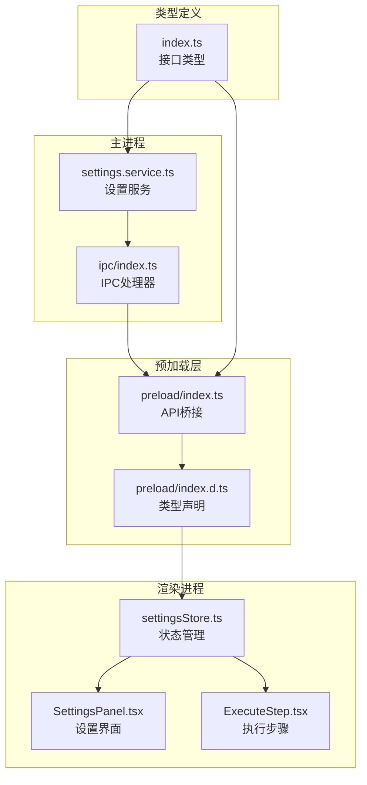
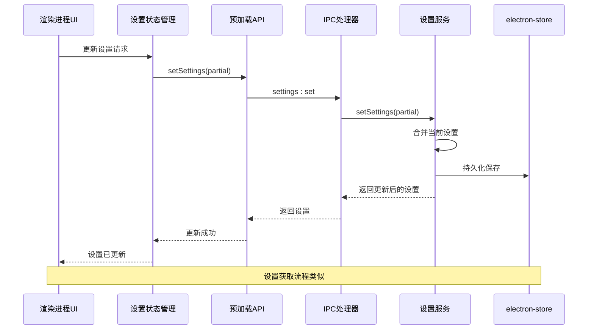
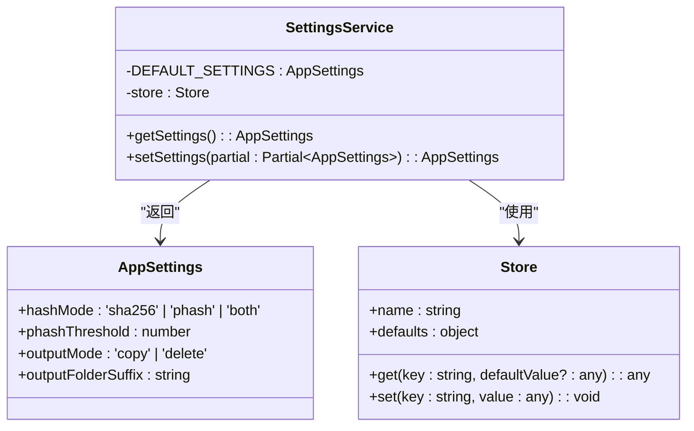
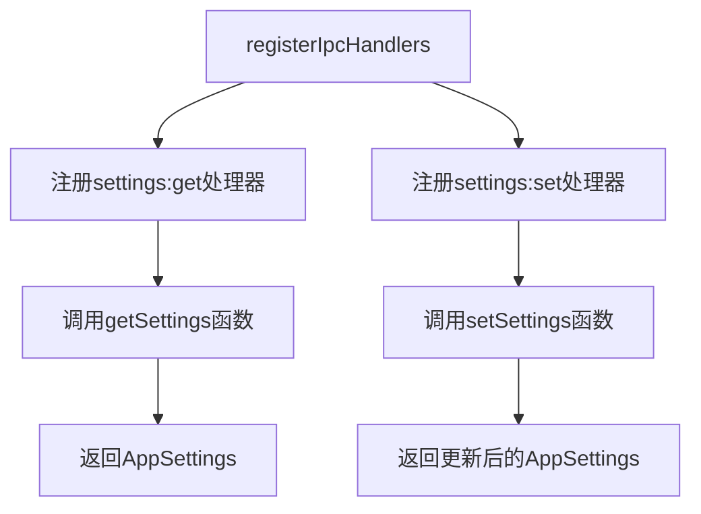
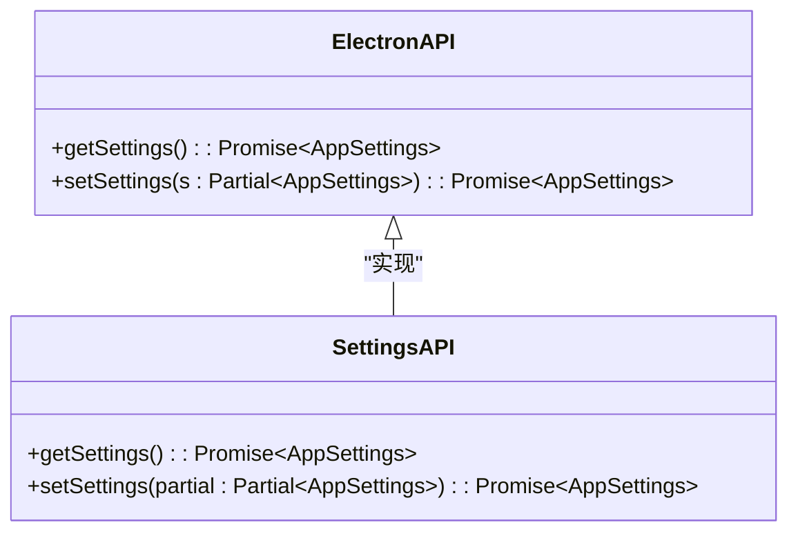
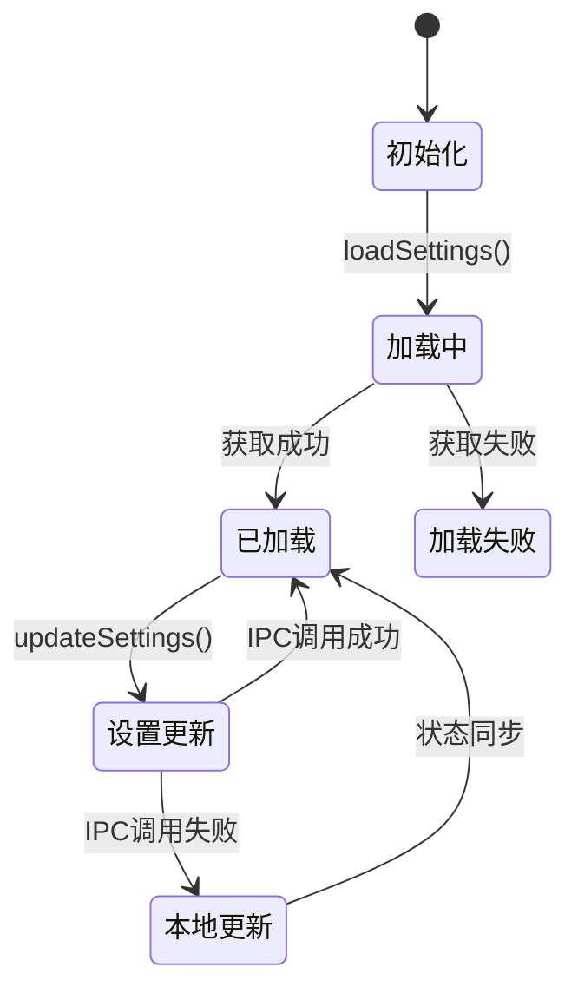

# 设置管理API

<cite>
**本文档引用的文件**
- [settings.service.ts](file://src/main/services/settings.service.ts)
- [settingsStore.ts](file://src/renderer/src/stores/settingsStore.ts)
- [index.ts](file://src/main/ipc/index.ts)
- [index.ts](file://src/preload/index.ts)
- [index.d.ts](file://src/preload/index.d.ts)
- [index.ts](file://src/renderer/src/types/index.ts)
- [SettingsPanel.tsx](file://src/renderer/src/components/SettingsPanel.tsx)
- [ExecuteStep.tsx](file://src/renderer/src/components/ExecuteStep.tsx)
- [package.json](file://package.json)
</cite>

## 目录
1. [简介](#简介)
2. [项目结构](#项目结构)
3. [核心组件](#核心组件)
4. [架构概览](#架构概览)
5. [详细组件分析](#详细组件分析)
6. [依赖关系分析](#依赖关系分析)
7. [性能考虑](#性能考虑)
8. [故障排除指南](#故障排除指南)
9. [结论](#结论)
10. [附录](#附录)

## 简介

Redophoto应用的设置管理API提供了完整的应用配置功能，包括设置获取和设置更新两大核心功能。该API支持多种哈希算法模式、相似度检测阈值配置以及输出模式选择，为用户提供灵活的照片去重解决方案。

本API采用Electron主进程-渲染进程通信架构，通过IPC（Inter-Process Communication）实现安全的设置管理。设置数据持久化使用electron-store库，确保用户配置在应用重启后仍能保持。

## 项目结构

设置管理API涉及以下关键文件和模块：



**图表来源**
- [settings.service.ts:1-34](file://src/main/services/settings.service.ts#L1-L34)
- [ipc/index.ts:152-155](file://src/main/ipc/index.ts#L152-L155)
- [preload/index.ts:61-100](file://src/preload/index.ts#L61-L100)

**章节来源**
- [settings.service.ts:1-34](file://src/main/services/settings.service.ts#L1-L34)
- [ipc/index.ts:152-155](file://src/main/ipc/index.ts#L152-L155)
- [preload/index.ts:61-100](file://src/preload/index.ts#L61-L100)

## 核心组件

### 应用设置接口定义

应用设置系统包含两个主要接口：`AppSettings`和`DedupSettings`。

#### AppSettings 接口

| 属性名 | 类型 | 默认值 | 描述 |
|--------|------|--------|------|
| `hashMode` | `'sha256' \| 'phash' \| 'both'` | `'sha256'` | 哈希算法模式 |
| `phashThreshold` | `number` | `5` | pHash相似度阈值 |
| `outputMode` | `'copy' \| 'delete'` | `'copy'` | 输出处理模式 |
| `outputFolderSuffix` | `string` | `'New'` | 输出文件夹后缀 |

#### DedupSettings 接口

| 属性名 | 类型 | 描述 |
|--------|------|------|
| `outputMode` | `'copy' \| 'delete'` | 输出处理模式 |
| `outputFolderName` | `string` | 输出文件夹名称 |

**章节来源**
- [settings.service.ts:3-8](file://src/main/services/settings.service.ts#L3-L8)
- [settings.service.ts:10-15](file://src/main/services/settings.service.ts#L10-L15)
- [types/index.ts:33-36](file://src/renderer/src/types/index.ts#L33-L36)
- [types/index.ts:38-43](file://src/renderer/src/types/index.ts#L38-L43)

### 设置获取API

`getSettings()`函数提供完整的设置获取功能，具有以下特性：

- **默认值合并**：自动合并默认设置与存储的设置
- **类型安全**：返回完整的`AppSettings`接口
- **持久化读取**：从electron-store中读取用户配置

### 设置更新API

`setSettings(partial: Partial<AppSettings>)`函数支持部分设置更新：

- **部分更新**：只更新指定的设置项
- **类型约束**：使用`Partial<AppSettings>`确保类型安全
- **原子性**：整个更新过程保持一致性
- **持久化**：自动保存到本地存储

**章节来源**
- [settings.service.ts:24-33](file://src/main/services/settings.service.ts#L24-L33)

## 架构概览

设置管理API采用分层架构设计，确保安全性和可维护性：



**图表来源**
- [settingsStore.ts:29-39](file://src/renderer/src/stores/settingsStore.ts#L29-L39)
- [preload/index.ts:99-100](file://src/preload/index.ts#L99-L100)
- [ipc/index.ts:154](file://src/main/ipc/index.ts#L154)
- [settings.service.ts:28-33](file://src/main/services/settings.service.ts#L28-L33)

## 详细组件分析

### 设置服务实现

设置服务是整个设置管理的核心，负责数据的持久化和业务逻辑处理。

#### 数据结构设计



**图表来源**
- [settings.service.ts:3-8](file://src/main/services/settings.service.ts#L3-L8)
- [settings.service.ts:17-22](file://src/main/services/settings.service.ts#L17-L22)
- [settings.service.ts:24-33](file://src/main/services/settings.service.ts#L24-L33)

#### 默认值处理策略

设置服务实现了智能的默认值处理机制：

1. **定义默认值**：在代码中明确定义所有设置的默认值
2. **存储合并**：从存储中读取用户设置并与默认值合并
3. **类型安全**：确保返回的设置始终符合接口定义

**章节来源**
- [settings.service.ts:10-26](file://src/main/services/settings.service.ts#L10-L26)

### IPC处理器实现

IPC处理器负责在主进程和渲染进程之间建立通信桥梁。

#### 处理器注册



**图表来源**
- [ipc/index.ts:22](file://src/main/ipc/index.ts#L22)
- [ipc/index.ts:153-154](file://src/main/ipc/index.ts#L153-L154)

#### 错误处理机制

IPC处理器实现了健壮的错误处理：

- **异常捕获**：所有IPC调用都包含try-catch块
- **降级策略**：当主进程出现错误时，渲染进程继续运行
- **用户反馈**：通过Promise拒绝向调用方传递错误信息

**章节来源**
- [ipc/index.ts:153-154](file://src/main/ipc/index.ts#L153-L154)

### 预加载API实现

预加载API为渲染进程提供安全的设置访问接口。

#### API接口定义

预加载API定义了完整的类型安全接口：



**图表来源**
- [preload/index.d.ts:39-40](file://src/preload/index.d.ts#L39-L40)
- [preload/index.ts:98-100](file://src/preload/index.ts#L98-L100)

#### 上下文桥接

预加载API使用Electron的contextBridge机制：

- **安全隔离**：防止直接访问Node.js API
- **类型安全**：通过TypeScript接口确保类型正确
- **功能暴露**：只暴露必要的设置管理功能

**章节来源**
- [preload/index.ts:61-100](file://src/preload/index.ts#L61-L100)
- [preload/index.d.ts:13-51](file://src/preload/index.d.ts#L13-L51)

### 状态管理实现

渲染进程使用Zustand进行状态管理，提供响应式的设置更新体验。

#### 状态结构设计



**图表来源**
- [settingsStore.ts:11-40](file://src/renderer/src/stores/settingsStore.ts#L11-L40)

#### 异步更新流程

状态管理实现了智能的异步更新机制：

1. **网络优先**：优先尝试通过IPC更新主进程设置
2. **本地回退**：IPC失败时立即更新本地状态
3. **最终一致性**：确保用户界面始终显示最新设置

**章节来源**
- [settingsStore.ts:20-39](file://src/renderer/src/stores/settingsStore.ts#L20-L39)

### 用户界面集成

设置面板组件提供了直观的用户交互界面。

#### 设置选项设计

| 设置项 | 控制组件 | 功能描述 |
|--------|----------|----------|
| `hashMode` | 单选按钮组 | 选择哈希算法模式 |
| `phashThreshold` | 数字滑块 | 设置pHash相似度阈值 |
| `outputMode` | 单选按钮组 | 选择输出处理方式 |
| `outputFolderSuffix` | 文本输入框 | 设置输出文件夹后缀 |

#### 实时预览功能

设置面板实现了实时预览功能：

- **即时反馈**：用户调整设置时立即看到效果
- **动态计算**：根据当前设置动态计算输出文件夹名称
- **条件显示**：根据其他设置的值动态显示或隐藏相关选项

**章节来源**
- [SettingsPanel.tsx:31-136](file://src/renderer/src/components/SettingsPanel.tsx#L31-L136)

## 依赖关系分析

设置管理API的依赖关系清晰且层次分明：

```mermaid
graph TB
subgraph "外部依赖"
A[electron-store@^8.2.0]
B[zustand@^5.0.3]
C[sharp@^0.33.5]
end
subgraph "内部模块"
D[settings.service.ts]
E[settingsStore.ts]
F[preload/index.ts]
G[ipc/index.ts]
end
A --> D
B --> E
C --> D
D --> G
E --> F
F --> G
```

**图表来源**
- [package.json:13-18](file://package.json#L13-L18)
- [settings.service.ts:1](file://src/main/services/settings.service.ts#L1)
- [settingsStore.ts:1](file://src/renderer/src/stores/settingsStore.ts#L1)

### 关键依赖说明

| 依赖包 | 版本 | 用途 |
|--------|------|------|
| `electron-store` | ^8.2.0 | 设置数据持久化 |
| `zustand` | ^5.0.3 | 状态管理 |
| `sharp` | ^0.33.5 | 图像处理（用于缩略图生成） |

**章节来源**
- [package.json:13-18](file://package.json#L13-L18)

## 性能考虑

设置管理API在设计时充分考虑了性能优化：

### 存储性能优化

1. **增量更新**：只更新变更的设置项，减少存储写入
2. **批量操作**：支持一次更新多个设置项
3. **内存缓存**：渲染进程维护本地设置副本，减少IPC调用

### IPC通信优化

1. **异步处理**：所有IPC调用都是异步的，避免阻塞主线程
2. **错误隔离**：单个设置更新失败不影响其他设置
3. **连接复用**：IPC连接在应用生命周期内复用

### 内存管理

1. **垃圾回收**：及时清理不再使用的事件监听器
2. **状态清理**：应用退出时自动清理所有状态
3. **资源释放**：确保临时文件和缓存得到正确释放

## 故障排除指南

### 常见问题及解决方案

#### 设置无法保存

**症状**：设置更新后重启应用恢复到默认值

**可能原因**：
1. electron-store初始化失败
2. 文件权限问题
3. 存储空间不足

**解决方法**：
1. 检查应用数据目录权限
2. 确认磁盘空间充足
3. 重新启动应用

#### 设置更新失败

**症状**：调用`setSettings()`返回错误

**可能原因**：
1. IPC通信中断
2. 设置值类型不正确
3. 主进程崩溃

**解决方法**：
1. 检查主进程日志
2. 验证设置值的类型和范围
3. 重启应用

#### 界面设置不同步

**症状**：界面显示的设置与实际设置不一致

**可能原因**：
1. 网络更新失败但本地更新成功
2. 状态管理器状态不同步
3. 缓存问题

**解决方法**：
1. 手动触发设置重新加载
2. 清除应用缓存
3. 重启应用

### 调试技巧

1. **启用详细日志**：检查主进程和渲染进程的日志输出
2. **监控IPC通信**：使用开发者工具监控IPC消息
3. **验证数据格式**：确保设置值符合接口定义

**章节来源**
- [settingsStore.ts:24-38](file://src/renderer/src/stores/settingsStore.ts#L24-L38)

## 结论

Redophoto应用的设置管理API展现了现代桌面应用的最佳实践：

### 设计优势

1. **类型安全**：完整的TypeScript类型定义确保编译时检查
2. **持久化可靠**：基于electron-store的稳定存储方案
3. **用户体验**：响应式的界面更新和智能的错误处理
4. **架构清晰**：分层设计便于维护和扩展

### 技术亮点

- **安全的IPC通信**：通过contextBridge确保API安全性
- **智能的默认值处理**：自动合并默认值和用户设置
- **健壮的错误处理**：多层防护确保应用稳定性
- **高性能的存储机制**：优化的存储和缓存策略

### 发展建议

1. **配置迁移**：未来可以添加版本化的配置迁移机制
2. **设置验证**：增加运行时设置验证功能
3. **备份恢复**：提供设置备份和恢复功能
4. **远程同步**：支持多设备间设置同步

## 附录

### API参考

#### 设置获取API

```typescript
function getSettings(): Promise<AppSettings>
```

**功能**：获取完整的应用设置对象

**返回值**：包含所有设置项的AppSettings对象

**使用场景**：
- 应用启动时加载用户设置
- 初始化界面组件
- 获取当前配置状态

#### 设置更新API

```typescript
function setSettings(partial: Partial<AppSettings>): Promise<AppSettings>
```

**功能**：更新部分设置项

**参数**：
- `partial`: 部分设置对象，只包含需要更新的属性

**返回值**：更新后的完整设置对象

**使用场景**：
- 用户修改设置选项
- 批量更新多个设置项
- 条件性设置更新

### 配置示例

#### 基本设置示例

```typescript
// 获取当前设置
const currentSettings = await window.api.getSettings()

// 更新部分设置
await window.api.setSettings({
  hashMode: 'both',
  phashThreshold: 8
})

// 完整设置示例
const completeSettings = {
  hashMode: 'phash',
  phashThreshold: 5,
  outputMode: 'copy',
  outputFolderSuffix: 'Duplicate'
}
```

#### 常见使用场景

1. **精确匹配模式**：适用于需要完全相同文件的场景
2. **相似检测模式**：适用于照片去重，允许轻微修改
3. **组合模式**：同时使用两种检测方式
4. **复制模式**：保留原始文件，创建副本
5. **删除模式**：直接删除重复文件

### 最佳实践

1. **类型安全**：始终使用Partial接口进行设置更新
2. **错误处理**：为所有设置操作添加适当的错误处理
3. **性能优化**：避免频繁的设置更新操作
4. **用户体验**：提供即时的设置反馈和预览
5. **数据验证**：在更新前验证设置值的有效性