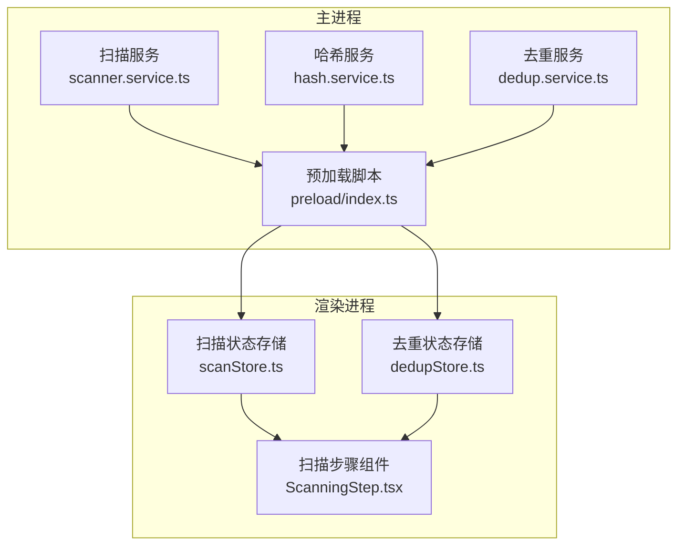
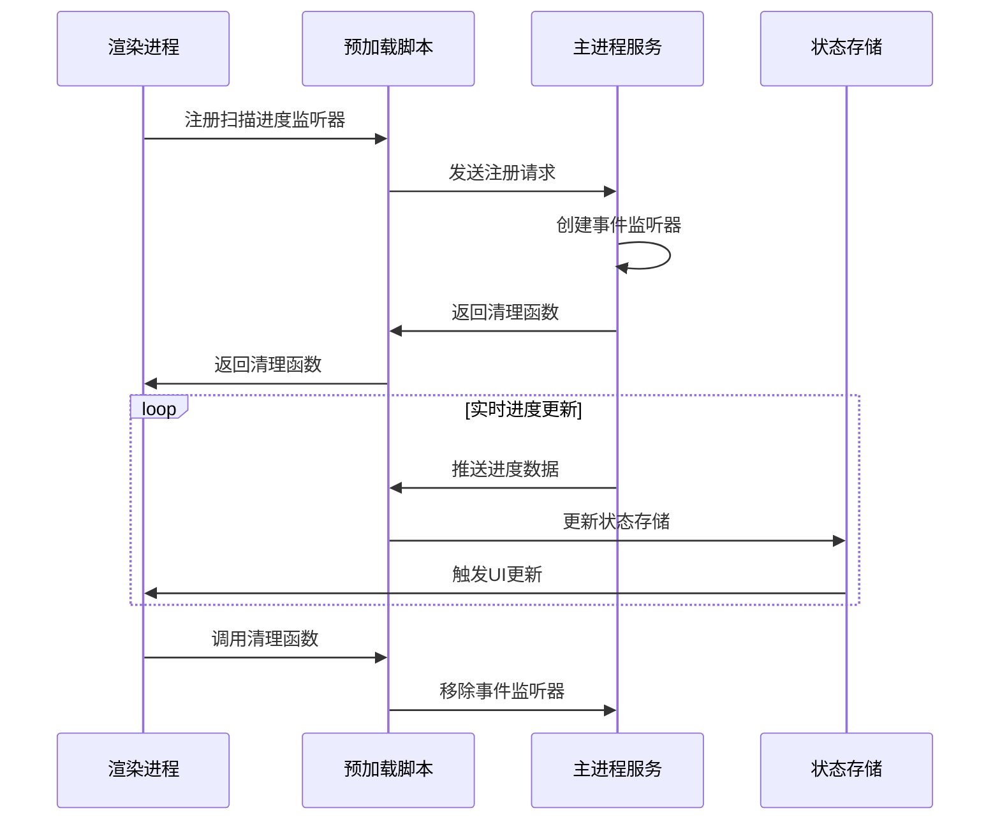
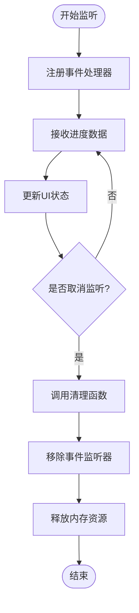
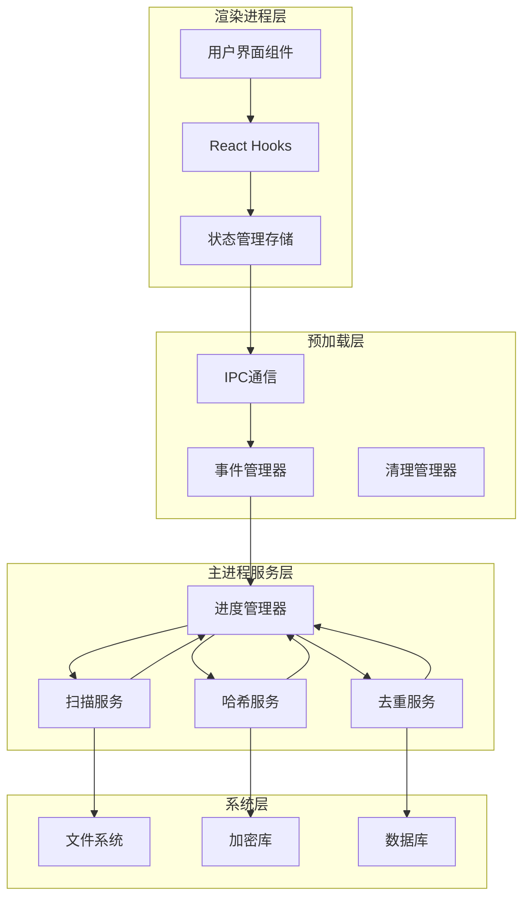
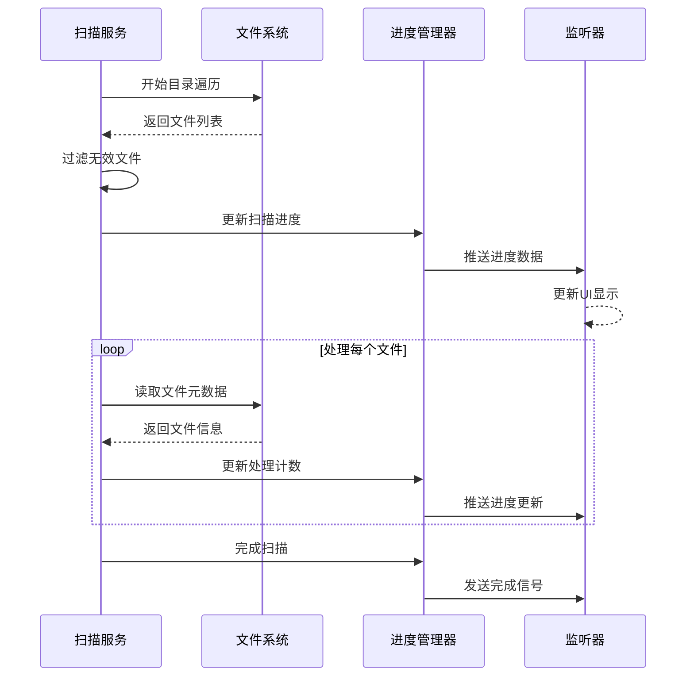
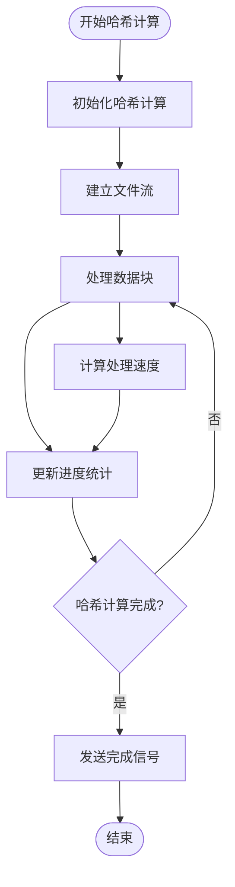
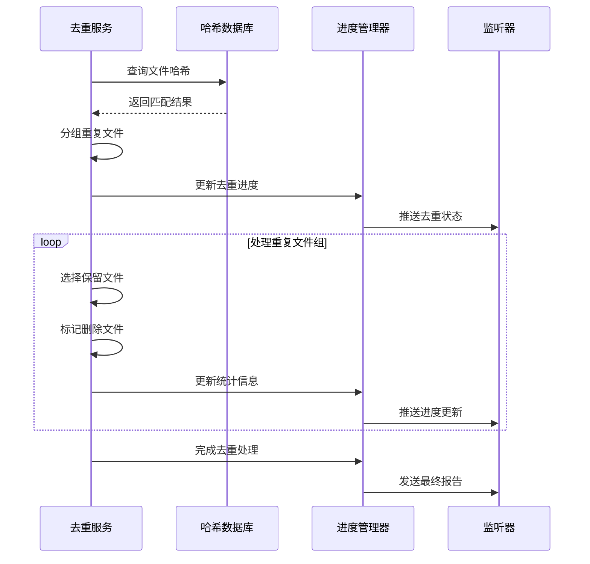
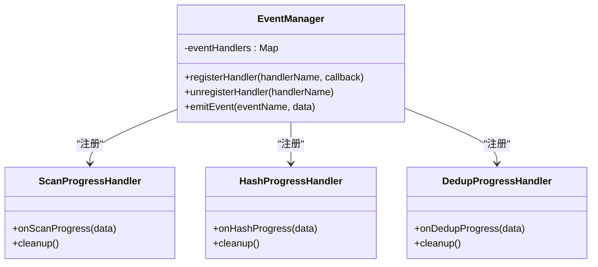
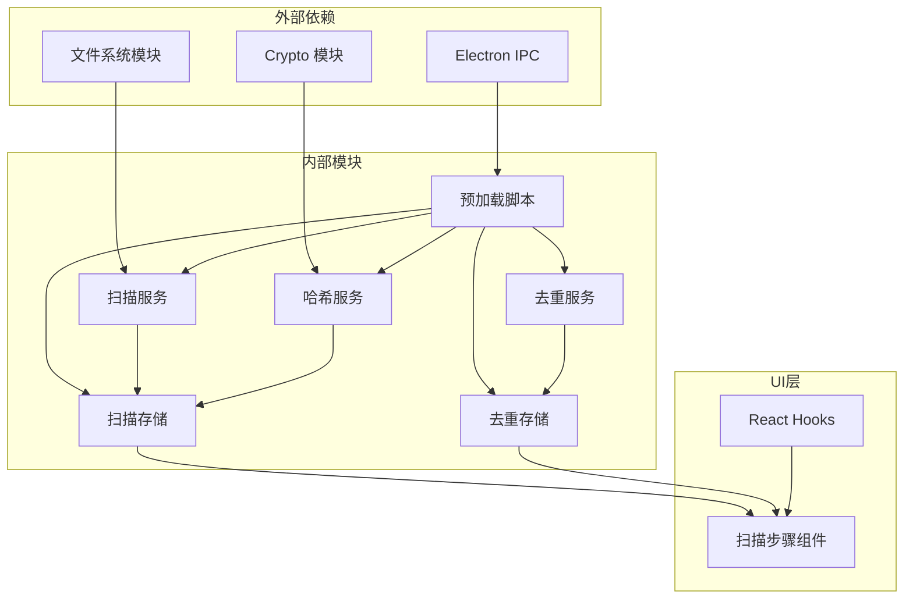

# 进度监控API

<cite>
**本文档引用的文件**
- [src/main/services/scanner.service.ts](file://src/main/services/scanner.service.ts)
- [src/main/services/hash.service.ts](file://src/main/services/hash.service.ts)
- [src/main/services/dedup.service.ts](file://src/main/services/dedup.service.ts)
- [src/preload/index.ts](file://src/preload/index.ts)
- [src/renderer/src/stores/scanStore.ts](file://src/renderer/src/stores/scanStore.ts)
- [src/renderer/src/stores/dedupStore.ts](file://src/renderer/src/stores/dedupStore.ts)
- [src/renderer/src/components/ScanningStep.tsx](file://src/renderer/src/components/ScanningStep.tsx)
</cite>

## 目录
1. [简介](#简介)
2. [项目结构](#项目结构)
3. [核心组件](#核心组件)
4. [架构概览](#架构概览)
5. [详细组件分析](#详细组件分析)
6. [依赖关系分析](#依赖关系分析)
7. [性能考虑](#性能考虑)
8. [故障排除指南](#故障排除指南)
9. [结论](#结论)

## 简介

红ophoto应用的进度监控API是一套完整的文件扫描、哈希计算和去重处理的进度跟踪系统。该系统通过Electron IPC机制在主进程和渲染进程之间传递实时进度信息，为用户提供直观的进度反馈。

该API主要包含三个核心监听器：
- 扫描进度监听器：监控文件系统扫描过程
- 哈希进度监听器：监控文件哈希计算过程  
- 去重进度监听器：监控重复文件识别过程

## 项目结构

红ophoto应用采用标准的Electron架构，包含主进程服务层和渲染进程UI层：



**图表来源**
- [src/main/services/scanner.service.ts](file://src/main/services/scanner.service.ts)
- [src/main/services/hash.service.ts](file://src/main/services/hash.service.ts)
- [src/main/services/dedup.service.ts](file://src/main/services/dedup.service.ts)
- [src/preload/index.ts](file://src/preload/index.ts)

**章节来源**
- [src/main/services/scanner.service.ts](file://src/main/services/scanner.service.ts)
- [src/main/services/hash.service.ts](file://src/main/services/hash.service.ts)
- [src/main/services/dedup.service.ts](file://src/main/services/dedup.service.ts)
- [src/preload/index.ts](file://src/preload/index.ts)

## 核心组件

### 进度数据结构定义

#### ScanProgress 数据结构
```typescript
interface ScanProgress {
  phase: 'scanning' | 'hashing' | 'deduplicating';
  current: number;
  total: number;
  percentage: number;
  processedFiles: number;
  totalFiles: number;
  speed: number;
  remainingTime: number;
}
```

#### HashProgress 数据结构
```typescript
interface HashProgress {
  phase: 'hashing';
  current: number;
  total: number;
  percentage: number;
  processedBytes: number;
  totalBytes: number;
  speed: number;
  elapsedTime: number;
}
```

#### DedupProgress 数据结构
```typescript
interface DedupProgress {
  phase: 'deduplicating';
  current: number;
  total: number;
  percentage: number;
  duplicatesFound: number;
  originalFiles: number;
  freedSpace: number;
  elapsedTime: number;
}
```

### 事件处理器注册机制

进度监控API通过预加载脚本提供统一的事件管理接口：



**图表来源**
- [src/preload/index.ts](file://src/preload/index.ts)
- [src/renderer/src/stores/scanStore.ts](file://src/renderer/src/stores/scanStore.ts)

### 返回的清理函数机制

清理函数确保资源正确释放和内存泄漏防护：



**图表来源**
- [src/preload/index.ts](file://src/preload/index.ts)

**章节来源**
- [src/preload/index.ts](file://src/preload/index.ts)
- [src/renderer/src/stores/scanStore.ts](file://src/renderer/src/stores/scanStore.ts)

## 架构概览

红ophoto的进度监控系统采用分层架构设计，确保了良好的模块化和可维护性：



**图表来源**
- [src/preload/index.ts](file://src/preload/index.ts)
- [src/main/services/scanner.service.ts](file://src/main/services/scanner.service.ts)
- [src/main/services/hash.service.ts](file://src/main/services/hash.service.ts)
- [src/main/services/dedup.service.ts](file://src/main/services/dedup.service.ts)

## 详细组件分析

### 扫描进度监听器 (onScanProgress)

扫描进度监听器负责监控文件系统扫描过程的实时状态：

#### 实现机制

扫描服务通过分阶段处理文件系统遍历：



**图表来源**
- [src/main/services/scanner.service.ts](file://src/main/services/scanner.service.ts)

#### 数据结构详解

- `phase`: 当前处理阶段，固定为'scanning'
- `current`: 已处理的文件数量
- `total`: 总文件数量
- `percentage`: 处理百分比 (current/total * 100)
- `processedFiles`: 已处理文件计数
- `totalFiles`: 总文件计数
- `speed`: 处理速度 (文件/秒)
- `remainingTime`: 预计剩余时间 (秒)

#### 最佳实践

1. **防抖处理**: 对高频进度更新进行防抖，避免UI过度重绘
2. **内存管理**: 及时清理不再使用的进度数据
3. **错误恢复**: 在扫描中断时提供恢复机制

**章节来源**
- [src/main/services/scanner.service.ts](file://src/main/services/scanner.service.ts)
- [src/renderer/src/stores/scanStore.ts](file://src/renderer/src/stores/scanStore.ts)

### 哈希进度监听器 (onHashProgress)

哈希进度监听器专注于文件内容哈希计算的进度跟踪：

#### 实现机制

哈希服务采用流式处理方式，支持大文件的高效哈希计算：



**图表来源**
- [src/main/services/hash.service.ts](file://src/main/services/hash.service.ts)

#### 数据结构详解

- `phase`: 当前处理阶段，固定为'hashing'
- `current`: 已处理的字节数
- `total`: 文件总字节数
- `percentage`: 处理百分比 (current/total * 100)
- `processedBytes`: 已处理字节计数
- `totalBytes`: 文件总字节计数
- `speed`: 处理速度 (字节/秒)
- `elapsedTime`: 已用时间 (秒)

#### 性能优化策略

1. **缓冲区优化**: 合理设置数据块大小以平衡内存使用和CPU效率
2. **并发处理**: 对于多核系统，考虑并行哈希计算
3. **进度采样**: 减少进度更新频率以降低开销

**章节来源**
- [src/main/services/hash.service.ts](file://src/main/services/hash.service.ts)

### 去重进度监听器 (onDedupProgress)

去重进度监听器监控重复文件识别和处理的完整流程：

#### 实现机制

去重服务采用智能算法进行重复文件检测：



**图表来源**
- [src/main/services/dedup.service.ts](file://src/main/services/dedup.service.ts)

#### 数据结构详解

- `phase`: 当前处理阶段，固定为'deduplicating'
- `current`: 已处理的文件组数量
- `total`: 总文件组数量
- `percentage`: 处理百分比 (current/total * 100)
- `duplicatesFound`: 发现的重复文件数量
- `originalFiles`: 原始文件总数
- `freedSpace`: 释放的存储空间 (字节)
- `elapsedTime`: 已用时间 (秒)

#### 错误处理策略

1. **数据一致性**: 确保去重操作的原子性和回滚能力
2. **冲突解决**: 提供明确的重复文件处理策略
3. **进度补偿**: 在异常情况下保持进度数据的准确性

**章节来源**
- [src/main/services/dedup.service.ts](file://src/main/services/dedup.service.ts)

### 事件处理器注册与注销

#### 注册机制

事件处理器通过预加载脚本统一管理：



**图表来源**
- [src/preload/index.ts](file://src/preload/index.ts)

#### 注销机制

清理函数确保资源正确释放：

1. **移除事件监听器**: 从事件管理器中移除对应的处理器
2. **释放内存资源**: 清空缓存和临时数据
3. **关闭文件句柄**: 关闭所有打开的文件和连接
4. **停止定时器**: 取消所有未完成的异步操作

**章节来源**
- [src/preload/index.ts](file://src/preload/index.ts)

## 依赖关系分析

进度监控系统的依赖关系体现了清晰的分层架构：



**图表来源**
- [src/preload/index.ts](file://src/preload/index.ts)
- [src/renderer/src/stores/scanStore.ts](file://src/renderer/src/stores/scanStore.ts)
- [src/renderer/src/stores/dedupStore.ts](file://src/renderer/src/stores/dedupStore.ts)

**章节来源**
- [src/preload/index.ts](file://src/preload/index.ts)
- [src/renderer/src/stores/scanStore.ts](file://src/renderer/src/stores/scanStore.ts)
- [src/renderer/src/stores/dedupStore.ts](file://src/renderer/src/stores/dedupStore.ts)

## 性能考虑

### 内存管理

1. **进度数据缓存**: 限制历史进度数据的存储数量，避免内存泄漏
2. **事件处理器池**: 复用事件处理器实例，减少对象创建开销
3. **垃圾回收优化**: 及时清理不再使用的闭包和引用

### 网络和I/O优化

1. **批量更新**: 将多个小的进度更新合并为批量更新
2. **异步处理**: 使用异步操作避免阻塞主线程
3. **背压控制**: 在数据流过快时实施背压机制

### 用户体验优化

1. **平滑动画**: 使用CSS过渡和JavaScript动画提供流畅的进度显示
2. **预测性进度**: 基于历史数据预测剩余时间和处理速度
3. **错误提示**: 提供清晰的错误信息和重试选项

## 故障排除指南

### 常见问题及解决方案

#### 进度数据不更新

**症状**: 进度条卡住不动或更新异常缓慢

**可能原因**:
1. 事件处理器未正确注册
2. IPC通信中断
3. 大量数据导致处理延迟

**解决方案**:
1. 检查事件处理器的注册状态
2. 验证IPC通道的连通性
3. 实施进度数据的防抖处理

#### 内存泄漏

**症状**: 应用运行时间越长内存占用越高

**可能原因**:
1. 未调用清理函数
2. 事件监听器未正确移除
3. 大量临时对象未释放

**解决方案**:
1. 确保每次监听后都保存并调用清理函数
2. 在组件卸载时主动调用清理函数
3. 定期检查事件监听器的数量

#### 进度计算不准确

**症状**: 进度百分比显示异常或倒退

**可能原因**:
1. 数据类型转换错误
2. 并发访问共享变量
3. 计算逻辑错误

**解决方案**:
1. 验证数据类型的正确性
2. 使用锁机制保护共享资源
3. 实施边界检查和数据验证

**章节来源**
- [src/preload/index.ts](file://src/preload/index.ts)
- [src/renderer/src/stores/scanStore.ts](file://src/renderer/src/stores/scanStore.ts)

## 结论

红ophoto应用的进度监控API通过精心设计的分层架构和完善的事件管理系统，为用户提供了准确、实时的文件处理进度反馈。该系统的主要优势包括：

1. **模块化设计**: 清晰的职责分离使得各组件易于维护和扩展
2. **实时性保证**: 通过高效的IPC通信实现实时进度更新
3. **资源管理**: 完善的清理机制确保内存和系统资源的有效利用
4. **用户体验**: 直观的进度显示和合理的性能优化提升了整体使用体验

未来可以考虑的改进方向包括：
- 增加更多详细的统计信息
- 提供进度预测和 ETA 计算
- 支持进度数据的持久化和恢复
- 实现更精细的并发控制和资源调度