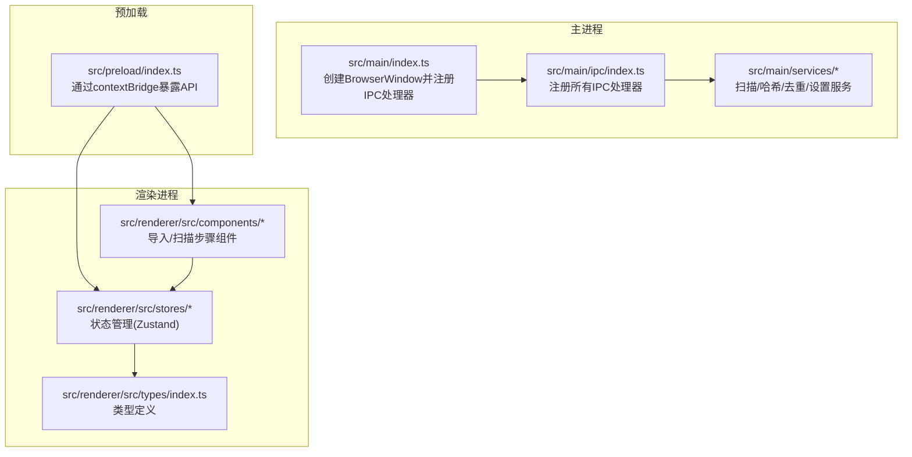
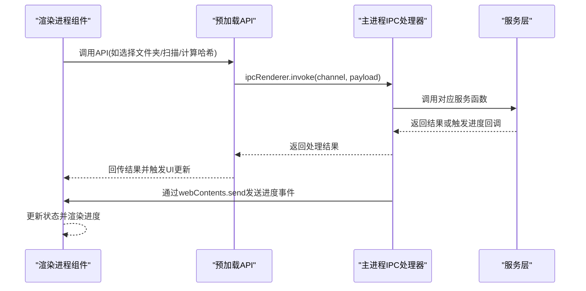
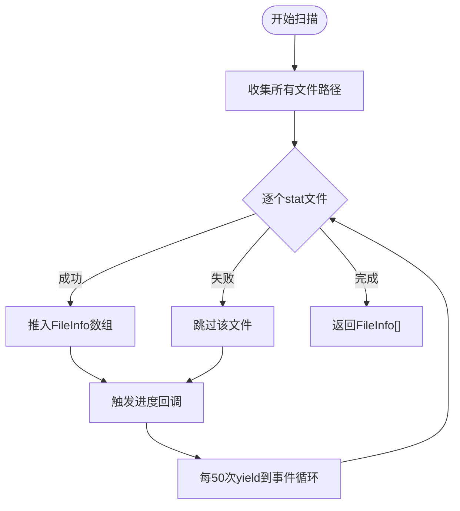
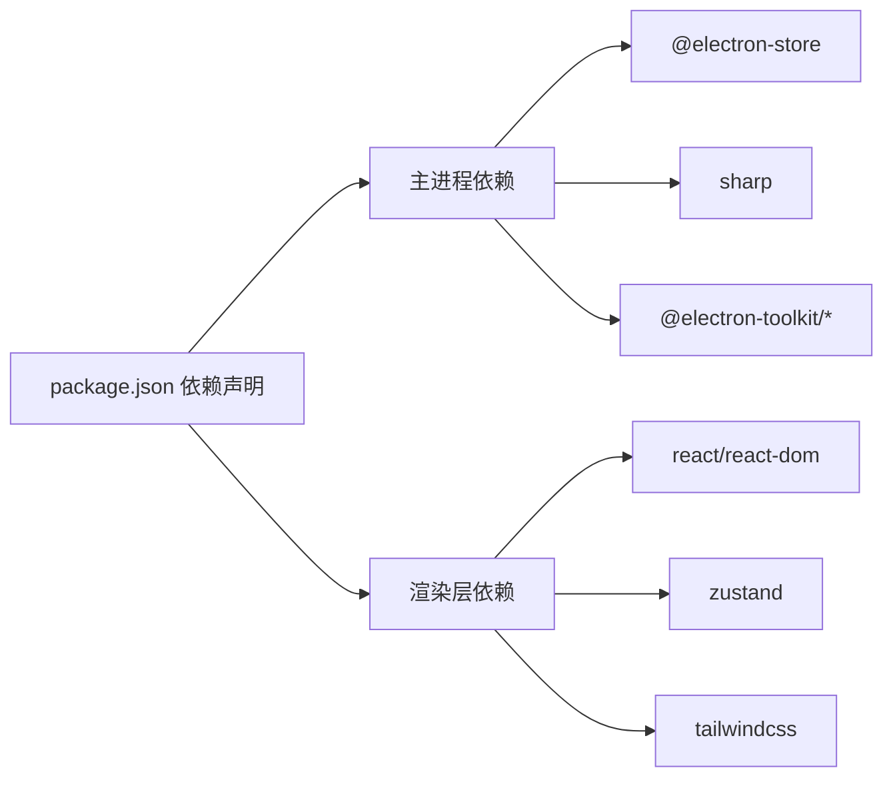

# IPC处理器注册

<cite>
**本文引用的文件**
- [src/main/ipc/index.ts](file://src/main/ipc/index.ts)
- [src/main/services/scanner.service.ts](file://src/main/services/scanner.service.ts)
- [src/main/services/hash.service.ts](file://src/main/services/hash.service.ts)
- [src/main/services/dedup.service.ts](file://src/main/services/dedup.service.ts)
- [src/main/services/settings.service.ts](file://src/main/services/settings.service.ts)
- [src/preload/index.ts](file://src/preload/index.ts)
- [src/renderer/src/stores/scanStore.ts](file://src/renderer/src/stores/scanStore.ts)
- [src/renderer/src/stores/dedupStore.ts](file://src/renderer/src/stores/dedupStore.ts)
- [src/renderer/src/stores/settingsStore.ts](file://src/renderer/src/stores/settingsStore.ts)
- [src/renderer/src/components/ImportStep.tsx](file://src/renderer/src/components/ImportStep.tsx)
- [src/renderer/src/components/ScanningStep.tsx](file://src/renderer/src/components/ScanningStep.tsx)
- [src/renderer/src/types/index.ts](file://src/renderer/src/types/index.ts)
- [src/main/index.ts](file://src/main/index.ts)
- [package.json](file://package.json)
</cite>

## 目录
1. [简介](#简介)
2. [项目结构](#项目结构)
3. [核心组件](#核心组件)
4. [架构总览](#架构总览)
5. [详细组件分析](#详细组件分析)
6. [依赖关系分析](#依赖关系分析)
7. [性能考虑](#性能考虑)
8. [故障排查指南](#故障排查指南)
9. [结论](#结论)
10. [附录](#附录)

## 简介
本文件面向红ophoto的IPC（进程间通信）处理器注册系统，系统通过Electron主进程与渲染进程之间的IPC通道，提供窗口控制、文件夹选择、文件扫描、哈希计算、去重处理、缩略图生成以及设置管理等核心能力。本文档将详细说明：
- 所有IPC处理器的注册流程与实现细节
- 请求格式、响应结构与错误处理机制
- 进度回调机制的实现与实时更新策略
- 完整的使用示例与集成指南
- 性能优化建议与调试技巧

## 项目结构
项目采用主进程-预加载脚本-渲染进程三层架构：
- 主进程负责注册IPC处理器、调用服务层逻辑、与系统对话框交互
- 预加载脚本通过contextBridge暴露安全的API给渲染进程
- 渲染进程使用Zustand状态管理与组件进行交互

图表来源
- [src/main/index.ts:1-61](file://src/main/index.ts#L1-L61)
- [src/main/ipc/index.ts:1-156](file://src/main/ipc/index.ts#L1-L156)
- [src/preload/index.ts:1-123](file://src/preload/index.ts#L1-L123)

章节来源
- [src/main/index.ts:1-61](file://src/main/index.ts#L1-L61)
- [src/main/ipc/index.ts:1-156](file://src/main/ipc/index.ts#L1-L156)
- [src/preload/index.ts:1-123](file://src/preload/index.ts#L1-L123)

## 核心组件
- 窗口控制：最小化、最大化/还原、关闭
- 文件夹选择：打开系统对话框选择目录
- 文件扫描：递归遍历目录，过滤支持的图片扩展名，统计文件信息
- 哈希计算：SHA-256与感知哈希pHash批量计算
- 去重处理：基于SHA-256精确分组与可选pHash相似分组，支持删除或复制输出
- 缩略图生成：基于sharp生成JPEG缩略图
- 设置管理：持久化配置读取与写入

章节来源
- [src/main/ipc/index.ts:22-156](file://src/main/ipc/index.ts#L22-L156)
- [src/main/services/scanner.service.ts:28-86](file://src/main/services/scanner.service.ts#L28-L86)
- [src/main/services/hash.service.ts:29-180](file://src/main/services/hash.service.ts#L29-L180)
- [src/main/services/dedup.service.ts:43-209](file://src/main/services/dedup.service.ts#L43-L209)
- [src/main/services/settings.service.ts:24-34](file://src/main/services/settings.service.ts#L24-L34)

## 架构总览
IPC处理器注册在主进程中集中管理，预加载脚本对外暴露统一的API接口，渲染层通过状态管理与组件驱动业务流程。

图表来源
- [src/preload/index.ts:61-123](file://src/preload/index.ts#L61-L123)
- [src/main/ipc/index.ts:22-156](file://src/main/ipc/index.ts#L22-L156)

## 详细组件分析

### 窗口控制处理器
- 注册通道：window:minimize、window:maximize、window:close
- 实现：直接调用BrowserWindow实例方法
- 错误处理：无返回值，异常由Electron内部处理

章节来源
- [src/main/ipc/index.ts:23-29](file://src/main/ipc/index.ts#L23-L29)

### 文件夹选择处理器
- 注册通道：folder:select
- 请求格式：无参数
- 响应结构：字符串路径或null
- 错误处理：用户取消时返回null

章节来源
- [src/main/ipc/index.ts:31-39](file://src/main/ipc/index.ts#L31-L39)

### 文件扫描处理器
- 注册通道：folder:scan
- 请求格式：{ folderPath: string }
- 响应结构：FileInfo[]（包含id、path、name、size、ext、modifiedTime）
- 进度回调：扫描阶段，发送scan:progress事件
- 错误处理：忽略不可访问目录与stat失败的文件；缓存扫描结果供后续步骤使用

图表来源
- [src/main/services/scanner.service.ts:28-86](file://src/main/services/scanner.service.ts#L28-L86)
- [src/main/ipc/index.ts:42-53](file://src/main/ipc/index.ts#L42-L53)

章节来源
- [src/main/ipc/index.ts:42-53](file://src/main/ipc/index.ts#L42-L53)
- [src/main/services/scanner.service.ts:8-15](file://src/main/services/scanner.service.ts#L8-L15)

### 哈希计算处理器（SHA-256）
- 注册通道：hash:computeAll
- 请求格式：{ files: FileInfo[] }
- 响应结构：HashResult[]（包含id、sha256）
- 进度回调：哈希阶段，发送hash:progress事件
- 错误处理：单文件计算失败时返回sha256为ERROR，不影响整体流程

章节来源
- [src/main/ipc/index.ts:55-68](file://src/main/ipc/index.ts#L55-L68)
- [src/main/services/hash.service.ts:29-56](file://src/main/services/hash.service.ts#L29-L56)

### 哈希计算处理器（感知哈希pHash）
- 注册通道：phash:computeAll
- 请求格式：{ files: FileInfo[] }
- 响应结构：PhashResult[]（包含id、phash）
- 进度回调：phashing阶段，发送hash:progress事件
- 错误处理：单文件计算失败时跳过该条目

章节来源
- [src/main/ipc/index.ts:70-83](file://src/main/ipc/index.ts#L70-L83)
- [src/main/services/hash.service.ts:132-159](file://src/main/services/hash.service.ts#L132-L159)

### 去重分组处理器
- 注册通道：dedup:group
- 请求格式：{ hashResults: HashResult[]; phashResults?: PhashResult[]; phashThreshold?: number }
- 响应结构：DuplicateGroup[]（包含groupId、hash、matchType、files）
- 处理逻辑：
  - 先按SHA-256精确分组，标记exactIds
  - 若启用pHash且存在候选，则对非exact组内文件进行Union-Find分组，距离<=阈值视为相似
- 错误处理：忽略ERROR哈希与空pHash结果

章节来源
- [src/main/ipc/index.ts:85-107](file://src/main/ipc/index.ts#L85-L107)
- [src/main/services/dedup.service.ts:43-115](file://src/main/services/dedup.service.ts#L43-L115)

### 去重执行处理器
- 注册通道：dedup:execute
- 请求格式：{ decisions: DedupDecision[]; settings: DedupSettings; sourceFolder: string; files?: FileInfo[] }
- 响应结构：{ success: number; errors: string[] }
- 进度回调：dedup:progress事件，携带current、total、currentFile、percentage
- 处理逻辑：
  - 删除模式：删除决策中的deleteFileIds（路径列表）
  - 复制模式：在sourceFolder同级创建输出目录，复制非重复文件与保留文件
- 错误处理：逐文件捕获异常并累积错误信息

章节来源
- [src/main/ipc/index.ts:109-142](file://src/main/ipc/index.ts#L109-L142)
- [src/main/services/dedup.service.ts:117-209](file://src/main/services/dedup.service.ts#L117-L209)

### 缩略图生成处理器
- 注册通道：file:thumbnail
- 请求格式：{ filePath: string; maxSize?: number }
- 响应结构：data:image/jpeg;base64字符串
- 实现：使用sharp按最大尺寸缩放并编码为JPEG

章节来源
- [src/main/ipc/index.ts:144-150](file://src/main/ipc/index.ts#L144-L150)
- [src/main/services/hash.service.ts:170-179](file://src/main/services/hash.service.ts#L170-L179)

### 设置管理处理器
- 注册通道：settings:get、settings:set
- 请求格式：settings:get无参；settings:set接收部分设置对象
- 响应结构：AppSettings（当前完整设置）
- 实现：基于electron-store持久化存储

章节来源
- [src/main/ipc/index.ts:152-155](file://src/main/ipc/index.ts#L152-L155)
- [src/main/services/settings.service.ts:24-34](file://src/main/services/settings.service.ts#L24-L34)

### 预加载API与类型定义
- 预加载脚本通过contextBridge.exposeInMainWorld暴露API，包含：
  - 窗口控制、文件夹操作、哈希计算、去重、缩略图、设置
  - 进度监听器：onScanProgress、onHashProgress、onDedupProgress
- 类型定义集中在types/index.ts，确保主进程与渲染进程类型一致

章节来源
- [src/preload/index.ts:61-123](file://src/preload/index.ts#L61-L123)
- [src/renderer/src/types/index.ts:1-58](file://src/renderer/src/types/index.ts#L1-L58)

### 渲染层集成示例
- 导入步骤组件：演示从选择文件夹到扫描、哈希、分组的完整流程
- 扫描步骤组件：展示进度条与阶段标签
- 状态管理：scanStore、dedupStore、settingsStore分别管理扫描状态、去重决策与设置

章节来源
- [src/renderer/src/components/ImportStep.tsx:1-174](file://src/renderer/src/components/ImportStep.tsx#L1-L174)
- [src/renderer/src/components/ScanningStep.tsx:1-84](file://src/renderer/src/components/ScanningStep.tsx#L1-L84)
- [src/renderer/src/stores/scanStore.ts:1-52](file://src/renderer/src/stores/scanStore.ts#L1-L52)
- [src/renderer/src/stores/dedupStore.ts:1-83](file://src/renderer/src/stores/dedupStore.ts#L1-L83)
- [src/renderer/src/stores/settingsStore.ts:1-41](file://src/renderer/src/stores/settingsStore.ts#L1-L41)

## 依赖关系分析
- Electron主进程依赖：
  - electron-store用于设置持久化
  - sharp用于图像处理（哈希与缩略图）
  - @electron-toolkit工具库辅助开发
- 渲染层依赖：
  - react、react-dom用于UI
  - zustand用于状态管理
  - TailwindCSS用于样式

图表来源
- [package.json:13-34](file://package.json#L13-L34)

章节来源
- [package.json:13-34](file://package.json#L13-L34)

## 性能考虑
- 批量处理与并发：
  - SHA-256批大小为20，pHash批大小为5，避免一次性处理过多文件导致阻塞
  - 使用Promise.all并行计算批次内的哈希
- 事件循环让出：
  - 扫描与哈希计算在每N个文件后setImmediate让出，保证UI不卡顿
- I/O优化：
  - 扫描阶段先收集路径再逐个stat，减少不必要的系统调用
  - 哈希计算使用流式读取，避免大文件内存占用
- 图像处理：
  - 缩略图按最大尺寸缩放，避免放大与过度解码
- 存储：
  - 设置使用electron-store异步读写，避免阻塞主线程

章节来源
- [src/main/services/scanner.service.ts:78-82](file://src/main/services/scanner.service.ts#L78-L82)
- [src/main/services/hash.service.ts:36-53](file://src/main/services/hash.service.ts#L36-L53)
- [src/main/services/hash.service.ts:139-156](file://src/main/services/hash.service.ts#L139-L156)
- [src/main/services/dedup.service.ts:154-157](file://src/main/services/dedup.service.ts#L154-L157)
- [src/main/services/dedup.service.ts:202-205](file://src/main/services/dedup.service.ts#L202-L205)

## 故障排查指南
- 无法选择文件夹
  - 检查folder:select是否被调用且未被用户取消
  - 确认主进程BrowserWindow实例已创建
- 扫描无结果
  - 确认所选目录包含受支持的图片扩展名
  - 检查权限与路径有效性
- 哈希计算异常
  - 单文件计算失败会返回ERROR，不影响其他文件
  - 检查文件是否损坏或权限不足
- pHash计算为空
  - 可能由于图像处理失败或像素数据异常
  - 建议降低批大小或单独测试目标文件
- 去重执行失败
  - 删除模式下deleteFileIds应为文件路径列表
  - 复制模式下需确保源目录可读、目标目录可写
- 进度不更新
  - 确认预加载API已正确注册onScanProgress/onHashProgress/onDedupProgress
  - 检查主进程是否正确发送对应事件

章节来源
- [src/main/ipc/index.ts:31-39](file://src/main/ipc/index.ts#L31-L39)
- [src/main/services/hash.service.ts:43-45](file://src/main/services/hash.service.ts#L43-L45)
- [src/main/services/hash.service.ts:146-149](file://src/main/services/hash.service.ts#L146-L149)
- [src/main/services/dedup.service.ts:145-153](file://src/main/services/dedup.service.ts#L145-L153)
- [src/preload/index.ts:103-119](file://src/preload/index.ts#L103-L119)

## 结论
本系统的IPC处理器注册以模块化方式组织，主进程集中管理所有通道，预加载脚本提供安全的API封装，渲染层通过状态管理与组件实现流畅的用户体验。通过合理的批处理、事件循环让出与图像处理策略，系统在大数据量场景下仍能保持良好的响应性。建议在生产环境中结合日志记录与更细粒度的错误上报，进一步提升可观测性与可维护性。

## 附录

### 使用示例与集成指南
- 在渲染层调用API的基本流程：
  1) 选择文件夹：调用selectFolder()
  2) 扫描文件：调用scanFolder(folderPath)，订阅scan:progress
  3) 计算哈希：调用computeHashes(files)，订阅hash:progress
  4) 可选：仅对唯一文件计算pHash，订阅hash:progress
  5) 分组去重：调用groupDuplicates({ hashResults, phashResults, phashThreshold })
  6) 执行去重：调用executeDedup({ decisions, settings, sourceFolder, files })
- 在主进程中注册处理器：
  - 创建BrowserWindow后调用registerIpcHandlers(mainWindow)
  - 确保所有服务层函数已实现并导出
- 在预加载脚本中暴露API：
  - 通过contextBridge.exposeInMainWorld('api', api)
  - 确保类型定义与主进程一致

章节来源
- [src/renderer/src/components/ImportStep.tsx:10-82](file://src/renderer/src/components/ImportStep.tsx#L10-L82)
- [src/main/index.ts:45-46](file://src/main/index.ts#L45-L46)
- [src/preload/index.ts:61-123](file://src/preload/index.ts#L61-L123)