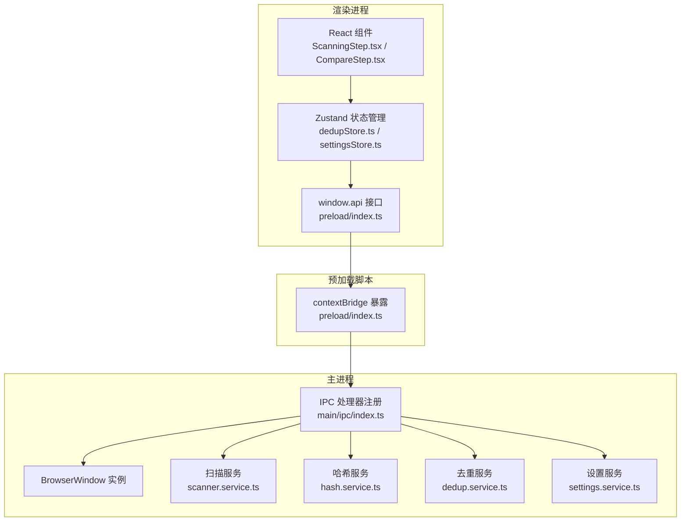
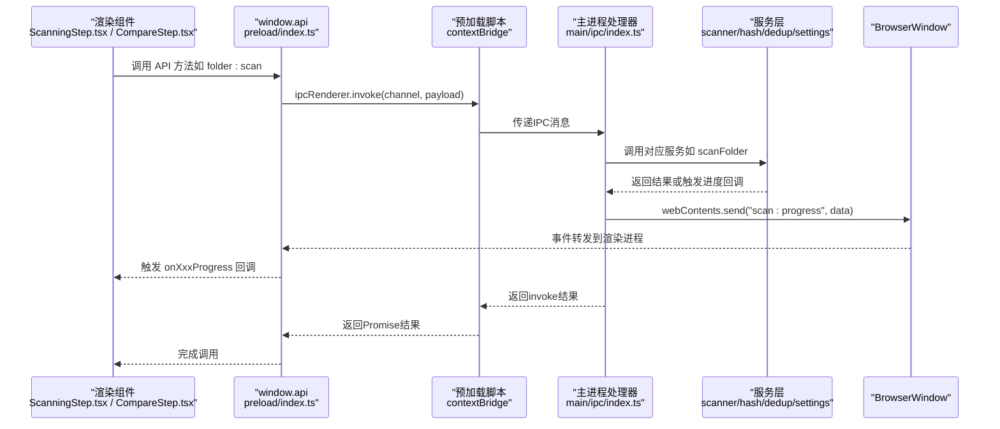
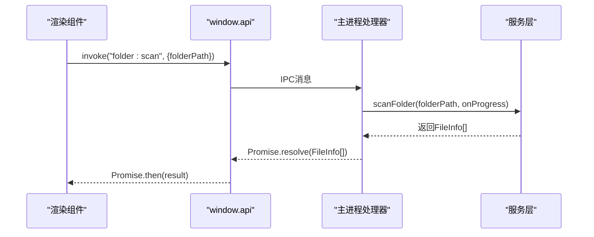
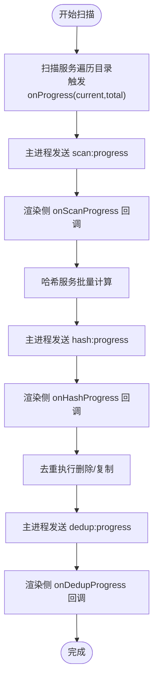
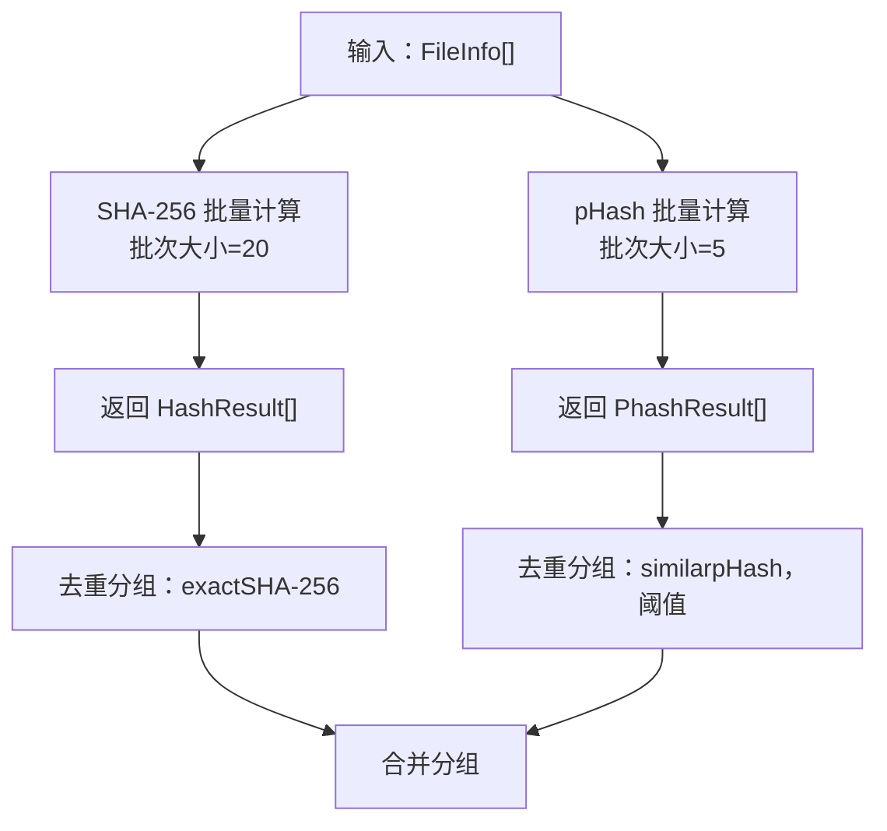
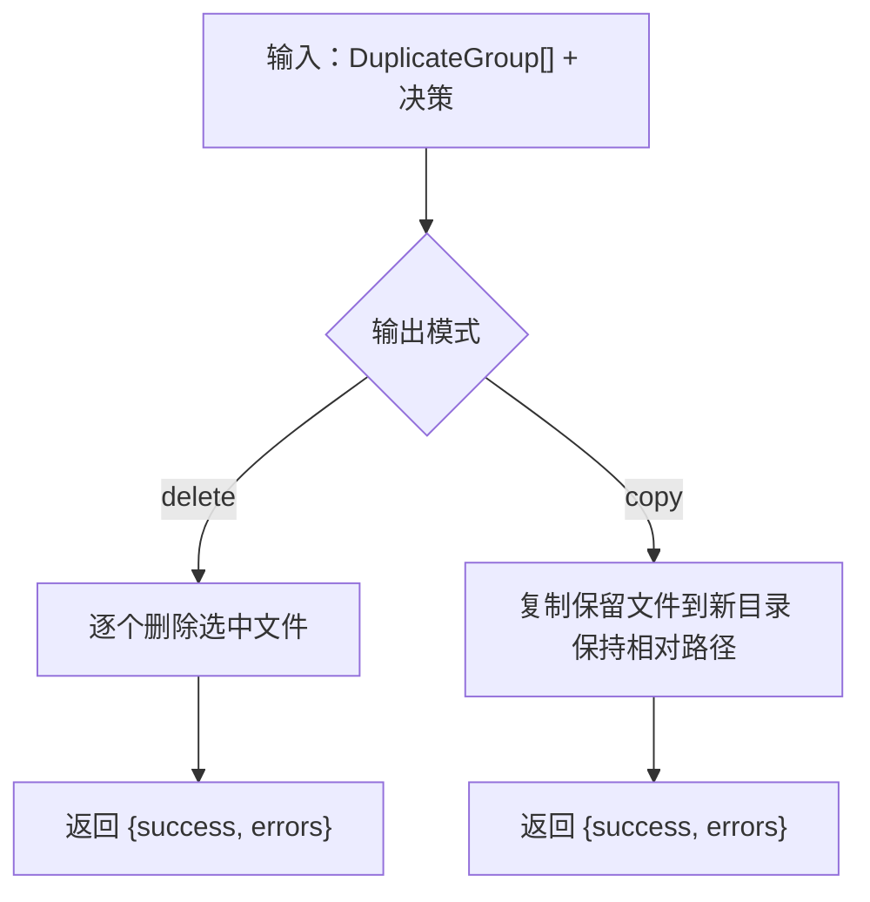
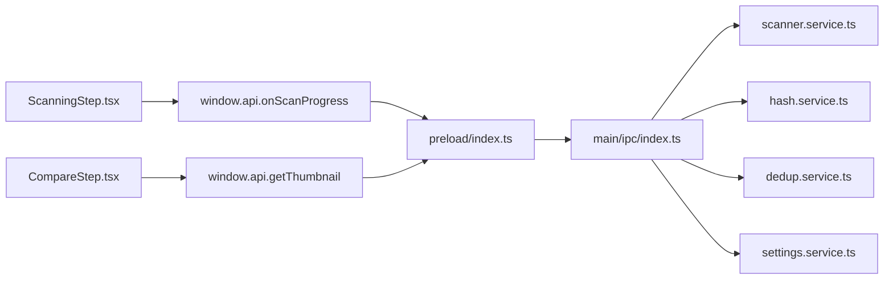

# IPC通信层

<cite>
**本文引用的文件**
- [src/preload/index.ts](file://src/preload/index.ts)
- [src/preload/index.d.ts](file://src/preload/index.d.ts)
- [src/main/ipc/index.ts](file://src/main/ipc/index.ts)
- [src/main/index.ts](file://src/main/index.ts)
- [src/main/services/scanner.service.ts](file://src/main/services/scanner.service.ts)
- [src/main/services/hash.service.ts](file://src/main/services/hash.service.ts)
- [src/main/services/dedup.service.ts](file://src/main/services/dedup.service.ts)
- [src/main/services/settings.service.ts](file://src/main/services/settings.service.ts)
- [src/renderer/src/components/ScanningStep.tsx](file://src/renderer/src/components/ScanningStep.tsx)
- [src/renderer/src/components/CompareStep.tsx](file://src/renderer/src/components/CompareStep.tsx)
- [src/renderer/src/stores/dedupStore.ts](file://src/renderer/src/stores/dedupStore.ts)
- [src/renderer/src/stores/settingsStore.ts](file://src/renderer/src/stores/settingsStore.ts)
</cite>

## 目录
1. [简介](#简介)
2. [项目结构](#项目结构)
3. [核心组件](#核心组件)
4. [架构总览](#架构总览)
5. [详细组件分析](#详细组件分析)
6. [依赖关系分析](#依赖关系分析)
7. [性能考量](#性能考量)
8. [故障排查指南](#故障排查指南)
9. [结论](#结论)
10. [附录：API接口与数据模型](#附录api接口与数据模型)

## 简介
本文件系统性梳理红ophoto应用的IPC（进程间通信）层设计与实现，重点覆盖：
- 预加载脚本的设计原理与contextBridge安全机制
- IPC处理器接口定义与调用协议
- 文件扫描、哈希计算、感知哈希与去重处理的完整通信流程
- 进度监听机制（实时进度与错误状态传播）
- 完整API接口文档（请求格式、响应结构、错误码说明）
- 通信安全与性能优化策略
- 调试技巧与常见问题解决方案

## 项目结构
IPC通信层由三部分组成：
- 预加载脚本（Preload）：通过contextBridge将受限的Electron API暴露给渲染进程
- 主进程（Main）：注册IPC处理器，协调服务层与UI交互
- 渲染进程（Renderer）：通过window.api调用主进程能力，并订阅进度事件



图表来源
- [src/preload/index.ts:61-122](file://src/preload/index.ts#L61-L122)
- [src/main/ipc/index.ts:22-155](file://src/main/ipc/index.ts#L22-L155)
- [src/main/index.ts:8-46](file://src/main/index.ts#L8-L46)
- [src/main/services/scanner.service.ts:28-85](file://src/main/services/scanner.service.ts#L28-L85)
- [src/main/services/hash.service.ts:29-159](file://src/main/services/hash.service.ts#L29-L159)
- [src/main/services/dedup.service.ts:43-130](file://src/main/services/dedup.service.ts#L43-L130)
- [src/main/services/settings.service.ts:24-33](file://src/main/services/settings.service.ts#L24-L33)

章节来源
- [src/preload/index.ts:1-123](file://src/preload/index.ts#L1-L123)
- [src/main/ipc/index.ts:1-156](file://src/main/ipc/index.ts#L1-L156)
- [src/main/index.ts:1-61](file://src/main/index.ts#L1-L61)

## 核心组件
- 预加载脚本（preload/index.ts）
  - 使用contextBridge.exposeInMainWorld将受控API暴露到window.api
  - 提供窗口控制、文件夹选择与扫描、哈希计算、感知哈希、去重、缩略图生成、设置读取与写入等方法
  - 提供扫描、哈希、去重三类进度监听回调
- 主进程IPC处理器（main/ipc/index.ts）
  - 注册窗口控制、文件夹选择、文件扫描、哈希计算、感知哈希、去重分组与执行、缩略图生成、设置读取与写入
  - 将进度事件通过webContents.send发送至渲染进程
- 服务层
  - 扫描服务：递归遍历目录，过滤支持的图片扩展名，生成FileInfo列表
  - 哈希服务：SHA-256批量计算与感知哈希（pHash）批量计算，含DCT与汉明距离
  - 去重服务：基于SHA-256精确匹配与pHash近似匹配的分组算法，支持删除或复制两种输出模式
  - 设置服务：基于electron-store持久化配置

章节来源
- [src/preload/index.ts:61-122](file://src/preload/index.ts#L61-L122)
- [src/main/ipc/index.ts:22-155](file://src/main/ipc/index.ts#L22-L155)
- [src/main/services/scanner.service.ts:28-85](file://src/main/services/scanner.service.ts#L28-L85)
- [src/main/services/hash.service.ts:29-159](file://src/main/services/hash.service.ts#L29-L159)
- [src/main/services/dedup.service.ts:43-130](file://src/main/services/dedup.service.ts#L43-L130)
- [src/main/services/settings.service.ts:24-33](file://src/main/services/settings.service.ts#L24-L33)

## 架构总览
下图展示从渲染进程发起IPC请求到主进程处理并返回结果的端到端流程，以及进度事件的推送路径。



图表来源
- [src/renderer/src/components/ScanningStep.tsx:4-15](file://src/renderer/src/components/ScanningStep.tsx#L4-L15)
- [src/renderer/src/components/CompareStep.tsx:19-24](file://src/renderer/src/components/CompareStep.tsx#L19-L24)
- [src/preload/index.ts:61-122](file://src/preload/index.ts#L61-L122)
- [src/main/ipc/index.ts:42-53](file://src/main/ipc/index.ts#L42-L53)

## 详细组件分析

### 预加载脚本与contextBridge安全机制
- 暴露范围最小化：仅暴露必要的API到window.api，避免直接暴露Node/Electron全量能力
- 类型声明：通过preload/index.d.ts提供完整的类型签名，确保编译期安全
- 进度监听：提供onScanProgress/onHashProgress/onDedupProgress三个事件监听器，返回解绑函数
- 错误隔离：IPC调用失败时由渲染进程捕获，避免泄露底层异常细节

```mermaid
classDiagram
class PreloadAPI {
+minimizeWindow()
+maximizeWindow()
+closeWindow()
+selectFolder() Promise<string|null>
+scanFolder(folderPath) Promise<FileInfo[]>
+computeHashes(files) Promise<HashResult[]>
+computePhashes(files) Promise<PhashResult[]>
+groupDuplicates(data) Promise<DuplicateGroup[]>
+executeDedup(data) Promise<{success : number,errors : string[]}>
+getThumbnail(filePath,maxSize?) Promise<string>
+getSettings() Promise<AppSettings>
+setSettings(partial) Promise<AppSettings>
+onScanProgress(cb) () => void
+onHashProgress(cb) () => void
+onDedupProgress(cb) () => void
}
class Types {
+FileInfo
+HashResult
+PhashResult
+DuplicateGroup
+DedupDecision
+DedupSettings
+AppSettings
+ScanProgress
+DedupProgress
}
PreloadAPI --> Types : "使用"
```

图表来源
- [src/preload/index.ts:61-122](file://src/preload/index.ts#L61-L122)
- [src/preload/index.d.ts:13-51](file://src/preload/index.d.ts#L13-L51)

章节来源
- [src/preload/index.ts:1-123](file://src/preload/index.ts#L1-L123)
- [src/preload/index.d.ts:1-52](file://src/preload/index.d.ts#L1-L52)

### IPC处理器与通信协议
- 窗口控制：window:minimize、window:maximize、window:close
- 文件夹操作：folder:select（无参数）、folder:scan（payload包含folderPath）
- 哈希计算：hash:computeAll（payload包含files数组）
- 感知哈希：phash:computeAll（payload包含files数组）
- 去重分组：dedup:group（payload包含hashResults、phashResults可选、phashThreshold可选）
- 去重执行：dedup:execute（payload包含decisions、settings、sourceFolder、files）
- 缩略图：file:thumbnail（payload包含filePath、maxSize可选）
- 设置：settings:get、settings:set（payload为部分设置）



图表来源
- [src/main/ipc/index.ts:42-53](file://src/main/ipc/index.ts#L42-L53)
- [src/main/services/scanner.service.ts:28-85](file://src/main/services/scanner.service.ts#L28-L85)

章节来源
- [src/main/ipc/index.ts:22-155](file://src/main/ipc/index.ts#L22-L155)

### 进度监听机制
- 扫描阶段：主进程在扫描服务回调中向渲染进程发送scan:progress，包含phase、current、total、percentage
- 哈希阶段：主进程在哈希服务回调中向渲染进程发送hash:progress，phase为hashing或phashing
- 去重阶段：主进程在去重执行回调中向渲染进程发送dedup:progress，包含current、total、currentFile、percentage
- 渲染侧订阅：预加载脚本提供onScanProgress/onHashProgress/onDedupProgress三个监听器，返回解绑函数



图表来源
- [src/main/ipc/index.ts:42-53](file://src/main/ipc/index.ts#L42-L53)
- [src/main/ipc/index.ts:55-83](file://src/main/ipc/index.ts#L55-L83)
- [src/main/ipc/index.ts:109-142](file://src/main/ipc/index.ts#L109-L142)
- [src/preload/index.ts:103-119](file://src/preload/index.ts#L103-L119)

章节来源
- [src/main/ipc/index.ts:42-142](file://src/main/ipc/index.ts#L42-L142)
- [src/preload/index.ts:103-119](file://src/preload/index.ts#L103-L119)

### 文件扫描与哈希计算
- 扫描：递归遍历目录，过滤支持的图片扩展名，生成FileInfo列表；按批次统计进度
- SHA-256：流式读取文件，批量计算，错误时返回特殊标记
- pHash：使用sharp进行缩放与灰度转换，实现二维DCT，提取低频块，生成64位二进制字符串
- 汉明距离：用于pHash相似度判断



图表来源
- [src/main/services/scanner.service.ts:28-85](file://src/main/services/scanner.service.ts#L28-L85)
- [src/main/services/hash.service.ts:29-56](file://src/main/services/hash.service.ts#L29-L56)
- [src/main/services/hash.service.ts:132-159](file://src/main/services/hash.service.ts#L132-L159)
- [src/main/services/dedup.service.ts:43-115](file://src/main/services/dedup.service.ts#L43-L115)

章节来源
- [src/main/services/scanner.service.ts:28-85](file://src/main/services/scanner.service.ts#L28-L85)
- [src/main/services/hash.service.ts:19-101](file://src/main/services/hash.service.ts#L19-L101)
- [src/main/services/hash.service.ts:103-168](file://src/main/services/hash.service.ts#L103-L168)
- [src/main/services/dedup.service.ts:43-115](file://src/main/services/dedup.service.ts#L43-L115)

### 去重处理与执行
- 分组策略：先按SHA-256精确分组，再对非精确组按pHash阈值进行Union-Find聚类
- 执行策略：删除模式直接删除选中文件；复制模式在目标目录重建相对路径结构并复制保留文件
- 进度反馈：按批次推进，每批完成后发送当前文件名与百分比



图表来源
- [src/main/services/dedup.service.ts:117-130](file://src/main/services/dedup.service.ts#L117-L130)
- [src/main/services/dedup.service.ts:132-160](file://src/main/services/dedup.service.ts#L132-L160)
- [src/main/services/dedup.service.ts:162-208](file://src/main/services/dedup.service.ts#L162-L208)

章节来源
- [src/main/services/dedup.service.ts:117-208](file://src/main/services/dedup.service.ts#L117-L208)

### 设置持久化
- 默认设置：hashMode、phashThreshold、outputMode、outputFolderSuffix
- 读取：合并默认值与存储值
- 更新：写入存储并返回最新设置

章节来源
- [src/main/services/settings.service.ts:10-33](file://src/main/services/settings.service.ts#L10-L33)

## 依赖关系分析
- 预加载脚本依赖主进程IPC处理器提供的通道名称与数据结构
- 主进程处理器依赖服务层实现具体业务逻辑
- 渲染组件通过Zustand状态管理与window.api交互，订阅进度事件



图表来源
- [src/renderer/src/components/ScanningStep.tsx:4-15](file://src/renderer/src/components/ScanningStep.tsx#L4-L15)
- [src/renderer/src/components/CompareStep.tsx:19-24](file://src/renderer/src/components/CompareStep.tsx#L19-L24)
- [src/preload/index.ts:103-119](file://src/preload/index.ts#L103-L119)
- [src/main/ipc/index.ts:42-155](file://src/main/ipc/index.ts#L42-L155)
- [src/main/services/scanner.service.ts:28-85](file://src/main/services/scanner.service.ts#L28-L85)
- [src/main/services/hash.service.ts:29-159](file://src/main/services/hash.service.ts#L29-L159)
- [src/main/services/dedup.service.ts:43-130](file://src/main/services/dedup.service.ts#L43-L130)
- [src/main/services/settings.service.ts:24-33](file://src/main/services/settings.service.ts#L24-L33)

章节来源
- [src/renderer/src/components/ScanningStep.tsx:1-84](file://src/renderer/src/components/ScanningStep.tsx#L1-L84)
- [src/renderer/src/components/CompareStep.tsx:1-279](file://src/renderer/src/components/CompareStep.tsx#L1-L279)
- [src/preload/index.ts:1-123](file://src/preload/index.ts#L1-L123)
- [src/main/ipc/index.ts:1-156](file://src/main/ipc/index.ts#L1-L156)

## 性能考量
- 批处理与事件让渡
  - 扫描：每批约50个文件后让渡事件循环
  - SHA-256：每批20个文件
  - pHash：每批5个文件
- I/O优化
  - 流式读取文件计算SHA-256，避免大文件内存占用
  - sharp进行图像处理，减少中间缓冲
- 并发控制
  - 各批内Promise.all并发计算，批间串行以控制资源占用
- 进度粒度
  - 每批完成后上报进度，避免过于频繁的事件导致UI卡顿

章节来源
- [src/main/services/scanner.service.ts:78-82](file://src/main/services/scanner.service.ts#L78-L82)
- [src/main/services/hash.service.ts:36-53](file://src/main/services/hash.service.ts#L36-L53)
- [src/main/services/hash.service.ts:139-156](file://src/main/services/hash.service.ts#L139-L156)

## 故障排查指南
- 无法收到进度事件
  - 检查是否正确订阅onScanProgress/onHashProgress/onDedupProgress并妥善保存解绑函数
  - 确认主进程处理器已注册对应通道
- 哈希计算返回错误
  - SHA-256错误会返回特定标记，渲染侧应忽略该条目或提示用户
  - pHash计算失败会跳过该文件，检查图像格式与sharp依赖
- 去重执行失败
  - 删除模式：检查权限与路径有效性
  - 复制模式：检查目标目录创建与写入权限
- 设置读取失败
  - electron-store初始化失败时，本地设置会回退到默认值

章节来源
- [src/preload/index.ts:103-119](file://src/preload/index.ts#L103-L119)
- [src/main/ipc/index.ts:42-142](file://src/main/ipc/index.ts#L42-L142)
- [src/main/services/hash.service.ts:43-45](file://src/main/services/hash.service.ts#L43-L45)
- [src/main/services/dedup.service.ts:149-153](file://src/main/services/dedup.service.ts#L149-L153)
- [src/main/services/settings.service.ts:24-33](file://src/main/services/settings.service.ts#L24-L33)

## 结论
本IPC通信层通过contextBridge实现了最小暴露面的安全边界，结合主进程处理器与服务层，提供了从文件扫描、哈希计算、感知哈希到去重执行的完整工作流，并通过多级进度事件实现良好的用户体验。整体设计在安全性、可维护性与性能之间取得平衡，适合大规模照片库的去重处理场景。

## 附录：API接口与数据模型

### 预加载API（window.api）
- 窗口控制
  - minimizeWindow(): Promise<void>
  - maximizeWindow(): Promise<void>
  - closeWindow(): Promise<void>
- 文件夹操作
  - selectFolder(): Promise<string | null>
  - scanFolder(folderPath: string): Promise<FileInfo[]>
- 哈希与感知哈希
  - computeHashes(files: FileInfo[]): Promise<HashResult[]>
  - computePhashes(files: FileInfo[]): Promise<PhashResult[]>
- 去重
  - groupDuplicates(data: { hashResults: HashResult[]; phashResults?: PhashResult[]; phashThreshold?: number }): Promise<DuplicateGroup[]>
  - executeDedup(data: { decisions: DedupDecision[]; settings: DedupSettings; sourceFolder: string; files: FileInfo[] }): Promise<{ success: number; errors: string[] }>
- 缩略图
  - getThumbnail(filePath: string, maxSize?: number): Promise<string>
- 设置
  - getSettings(): Promise<AppSettings>
  - setSettings(s: Partial<AppSettings>): Promise<AppSettings>
- 进度监听
  - onScanProgress(cb: (data: ScanProgress) => void): () => void
  - onHashProgress(cb: (data: ScanProgress) => void): () => void
  - onDedupProgress(cb: (data: DedupProgress) => void): () => void

章节来源
- [src/preload/index.ts:61-122](file://src/preload/index.ts#L61-L122)
- [src/preload/index.d.ts:13-51](file://src/preload/index.d.ts#L13-L51)

### 数据模型
- FileInfo
  - id: string
  - path: string
  - name: string
  - size: number
  - ext: string
  - modifiedTime: number
- HashResult
  - id: string
  - sha256: string
- PhashResult
  - id: string
  - phash: string
- DuplicateGroup
  - groupId: string
  - hash: string
  - matchType: 'exact' | 'similar'
  - files: FileInfo[]
- DedupDecision
  - groupId: string
  - keepFileIds: string[]
  - deleteFileIds: string[]
- DedupSettings
  - outputMode: 'copy' | 'delete'
  - outputFolderName: string
- AppSettings
  - hashMode: 'sha256' | 'phash' | 'both'
  - phashThreshold: number
  - outputMode: 'copy' | 'delete'
  - outputFolderSuffix: string
- ScanProgress
  - phase: 'scanning' | 'hashing' | 'phashing' | 'grouping' | 'done'
  - current: number
  - total: number
  - percentage: number
- DedupProgress
  - current: number
  - total: number
  - currentFile: string
  - percentage: number

章节来源
- [src/preload/index.ts:3-59](file://src/preload/index.ts#L3-L59)
- [src/preload/index.d.ts:1-11](file://src/preload/index.d.ts#L1-L11)

### IPC通道与调用协议
- 窗口控制
  - channel: window:minimize/window:maximize/window:close
  - 无参数
- 文件夹选择
  - channel: folder:select
  - 返回：string | null
- 文件夹扫描
  - channel: folder:scan
  - payload: { folderPath: string }
  - 返回：FileInfo[]
- 哈希计算
  - channel: hash:computeAll
  - payload: { files: FileInfo[] }
  - 返回：HashResult[]
- 感知哈希
  - channel: phash:computeAll
  - payload: { files: FileInfo[] }
  - 返回：PhashResult[]
- 去重分组
  - channel: dedup:group
  - payload: { hashResults: HashResult[]; phashResults?: PhashResult[]; phashThreshold?: number }
  - 返回：DuplicateGroup[]
- 去重执行
  - channel: dedup:execute
  - payload: { decisions: DedupDecision[]; settings: DedupSettings; sourceFolder: string; files: FileInfo[] }
  - 返回：{ success: number; errors: string[] }
- 缩略图
  - channel: file:thumbnail
  - payload: { filePath: string; maxSize?: number }
  - 返回：string（data URI）
- 设置
  - channel: settings:get
  - 返回：AppSettings
  - channel: settings:set
  - payload: Partial<AppSettings>
  - 返回：AppSettings

章节来源
- [src/main/ipc/index.ts:22-155](file://src/main/ipc/index.ts#L22-L155)

### 错误码与状态语义
- 哈希计算错误
  - SHA-256：当计算失败时，返回的HashResult.sha256为特定错误标记，表示该文件不可用
- pHash计算错误
  - 当计算失败时，返回的PhashResult.phash为空字符串，表示该文件跳过
- 去重执行错误
  - 删除模式：单个文件删除失败时，记录错误信息并继续处理
  - 复制模式：单个文件复制失败时，记录错误信息并继续处理
- 设置读取失败
  - electron-store初始化失败时，使用默认设置回退

章节来源
- [src/main/services/hash.service.ts:43-45](file://src/main/services/hash.service.ts#L43-L45)
- [src/main/services/hash.service.ts:146-148](file://src/main/services/hash.service.ts#L146-L148)
- [src/main/services/dedup.service.ts:149-153](file://src/main/services/dedup.service.ts#L149-L153)
- [src/main/services/settings.service.ts:24-33](file://src/main/services/settings.service.ts#L24-L33)