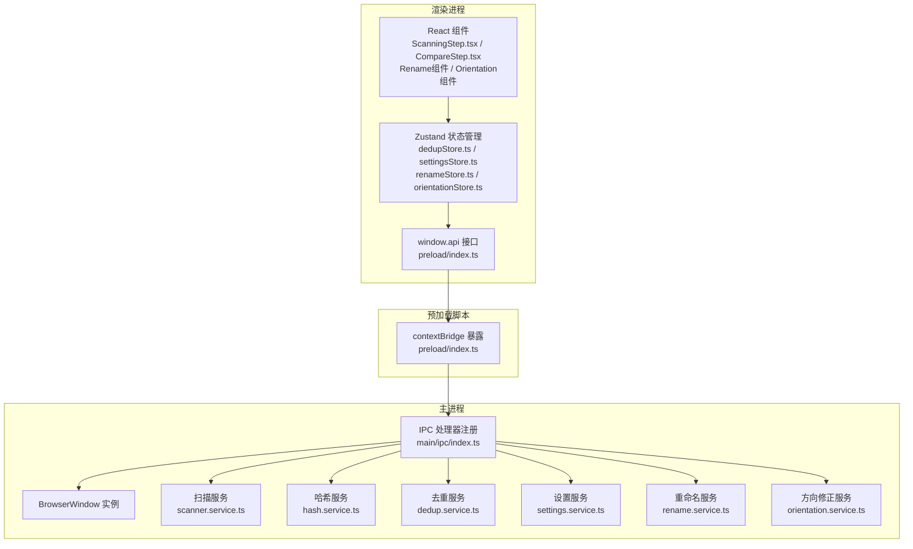
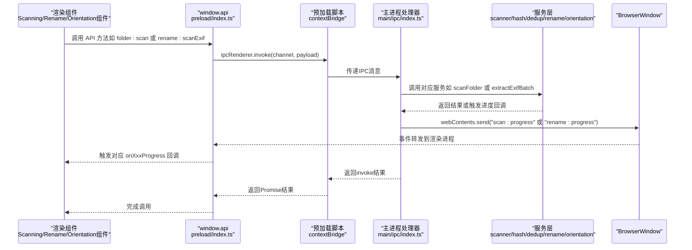
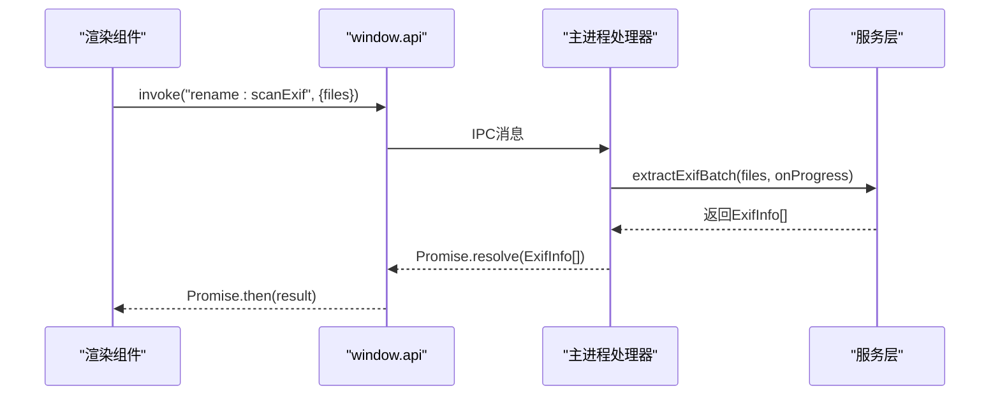
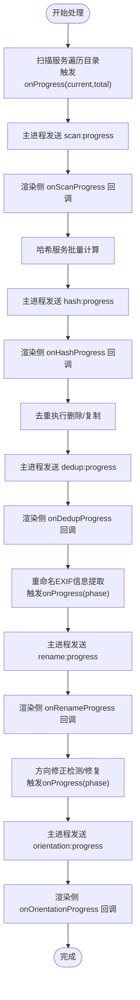
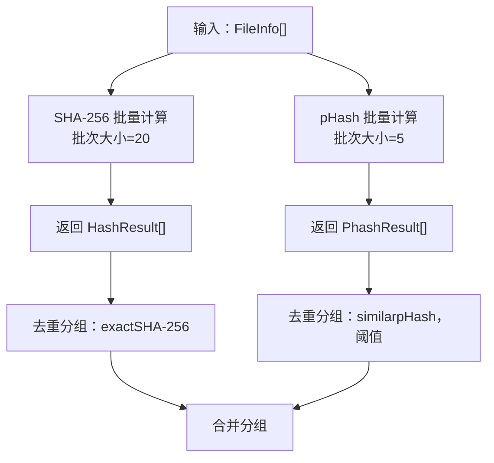
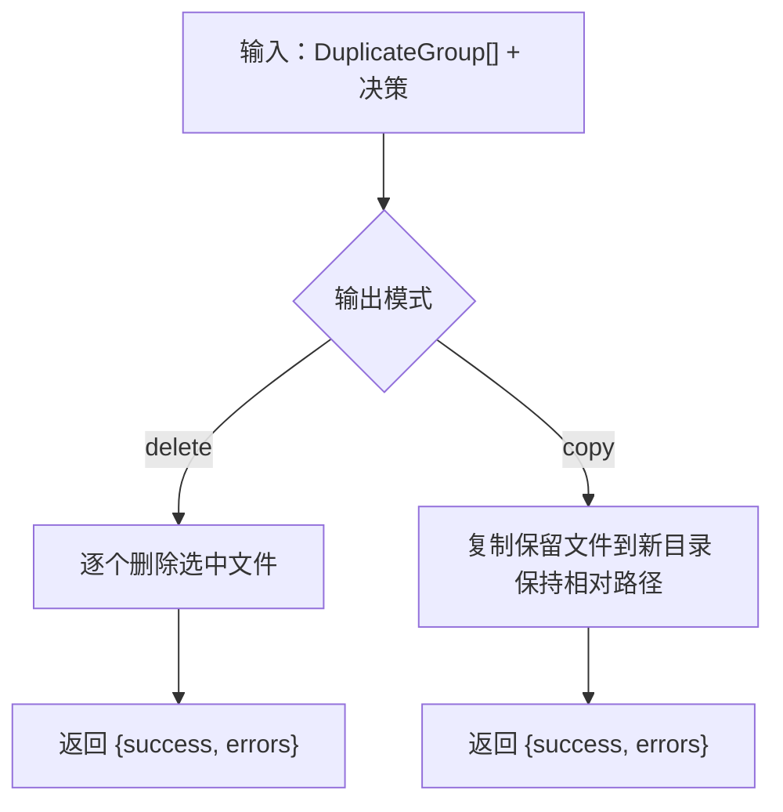
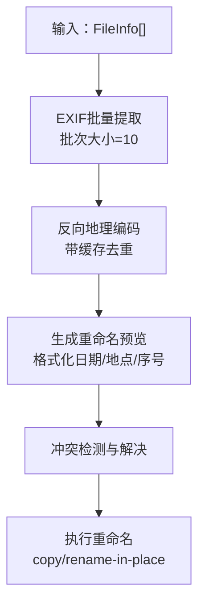
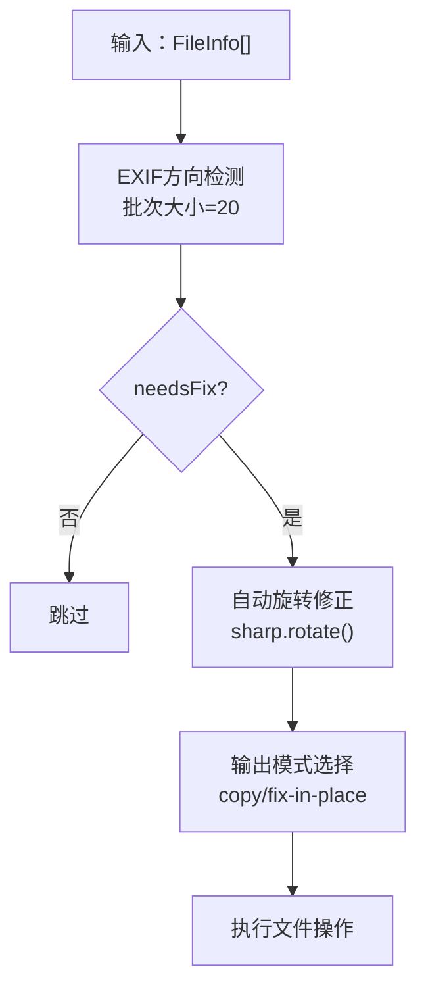
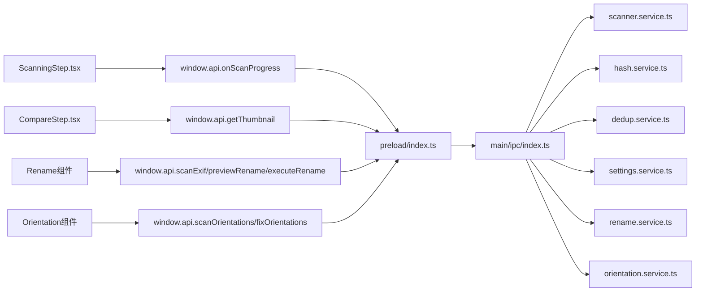

# IPC通信层

<cite>
**本文引用的文件**
- [src/preload/index.ts](file://src/preload/index.ts)
- [src/preload/index.d.ts](file://src/preload/index.d.ts)
- [src/main/ipc/index.ts](file://src/main/ipc/index.ts)
- [src/main/index.ts](file://src/main/index.ts)
- [src/main/services/scanner.service.ts](file://src/main/services/scanner.service.ts)
- [src/main/services/hash.service.ts](file://src/main/services/hash.service.ts)
- [src/main/services/dedup.service.ts](file://src/main/services/dedup.service.ts)
- [src/main/services/settings.service.ts](file://src/main/services/settings.service.ts)
- [src/main/services/rename.service.ts](file://src/main/services/rename.service.ts)
- [src/main/services/orientation.service.ts](file://src/main/services/orientation.service.ts)
- [src/renderer/src/components/ScanningStep.tsx](file://src/renderer/src/components/ScanningStep.tsx)
- [src/renderer/src/components/CompareStep.tsx](file://src/renderer/src/components/CompareStep.tsx)
- [src/renderer/src/stores/dedupStore.ts](file://src/renderer/src/stores/dedupStore.ts)
- [src/renderer/src/stores/settingsStore.ts](file://src/renderer/src/stores/settingsStore.ts)
</cite>

## 更新摘要
**所做更改**
- 新增重命名功能模块的IPC处理器和进度监听机制
- 新增照片方向修正功能模块的IPC处理器和进度监听机制
- 扩展设置系统的配置结构，支持多模块配置管理
- 更新预加载API，增加新的功能模块接口
- 完善进度事件的统一管理和错误状态传播

## 目录
1. [简介](#简介)
2. [项目结构](#项目结构)
3. [核心组件](#核心组件)
4. [架构总览](#架构总览)
5. [详细组件分析](#详细组件分析)
6. [依赖关系分析](#依赖关系分析)
7. [性能考量](#性能考量)
8. [故障排查指南](#故障排查指南)
9. [结论](#结论)
10. [附录：API接口与数据模型](#附录api接口与数据模型)

## 简介
本文件系统性梳理红ophoto应用的IPC（进程间通信）层设计与实现，重点覆盖：
- 预加载脚本的设计原理与contextBridge安全机制
- IPC处理器接口定义与调用协议
- 文件扫描、哈希计算、感知哈希与去重处理的完整通信流程
- **新增重命名功能模块**（EXIF信息提取、地理位置反向地理编码、批量重命名预览与执行）
- **新增照片方向修正功能模块**（EXIF方向信息检测、自动旋转修正）
- 进度监听机制（实时进度与错误状态传播）
- 完整API接口文档（请求格式、响应结构、错误码说明）
- 通信安全与性能优化策略
- 调试技巧与常见问题解决方案

## 项目结构
IPC通信层由四部分组成：
- 预加载脚本（Preload）：通过contextBridge将受限的Electron API暴露给渲染进程
- 主进程（Main）：注册IPC处理器，协调服务层与UI交互
- 渲染进程（Renderer）：通过window.api调用主进程能力，并订阅进度事件
- **服务层扩展**：新增重命名服务和方向修正服务



**图表来源**
- [src/preload/index.ts:131-227](file://src/preload/index.ts#L131-L227)
- [src/main/ipc/index.ts:37-308](file://src/main/ipc/index.ts#L37-L308)
- [src/main/services/rename.service.ts:41-102](file://src/main/services/rename.service.ts#L41-L102)
- [src/main/services/orientation.service.ts:33-77](file://src/main/services/orientation.service.ts#L33-L77)

**章节来源**
- [src/preload/index.ts:1-230](file://src/preload/index.ts#L1-L230)
- [src/main/ipc/index.ts:1-309](file://src/main/ipc/index.ts#L1-L309)
- [src/main/index.ts:1-61](file://src/main/index.ts#L1-L61)

## 核心组件
- 预加载脚本（preload/index.ts）
  - 使用contextBridge.exposeInMainWorld将受控API暴露到window.api
  - 提供窗口控制、文件夹选择与扫描、哈希计算、感知哈希、去重、缩略图生成、设置读取与写入等方法
  - **新增重命名功能API**：scanExif、previewRename、executeRename
  - **新增方向修正功能API**：scanOrientations、fixOrientations
  - 提供扫描、哈希、去重、重命名、方向修正五类进度监听回调
- 主进程IPC处理器（main/ipc/index.ts）
  - 注册窗口控制、文件夹选择、文件扫描、哈希计算、感知哈希、去重分组与执行、缩略图生成、设置读取与写入
  - **新增重命名功能处理器**：rename:scanExif、rename:preview、rename:execute
  - **新增方向修正功能处理器**：orientation:scan、orientation:fix
  - 将进度事件通过webContents.send发送至渲染进程
- 服务层扩展
  - **重命名服务**：EXIF信息提取（日期、GPS坐标）、地理位置反向地理编码、批量重命名预览、重命名执行
  - **方向修正服务**：EXIF方向信息检测、自动旋转修正、原地修复与复制修复模式

**章节来源**
- [src/preload/index.ts:131-227](file://src/preload/index.ts#L131-L227)
- [src/main/ipc/index.ts:37-308](file://src/main/ipc/index.ts#L37-L308)
- [src/main/services/rename.service.ts:41-336](file://src/main/services/rename.service.ts#L41-L336)
- [src/main/services/orientation.service.ts:33-153](file://src/main/services/orientation.service.ts#L33-L153)

## 架构总览
下图展示从渲染进程发起IPC请求到主进程处理并返回结果的端到端流程，以及进度事件的推送路径，包括新增的功能模块。



**图表来源**
- [src/preload/index.ts:198-227](file://src/preload/index.ts#L198-L227)
- [src/main/ipc/index.ts:57-68](file://src/main/ipc/index.ts#L57-L68)
- [src/main/ipc/index.ts:172-223](file://src/main/ipc/index.ts#L172-L223)

## 详细组件分析

### 预加载脚本与contextBridge安全机制
- 暴露范围最小化：仅暴露必要的API到window.api，避免直接暴露Node/Electron全量能力
- 类型声明：通过preload/index.d.ts提供完整的类型签名，确保编译期安全
- **进度监听扩展**：提供onScanProgress、onHashProgress、onDedupProgress、onRenameProgress、onOrientationProgress五个事件监听器，返回解绑函数
- 错误隔离：IPC调用失败时由渲染进程捕获，避免泄露底层异常细节

```mermaid
classDiagram
class PreloadAPI {
+minimizeWindow()
+maximizeWindow()
+closeWindow()
+selectFolder() Promise<string|null>
+scanFolder(folderPath) Promise<FileInfo[]>
+computeHashes(files) Promise<HashResult[]>
+computePhashes(files) Promise<PhashResult[]>
+groupDuplicates(data) Promise<DuplicateGroup[]>
+executeDedup(data) Promise<{success : number,errors : string[]}>
+getThumbnail(filePath,maxSize?) Promise<string>
+getSettings() Promise<AppSettings>
+setSettings(partial) Promise<AppSettings>
+scanExif(files) Promise<ExifInfo[]>
+previewRename(data) Promise<RenamePreview[]>
+executeRename(data) Promise<{success : number,errors : string[]}>
+scanOrientations(files) Promise<OrientationInfo[]>
+fixOrientations(data) Promise<{success : number,errors : string[]}>
+onScanProgress(cb) () => void
+onHashProgress(cb) () => void
+onDedupProgress(cb) () => void
+onRenameProgress(cb) () => void
+onOrientationProgress(cb) () => void
}
class Types {
+FileInfo
+HashResult
+PhashResult
+DuplicateGroup
+DedupDecision
+DedupSettings
+AppSettings
+ExifInfo
+RenamePreview
+RenameConfig
+OrientationInfo
+OrientationConfig
+ScanProgress
+DedupProgress
+RenameProgress
+OrientationProgress
}
PreloadAPI --> Types : "使用"
```

**图表来源**
- [src/preload/index.ts:131-227](file://src/preload/index.ts#L131-L227)
- [src/preload/index.d.ts:22-83](file://src/preload/index.d.ts#L22-L83)

**章节来源**
- [src/preload/index.ts:1-230](file://src/preload/index.ts#L1-L230)
- [src/preload/index.d.ts:1-84](file://src/preload/index.d.ts#L1-L84)

### IPC处理器与通信协议
- 窗口控制：window:minimize、window:maximize、window:close
- 文件夹操作：folder:select（无参数）、folder:scan（payload包含folderPath）
- 哈希计算：hash:computeAll（payload包含files数组）
- 感知哈希：phash:computeAll（payload包含files数组）
- 去重分组：dedup:group（payload包含hashResults、phashResults可选、phashThreshold可选）
- 去重执行：dedup:execute（payload包含decisions、settings、sourceFolder、files）
- 缩略图：file:thumbnail（payload包含filePath、maxSize可选）
- 设置：settings:get、settings:set（payload为部分设置）
- **重命名功能**：
  - rename:scanExif（payload包含files数组，返回ExifInfo[]）
  - rename:preview（payload包含exifInfos、settings、sourceFolder，返回RenamePreview[]）
  - rename:execute（payload包含previews、settings、sourceFolder）
- **方向修正功能**：
  - orientation:scan（payload包含files数组，返回OrientationInfo[]）
  - orientation:fix（payload包含files、settings、sourceFolder）



**图表来源**
- [src/main/ipc/index.ts:172-223](file://src/main/ipc/index.ts#L172-L223)
- [src/main/services/rename.service.ts:41-102](file://src/main/services/rename.service.ts#L41-L102)

**章节来源**
- [src/main/ipc/index.ts:37-308](file://src/main/ipc/index.ts#L37-L308)

### 进度监听机制
- 扫描阶段：主进程在扫描服务回调中向渲染进程发送scan:progress，包含phase、current、total、percentage
- 哈希阶段：主进程在哈希服务回调中向渲染进程发送hash:progress，phase为hashing或phashing
- 去重阶段：主进程在去重执行回调中向渲染进程发送dedup:progress，包含current、total、currentFile、percentage
- **重命名阶段**：主进程在重命名服务回调中向渲染进程发送rename:progress，phase为scanning、geocoding或executing
- **方向修正阶段**：主进程在方向修正服务回调中向渲染进程发送orientation:progress，phase为scanning或fixing
- 渲染侧订阅：预加载脚本提供onScanProgress、onHashProgress、onDedupProgress、onRenameProgress、onOrientationProgress五个监听器，返回解绑函数



**图表来源**
- [src/main/ipc/index.ts:57-68](file://src/main/ipc/index.ts#L57-L68)
- [src/main/ipc/index.ts:85-98](file://src/main/ipc/index.ts#L85-L98)
- [src/main/ipc/index.ts:124-157](file://src/main/ipc/index.ts#L124-L157)
- [src/main/ipc/index.ts:172-268](file://src/main/ipc/index.ts#L172-L268)
- [src/main/ipc/index.ts:270-307](file://src/main/ipc/index.ts#L270-L307)
- [src/preload/index.ts:198-227](file://src/preload/index.ts#L198-L227)

**章节来源**
- [src/main/ipc/index.ts:57-307](file://src/main/ipc/index.ts#L57-L307)
- [src/preload/index.ts:198-227](file://src/preload/index.ts#L198-L227)

### 文件扫描与哈希计算
- 扫描：递归遍历目录，过滤支持的图片扩展名，生成FileInfo列表；按批次统计进度
- SHA-256：流式读取文件，批量计算，错误时返回特殊标记
- pHash：使用sharp进行缩放与灰度转换，实现二维DCT，提取低频块，生成64位二进制字符串
- 汉明距离：用于pHash相似度判断



**图表来源**
- [src/main/services/scanner.service.ts:28-85](file://src/main/services/scanner.service.ts#L28-L85)
- [src/main/services/hash.service.ts:29-56](file://src/main/services/hash.service.ts#L29-L56)
- [src/main/services/hash.service.ts:132-159](file://src/main/services/hash.service.ts#L132-L159)
- [src/main/services/dedup.service.ts:43-115](file://src/main/services/dedup.service.ts#L43-L115)

**章节来源**
- [src/main/services/scanner.service.ts:28-85](file://src/main/services/scanner.service.ts#L28-L85)
- [src/main/services/hash.service.ts:19-101](file://src/main/services/hash.service.ts#L19-L101)
- [src/main/services/hash.service.ts:103-168](file://src/main/services/hash.service.ts#L103-L168)
- [src/main/services/dedup.service.ts:43-115](file://src/main/services/dedup.service.ts#L43-L115)

### 去重处理与执行
- 分组策略：先按SHA-256精确分组，再对非精确组按pHash阈值进行Union-Find聚类
- 执行策略：删除模式直接删除选中文件；复制模式在目标目录重建相对路径结构并复制保留文件
- 进度反馈：按批次推进，每批完成后发送当前文件名与百分比



**图表来源**
- [src/main/services/dedup.service.ts:117-130](file://src/main/services/dedup.service.ts#L117-L130)
- [src/main/services/dedup.service.ts:132-160](file://src/main/services/dedup.service.ts#L132-L160)
- [src/main/services/dedup.service.ts:162-208](file://src/main/services/dedup.service.ts#L162-L208)

**章节来源**
- [src/main/services/dedup.service.ts:117-208](file://src/main/services/dedup.service.ts#L117-L208)

### 重命名功能模块
- **EXIF信息提取**：批量读取DateTimeOriginal、GPSLatitude、GPSLongitude等关键元数据
- **地理位置反向地理编码**：使用OpenStreetMap Nominatim API将GPS坐标转换为地点名称，带缓存机制
- **重命名预览**：根据日期、地点、序列号生成候选文件名，处理重名冲突
- **执行重命名**：支持复制到新目录或原地重命名两种模式，使用临时文件避免冲突



**图表来源**
- [src/main/services/rename.service.ts:41-102](file://src/main/services/rename.service.ts#L41-L102)
- [src/main/services/rename.service.ts:167-258](file://src/main/services/rename.service.ts#L167-L258)
- [src/main/services/rename.service.ts:260-336](file://src/main/services/rename.service.ts#L260-L336)

**章节来源**
- [src/main/services/rename.service.ts:41-336](file://src/main/services/rename.service.ts#L41-L336)

### 方向修正功能模块
- **方向信息检测**：从EXIF数据读取Orientation标签，识别需要修正的方向
- **自动旋转修正**：使用sharp库根据EXIF Orientation自动旋转图像
- **执行模式**：复制到新目录保持原文件不变，或原地修改文件
- **进度反馈**：按需修正的文件数量统计，显示当前处理文件名



**图表来源**
- [src/main/services/orientation.service.ts:33-77](file://src/main/services/orientation.service.ts#L33-L77)
- [src/main/services/orientation.service.ts:79-153](file://src/main/services/orientation.service.ts#L79-L153)

**章节来源**
- [src/main/services/orientation.service.ts:33-153](file://src/main/services/orientation.service.ts#L33-L153)

### 设置持久化
- **多模块配置结构**：dedup、rename、orientation三个独立配置对象
- 默认设置：各模块都有完整的默认配置，支持主题颜色和输出后缀
- 读取：合并默认值与存储值，支持旧格式迁移
- 更新：深度合并部分设置，写入存储并返回最新设置

**章节来源**
- [src/main/services/settings.service.ts:30-128](file://src/main/services/settings.service.ts#L30-L128)

## 依赖关系分析
- 预加载脚本依赖主进程IPC处理器提供的通道名称与数据结构
- 主进程处理器依赖服务层实现具体业务逻辑
- 渲染组件通过Zustand状态管理与window.api交互，订阅进度事件
- **新增功能模块**：重命名和方向修正功能通过各自的IPC处理器与服务层交互



**图表来源**
- [src/preload/index.ts:198-227](file://src/preload/index.ts#L198-L227)
- [src/main/ipc/index.ts:172-307](file://src/main/ipc/index.ts#L172-L307)
- [src/main/services/rename.service.ts:41-336](file://src/main/services/rename.service.ts#L41-L336)
- [src/main/services/orientation.service.ts:33-153](file://src/main/services/orientation.service.ts#L33-L153)

**章节来源**
- [src/preload/index.ts:1-230](file://src/preload/index.ts#L1-L230)
- [src/main/ipc/index.ts:1-309](file://src/main/ipc/index.ts#L1-L309)

## 性能考量
- 批处理与事件让渡
  - 扫描：每批约50个文件后让渡事件循环
  - SHA-256：每批20个文件
  - pHash：每批5个文件
  - **EXIF提取**：每批10个文件
  - **方向检测**：每批20个文件
- I/O优化
  - 流式读取文件计算SHA-256，避免大文件内存占用
  - sharp进行图像处理，减少中间缓冲
  - **重命名**：复制模式使用mkdir递归创建目录，避免重复I/O
- 并发控制
  - 各批内Promise.all并发计算，批间串行以控制资源占用
  - **反向地理编码**：Nominatim API限速1次/秒，避免被封禁
- 进度粒度
  - 每批完成后上报进度，避免过于频繁的事件导致UI卡顿
  - **重命名和方向修正**：按需修正文件数量统计，提供更精确的进度反馈

**章节来源**
- [src/main/services/scanner.service.ts:78-82](file://src/main/services/scanner.service.ts#L78-L82)
- [src/main/services/hash.service.ts:36-53](file://src/main/services/hash.service.ts#L36-L53)
- [src/main/services/hash.service.ts:139-156](file://src/main/services/hash.service.ts#L139-L156)
- [src/main/services/rename.service.ts:32](file://src/main/services/rename.service.ts#L32)
- [src/main/services/orientation.service.ts:31](file://src/main/services/orientation.service.ts#L31)

## 故障排查指南
- 无法收到进度事件
  - 检查是否正确订阅onScanProgress、onHashProgress、onDedupProgress、onRenameProgress、onOrientationProgress并妥善保存解绑函数
  - 确认主进程处理器已注册对应通道
- 哈希计算返回错误
  - SHA-256错误会返回特定标记，渲染侧应忽略该条目或提示用户
  - pHash计算失败会跳过该文件，检查图像格式与sharp依赖
- 去重执行失败
  - 删除模式：检查权限与路径有效性
  - 复制模式：检查目标目录创建与写入权限
- **重命名功能问题**
  - EXIF读取失败：检查exifr库依赖和文件权限
  - 反向地理编码失败：检查网络连接和Nominatim API可用性，查看缓存状态
  - 重命名冲突：检查文件名生成规则和冲突处理逻辑
- **方向修正问题**
  - EXIF读取失败：检查exifr库和图像文件
  - 旋转失败：检查sharp依赖和文件格式支持
- 设置读取失败
  - electron-store初始化失败时，本地设置会回退到默认值

**章节来源**
- [src/preload/index.ts:198-227](file://src/preload/index.ts#L198-L227)
- [src/main/ipc/index.ts:57-307](file://src/main/ipc/index.ts#L57-L307)
- [src/main/services/rename.service.ts:104-150](file://src/main/services/rename.service.ts#L104-L150)
- [src/main/services/orientation.service.ts:79-153](file://src/main/services/orientation.service.ts#L79-L153)
- [src/main/services/settings.service.ts:110-128](file://src/main/services/settings.service.ts#L110-L128)

## 结论
本IPC通信层通过contextBridge实现了最小暴露面的安全边界，结合主进程处理器与服务层，提供了从文件扫描、哈希计算、感知哈希到去重执行的完整工作流，并通过多级进度事件实现良好的用户体验。**新增的重命名和方向修正功能模块进一步丰富了应用的照片管理能力，通过EXIF信息提取、地理位置反向地理编码和自动旋转修正等功能，为用户提供更全面的照片处理解决方案。**整体设计在安全性、可维护性与性能之间取得平衡，适合大规模照片库的综合处理场景。

## 附录：API接口与数据模型

### 预加载API（window.api）
- 窗口控制
  - minimizeWindow(): Promise<void>
  - maximizeWindow(): Promise<void>
  - closeWindow(): Promise<void>
- 文件夹操作
  - selectFolder(): Promise<string | null>
  - scanFolder(folderPath: string): Promise<FileInfo[]>
- 哈希与感知哈希
  - computeHashes(files: FileInfo[]): Promise<HashResult[]>
  - computePhashes(files: FileInfo[]): Promise<PhashResult[]>
- 去重
  - groupDuplicates(data: { hashResults: HashResult[]; phashResults?: PhashResult[]; phashThreshold?: number }): Promise<DuplicateGroup[]>
  - executeDedup(data: { decisions: DedupDecision[]; settings: DedupSettings; sourceFolder: string; files: FileInfo[] }): Promise<{ success: number; errors: string[] }>
- 缩略图
  - getThumbnail(filePath: string, maxSize?: number): Promise<string>
- 设置
  - getSettings(): Promise<AppSettings>
  - setSettings(s: Partial<AppSettings>): Promise<AppSettings>
- **重命名功能**
  - scanExif(files: FileInfo[]): Promise<ExifInfo[]>
  - previewRename(data: { exifInfos: ExifInfo[]; settings: RenameConfig; sourceFolder: string }): Promise<RenamePreview[]>
  - executeRename(data: { previews: RenamePreview[]; settings: RenameConfig; sourceFolder: string }): Promise<{ success: number; errors: string[] }>
- **方向修正功能**
  - scanOrientations(files: FileInfo[]): Promise<OrientationInfo[]>
  - fixOrientations(data: { files: OrientationInfo[]; settings: OrientationConfig; sourceFolder: string }): Promise<{ success: number; errors: string[] }>
- **进度监听**
  - onScanProgress(cb: (data: ScanProgress) => void): () => void
  - onHashProgress(cb: (data: ScanProgress) => void): () => void
  - onDedupProgress(cb: (data: DedupProgress) => void): () => void
  - onRenameProgress(cb: (data: RenameProgress) => void): () => void
  - onOrientationProgress(cb: (data: OrientationProgress) => void): () => void

**章节来源**
- [src/preload/index.ts:131-227](file://src/preload/index.ts#L131-L227)
- [src/preload/index.d.ts:22-83](file://src/preload/index.d.ts#L22-L83)

### 数据模型
- **基础模型**
  - FileInfo：id、path、name、size、ext、modifiedTime
  - HashResult：id、sha256
  - PhashResult：id、phash
  - DuplicateGroup：groupId、hash、matchType、files
  - DedupDecision：groupId、keepFileIds、deleteFileIds
  - DedupSettings：outputMode、outputFolderName
- **设置模型**
  - ThemeColor：'black' | 'white' | 'beige' | 'skyblue' | 'darkblue' | 'kleinblue' | 'gray'
  - DedupConfig：hashMode、phashThreshold、outputMode
  - RenameConfig：outputMode、nameFormat、dateFormat、separator
  - OrientationConfig：outputMode
  - AppSettings：dedup、rename、orientation、outputFolderSuffix、themeColor
- **进度模型**
  - ScanProgress：phase、current、total、percentage
  - DedupProgress：current、total、currentFile、percentage
  - **RenameProgress**：phase、current、total、percentage
  - **OrientationProgress**：phase、current、total、percentage
- **重命名模型**
  - ExifInfo：id、dateTimeOriginal、gpsLatitude、gpsLongitude、locationName、originalName
  - RenamePreview：id、originalPath、originalName、newName、newPath、exifInfo、selected
- **方向修正模型**
  - OrientationInfo：id、path、name、orientation、needsFix、description

**章节来源**
- [src/preload/index.ts:3-129](file://src/preload/index.ts#L3-L129)
- [src/preload/index.d.ts:1-20](file://src/preload/index.d.ts#L1-L20)

### IPC通道与调用协议
- 窗口控制
  - channel: window:minimize/window:maximize/window:close
  - 无参数
- 文件夹选择
  - channel: folder:select
  - 返回：string | null
- 文件夹扫描
  - channel: folder:scan
  - payload: { folderPath: string }
  - 返回：FileInfo[]
- 哈希计算
  - channel: hash:computeAll
  - payload: { files: FileInfo[] }
  - 返回：HashResult[]
- 感知哈希
  - channel: phash:computeAll
  - payload: { files: FileInfo[] }
  - 返回：PhashResult[]
- 去重分组
  - channel: dedup:group
  - payload: { hashResults: HashResult[]; phashResults?: PhashResult[]; phashThreshold?: number }
  - 返回：DuplicateGroup[]
- 去重执行
  - channel: dedup:execute
  - payload: { decisions: DedupDecision[]; settings: DedupSettings; sourceFolder: string; files: FileInfo[] }
  - 返回：{ success: number; errors: string[] }
- 缩略图
  - channel: file:thumbnail
  - payload: { filePath: string; maxSize?: number }
  - 返回：string（data URI）
- 设置
  - channel: settings:get
  - 返回：AppSettings
  - channel: settings:set
  - payload: Partial<AppSettings>
  - 返回：AppSettings
- **重命名功能**
  - channel: rename:scanExif
  - payload: { files: FileInfo[] }
  - 返回：ExifInfo[]
  - channel: rename:preview
  - payload: { exifInfos: ExifInfo[]; settings: RenameConfig; sourceFolder: string }
  - 返回：RenamePreview[]
  - channel: rename:execute
  - payload: { previews: RenamePreview[]; settings: RenameConfig; sourceFolder: string }
  - 返回：{ success: number; errors: string[] }
- **方向修正功能**
  - channel: orientation:scan
  - payload: { files: FileInfo[] }
  - 返回：OrientationInfo[]
  - channel: orientation:fix
  - payload: { files: OrientationInfo[]; settings: OrientationConfig; sourceFolder: string }
  - 返回：{ success: number; errors: string[] }

**章节来源**
- [src/main/ipc/index.ts:37-308](file://src/main/ipc/index.ts#L37-L308)

### 错误码与状态语义
- 哈希计算错误
  - SHA-256：当计算失败时，返回的HashResult.sha256为特定错误标记，表示该文件不可用
- pHash计算错误
  - 当计算失败时，返回的PhashResult.phash为空字符串，表示该文件跳过
- 去重执行错误
  - 删除模式：单个文件删除失败时，记录错误信息并继续处理
  - 复制模式：单个文件复制失败时，记录错误信息并继续处理
- **重命名功能错误**
  - EXIF读取失败：返回空的GPS坐标和null的地点名称
  - 反向地理编码失败：返回null，使用缓存或默认值
  - 文件复制/重命名失败：记录错误并继续处理
- **方向修正错误**
  - EXIF读取失败：返回needsFix=false
  - 图像旋转失败：记录错误并继续处理
- 设置读取失败
  - electron-store初始化失败时，使用默认设置回退

**章节来源**
- [src/main/services/hash.service.ts:43-45](file://src/main/services/hash.service.ts#L43-L45)
- [src/main/services/hash.service.ts:146-148](file://src/main/services/hash.service.ts#L146-L148)
- [src/main/services/dedup.service.ts:149-153](file://src/main/services/dedup.service.ts#L149-L153)
- [src/main/services/rename.service.ts:84-93](file://src/main/services/rename.service.ts#L84-L93)
- [src/main/services/orientation.service.ts:59](file://src/main/services/orientation.service.ts#L59)
- [src/main/services/settings.service.ts:110-128](file://src/main/services/settings.service.ts#L110-L128)