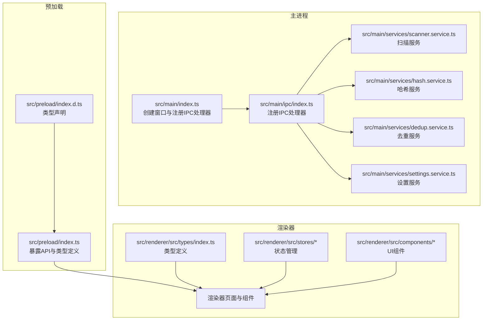
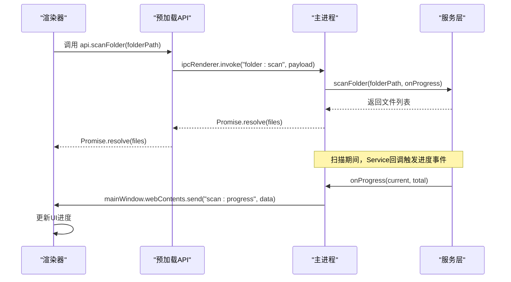
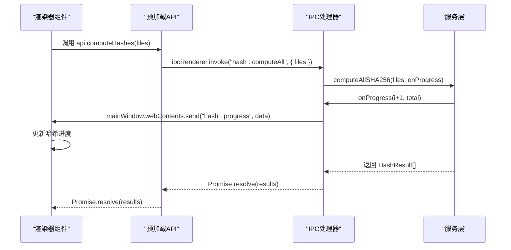
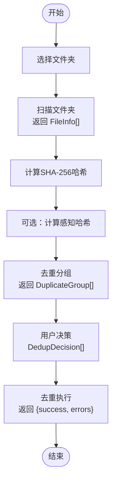
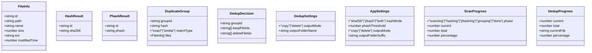
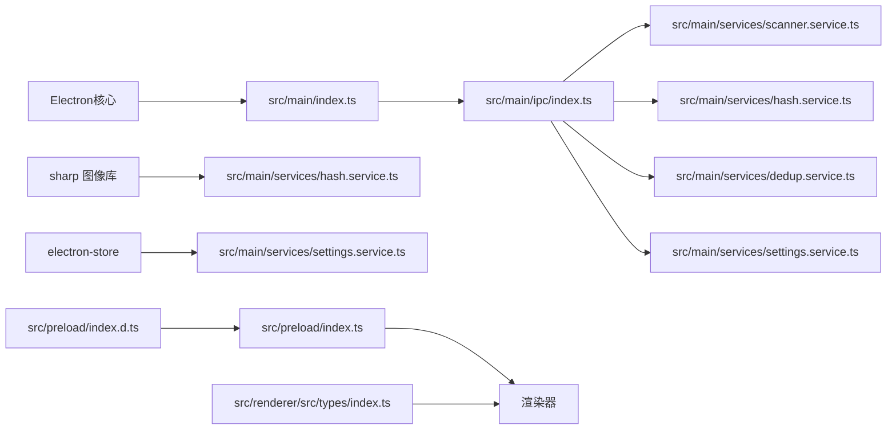

# 通信协议规范

<cite>
**本文档引用的文件**
- [src/main/ipc/index.ts](file://src/main/ipc/index.ts)
- [src/preload/index.ts](file://src/preload/index.ts)
- [src/main/services/scanner.service.ts](file://src/main/services/scanner.service.ts)
- [src/main/services/hash.service.ts](file://src/main/services/hash.service.ts)
- [src/main/services/dedup.service.ts](file://src/main/services/dedup.service.ts)
- [src/main/services/settings.service.ts](file://src/main/services/settings.service.ts)
- [src/main/index.ts](file://src/main/index.ts)
- [src/preload/index.d.ts](file://src/preload/index.d.ts)
- [src/renderer/src/types/index.ts](file://src/renderer/src/types/index.ts)
- [src/renderer/src/stores/scanStore.ts](file://src/renderer/src/stores/scanStore.ts)
- [src/renderer/src/stores/dedupStore.ts](file://src/renderer/src/stores/dedupStore.ts)
- [src/renderer/src/components/ScanningStep.tsx](file://src/renderer/src/components/ScanningStep.tsx)
- [package.json](file://package.json)
</cite>

## 目录
1. [简介](#简介)
2. [项目结构](#项目结构)
3. [核心组件](#核心组件)
4. [架构总览](#架构总览)
5. [详细组件分析](#详细组件分析)
6. [依赖关系分析](#依赖关系分析)
7. [性能考量](#性能考量)
8. [故障排除指南](#故障排除指南)
9. [结论](#结论)
10. [附录](#附录)

## 简介
本文件系统性地定义了 Redophoto 的 IPC（进程间通信）协议规范，涵盖消息格式、事件类型、数据传输规范与进度事件结构。文档还解释了错误码与异常处理机制，提供了完整的 API 调用序列图与数据流图，并包含版本兼容性与向后兼容策略、协议扩展指南以及自定义事件的实现方法。该协议基于 Electron 的 IPC 模型，通过主进程注册处理器、预加载脚本暴露 API、渲染器监听事件的方式实现跨进程通信。

## 项目结构
Redophoto 采用典型的 Electron 应用结构：
- 主进程负责窗口管理、文件系统操作与业务逻辑处理
- 预加载脚本通过 contextBridge 暴露受控 API 给渲染器
- 渲染器通过 API 调用主进程能力并接收进度事件

图表来源
- [src/main/index.ts:1-61](file://src/main/index.ts#L1-L61)
- [src/main/ipc/index.ts:1-156](file://src/main/ipc/index.ts#L1-L156)
- [src/preload/index.ts:1-123](file://src/preload/index.ts#L1-L123)
- [src/main/services/scanner.service.ts:1-86](file://src/main/services/scanner.service.ts#L1-L86)
- [src/main/services/hash.service.ts:1-180](file://src/main/services/hash.service.ts#L1-L180)
- [src/main/services/dedup.service.ts:1-209](file://src/main/services/dedup.service.ts#L1-L209)
- [src/main/services/settings.service.ts:1-34](file://src/main/services/settings.service.ts#L1-L34)
- [src/preload/index.d.ts:1-52](file://src/preload/index.d.ts#L1-L52)
- [src/renderer/src/types/index.ts:1-58](file://src/renderer/src/types/index.ts#L1-L58)

章节来源
- [src/main/index.ts:1-61](file://src/main/index.ts#L1-L61)
- [src/main/ipc/index.ts:1-156](file://src/main/ipc/index.ts#L1-L156)
- [src/preload/index.ts:1-123](file://src/preload/index.ts#L1-L123)
- [src/preload/index.d.ts:1-52](file://src/preload/index.d.ts#L1-L52)
- [src/renderer/src/types/index.ts:1-58](file://src/renderer/src/types/index.ts#L1-L58)

## 核心组件
- IPC 处理器注册：在主进程中集中注册所有 IPC 通道，包括窗口控制、文件夹选择、扫描、哈希计算、感知哈希、去重分组、去重执行、缩略图生成与设置读写。
- 预加载 API：通过 contextBridge 暴露安全可控的 API，统一渲染器访问主进程能力的入口。
- 进度事件：扫描进度、哈希进度、去重进度三类事件，分别对应不同的阶段与数据结构。
- 数据模型：FileInfo、HashResult、PhashResult、DuplicateGroup、DedupDecision、DedupSettings、AppSettings 等，用于描述文件信息、哈希结果、去重决策与应用设置。

章节来源
- [src/main/ipc/index.ts:22-156](file://src/main/ipc/index.ts#L22-L156)
- [src/preload/index.ts:61-123](file://src/preload/index.ts#L61-L123)
- [src/main/services/scanner.service.ts:8-15](file://src/main/services/scanner.service.ts#L8-L15)
- [src/main/services/hash.service.ts:6-14](file://src/main/services/hash.service.ts#L6-L14)
- [src/main/services/dedup.service.ts:7-23](file://src/main/services/dedup.service.ts#L7-L23)
- [src/main/services/settings.service.ts:3-8](file://src/main/services/settings.service.ts#L3-L8)

## 架构总览
IPC 协议遵循“请求-响应”与“事件推送”的混合模式：
- 请求-响应：渲染器通过 ipcRenderer.invoke 调用主进程处理函数，主进程返回 Promise 结果。
- 事件推送：主进程在处理过程中通过 mainWindow.webContents.send 推送进度事件，渲染器通过 ipcRenderer.on 订阅。

图表来源
- [src/main/ipc/index.ts:42-53](file://src/main/ipc/index.ts#L42-L53)
- [src/main/services/scanner.service.ts:28-85](file://src/main/services/scanner.service.ts#L28-L85)
- [src/preload/index.ts:69-70](file://src/preload/index.ts#L69-L70)

## 详细组件分析

### IPC 通道与消息格式
- 窗口控制
  - 通道名：window:minimize、window:maximize、window:close
  - 请求：无参数或空对象
  - 响应：无返回值
- 文件夹选择
  - 通道名：folder:select
  - 请求：无参数
  - 响应：字符串路径或 null
- 文件夹扫描
  - 通道名：folder:scan
  - 请求载荷：{ folderPath: string }
  - 响应：FileInfo[] 数组
  - 进度事件：scan:progress（见下节）
- 哈希计算（SHA-256）
  - 通道名：hash:computeAll
  - 请求载荷：{ files: FileInfo[] }
  - 响应：HashResult[] 数组
  - 进度事件：hash:progress（见下节）
- 感知哈希（pHash）
  - 通道名：phash:computeAll
  - 请求载荷：{ files: FileInfo[] }
  - 响应：PhashResult[] 数组
  - 进度事件：hash:progress（见下节）
- 去重分组
  - 通道名：dedup:group
  - 请求载荷：{ hashResults: HashResult[], phashResults?: PhashResult[], phashThreshold?: number }
  - 响应：DuplicateGroup[] 数组
  - 进度事件：无（分组过程在主进程内完成）
- 去重执行
  - 通道名：dedup:execute
  - 请求载荷：{ decisions: DedupDecision[], settings: DedupSettings, sourceFolder: string, files: FileInfo[] }
  - 响应：{ success: number, errors: string[] }
  - 进度事件：dedup:progress（见下节）
- 缩略图生成
  - 通道名：file:thumbnail
  - 请求载荷：{ filePath: string, maxSize?: number }
  - 响应：data:image/jpeg;base64 字符串
- 设置读取/写入
  - 通道名：settings:get、settings:set
  - 请求载荷：settings:get 无；settings:set 传入部分 AppSettings
  - 响应：当前完整 AppSettings 或更新后的 AppSettings

章节来源
- [src/main/ipc/index.ts:24-155](file://src/main/ipc/index.ts#L24-L155)
- [src/preload/index.ts:61-100](file://src/preload/index.ts#L61-L100)

### 进度事件结构
- 扫描进度（scan:progress）
  - 结构：{ phase: 'scanning' | 'hashing' | 'phashing' | 'grouping' | 'done', current: number, total: number, percentage: number }
  - 触发时机：扫描、哈希、感知哈希、分组、完成阶段
  - 使用场景：渲染器 UI 展示当前阶段与百分比
- 哈希进度（hash:progress）
  - 结构：{ phase: 'scanning' | 'hashing' | 'phashing', current: number, total: number, percentage: number }
  - 触发时机：哈希计算与感知哈希计算
  - 使用场景：渲染器 UI 展示当前阶段与百分比
- 去重进度（dedup:progress）
  - 结构：{ current: number, total: number, currentFile: string, percentage: number }
  - 触发时机：去重执行阶段
  - 使用场景：渲染器 UI 展示当前处理文件与总体进度

章节来源
- [src/main/ipc/index.ts:43-50](file://src/main/ipc/index.ts#L43-L50)
- [src/main/ipc/index.ts:59-66](file://src/main/ipc/index.ts#L59-L66)
- [src/main/ipc/index.ts:74-82](file://src/main/ipc/index.ts#L74-L82)
- [src/main/ipc/index.ts:132-139](file://src/main/ipc/index.ts#L132-L139)
- [src/preload/index.ts:47-59](file://src/preload/index.ts#L47-L59)

### 错误码与异常处理机制
- 文件扫描阶段
  - 对不可访问目录与无法 stat 的文件进行跳过处理，避免中断整体流程
- 哈希计算阶段
  - SHA-256 计算失败时返回特殊标记，确保后续流程继续进行
  - pHash 计算失败时返回空字符串，过滤掉无效结果
- 去重执行阶段
  - 删除模式：删除失败的文件记录错误信息，统计成功数量
  - 复制模式：复制失败的文件记录错误信息，统计成功数量
- 设置读写
  - 使用持久化存储，支持默认值合并与增量更新

章节来源
- [src/main/services/scanner.service.ts:38-42](file://src/main/services/scanner.service.ts#L38-L42)
- [src/main/services/scanner.service.ts:72-74](file://src/main/services/scanner.service.ts#L72-L74)
- [src/main/services/hash.service.ts:43-45](file://src/main/services/hash.service.ts#L43-L45)
- [src/main/services/hash.service.ts:146-148](file://src/main/services/hash.service.ts#L146-L148)
- [src/main/services/dedup.service.ts:148-153](file://src/main/services/dedup.service.ts#L148-L153)
- [src/main/services/dedup.service.ts:198-200](file://src/main/services/dedup.service.ts#L198-L200)
- [src/main/services/settings.service.ts:24-33](file://src/main/services/settings.service.ts#L24-L33)

### API 调用序列图
以下序列图展示了从渲染器发起到主进程处理再到事件推送的完整流程。

图表来源
- [src/preload/index.ts:73-76](file://src/preload/index.ts#L73-L76)
- [src/main/ipc/index.ts:56-68](file://src/main/ipc/index.ts#L56-L68)
- [src/main/services/hash.service.ts:29-56](file://src/main/services/hash.service.ts#L29-L56)

### 数据流图
以下数据流图展示了从扫描到去重执行的端到端数据流转。

图表来源
- [src/main/ipc/index.ts:42-53](file://src/main/ipc/index.ts#L42-L53)
- [src/main/ipc/index.ts:56-83](file://src/main/ipc/index.ts#L56-L83)
- [src/main/ipc/index.ts:86-142](file://src/main/ipc/index.ts#L86-L142)
- [src/main/services/dedup.service.ts:43-115](file://src/main/services/dedup.service.ts#L43-L115)

### 类型与数据模型

图表来源
- [src/renderer/src/types/index.ts:1-58](file://src/renderer/src/types/index.ts#L1-L58)
- [src/preload/index.ts:3-59](file://src/preload/index.ts#L3-L59)

## 依赖关系分析
- 主进程依赖
  - Electron 核心模块：ipcMain、dialog、BrowserWindow
  - 第三方库：sharp（图像处理）、electron-store（设置持久化）
- 预加载依赖
  - Electron contextBridge、ipcRenderer
  - TypeScript 类型定义与全局窗口接口
- 渲染器依赖
  - Zustand（状态管理）
  - React 组件与 Tailwind CSS（UI）

图表来源
- [src/main/index.ts:1-61](file://src/main/index.ts#L1-L61)
- [src/main/services/hash.service.ts:1-5](file://src/main/services/hash.service.ts#L1-L5)
- [src/main/services/settings.service.ts:1-2](file://src/main/services/settings.service.ts#L1-L2)
- [src/main/ipc/index.ts:1-19](file://src/main/ipc/index.ts#L1-L19)
- [src/preload/index.ts:1](file://src/preload/index.ts#L1)
- [src/preload/index.d.ts:1-52](file://src/preload/index.d.ts#L1-L52)
- [src/renderer/src/types/index.ts:1-58](file://src/renderer/src/types/index.ts#L1-L58)

章节来源
- [package.json:13-34](file://package.json#L13-L34)
- [src/main/index.ts:1-61](file://src/main/index.ts#L1-L61)
- [src/main/ipc/index.ts:1-19](file://src/main/ipc/index.ts#L1-L19)
- [src/main/services/hash.service.ts:1-5](file://src/main/services/hash.service.ts#L1-L5)
- [src/main/services/settings.service.ts:1-2](file://src/main/services/settings.service.ts#L1-L2)
- [src/preload/index.ts:1](file://src/preload/index.ts#L1)
- [src/preload/index.d.ts:1-52](file://src/preload/index.d.ts#L1-L52)
- [src/renderer/src/types/index.ts:1-58](file://src/renderer/src/types/index.ts#L1-L58)

## 性能考量
- 批处理与并发
  - SHA-256 批大小：每次处理固定数量文件，平衡内存占用与吞吐量
  - pHash 批大小：感知哈希计算较重，批大小更小以减少内存峰值
- 事件循环让出
  - 在批量处理中定期调用 setImmediate 让出事件循环，避免阻塞 UI
- I/O 优化
  - 扫描阶段先收集路径再逐个 stat，减少不必要的系统调用
  - 去重执行阶段按需创建目标目录，避免重复 I/O
- 内存管理
  - 过滤无效哈希结果，避免累积无效数据
  - 使用 Map/Set 进行快速查找与去重

章节来源
- [src/main/services/hash.service.ts:16-17](file://src/main/services/hash.service.ts#L16-L17)
- [src/main/services/hash.service.ts:36-53](file://src/main/services/hash.service.ts#L36-L53)
- [src/main/services/hash.service.ts:139-156](file://src/main/services/hash.service.ts#L139-L156)
- [src/main/services/scanner.service.ts:78-82](file://src/main/services/scanner.service.ts#L78-L82)
- [src/main/services/dedup.service.ts:154-157](file://src/main/services/dedup.service.ts#L154-L157)
- [src/main/services/dedup.service.ts:202-205](file://src/main/services/dedup.service.ts#L202-L205)

## 故障排除指南
- 扫描阶段
  - 无法访问目录：跳过处理，不影响其他文件
  - 无法 stat 文件：记录错误并继续处理
- 哈希阶段
  - SHA-256 计算失败：返回特殊标记，不影响其他文件
  - pHash 计算失败：返回空字符串，过滤无效结果
- 去重执行阶段
  - 删除失败：记录具体文件路径与错误信息，统计成功数量
  - 复制失败：记录具体文件路径与错误信息，统计成功数量
- 设置读写
  - 默认值合并：若设置缺失，自动回退到默认配置
  - 持久化失败：检查存储权限与磁盘空间

章节来源
- [src/main/services/scanner.service.ts:38-42](file://src/main/services/scanner.service.ts#L38-L42)
- [src/main/services/scanner.service.ts:72-74](file://src/main/services/scanner.service.ts#L72-L74)
- [src/main/services/hash.service.ts:43-45](file://src/main/services/hash.service.ts#L43-L45)
- [src/main/services/hash.service.ts:146-148](file://src/main/services/hash.service.ts#L146-L148)
- [src/main/services/dedup.service.ts:148-153](file://src/main/services/dedup.service.ts#L148-L153)
- [src/main/services/dedup.service.ts:198-200](file://src/main/services/dedup.service.ts#L198-L200)
- [src/main/services/settings.service.ts:24-33](file://src/main/services/settings.service.ts#L24-L33)

## 结论
Redophoto 的 IPC 协议通过清晰的通道划分、标准化的消息格式与完善的进度事件机制，实现了从扫描、哈希、感知哈希到去重执行的全链路自动化。协议具备良好的错误恢复能力与性能表现，适合在桌面环境中稳定运行。建议在扩展新功能时遵循现有命名约定与数据结构，确保向后兼容性。

## 附录

### 版本兼容性与向后兼容策略
- 类型保持稳定：核心数据模型（FileInfo、HashResult、PhashResult、DuplicateGroup、DedupDecision、DedupSettings、AppSettings）保持字段不变，新增字段建议使用可选属性
- 事件名称前缀：新增事件建议使用新的前缀，避免与现有事件冲突
- 默认值策略：新增设置项时提供合理默认值，确保旧版本配置仍可正常工作
- 错误处理：保持错误信息的稳定性，避免破坏渲染器对错误的解析

章节来源
- [src/renderer/src/types/index.ts:1-58](file://src/renderer/src/types/index.ts#L1-L58)
- [src/preload/index.ts:3-59](file://src/preload/index.ts#L3-L59)
- [src/main/services/settings.service.ts:10-15](file://src/main/services/settings.service.ts#L10-L15)

### 协议扩展指南
- 新增 IPC 通道
  - 在主进程注册处理器，定义请求载荷与响应结构
  - 在预加载脚本中暴露对应的 API 方法
  - 在渲染器中添加类型定义与调用示例
- 新增事件
  - 选择合适的事件前缀（如 myplugin:progress）
  - 定义事件数据结构，确保字段语义明确
  - 在主进程处理逻辑中发送事件，并在渲染器订阅
- 自定义事件实现步骤
  - 定义事件名与数据结构
  - 在主进程处理器中触发事件
  - 在预加载脚本中暴露订阅方法
  - 在渲染器组件中订阅并更新 UI

章节来源
- [src/main/ipc/index.ts:22-156](file://src/main/ipc/index.ts#L22-L156)
- [src/preload/index.ts:103-119](file://src/preload/index.ts#L103-L119)