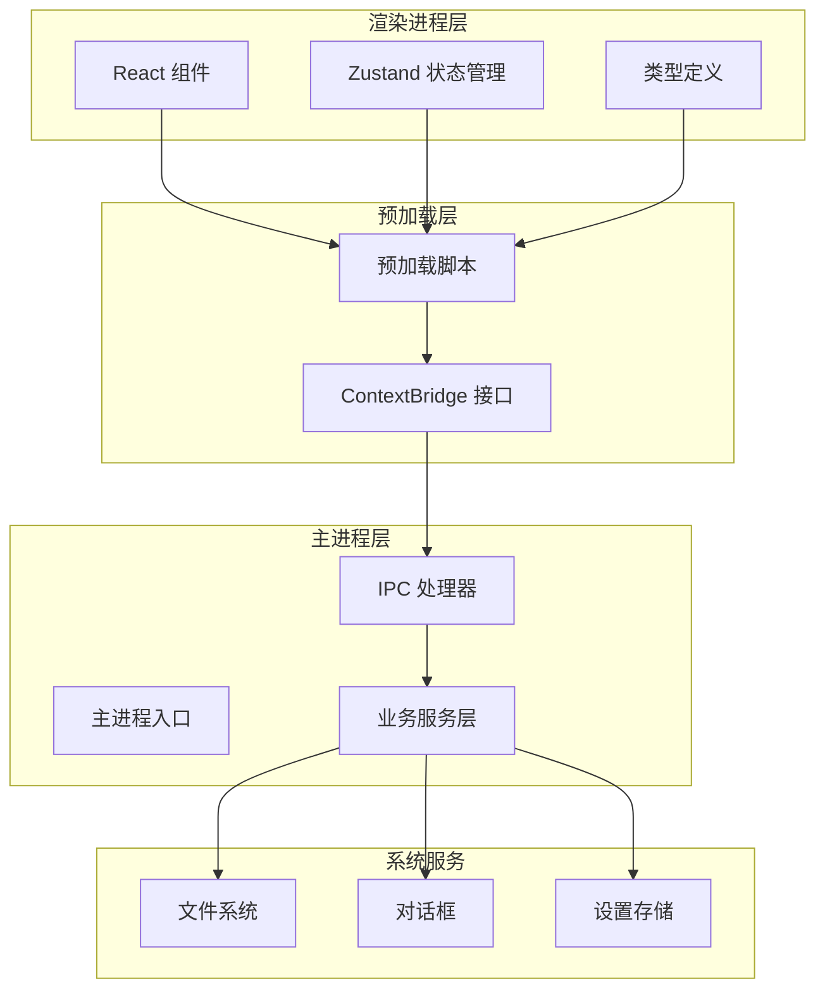
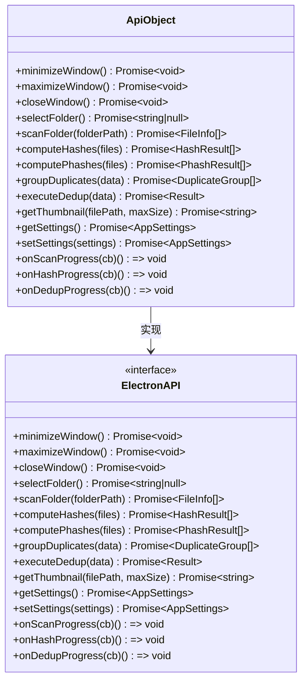
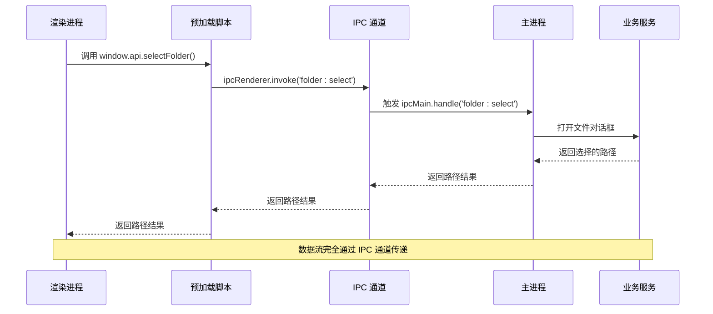
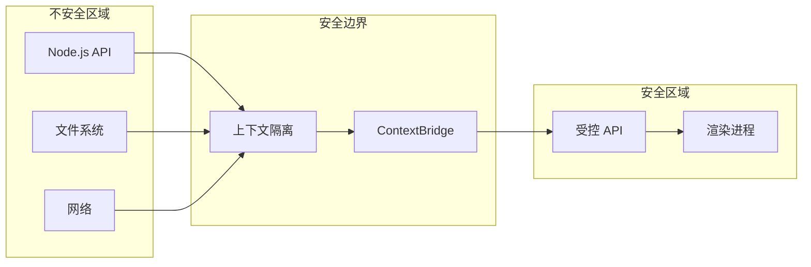
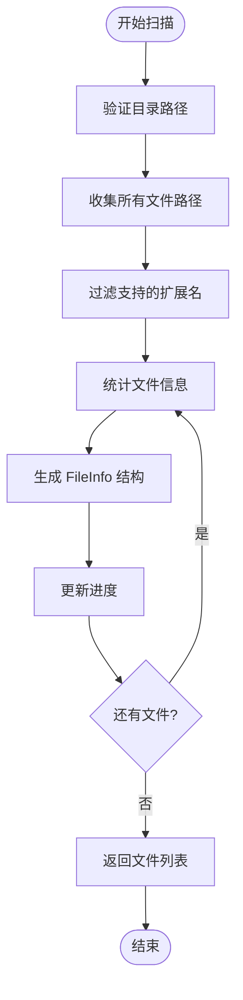
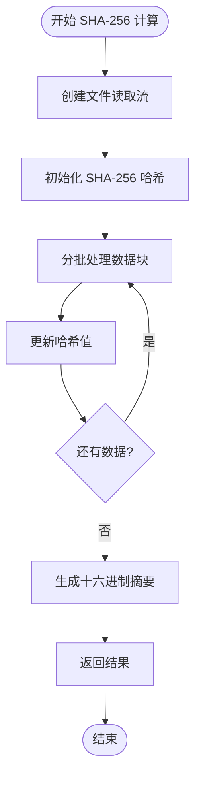
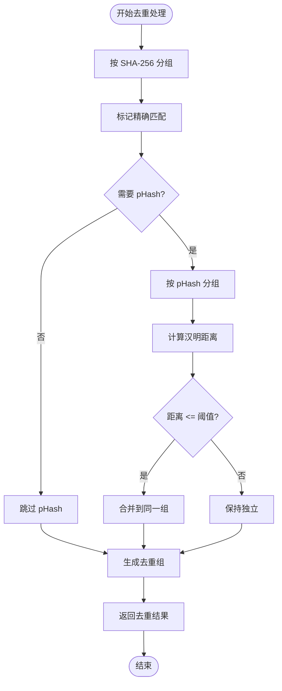
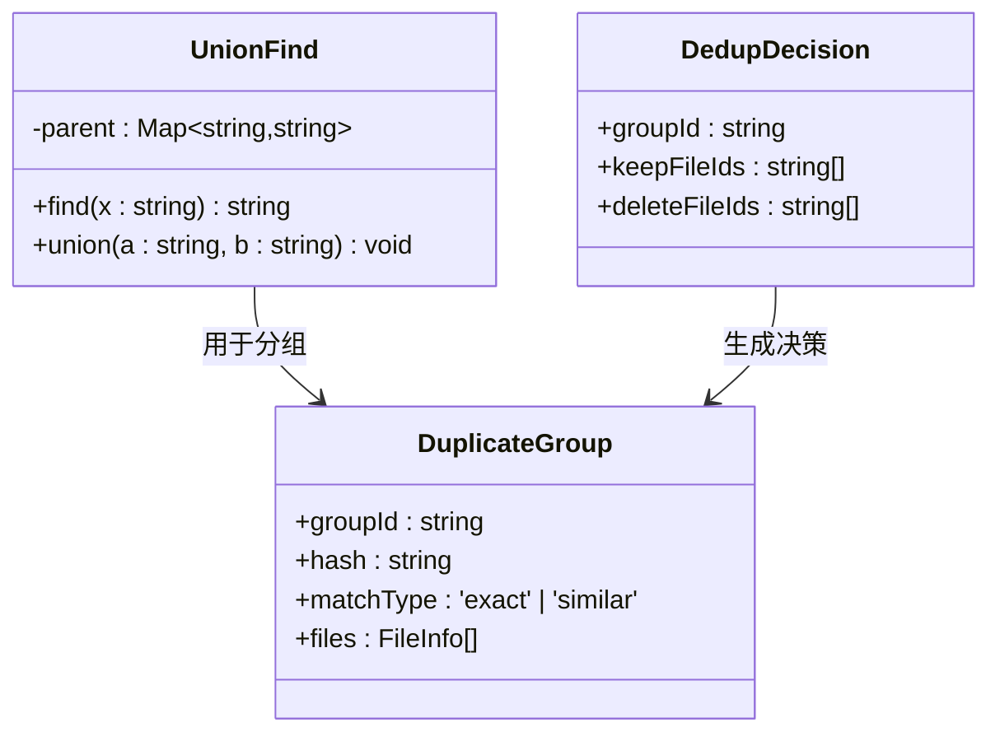
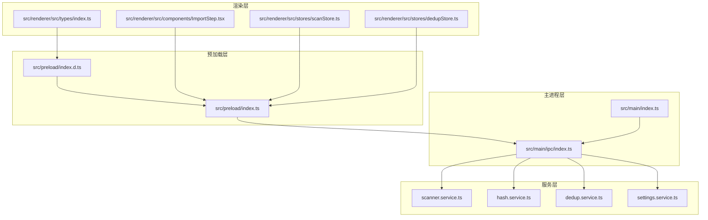
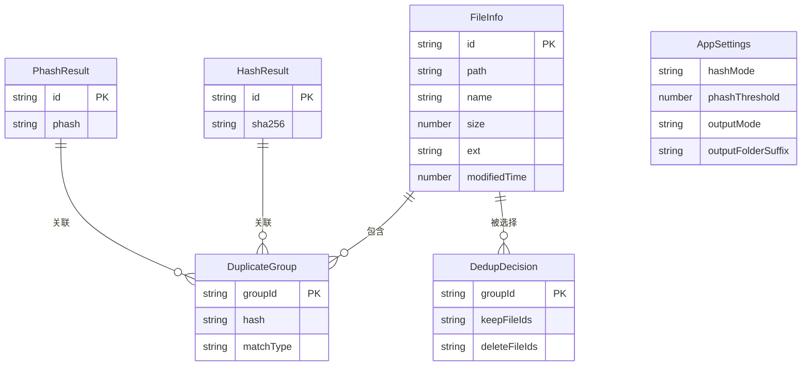

# 预加载脚本设计

<cite>
**本文档引用的文件**
- [src/preload/index.ts](file://src/preload/index.ts)
- [src/preload/index.d.ts](file://src/preload/index.d.ts)
- [src/main/ipc/index.ts](file://src/main/ipc/index.ts)
- [src/main/services/scanner.service.ts](file://src/main/services/scanner.service.ts)
- [src/main/services/hash.service.ts](file://src/main/services/hash.service.ts)
- [src/main/services/dedup.service.ts](file://src/main/services/dedup.service.ts)
- [src/main/services/settings.service.ts](file://src/main/services/settings.service.ts)
- [src/main/index.ts](file://src/main/index.ts)
- [src/renderer/src/components/ImportStep.tsx](file://src/renderer/src/components/ImportStep.tsx)
- [src/renderer/src/stores/scanStore.ts](file://src/renderer/src/stores/scanStore.ts)
- [src/renderer/src/stores/dedupStore.ts](file://src/renderer/src/stores/dedupStore.ts)
- [src/renderer/src/types/index.ts](file://src/renderer/src/types/index.ts)
- [package.json](file://package.json)
</cite>

## 目录
1. [简介](#简介)
2. [项目结构](#项目结构)
3. [核心组件](#核心组件)
4. [架构概览](#架构概览)
5. [详细组件分析](#详细组件分析)
6. [依赖关系分析](#依赖关系分析)
7. [性能考虑](#性能考虑)
8. [故障排除指南](#故障排除指南)
9. [结论](#结论)

## 简介

Redophoto 是一个基于 Electron 的照片去重桌面应用程序。本文档深入分析了预加载脚本的设计与实现，重点解释了 Electron 的 contextBridge 安全机制和 API 暴露策略，以及如何将主进程的 IPC 处理器安全地暴露给渲染进程。

预加载脚本作为渲染进程和主进程之间的桥梁，通过 contextBridge 将受控的 API 暴露给渲染进程，同时保持了 Electron 安全模型的核心原则：上下文隔离和最小权限暴露。

## 项目结构

项目采用模块化的架构设计，主要分为以下层次：



**图表来源**
- [src/main/index.ts:8-46](file://src/main/index.ts#L8-L46)
- [src/preload/index.ts:61-122](file://src/preload/index.ts#L61-L122)

**章节来源**
- [src/main/index.ts:1-61](file://src/main/index.ts#L1-L61)
- [src/preload/index.ts:1-123](file://src/preload/index.ts#L1-L123)

## 核心组件

### ContextBridge 安全机制

预加载脚本的核心是 `contextBridge.exposeInMainWorld` 方法，它实现了 Electron 安全模型的关键部分：

1. **上下文隔离**: 渲染进程无法直接访问 Node.js API
2. **最小权限暴露**: 仅暴露必要的 API 函数
3. **类型安全**: 通过 TypeScript 接口确保参数和返回值的正确性

### API 暴露策略

预加载脚本通过 `api` 对象统一管理所有可访问的 API：



**图表来源**
- [src/preload/index.ts:61-122](file://src/preload/index.ts#L61-L122)
- [src/preload/index.d.ts:13-45](file://src/preload/index.d.ts#L13-L45)

**章节来源**
- [src/preload/index.ts:122](file://src/preload/index.ts#L122)
- [src/preload/index.d.ts:47-51](file://src/preload/index.d.ts#L47-L51)

## 架构概览

### 整体架构流程



**图表来源**
- [src/preload/index.ts:68](file://src/preload/index.ts#L68)
- [src/main/ipc/index.ts:32-39](file://src/main/ipc/index.ts#L32-L39)

### 安全边界分析



**图表来源**
- [src/main/index.ts:22-27](file://src/main/index.ts#L22-L27)
- [src/preload/index.ts:122](file://src/preload/index.ts#L122)

**章节来源**
- [src/main/index.ts:22-27](file://src/main/index.ts#L22-L27)
- [src/preload/index.ts:122](file://src/preload/index.ts#L122)

## 详细组件分析

### 文件扫描服务

文件扫描服务负责递归遍历指定目录，识别支持的照片格式文件：



**图表来源**
- [src/main/services/scanner.service.ts:28-85](file://src/main/services/scanner.service.ts#L28-L85)

#### 关键特性
- 支持多种图片格式：JPG、PNG、GIF、BMP、WebP、TIFF
- 使用 ID 生成算法确保文件唯一性
- 进度回调机制支持长时间操作的用户反馈
- 错误处理确保扫描过程的稳定性

**章节来源**
- [src/main/services/scanner.service.ts:4-85](file://src/main/services/scanner.service.ts#L4-L85)

### 哈希计算服务

哈希计算服务提供了两种去重算法：

#### SHA-256 哈希计算



**图表来源**
- [src/main/services/hash.service.ts:19-27](file://src/main/services/hash.service.ts#L19-L27)

#### pHash 相似度检测

pHash 算法通过以下步骤实现图像相似度检测：

1. **图像预处理**: 缩放到 32x32 像素，转换为灰度图
2. **DCT 变换**: 应用二维离散余弦变换
3. **特征提取**: 提取 8x8 低频分量
4. **二进制哈希**: 计算像素均值，生成 64 位二进制字符串
5. **距离计算**: 使用汉明距离衡量相似度

**章节来源**
- [src/main/services/hash.service.ts:58-101](file://src/main/services/hash.service.ts#L58-L101)
- [src/main/services/hash.service.ts:132-159](file://src/main/services/hash.service.ts#L132-L159)

### 去重处理服务

去重服务实现了智能的重复照片检测和处理机制：



**图表来源**
- [src/main/services/dedup.service.ts:43-115](file://src/main/services/dedup.service.ts#L43-L115)

#### Union-Find 数据结构

去重服务使用 Union-Find（并查集）数据结构高效管理相似图片的分组：



**图表来源**
- [src/main/services/dedup.service.ts:26-41](file://src/main/services/dedup.service.ts#L26-L41)
- [src/main/services/dedup.service.ts:7-23](file://src/main/services/dedup.service.ts#L7-L23)

**章节来源**
- [src/main/services/dedup.service.ts:25-115](file://src/main/services/dedup.service.ts#L25-L115)

### 设置管理系统

设置系统提供了持久化的配置管理：

```mermaid
classDiagram
class AppSettings {
+hashMode : 'sha256' | 'phash' | 'both'
+phashThreshold : number
+outputMode : 'copy' | 'delete'
+outputFolderSuffix : string
}
class SettingsStore {
-store : Store~{settings : AppSettings}~
-DEFAULT_SETTINGS : AppSettings
+getSettings() AppSettings
+setSettings(partial : Partial~AppSettings~) AppSettings
}
class ElectronStore {
+get(key : string, defaultValue : any) any
+set(key : string, value : any) void
}
SettingsStore --> AppSettings : 管理
SettingsStore --> ElectronStore : 使用
```

**图表来源**
- [src/main/services/settings.service.ts:3-8](file://src/main/services/settings.service.ts#L3-L8)
- [src/main/services/settings.service.ts:17-33](file://src/main/services/settings.service.ts#L17-L33)

**章节来源**
- [src/main/services/settings.service.ts:17-33](file://src/main/services/settings.service.ts#L17-L33)

## 依赖关系分析

### 核心依赖关系



**图表来源**
- [src/preload/index.ts:1](file://src/preload/index.ts#L1)
- [src/main/ipc/index.ts:1](file://src/main/ipc/index.ts#L1)

### 类型定义关系



**图表来源**
- [src/main/services/scanner.service.ts:8-15](file://src/main/services/scanner.service.ts#L8-L15)
- [src/main/services/hash.service.ts:6-14](file://src/main/services/hash.service.ts#L6-L14)
- [src/main/services/dedup.service.ts:7-23](file://src/main/services/dedup.service.ts#L7-L23)
- [src/main/services/settings.service.ts:3-8](file://src/main/services/settings.service.ts#L3-L8)

**章节来源**
- [src/renderer/src/types/index.ts:1-58](file://src/renderer/src/types/index.ts#L1-L58)

## 性能考虑

### 批处理优化

系统采用了多级批处理策略来优化性能：

1. **SHA-256 批处理**: 每批处理 20 个文件
2. **pHash 批处理**: 每批处理 5 个文件  
3. **事件循环让渡**: 每批处理后让渡给事件循环

### 内存管理

- 使用流式处理避免大文件内存占用
- 及时清理临时数据和缓存
- 合理的错误处理避免资源泄漏

### 并行处理

- 文件扫描阶段使用异步递归
- 哈希计算阶段使用 Promise.all 并行处理
- 进度回调机制提供实时反馈

## 故障排除指南

### 常见问题及解决方案

#### 1. 预加载脚本无法加载

**症状**: 渲染进程无法访问 `window.api`

**可能原因**:
- 预加载脚本路径配置错误
- 上下文隔离设置不当
- TypeScript 类型定义缺失

**解决方案**:
- 检查主进程 webPreferences 中的 preload 路径
- 确认 contextIsolation 设置为 true
- 验证预加载脚本的编译输出

#### 2. IPC 通信失败

**症状**: API 调用无响应或报错

**可能原因**:
- IPC 处理器未正确注册
- 参数类型不匹配
- 权限不足

**解决方案**:
- 在主进程中确认 registerIpcHandlers 已调用
- 检查参数类型定义是否一致
- 验证文件系统权限

#### 3. 性能问题

**症状**: 大文件扫描缓慢

**解决方案**:
- 调整批处理大小
- 优化文件过滤逻辑
- 添加进度回调减少等待时间

**章节来源**
- [src/main/index.ts:22-27](file://src/main/index.ts#L22-L27)
- [src/main/ipc/index.ts:22-156](file://src/main/ipc/index.ts#L22-L156)

## 结论

Redophoto 的预加载脚本设计充分体现了 Electron 安全模型的最佳实践。通过 contextBridge 实现的受控 API 暴露，既保证了功能的完整性，又维护了应用的安全边界。

### 设计优势

1. **安全性**: 严格的上下文隔离和最小权限暴露
2. **可维护性**: 清晰的模块划分和接口定义
3. **性能**: 合理的批处理策略和异步处理机制
4. **可扩展性**: 模块化的架构便于功能扩展

### 最佳实践建议

1. **持续集成**: 建立自动化测试确保 API 兼容性
2. **错误处理**: 完善的异常捕获和用户反馈机制
3. **性能监控**: 实时监控处理进度和资源使用情况
4. **安全审计**: 定期审查 API 暴露范围和权限设置

这个设计为 Electron 应用的预加载脚本实现提供了一个优秀的参考模板，平衡了功能性、安全性和可维护性的各个方面。