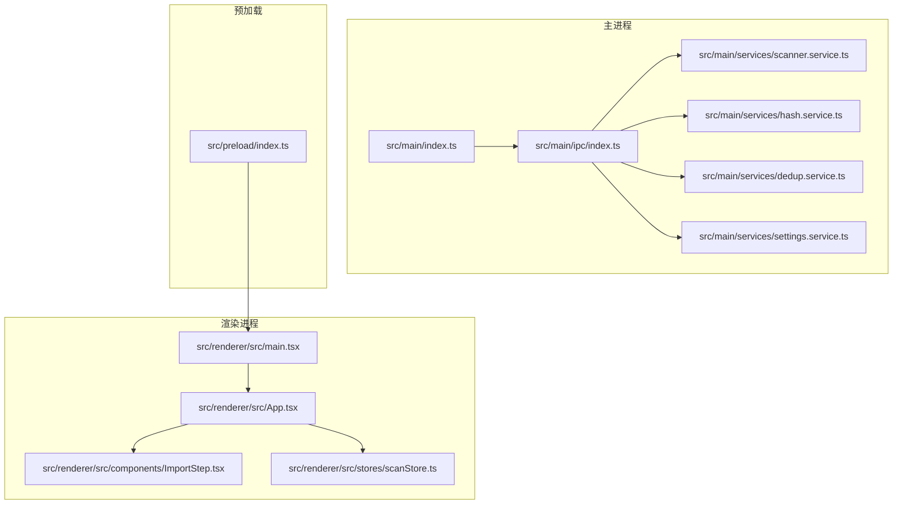
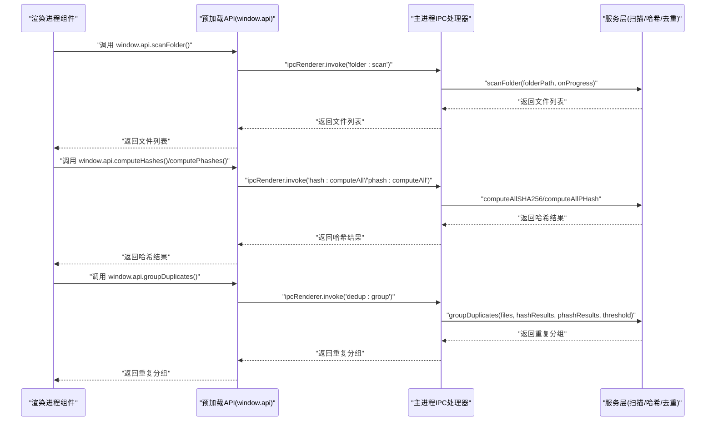
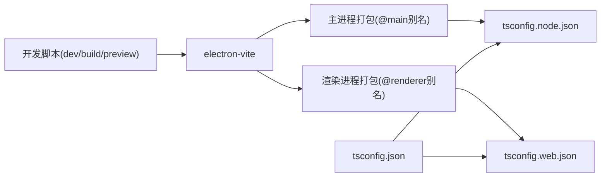

# 开发者指南

<cite>
**本文引用的文件**
- [.gitignore](file://.gitignore)
- [README.md](file://README.md)
- [package.json](file://package.json)
- [electron.vite.config.ts](file://electron.vite.config.ts)
- [tsconfig.json](file://tsconfig.json)
- [tsconfig.node.json](file://tsconfig.node.json)
- [tsconfig.web.json](file://tsconfig.web.json)
- [src/main/index.ts](file://src/main/index.ts)
- [src/preload/index.ts](file://src/preload/index.ts)
- [src/main/ipc/index.ts](file://src/main/ipc/index.ts)
- [src/main/services/scanner.service.ts](file://src/main/services/scanner.service.ts)
- [src/main/services/hash.service.ts](file://src/main/services/hash.service.ts)
- [src/main/services/dedup.service.ts](file://src/main/services/dedup.service.ts)
- [src/main/services/settings.service.ts](file://src/main/services/settings.service.ts)
- [src/renderer/src/main.tsx](file://src/renderer/src/main.tsx)
- [src/renderer/src/App.tsx](file://src/renderer/src/App.tsx)
- [src/renderer/src/components/ImportStep.tsx](file://src/renderer/src/components/ImportStep.tsx)
- [src/renderer/src/stores/scanStore.ts](file://src/renderer/src/stores/scanStore.ts)
</cite>

## 更新摘要
**所做更改**
- 新增版本控制系统初始化章节，介绍 .gitignore 配置和 Git 工作流程
- 更新开发工作流程，增加 Git 版本控制最佳实践
- 新增项目基础文档说明，包含 README.md 的内容和用途
- 完善代码质量保证措施，增加 Git 提交规范和分支管理策略

## 目录
1. [简介](#简介)
2. [版本控制系统初始化](#版本控制系统初始化)
3. [项目基础文档](#项目基础文档)
4. [项目结构](#项目结构)
5. [核心组件](#核心组件)
6. [架构总览](#架构总览)
7. [详细组件分析](#详细组件分析)
8. [依赖关系分析](#依赖关系分析)
9. [性能考虑](#性能考虑)
10. [调试指南](#调试指南)
11. [代码质量与格式化](#代码质量与格式化)
12. [开发工作流程](#开发工作流程)
13. [故障排查](#故障排查)
14. [结论](#结论)

## 简介
本指南面向红ophoto项目的开发者，目标是帮助你快速搭建开发环境、理解代码结构、掌握调试技巧，并建立规范的开发与协作流程。项目采用 Electron + React + TypeScript 技术栈，使用 electron-vite 进行构建与开发，主进程负责系统级能力（文件扫描、哈希计算、去重执行），渲染进程负责用户界面与交互。

## 版本控制系统初始化
项目已初始化 Git 版本控制系统，包含完整的 .gitignore 配置，用于排除不需要纳入版本控制的文件和目录。

### .gitignore 配置详解
项目使用精心设计的 .gitignore 规则来管理版本控制中的文件排除：

**依赖管理**
- `node_modules/`：排除 Node.js 依赖包，使用 `npm ci` 或 `yarn install` 重新安装
- TypeScript 构建缓存：`*.tsbuildinfo`

**构建输出**
- `out/` 和 `dist/`：排除 Electron 构建产物和打包输出

**日志与临时文件**
- `*.log`、`npm-debug.log*`、`yarn-debug.log*`、`yarn-error.log*`

**操作系统文件**
- `.DS_Store`、`Thumbs.db`、`desktop.ini`

**IDE 配置**
- `.vscode/`、`.idea/`、`*.swp`、`*.swo`

**环境变量**
- `.env`、`.env.local`、`.env.*.local`

**Electron 缓存**
- `electron-download/`：排除 Electron 下载缓存

**章节来源**
- [.gitignore:1-35](file://.gitignore#L1-L35)

## 项目基础文档
项目包含基础的项目文档，为新贡献者提供项目基本信息和快速入门指导。

### README.md 内容说明
项目的基础文档简洁明了地介绍了项目的核心信息：
- 项目名称：ReDoPhoto
- 项目描述：Windows 桌面照片去重应用

该文档为项目的官方介绍，帮助用户快速了解项目用途和目标平台。

**章节来源**
- [README.md:1-3](file://README.md#L1-L3)

## 项目结构
项目采用按职责分层的目录组织方式：
- src/main：Electron 主进程代码，包含 IPC 注册、服务层（扫描、哈希、去重、设置）与入口文件
- src/preload：预加载脚本，通过 contextBridge 暴露受控 API 给渲染进程
- src/renderer：React 渲染进程前端，包含组件、状态管理（Zustand）、类型定义与样式
- 配置文件：electron.vite.config.ts、tsconfig.* 等

**图表来源**
- [src/main/index.ts:1-61](file://src/main/index.ts#L1-L61)
- [src/main/ipc/index.ts:1-156](file://src/main/ipc/index.ts#L1-L156)
- [src/main/services/scanner.service.ts:1-86](file://src/main/services/scanner.service.ts#L1-L86)
- [src/main/services/hash.service.ts:1-180](file://src/main/services/hash.service.ts#L1-L180)
- [src/main/services/dedup.service.ts:1-209](file://src/main/services/dedup.service.ts#L1-L209)
- [src/main/services/settings.service.ts:1-34](file://src/main/services/settings.service.ts#L1-L34)
- [src/preload/index.ts:1-123](file://src/preload/index.ts#L1-L123)
- [src/renderer/src/main.tsx:1-11](file://src/renderer/src/main.tsx#L1-L11)
- [src/renderer/src/App.tsx:1-35](file://src/renderer/src/App.tsx#L1-L35)
- [src/renderer/src/components/ImportStep.tsx:1-174](file://src/renderer/src/components/ImportStep.tsx#L1-L174)
- [src/renderer/src/stores/scanStore.ts:1-52](file://src/renderer/src/stores/scanStore.ts#L1-L52)

**章节来源**
- [package.json:1-51](file://package.json#L1-L51)
- [electron.vite.config.ts:1-26](file://electron.vite.config.ts#L1-L26)
- [tsconfig.json:1-8](file://tsconfig.json#L1-L8)
- [tsconfig.node.json:1-21](file://tsconfig.node.json#L1-L21)

## 核心组件
- 主进程入口：负责创建窗口、加载渲染页面、注册 IPC 处理器
- 预加载 API：通过 contextBridge 暴露受控方法给渲染进程，统一处理 IPC 调用与进度事件订阅
- 服务层：
  - 扫描服务：遍历文件夹，过滤支持的图片格式，生成文件元数据
  - 哈希服务：计算 SHA-256 与 pHash，提供批量处理与进度回调
  - 去重服务：基于 SHA-256 精确分组与 pHash 相似分组，支持删除或复制输出
  - 设置服务：基于 electron-store 的本地设置持久化
- 渲染进程：React 应用，使用 Zustand 管理全局状态，组件驱动 UI 流程

**章节来源**
- [src/main/index.ts:1-61](file://src/main/index.ts#L1-L61)
- [src/preload/index.ts:1-123](file://src/preload/index.ts#L1-L123)
- [src/main/services/scanner.service.ts:1-86](file://src/main/services/scanner.service.ts#L1-L86)
- [src/main/services/hash.service.ts:1-180](file://src/main/services/hash.service.ts#L1-L180)
- [src/main/services/dedup.service.ts:1-209](file://src/main/services/dedup.service.ts#L1-L209)
- [src/main/services/settings.service.ts:1-34](file://src/main/services/settings.service.ts#L1-L34)
- [src/renderer/src/main.tsx:1-11](file://src/renderer/src/main.tsx#L1-L11)
- [src/renderer/src/App.tsx:1-35](file://src/renderer/src/App.tsx#L1-L35)

## 架构总览
下图展示从渲染进程发起任务到主进程服务执行再到结果返回的关键调用链路。

**图表来源**
- [src/renderer/src/components/ImportStep.tsx:22-82](file://src/renderer/src/components/ImportStep.tsx#L22-L82)
- [src/preload/index.ts:61-120](file://src/preload/index.ts#L61-L120)
- [src/main/ipc/index.ts:42-154](file://src/main/ipc/index.ts#L42-L154)
- [src/main/services/scanner.service.ts:28-85](file://src/main/services/scanner.service.ts#L28-L85)
- [src/main/services/hash.service.ts:29-159](file://src/main/services/hash.service.ts#L29-L159)
- [src/main/services/dedup.service.ts:43-115](file://src/main/services/dedup.service.ts#L43-L115)

## 详细组件分析

### 主进程窗口与生命周期
- 创建窗口时启用无边框标题栏、禁用沙箱但开启上下文隔离，预加载脚本路径在开发与生产模式下分别指向环境变量或本地 HTML 文件
- 注册 IPC 处理器，统一接收来自渲染进程的请求并转发至对应服务

**章节来源**
- [src/main/index.ts:8-46](file://src/main/index.ts#L8-L46)

### 预加载 API 设计
- 使用接口定义对外暴露的数据结构（如 FileInfo、HashResult、DuplicateGroup 等）
- 暴露窗口控制、文件夹选择、扫描、哈希、去重、缩略图、设置读取与写入等方法
- 提供进度监听器 onScanProgress/onHashProgress/onDedupProgress，内部通过 ipcRenderer.on 订阅并返回取消函数

**章节来源**
- [src/preload/index.ts:3-123](file://src/preload/index.ts#L3-L123)

### IPC 注册与路由
- 注册窗口控制、文件夹选择、扫描、哈希、pHash、去重分组、去重执行、缩略图生成、设置读取与写入等处理器
- 将进度事件通过 mainWindow.webContents.send 推送回渲染进程

**章节来源**
- [src/main/ipc/index.ts:22-155](file://src/main/ipc/index.ts#L22-L155)

### 扫描服务
- 支持扩展名白名单，递归遍历目录，分两阶段收集路径与统计文件信息
- 每处理一定数量文件让出事件循环，避免阻塞
- 生成带时间戳的文件 ID，用于跨阶段关联

**章节来源**
- [src/main/services/scanner.service.ts:28-85](file://src/main/services/scanner.service.ts#L28-L85)

### 哈希与 pHash 服务
- SHA-256：流式计算，批处理提升吞吐，错误标记为特殊值
- pHash：使用 sharp 缩放到 32x32 灰度，DCT 变换提取低频块，生成 64 位二进制字符串
- 批量处理：SHA-256 批大小 20，pHash 批大小 5；每批完成后让出事件循环
- Hamming 距离：用于 pHash 分组阈值判断

**章节来源**
- [src/main/services/hash.service.ts:19-179](file://src/main/services/hash.service.ts#L19-L179)

### 去重服务
- 精确分组：按 SHA-256 结果聚合，形成 exact 类型分组
- 相似分组：对不在 exact 组中的文件计算 pHash，使用并查集合并，距离不超过阈值即视为同一组
- 执行策略：
  - 删除模式：直接删除选中重复文件
  - 复制模式：在源目录同级创建输出文件夹，复制非重复文件与保留文件

**章节来源**
- [src/main/services/dedup.service.ts:43-209](file://src/main/services/dedup.service.ts#L43-L209)

### 设置服务
- 默认设置：哈希模式、pHash 阈值、输出模式、输出文件夹后缀
- 使用 electron-store 持久化，读取时与默认值合并

**章节来源**
- [src/main/services/settings.service.ts:10-33](file://src/main/services/settings.service.ts#L10-L33)

### 渲染进程应用与状态
- 入口：创建根节点并渲染 App
- App：根据当前阶段渲染不同步骤组件，顶部显示标题栏，底部根据阶段切换
- ImportStep：选择文件夹、扫描、计算哈希、分组、进入对比与执行阶段
- Zustand 状态：管理当前阶段、文件列表、进度、错误、重复分组与执行结果

**章节来源**
- [src/renderer/src/main.tsx:1-11](file://src/renderer/src/main.tsx#L1-L11)
- [src/renderer/src/App.tsx:1-35](file://src/renderer/src/App.tsx#L1-L35)
- [src/renderer/src/components/ImportStep.tsx:1-174](file://src/renderer/src/components/ImportStep.tsx#L1-L174)
- [src/renderer/src/stores/scanStore.ts:25-51](file://src/renderer/src/stores/scanStore.ts#L25-L51)

## 依赖关系分析
- 构建与运行：electron-vite 驱动开发与打包，脚本提供 dev/build/preview 等命令
- 类型与模块解析：tsconfig.json 作为引用入口，分别指向 node/web 两个编译上下文；electron.vite.config.ts 配置了 @main 与 @renderer 别名
- 依赖：electron、react、sharp、zustand、electron-store 等

**图表来源**
- [package.json:6-12](file://package.json#L6-L12)
- [electron.vite.config.ts:5-24](file://electron.vite.config.ts#L5-L24)
- [tsconfig.json:1-8](file://tsconfig.json#L1-L8)
- [tsconfig.node.json:11-13](file://tsconfig.node.json#L11-L13)

**章节来源**
- [package.json:1-51](file://package.json#L1-L51)
- [electron.vite.config.ts:1-26](file://electron.vite.config.ts#L1-L26)
- [tsconfig.json:1-8](file://tsconfig.json#L1-L8)
- [tsconfig.node.json:1-21](file://tsconfig.node.json#L1-L21)

## 性能考虑
- 批处理与让出事件循环：哈希与 pHash 批大小控制并发粒度，避免长时间占用事件循环
- I/O 优化：扫描阶段分两步减少重复 stat 次数；复制模式按相对路径重建目录结构
- 图像处理：pHash 使用 sharp 进行缩放与灰度转换，降低后续 DCT 计算成本
- 内存管理：避免在主进程持有大对象引用，及时清理进度监听器与中间结果

## 调试指南
- 开发环境启动
  - 使用 npm run dev 启动开发服务器，electron-vite 自动注入开发地址
  - 生产构建：npm run build；预览：npm run preview
- 主进程调试
  - 在 VS Code 中添加 Electron 主进程调试配置，附加到主进程进行断点调试
  - 关注窗口创建、IPC 注册与服务调用链
- 渲染进程调试
  - 在浏览器开发者工具中调试 React 组件与状态变化
  - 使用 React DevTools 检查组件树与状态更新
- IPC 通信调试
  - 在预加载 API 中打印 invoke/on 调用与参数
  - 在主进程 IPC 处理器中记录事件名、参数与返回值
- 进度与错误
  - 通过 onScanProgress/onHashProgress/onDedupProgress 观察阶段与百分比
  - ImportStep 中捕获异常并设置错误状态，便于定位问题

**章节来源**
- [package.json:6-12](file://package.json#L6-L12)
- [src/main/index.ts:39-43](file://src/main/index.ts#L39-L43)
- [src/preload/index.ts:103-119](file://src/preload/index.ts#L103-L119)
- [src/main/ipc/index.ts:42-154](file://src/main/ipc/index.ts#L42-L154)
- [src/renderer/src/components/ImportStep.tsx:10-20](file://src/renderer/src/components/ImportStep.tsx#L10-L20)

## 代码质量与格式化
- TypeScript 配置
  - 根 tsconfig.json 通过 references 引入 node 与 web 两个编译上下文
  - node 上下文启用 @main 路径映射，便于主进程模块引用
- ESLint 与 Prettier
  - 当前仓库未包含 ESLint 与 Prettier 配置文件；建议新增 .eslintrc.* 与 .prettierrc 或在 package.json 中配置 lint 脚本
  - 推荐规则：严格模式、no-any、import/no-cycle、prettier 格式化一致性
- 提交前检查
  - 建议在提交钩子中集成 lint 与类型检查，确保代码风格与类型安全

**章节来源**
- [tsconfig.json:1-8](file://tsconfig.json#L1-L8)
- [tsconfig.node.json:11-13](file://tsconfig.node.json#L11-L13)

## 开发工作流程
- 分支管理
  - 主分支：稳定版本，仅合并经审查的特性分支
  - 特性分支：按功能拆分，例如 feature/add-ui、fix/scan-bug
  - 发布分支：release/vX.Y.Z 用于发布前修复
- 代码审查
  - 提交 Pull Request，至少一名维护者审查
  - 关注：可读性、性能影响、错误处理、测试覆盖
- 测试策略
  - 单元测试：针对服务层（扫描、哈希、去重）编写测试，模拟文件系统与外部依赖
  - 集成测试：端到端验证 IPC 调用与 UI 流程
  - 回归测试：发布前回归关键流程（扫描、去重、复制/删除）
- Git 版本控制实践
  - 提交信息规范：使用清晰的动词开头（feat:、fix:、docs:、style:、refactor:、test:、chore:）
  - 分支命名规范：feature/xxx、fix/xxx、docs/xxx、chore/xxx
  - 提交前检查：确保通过所有测试和代码检查
  - 合并与冲突解决：使用 rebase 保持线性历史，解决冲突后进行最终测试

**更新** 新增 Git 版本控制最佳实践，包括提交信息规范、分支命名规范和合并策略

**章节来源**
- [.gitignore:1-35](file://.gitignore#L1-L35)
- [README.md:1-3](file://README.md#L1-L3)

## 故障排查
- 窗口无法显示或空白
  - 检查主进程窗口 webPreferences 配置与预加载路径
  - 确认开发环境变量 ELECTRON_RENDERER_URL 是否正确
- 扫描无结果
  - 确认所选目录包含受支持的图片扩展名
  - 检查权限与磁盘访问
- 哈希或 pHash 失败
  - 检查文件是否损坏或不可读
  - 查看服务层错误标记与日志
- 去重执行异常
  - 删除模式需确保有足够权限删除文件
  - 复制模式确认目标目录可写且空间充足
- 进度不更新
  - 确认渲染进程已订阅对应进度事件并在组件卸载时正确移除监听

**章节来源**
- [src/main/index.ts:8-46](file://src/main/index.ts#L8-L46)
- [src/main/services/scanner.service.ts:28-85](file://src/main/services/scanner.service.ts#L28-L85)
- [src/main/services/hash.service.ts:19-179](file://src/main/services/hash.service.ts#L19-L179)
- [src/main/services/dedup.service.ts:132-209](file://src/main/services/dedup.service.ts#L132-L209)
- [src/preload/index.ts:103-119](file://src/preload/index.ts#L103-L119)

## 结论
本指南提供了红ophoto项目的开发环境搭建、代码结构理解、调试技巧与质量保障建议。项目已初始化 Git 版本控制系统，包含完整的 .gitignore 配置和基础文档。建议在团队内统一 IDE 插件、提交规范与审查流程，持续完善测试与文档，以保证项目的长期可维护性与稳定性。Git 版本控制实践的引入将进一步提升代码质量和协作效率。