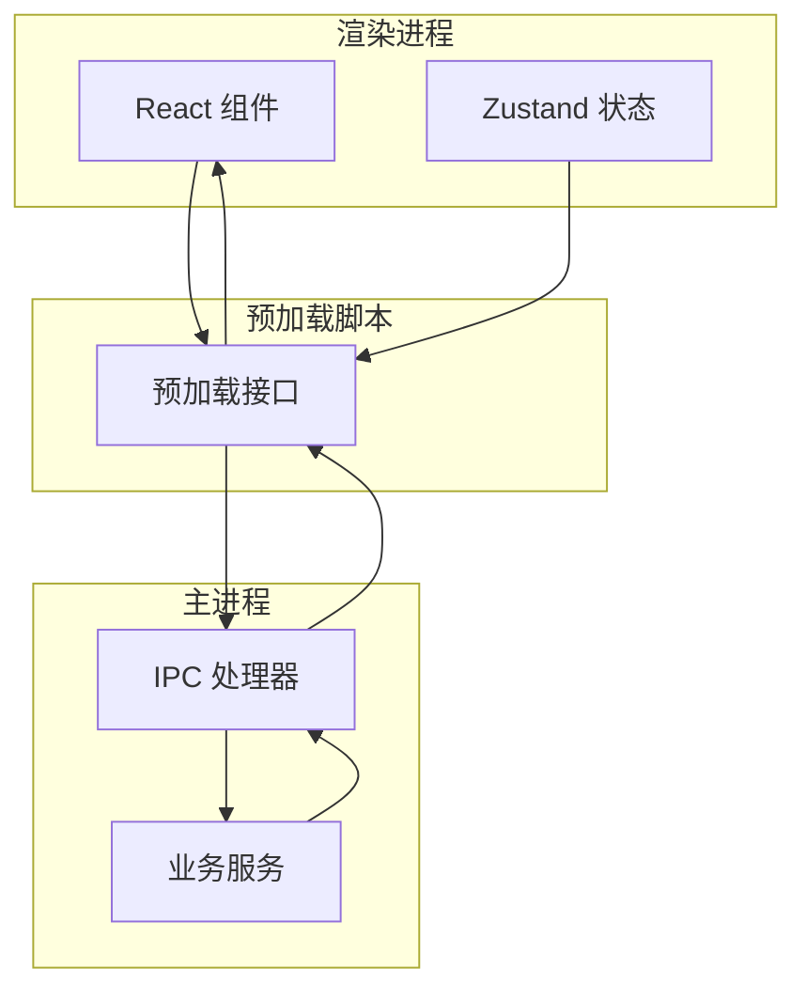

<docs>
# 快速开始

<cite>
**本文引用的文件**
- [README.md](file://README.md)
- [package.json](file://package.json)
- [electron.vite.config.ts](file://electron.vite.config.ts)
- [src/main/index.ts](file://src/main/index.ts)
- [src/main/ipc/index.ts](file://src/main/ipc/index.ts)
- [src/main/services/scanner.service.ts](file://src/main/services/scanner.service.ts)
- [src/main/services/hash.service.ts](file://src/main/services/hash.service.ts)
- [src/main/services/dedup.service.ts](file://src/main/services/dedup.service.ts)
- [src/renderer/src/main.tsx](file://src/renderer/src/main.tsx)
- [src/renderer/src/App.tsx](file://src/renderer/src/App.tsx)
- [src/renderer/src/components/ImportStep.tsx](file://src/renderer/src/components/ImportStep.tsx)
- [src/renderer/src/components/ScanningStep.tsx](file://src/renderer/src/components/ScanningStep.tsx)
- [src/renderer/src/stores/dedupStore.ts](file://src/renderer/src/stores/dedupStore.ts)
</cite>

## 更新摘要
**所做更改**
- 新增项目初始化步骤，包含README.md作为项目基础文档
- 更新环境搭建流程，强调项目基础信息获取
- 完善30分钟快速开始指南，增加项目初始化环节

## 目录
1. [简介](#简介)
2. [项目初始化](#项目初始化)
3. [环境准备](#环境准备)
4. [安装依赖](#安装依赖)
5. [启动开发服务器](#启动开发服务器)
6. [基本使用流程](#基本使用流程)
7. [不同操作系统安装指导](#不同操作系统安装指导)
8. [项目结构概览](#项目结构概览)
9. [核心组件说明](#核心组件说明)
10. [故障排除指南](#故障排除指南)
11. [结语](#结语)

## 简介
欢迎使用 ReDoPhoto！这是一个基于 Electron + React + TypeScript 开发的桌面照片去重应用。本指南将帮助你在 Windows、macOS、Linux 三大平台上在约 30 分钟内完成环境准备、项目初始化、安装与运行，并掌握从"选择文件夹 → 执行扫描 → 查看去重结果"的完整工作流程。

**项目特色**：
- 支持精确去重（基于 SHA-256）和相似去重（基于感知哈希 pHash）
- 提供删除和复制两种处理模式
- 跨平台桌面应用，界面友好
- 实时进度反馈和详细日志记录

## 项目初始化
在开始安装之前，让我们先了解项目的基本信息和特性。

**项目基本信息**：
- 应用名称：ReDoPhoto
- 平台：Windows 桌面应用
- 技术栈：Electron + React + TypeScript + Sharp + Zustand
- 核心功能：照片去重、相似图片识别、批量处理

**项目特性**：
- 支持多种图片格式：JPG、PNG、GIF、BMP、WEBP、TIFF
- 智能去重算法：结合精确匹配和感知哈希
- 用户友好的图形界面
- 实时进度显示和错误处理

## 环境准备
在开始安装前，请确保你的系统满足以下最低要求：

**硬件要求**：
- CPU：Intel Core i3 或同等 AMD 处理器
- 内存：4GB RAM（推荐 8GB+）
- 磁盘空间：至少 500MB 可用空间

**软件要求**：
- Node.js：16.x 或更高版本（推荐使用 LTS 版本）
- npm：8.x 或更高版本
- Git：可选（用于克隆项目）

**验证环境**：
```bash
# 检查 Node.js 版本
node --version

# 检查 npm 版本  
npm --version
```

## 安装依赖
按照以下步骤安装项目依赖：

**步骤 1：克隆项目**
```bash
# 使用 HTTPS
git clone https://github.com/your-username/redophoto.git

# 或使用 SSH
git clone git@github.com:your-username/redophoto.git
```

**步骤 2：进入项目目录**
```bash
cd redophoto
```

**步骤 3：安装依赖**
```bash
# 使用 npm 安装
npm install

# 或使用 yarn（如果已安装）
yarn install

# 或使用 pnpm（如果已安装）
pnpm install
```

**步骤 4：验证安装**
```bash
# 检查 package.json 中的依赖
npm list
```

## 启动开发服务器
项目提供了多种启动方式，推荐使用开发模式进行调试：

**启动开发服务器**：
```bash
# 启动开发服务器（推荐）
npm run dev

# 或使用 yarn
yarn dev

# 或使用 pnpm
pnpm dev
```

**开发服务器特性**：
- 自动热重载
- 开发者工具集成
- 实时错误提示
- 支持调试断点

**构建生产版本**：
```bash
# 构建生产版本
npm run build

# 预览生产版本
npm run preview
```

## 基本使用流程
ReDoPhoto 提供了直观的四步工作流程：

**步骤 1：选择文件夹**
1. 打开应用后，点击"导入步骤"
2. 点击"选择文件夹"按钮
3. 浏览并选择包含照片的目录
4. 确认选择并开始扫描

**步骤 2：执行扫描**
1. 系统自动扫描选定文件夹
2. 显示扫描进度条
3. 支持暂停和取消操作
4. 扫描完成后显示文件统计信息

**步骤 3：查看去重结果**
1. 进入"扫描步骤"
2. 查看发现的重复和相似文件
3. 支持预览缩略图
4. 可自定义相似度阈值
5. 选择保留或删除策略

**步骤 4：执行去重**
1. 进入"执行步骤"
2. 确认所有决策
3. 选择处理模式（删除或复制）
4. 执行去重操作
5. 查看最终结果和日志

## 不同操作系统安装指导

### Windows 系统
**安装步骤**：
1. 安装 Node.js（推荐 LTS 版本）
2. 安装 Git（可选，但推荐）
3. 打开命令提示符或 PowerShell
4. 执行上述安装命令
5. 使用 `npm run dev` 启动应用

**注意事项**：
- 确保有足够的磁盘空间
- 避免在系统保护目录中运行
- 如果遇到权限问题，以管理员身份运行

### macOS 系统
**安装步骤**：
1. 安装 Homebrew（如果未安装）
2. 使用以下命令安装 Node.js：
   ```bash
   brew install node
   ```
3. 打开终端，执行项目安装命令
4. 使用 `npm run dev` 启动应用

**macOS 特殊配置**：
```bash
# 如果遇到权限问题
sudo chown -R $(whoami) ~/.npm

# 配置 Homebrew 权限
sudo chown -R $(whoami) /usr/local/lib/node_modules
```

### Linux 系统
**Ubuntu/Debian 系统**：
```bash
# 使用 apt 安装 Node.js
curl -fsSL https://deb.nodesource.com/setup_lts.x | sudo -E bash -
sudo apt-get install -y nodejs

# 或使用包管理器
sudo apt update
sudo apt install nodejs npm
```

**CentOS/RHEL/Fedora 系统**：
```bash
# 使用 dnf（Fedora）
sudo dnf install nodejs npm

# 或使用 yum（CentOS/RHEL）
sudo yum install nodejs npm
```

**通用安装步骤**：
1. 安装 Node.js 和 npm
2. 执行项目安装命令
3. 使用 `npm run dev` 启动应用

## 项目结构概览
ReDoPhoto 采用清晰的分层架构设计：

```
redophoto/
├── src/
│   ├── main/           # 主进程代码（Electron）
│   │   ├── index.ts     # 应用入口
│   │   ├── ipc/         # IPC 通信处理
│   │   └── services/    # 核心业务逻辑
│   ├── preload/         # 预加载脚本
│   └── renderer/        # 渲染进程代码（React）
│       ├── src/         # React 应用源码
│       └── index.html   # 应用入口页面
├── package.json         # 项目配置和依赖
├── electron.vite.config.ts # 构建配置
└── README.md           # 项目说明文档
```

**核心目录说明**：
- `src/main/`：包含主进程的所有逻辑，处理系统交互和文件操作
- `src/renderer/`：包含 React 前端应用，负责用户界面和交互
- `src/preload/`：预加载脚本，提供安全的 IPC 通信接口
- `src/main/services/`：核心业务服务，包括扫描、哈希、去重算法

## 核心组件说明

### 主进程组件
主进程负责应用的核心功能和系统交互：

**主要职责**：
- 窗口管理和生命周期控制
- 系统对话框和文件操作
- IPC 通信处理
- 图像处理和算法执行

**关键服务**：
- `scanner.service.ts`：文件扫描和统计
- `hash.service.ts`：哈希计算和图像处理
- `dedup.service.ts`：去重算法和执行

### 渲染进程组件
渲染进程提供用户界面和交互体验：

**主要组件**：
- `ImportStep.tsx`：文件夹选择界面
- `ScanningStep.tsx`：扫描进度显示
- `CompareStep.tsx`：去重结果对比
- `ExecuteStep.tsx`：执行去重操作

**状态管理**：
- 使用 Zustand 进行状态管理
- 支持去重决策和设置存储
- 实时进度反馈

### IPC 通信架构
应用采用高效的 IPC 通信机制：



## 故障排除指南

### 常见安装问题

**问题 1：Node.js 版本不兼容**
```
Error: Your Node.js version is too old
```
**解决方案**：
- 升级到 Node.js 16.x 或更高版本
- 使用 nvm 管理多个 Node.js 版本

**问题 2：依赖安装失败**
```
Error: EACCES permission denied
```
**解决方案**：
```bash
# 使用 sudo（不推荐）
sudo npm install

# 或配置 npm 权限
sudo chown -R $(whoami) ~/.npm
```

**问题 3：Sharp 依赖编译失败**
```
Error: sharp could not be compiled
```
**解决方案**：
- 安装系统依赖：`sudo apt-get install build-essential`
- 清理缓存：`npm cache clean --force`
- 重新安装：`npm install`

### 开发服务器问题

**问题 4：端口被占用**
```
Error: listen EADDRINUSE
```
**解决方案**：
```bash
# 查找占用端口的进程
lsof -i :3000

# 杀死进程或修改端口
npm run dev -- --port 3001
```

**问题 5：热重载不生效**
**解决方案**：
- 检查文件保存是否正常
- 重启开发服务器
- 清理浏览器缓存

### 应用运行问题

**问题 6：应用启动后空白页面**
**解决方案**：
- 检查控制台错误
- 验证构建是否成功
- 重新安装依赖

**问题 7：文件扫描无结果**
**解决方案**：
- 检查文件夹权限
- 验证图片格式支持
- 确认文件路径有效

## 结语
通过本指南，你应该已经成功完成了 ReDoPhoto 的环境搭建和基本使用。这个项目提供了完整的照片去重解决方案，支持精确和相似双重去重模式。

**下一步建议**：
- 尝试处理不同规模的照片集合
- 探索不同的去重策略和阈值设置
- 查看应用设置和高级功能
- 贡献代码或报告问题

如果你在使用过程中遇到任何问题，欢迎查阅完整的文档或寻求社区帮助。祝你使用愉快！