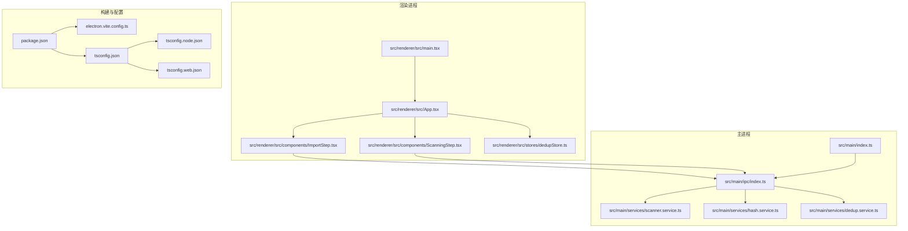
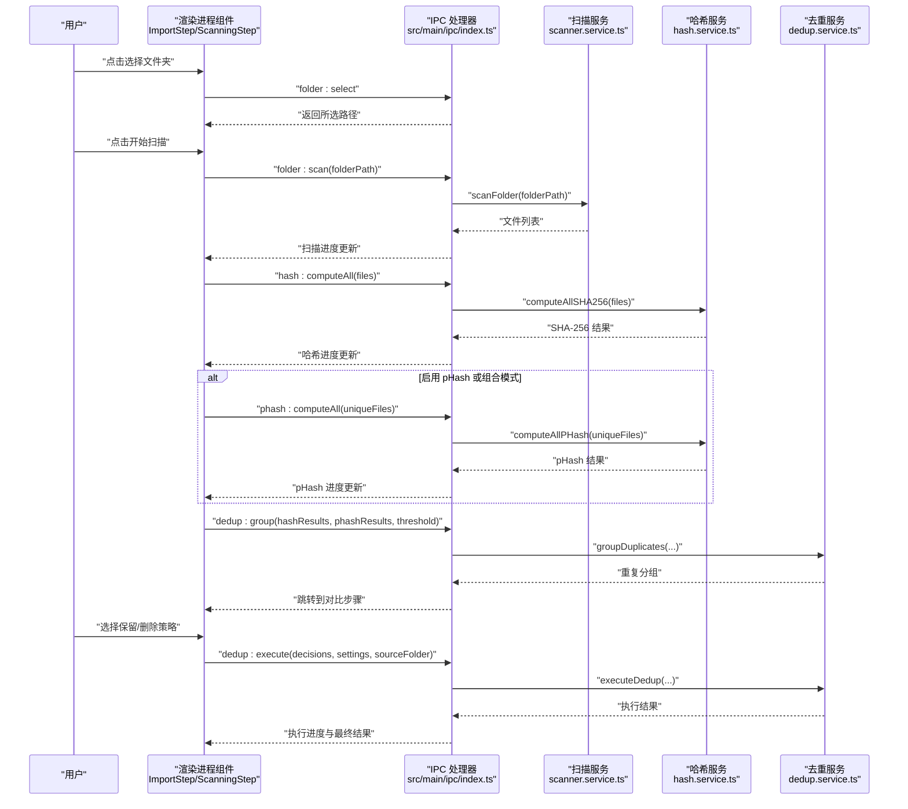
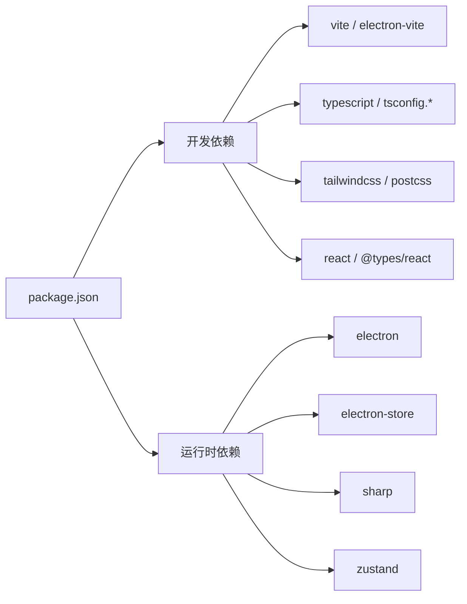

# 快速开始

<cite>
**本文引用的文件**
- [package.json](file://package.json)
- [electron.vite.config.ts](file://electron.vite.config.ts)
- [tsconfig.json](file://tsconfig.json)
- [tsconfig.node.json](file://tsconfig.node.json)
- [tsconfig.web.json](file://tsconfig.web.json)
- [src/main/index.ts](file://src/main/index.ts)
- [src/main/ipc/index.ts](file://src/main/ipc/index.ts)
- [src/main/services/scanner.service.ts](file://src/main/services/scanner.service.ts)
- [src/main/services/hash.service.ts](file://src/main/services/hash.service.ts)
- [src/main/services/dedup.service.ts](file://src/main/services/dedup.service.ts)
- [src/renderer/src/main.tsx](file://src/renderer/src/main.tsx)
- [src/renderer/src/App.tsx](file://src/renderer/src/App.tsx)
- [src/renderer/src/components/ImportStep.tsx](file://src/renderer/src/components/ImportStep.tsx)
- [src/renderer/src/components/ScanningStep.tsx](file://src/renderer/src/components/ScanningStep.tsx)
- [src/renderer/src/stores/dedupStore.ts](file://src/renderer/src/stores/dedupStore.ts)
</cite>

## 目录
1. [简介](#简介)
2. [项目结构](#项目结构)
3. [核心组件](#核心组件)
4. [架构总览](#架构总览)
5. [详细组件分析](#详细组件分析)
6. [依赖分析](#依赖分析)
7. [性能考虑](#性能考虑)
8. [故障排除指南](#故障排除指南)
9. [结论](#结论)
10. [附录](#附录)

## 简介
本指南面向首次接触 Redophoto 的用户，帮助你在 Windows、macOS、Linux 三大平台上在约 30 分钟内完成环境准备、安装与运行，并掌握从“选择文件夹 → 执行扫描 → 查看去重结果”的完整流程。项目采用 Electron + React + TypeScript 技术栈，后端逻辑位于主进程（Node.js），前端渲染位于渲染进程，通过 IPC 进行通信。

## 项目结构
项目采用“主进程 + 渲染进程 + 共享类型与工具”的分层组织方式：
- 主进程（Electron）负责窗口创建、系统对话框、文件扫描、哈希与去重算法、文件操作等
- 渲染进程负责 UI 组件、状态管理、用户交互与进度反馈
- 配置文件统一管理构建、路径别名与编译选项

图表来源
- [src/main/index.ts:1-61](file://src/main/index.ts#L1-L61)
- [src/main/ipc/index.ts:1-156](file://src/main/ipc/index.ts#L1-L156)
- [src/main/services/scanner.service.ts:1-86](file://src/main/services/scanner.service.ts#L1-L86)
- [src/main/services/hash.service.ts:1-180](file://src/main/services/hash.service.ts#L1-L180)
- [src/main/services/dedup.service.ts:1-209](file://src/main/services/dedup.service.ts#L1-L209)
- [src/renderer/src/main.tsx:1-11](file://src/renderer/src/main.tsx#L1-L11)
- [src/renderer/src/App.tsx:1-35](file://src/renderer/src/App.tsx#L1-L35)
- [src/renderer/src/components/ImportStep.tsx:1-174](file://src/renderer/src/components/ImportStep.tsx#L1-L174)
- [src/renderer/src/components/ScanningStep.tsx:1-84](file://src/renderer/src/components/ScanningStep.tsx#L1-L84)
- [src/renderer/src/stores/dedupStore.ts:1-83](file://src/renderer/src/stores/dedupStore.ts#L1-L83)
- [package.json:1-51](file://package.json#L1-L51)
- [electron.vite.config.ts:1-26](file://electron.vite.config.ts#L1-L26)
- [tsconfig.json:1-8](file://tsconfig.json#L1-L8)
- [tsconfig.node.json:1-21](file://tsconfig.node.json#L1-L21)
- [tsconfig.web.json:1-22](file://tsconfig.web.json#L1-L22)

章节来源
- [package.json:1-51](file://package.json#L1-L51)
- [electron.vite.config.ts:1-26](file://electron.vite.config.ts#L1-L26)
- [tsconfig.json:1-8](file://tsconfig.json#L1-L8)
- [tsconfig.node.json:1-21](file://tsconfig.node.json#L1-L21)
- [tsconfig.web.json:1-22](file://tsconfig.web.json#L1-L22)

## 核心组件
- 主进程入口与窗口生命周期：负责创建窗口、注入预加载脚本、注册 IPC 处理器
- IPC 层：封装文件夹选择、扫描、哈希计算、pHash 计算、分组去重、执行去重、缩略图生成、设置读写
- 扫描服务：遍历目录，筛选图片，统计文件信息
- 哈希服务：SHA-256 与 pHash 计算，含批处理与进度回调
- 去重服务：基于 SHA-256 精确分组与基于 pHash 的相似分组，支持删除或复制输出
- 渲染层：React 组件与 Zustand 状态管理，按步骤驱动用户流程

章节来源
- [src/main/index.ts:1-61](file://src/main/index.ts#L1-L61)
- [src/main/ipc/index.ts:1-156](file://src/main/ipc/index.ts#L1-L156)
- [src/main/services/scanner.service.ts:1-86](file://src/main/services/scanner.service.ts#L1-L86)
- [src/main/services/hash.service.ts:1-180](file://src/main/services/hash.service.ts#L1-L180)
- [src/main/services/dedup.service.ts:1-209](file://src/main/services/dedup.service.ts#L1-L209)
- [src/renderer/src/App.tsx:1-35](file://src/renderer/src/App.tsx#L1-L35)
- [src/renderer/src/stores/dedupStore.ts:1-83](file://src/renderer/src/stores/dedupStore.ts#L1-L83)

## 架构总览
下图展示了从用户选择文件夹到查看去重结果的端到端流程，以及主进程与渲染进程之间的 IPC 调用关系。

图表来源
- [src/main/ipc/index.ts:31-155](file://src/main/ipc/index.ts#L31-L155)
- [src/main/services/scanner.service.ts:28-86](file://src/main/services/scanner.service.ts#L28-L86)
- [src/main/services/hash.service.ts:29-180](file://src/main/services/hash.service.ts#L29-L180)
- [src/main/services/dedup.service.ts:43-209](file://src/main/services/dedup.service.ts#L43-L209)
- [src/renderer/src/components/ImportStep.tsx:22-82](file://src/renderer/src/components/ImportStep.tsx#L22-L82)
- [src/renderer/src/components/ScanningStep.tsx:1-84](file://src/renderer/src/components/ScanningStep.tsx#L1-L84)

## 详细组件分析

### 主进程入口与窗口
- 创建主窗口、标题栏覆盖样式、禁用框架窗口、上下文隔离与沙箱配置
- 开发模式下加载 Vite 预览地址，生产模式加载本地 HTML
- 注册 IPC 处理器以供渲染进程调用

章节来源
- [src/main/index.ts:8-46](file://src/main/index.ts#L8-L46)

### IPC 与系统交互
- 窗口控制：最小化、最大化/还原、关闭
- 文件夹选择：弹出系统对话框，返回路径
- 扫描：递归遍历目录，过滤图片扩展名，统计文件信息
- 哈希：批量计算 SHA-256，错误时标记为 ERROR
- pHash：对非精确重复文件计算感知哈希，用于相似检测
- 分组去重：先按 SHA-256 精确分组，再对候选集按 pHash 并利用并查集聚类
- 执行去重：支持删除源文件或复制到新文件夹
- 缩略图：基于 Sharp 生成 JPEG 缩略图
- 设置：读取/保存应用设置

章节来源
- [src/main/ipc/index.ts:22-155](file://src/main/ipc/index.ts#L22-L155)

### 扫描服务
- 支持扩展名：JPG/JPEG、PNG、GIF、BMP、WEBP、TIFF/TIF
- 两阶段扫描：收集路径 → 统计文件属性
- 进度回调：每处理一定数量文件让出事件循环，避免阻塞

章节来源
- [src/main/services/scanner.service.ts:4-86](file://src/main/services/scanner.service.ts#L4-L86)

### 哈希与缩略图服务
- SHA-256：流式计算，批处理提升吞吐
- pHash：缩放到 32x32 灰度，做二维 DCT，提取低频 8x8 区块，二值化生成 64 位字符串
- Hamming 距离：用于 pHash 相似度阈值判断
- 缩略图：按最大边缩放并编码为 base64 数据 URL

章节来源
- [src/main/services/hash.service.ts:19-180](file://src/main/services/hash.service.ts#L19-L180)

### 去重服务
- 精确分组：按 SHA-256 哈希聚合，形成 exact 组
- 相似分组：对非 exact 组文件计算 pHash，使用并查集按汉明距离阈值合并
- 执行策略：
  - 删除模式：直接删除被选中的文件
  - 复制模式：在源文件夹同级创建输出目录，复制不重复与保留文件

章节来源
- [src/main/services/dedup.service.ts:25-209](file://src/main/services/dedup.service.ts#L25-L209)

### 渲染层与状态
- 应用入口：初始化根节点与全局样式
- 步骤式 UI：导入、扫描、对比、执行/完成
- 状态管理：Zustand 存储去重决策，支持一键保留左右两端、全部保留、清空等

章节来源
- [src/renderer/src/main.tsx:1-11](file://src/renderer/src/main.tsx#L1-L11)
- [src/renderer/src/App.tsx:11-34](file://src/renderer/src/App.tsx#L11-L34)
- [src/renderer/src/stores/dedupStore.ts:18-83](file://src/renderer/src/stores/dedupStore.ts#L18-L83)

## 依赖分析
- 构建与打包：electron-vite、vite、postcss、tailwindcss、typescript
- 运行时依赖：electron-store（设置存储）、sharp（图像处理）、zustand（状态管理）
- 开发依赖：React 生态、Electron 版本、electron-builder（打包）

图表来源
- [package.json:13-34](file://package.json#L13-L34)

章节来源
- [package.json:1-51](file://package.json#L1-L51)

## 性能考虑
- 批处理与让出事件循环：哈希与 pHash 计算按批次进行，并在每批后让出事件循环，避免 UI 卡顿
- 图像处理优化：pHash 使用较小尺寸与灰度通道，降低计算成本；缩略图按最大边缩放避免放大
- 进度反馈：分阶段上报百分比，便于用户感知处理进度
- 文件 I/O：扫描阶段分两步，先收集路径再统计，减少不必要的系统调用

章节来源
- [src/main/services/hash.service.ts:36-56](file://src/main/services/hash.service.ts#L36-L56)
- [src/main/services/hash.service.ts:139-159](file://src/main/services/hash.service.ts#L139-L159)
- [src/main/services/scanner.service.ts:59-82](file://src/main/services/scanner.service.ts#L59-L82)

## 故障排除指南
- 无法选择文件夹
  - 检查主进程是否正确注册 IPC 处理器
  - 确认渲染进程调用的 API 名称与主进程一致
- 扫描无结果
  - 确认所选文件夹包含受支持的图片扩展名
  - 检查是否有权限访问该目录
- 哈希或 pHash 计算报错
  - 某些文件可能损坏或不可读，相关结果会标记为错误，程序会跳过并继续
- 执行去重失败
  - 删除模式：检查目标文件是否被占用或权限不足
  - 复制模式：确认磁盘空间与目标路径可写
- 构建或启动异常
  - 清理 node_modules 与构建缓存后重试
  - 确认 Node.js 与 npm 版本满足项目要求

章节来源
- [src/main/ipc/index.ts:31-155](file://src/main/ipc/index.ts#L31-L155)
- [src/main/services/scanner.service.ts:36-56](file://src/main/services/scanner.service.ts#L36-L56)
- [src/main/services/hash.service.ts:40-46](file://src/main/services/hash.service.ts#L40-L46)
- [src/main/services/dedup.service.ts:132-208](file://src/main/services/dedup.service.ts#L132-L208)

## 结论
Redophoto 提供了从文件夹选择到去重执行的一体化体验。通过清晰的步骤化 UI 与稳健的主进程算法，用户可以快速定位重复照片并决定处理策略。建议在大型相册上优先使用“组合模式”以兼顾精确与相似检测。

## 附录

### 环境要求与安装步骤
- Node.js 与 npm
  - 推荐使用长期支持版本（LTS），确保与项目依赖兼容
- 安装依赖
  - 在项目根目录执行安装命令
- 开发环境启动
  - 使用开发脚本启动应用，自动打开开发者工具与热更新
- 构建与打包
  - 可构建为可执行程序或安装包，具体目标由平台与脚本决定

章节来源
- [package.json:6-12](file://package.json#L6-L12)

### 不同操作系统安装与运行指导
- Windows
  - 安装 Node.js 与 Git（可选）
  - 在项目根目录执行安装与启动命令
  - 如需打包，使用提供的 Windows 构建脚本
- macOS
  - 使用 Homebrew 安装 Node.js（可选）
  - 在项目根目录执行安装与启动命令
  - 如需 DMG/ZIP 包，使用 electron-builder 相关配置
- Linux
  - 使用发行版包管理器安装 Node.js
  - 在项目根目录执行安装与启动命令
  - 如需 AppImage/DEB/RPM，使用 electron-builder 对应目标

章节来源
- [package.json:10-12](file://package.json#L10-L12)

### 完整安装与运行流程（30 分钟指南）
- 准备阶段（5 分钟）
  - 安装 Node.js 与 npm
  - 下载/克隆项目至本地
- 依赖安装（5 分钟）
  - 在项目根目录执行安装命令
- 启动开发服务器（5 分钟）
  - 执行开发脚本，等待窗口加载
- 基本使用（10 分钟）
  - 选择包含照片的文件夹
  - 点击开始扫描，观察进度条
  - 查看待去重分组，选择保留/删除策略
  - 执行去重，查看结果与日志
- 可选：构建发布（5 分钟）
  - 使用构建脚本生成安装包或可执行文件

章节来源
- [package.json:6-12](file://package.json#L6-L12)
- [src/renderer/src/components/ImportStep.tsx:10-82](file://src/renderer/src/components/ImportStep.tsx#L10-L82)
- [src/renderer/src/components/ScanningStep.tsx:6-15](file://src/renderer/src/components/ScanningStep.tsx#L6-L15)

### 关键配置文件说明
- package.json
  - 定义应用名称、版本、主进程入口、脚本命令、依赖与构建配置
- electron.vite.config.ts
  - 配置主进程、预加载与渲染进程的路径别名与插件
- tsconfig.json/tsconfig.node.json/tsconfig.web.json
  - 组合编译配置，分别约束主进程与渲染进程的编译选项与路径映射

章节来源
- [package.json:1-51](file://package.json#L1-L51)
- [electron.vite.config.ts:5-25](file://electron.vite.config.ts#L5-L25)
- [tsconfig.json:1-8](file://tsconfig.json#L1-L8)
- [tsconfig.node.json:1-21](file://tsconfig.node.json#L1-L21)
- [tsconfig.web.json:1-22](file://tsconfig.web.json#L1-L22)