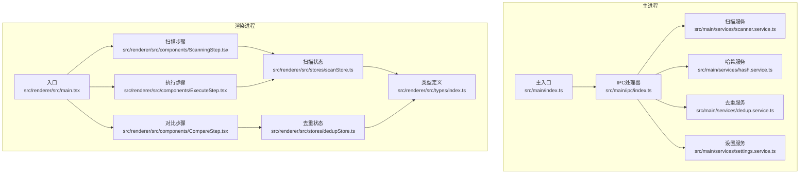
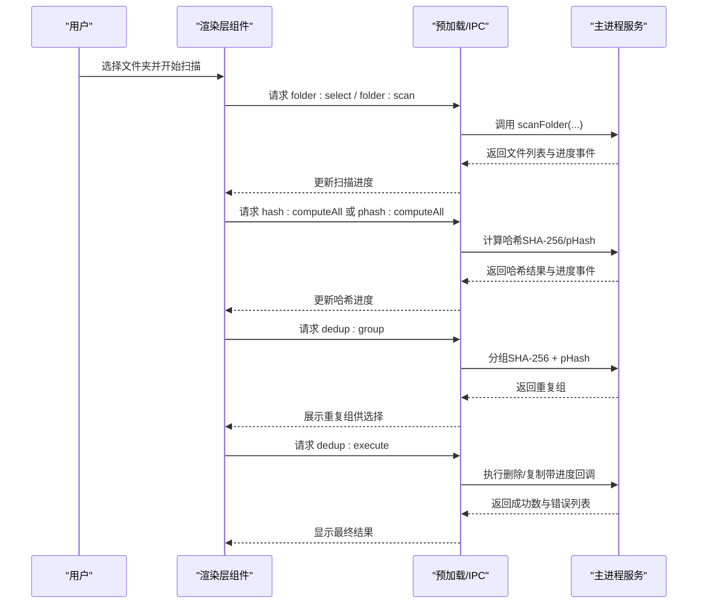
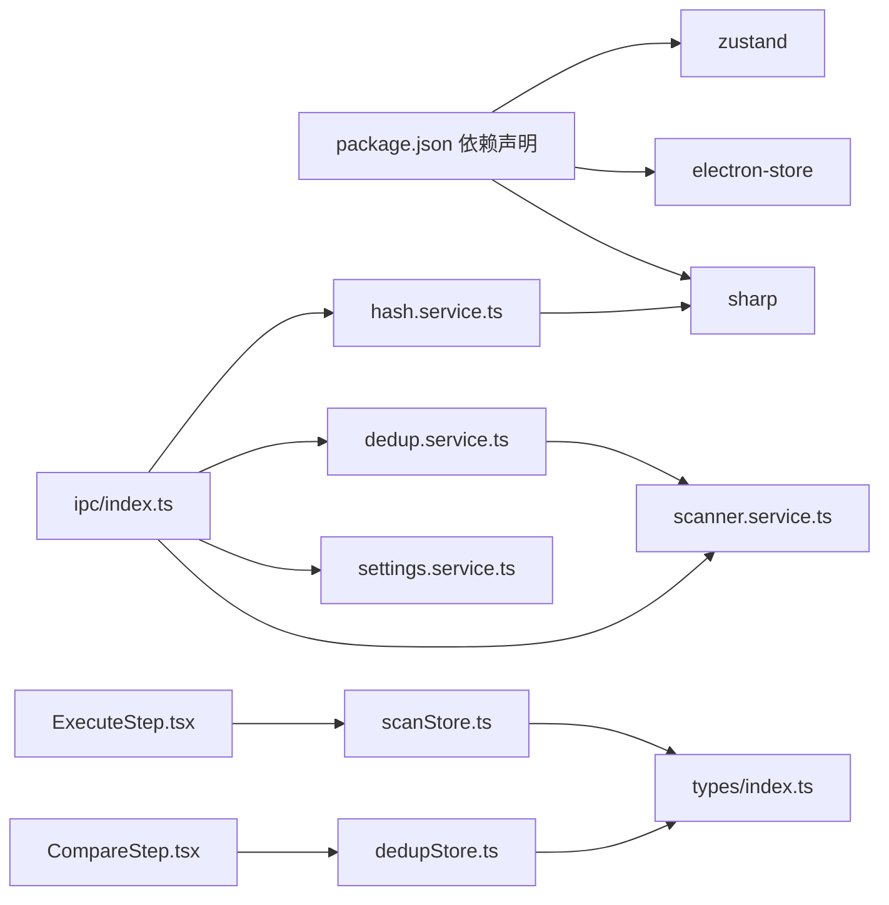

# 常见问题

<cite>
**本文引用的文件**
- [src/main/services/scanner.service.ts](file://src/main/services/scanner.service.ts)
- [src/main/services/hash.service.ts](file://src/main/services/hash.service.ts)
- [src/main/services/dedup.service.ts](file://src/main/services/dedup.service.ts)
- [src/main/services/settings.service.ts](file://src/main/services/settings.service.ts)
- [src/main/ipc/index.ts](file://src/main/ipc/index.ts)
- [src/main/index.ts](file://src/main/index.ts)
- [src/renderer/src/components/ScanningStep.tsx](file://src/renderer/src/components/ScanningStep.tsx)
- [src/renderer/src/components/CompareStep.tsx](file://src/renderer/src/components/CompareStep.tsx)
- [src/renderer/src/components/ExecuteStep.tsx](file://src/renderer/src/components/ExecuteStep.tsx)
- [src/renderer/src/stores/scanStore.ts](file://src/renderer/src/stores/scanStore.ts)
- [src/renderer/src/stores/dedupStore.ts](file://src/renderer/src/stores/dedupStore.ts)
- [src/renderer/src/types/index.ts](file://src/renderer/src/types/index.ts)
- [package.json](file://package.json)
</cite>

## 目录
1. [简介](#简介)
2. [项目结构](#项目结构)
3. [核心组件](#核心组件)
4. [架构总览](#架构总览)
5. [详细组件分析](#详细组件分析)
6. [依赖关系分析](#依赖关系分析)
7. [性能考虑](#性能考虑)
8. [故障排查指南](#故障排查指南)
9. [结论](#结论)
10. [附录](#附录)

## 简介
本FAQ面向红ophoto用户，聚焦于使用过程中的常见问题与解决方案，覆盖以下场景：
- 文件扫描失败：权限不足、路径无效、文件损坏等
- 哈希计算错误：图像格式不支持、内存不足、计算超时等
- 去重处理异常：文件锁定、磁盘空间不足、重复检测算法冲突等
同时提供快速诊断步骤与预防措施，帮助用户自助定位与修复问题。

## 项目结构
应用采用Electron + React + TypeScript架构，主进程负责文件扫描、哈希计算、去重执行与IPC通信；渲染层通过Zustand状态管理与UI组件展示进度与结果。

图表来源
- [src/main/index.ts:1-61](file://src/main/index.ts#L1-L61)
- [src/main/ipc/index.ts:1-156](file://src/main/ipc/index.ts#L1-L156)
- [src/main/services/scanner.service.ts:1-86](file://src/main/services/scanner.service.ts#L1-L86)
- [src/main/services/hash.service.ts:1-180](file://src/main/services/hash.service.ts#L1-L180)
- [src/main/services/dedup.service.ts:1-209](file://src/main/services/dedup.service.ts#L1-L209)
- [src/main/services/settings.service.ts:1-34](file://src/main/services/settings.service.ts#L1-L34)
- [src/renderer/src/components/ScanningStep.tsx:1-84](file://src/renderer/src/components/ScanningStep.tsx#L1-L84)
- [src/renderer/src/components/CompareStep.tsx:1-279](file://src/renderer/src/components/CompareStep.tsx#L1-L279)
- [src/renderer/src/components/ExecuteStep.tsx:1-161](file://src/renderer/src/components/ExecuteStep.tsx#L1-L161)
- [src/renderer/src/stores/scanStore.ts:1-52](file://src/renderer/src/stores/scanStore.ts#L1-L52)
- [src/renderer/src/stores/dedupStore.ts:1-83](file://src/renderer/src/stores/dedupStore.ts#L1-L83)
- [src/renderer/src/types/index.ts:1-58](file://src/renderer/src/types/index.ts#L1-L58)

章节来源
- [src/main/index.ts:1-61](file://src/main/index.ts#L1-L61)
- [src/main/ipc/index.ts:1-156](file://src/main/ipc/index.ts#L1-L156)
- [src/renderer/src/components/ScanningStep.tsx:1-84](file://src/renderer/src/components/ScanningStep.tsx#L1-L84)
- [src/renderer/src/components/CompareStep.tsx:1-279](file://src/renderer/src/components/CompareStep.tsx#L1-L279)
- [src/renderer/src/components/ExecuteStep.tsx:1-161](file://src/renderer/src/components/ExecuteStep.tsx#L1-L161)

## 核心组件
- 扫描服务：遍历目录、过滤扩展名、收集文件信息，并在不可访问目录或stat失败时跳过，避免中断。
- 哈希服务：批量计算SHA-256与感知哈希（pHash），对单文件异常返回特定标记以便上层识别。
- 去重服务：先按SHA-256精确分组，再对非精确组按pHash阈值进行相似分组，支持删除或复制模式。
- IPC层：桥接渲染层与主进程，发送扫描/哈希/去重进度事件，接收用户操作指令。
- 渲染层：展示扫描进度、重复组对比、执行进度与结果统计，支持一键全选策略与确认执行。

章节来源
- [src/main/services/scanner.service.ts:28-85](file://src/main/services/scanner.service.ts#L28-L85)
- [src/main/services/hash.service.ts:19-159](file://src/main/services/hash.service.ts#L19-L159)
- [src/main/services/dedup.service.ts:43-130](file://src/main/services/dedup.service.ts#L43-L130)
- [src/main/ipc/index.ts:42-142](file://src/main/ipc/index.ts#L42-L142)
- [src/renderer/src/components/ScanningStep.tsx:1-84](file://src/renderer/src/components/ScanningStep.tsx#L1-L84)
- [src/renderer/src/components/CompareStep.tsx:136-279](file://src/renderer/src/components/CompareStep.tsx#L136-L279)
- [src/renderer/src/components/ExecuteStep.tsx:7-55](file://src/renderer/src/components/ExecuteStep.tsx#L7-L55)

## 架构总览
下图展示从用户选择文件夹到去重执行的关键流程与错误传播路径。

图表来源
- [src/main/ipc/index.ts:42-142](file://src/main/ipc/index.ts#L42-L142)
- [src/main/services/scanner.service.ts:28-85](file://src/main/services/scanner.service.ts#L28-L85)
- [src/main/services/hash.service.ts:29-159](file://src/main/services/hash.service.ts#L29-L159)
- [src/main/services/dedup.service.ts:117-209](file://src/main/services/dedup.service.ts#L117-L209)
- [src/renderer/src/components/ScanningStep.tsx:1-84](file://src/renderer/src/components/ScanningStep.tsx#L1-L84)
- [src/renderer/src/components/CompareStep.tsx:136-279](file://src/renderer/src/components/CompareStep.tsx#L136-L279)
- [src/renderer/src/components/ExecuteStep.tsx:7-55](file://src/renderer/src/components/ExecuteStep.tsx#L7-L55)

## 详细组件分析

### 文件扫描失败
- 现象
  - 扫描进度卡住或显示“准备中”
  - 某些子目录未被扫描
  - 报错提示权限不足或无法读取
- 可能原因
  - 权限不足：无权访问某些目录或隐藏系统目录
  - 路径无效：传入的根目录不存在或已被删除
  - 文件损坏/只读：部分文件stat失败被跳过
- 快速诊断
  - 在资源管理器中手动打开目标文件夹，确认可读
  - 尝试以管理员身份运行应用
  - 检查是否选择了包含大量符号链接或网络驱动器的路径
- 解决方案
  - 更换为有读权限的本地目录
  - 仅选择包含照片的子目录，避免根分区
  - 若存在损坏文件，先清理后再扫描
- 预防措施
  - 使用“选择文件夹”对话框，避免手输路径
  - 分批扫描：先扫描小目录，确认无误后再扩大范围
  - 关闭占用该目录的其他程序（杀毒软件、同步工具）

章节来源
- [src/main/services/scanner.service.ts:36-56](file://src/main/services/scanner.service.ts#L36-L56)
- [src/main/services/scanner.service.ts:62-74](file://src/main/services/scanner.service.ts#L62-L74)
- [src/main/ipc/index.ts:42-53](file://src/main/ipc/index.ts#L42-L53)
- [src/renderer/src/components/ScanningStep.tsx:27-81](file://src/renderer/src/components/ScanningStep.tsx#L27-L81)

### 哈希计算错误
- 现象
  - 哈希进度缓慢或停滞
  - 某些文件显示为“无法加载预览”或哈希为空
  - pHash计算报错导致相似组缺失
- 可能原因
  - 图像格式不支持：sharp不支持的格式会抛出异常
  - 内存不足：大图或多线程并发导致内存压力
  - 计算超时：文件过大或磁盘IO慢
- 快速诊断
  - 查看哈希阶段的进度百分比是否持续上升
  - 尝试单独打开有问题的图片，确认其可读性
  - 关闭其他占用内存的应用，释放资源
- 解决方案
  - 仅保留常见格式（JPEG/PNG/WebP/BMP/TIFF）的高质量照片
  - 减少同时计算的文件数量（降低批次大小）
  - 重启应用以释放缓存与句柄
- 预防措施
  - 在设置中选择合适的哈希模式（仅SHA-256或开启pHash）
  - 对超大分辨率图片先做压缩或裁剪
  - 使用SSD或高速存储介质

章节来源
- [src/main/services/hash.service.ts:19-27](file://src/main/services/hash.service.ts#L19-L27)
- [src/main/services/hash.service.ts:29-56](file://src/main/services/hash.service.ts#L29-L56)
- [src/main/services/hash.service.ts:132-159](file://src/main/services/hash.service.ts#L132-L159)
- [src/renderer/src/components/ScanningStep.tsx:6-15](file://src/renderer/src/components/ScanningStep.tsx#L6-L15)

### 去重处理异常
- 现象
  - 执行阶段弹出错误提示
  - 成功处理数与预期不符，错误列表包含若干条目
  - 复制模式下输出文件夹未生成或内容不完整
- 可能原因
  - 文件锁定：目标文件被其他程序占用
  - 磁盘空间不足：复制/删除操作无法完成
  - 重复检测算法冲突：pHash阈值设置不当导致误判
- 快速诊断
  - 检查错误列表中的具体文件名与错误描述
  - 确认目标磁盘剩余空间充足
  - 调整pHash阈值，观察重复组数量变化
- 解决方案
  - 关闭占用文件的程序后重试
  - 清理目标磁盘空间或改用其他盘符
  - 将阈值调小以减少误判，或将模式切换为仅SHA-256
- 预防措施
  - 执行前先备份重要数据
  - 使用“全部保留左侧/右侧”快速决策，减少误删风险
  - 在复制模式下提前确认输出文件夹名称与位置

章节来源
- [src/main/services/dedup.service.ts:117-209](file://src/main/services/dedup.service.ts#L117-L209)
- [src/main/ipc/index.ts:110-142](file://src/main/ipc/index.ts#L110-L142)
- [src/renderer/src/components/ExecuteStep.tsx:48-55](file://src/renderer/src/components/ExecuteStep.tsx#L48-L55)
- [src/renderer/src/components/CompareStep.tsx:147-155](file://src/renderer/src/components/CompareStep.tsx#L147-L155)

## 依赖关系分析
- 主进程依赖
  - 文件系统与路径模块用于扫描与文件操作
  - sharp用于图像处理与pHash计算
  - electron-store持久化应用设置
- 渲染层依赖
  - Zustand管理扫描与去重状态
  - 类型定义统一前后端数据结构
- IPC依赖
  - 通过IPC通道传递扫描、哈希、去重进度与结果

图表来源
- [package.json:13-18](file://package.json#L13-L18)
- [src/main/services/hash.service.ts:1-4](file://src/main/services/hash.service.ts#L1-L4)
- [src/main/services/dedup.service.ts:1-6](file://src/main/services/dedup.service.ts#L1-L6)
- [src/main/ipc/index.ts:1-18](file://src/main/ipc/index.ts#L1-L18)
- [src/renderer/src/stores/scanStore.ts:1-52](file://src/renderer/src/stores/scanStore.ts#L1-L52)
- [src/renderer/src/stores/dedupStore.ts:1-83](file://src/renderer/src/stores/dedupStore.ts#L1-L83)
- [src/renderer/src/types/index.ts:1-58](file://src/renderer/src/types/index.ts#L1-L58)

章节来源
- [package.json:13-18](file://package.json#L13-L18)
- [src/main/services/hash.service.ts:1-4](file://src/main/services/hash.service.ts#L1-L4)
- [src/main/services/dedup.service.ts:1-6](file://src/main/services/dedup.service.ts#L1-L6)
- [src/main/ipc/index.ts:1-18](file://src/main/ipc/index.ts#L1-L18)
- [src/renderer/src/stores/scanStore.ts:1-52](file://src/renderer/src/stores/scanStore.ts#L1-L52)
- [src/renderer/src/stores/dedupStore.ts:1-83](file://src/renderer/src/stores/dedupStore.ts#L1-L83)
- [src/renderer/src/types/index.ts:1-58](file://src/renderer/src/types/index.ts#L1-L58)

## 性能考虑
- 扫描阶段
  - 递归遍历可能较慢，建议分批扫描或缩小范围
  - 对不可访问目录与stat失败文件直接跳过，避免阻塞
- 哈希阶段
  - SHA-256与pHash均采用分批并发，注意内存占用
  - pHash对大图计算成本高，建议先压缩图片
- 去重阶段
  - 删除模式逐个unlink，复制模式需预留足够磁盘空间
  - 进度回调按固定步长触发，避免主线程阻塞

章节来源
- [src/main/services/scanner.service.ts:36-85](file://src/main/services/scanner.service.ts#L36-L85)
- [src/main/services/hash.service.ts:16-56](file://src/main/services/hash.service.ts#L16-L56)
- [src/main/services/hash.service.ts:139-159](file://src/main/services/hash.service.ts#L139-L159)
- [src/main/services/dedup.service.ts:132-209](file://src/main/services/dedup.service.ts#L132-L209)

## 故障排查指南
- 扫描失败
  - 症状：进度条不动、日志提示权限或路径错误
  - 步骤：确认路径存在且可读；以管理员运行；排除网络盘/符号链接
  - 参考：扫描服务的目录遍历与stat处理逻辑
- 哈希异常
  - 症状：pHash计算报错、SHA-256耗时过长
  - 步骤：检查图片格式；关闭占用内存应用；减小并发批次
  - 参考：哈希服务的异常捕获与进度回调
- 去重失败
  - 症状：执行报错、部分文件未处理
  - 步骤：释放文件锁；检查磁盘空间；调整pHash阈值
  - 参考：去重服务的删除/复制实现与错误收集

章节来源
- [src/main/services/scanner.service.ts:36-85](file://src/main/services/scanner.service.ts#L36-L85)
- [src/main/services/hash.service.ts:19-27](file://src/main/services/hash.service.ts#L19-L27)
- [src/main/services/hash.service.ts:132-159](file://src/main/services/hash.service.ts#L132-L159)
- [src/main/services/dedup.service.ts:132-209](file://src/main/services/dedup.service.ts#L132-L209)

## 结论
通过理解扫描、哈希与去重三阶段的工作机制与错误处理策略，用户可以更高效地定位问题并采取针对性措施。建议优先优化文件格式与存储介质，合理设置哈希模式与阈值，并在执行前做好数据备份与空间预留。

## 附录
- 快速诊断清单
  - 扫描：路径有效、权限足够、无网络盘
  - 哈希：图片格式受支持、内存充足、无超大图
  - 去重：文件未被占用、磁盘空间充足、阈值合理
- 常用设置参考
  - 哈希模式：仅SHA-256（更快）或开启pHash（更准）
  - pHash阈值：默认5，可根据误判率调整
  - 输出模式：复制到新文件夹或直接删除重复项

章节来源
- [src/main/services/settings.service.ts:3-22](file://src/main/services/settings.service.ts#L3-L22)
- [src/renderer/src/components/CompareStep.tsx:147-155](file://src/renderer/src/components/CompareStep.tsx#L147-L155)
- [src/renderer/src/components/ExecuteStep.tsx:16-21](file://src/renderer/src/components/ExecuteStep.tsx#L16-L21)