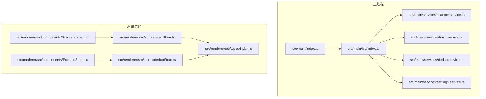
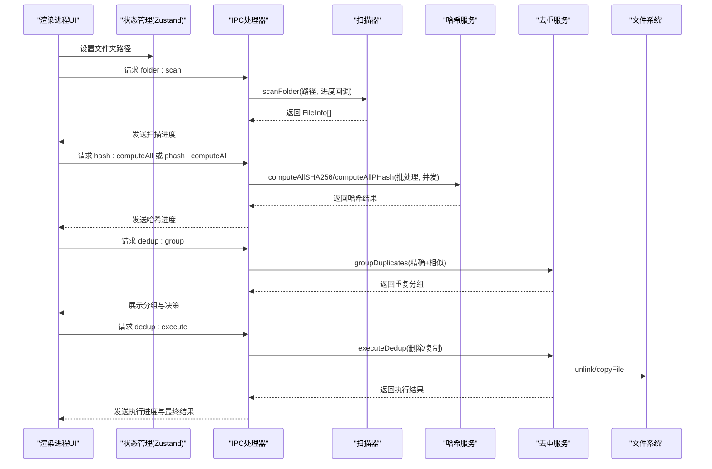
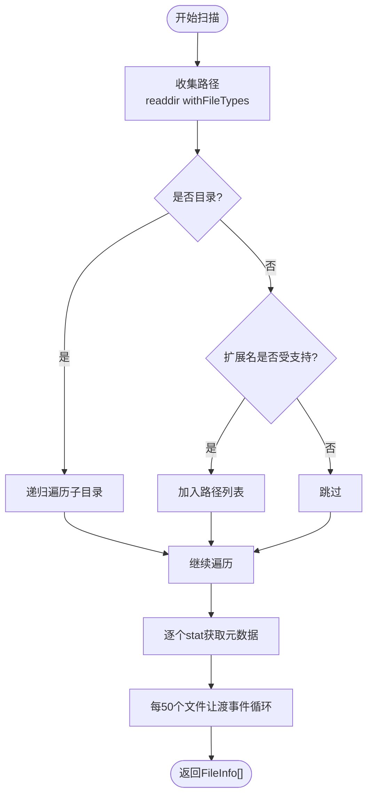
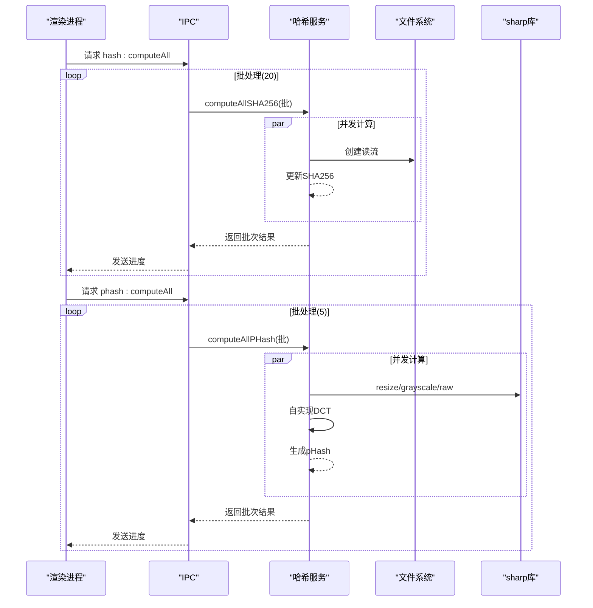
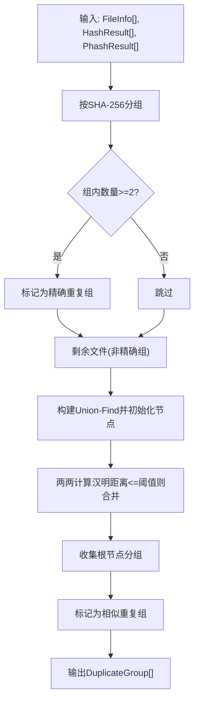
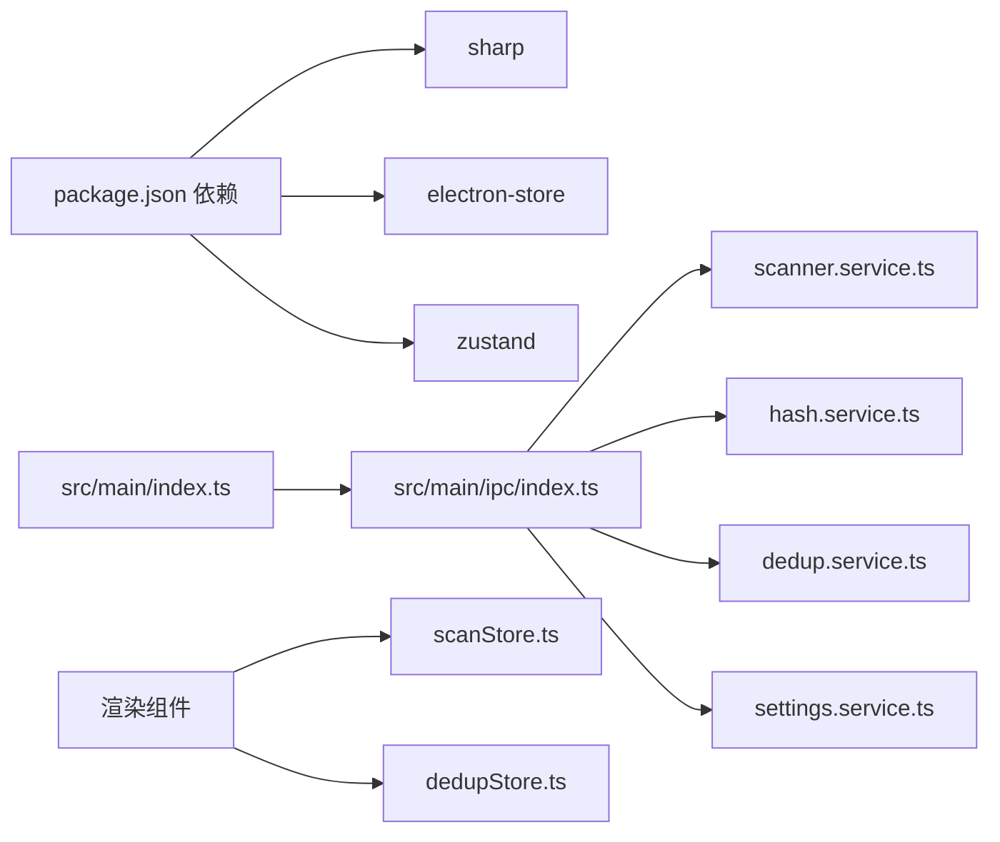

# 性能问题

<cite>
**本文引用的文件列表**
- [src/main/services/scanner.service.ts](file://src/main/services/scanner.service.ts)
- [src/main/services/hash.service.ts](file://src/main/services/hash.service.ts)
- [src/main/services/dedup.service.ts](file://src/main/services/dedup.service.ts)
- [src/main/services/settings.service.ts](file://src/main/services/settings.service.ts)
- [src/main/ipc/index.ts](file://src/main/ipc/index.ts)
- [src/main/index.ts](file://src/main/index.ts)
- [src/renderer/src/stores/scanStore.ts](file://src/renderer/src/stores/scanStore.ts)
- [src/renderer/src/stores/dedupStore.ts](file://src/renderer/src/stores/dedupStore.ts)
- [src/renderer/src/components/ScanningStep.tsx](file://src/renderer/src/components/ScanningStep.tsx)
- [src/renderer/src/components/ExecuteStep.tsx](file://src/renderer/src/components/ExecuteStep.tsx)
- [src/renderer/src/types/index.ts](file://src/renderer/src/types/index.ts)
- [package.json](file://package.json)
- [electron.vite.config.ts](file://electron.vite.config.ts)
</cite>

## 目录
1. [简介](#简介)
2. [项目结构](#项目结构)
3. [核心组件](#核心组件)
4. [架构总览](#架构总览)
5. [详细组件分析](#详细组件分析)
6. [依赖关系分析](#依赖关系分析)
7. [性能考量与优化建议](#性能考量与优化建议)
8. [故障排查指南](#故障排查指南)
9. [结论](#结论)
10. [附录](#附录)

## 简介
本指南聚焦于红ophoto应用在运行缓慢、内存使用过高、CPU占用异常等性能问题上的诊断与解决路径。通过对文件扫描、哈希计算（SHA-256、感知哈希pHash）、去重分组与执行三个阶段的代码级分析，结合事件循环让渡、批处理与并发控制策略，给出可操作的优化建议与最佳实践，覆盖从单机到多核环境下的性能调优，并提供系统资源监控与内存泄漏检测方法。

## 项目结构
应用采用 Electron + React 架构，主进程负责文件扫描、哈希计算与去重执行，渲染进程负责用户交互与进度展示。IPC 层桥接主/渲染进程，实现跨进程任务调度与进度回传。

图表来源
- [src/main/index.ts:1-61](file://src/main/index.ts#L1-L61)
- [src/main/ipc/index.ts:1-156](file://src/main/ipc/index.ts#L1-L156)
- [src/main/services/scanner.service.ts:1-86](file://src/main/services/scanner.service.ts#L1-L86)
- [src/main/services/hash.service.ts:1-180](file://src/main/services/hash.service.ts#L1-L180)
- [src/main/services/dedup.service.ts:1-209](file://src/main/services/dedup.service.ts#L1-L209)
- [src/main/services/settings.service.ts:1-34](file://src/main/services/settings.service.ts#L1-L34)
- [src/renderer/src/components/ScanningStep.tsx:1-84](file://src/renderer/src/components/ScanningStep.tsx#L1-L84)
- [src/renderer/src/components/ExecuteStep.tsx:1-161](file://src/renderer/src/components/ExecuteStep.tsx#L1-L161)
- [src/renderer/src/stores/scanStore.ts:1-52](file://src/renderer/src/stores/scanStore.ts#L1-L52)
- [src/renderer/src/stores/dedupStore.ts:1-83](file://src/renderer/src/stores/dedupStore.ts#L1-L83)
- [src/renderer/src/types/index.ts:1-58](file://src/renderer/src/types/index.ts#L1-L58)

章节来源
- [src/main/index.ts:1-61](file://src/main/index.ts#L1-L61)
- [electron.vite.config.ts:1-26](file://electron.vite.config.ts#L1-L26)

## 核心组件
- 文件扫描器：递归遍历目录，收集受支持扩展名的文件，分两阶段统计信息，期间通过事件循环让渡避免阻塞。
- 哈希服务：提供 SHA-256 流式计算与 pHash 计算，采用批处理并发与事件循环让渡，支持进度回调。
- 去重服务：基于 SHA-256 的精确去重与基于 pHash 的相似去重，Union-Find 分组，支持删除或复制模式。
- IPC 层：桥接主/渲染进程，转发扫描、哈希、分组、执行与缩略图生成请求，并回传进度。
- 存储与UI：Zustand 状态管理，渲染组件展示进度与结果，支持设置持久化。

章节来源
- [src/main/services/scanner.service.ts:28-85](file://src/main/services/scanner.service.ts#L28-L85)
- [src/main/services/hash.service.ts:19-159](file://src/main/services/hash.service.ts#L19-L159)
- [src/main/services/dedup.service.ts:43-115](file://src/main/services/dedup.service.ts#L43-L115)
- [src/main/ipc/index.ts:42-142](file://src/main/ipc/index.ts#L42-L142)
- [src/renderer/src/stores/scanStore.ts:1-52](file://src/renderer/src/stores/scanStore.ts#L1-L52)
- [src/renderer/src/stores/dedupStore.ts:1-83](file://src/renderer/src/stores/dedupStore.ts#L1-L83)

## 架构总览
下图展示了从用户选择文件夹到去重执行的端到端流程，以及各阶段的性能关键点。

图表来源
- [src/main/ipc/index.ts:42-142](file://src/main/ipc/index.ts#L42-L142)
- [src/main/services/scanner.service.ts:28-85](file://src/main/services/scanner.service.ts#L28-L85)
- [src/main/services/hash.service.ts:29-159](file://src/main/services/hash.service.ts#L29-L159)
- [src/main/services/dedup.service.ts:117-208](file://src/main/services/dedup.service.ts#L117-L208)

## 详细组件分析

### 文件扫描过程与内存管理
- 扫描策略
  - 首次遍历收集所有路径，随后逐个 stat 获取元数据，避免一次性加载全部文件内容。
  - 支持的扩展名集合过滤，减少后续处理量。
- 内存与事件循环
  - 使用递归 DFS 遍历，无显式递归深度限制；可通过外部参数控制输入根路径层级。
  - 每处理约 50 个文件进行一次事件循环让渡，降低主线程阻塞风险。
- 大文件与高并发
  - 当前仅做 stat，不直接读取文件内容，对大文件内存压力较小。
  - 若未来引入预览或缩略图，需谨慎控制尺寸与并发。
- 错误处理
  - 对不可访问目录与无法 stat 的文件进行跳过，保证稳定性。

图表来源
- [src/main/services/scanner.service.ts:36-82](file://src/main/services/scanner.service.ts#L36-L82)

章节来源
- [src/main/services/scanner.service.ts:28-85](file://src/main/services/scanner.service.ts#L28-L85)

### 哈希计算性能瓶颈与优化
- SHA-256
  - 采用流式读取与增量更新，避免一次性将整个文件载入内存。
  - 批大小为 20，Promise.all 并发计算，显著提升吞吐。
  - 每批完成后让渡事件循环，保持 UI 响应。
- pHash
  - 使用 sharp 将图像缩放至 32x32 并转为灰度原始像素，再自实现二维 DCT。
  - 批大小为 5，避免单次过多图像处理导致内存峰值。
  - 仅提取低频 8x8 区块并生成二进制字符串指纹，降低比较成本。
- 缓存与复用
  - 当前未实现哈希结果缓存；可在后续版本引入基于文件路径与修改时间的缓存键，避免重复计算。
- 性能建议
  - 控制批大小与并发数，结合 CPU 核心数动态调整。
  - 对 pHash 的 DCT 实现可考虑 SIMD 或 WebAssembly 加速（需评估工程成本）。
  - 对于超大图像，可先估算尺寸阈值，跳过或降采样处理。

图表来源
- [src/main/ipc/index.ts:56-83](file://src/main/ipc/index.ts#L56-L83)
- [src/main/services/hash.service.ts:29-159](file://src/main/services/hash.service.ts#L29-L159)

章节来源
- [src/main/services/hash.service.ts:19-159](file://src/main/services/hash.service.ts#L19-L159)

### 去重处理的算法复杂度与大数据优化
- 精确去重（SHA-256）
  - 基于哈希值分组，时间复杂度 O(n)，空间复杂度 O(n)。
  - 将相同哈希的文件聚合为“完全重复”组，直接产出结果。
- 相似去重（pHash）
  - 先排除已存在于精确组的文件，再对候选集构建 Union-Find。
  - 组内两两比较汉明距离，时间复杂度近似 O(k^2)，k 为候选集大小。
  - 阈值 phashThreshold 控制相似度敏感度，影响分组数量与计算量。
- 执行阶段
  - 删除模式：按批次删除，每 10 次让渡事件循环。
  - 复制模式：按需复制保留文件，每 20 次让渡事件循环。
- 大数据集优化建议
  - 限制 pHash 候选集规模（例如仅对超过阈值的候选进行比较）。
  - 引入索引结构（如倒排表）加速 pHash 比较，降低 O(k^2)。
  - 在 UI 层分页展示与延迟加载，避免一次性渲染大量分组。

图表来源
- [src/main/services/dedup.service.ts:43-115](file://src/main/services/dedup.service.ts#L43-L115)

章节来源
- [src/main/services/dedup.service.ts:43-115](file://src/main/services/dedup.service.ts#L43-L115)

### 执行阶段的性能与用户体验
- 删除模式
  - 顺序删除，每 10 次让渡事件循环，避免长时间阻塞。
  - 错误收集并继续执行，保证整体流程可控。
- 复制模式
  - 预创建输出目录，按需创建相对路径目录树，批量复制。
  - 每 20 次让渡事件循环，保持 UI 反馈。
- UI 进度
  - 渲染进程监听进度事件，实时更新百分比与当前文件名，提升可感知性能。

章节来源
- [src/main/services/dedup.service.ts:132-208](file://src/main/services/dedup.service.ts#L132-L208)
- [src/renderer/src/components/ExecuteStep.tsx:29-55](file://src/renderer/src/components/ExecuteStep.tsx#L29-L55)

## 依赖关系分析
- 外部依赖
  - sharp：高性能图像处理，用于缩放、灰度与原始像素导出。
  - electron-store：本地设置持久化。
  - zustand：轻量状态管理。
- 主进程与渲染进程
  - IPC 作为唯一通信通道，避免跨进程共享大对象带来的内存压力。
- 构建与开发
  - electron-vite 提供主/预加载/渲染三段式构建与别名，便于模块化组织。

图表来源
- [package.json:13-34](file://package.json#L13-L34)
- [src/main/index.ts:1-61](file://src/main/index.ts#L1-L61)
- [src/main/ipc/index.ts:1-156](file://src/main/ipc/index.ts#L1-L156)

章节来源
- [package.json:13-34](file://package.json#L13-L34)
- [electron.vite.config.ts:5-25](file://electron.vite.config.ts#L5-L25)

## 性能考量与优化建议

### 文件扫描阶段
- 递归深度与路径数量
  - 当前未设置递归深度上限；建议在 UI 层提示用户选择较小的根目录，或在服务层增加最大深度参数。
- 事件循环让渡
  - 已在扫描器中按批让渡，建议根据文件总数与 UI 刷新频率动态调整批次大小。
- 大文件与高并发
  - 仅 stat 不读取内容，内存压力低；若引入缩略图，建议限制并发与尺寸。

章节来源
- [src/main/services/scanner.service.ts:36-82](file://src/main/services/scanner.service.ts#L36-L82)

### 哈希计算阶段
- 批大小与并发
  - SHA-256 批 20，pHash 批 5；可根据 CPU 核心数与磁盘 I/O 调整。建议提供设置项让用户调节。
- pHash 计算
  - DCT 实现为纯 JS，可考虑：
    - WebAssembly 加速；
    - 使用更高效的库（如 FFT 库）替代自实现；
    - 对超大图像先降采样或阈值跳过。
- 缓存策略
  - 基于文件路径与修改时间生成缓存键，避免重复计算；注意跨平台路径规范化。
- I/O 优化
  - 使用流式读取与合适的缓冲区大小，避免频繁小块 I/O。

章节来源
- [src/main/services/hash.service.ts:19-159](file://src/main/services/hash.service.ts#L19-L159)

### 去重与执行阶段
- 算法复杂度
  - pHash 相似去重为 O(k^2)，建议：
    - 仅对候选集进行比较；
    - 引入倒排索引或局部敏感哈希（LSH）近似聚类。
- 并发与让渡
  - 执行阶段已按批让渡，建议在 UI 层分页展示分组，减少一次性渲染压力。
- 输出模式
  - 复制模式预创建目录树，避免重复 mkdir；错误收集后继续处理，保证流程完整性。

章节来源
- [src/main/services/dedup.service.ts:43-115](file://src/main/services/dedup.service.ts#L43-L115)
- [src/main/services/dedup.service.ts:132-208](file://src/main/services/dedup.service.ts#L132-L208)

### 系统资源监控与内存泄漏检测
- 系统资源监控
  - Windows：任务管理器/资源监视器观察 CPU、内存、磁盘 I/O；PowerShell 使用 Get-Counter 监控性能计数器。
  - Linux/macOS：top/htop、vm_stat/iostat、perf 等工具定位热点。
- 应用性能分析
  - Electron DevTools：主进程与渲染进程分别打开开发者工具，查看网络、性能面板与内存快照。
  - Node.js Profiler：在主进程启用 CPU/Heap Profiler，定位热点函数与内存分配。
- 内存泄漏检测
  - 使用 Chrome DevTools Memory 面板进行堆快照对比，关注未释放的大对象（如大数组、缓存映射）。
  - 关注以下潜在泄漏点：
    - 缓存映射（如哈希结果缓存未清理）；
    - 事件监听器未移除；
    - 大数组累积（如扫描/去重中间结果）。
- 进度与 UI 卡顿
  - 确保 IPC 进度回调频率适中，避免过于频繁触发 UI 重绘；必要时节流/防抖。

章节来源
- [src/main/ipc/index.ts:42-142](file://src/main/ipc/index.ts#L42-L142)
- [src/renderer/src/components/ScanningStep.tsx:44-77](file://src/renderer/src/components/ScanningStep.tsx#L44-L77)
- [src/renderer/src/components/ExecuteStep.tsx:57-94](file://src/renderer/src/components/ExecuteStep.tsx#L57-L94)

### 针对不同硬件配置的优化建议
- 低配机器（单核/双核、小内存）
  - 减小批大小（如 SHA-256 批 10，pHash 批 2），提高事件循环让渡频率。
  - 优先使用 SHA-256 去重，禁用 pHash 或提高阈值以减少比较次数。
  - 关闭缩略图生成或降低尺寸。
- 中配机器（4 核/8GB）
  - 默认批大小即可；开启 pHash 并适度降低阈值。
  - 启用哈希结果缓存，减少重复计算。
- 高配机器（多核/大内存）
  - 适当增大批大小；启用 pHash 并降低阈值以提升召回。
  - 引入并行化与 SIMD/WebAssembly 加速（如 DCT）。

章节来源
- [src/main/services/hash.service.ts:16-17](file://src/main/services/hash.service.ts#L16-L17)
- [src/main/services/dedup.service.ts:47](file://src/main/services/dedup.service.ts#L47)
- [src/main/services/settings.service.ts:3-8](file://src/main/services/settings.service.ts#L3-L8)

## 故障排查指南
- 扫描阶段卡顿
  - 检查根目录层级与文件数量；尝试缩小范围或分批扫描。
  - 查看是否有权限受限的子目录导致 readdir 失败。
- 哈希计算耗时长
  - 观察磁盘 I/O 是否饱和；检查是否存在大量小文件导致系统开销。
  - 调整批大小与并发，或启用缓存。
- 去重阶段慢
  - 若 pHash 开启且候选集很大，考虑提高阈值或禁用 pHash。
  - 检查 UI 是否一次性渲染过多分组，建议分页展示。
- 执行阶段失败
  - 查看错误列表，确认权限与磁盘空间；确保输出目录可写。
  - 对于复制模式，检查目标路径是否已存在同名文件冲突。

章节来源
- [src/main/services/dedup.service.ts:132-208](file://src/main/services/dedup.service.ts#L132-L208)
- [src/renderer/src/components/ExecuteStep.tsx:96-159](file://src/renderer/src/components/ExecuteStep.tsx#L96-L159)

## 结论
红ophoto 的性能设计在扫描、哈希与去重三个阶段均采用了批处理与事件循环让渡策略，有效平衡了吞吐与响应性。针对不同硬件配置，可通过批大小、并发与缓存策略进行精细化调优。建议在后续版本中引入 pHash 加速、倒排索引与缓存机制，并完善 UI 分页与性能监控能力，进一步提升大规模场景下的可用性与稳定性。

## 附录
- 关键类型定义与进度结构
  - FileInfo、HashResult、PhashResult、DuplicateGroup、DedupDecision、AppSettings、ScanProgress、DedupProgress
- 设置项
  - hashMode、phashThreshold、outputMode、outputFolderSuffix

章节来源
- [src/renderer/src/types/index.ts:1-58](file://src/renderer/src/types/index.ts#L1-L58)
- [src/main/services/settings.service.ts:3-8](file://src/main/services/settings.service.ts#L3-L8)