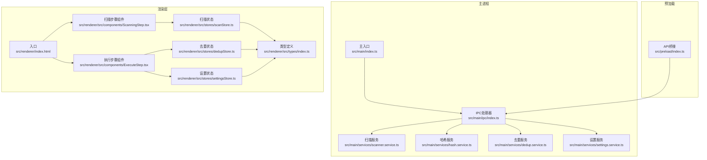
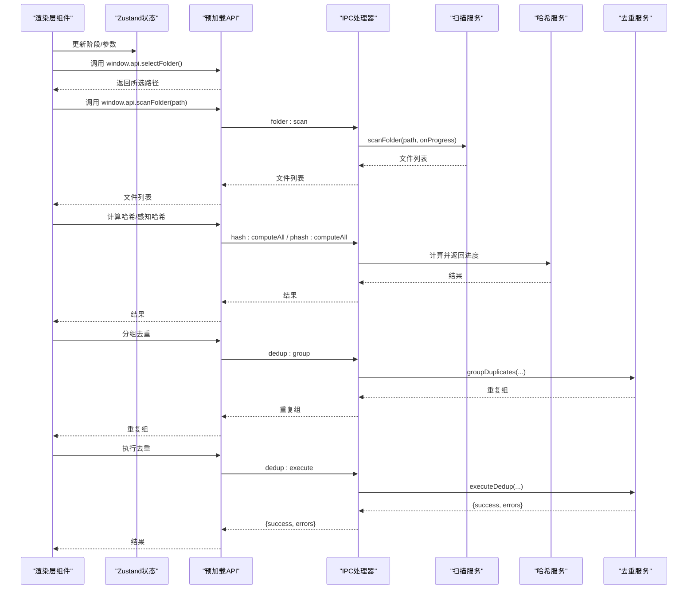
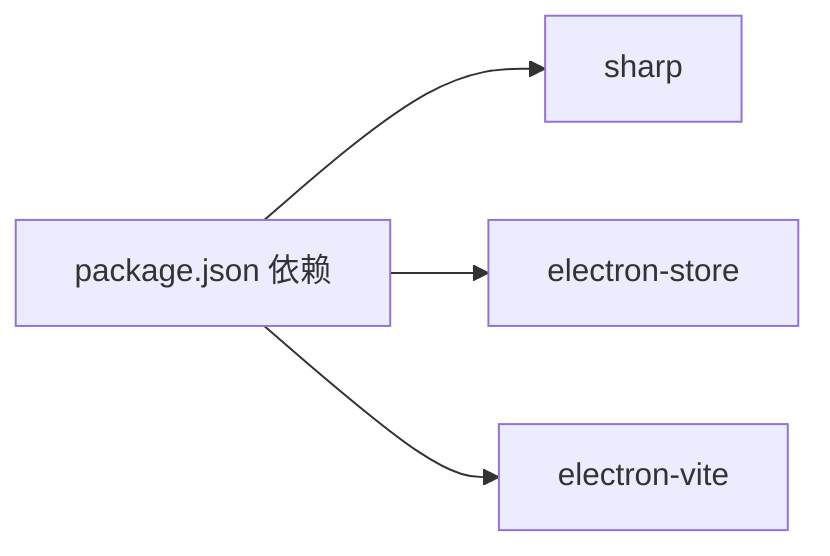

# 故障排除

<cite>
**本文引用的文件**
- [src/main/services/scanner.service.ts](file://src/main/services/scanner.service.ts)
- [src/main/services/hash.service.ts](file://src/main/services/hash.service.ts)
- [src/main/services/dedup.service.ts](file://src/main/services/dedup.service.ts)
- [src/main/services/settings.service.ts](file://src/main/services/settings.service.ts)
- [src/main/ipc/index.ts](file://src/main/ipc/index.ts)
- [src/main/index.ts](file://src/main/index.ts)
- [src/preload/index.ts](file://src/preload/index.ts)
- [src/renderer/src/stores/scanStore.ts](file://src/renderer/src/stores/scanStore.ts)
- [src/renderer/src/stores/dedupStore.ts](file://src/renderer/src/stores/dedupStore.ts)
- [src/renderer/src/stores/settingsStore.ts](file://src/renderer/src/stores/settingsStore.ts)
- [src/renderer/src/components/ScanningStep.tsx](file://src/renderer/src/components/ScanningStep.tsx)
- [src/renderer/src/components/ExecuteStep.tsx](file://src/renderer/src/components/ExecuteStep.tsx)
- [src/renderer/src/types/index.ts](file://src/renderer/src/types/index.ts)
- [package.json](file://package.json)
- [electron.vite.config.ts](file://electron.vite.config.ts)
</cite>

## 目录
1. [简介](#简介)
2. [项目结构](#项目结构)
3. [核心组件](#核心组件)
4. [架构总览](#架构总览)
5. [详细组件分析与故障排除](#详细组件分析与故障排除)
6. [依赖关系分析](#依赖关系分析)
7. [性能问题识别与优化](#性能问题识别与优化)
8. [日志分析与调试工具](#日志分析与调试工具)
9. [系统兼容性问题](#系统兼容性问题)
10. [数据恢复与错误回滚](#数据恢复与错误回滚)
11. [预防措施与最佳实践](#预防措施与最佳实践)
12. [结论](#结论)

## 简介
本指南面向红ophoto应用的用户与维护者，聚焦于常见问题的快速定位与解决，覆盖文件扫描失败、哈希计算错误、去重处理异常、设置加载问题等，并提供性能问题识别与优化策略、日志分析技巧、系统兼容性处理、数据恢复与回滚操作以及预防措施与最佳实践。文档中的所有技术细节均基于仓库源码进行梳理与总结。

## 项目结构
应用采用 Electron + React 架构，主进程负责文件扫描、哈希计算、去重与设置持久化，渲染层通过 IPC 与主进程交互，使用 Zustand 管理状态，组件负责进度展示与用户交互。

图表来源
- [src/main/index.ts:1-61](file://src/main/index.ts#L1-L61)
- [src/main/ipc/index.ts:1-156](file://src/main/ipc/index.ts#L1-L156)
- [src/main/services/scanner.service.ts:1-86](file://src/main/services/scanner.service.ts#L1-L86)
- [src/main/services/hash.service.ts:1-180](file://src/main/services/hash.service.ts#L1-L180)
- [src/main/services/dedup.service.ts:1-209](file://src/main/services/dedup.service.ts#L1-L209)
- [src/main/services/settings.service.ts:1-34](file://src/main/services/settings.service.ts#L1-L34)
- [src/preload/index.ts:1-123](file://src/preload/index.ts#L1-L123)
- [src/renderer/src/components/ScanningStep.tsx:1-84](file://src/renderer/src/components/ScanningStep.tsx#L1-L84)
- [src/renderer/src/components/ExecuteStep.tsx:1-161](file://src/renderer/src/components/ExecuteStep.tsx#L1-L161)
- [src/renderer/src/stores/scanStore.ts:1-52](file://src/renderer/src/stores/scanStore.ts#L1-L52)
- [src/renderer/src/stores/dedupStore.ts:1-83](file://src/renderer/src/stores/dedupStore.ts#L1-L83)
- [src/renderer/src/stores/settingsStore.ts:1-41](file://src/renderer/src/stores/settingsStore.ts#L1-L41)
- [src/renderer/src/types/index.ts:1-58](file://src/renderer/src/types/index.ts#L1-L58)

章节来源
- [src/main/index.ts:1-61](file://src/main/index.ts#L1-L61)
- [electron.vite.config.ts:1-26](file://electron.vite.config.ts#L1-L26)

## 核心组件
- 扫描服务：遍历目录、过滤扩展名、统计文件信息，支持进度回调与事件让渡。
- 哈希服务：批量计算 SHA-256；可选 pHash（感知哈希），支持进度回调与事件让渡。
- 去重服务：按 SHA-256 精确去重，可选 pHash 近似去重；支持删除或复制两种执行模式。
- 设置服务：基于 electron-store 的本地设置持久化，默认值与合并逻辑清晰。
- IPC 层：统一注册窗口控制、文件夹选择、扫描、哈希、分组、执行、缩略图与设置读写。
- 渲染层：Zustand 状态管理，组件监听进度事件，展示扫描与执行阶段。

章节来源
- [src/main/services/scanner.service.ts:1-86](file://src/main/services/scanner.service.ts#L1-L86)
- [src/main/services/hash.service.ts:1-180](file://src/main/services/hash.service.ts#L1-L180)
- [src/main/services/dedup.service.ts:1-209](file://src/main/services/dedup.service.ts#L1-L209)
- [src/main/services/settings.service.ts:1-34](file://src/main/services/settings.service.ts#L1-L34)
- [src/main/ipc/index.ts:1-156](file://src/main/ipc/index.ts#L1-L156)
- [src/renderer/src/stores/scanStore.ts:1-52](file://src/renderer/src/stores/scanStore.ts#L1-L52)
- [src/renderer/src/stores/dedupStore.ts:1-83](file://src/renderer/src/stores/dedupStore.ts#L1-L83)
- [src/renderer/src/stores/settingsStore.ts:1-41](file://src/renderer/src/stores/settingsStore.ts#L1-L41)

## 架构总览
以下序列图展示了从用户选择文件夹到去重执行的关键流程，包含错误回退与进度通知路径。

图表来源
- [src/main/ipc/index.ts:42-142](file://src/main/ipc/index.ts#L42-L142)
- [src/main/services/scanner.service.ts:28-85](file://src/main/services/scanner.service.ts#L28-L85)
- [src/main/services/hash.service.ts:29-159](file://src/main/services/hash.service.ts#L29-L159)
- [src/main/services/dedup.service.ts:117-208](file://src/main/services/dedup.service.ts#L117-L208)
- [src/preload/index.ts:69-91](file://src/preload/index.ts#L69-L91)

## 详细组件分析与故障排除

### 文件扫描失败
常见症状
- 扫描阶段卡住或进度不更新
- 报错“无法访问目录”或“无权限”
- 部分子目录未被扫描

可能原因与排查
- 权限不足：目标路径不可读或包含受保护目录
- 路径无效：传入路径不存在或已被删除
- 大量小文件导致事件循环阻塞：虽然实现中已通过 setImmediate 让渡，但在极大量文件时仍可能影响体验
- 符号链接/网络盘：在某些平台下 readdir 可能失败或行为不一致

定位与修复
- 在渲染层监听扫描进度事件，确认是否收到“scanning”阶段的进度消息
- 检查 IPC 层 folder:scan 的实现，确认是否捕获了 readdir 异常并跳过不可访问目录
- 若出现权限问题，尝试以管理员身份运行或更换到有权限的目录
- 对于超大目录，建议分批选择子目录进行扫描

章节来源
- [src/main/ipc/index.ts:42-53](file://src/main/ipc/index.ts#L42-L53)
- [src/main/services/scanner.service.ts:36-56](file://src/main/services/scanner.service.ts#L36-L56)

### 哈希计算错误
常见症状
- 某些文件的哈希结果为“ERROR”
- 感知哈希计算失败或返回空字符串
- 性能波动明显，CPU 占用高

可能原因与排查
- 文件损坏或只读：stat 或 readStream 出错
- 图像格式不被 sharp 支持：pHash 依赖 sharp，若图像格式不受支持会抛出异常
- 内存不足：大批量并发计算导致内存压力

定位与修复
- 查看哈希进度事件，确认是否持续触发“hashing/phashing”阶段
- 检查哈希服务的错误处理：SHA-256 在流错误时返回 ERROR；pHash 在异常时返回空字符串并被过滤
- 降低批次大小（当前 SHA_BATCH_SIZE=20，PHASH_BATCH_SIZE=5）以缓解内存压力
- 使用更稳定的磁盘与足够内存，避免在低内存设备上一次性处理大量文件

章节来源
- [src/main/services/hash.service.ts:19-56](file://src/main/services/hash.service.ts#L19-L56)
- [src/main/services/hash.service.ts:132-159](file://src/main/services/hash.service.ts#L132-L159)

### 去重处理异常
常见症状
- 分组后仍有误判（相似度阈值过高/过低）
- 执行阶段报错，部分文件未被处理
- 删除模式下误删重要文件

可能原因与排查
- 仅使用 SHA-256 时，pHash 结果为空，导致相似组缺失
- pHash 阈值设置不当：阈值过低易误判，过高则漏判
- 执行阶段传参错误：删除模式下 deleteFileIds 实际为路径而非 ID
- 输出目录创建失败或权限不足

定位与修复
- 确认 settings 中的 hashMode 与 phashThreshold 设置
- 在渲染层检查去重决策是否完整提交（keepFileIds/deleteFileIds）
- 删除模式下确保 deleteFileIds 为文件路径；复制模式下确保输出目录可写
- 若发生错误，记录 errors 列表并提示用户手动检查对应文件

章节来源
- [src/main/services/dedup.service.ts:43-115](file://src/main/services/dedup.service.ts#L43-L115)
- [src/main/services/dedup.service.ts:117-208](file://src/main/services/dedup.service.ts#L117-L208)
- [src/main/ipc/index.ts:110-142](file://src/main/ipc/index.ts#L110-L142)

### 设置加载问题
常见症状
- 应用启动后设置未生效
- 修改设置后重启丢失
- 默认值未正确应用

可能原因与排查
- electron-store 初始化失败或存储损坏
- 设置读取/写入 IPC 异常
- 渲染层本地状态与持久化状态不同步

定位与修复
- 检查设置服务的默认值合并逻辑与存储键名
- 在渲染层调用 getSettings/setSettings 后，确认本地状态已同步
- 如遇异常，回退到本地状态更新，保证用户体验连续性

章节来源
- [src/main/services/settings.service.ts:17-33](file://src/main/services/settings.service.ts#L17-L33)
- [src/renderer/src/stores/settingsStore.ts:20-39](file://src/renderer/src/stores/settingsStore.ts#L20-L39)
- [src/preload/index.ts:98-100](file://src/preload/index.ts#L98-L100)

### 进度与UI显示异常
常见症状
- 进度条不动或百分比异常
- 阶段标签与实际不符
- 执行阶段无进度反馈

可能原因与排查
- 渲染层未正确订阅进度事件
- 主进程未发送进度事件
- 类型不匹配导致解析异常

定位与修复
- 确认渲染层组件订阅了 onScanProgress/onHashProgress/onDedupProgress
- 检查主进程 IPC 是否发送对应通道的消息
- 对照类型定义，确保字段与顺序一致

章节来源
- [src/renderer/src/components/ScanningStep.tsx:1-84](file://src/renderer/src/components/ScanningStep.tsx#L1-L84)
- [src/renderer/src/components/ExecuteStep.tsx:1-161](file://src/renderer/src/components/ExecuteStep.tsx#L1-L161)
- [src/renderer/src/stores/scanStore.ts:1-52](file://src/renderer/src/stores/scanStore.ts#L1-L52)
- [src/renderer/src/stores/dedupStore.ts:1-83](file://src/renderer/src/stores/dedupStore.ts#L1-L83)
- [src/renderer/src/types/index.ts:45-58](file://src/renderer/src/types/index.ts#L45-L58)
- [src/main/ipc/index.ts:43-50](file://src/main/ipc/index.ts#L43-L50)
- [src/main/ipc/index.ts:59-67](file://src/main/ipc/index.ts#L59-L67)
- [src/main/ipc/index.ts:132-139](file://src/main/ipc/index.ts#L132-L139)

## 依赖关系分析
- Sharp 用于图像处理（pHash 与缩略图生成），需确保系统具备相应依赖
- electron-store 用于设置持久化
- electron-vite 配置主/预加载/渲染三端别名与插件

图表来源
- [package.json:13-34](file://package.json#L13-L34)
- [electron.vite.config.ts:1-26](file://electron.vite.config.ts#L1-L26)

章节来源
- [package.json:13-34](file://package.json#L13-L34)
- [electron.vite.config.ts:1-26](file://electron.vite.config.ts#L1-L26)

## 性能问题识别与优化
识别指标
- CPU 占用率异常升高：通常发生在哈希计算阶段，尤其是 pHash
- 内存使用过高：大批量文件同时计算哈希或 pHash
- 响应延迟：UI 无响应或进度更新缓慢

优化策略
- 控制并发批次：当前 SHA-256 批次为 20，pHash 批次为 5，可根据机器性能调整
- 事件让渡：实现中已使用 setImmediate 让渡事件循环，避免长时间阻塞
- 缓存与复用：对已扫描文件列表进行缓存，减少重复扫描
- I/O 优化：复制模式下尽量使用原路径层级，减少不必要的目录创建

章节来源
- [src/main/services/hash.service.ts:16-17](file://src/main/services/hash.service.ts#L16-L17)
- [src/main/services/hash.service.ts:36-53](file://src/main/services/hash.service.ts#L36-L53)
- [src/main/services/hash.service.ts:139-156](file://src/main/services/hash.service.ts#L139-L156)
- [src/main/services/scanner.service.ts:78-82](file://src/main/services/scanner.service.ts#L78-L82)

## 日志分析与调试工具
建议方法
- 开发模式：通过 ELETRON_RENDERER_URL 加载开发服务器，便于断点调试
- 进度事件：订阅 scan:progress、hash:progress、dedup:progress，观察阶段切换与百分比变化
- 错误回退：渲染层在设置读写失败时回退到本地状态，有助于定位 IPC 问题
- 终端日志：在命令行运行应用，查看主进程输出与异常堆栈

章节来源
- [src/main/index.ts:39-43](file://src/main/index.ts#L39-L43)
- [src/renderer/src/stores/settingsStore.ts:24-38](file://src/renderer/src/stores/settingsStore.ts#L24-L38)
- [src/main/ipc/index.ts:43-50](file://src/main/ipc/index.ts#L43-L50)
- [src/main/ipc/index.ts:59-67](file://src/main/ipc/index.ts#L59-L67)
- [src/main/ipc/index.ts:132-139](file://src/main/ipc/index.ts#L132-L139)

## 系统兼容性问题
- Windows 平台
  - 文件路径分隔符：使用 path.join 与 path.relative，避免硬编码斜杠
  - 权限与符号链接：部分网络盘或受保护目录可能无法读取
- Linux/macOS 平台
  - sharp 依赖：确保系统安装 libvips 及相关库
  - 权限：注意对只读挂载点的处理
- 硬件配置
  - 低内存设备：减小批次大小，避免一次性处理过多文件
  - SSD vs HDD：HDD 上的大文件 I/O 会影响复制/删除性能

章节来源
- [src/main/services/dedup.service.ts:173-196](file://src/main/services/dedup.service.ts#L173-L196)
- [src/main/services/hash.service.ts:65-69](file://src/main/services/hash.service.ts#L65-L69)
- [package.json](file://package.json#L17)

## 数据恢复与错误回滚
场景与建议
- 删除模式误删
  - 现状：删除操作直接调用 unlink，无内置撤销
  - 建议：在执行前提示用户确认；如需回滚，建议使用系统级回收站/备份工具
- 复制模式失败
  - 现状：复制失败会记录到 errors，不影响其他文件
  - 建议：检查输出目录权限与磁盘空间，重试失败项
- 设置损坏
  - 现状：electron-store 提供默认值合并
  - 建议：清空设置文件后重启应用，恢复默认值

章节来源
- [src/main/services/dedup.service.ts:132-160](file://src/main/services/dedup.service.ts#L132-L160)
- [src/main/services/dedup.service.ts:162-208](file://src/main/services/dedup.service.ts#L162-L208)
- [src/main/services/settings.service.ts:17-33](file://src/main/services/settings.service.ts#L17-L33)

## 预防措施与最佳实践
- 文件扫描
  - 优先选择本地磁盘目录，避免网络盘
  - 分批扫描超大目录，减少单次任务时间
- 哈希计算
  - 保持 sharp 依赖更新，确保图像格式支持
  - 合理设置 pHash 阈值，结合 SHA-256 以提升准确性
- 去重执行
  - 在删除模式前务必确认决策，谨慎操作
  - 复制模式建议预留充足磁盘空间
- 设置与状态
  - 定期备份设置文件（electron-store 默认位置）
  - 渲染层与主进程设置保持同步，避免状态漂移

## 结论
通过理解扫描、哈希、去重与设置四个核心模块的工作流与错误处理策略，可以高效定位并解决红ophoto在使用过程中遇到的大多数问题。配合合理的性能优化、日志分析与系统兼容性处理，能够显著提升稳定性与用户体验。