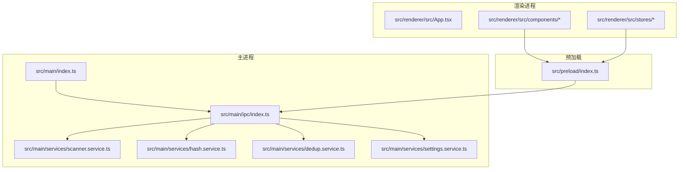
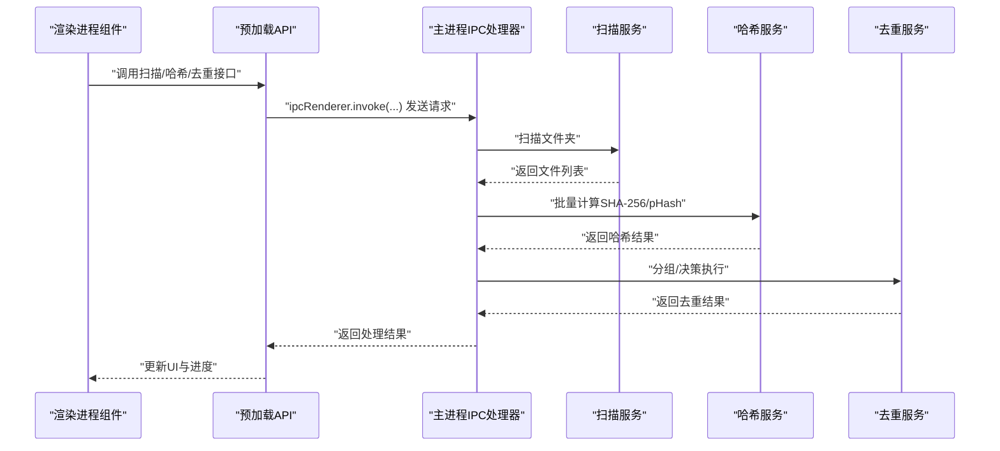
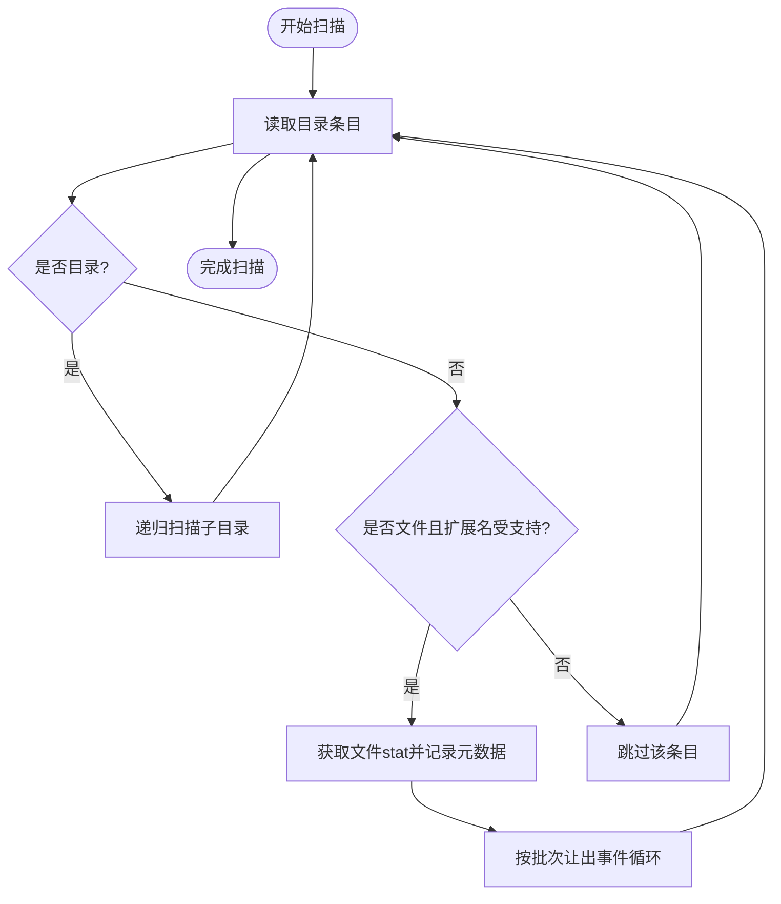
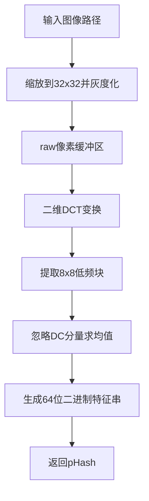
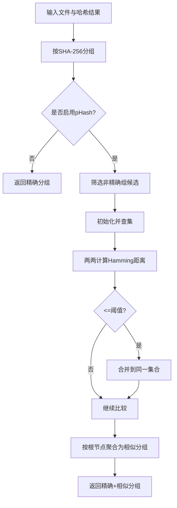
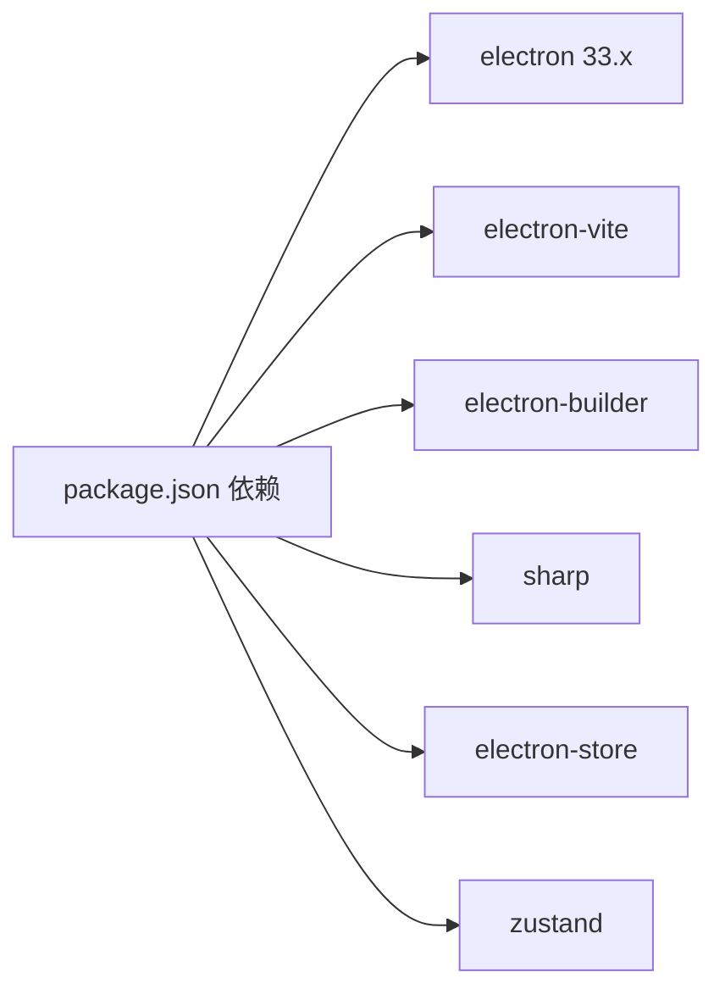

# 系统兼容性

<cite>
**本文引用的文件**
- [package.json](file://package.json)
- [electron.vite.config.ts](file://electron.vite.config.ts)
- [src/main/index.ts](file://src/main/index.ts)
- [src/preload/index.ts](file://src/preload/index.ts)
- [src/main/ipc/index.ts](file://src/main/ipc/index.ts)
- [src/main/services/scanner.service.ts](file://src/main/services/scanner.service.ts)
- [src/main/services/dedup.service.ts](file://src/main/services/dedup.service.ts)
- [src/main/services/hash.service.ts](file://src/main/services/hash.service.ts)
- [src/main/services/settings.service.ts](file://src/main/services/settings.service.ts)
- [src/renderer/src/components/ExecuteStep.tsx](file://src/renderer/src/components/ExecuteStep.tsx)
- [src/renderer/src/stores/settingsStore.ts](file://src/renderer/src/stores/settingsStore.ts)
- [src/renderer/src/types/index.ts](file://src/renderer/src/types/index.ts)
</cite>

## 目录
1. [简介](#简介)
2. [项目结构](#项目结构)
3. [核心组件](#核心组件)
4. [架构总览](#架构总览)
5. [详细组件分析](#详细组件分析)
6. [依赖关系分析](#依赖关系分析)
7. [性能考量](#性能考量)
8. [故障排查指南](#故障排查指南)
9. [结论](#结论)
10. [附录](#附录)

## 简介
本指南聚焦于红ophoto应用在不同操作系统（Windows、macOS、Linux）上的系统兼容性问题与解决方案，覆盖以下方面：
- 文件系统差异引发的路径问题、权限问题与字符编码问题
- 不同硬件配置对应用性能的影响（处理器架构、内存容量、存储设备类型）
- Electron 框架版本兼容性与 Node.js 环境要求
- 针对特定操作系统版本的配置调整建议与已知问题
- 第三方软件冲突识别与解决（杀毒软件、云存储同步工具等）
- 系统环境检查清单与兼容性测试方法

## 项目结构
红ophoto采用 Electron + React + Vite 的桌面应用架构，主进程负责文件扫描、哈希计算、去重与执行操作；渲染进程负责 UI 交互与状态管理；预加载脚本通过上下文隔离暴露受控 API。

图表来源
- [src/main/index.ts:1-61](file://src/main/index.ts#L1-L61)
- [src/main/ipc/index.ts:1-156](file://src/main/ipc/index.ts#L1-L156)
- [src/main/services/scanner.service.ts:1-86](file://src/main/services/scanner.service.ts#L1-L86)
- [src/main/services/hash.service.ts:1-180](file://src/main/services/hash.service.ts#L1-L180)
- [src/main/services/dedup.service.ts:1-209](file://src/main/services/dedup.service.ts#L1-L209)
- [src/main/services/settings.service.ts:1-34](file://src/main/services/settings.service.ts#L1-L34)
- [src/preload/index.ts:1-123](file://src/preload/index.ts#L1-L123)

章节来源
- [package.json:1-51](file://package.json#L1-L51)
- [electron.vite.config.ts:1-26](file://electron.vite.config.ts#L1-L26)
- [src/main/index.ts:1-61](file://src/main/index.ts#L1-L61)

## 核心组件
- 主进程窗口与生命周期：创建窗口、处理外部链接、开发/生产加载策略、窗口控制 IPC 注册。
- 预加载 API：通过 contextBridge 暴露受限 API，统一文件扫描、哈希计算、去重、缩略图生成、设置读写与进度监听。
- IPC 处理器：集中注册窗口控制、文件夹选择、扫描、哈希、pHash、分组、执行、缩略图与设置接口。
- 扫描服务：递归遍历目录，收集支持格式图片，统计文件元数据，带进度回调。
- 哈希服务：批量计算 SHA-256；基于图像感知哈希 pHash；Hamming 距离比较；缩略图生成。
- 去重服务：基于 SHA-256 的精确分组与基于 pHash 的相似分组（并查集），支持删除或复制输出。
- 设置服务：基于 electron-store 的本地持久化设置。

章节来源
- [src/main/index.ts:1-61](file://src/main/index.ts#L1-L61)
- [src/preload/index.ts:1-123](file://src/preload/index.ts#L1-L123)
- [src/main/ipc/index.ts:1-156](file://src/main/ipc/index.ts#L1-L156)
- [src/main/services/scanner.service.ts:1-86](file://src/main/services/scanner.service.ts#L1-L86)
- [src/main/services/hash.service.ts:1-180](file://src/main/services/hash.service.ts#L1-L180)
- [src/main/services/dedup.service.ts:1-209](file://src/main/services/dedup.service.ts#L1-L209)
- [src/main/services/settings.service.ts:1-34](file://src/main/services/settings.service.ts#L1-L34)

## 架构总览
下图展示从渲染进程到主进程再到文件系统的调用链路与数据流。

图表来源
- [src/preload/index.ts:61-120](file://src/preload/index.ts#L61-L120)
- [src/main/ipc/index.ts:22-155](file://src/main/ipc/index.ts#L22-L155)
- [src/main/services/scanner.service.ts:28-85](file://src/main/services/scanner.service.ts#L28-L85)
- [src/main/services/hash.service.ts:29-159](file://src/main/services/hash.service.ts#L29-L159)
- [src/main/services/dedup.service.ts:43-130](file://src/main/services/dedup.service.ts#L43-L130)

## 详细组件分析

### 路径与文件系统兼容性
- 统一使用 Node.js path 模块进行路径拼接与规范化，避免硬编码分隔符。
- 扫描阶段使用 fs.promises.readdir/stat，对不可访问目录/文件进行容错跳过。
- 输出复制时使用 path.relative 计算相对路径，确保目标目录结构保持一致。
- 删除模式直接使用文件 ID（在实现中作为路径传递）进行 unlink，注意权限与只读属性。

图表来源
- [src/main/services/scanner.service.ts:36-82](file://src/main/services/scanner.service.ts#L36-L82)

章节来源
- [src/main/services/scanner.service.ts:1-86](file://src/main/services/scanner.service.ts#L1-L86)
- [src/main/services/dedup.service.ts:162-208](file://src/main/services/dedup.service.ts#L162-L208)

### 权限与字符编码
- 权限：删除/复制操作依赖用户对源与目标目录的写入权限；对只读/系统保护文件会抛出错误并记录。
- 字符编码：路径字符串在 Node.js 层面以 UTF-8 处理；跨平台大小写敏感性需注意（macOS 默认不区分大小写，Linux 区分）。
- 路径大小写：扫描阶段对扩展名统一转小写，保证匹配一致性。

章节来源
- [src/main/services/dedup.service.ts:132-160](file://src/main/services/dedup.service.ts#L132-L160)
- [src/main/services/scanner.service.ts:48-70](file://src/main/services/scanner.service.ts#L48-L70)

### 图像处理与性能
- 使用 sharp 进行缩放、灰度与像素数据提取，pHash 计算采用二维 DCT 与均值阈值生成二进制特征串。
- 批量处理：SHA-256 批大小 20，pHash 批大小 5，并在每批后让出事件循环，避免阻塞主线程。
- 内存占用：大图缩放与 DCT 计算存在峰值内存；建议在低内存设备上减少并发与批大小。

图表来源
- [src/main/services/hash.service.ts:58-101](file://src/main/services/hash.service.ts#L58-L101)
- [src/main/services/hash.service.ts:132-159](file://src/main/services/hash.service.ts#L132-L159)

章节来源
- [src/main/services/hash.service.ts:1-180](file://src/main/services/hash.service.ts#L1-L180)

### 去重算法与阈值
- 精确分组：按 SHA-256 相同的文件聚合为一组。
- 相似分组：对未在精确组中的文件，基于 Hamming 距离与阈值进行并查集合并。
- 执行策略：删除模式直接删除选中文件；复制模式在目标目录重建相对路径结构并复制保留文件。

图表来源
- [src/main/services/dedup.service.ts:43-115](file://src/main/services/dedup.service.ts#L43-L115)
- [src/main/services/hash.service.ts:161-168](file://src/main/services/hash.service.ts#L161-L168)

章节来源
- [src/main/services/dedup.service.ts:1-209](file://src/main/services/dedup.service.ts#L1-L209)

### 渲染进程与设置
- 设置读写：通过预加载 API 与主进程 IPC 交互，设置持久化至本地存储。
- 输出目录命名：根据源目录名与后缀自动生成输出目录名，使用正则分割路径分隔符。

章节来源
- [src/renderer/src/stores/settingsStore.ts:1-40](file://src/renderer/src/stores/settingsStore.ts#L1-L40)
- [src/renderer/src/components/ExecuteStep.tsx:16-21](file://src/renderer/src/components/ExecuteStep.tsx#L16-L21)
- [src/main/services/settings.service.ts:1-34](file://src/main/services/settings.service.ts#L1-L34)

## 依赖关系分析
- Electron 版本：开发与构建使用 Electron 33.x，需关注各平台二进制与 Node.js 兼容性。
- 构建工具：electron-vite 提供开发与打包能力；electron-builder 用于安装包构建。
- 图像处理：sharp 依赖系统库，需确保各平台运行时可用。
- 存储：electron-store 提供本地设置持久化。

图表来源
- [package.json:13-34](file://package.json#L13-L34)

章节来源
- [package.json:1-51](file://package.json#L1-L51)
- [electron.vite.config.ts:1-26](file://electron.vite.config.ts#L1-L26)

## 性能考量
- CPU/内存：大图 pHash 计算与 DCT 变换为 CPU 密集型；建议在多核环境下合理设置批大小。
- 存储：SSD 读写速度显著影响扫描与复制阶段；机械硬盘会明显拉长处理时间。
- 并发：当前实现已在关键循环中让出事件循环，避免 UI 卡顿；可进一步按硬件能力动态调整批大小。
- 缩略图：sharp 缩放与编码在高分辨率场景下耗时较长，建议限制最大尺寸与质量参数。

章节来源
- [src/main/services/hash.service.ts:16-56](file://src/main/services/hash.service.ts#L16-L56)
- [src/main/services/dedup.service.ts:173-208](file://src/main/services/dedup.service.ts#L173-L208)

## 故障排查指南

### Windows
- 安装包与权限
  - 使用 NSIS 安装器，允许更改安装目录；若出现权限错误，尝试以管理员身份运行或调整安装路径。
  - 若杀毒软件拦截，请将其加入白名单或临时关闭后重试。
- 路径与字符编码
  - 注意盘符大小写与路径分隔符；应用内部已统一处理，但用户选择的路径需符合系统规则。
- 第三方冲突
  - 云存储同步工具（如 OneDrive、Dropbox）可能锁定文件导致删除/复制失败；请先暂停同步再执行操作。

章节来源
- [package.json:35-49](file://package.json#L35-L49)
- [src/main/services/dedup.service.ts:132-160](file://src/main/services/dedup.service.ts#L132-L160)

### macOS
- 权限与沙盒
  - 首次运行可能触发安全弹窗；确保授予“照片”或目标文件夹访问权限。
  - 若出现“无法打开”的提示，检查 Gatekeeper 设置或从“获取方式”中允许。
- 大小写不敏感
  - 扩展名匹配已转小写，但仍需注意同名不同大小写的文件可能被误判为重复。
- 第三方冲突
  - Spotlight 或备份工具可能影响文件访问；必要时暂时关闭索引或排除目标目录。

章节来源
- [src/main/services/scanner.service.ts:48-70](file://src/main/services/scanner.service.ts#L48-L70)
- [src/main/index.ts:56-60](file://src/main/index.ts#L56-L60)

### Linux
- 依赖与运行时
  - 确保系统具备 libvips（sharp 依赖）与相应字体库；部分发行版需手动安装。
  - 若启动崩溃，检查 Node.js 与 Electron 版本是否满足依赖要求。
- 权限
  - 对受保护目录（如 /usr）无写权限会导致复制/删除失败；请切换到有权限的目录。
- 第三方冲突
  - 云同步/备份工具可能导致文件句柄占用；建议在执行前停止相关服务。

章节来源
- [src/main/services/hash.service.ts:65-70](file://src/main/services/hash.service.ts#L65-L70)
- [src/main/services/dedup.service.ts:173-177](file://src/main/services/dedup.service.ts#L173-L177)

### 通用问题与建议
- 路径问题
  - 避免包含特殊字符与超长路径；尽量使用英文路径。
- 权限问题
  - 确保对源目录与输出目录具有读/写权限；对只读/隐藏文件需额外处理。
- 字符编码
  - 文件名包含非 ASCII 字符时，确保系统区域设置正确；必要时重命名文件。
- 第三方软件冲突
  - 杀毒软件：添加应用到白名单或临时禁用扫描。
  - 云存储：暂停同步或排除目标目录。
  - 备份软件：避免同时访问相同文件。

## 结论
红ophoto在跨平台兼容性方面通过统一的路径处理、容错的文件访问与可控的并发策略，实现了较为稳健的运行表现。针对不同操作系统与硬件配置，建议结合本文的性能优化与故障排查建议，以获得最佳体验。

## 附录

### 系统环境检查清单
- 操作系统版本：Windows 10/11、macOS 10.15+、Linux（Ubuntu/Fedora/Arch 等主流发行版）
- Node.js 版本：与 Electron 33.x 兼容的 LTS 版本
- 硬件要求：至少 8GB 内存，推荐 16GB；SSD 存储优先
- 运行时依赖：libvips（sharp）、系统字体库
- 权限：对目标照片目录与输出目录具备读写权限

### 已知问题与规避
- macOS 大小写不敏感：同名不同大小写文件可能被视为重复，建议统一命名规范。
- Linux 权限限制：受保护目录写入失败，需切换到用户目录或提升权限。
- 第三方软件冲突：杀毒/云同步工具可能锁定文件，执行前先暂停对应服务。

### 兼容性测试方法
- 测试步骤
  - 在三类系统上分别安装并运行应用，验证窗口与功能正常。
  - 准备包含多种格式与大小的照片样本，执行扫描、哈希、去重与复制/删除流程。
  - 记录各阶段耗时与错误日志，定位性能瓶颈与异常点。
- 关键指标
  - 扫描完成率与进度回调准确性
  - 哈希计算成功率与 pHash 分组一致性
  - 复制/删除操作的成功数与失败原因统计