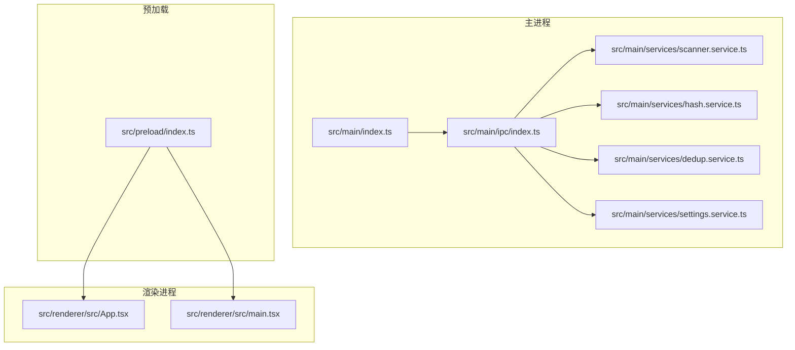
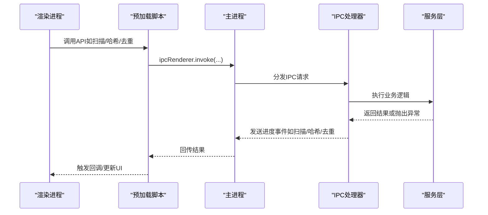
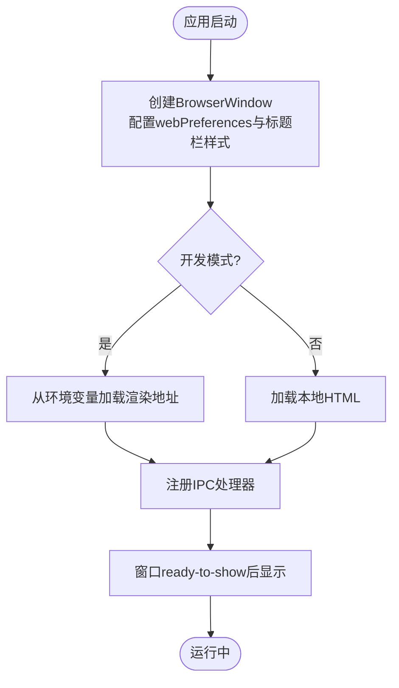
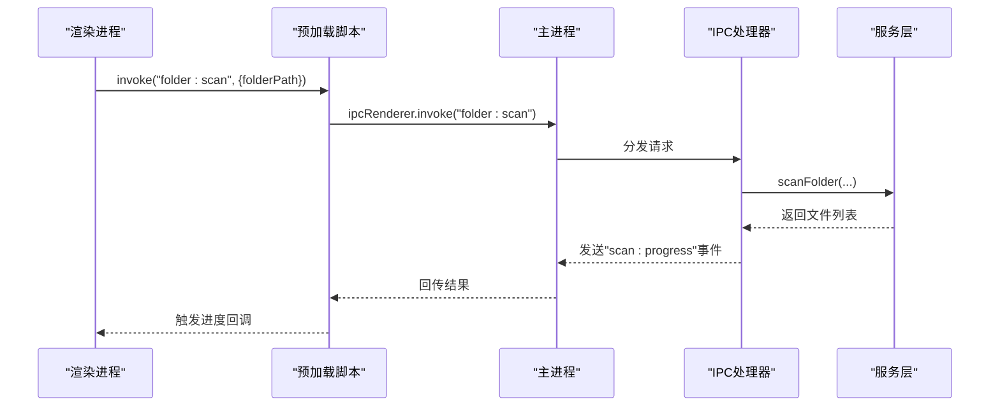
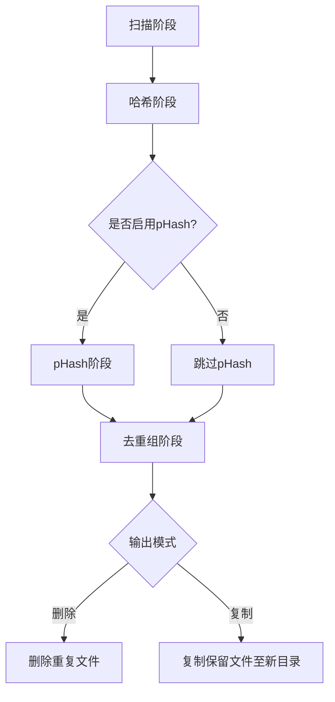
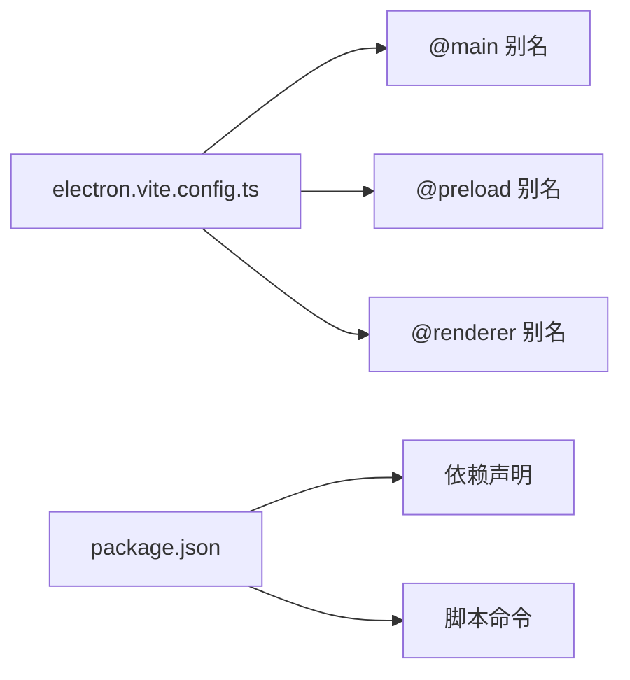

# 调试工具与日志

<cite>
**本文引用的文件**
- [src/main/index.ts](file://src/main/index.ts)
- [src/preload/index.ts](file://src/preload/index.ts)
- [src/main/ipc/index.ts](file://src/main/ipc/index.ts)
- [src/main/services/scanner.service.ts](file://src/main/services/scanner.service.ts)
- [src/main/services/hash.service.ts](file://src/main/services/hash.service.ts)
- [src/main/services/dedup.service.ts](file://src/main/services/dedup.service.ts)
- [src/main/services/settings.service.ts](file://src/main/services/settings.service.ts)
- [electron.vite.config.ts](file://electron.vite.config.ts)
- [package.json](file://package.json)
</cite>

## 目录
1. [简介](#简介)
2. [项目结构](#项目结构)
3. [核心组件](#核心组件)
4. [架构总览](#架构总览)
5. [详细组件分析](#详细组件分析)
6. [依赖分析](#依赖分析)
7. [性能考虑](#性能考虑)
8. [故障排查指南](#故障排查指南)
9. [结论](#结论)
10. [附录](#附录)

## 简介
本指南面向Redophoto应用的开发者与高级用户，系统讲解应用内调试能力与外部调试工具的使用方法，覆盖以下主题：
- 如何启用与查看应用日志（主进程、渲染进程、IPC通信）
- Electron DevTools 的打开方式、性能分析与内存监控
- 第三方调试工具（Chrome DevTools、Node.js调试器）的集成
- 错误堆栈捕获与异步错误、Promise拒绝的调试策略
- 自定义日志记录最佳实践与日志级别建议
- 远程调试与生产环境问题诊断思路

## 项目结构
Redophoto采用Electron + Vite的现代桌面应用架构，主要目录与职责如下：
- 主进程：负责窗口生命周期、IPC注册、系统级操作
- 预加载脚本：通过contextBridge暴露受控API给渲染进程
- 渲染进程：React应用，调用预加载暴露的API完成业务流程
- 服务层：扫描、哈希、去重、设置等业务逻辑



图表来源
- [src/main/index.ts:1-61](file://src/main/index.ts#L1-L61)
- [src/main/ipc/index.ts:1-156](file://src/main/ipc/index.ts#L1-L156)
- [src/preload/index.ts:1-123](file://src/preload/index.ts#L1-L123)
- [src/main/services/scanner.service.ts:1-86](file://src/main/services/scanner.service.ts#L1-L86)
- [src/main/services/hash.service.ts:1-180](file://src/main/services/hash.service.ts#L1-L180)
- [src/main/services/dedup.service.ts:1-209](file://src/main/services/dedup.service.ts#L1-L209)
- [src/main/services/settings.service.ts:1-34](file://src/main/services/settings.service.ts#L1-L34)

章节来源
- [src/main/index.ts:1-61](file://src/main/index.ts#L1-L61)
- [electron.vite.config.ts:1-26](file://electron.vite.config.ts#L1-L26)
- [package.json:1-51](file://package.json#L1-L51)

## 核心组件
- 主进程入口与窗口管理：负责创建BrowserWindow、加载页面、注册IPC处理器、处理窗口事件
- 预加载脚本与API桥接：通过contextBridge暴露安全可控的API给渲染进程，并监听进度事件
- IPC处理器：集中处理来自渲染进程的请求，触发扫描、哈希、去重、设置等业务逻辑，并向渲染进程发送进度事件
- 服务层：包含文件扫描、哈希计算、感知哈希与去重算法、设置持久化

章节来源
- [src/main/index.ts:8-46](file://src/main/index.ts#L8-L46)
- [src/preload/index.ts:61-123](file://src/preload/index.ts#L61-L123)
- [src/main/ipc/index.ts:22-156](file://src/main/ipc/index.ts#L22-L156)
- [src/main/services/scanner.service.ts:28-86](file://src/main/services/scanner.service.ts#L28-L86)
- [src/main/services/hash.service.ts:29-180](file://src/main/services/hash.service.ts#L29-L180)
- [src/main/services/dedup.service.ts:43-209](file://src/main/services/dedup.service.ts#L43-L209)
- [src/main/services/settings.service.ts:17-34](file://src/main/services/settings.service.ts#L17-L34)

## 架构总览
下图展示从渲染进程到主进程、再到服务层的调用链路，以及IPC进度事件回传路径。



图表来源
- [src/preload/index.ts:61-123](file://src/preload/index.ts#L61-L123)
- [src/main/ipc/index.ts:22-156](file://src/main/ipc/index.ts#L22-L156)
- [src/main/index.ts:39-45](file://src/main/index.ts#L39-L45)

## 详细组件分析

### 组件A：主进程与窗口生命周期
- 创建BrowserWindow时启用了上下文隔离、禁用沙箱但关闭Node集成，确保安全边界
- 开发模式下从环境变量加载渲染地址；否则加载本地HTML
- 注册IPC处理器后，等待窗口显示后再展示，避免闪烁



图表来源
- [src/main/index.ts:8-46](file://src/main/index.ts#L8-L46)

章节来源
- [src/main/index.ts:8-46](file://src/main/index.ts#L8-L46)

### 组件B：预加载脚本与API桥接
- 暴露受控API：窗口控制、文件夹选择、扫描、哈希、去重、缩略图、设置、进度监听
- 使用ipcRenderer.invoke进行请求-响应式调用，使用ipcRenderer.on订阅进度事件
- 提供取消订阅函数，避免事件泄漏

```mermaid
classDiagram
class PreloadAPI {
+minimizeWindow()
+maximizeWindow()
+closeWindow()
+selectFolder() Promise<string|null>
+scanFolder(path) Promise<FileInfo[]>
+computeHashes(files) Promise<HashResult[]>
+computePhashes(files) Promise<PhashResult[]>
+groupDuplicates(data) Promise<DuplicateGroup[]>
+executeDedup(data) Promise<{success, errors}>
+getThumbnail(path, maxSize?) Promise<string>
+getSettings() Promise<AppSettings>
+setSettings(partial) Promise<AppSettings>
+onScanProgress(cb) () => void
+onHashProgress(cb) () => void
+onDedupProgress(cb) () => void
}
```

图表来源
- [src/preload/index.ts:61-123](file://src/preload/index.ts#L61-L123)

章节来源
- [src/preload/index.ts:61-123](file://src/preload/index.ts#L61-L123)

### 组件C：IPC处理器与进度事件
- 注册窗口控制、文件夹选择、扫描、哈希、pHash、去重、缩略图、设置等IPC处理函数
- 在扫描、哈希、去重阶段向渲染进程发送进度事件，便于UI反馈
- 去重执行阶段根据设置选择删除或复制模式，并在过程中持续上报进度



图表来源
- [src/main/ipc/index.ts:42-53](file://src/main/ipc/index.ts#L42-L53)
- [src/main/ipc/index.ts:132-141](file://src/main/ipc/index.ts#L132-L141)

章节来源
- [src/main/ipc/index.ts:22-156](file://src/main/ipc/index.ts#L22-L156)

### 组件D：服务层（扫描、哈希、去重、设置）
- 文件扫描：递归遍历目录，过滤支持的扩展名，分批统计文件信息并上报进度
- 哈希计算：分批计算SHA-256与pHash，异常文件返回占位值，保证整体流程不中断
- 去重算法：先按SHA-256精确分组，再对非精确组按pHash汉明距离阈值进行相似分组；支持删除或复制两种输出模式
- 设置持久化：基于electron-store存储应用设置，默认值与合并策略清晰



图表来源
- [src/main/services/scanner.service.ts:28-86](file://src/main/services/scanner.service.ts#L28-L86)
- [src/main/services/hash.service.ts:29-180](file://src/main/services/hash.service.ts#L29-L180)
- [src/main/services/dedup.service.ts:43-209](file://src/main/services/dedup.service.ts#L43-L209)
- [src/main/services/settings.service.ts:17-34](file://src/main/services/settings.service.ts#L17-L34)

章节来源
- [src/main/services/scanner.service.ts:28-86](file://src/main/services/scanner.service.ts#L28-L86)
- [src/main/services/hash.service.ts:29-180](file://src/main/services/hash.service.ts#L29-L180)
- [src/main/services/dedup.service.ts:43-209](file://src/main/services/dedup.service.ts#L43-L209)
- [src/main/services/settings.service.ts:17-34](file://src/main/services/settings.service.ts#L17-L34)

## 依赖分析
- 构建工具：electron-vite提供主进程、预加载、渲染进程三端别名与插件配置
- 运行时依赖：@electron-toolkit/utils用于开发检测，electron-store用于设置持久化，sharp用于图像处理
- 脚本命令：dev/build/preview用于开发与打包，postinstall安装构建依赖



图表来源
- [electron.vite.config.ts:5-25](file://electron.vite.config.ts#L5-L25)
- [package.json:13-34](file://package.json#L13-L34)

章节来源
- [electron.vite.config.ts:5-25](file://electron.vite.config.ts#L5-L25)
- [package.json:13-34](file://package.json#L13-L34)

## 性能考虑
- 事件循环让渡：多处使用setImmediate让渡事件循环，避免长时间阻塞，提升UI响应性
- 分批处理：哈希与pHash计算采用批次处理，降低单次Promise.all压力
- 进度上报：在关键节点上报进度，便于用户感知与前端优化
- 图像处理：使用sharp进行高效缩放与编码，注意大图内存占用

章节来源
- [src/main/services/scanner.service.ts:78-82](file://src/main/services/scanner.service.ts#L78-L82)
- [src/main/services/hash.service.ts:36-53](file://src/main/services/hash.service.ts#L36-L53)
- [src/main/services/hash.service.ts:139-156](file://src/main/services/hash.service.ts#L139-L156)
- [src/main/services/dedup.service.ts:154-157](file://src/main/services/dedup.service.ts#L154-L157)
- [src/main/services/dedup.service.ts:202-205](file://src/main/services/dedup.service.ts#L202-L205)

## 故障排查指南

### 启用与查看应用日志
- 主进程日志
  - 在开发模式下，主进程通过标准输出打印日志。建议在终端中运行开发命令以查看输出。
  - 参考：主进程创建窗口与加载页面的分支逻辑
- 渲染进程日志
  - 在浏览器控制台中查看日志与错误堆栈。可通过DevTools的Console面板与Sources面板定位问题。
  - 参考：预加载脚本暴露的API与事件监听机制
- IPC通信日志
  - 在主进程的IPC处理器中添加日志，记录请求类型、参数与结果，有助于追踪调用链
  - 参考：IPC处理器中的请求分发与进度事件发送

章节来源
- [src/main/index.ts:39-45](file://src/main/index.ts#L39-L45)
- [src/preload/index.ts:103-119](file://src/preload/index.ts#L103-L119)
- [src/main/ipc/index.ts:42-53](file://src/main/ipc/index.ts#L42-L53)

### Electron DevTools使用
- 打开方式
  - 在主进程中通过快捷键或菜单打开开发者工具（常见为F12或右键检查元素）
  - 在开发模式下，可结合Electron内置的DevTools特性进行调试
- 性能分析
  - 使用Performance面板录制页面交互，观察主线程耗时与垃圾回收
- 内存监控
  - 使用Memory面板定期快照，对比对象分配趋势，定位内存泄漏

### 第三方调试工具集成
- Chrome DevTools
  - 通过预加载脚本暴露的API在渲染进程中进行断点调试与网络请求分析
- Node.js调试器
  - 在主进程启用调试模式，附加Node.js调试器进行断点与调用栈分析
  - 结合electron-vite的开发脚本，可在启动参数中加入inspect选项

### 捕获与分析错误堆栈
- 异步错误处理
  - 在服务层的异步函数中使用try/catch包裹，记录错误并返回占位值，避免中断整体流程
  - 参考：哈希计算与pHash计算中的异常处理
- Promise拒绝调试
  - 在预加载脚本中统一捕获invoke返回的Promise拒绝，记录错误并提示用户
  - 在IPC处理器中对可能抛出异常的业务逻辑进行包装，确保错误可追踪

章节来源
- [src/main/services/hash.service.ts:40-46](file://src/main/services/hash.service.ts#L40-L46)
- [src/main/services/hash.service.ts:142-149](file://src/main/services/hash.service.ts#L142-L149)

### 自定义日志记录最佳实践
- 日志级别
  - TRACE/INFO/WARN/ERROR：区分不同严重程度，避免生产环境过度输出
- 结构化日志
  - 记录时间戳、模块名、函数名、参数摘要与结果状态
- 进度与指标
  - 对耗时操作输出进度与指标，便于性能分析与问题定位
- 安全性
  - 避免在日志中输出敏感信息（如文件路径、用户数据）

### 生产环境问题诊断
- 远程调试
  - 在应用启动时开启远程调试端口，通过SSH隧道或内网穿透访问调试界面
- 错误上报
  - 将未捕获异常与错误堆栈上传至遥测系统，结合日志与快照进行复现
- 用户反馈
  - 提供一键收集日志与系统信息的功能，便于快速定位问题

## 结论
Redophoto的调试体系围绕“主进程-预加载-渲染进程”的三层结构展开，辅以IPC进度事件与服务层的分批处理策略，能够在复杂任务中保持良好的可观测性与用户体验。通过合理运用Electron DevTools、Chrome DevTools与Node.js调试器，配合结构化日志与错误上报，可有效提升问题定位效率与系统稳定性。

## 附录

### 常用调试命令与配置
- 开发模式：运行开发服务器，自动热更新
- 预览模式：构建后预览应用
- 打包构建：生成安装包

章节来源
- [package.json:6-12](file://package.json#L6-L12)