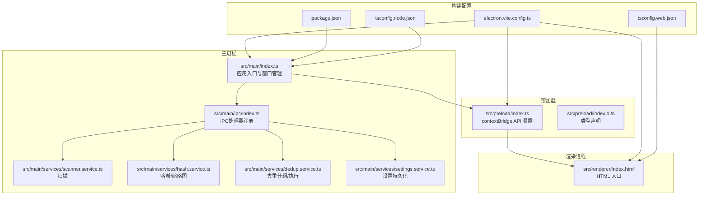
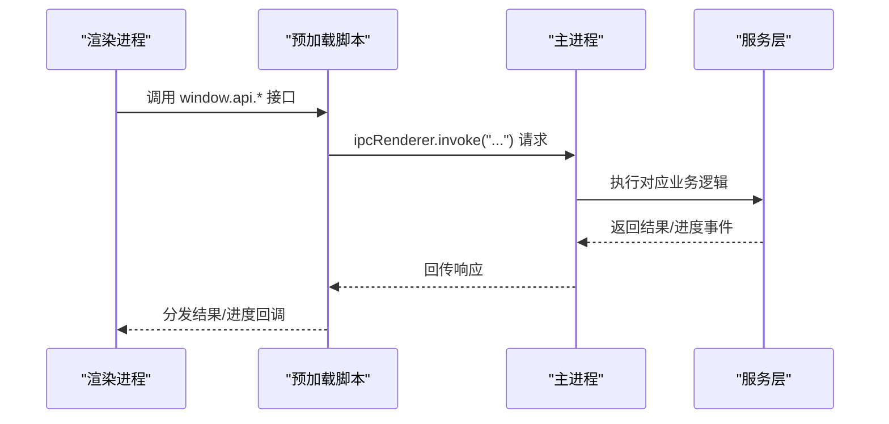
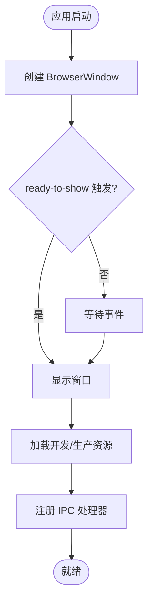
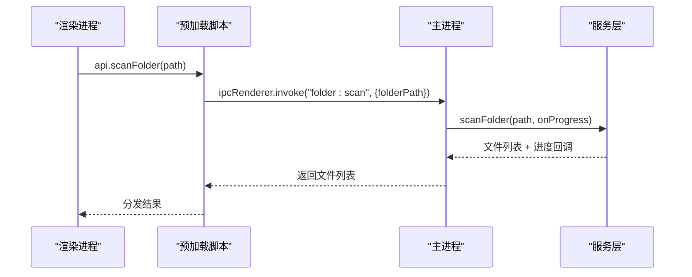
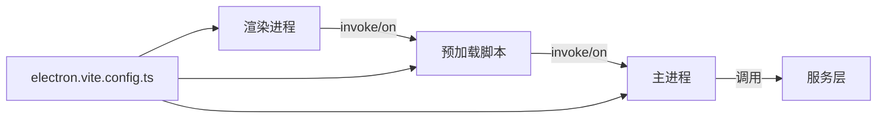
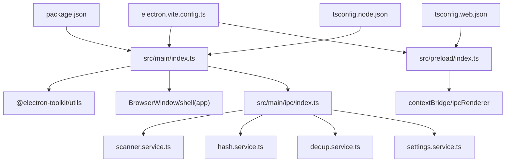

# 主进程架构

<cite>
**本文引用的文件**
- [src/main/index.ts](file://src/main/index.ts)
- [src/main/ipc/index.ts](file://src/main/ipc/index.ts)
- [src/main/services/scanner.service.ts](file://src/main/services/scanner.service.ts)
- [src/main/services/hash.service.ts](file://src/main/services/hash.service.ts)
- [src/main/services/dedup.service.ts](file://src/main/services/dedup.service.ts)
- [src/main/services/settings.service.ts](file://src/main/services/settings.service.ts)
- [src/preload/index.ts](file://src/preload/index.ts)
- [src/preload/index.d.ts](file://src/preload/index.d.ts)
- [src/renderer/index.html](file://src/renderer/index.html)
- [electron.vite.config.ts](file://electron.vite.config.ts)
- [package.json](file://package.json)
- [tsconfig.json](file://tsconfig.json)
- [tsconfig.node.json](file://tsconfig.node.json)
- [tsconfig.web.json](file://tsconfig.web.json)
</cite>

## 目录
1. [引言](#引言)
2. [项目结构](#项目结构)
3. [核心组件](#核心组件)
4. [架构总览](#架构总览)
5. [详细组件分析](#详细组件分析)
6. [依赖关系分析](#依赖关系分析)
7. [性能考量](#性能考量)
8. [故障排查指南](#故障排查指南)
9. [结论](#结论)
10. [附录](#附录)

## 引言
本文件系统性梳理红ophoto应用的主进程（Main Process）架构与运行机制，覆盖以下主题：
- 主进程职责与生命周期：窗口创建、应用启动与退出处理
- BrowserWindow 配置要点：尺寸、标题栏样式、安全设置
- IPC 处理器注册与应用状态管理
- 开发与生产环境的加载策略差异
- 安全配置：contextIsolation 与 nodeIntegration 的取舍
- 主进程与渲染进程、预加载脚本的交互模式与最佳实践

## 项目结构
红ophoto采用 Electron + React + Vite 的多包结构，主进程入口位于 src/main/index.ts，通过预加载脚本 src/preload/index.ts 暴露受限 API 给渲染进程，业务逻辑以服务模块形式组织在 src/main/services 下。



**图表来源**
- [src/main/index.ts:1-61](file://src/main/index.ts#L1-L61)
- [src/main/ipc/index.ts:1-156](file://src/main/ipc/index.ts#L1-L156)
- [src/main/services/scanner.service.ts:1-86](file://src/main/services/scanner.service.ts#L1-L86)
- [src/main/services/hash.service.ts:1-180](file://src/main/services/hash.service.ts#L1-L180)
- [src/main/services/dedup.service.ts:1-209](file://src/main/services/dedup.service.ts#L1-L209)
- [src/main/services/settings.service.ts:1-34](file://src/main/services/settings.service.ts#L1-L34)
- [src/preload/index.ts:1-123](file://src/preload/index.ts#L1-L123)
- [src/preload/index.d.ts:1-52](file://src/preload/index.d.ts#L1-L52)
- [src/renderer/index.html:1-13](file://src/renderer/index.html#L1-L13)
- [electron.vite.config.ts:1-26](file://electron.vite.config.ts#L1-L26)
- [package.json:1-51](file://package.json#L1-L51)
- [tsconfig.node.json:1-21](file://tsconfig.node.json#L1-L21)
- [tsconfig.web.json:1-22](file://tsconfig.web.json#L1-L22)

**章节来源**
- [src/main/index.ts:1-61](file://src/main/index.ts#L1-L61)
- [electron.vite.config.ts:1-26](file://electron.vite.config.ts#L1-L26)
- [package.json:1-51](file://package.json#L1-L51)
- [tsconfig.json:1-8](file://tsconfig.json#L1-L8)
- [tsconfig.node.json:1-21](file://tsconfig.node.json#L1-L21)
- [tsconfig.web.json:1-22](file://tsconfig.web.json#L1-L22)

## 核心组件
- 应用入口与窗口管理：负责创建 BrowserWindow、设置窗口行为、加载开发或生产资源，并注册 IPC 处理器。
- 预加载脚本：通过 contextBridge 将受控 API 暴露到渲染进程全局命名空间，确保上下文隔离下的安全通信。
- IPC 注册中心：集中定义主进程侧的 ipcMain.handle 处理器，承载窗口控制、文件夹选择、扫描、哈希计算、去重分组与执行、缩略图生成、设置读写等能力。
- 业务服务层：扫描器、哈希/感知哈希与缩略图生成器、去重算法与执行器、设置存储。

**章节来源**
- [src/main/index.ts:8-46](file://src/main/index.ts#L8-L46)
- [src/preload/index.ts:61-122](file://src/preload/index.ts#L61-L122)
- [src/main/ipc/index.ts:22-155](file://src/main/ipc/index.ts#L22-L155)

## 架构总览
主进程采用“入口-窗口-预加载-IPC-服务”的分层设计。入口文件初始化窗口并决定加载策略；预加载脚本提供受限 API；IPC 层桥接渲染进程请求与主进程服务；服务层封装具体业务逻辑。



**图表来源**
- [src/preload/index.ts:61-122](file://src/preload/index.ts#L61-L122)
- [src/main/ipc/index.ts:22-155](file://src/main/ipc/index.ts#L22-L155)
- [src/main/index.ts:39-45](file://src/main/index.ts#L39-L45)

## 详细组件分析

### 应用入口与窗口生命周期
- 窗口创建：在 createWindow 中实例化 BrowserWindow，设置固定与最小尺寸、无边框与隐藏标题栏、标题栏覆盖区颜色与高度、预加载路径、沙箱与上下文隔离、禁用 Node 集成等。
- 显示策略：窗口 ready-to-show 时显示，避免白屏。
- 外链处理：setWindowOpenHandler 拦截新窗口打开，统一通过外部浏览器打开。
- 加载策略：开发环境从环境变量指定的地址加载；生产环境加载打包后的 HTML。
- 应用激活与退出：whenReady 初始化窗口；activate 保证 macOS 复活；window-all-closed 在非 macOS 平台退出。



**图表来源**
- [src/main/index.ts:8-46](file://src/main/index.ts#L8-L46)

**章节来源**
- [src/main/index.ts:8-46](file://src/main/index.ts#L8-L46)

### BrowserWindow 配置要点
- 尺寸与约束：固定宽高与最小宽高，保障界面可用性。
- 标题栏样式：frame 设为 false，titleBarStyle 为 hidden，并通过 titleBarOverlay 设置覆盖区颜色、符号色与高度，实现自绘标题栏风格。
- 安全设置：preload 指向预加载脚本；sandbox 关闭；contextIsolation 启用；nodeIntegration 关闭，确保渲染进程无法直接访问 Node API。

**章节来源**
- [src/main/index.ts:9-28](file://src/main/index.ts#L9-L28)

### 预加载脚本与 API 暴露
- 类型与接口：在 index.d.ts 中声明全局 window.api 的完整签名，涵盖窗口控制、文件夹操作、哈希/感知哈希、去重、缩略图、设置以及进度监听。
- API 暴露：通过 contextBridge.exposeInMainWorld 将受控方法暴露给渲染进程，使用 ipcRenderer.invoke 进行请求，使用 ipcRenderer.on 订阅进度事件。

```mermaid
classDiagram
class PreloadAPI {
+minimizeWindow()
+maximizeWindow()
+closeWindow()
+selectFolder() Promise<string|null>
+scanFolder(folderPath) Promise<FileInfo[]>
+computeHashes(files) Promise<HashResult[]>
+computePhashes(files) Promise<PhashResult[]>
+groupDuplicates(data) Promise<DuplicateGroup[]>
+executeDedup(data) Promise<{success, errors}>
+getThumbnail(filePath, maxSize?) Promise<string>
+getSettings() Promise<AppSettings>
+setSettings(partial) Promise<AppSettings>
+onScanProgress(cb) () => void
+onHashProgress(cb) () => void
+onDedupProgress(cb) () => void
}
```

**图表来源**
- [src/preload/index.ts:61-122](file://src/preload/index.ts#L61-L122)
- [src/preload/index.d.ts:13-45](file://src/preload/index.d.ts#L13-L45)

**章节来源**
- [src/preload/index.ts:1-123](file://src/preload/index.ts#L1-L123)
- [src/preload/index.d.ts:1-52](file://src/preload/index.d.ts#L1-L52)

### IPC 处理器与应用状态
- 窗口控制：最小化、最大化/还原、关闭。
- 文件夹选择：通过对话框选择目录并返回路径。
- 扫描：递归扫描目标目录，过滤支持的图片扩展名，统计进度并通过 webContents 发送扫描进度事件。
- 哈希与感知哈希：批量计算 SHA-256 与 pHash，按批次并发，发送进度事件。
- 去重：基于 SHA-256 精确分组与可选的 pHash 相似分组（并查集），支持阈值控制。
- 执行去重：支持删除模式与复制模式，复制模式会按原目录结构输出到新文件夹。
- 缩略图：基于 sharp 生成 JPEG 数据 URL。
- 设置：基于 electron-store 持久化，提供默认值合并与更新。



**图表来源**
- [src/main/ipc/index.ts:42-53](file://src/main/ipc/index.ts#L42-L53)
- [src/main/services/scanner.service.ts:28-85](file://src/main/services/scanner.service.ts#L28-L85)

**章节来源**
- [src/main/ipc/index.ts:22-155](file://src/main/ipc/index.ts#L22-L155)
- [src/main/services/scanner.service.ts:1-86](file://src/main/services/scanner.service.ts#L1-L86)
- [src/main/services/hash.service.ts:1-180](file://src/main/services/hash.service.ts#L1-L180)
- [src/main/services/dedup.service.ts:1-209](file://src/main/services/dedup.service.ts#L1-L209)
- [src/main/services/settings.service.ts:1-34](file://src/main/services/settings.service.ts#L1-L34)

### 开发与生产加载策略
- 开发：当 is.dev 且存在 ELECTRON_RENDERER_URL 环境变量时，从该 URL 加载渲染进程资源，便于热更新与快速迭代。
- 生产：否则加载打包后的本地 HTML 文件，确保最终分发的一致性与安全性。

**章节来源**
- [src/main/index.ts:39-43](file://src/main/index.ts#L39-L43)

### 安全配置与最佳实践
- 上下文隔离：启用 contextIsolation，阻止渲染进程直接访问 Node API。
- Node 集成：禁用 nodeIntegration，避免在渲染进程中直接执行 Node 代码。
- 预加载脚本：通过 preload 指定预加载脚本，仅在受控 API 下与渲染进程通信。
- 外链拦截：setWindowOpenHandler 拒绝新窗口并交由系统默认浏览器打开，降低钓鱼与弹窗风险。
- 沙箱：当前 sandbox 关闭，建议在生产中评估开启沙箱对功能的影响并逐步迁移。

**章节来源**
- [src/main/index.ts:22-27](file://src/main/index.ts#L22-L27)
- [src/main/index.ts:34-37](file://src/main/index.ts#L34-L37)

### 主进程与其他进程的交互模式
- 渲染进程 ↔ 预加载脚本：通过 ipcRenderer.invoke 与 on 订阅事件进行异步通信。
- 主进程 ↔ 服务层：IPC 处理器作为门面，调用具体服务函数，必要时回传进度事件。
- 构建系统：electron-vite 提供主进程、预加载与渲染进程的别名与插件配置，简化模块解析与打包。



**图表来源**
- [src/preload/index.ts:61-122](file://src/preload/index.ts#L61-L122)
- [src/main/ipc/index.ts:22-155](file://src/main/ipc/index.ts#L22-L155)
- [electron.vite.config.ts:1-26](file://electron.vite.config.ts#L1-L26)

**章节来源**
- [src/preload/index.ts:1-123](file://src/preload/index.ts#L1-L123)
- [src/main/ipc/index.ts:1-156](file://src/main/ipc/index.ts#L1-L156)
- [electron.vite.config.ts:1-26](file://electron.vite.config.ts#L1-L26)

## 依赖关系分析
- 主进程入口依赖 Electron 的 app、BrowserWindow、shell 与 @electron-toolkit/utils 的 is 工具。
- IPC 注册依赖各业务服务模块，形成清晰的单向数据流。
- 预加载脚本依赖 contextBridge 与 ipcRenderer，向外暴露受控 API。
- 构建配置通过 electron-vite 与 TypeScript 路径映射，分别针对 Node 与 Web 环境进行编译。



**图表来源**
- [src/main/index.ts:1-6](file://src/main/index.ts#L1-L6)
- [src/main/ipc/index.ts:1-18](file://src/main/ipc/index.ts#L1-L18)
- [src/preload/index.ts:1](file://src/preload/index.ts#L1)
- [electron.vite.config.ts:1-26](file://electron.vite.config.ts#L1-L26)
- [package.json:13-34](file://package.json#L13-L34)
- [tsconfig.node.json:11-13](file://tsconfig.node.json#L11-L13)
- [tsconfig.web.json:12-14](file://tsconfig.web.json#L12-L14)

**章节来源**
- [src/main/index.ts:1-6](file://src/main/index.ts#L1-L6)
- [src/main/ipc/index.ts:1-18](file://src/main/ipc/index.ts#L1-L18)
- [src/preload/index.ts:1](file://src/preload/index.ts#L1)
- [electron.vite.config.ts:1-26](file://electron.vite.config.ts#L1-L26)
- [package.json:13-34](file://package.json#L13-L34)
- [tsconfig.node.json:11-13](file://tsconfig.node.json#L11-L13)
- [tsconfig.web.json:12-14](file://tsconfig.web.json#L12-L14)

## 性能考量
- 批处理与并发：哈希与感知哈希采用批处理并发，减少主线程阻塞；扫描阶段每 N 个文件让出事件循环，避免卡顿。
- 进度反馈：通过 webContents.send 分发阶段性进度，提升用户体验。
- 图像处理：缩略图生成使用 sharp，合理设置尺寸与质量，平衡体积与清晰度。
- I/O 优化：复制/删除操作按批次 yield，避免长时间阻塞。

**章节来源**
- [src/main/services/hash.service.ts:16-56](file://src/main/services/hash.service.ts#L16-L56)
- [src/main/services/hash.service.ts:132-159](file://src/main/services/hash.service.ts#L132-L159)
- [src/main/services/scanner.service.ts:75-82](file://src/main/services/scanner.service.ts#L75-L82)
- [src/main/services/dedup.service.ts:144-157](file://src/main/services/dedup.service.ts#L144-L157)
- [src/main/services/dedup.service.ts:187-205](file://src/main/services/dedup.service.ts#L187-L205)

## 故障排查指南
- 窗口不显示或白屏：检查 ready-to-show 事件是否触发，确认 show 配置与 ready-to-show 逻辑。
- 外链无法打开：确认 setWindowOpenHandler 是否正确拦截并调用 shell.openExternal。
- 开发环境无法加载：确认 ELECTRON_RENDERER_URL 环境变量是否设置，且地址可达。
- 预加载 API 未生效：核对 contextBridge.exposeInMainWorld 是否执行，类型声明是否匹配。
- 去重结果异常：检查哈希/感知哈希结果与阈值设置，确认分组流程与决策集合。

**章节来源**
- [src/main/index.ts:30-43](file://src/main/index.ts#L30-L43)
- [src/main/index.ts:34-37](file://src/main/index.ts#L34-L37)
- [src/preload/index.ts:122](file://src/preload/index.ts#L122)

## 结论
红ophoto 的主进程架构遵循“入口-窗口-预加载-IPC-服务”的清晰分层，结合上下文隔离与受控 API 暴露，在保证安全性的同时提供了强大的文件扫描、哈希计算、去重与设置管理能力。开发与生产环境的差异化加载策略提升了迭代效率与发布一致性。建议在后续版本中评估开启沙箱与引入更强的 CSP 策略，进一步强化安全边界。

## 附录
- HTML 入口：渲染进程的 HTML 入口位于 src/renderer/index.html，通过模块入口加载 React 应用。
- 构建与类型配置：electron-vite 提供主/预加载/渲染三端别名与插件；tsconfig.node.json 与 tsconfig.web.json 分别面向 Node 与 Web 环境。

**章节来源**
- [src/renderer/index.html:1-13](file://src/renderer/index.html#L1-L13)
- [electron.vite.config.ts:1-26](file://electron.vite.config.ts#L1-L26)
- [tsconfig.node.json:11-13](file://tsconfig.node.json#L11-L13)
- [tsconfig.web.json:12-14](file://tsconfig.web.json#L12-L14)