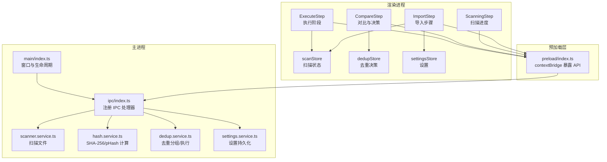
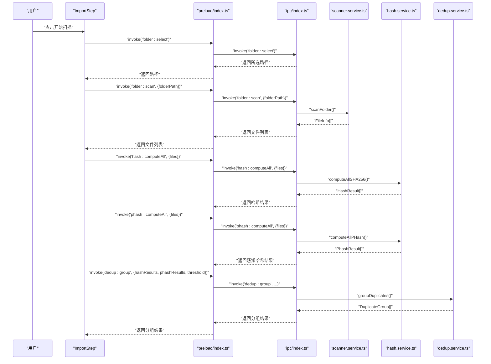
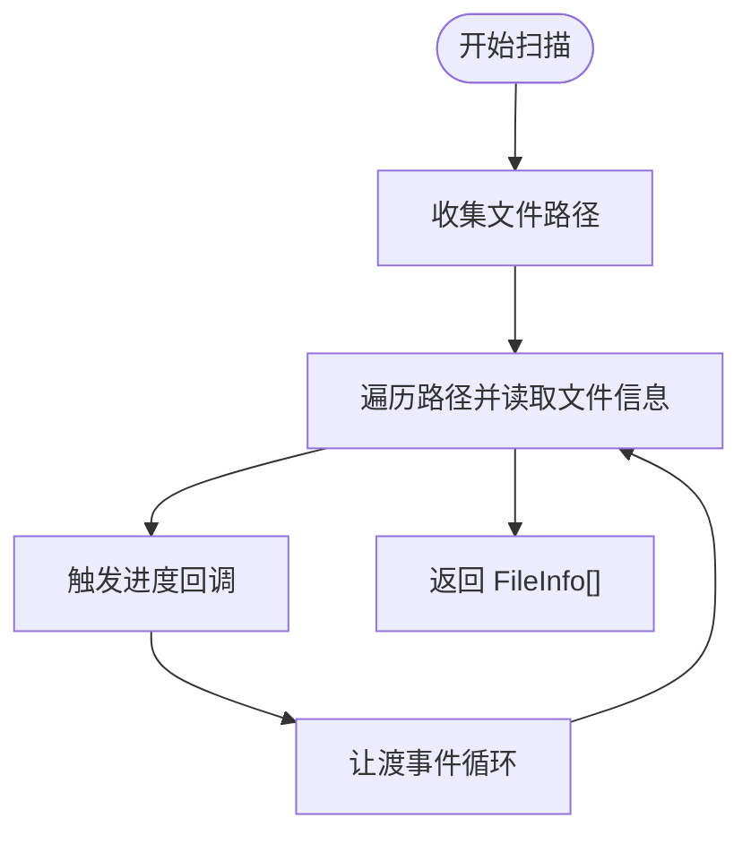
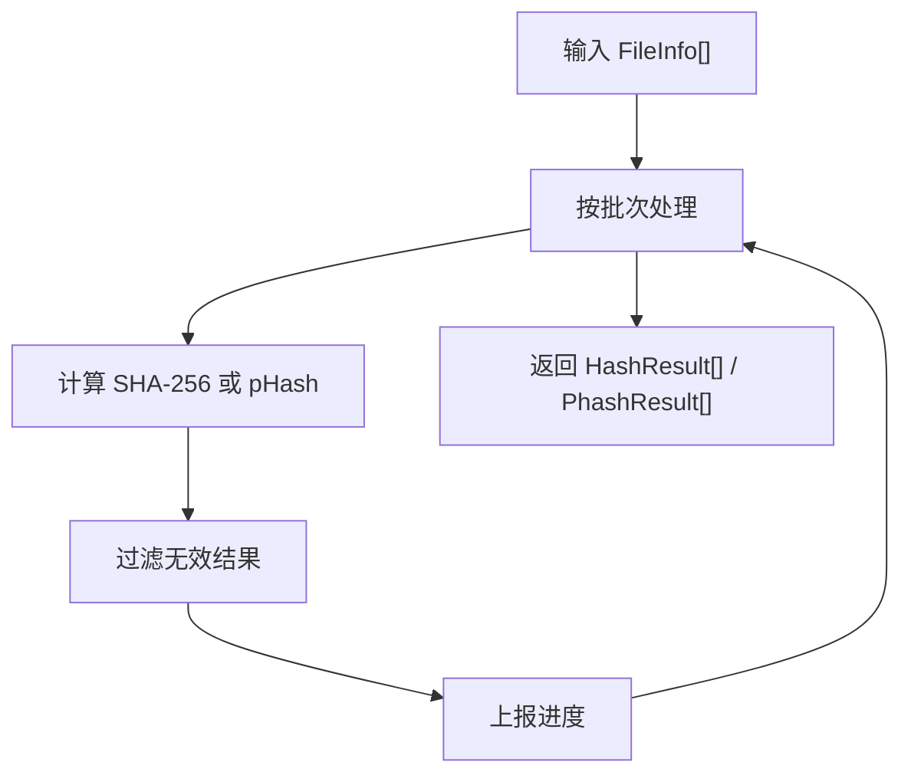
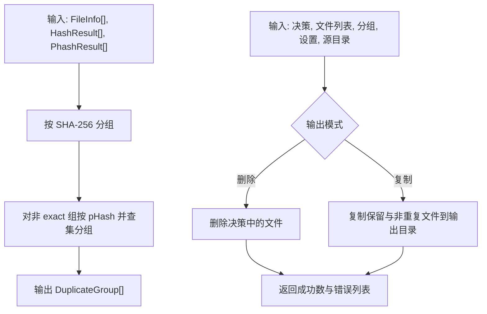
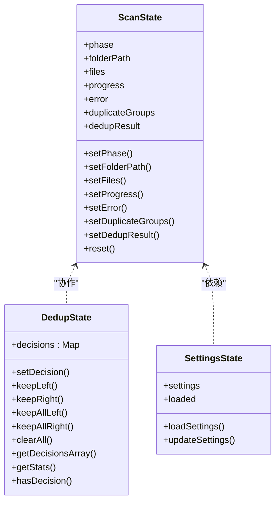
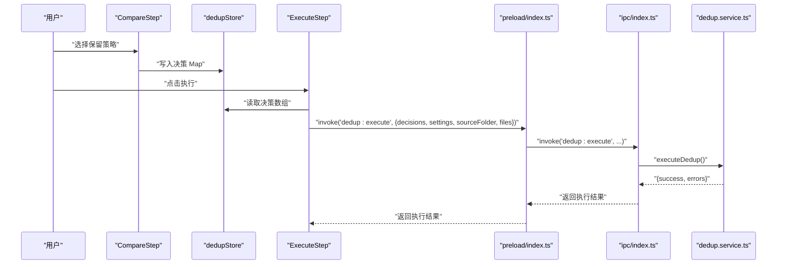
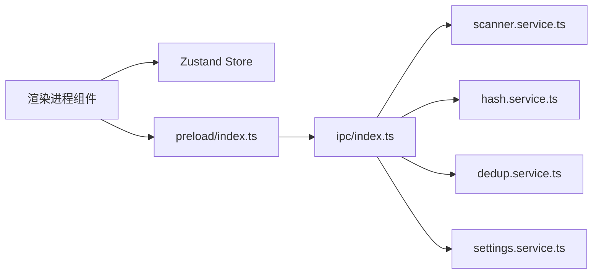

# 数据流设计

<cite>
**本文引用的文件**
- [src/main/index.ts](file://src/main/index.ts)
- [src/main/ipc/index.ts](file://src/main/ipc/index.ts)
- [src/main/services/scanner.service.ts](file://src/main/services/scanner.service.ts)
- [src/main/services/hash.service.ts](file://src/main/services/hash.service.ts)
- [src/main/services/dedup.service.ts](file://src/main/services/dedup.service.ts)
- [src/main/services/settings.service.ts](file://src/main/services/settings.service.ts)
- [src/preload/index.ts](file://src/preload/index.ts)
- [src/preload/index.d.ts](file://src/preload/index.d.ts)
- [src/renderer/src/stores/scanStore.ts](file://src/renderer/src/stores/scanStore.ts)
- [src/renderer/src/stores/dedupStore.ts](file://src/renderer/src/stores/dedupStore.ts)
- [src/renderer/src/stores/settingsStore.ts](file://src/renderer/src/stores/settingsStore.ts)
- [src/renderer/src/types/index.ts](file://src/renderer/src/types/index.ts)
- [src/renderer/src/components/ImportStep.tsx](file://src/renderer/src/components/ImportStep.tsx)
- [src/renderer/src/components/ScanningStep.tsx](file://src/renderer/src/components/ScanningStep.tsx)
- [src/renderer/src/components/CompareStep.tsx](file://src/renderer/src/components/CompareStep.tsx)
- [src/renderer/src/components/ExecuteStep.tsx](file://src/renderer/src/components/ExecuteStep.tsx)
</cite>

## 目录
1. [简介](#简介)
2. [项目结构](#项目结构)
3. [核心组件](#核心组件)
4. [架构总览](#架构总览)
5. [详细组件分析](#详细组件分析)
6. [依赖关系分析](#依赖关系分析)
7. [性能考量](#性能考量)
8. [故障排查指南](#故障排查指南)
9. [结论](#结论)
10. [附录](#附录)

## 简介
本文件系统性阐述 redophoto 应用的数据流设计与实现，覆盖从文件扫描、哈希计算、去重分组、用户决策到执行删除或复制的完整流程。文档重点说明：
- 进程间数据流动路径与传输机制（主进程服务、渲染进程状态、IPC 消息）
- Zustand 状态管理的设计与数据同步机制
- IPC 消息格式与数据序列化方式
- 异步处理与错误传播机制
- 缓存策略与性能优化方案
- 数据流监控与调试方法
- 用户操作如何驱动数据流变化

## 项目结构
应用采用 Electron 架构，分为主进程（Node 环境）与渲染进程（浏览器环境）。主进程提供文件系统访问与计算能力，渲染进程负责 UI 与用户交互，并通过 preload 暴露受控的 IPC 接口。

图表来源
- [src/main/index.ts:1-61](file://src/main/index.ts#L1-L61)
- [src/main/ipc/index.ts:1-156](file://src/main/ipc/index.ts#L1-L156)
- [src/main/services/scanner.service.ts:1-86](file://src/main/services/scanner.service.ts#L1-L86)
- [src/main/services/hash.service.ts:1-180](file://src/main/services/hash.service.ts#L1-L180)
- [src/main/services/dedup.service.ts:1-209](file://src/main/services/dedup.service.ts#L1-L209)
- [src/main/services/settings.service.ts:1-34](file://src/main/services/settings.service.ts#L1-L34)
- [src/preload/index.ts:1-123](file://src/preload/index.ts#L1-L123)
- [src/renderer/src/stores/scanStore.ts:1-52](file://src/renderer/src/stores/scanStore.ts#L1-L52)
- [src/renderer/src/stores/dedupStore.ts:1-83](file://src/renderer/src/stores/dedupStore.ts#L1-L83)
- [src/renderer/src/stores/settingsStore.ts:1-41](file://src/renderer/src/stores/settingsStore.ts#L1-L41)

章节来源
- [src/main/index.ts:1-61](file://src/main/index.ts#L1-L61)
- [src/main/ipc/index.ts:1-156](file://src/main/ipc/index.ts#L1-L156)
- [src/preload/index.ts:1-123](file://src/preload/index.ts#L1-L123)

## 核心组件
- 主进程服务
  - 扫描服务：递归遍历目录，筛选图片扩展名，生成文件元信息列表。
  - 哈希服务：批量计算 SHA-256；可选 pHash；生成缩略图。
  - 去重服务：基于 SHA-256 的精确分组与基于 pHash 的相似分组（并查集），支持删除或复制两种执行模式。
  - 设置服务：基于 electron-store 的本地持久化。
- 预加载层
  - 通过 contextBridge 暴露安全的 window.api，封装 ipcRenderer.invoke 与 ipcRenderer.on。
- 渲染进程状态
  - scanStore：应用阶段、文件列表、进度、错误、重复分组、执行结果。
  - dedupStore：按组的保留/删除决策，统计与批量操作。
  - settingsStore：应用设置加载与更新。
- UI 组件
  - ImportStep：选择文件夹、触发扫描与哈希、调用分组。
  - ScanningStep：展示扫描/哈希/pHash/分组进度。
  - CompareStep：展示重复组、用户决策、分页与确认执行。
  - ExecuteStep：监听执行进度、显示结果或错误。

章节来源
- [src/main/services/scanner.service.ts:1-86](file://src/main/services/scanner.service.ts#L1-L86)
- [src/main/services/hash.service.ts:1-180](file://src/main/services/hash.service.ts#L1-L180)
- [src/main/services/dedup.service.ts:1-209](file://src/main/services/dedup.service.ts#L1-L209)
- [src/main/services/settings.service.ts:1-34](file://src/main/services/settings.service.ts#L1-L34)
- [src/preload/index.ts:1-123](file://src/preload/index.ts#L1-L123)
- [src/renderer/src/stores/scanStore.ts:1-52](file://src/renderer/src/stores/scanStore.ts#L1-L52)
- [src/renderer/src/stores/dedupStore.ts:1-83](file://src/renderer/src/stores/dedupStore.ts#L1-L83)
- [src/renderer/src/stores/settingsStore.ts:1-41](file://src/renderer/src/stores/settingsStore.ts#L1-L41)
- [src/renderer/src/components/ImportStep.tsx:1-174](file://src/renderer/src/components/ImportStep.tsx#L1-L174)
- [src/renderer/src/components/ScanningStep.tsx:1-84](file://src/renderer/src/components/ScanningStep.tsx#L1-L84)
- [src/renderer/src/components/CompareStep.tsx:1-279](file://src/renderer/src/components/CompareStep.tsx#L1-L279)
- [src/renderer/src/components/ExecuteStep.tsx:1-161](file://src/renderer/src/components/ExecuteStep.tsx#L1-L161)

## 架构总览
下图展示从用户选择文件夹到执行去重的端到端数据流，包括主进程服务、IPC 通道与渲染进程状态的交互。

图表来源
- [src/renderer/src/components/ImportStep.tsx:1-174](file://src/renderer/src/components/ImportStep.tsx#L1-L174)
- [src/preload/index.ts:1-123](file://src/preload/index.ts#L1-L123)
- [src/main/ipc/index.ts:1-156](file://src/main/ipc/index.ts#L1-L156)
- [src/main/services/scanner.service.ts:1-86](file://src/main/services/scanner.service.ts#L1-L86)
- [src/main/services/hash.service.ts:1-180](file://src/main/services/hash.service.ts#L1-L180)
- [src/main/services/dedup.service.ts:1-209](file://src/main/services/dedup.service.ts#L1-L209)

## 详细组件分析

### 文件扫描与缓存
- 扫描逻辑
  - 支持扩展名过滤，递归遍历目录，二次遍历收集 stat 信息，生成 FileInfo 列表。
  - 进度回调以事件循环让渡避免阻塞。
- 缓存策略
  - 主进程维护一个内存缓存用于后续去重执行阶段复用文件列表，避免重复扫描。
- 错误处理
  - 对不可访问目录与 stat 失败的文件进行跳过处理。

图表来源
- [src/main/services/scanner.service.ts:28-86](file://src/main/services/scanner.service.ts#L28-L86)

章节来源
- [src/main/services/scanner.service.ts:1-86](file://src/main/services/scanner.service.ts#L1-L86)
- [src/main/ipc/index.ts:42-53](file://src/main/ipc/index.ts#L42-L53)

### 哈希计算与感知哈希
- SHA-256
  - 批量计算，批次大小控制并发与内存占用，异常时标记为 ERROR。
- pHash
  - 使用图像库进行缩放、灰度、原始像素提取与二维 DCT，提取低频块并生成二进制特征串。
  - 汉明距离用于相似度阈值判断。
- 进度与序列化
  - IPC 返回结果数组，前端以数组索引与 ID 映射关联文件。

图表来源
- [src/main/services/hash.service.ts:29-56](file://src/main/services/hash.service.ts#L29-L56)
- [src/main/services/hash.service.ts:132-159](file://src/main/services/hash.service.ts#L132-L159)
- [src/main/services/hash.service.ts:161-168](file://src/main/services/hash.service.ts#L161-L168)

章节来源
- [src/main/services/hash.service.ts:1-180](file://src/main/services/hash.service.ts#L1-L180)

### 去重分组与执行
- 分组策略
  - 精确分组：按 SHA-256 聚合，形成 exact 组。
  - 相似分组：对未在 exact 组中的文件，基于 pHash 并查集聚类，汉明距离小于阈值合并。
- 执行策略
  - 删除模式：直接删除被标记删除的文件路径集合。
  - 复制模式：在源文件夹同级创建输出目录，复制非重复文件与用户保留文件。
- 进度与错误
  - 执行阶段逐文件上报进度，捕获失败并汇总错误列表。

图表来源
- [src/main/services/dedup.service.ts:43-115](file://src/main/services/dedup.service.ts#L43-L115)
- [src/main/services/dedup.service.ts:117-209](file://src/main/services/dedup.service.ts#L117-L209)

章节来源
- [src/main/services/dedup.service.ts:1-209](file://src/main/services/dedup.service.ts#L1-L209)

### IPC 消息格式与序列化
- 消息类型
  - folder:select/folder:scan/hash:computeAll/phash:computeAll/dedup:group/dedup:execute/file:thumbnail/settings:get/settings:set
- 请求载荷
  - 以对象形式传递参数，如 { folderPath }、{ files }、{ hashResults, phashResults, phashThreshold }、{ decisions, settings, sourceFolder, files }。
- 进度事件
  - 主进程通过 webContents.send 发送 scan:progress/hash:progress/dedup:progress，渲染进程通过 onScanProgress/onHashProgress/onDedupProgress 订阅。
- 序列化
  - Electron IPC 自动序列化 JS 对象；复杂对象（如 Buffer）通过 base64 字符串或 data URL 传输（如缩略图）。

章节来源
- [src/main/ipc/index.ts:1-156](file://src/main/ipc/index.ts#L1-L156)
- [src/preload/index.ts:61-123](file://src/preload/index.ts#L61-L123)

### 状态管理与数据同步（Zustand）
- scanStore
  - 管理应用阶段、文件列表、进度、错误、重复分组、执行结果。
  - 提供重置与批量更新方法。
- dedupStore
  - 维护 Map 形式的决策，支持单组/全组保留左右两侧、清空、统计等。
  - 将 Map 决策转换为数组以便 IPC 传输。
- settingsStore
  - 加载默认设置，通过 window.api 同步到主进程持久化存储。
- 数据同步机制
  - 渲染进程通过 window.api 与主进程交互，主进程返回数据后更新对应 Zustand store。
  - 去重执行阶段，渲染进程将 dedupStore 中的决策数组传给主进程，主进程据此执行。

图表来源
- [src/renderer/src/stores/scanStore.ts:1-52](file://src/renderer/src/stores/scanStore.ts#L1-L52)
- [src/renderer/src/stores/dedupStore.ts:1-83](file://src/renderer/src/stores/dedupStore.ts#L1-L83)
- [src/renderer/src/stores/settingsStore.ts:1-41](file://src/renderer/src/stores/settingsStore.ts#L1-L41)

章节来源
- [src/renderer/src/stores/scanStore.ts:1-52](file://src/renderer/src/stores/scanStore.ts#L1-L52)
- [src/renderer/src/stores/dedupStore.ts:1-83](file://src/renderer/src/stores/dedupStore.ts#L1-L83)
- [src/renderer/src/stores/settingsStore.ts:1-41](file://src/renderer/src/stores/settingsStore.ts#L1-L41)

### 用户操作驱动的数据流
- 导入步骤
  - 选择文件夹 -> 触发扫描 -> 计算 SHA-256 -> 可选计算 pHash -> 分组 -> 切换到对比步骤。
- 对比步骤
  - 展示重复组，用户选择保留左侧/右侧或全部，生成决策映射。
- 执行步骤
  - 读取决策数组与设置 -> 调用执行接口 -> 监听进度 -> 显示结果或错误 -> 重置状态。

图表来源
- [src/renderer/src/components/CompareStep.tsx:136-279](file://src/renderer/src/components/CompareStep.tsx#L136-L279)
- [src/renderer/src/components/ExecuteStep.tsx:1-161](file://src/renderer/src/components/ExecuteStep.tsx#L1-L161)
- [src/renderer/src/stores/dedupStore.ts:1-83](file://src/renderer/src/stores/dedupStore.ts#L1-L83)
- [src/preload/index.ts:85-91](file://src/preload/index.ts#L85-L91)
- [src/main/ipc/index.ts:109-142](file://src/main/ipc/index.ts#L109-L142)
- [src/main/services/dedup.service.ts:117-209](file://src/main/services/dedup.service.ts#L117-L209)

## 依赖关系分析
- 组件耦合
  - UI 组件仅依赖对应的 store 与 window.api，不直接访问主进程服务。
  - preload 作为 IPC 的唯一入口，集中定义请求/响应与事件订阅。
  - 主进程服务模块内聚，彼此解耦，通过 IPC 协议交互。
- 外部依赖
  - 图像处理依赖 sharp；设置持久化依赖 electron-store；文件系统依赖 Node fs。
- 循环依赖
  - 未见直接循环依赖；IPC 注册在主进程入口统一执行，避免运行期循环。

图表来源
- [src/renderer/src/components/ImportStep.tsx:1-174](file://src/renderer/src/components/ImportStep.tsx#L1-L174)
- [src/preload/index.ts:1-123](file://src/preload/index.ts#L1-L123)
- [src/main/ipc/index.ts:1-156](file://src/main/ipc/index.ts#L1-L156)
- [src/main/services/scanner.service.ts:1-86](file://src/main/services/scanner.service.ts#L1-L86)
- [src/main/services/hash.service.ts:1-180](file://src/main/services/hash.service.ts#L1-L180)
- [src/main/services/dedup.service.ts:1-209](file://src/main/services/dedup.service.ts#L1-L209)
- [src/main/services/settings.service.ts:1-34](file://src/main/services/settings.service.ts#L1-L34)

章节来源
- [src/main/ipc/index.ts:1-156](file://src/main/ipc/index.ts#L1-L156)
- [src/preload/index.ts:1-123](file://src/preload/index.ts#L1-L123)

## 性能考量
- 批处理与让渡
  - 哈希计算与 pHash 计算采用固定批次大小，避免一次性大量 IO 与 CPU 压力。
  - 扫描与执行阶段在关键循环中定期 setImmediate 让渡事件循环，保证 UI 流畅。
- 内存与磁盘
  - 去重执行复制模式会创建输出目录并复制文件，建议合理设置输出目录与阈值，避免大文件频繁拷贝。
- 缓存复用
  - 主进程缓存扫描结果，减少重复扫描成本。
- 图像处理
  - pHash 基于 DCT，计算量较大；可通过降低批次大小或阈值优化体验。

章节来源
- [src/main/services/hash.service.ts:16-17](file://src/main/services/hash.service.ts#L16-L17)
- [src/main/services/hash.service.ts:139-156](file://src/main/services/hash.service.ts#L139-L156)
- [src/main/services/scanner.service.ts:78-82](file://src/main/services/scanner.service.ts#L78-L82)
- [src/main/services/dedup.service.ts:154-157](file://src/main/services/dedup.service.ts#L154-L157)
- [src/main/services/dedup.service.ts:202-205](file://src/main/services/dedup.service.ts#L202-L205)

## 故障排查指南
- 扫描阶段
  - 若未发现图片，检查扩展名过滤与目录权限；查看错误提示并回退到导入步骤。
- 哈希阶段
  - 某些文件可能因权限或损坏导致计算失败，系统会跳过并记录错误；可在 UI 中观察进度与剩余任务。
- 去重执行
  - 删除模式直接删除文件，若失败会汇总错误列表；复制模式会在目标目录创建失败时记录错误。
- 设置同步
  - 设置更新失败时，本地 store 会回退到部分更新，确保可用性。
- 进度监听
  - 若进度不更新，检查 onScanProgress/onHashProgress/onDedupProgress 是否正确注册与注销。

章节来源
- [src/renderer/src/components/ImportStep.tsx:78-82](file://src/renderer/src/components/ImportStep.tsx#L78-L82)
- [src/renderer/src/components/ExecuteStep.tsx:48-55](file://src/renderer/src/components/ExecuteStep.tsx#L48-L55)
- [src/renderer/src/stores/settingsStore.ts:29-39](file://src/renderer/src/stores/settingsStore.ts#L29-L39)
- [src/main/services/dedup.service.ts:149-153](file://src/main/services/dedup.service.ts#L149-L153)
- [src/main/services/dedup.service.ts:199](file://src/main/services/dedup.service.ts#L199)

## 结论
redophoto 的数据流以清晰的职责分离与 IPC 协议为核心：主进程专注文件系统与计算，渲染进程专注 UI 与状态管理。Zustand store 提供轻量且可预测的状态变更，结合 preload 的统一 API 暴露，使数据在进程间高效、可控地流转。通过批处理、事件让渡与缓存复用，系统在大数据量场景下仍保持良好性能与用户体验。

## 附录
- 类型定义参考
  - FileInfo、HashResult、PhashResult、DuplicateGroup、DedupDecision、DedupSettings、AppSettings、ScanProgress、DedupProgress
- 关键实现路径
  - 扫描：[src/main/services/scanner.service.ts:28-86](file://src/main/services/scanner.service.ts#L28-L86)
  - 哈希：[src/main/services/hash.service.ts:29-56](file://src/main/services/hash.service.ts#L29-L56)、[src/main/services/hash.service.ts:132-159](file://src/main/services/hash.service.ts#L132-L159)
  - 去重：[src/main/services/dedup.service.ts:43-115](file://src/main/services/dedup.service.ts#L43-L115)、[src/main/services/dedup.service.ts:117-209](file://src/main/services/dedup.service.ts#L117-L209)
  - IPC：[src/main/ipc/index.ts:1-156](file://src/main/ipc/index.ts#L1-L156)
  - 预加载：[src/preload/index.ts:61-123](file://src/preload/index.ts#L61-L123)
  - 状态：[src/renderer/src/stores/scanStore.ts:1-52](file://src/renderer/src/stores/scanStore.ts#L1-L52)、[src/renderer/src/stores/dedupStore.ts:1-83](file://src/renderer/src/stores/dedupStore.ts#L1-L83)、[src/renderer/src/stores/settingsStore.ts:1-41](file://src/renderer/src/stores/settingsStore.ts#L1-L41)
  - UI：[src/renderer/src/components/ImportStep.tsx:1-174](file://src/renderer/src/components/ImportStep.tsx#L1-L174)、[src/renderer/src/components/ScanningStep.tsx:1-84](file://src/renderer/src/components/ScanningStep.tsx#L1-L84)、[src/renderer/src/components/CompareStep.tsx:1-279](file://src/renderer/src/components/CompareStep.tsx#L1-L279)、[src/renderer/src/components/ExecuteStep.tsx:1-161](file://src/renderer/src/components/ExecuteStep.tsx#L1-L161)