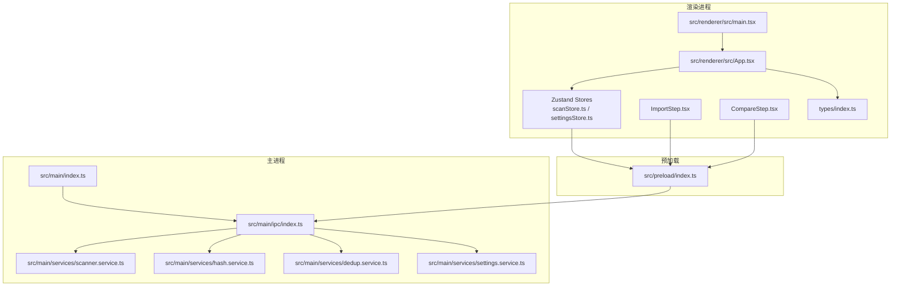
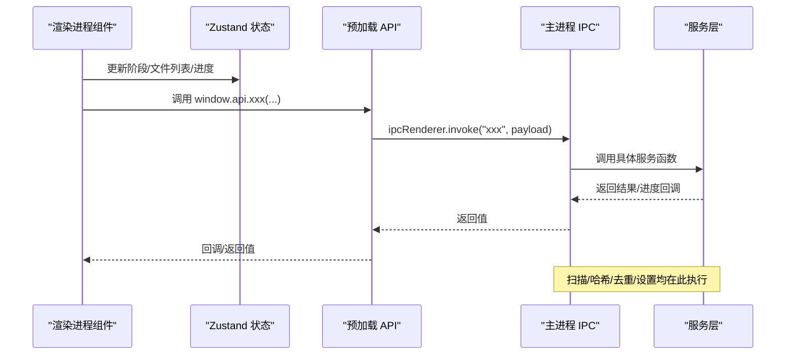
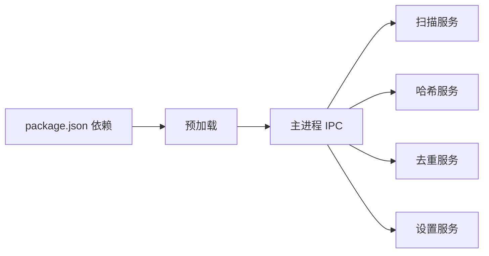

# 架构设计

<cite>
**本文引用的文件**
- [src/main/index.ts](file://src/main/index.ts)
- [src/preload/index.ts](file://src/preload/index.ts)
- [src/main/ipc/index.ts](file://src/main/ipc/index.ts)
- [src/main/services/scanner.service.ts](file://src/main/services/scanner.service.ts)
- [src/main/services/hash.service.ts](file://src/main/services/hash.service.ts)
- [src/main/services/dedup.service.ts](file://src/main/services/dedup.service.ts)
- [src/main/services/settings.service.ts](file://src/main/services/settings.service.ts)
- [src/renderer/src/main.tsx](file://src/renderer/src/main.tsx)
- [src/renderer/src/App.tsx](file://src/renderer/src/App.tsx)
- [src/renderer/src/stores/scanStore.ts](file://src/renderer/src/stores/scanStore.ts)
- [src/renderer/src/stores/settingsStore.ts](file://src/renderer/src/stores/settingsStore.ts)
- [src/renderer/src/components/ImportStep.tsx](file://src/renderer/src/components/ImportStep.tsx)
- [src/renderer/src/components/CompareStep.tsx](file://src/renderer/src/components/CompareStep.tsx)
- [src/renderer/src/types/index.ts](file://src/renderer/src/types/index.ts)
- [package.json](file://package.json)
</cite>

## 目录
1. [引言](#引言)
2. [项目结构](#项目结构)
3. [核心组件](#核心组件)
4. [架构总览](#架构总览)
5. [详细组件分析](#详细组件分析)
6. [依赖分析](#依赖分析)
7. [性能考虑](#性能考虑)
8. [故障排查指南](#故障排查指南)
9. [结论](#结论)
10. [附录](#附录)

## 引言
本文件为 Redophoto 应用的架构设计文档，面向开发者与产品/运维人员，系统阐述 Electron 应用的整体架构、主进程与渲染进程的职责划分、预加载脚本的安全边界、IPC 通信机制与数据流、MVVM 架构在前端的落地（Model-View-ViewModel 的分离）、服务层设计理念与组件交互关系，并给出系统架构图与组件关系图。同时讨论技术决策的权衡（性能、安全、平滑体验），并总结扩展性与可维护性设计原则。

## 项目结构
Redophoto 采用典型的 Electron + React + TypeScript 结构，按职责划分为：
- 主进程：负责窗口生命周期、菜单/标题栏、对话框、系统级操作与 IPC 注册
- 预加载脚本：通过 contextBridge 暴露受控 API 到渲染进程，隔离 Node.js 能力
- 渲染进程：React 应用，使用 Zustand 管理状态，组件驱动 MVVM 视图层
- 服务层：扫描、哈希、去重、设置等业务逻辑，运行在主进程以访问文件系统与外部库

图表来源
- [src/main/index.ts:1-61](file://src/main/index.ts#L1-L61)
- [src/main/ipc/index.ts:1-156](file://src/main/ipc/index.ts#L1-L156)
- [src/preload/index.ts:1-123](file://src/preload/index.ts#L1-L123)
- [src/renderer/src/main.tsx:1-11](file://src/renderer/src/main.tsx#L1-L11)
- [src/renderer/src/App.tsx:1-35](file://src/renderer/src/App.tsx#L1-L35)
- [src/renderer/src/stores/scanStore.ts:1-52](file://src/renderer/src/stores/scanStore.ts#L1-L52)
- [src/renderer/src/stores/settingsStore.ts:1-41](file://src/renderer/src/stores/settingsStore.ts#L1-L41)
- [src/renderer/src/components/ImportStep.tsx:1-174](file://src/renderer/src/components/ImportStep.tsx#L1-L174)
- [src/renderer/src/components/CompareStep.tsx:1-279](file://src/renderer/src/components/CompareStep.tsx#L1-L279)
- [src/renderer/src/types/index.ts:1-58](file://src/renderer/src/types/index.ts#L1-L58)

章节来源
- [src/main/index.ts:1-61](file://src/main/index.ts#L1-L61)
- [package.json:1-51](file://package.json#L1-L51)

## 核心组件
- 主进程入口与窗口管理：创建 BrowserWindow、配置 webPreferences（上下文隔离、禁用 Node 集成、启用预加载）、注册 IPC 处理器、处理窗口事件与外部链接打开
- 预加载脚本：定义跨进程通信接口类型，暴露受限 API（窗口控制、文件夹选择、扫描、哈希、去重、缩略图、设置读取/写入）与进度监听回调
- IPC 注册中心：集中注册所有主进程侧的 ipcMain.handle 与事件派发，连接 UI 与服务层
- 服务层：
  - 扫描服务：遍历目录收集图片文件，生成 FileInfo 列表并上报进度
  - 哈希服务：批量计算 SHA-256；可选 pHash；生成缩略图
  - 去重服务：基于 SHA-256 精确分组，可选 pHash 近似分组；执行删除或复制策略
  - 设置服务：基于 electron-store 的本地持久化
- 渲染进程：
  - React 应用入口与根组件
  - Zustand 状态：扫描流程状态、去重决策、设置
  - 组件：导入步骤（选择文件夹、扫描、哈希/pHash、分组）、对比步骤（决策 UI、分页、确认执行）

章节来源
- [src/main/index.ts:1-61](file://src/main/index.ts#L1-L61)
- [src/preload/index.ts:1-123](file://src/preload/index.ts#L1-L123)
- [src/main/ipc/index.ts:1-156](file://src/main/ipc/index.ts#L1-L156)
- [src/main/services/scanner.service.ts:1-86](file://src/main/services/scanner.service.ts#L1-L86)
- [src/main/services/hash.service.ts:1-180](file://src/main/services/hash.service.ts#L1-L180)
- [src/main/services/dedup.service.ts:1-209](file://src/main/services/dedup.service.ts#L1-L209)
- [src/main/services/settings.service.ts:1-34](file://src/main/services/settings.service.ts#L1-L34)
- [src/renderer/src/main.tsx:1-11](file://src/renderer/src/main.tsx#L1-L11)
- [src/renderer/src/App.tsx:1-35](file://src/renderer/src/App.tsx#L1-L35)
- [src/renderer/src/stores/scanStore.ts:1-52](file://src/renderer/src/stores/scanStore.ts#L1-L52)
- [src/renderer/src/stores/settingsStore.ts:1-41](file://src/renderer/src/stores/settingsStore.ts#L1-L41)
- [src/renderer/src/components/ImportStep.tsx:1-174](file://src/renderer/src/components/ImportStep.tsx#L1-L174)
- [src/renderer/src/components/CompareStep.tsx:1-279](file://src/renderer/src/components/CompareStep.tsx#L1-L279)
- [src/renderer/src/types/index.ts:1-58](file://src/renderer/src/types/index.ts#L1-L58)

## 架构总览
下图展示从渲染进程到主进程再到服务层的数据流与职责边界，体现 MVVM 分离与 IPC 通信：

图表来源
- [src/renderer/src/components/ImportStep.tsx:22-82](file://src/renderer/src/components/ImportStep.tsx#L22-L82)
- [src/renderer/src/components/CompareStep.tsx:147-155](file://src/renderer/src/components/CompareStep.tsx#L147-L155)
- [src/preload/index.ts:61-122](file://src/preload/index.ts#L61-L122)
- [src/main/ipc/index.ts:22-155](file://src/main/ipc/index.ts#L22-L155)
- [src/main/services/scanner.service.ts:28-85](file://src/main/services/scanner.service.ts#L28-L85)
- [src/main/services/hash.service.ts:29-159](file://src/main/services/hash.service.ts#L29-L159)
- [src/main/services/dedup.service.ts:43-130](file://src/main/services/dedup.service.ts#L43-L130)

## 详细组件分析

### 主进程与窗口管理
- 创建 BrowserWindow 并启用标题栏覆盖样式与最小化显示策略
- 启用上下文隔离、禁用 Node 集成、指定预加载脚本路径
- 注册窗口外链打开处理与关闭行为
- 启动时创建窗口并注册 IPC 处理器

章节来源
- [src/main/index.ts:8-46](file://src/main/index.ts#L8-L46)

### 预加载脚本与安全边界
- 定义 FileInfo、HashResult、PhashResult、DuplicateGroup、DedupDecision、DedupSettings、AppSettings、ScanProgress、DedupProgress 等跨进程数据结构
- 暴露受限 API：窗口控制、文件夹选择、扫描、哈希、pHash、分组、执行、缩略图、设置读取/写入
- 提供进度监听 onScanProgress/onHashProgress/onDedupProgress，并返回清理函数
- 使用 contextBridge.exposeInMainWorld 将 API 暴露到 window.api

章节来源
- [src/preload/index.ts:3-122](file://src/preload/index.ts#L3-L122)

### IPC 注册中心
- 注册窗口控制、文件夹选择、扫描、哈希、pHash、分组、执行、缩略图、设置读取/写入
- 将进度事件通过 mainWindow.webContents.send 推送回渲染进程
- 缓存扫描结果用于后续去重执行

章节来源
- [src/main/ipc/index.ts:22-155](file://src/main/ipc/index.ts#L22-L155)

### 扫描服务
- 支持扩展名白名单，递归遍历目录
- 两阶段扫描：路径收集与 stat 信息填充
- 进度回调，每处理一定数量文件让出事件循环，保证 UI 流畅
- 生成稳定 ID 与 FileInfo 列表

章节来源
- [src/main/services/scanner.service.ts:28-85](file://src/main/services/scanner.service.ts#L28-L85)

### 哈希与缩略图服务
- SHA-256 批量计算，分批并发，错误时标记为 ERROR
- pHash 实现：缩放到 32x32 灰度，DCT 变换，提取低频 8x8 区块，生成 64 位二进制字符串
- Hamming 距离用于相似度判断
- 缩略图生成：基于 sharp，限制尺寸与质量

章节来源
- [src/main/services/hash.service.ts:19-179](file://src/main/services/hash.service.ts#L19-L179)

### 去重服务
- 精确分组：按 SHA-256 结果聚合
- 近似分组：对非精确组内文件基于 pHash 进行 Union-Find 联通，阈值内合并
- 执行策略：
  - 删除模式：直接删除被选中删除的文件
  - 复制模式：在源目录同级创建输出目录，复制不重复且保留的文件
- 进度回调，分批处理，避免阻塞

章节来源
- [src/main/services/dedup.service.ts:43-208](file://src/main/services/dedup.service.ts#L43-L208)

### 设置服务
- 默认设置与持久化存储，支持部分更新
- 与渲染进程设置 Store 协作，实现读取与更新

章节来源
- [src/main/services/settings.service.ts:24-33](file://src/main/services/settings.service.ts#L24-L33)

### 渲染进程与 MVVM
- Model：Zustand 状态（扫描状态、文件列表、重复组、去重结果、设置）
- View：React 组件（ImportStep、CompareStep 等）
- ViewModel：组件内部逻辑与状态映射，结合 window.api 与 Store 完成视图驱动

章节来源
- [src/renderer/src/App.tsx:11-34](file://src/renderer/src/App.tsx#L11-L34)
- [src/renderer/src/stores/scanStore.ts:25-51](file://src/renderer/src/stores/scanStore.ts#L25-L51)
- [src/renderer/src/stores/settingsStore.ts:11-40](file://src/renderer/src/stores/settingsStore.ts#L11-L40)
- [src/renderer/src/components/ImportStep.tsx:5-82](file://src/renderer/src/components/ImportStep.tsx#L5-L82)
- [src/renderer/src/components/CompareStep.tsx:136-278](file://src/renderer/src/components/CompareStep.tsx#L136-L278)

### 数据模型与类型
- 统一定义 FileInfo、HashResult、PhashResult、DuplicateGroup、DedupDecision、DedupSettings、AppSettings、ScanProgress、DedupProgress 等跨层数据结构

章节来源
- [src/renderer/src/types/index.ts:1-58](file://src/renderer/src/types/index.ts#L1-L58)

## 依赖分析
- 主进程依赖：
  - Electron 核心（BrowserWindow、dialog、ipcMain、shell）
  - 服务层模块（scanner、hash、dedup、settings）
- 预加载依赖：
  - Electron ipcRenderer/contextBridge
  - 类型定义与渲染进程共享
- 渲染进程依赖：
  - React、ReactDOM、Zustand
  - 自定义组件与 Store
  - Sharp（通过服务层间接使用）

图表来源
- [package.json:13-34](file://package.json#L13-L34)
- [src/preload/index.ts:1](file://src/preload/index.ts#L1)
- [src/main/ipc/index.ts:1-18](file://src/main/ipc/index.ts#L1-L18)

章节来源
- [package.json:13-34](file://package.json#L13-L34)

## 性能考虑
- 事件循环让渡：扫描与哈希/去重均采用分批处理并在批次间 setImmediate 让出，避免长时间阻塞 UI
- 并发控制：哈希/去重使用 Promise.all 批量执行，提升吞吐
- I/O 优化：pHash 基于 sharp 进行内存高效处理；缩略图限制尺寸与质量
- 进度反馈：多阶段进度上报，提升用户体验与可观测性
- 存储：设置使用 electron-store，避免频繁磁盘 IO

章节来源
- [src/main/services/scanner.service.ts:78-82](file://src/main/services/scanner.service.ts#L78-L82)
- [src/main/services/hash.service.ts:36-53](file://src/main/services/hash.service.ts#L36-L53)
- [src/main/services/dedup.service.ts:134-157](file://src/main/services/dedup.service.ts#L134-L157)

## 故障排查指南
- 扫描无结果：检查文件夹是否包含受支持扩展名；查看错误提示与进度回调
- 哈希/去重异常：关注 ERROR 标记的哈希结果；确认 sharp 依赖安装与权限
- 去重执行失败：删除模式直接报错；复制模式检查目标目录权限与磁盘空间
- 设置读取失败：electron-store 初始化异常或权限问题
- 进度未更新：确认 onXProgress 回调是否正确注册与注销

章节来源
- [src/renderer/src/components/ImportStep.tsx:33-37](file://src/renderer/src/components/ImportStep.tsx#L33-L37)
- [src/main/services/hash.service.ts:40-46](file://src/main/services/hash.service.ts#L40-L46)
- [src/main/services/dedup.service.ts:148-153](file://src/main/services/dedup.service.ts#L148-L153)
- [src/renderer/src/stores/settingsStore.ts:20-39](file://src/renderer/src/stores/settingsStore.ts#L20-L39)

## 结论
Redophoto 采用清晰的三层架构（主进程/预加载/渲染进程）与 MVVM 分离，通过 IPC 实现强安全边界下的可靠数据流。服务层将复杂业务封装在主进程，渲染进程专注 UI 与交互，具备良好的可扩展性与可维护性。性能方面通过分批与让渡策略保障流畅体验；安全方面通过上下文隔离与受控 API 降低风险。

## 附录
- 技术栈要点：Electron、React、TypeScript、Zustand、sharp、electron-store
- 架构原则：职责分离、安全边界、可观测性、可扩展性、可维护性