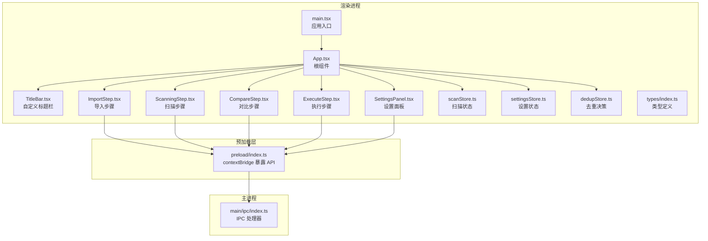
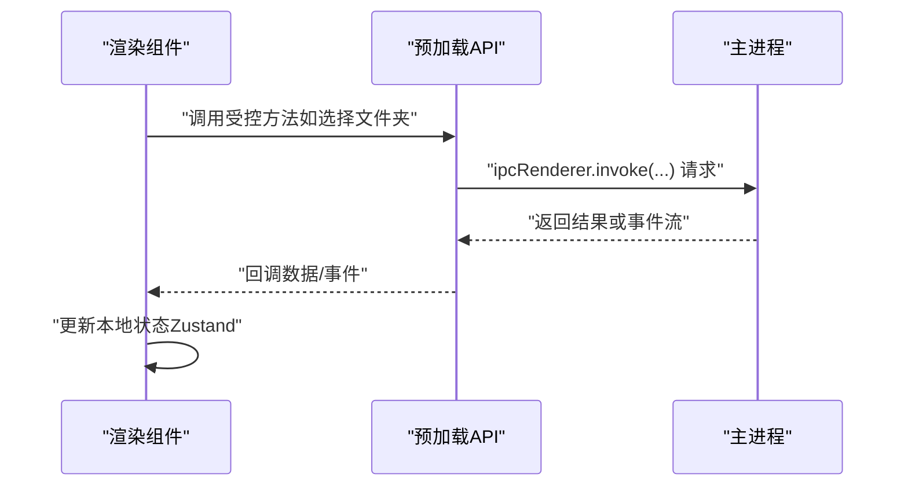
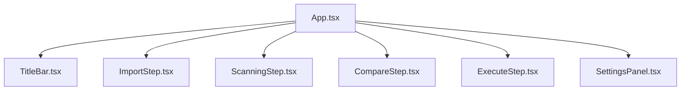
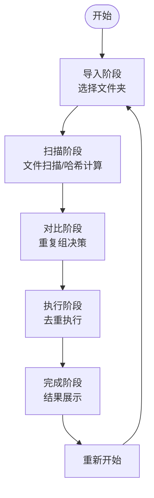
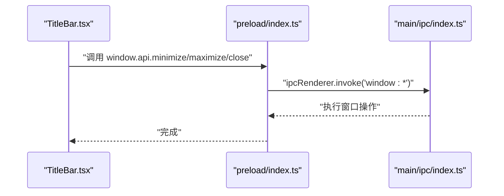
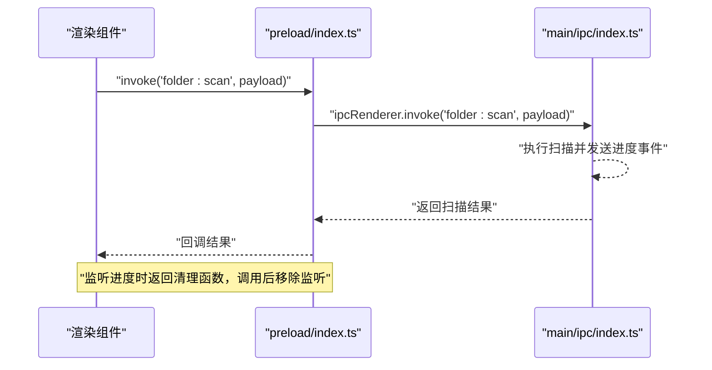
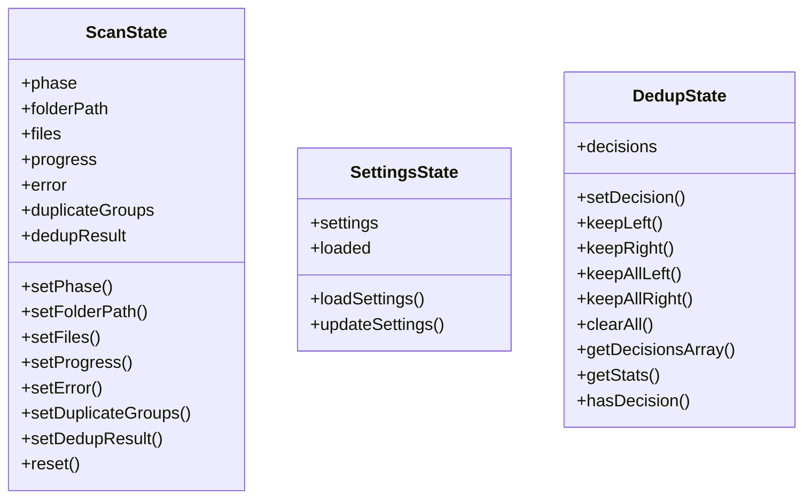
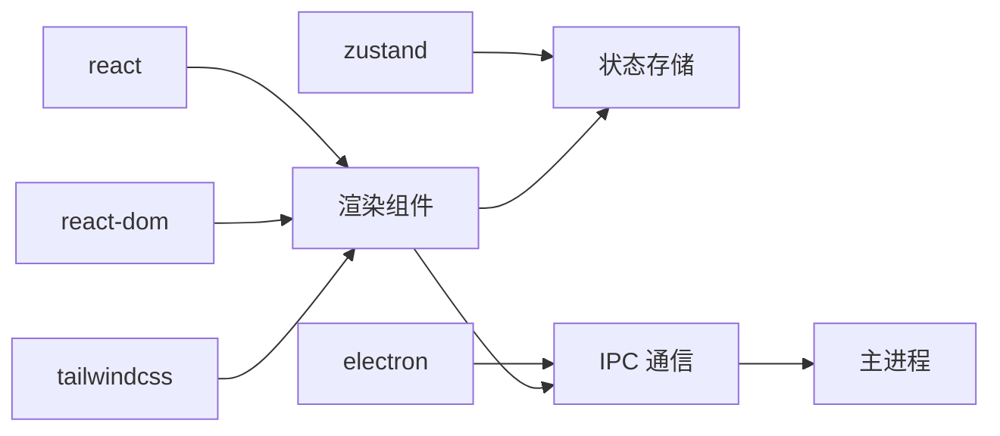

# 渲染进程架构

<cite>
**本文档引用的文件**
- [src/renderer/src/main.tsx](file://src/renderer/src/main.tsx)
- [src/renderer/src/App.tsx](file://src/renderer/src/App.tsx)
- [src/renderer/src/components/TitleBar.tsx](file://src/renderer/src/components/TitleBar.tsx)
- [src/renderer/src/components/ImportStep.tsx](file://src/renderer/src/components/ImportStep.tsx)
- [src/renderer/src/components/ScanningStep.tsx](file://src/renderer/src/components/ScanningStep.tsx)
- [src/renderer/src/components/CompareStep.tsx](file://src/renderer/src/components/CompareStep.tsx)
- [src/renderer/src/components/ExecuteStep.tsx](file://src/renderer/src/components/ExecuteStep.tsx)
- [src/renderer/src/components/SettingsPanel.tsx](file://src/renderer/src/components/SettingsPanel.tsx)
- [src/renderer/src/stores/scanStore.ts](file://src/renderer/src/stores/scanStore.ts)
- [src/renderer/src/stores/settingsStore.ts](file://src/renderer/src/stores/settingsStore.ts)
- [src/renderer/src/stores/dedupStore.ts](file://src/renderer/src/stores/dedupStore.ts)
- [src/renderer/src/types/index.ts](file://src/renderer/src/types/index.ts)
- [src/preload/index.ts](file://src/preload/index.ts)
- [src/main/ipc/index.ts](file://src/main/ipc/index.ts)
- [package.json](file://package.json)
</cite>

## 目录
1. [简介](#简介)
2. [项目结构](#项目结构)
3. [核心组件](#核心组件)
4. [架构总览](#架构总览)
5. [详细组件分析](#详细组件分析)
6. [依赖关系分析](#依赖关系分析)
7. [性能考虑](#性能考虑)
8. [故障排除指南](#故障排除指南)
9. [结论](#结论)

## 简介
本文件系统性梳理 ReDoPhoto 应用的渲染进程架构，覆盖 React 应用初始化流程、组件树结构、路由与页面组织、自定义标题栏与窗口控制、渲染进程与主进程的安全通信机制、状态管理模式（Zustand）、以及性能优化策略与最佳实践。目标是帮助开发者快速理解并高效扩展该 Electron + React 应用。

## 项目结构
渲染进程采用典型的 Electron + Vite + React + TailwindCSS 架构，主要目录与职责如下：
- src/renderer/src/main.tsx：React 应用入口，挂载根组件 App
- src/renderer/src/App.tsx：应用根组件，负责页面阶段切换与设置面板弹窗
- src/renderer/src/components/*：按功能拆分的页面组件与通用组件
- src/renderer/src/stores/*：Zustand 状态管理模块
- src/renderer/src/types/index.ts：跨层共享的数据类型定义
- src/preload/index.ts：通过 contextBridge 暴露受控 API 至渲染进程
- src/main/ipc/index.ts：主进程 IPC 处理器注册与业务逻辑实现
- package.json：依赖与构建脚本配置

**图表来源**
- [src/renderer/src/main.tsx:1-11](file://src/renderer/src/main.tsx#L1-L11)
- [src/renderer/src/App.tsx:1-35](file://src/renderer/src/App.tsx#L1-L35)
- [src/renderer/src/components/TitleBar.tsx:1-33](file://src/renderer/src/components/TitleBar.tsx#L1-L33)
- [src/renderer/src/components/ImportStep.tsx:1-174](file://src/renderer/src/components/ImportStep.tsx#L1-L174)
- [src/renderer/src/components/ScanningStep.tsx:1-84](file://src/renderer/src/components/ScanningStep.tsx#L1-L84)
- [src/renderer/src/components/CompareStep.tsx:1-279](file://src/renderer/src/components/CompareStep.tsx#L1-L279)
- [src/renderer/src/components/ExecuteStep.tsx:1-161](file://src/renderer/src/components/ExecuteStep.tsx#L1-L161)
- [src/renderer/src/components/SettingsPanel.tsx:1-149](file://src/renderer/src/components/SettingsPanel.tsx#L1-L149)
- [src/renderer/src/stores/scanStore.ts:1-52](file://src/renderer/src/stores/scanStore.ts#L1-L52)
- [src/renderer/src/stores/settingsStore.ts:1-41](file://src/renderer/src/stores/settingsStore.ts#L1-L41)
- [src/renderer/src/stores/dedupStore.ts:1-83](file://src/renderer/src/stores/dedupStore.ts#L1-L83)
- [src/renderer/src/types/index.ts:1-58](file://src/renderer/src/types/index.ts#L1-L58)
- [src/preload/index.ts:1-123](file://src/preload/index.ts#L1-L123)
- [src/main/ipc/index.ts:1-156](file://src/main/ipc/index.ts#L1-L156)

**章节来源**
- [src/renderer/src/main.tsx:1-11](file://src/renderer/src/main.tsx#L1-L11)
- [src/renderer/src/App.tsx:1-35](file://src/renderer/src/App.tsx#L1-L35)
- [src/renderer/src/types/index.ts:1-58](file://src/renderer/src/types/index.ts#L1-L58)
- [package.json:1-51](file://package.json#L1-L51)

## 核心组件
- React 初始化与根组件
  - 入口文件在应用启动时创建根节点并渲染根组件 App
  - App 负责根据扫描阶段渲染不同页面，并管理设置面板的显示/隐藏
- 页面组件
  - ImportStep：选择文件夹、触发扫描与哈希计算、生成重复分组
  - ScanningStep：展示扫描/哈希/感知哈希进度
  - CompareStep：展示重复组、支持逐组决策、分页浏览
  - ExecuteStep：执行去重、展示执行进度与结果
- 自定义标题栏
  - 提供拖拽区域与设置按钮，设置按钮通过回调打开设置面板
- 设置面板
  - 支持检测模式、相似度阈值、输出方式与输出文件夹后缀等配置

**章节来源**
- [src/renderer/src/main.tsx:1-11](file://src/renderer/src/main.tsx#L1-L11)
- [src/renderer/src/App.tsx:1-35](file://src/renderer/src/App.tsx#L1-L35)
- [src/renderer/src/components/TitleBar.tsx:1-33](file://src/renderer/src/components/TitleBar.tsx#L1-L33)
- [src/renderer/src/components/ImportStep.tsx:1-174](file://src/renderer/src/components/ImportStep.tsx#L1-L174)
- [src/renderer/src/components/ScanningStep.tsx:1-84](file://src/renderer/src/components/ScanningStep.tsx#L1-L84)
- [src/renderer/src/components/CompareStep.tsx:1-279](file://src/renderer/src/components/CompareStep.tsx#L1-L279)
- [src/renderer/src/components/ExecuteStep.tsx:1-161](file://src/renderer/src/components/ExecuteStep.tsx#L1-L161)
- [src/renderer/src/components/SettingsPanel.tsx:1-149](file://src/renderer/src/components/SettingsPanel.tsx#L1-L149)

## 架构总览
渲染进程通过预加载脚本暴露受限 API，渲染组件通过这些 API 与主进程通信，完成文件夹选择、扫描、哈希计算、去重分组、执行等任务。状态管理采用 Zustand，分别维护扫描状态、设置状态与去重决策。

**图表来源**
- [src/preload/index.ts:61-120](file://src/preload/index.ts#L61-L120)
- [src/main/ipc/index.ts:22-156](file://src/main/ipc/index.ts#L22-L156)

## 详细组件分析

### React 应用初始化与组件树
- 初始化流程
  - main.tsx 创建根节点并渲染 App
  - App 在首次挂载时加载设置，随后根据扫描阶段渲染对应页面
- 组件树结构
  - 根容器 App 包含标题栏、主内容区与可选设置面板
  - 主内容区根据 phase 决定渲染 ImportStep、ScanningStep、CompareStep 或 ExecuteStep
  - 设置面板以模态框形式出现，不参与常规路由

**图表来源**
- [src/renderer/src/App.tsx:11-34](file://src/renderer/src/App.tsx#L11-L34)
- [src/renderer/src/components/TitleBar.tsx:5-32](file://src/renderer/src/components/TitleBar.tsx#L5-L32)
- [src/renderer/src/components/ImportStep.tsx:5-82](file://src/renderer/src/components/ImportStep.tsx#L5-L82)
- [src/renderer/src/components/ScanningStep.tsx:3-83](file://src/renderer/src/components/ScanningStep.tsx#L3-L83)
- [src/renderer/src/components/CompareStep.tsx:136-278](file://src/renderer/src/components/CompareStep.tsx#L136-L278)
- [src/renderer/src/components/ExecuteStep.tsx:7-160](file://src/renderer/src/components/ExecuteStep.tsx#L7-L160)

**章节来源**
- [src/renderer/src/main.tsx:6-10](file://src/renderer/src/main.tsx#L6-L10)
- [src/renderer/src/App.tsx:16-18](file://src/renderer/src/App.tsx#L16-L18)
- [src/renderer/src/App.tsx:20-32](file://src/renderer/src/App.tsx#L20-L32)

### 路由与页面组织
- 页面组织方式
  - 采用“阶段驱动”的页面组织：import → scanning → comparing → executing → done
  - 通过 scanStore 的 phase 字段控制当前页面渲染
- 导航与交互
  - ImportStep 中选择文件夹后进入 scanning 阶段
  - 扫描完成后进入 comparing 阶段，允许用户对重复组进行决策
  - 所有决策完成后进入 executing 阶段执行去重
  - 执行完成后进入 done 阶段，展示结果

**图表来源**
- [src/renderer/src/stores/scanStore.ts:4-23](file://src/renderer/src/stores/scanStore.ts#L4-L23)
- [src/renderer/src/components/ImportStep.tsx:22-82](file://src/renderer/src/components/ImportStep.tsx#L22-L82)
- [src/renderer/src/components/ScanningStep.tsx:6-25](file://src/renderer/src/components/ScanningStep.tsx#L6-L25)
- [src/renderer/src/components/CompareStep.tsx:147-155](file://src/renderer/src/components/CompareStep.tsx#L147-L155)
- [src/renderer/src/components/ExecuteStep.tsx:29-55](file://src/renderer/src/components/ExecuteStep.tsx#L29-L55)

**章节来源**
- [src/renderer/src/stores/scanStore.ts:25-51](file://src/renderer/src/stores/scanStore.ts#L25-L51)
- [src/renderer/src/components/ImportStep.tsx:22-82](file://src/renderer/src/components/ImportStep.tsx#L22-L82)

### 自定义标题栏与窗口控制
- 标题栏实现
  - 使用拖拽区域类名实现窗口拖拽
  - 设置按钮通过回调打开设置面板
- 窗口控制
  - 预加载层暴露窗口最小化、最大化/还原、关闭接口
  - 主进程通过 ipcMain.handle 注册对应处理器

**图表来源**
- [src/renderer/src/components/TitleBar.tsx:17-29](file://src/renderer/src/components/TitleBar.tsx#L17-L29)
- [src/preload/index.ts:62-66](file://src/preload/index.ts#L62-L66)
- [src/main/ipc/index.ts:23-29](file://src/main/ipc/index.ts#L23-L29)

**章节来源**
- [src/renderer/src/components/TitleBar.tsx:5-32](file://src/renderer/src/components/TitleBar.tsx#L5-L32)
- [src/preload/index.ts:61-120](file://src/preload/index.ts#L61-L120)
- [src/main/ipc/index.ts:22-29](file://src/main/ipc/index.ts#L22-L29)

### 渲染进程与主进程的安全通信
- 预加载层职责
  - 通过 contextBridge.exposeInMainWorld 暴露受控 API 对象至 window.api
  - 将所有 IPC 调用封装为方法，统一错误处理与清理
- 主进程处理
  - 使用 ipcMain.handle 注册处理器，执行文件系统与图像处理等耗时任务
  - 通过 webContents.send 推送进度事件，预加载层监听并转发给渲染进程
- 进度监听与清理
  - 预加载层提供 onScanProgress/onHashProgress/onDedupProgress 等监听器
  - 返回的清理函数用于移除监听，避免内存泄漏

**图表来源**
- [src/preload/index.ts:67-70](file://src/preload/index.ts#L67-L70)
- [src/main/ipc/index.ts:42-53](file://src/main/ipc/index.ts#L42-L53)
- [src/preload/index.ts:103-119](file://src/preload/index.ts#L103-L119)

**章节来源**
- [src/preload/index.ts:1-123](file://src/preload/index.ts#L1-L123)
- [src/main/ipc/index.ts:1-156](file://src/main/ipc/index.ts#L1-L156)

### 状态管理设计与 Zustand 使用
- scanStore：维护扫描阶段、文件列表、进度、错误、重复分组与执行结果
- settingsStore：维护应用设置、加载状态与设置更新逻辑（优先同步到主进程，失败时回退到本地）
- dedupStore：维护去重决策（Map 结构），提供批量决策与统计能力
- 设计要点
  - 将副作用（IPC 调用）集中在 store 的 action 中，保持组件纯净
  - 使用 get/set 形式的 action，便于局部状态更新
  - 通过 getState().xxx 访问全局状态，用于无订阅场景（如 ImportStep 的错误提示）

**图表来源**
- [src/renderer/src/stores/scanStore.ts:6-23](file://src/renderer/src/stores/scanStore.ts#L6-L23)
- [src/renderer/src/stores/settingsStore.ts:4-9](file://src/renderer/src/stores/settingsStore.ts#L4-L9)
- [src/renderer/src/stores/dedupStore.ts:4-16](file://src/renderer/src/stores/dedupStore.ts#L4-L16)

**章节来源**
- [src/renderer/src/stores/scanStore.ts:25-51](file://src/renderer/src/stores/scanStore.ts#L25-L51)
- [src/renderer/src/stores/settingsStore.ts:11-40](file://src/renderer/src/stores/settingsStore.ts#L11-L40)
- [src/renderer/src/stores/dedupStore.ts:18-82](file://src/renderer/src/stores/dedupStore.ts#L18-L82)

### 数据模型与类型定义
- 文件信息、哈希结果、感知哈希、重复分组、去重决策、应用设置、扫描/去重进度等类型集中定义于 types/index.ts
- 作用
  - 保证渲染层与预加载层、主进程间数据契约一致
  - 为 TypeScript 提供强类型支持，减少运行时错误

**章节来源**
- [src/renderer/src/types/index.ts:1-58](file://src/renderer/src/types/index.ts#L1-L58)

## 依赖关系分析
- 组件依赖
  - App 依赖各页面组件与状态存储
  - 各页面组件依赖预加载 API 与状态存储
- 外部依赖
  - React、ReactDOM：UI 渲染
  - Zustand：轻量状态管理
  - TailwindCSS：样式框架
  - Electron：平台能力与 IPC

**图表来源**
- [package.json:13-34](file://package.json#L13-L34)

**章节来源**
- [package.json:13-34](file://package.json#L13-L34)

## 性能考虑
- 图像预览与缩略图
  - CompareStep 中按需加载缩略图，使用取消标记避免竞态
  - 建议：对频繁切换的列表使用虚拟滚动（例如 react-window）降低 DOM 节点数量
- 进度与事件
  - 使用清理函数移除 IPC 监听，防止内存泄漏
  - 合理节流/防抖进度更新，避免频繁重渲染
- 状态粒度
  - 将高频更新与低频更新拆分到不同 store，减少无关订阅
  - 使用 selector 精准订阅，避免全量状态变更导致的重渲染
- 资源释放
  - 在组件卸载或阶段切换时，及时清理定时器、监听器与大对象引用
- 构建与打包
  - 使用 Vite 的按需加载与代码分割，结合 Tailwind 的 purge 优化产物体积

## 故障排除指南
- 设置加载失败
  - settingsStore 在加载失败时会标记 loaded 并回退到默认设置，确保 UI 不阻塞
- 扫描/哈希异常
  - ImportStep 捕获异常并设置错误消息，引导用户回到导入阶段
- 执行失败
  - ExecuteStep 捕获异常并回退到对比阶段，同时显示错误信息
- 进度监听未清理
  - 若发现内存增长或事件堆积，检查是否正确调用清理函数

**章节来源**
- [src/renderer/src/stores/settingsStore.ts:20-39](file://src/renderer/src/stores/settingsStore.ts#L20-L39)
- [src/renderer/src/components/ImportStep.tsx:78-82](file://src/renderer/src/components/ImportStep.tsx#L78-L82)
- [src/renderer/src/components/ExecuteStep.tsx:48-55](file://src/renderer/src/components/ExecuteStep.tsx#L48-L55)

## 结论
ReDoPhoto 的渲染进程采用清晰的阶段化页面组织与受控的 IPC 通信，结合 Zustand 实现轻量而高效的前端状态管理。通过自定义标题栏与受控 API，既满足了跨平台窗口控制需求，又保障了安全性。建议在后续迭代中引入虚拟滚动、更细粒度的状态拆分与完善的错误边界，持续提升用户体验与稳定性。