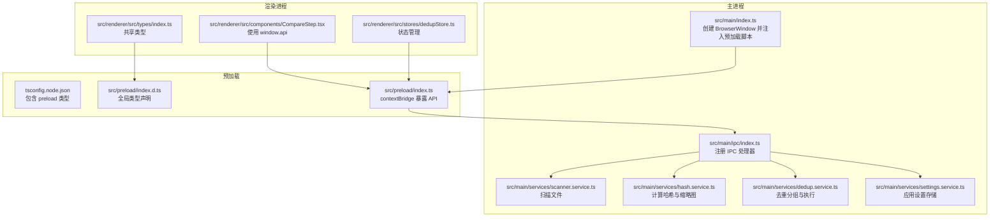
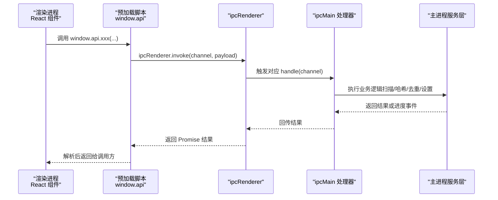
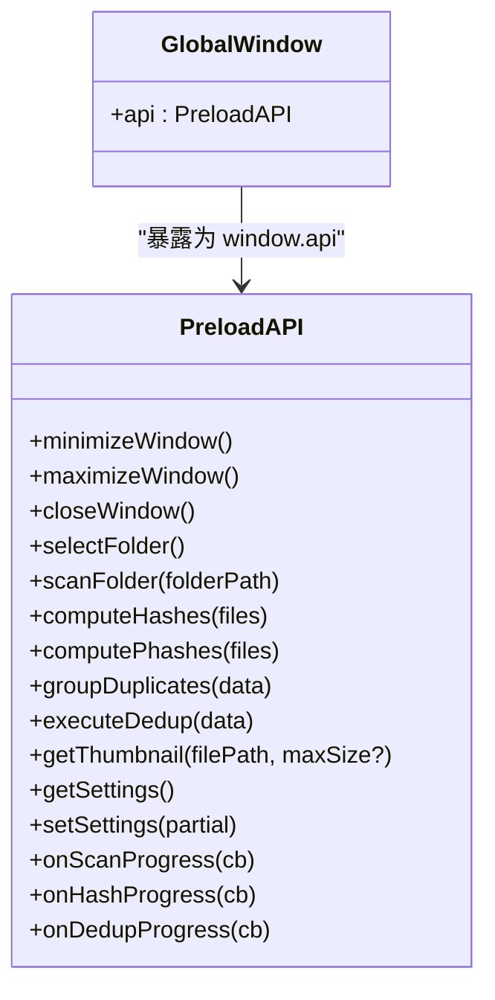
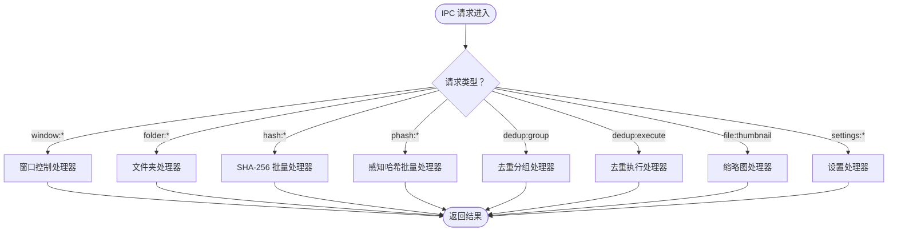
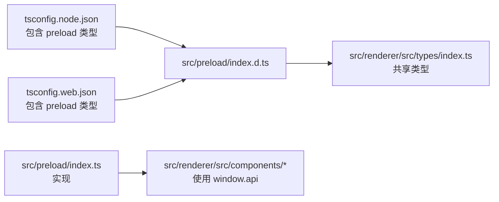
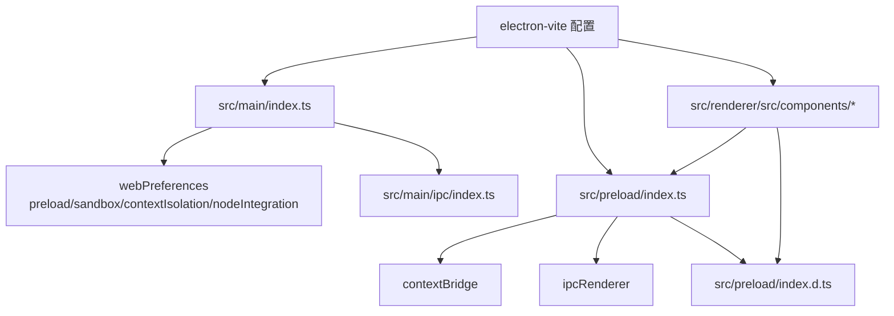

# 预加载脚本架构

<cite>
**本文引用的文件**
- [src/preload/index.ts](file://src/preload/index.ts)
- [src/preload/index.d.ts](file://src/preload/index.d.ts)
- [src/main/index.ts](file://src/main/index.ts)
- [src/main/ipc/index.ts](file://src/main/ipc/index.ts)
- [src/main/services/scanner.service.ts](file://src/main/services/scanner.service.ts)
- [src/main/services/hash.service.ts](file://src/main/services/hash.service.ts)
- [src/main/services/dedup.service.ts](file://src/main/services/dedup.service.ts)
- [src/main/services/settings.service.ts](file://src/main/services/settings.service.ts)
- [src/renderer/src/components/CompareStep.tsx](file://src/renderer/src/components/CompareStep.tsx)
- [src/renderer/src/stores/dedupStore.ts](file://src/renderer/src/stores/dedupStore.ts)
- [src/renderer/src/types/index.ts](file://src/renderer/src/types/index.ts)
- [electron.vite.config.ts](file://electron.vite.config.ts)
- [package.json](file://package.json)
- [tsconfig.json](file://tsconfig.json)
- [tsconfig.node.json](file://tsconfig.node.json)
- [tsconfig.web.json](file://tsconfig.web.json)
</cite>

## 目录
1. [引言](#引言)
2. [项目结构](#项目结构)
3. [核心组件](#核心组件)
4. [架构总览](#架构总览)
5. [详细组件分析](#详细组件分析)
6. [依赖关系分析](#依赖关系分析)
7. [性能考量](#性能考量)
8. [故障排除指南](#故障排除指南)
9. [结论](#结论)
10. [附录](#附录)

## 引言
本文件系统性阐述 Redophoto 应用的预加载脚本（Preload Script）架构与实现，重点解释其在 Electron 安全模型中的角色、通过 contextBridge 暴露 API 的机制、以及如何为渲染进程提供受控的 Node.js 能力访问。文档还涵盖类型定义与 TypeScript 集成、预加载脚本的执行时机与生命周期、安全最佳实践与常见陷阱、以及调试与故障排除方法。

## 项目结构
Redophoto 采用多进程架构：主进程负责窗口管理与系统级能力，预加载脚本在隔离上下文中桥接安全 API，渲染进程通过 React UI 与状态管理消费这些 API。构建工具链使用 electron-vite，分别针对 main、preload、renderer 进行编译与别名解析。



**图表来源**
- [src/main/index.ts:1-61](file://src/main/index.ts#L1-L61)
- [src/preload/index.ts:1-123](file://src/preload/index.ts#L1-L123)
- [src/preload/index.d.ts:1-52](file://src/preload/index.d.ts#L1-L52)
- [src/main/ipc/index.ts:1-156](file://src/main/ipc/index.ts#L1-L156)
- [src/main/services/scanner.service.ts:1-86](file://src/main/services/scanner.service.ts#L1-L86)
- [src/main/services/hash.service.ts:1-180](file://src/main/services/hash.service.ts#L1-L180)
- [src/main/services/dedup.service.ts:1-209](file://src/main/services/dedup.service.ts#L1-L209)
- [src/main/services/settings.service.ts:1-34](file://src/main/services/settings.service.ts#L1-L34)
- [src/renderer/src/components/CompareStep.tsx:1-279](file://src/renderer/src/components/CompareStep.tsx#L1-L279)
- [src/renderer/src/stores/dedupStore.ts:1-83](file://src/renderer/src/stores/dedupStore.ts#L1-L83)
- [src/renderer/src/types/index.ts:1-58](file://src/renderer/src/types/index.ts#L1-L58)

**章节来源**
- [src/main/index.ts:1-61](file://src/main/index.ts#L1-L61)
- [electron.vite.config.ts:1-26](file://electron.vite.config.ts#L1-L26)
- [package.json:1-51](file://package.json#L1-L51)

## 核心组件
- 预加载脚本入口与 API 暴露：在预加载脚本中，通过 contextBridge 将受限 API 暴露到渲染进程的 window.api，所有调用均经由 ipcRenderer.invoke 与主进程通信。
- 主进程 IPC 注册：主进程集中注册所有 IPC 处理器，负责窗口控制、文件夹选择、扫描、哈希计算、缩略图生成、去重分组与执行、设置读写等。
- 渲染进程使用：渲染组件通过 window.api 访问功能；状态管理模块保存用户决策与统计信息；类型定义确保跨层类型一致性。

**章节来源**
- [src/preload/index.ts:61-123](file://src/preload/index.ts#L61-L123)
- [src/main/ipc/index.ts:22-156](file://src/main/ipc/index.ts#L22-L156)
- [src/renderer/src/components/CompareStep.tsx:136-279](file://src/renderer/src/components/CompareStep.tsx#L136-L279)

## 架构总览
下图展示从渲染进程到主进程的关键调用链，体现预加载脚本作为“安全网关”的作用。



**图表来源**
- [src/preload/index.ts:61-123](file://src/preload/index.ts#L61-L123)
- [src/main/ipc/index.ts:22-156](file://src/main/ipc/index.ts#L22-L156)

## 详细组件分析

### 预加载脚本与 contextBridge
- API 设计：预加载脚本导出一个对象，封装窗口控制、文件夹操作、哈希计算、去重、缩略图、设置读取与进度监听等方法。每个方法内部通过 ipcRenderer.invoke 与主进程通信。
- 类型声明：全局类型声明文件定义了 window.api 的完整接口，确保渲染进程在 TS 中获得强类型提示。
- 安全边界：预加载脚本不直接暴露 Node.js 或 Electron 原生 API，仅暴露白名单方法；渲染进程无法绕过预加载脚本直接访问系统资源。



**图表来源**
- [src/preload/index.ts:61-123](file://src/preload/index.ts#L61-L123)
- [src/preload/index.d.ts:13-51](file://src/preload/index.d.ts#L13-L51)

**章节来源**
- [src/preload/index.ts:1-123](file://src/preload/index.ts#L1-L123)
- [src/preload/index.d.ts:1-52](file://src/preload/index.d.ts#L1-L52)

### 主进程 IPC 与服务层
- 窗口控制：最小化、最大化/还原、关闭。
- 文件夹操作：打开对话框选择目录、扫描目录内支持的图片文件。
- 哈希与缩略图：批量计算 SHA-256、批量计算感知哈希、生成缩略图。
- 去重：按 SHA-256 分组、可选按感知哈希阈值进行相似分组；执行删除或复制模式。
- 设置：持久化读写应用设置。
- 进度通知：通过 webContents.send 向渲染进程推送扫描、哈希、去重阶段的进度。



**图表来源**
- [src/main/ipc/index.ts:22-156](file://src/main/ipc/index.ts#L22-L156)

**章节来源**
- [src/main/ipc/index.ts:1-156](file://src/main/ipc/index.ts#L1-L156)

### 渲染进程使用示例
- 缩略图加载：组件在挂载时调用 window.api.getThumbnail 获取 base64 图片数据，用于预览。
- 去重决策：通过状态管理收集每组的保留/删除文件 ID，最终提交给去重执行流程。

```mermaid
sequenceDiagram
participant Comp as "CompareStep 组件"
participant API as "window.api"
participant IPC as "ipcRenderer/ipcMain"
participant Svc as "hash.service/thumbnail"
Comp->>API : getThumbnail(filePath, 500)
API->>IPC : invoke("file : thumbnail", {filePath, maxSize})
IPC->>Svc : generateThumbnail(filePath, 500)
Svc-->>IPC : 返回 data : image/jpeg;base64,...
IPC-->>API : Promise 结果
API-->>Comp : 设置 thumbnail 状态
```

**图表来源**
- [src/renderer/src/components/CompareStep.tsx:16-24](file://src/renderer/src/components/CompareStep.tsx#L16-L24)
- [src/main/ipc/index.ts:144-150](file://src/main/ipc/index.ts#L144-L150)
- [src/main/services/hash.service.ts:170-179](file://src/main/services/hash.service.ts#L170-L179)

**章节来源**
- [src/renderer/src/components/CompareStep.tsx:136-279](file://src/renderer/src/components/CompareStep.tsx#L136-L279)
- [src/renderer/src/stores/dedupStore.ts:1-83](file://src/renderer/src/stores/dedupStore.ts#L1-L83)

### 类型系统与 TypeScript 集成
- 预加载类型：全局类型声明文件定义 window.api 的完整签名，确保渲染进程 TS 检查。
- 共享类型：渲染侧与预加载侧共享数据结构（如 FileInfo、HashResult、DuplicateGroup 等），避免重复定义。
- 编译配置：tsconfig.node.json 包含 preload 目录，tsconfig.web.json 包含 preload 类型声明文件，保证类型可用。



**图表来源**
- [tsconfig.node.json:14-20](file://tsconfig.node.json#L14-L20)
- [tsconfig.web.json:15-21](file://tsconfig.web.json#L15-L21)
- [src/preload/index.d.ts:1-52](file://src/preload/index.d.ts#L1-L52)
- [src/renderer/src/types/index.ts:1-58](file://src/renderer/src/types/index.ts#L1-L58)

**章节来源**
- [tsconfig.json:1-8](file://tsconfig.json#L1-L8)
- [tsconfig.node.json:1-21](file://tsconfig.node.json#L1-L21)
- [tsconfig.web.json:1-22](file://tsconfig.web.json#L1-L22)
- [src/preload/index.d.ts:1-52](file://src/preload/index.d.ts#L1-L52)
- [src/renderer/src/types/index.ts:1-58](file://src/renderer/src/types/index.ts#L1-L58)

## 依赖关系分析
- 预加载脚本依赖 Electron 的 contextBridge 与 ipcRenderer，向外暴露受控 API。
- 主进程依赖 electron-vite 别名与模块路径，统一 @main 与 @renderer 前缀。
- 渲染进程依赖预加载脚本提供的 window.api，同时共享类型来自 renderer/types 与 preload 的类型声明。



**图表来源**
- [src/main/index.ts:22-28](file://src/main/index.ts#L22-L28)
- [electron.vite.config.ts:5-25](file://electron.vite.config.ts#L5-L25)

**章节来源**
- [src/main/index.ts:1-61](file://src/main/index.ts#L1-L61)
- [electron.vite.config.ts:1-26](file://electron.vite.config.ts#L1-L26)
- [package.json:13-34](file://package.json#L13-L34)

## 性能考量
- 批处理与并发：哈希与感知哈希计算采用分批处理与 Promise.all 并发，减少等待时间。
- 事件循环让渡：在大量文件处理时，定期让渡事件循环以避免阻塞 UI。
- 进度上报：主进程在各阶段定时发送进度事件，渲染端可即时更新 UI。
- 缩略图生成：使用图像库进行尺寸压缩与编码，降低传输体积。

**章节来源**
- [src/main/services/hash.service.ts:29-56](file://src/main/services/hash.service.ts#L29-L56)
- [src/main/services/hash.service.ts:132-159](file://src/main/services/hash.service.ts#L132-L159)
- [src/main/ipc/index.ts:42-53](file://src/main/ipc/index.ts#L42-L53)
- [src/main/ipc/index.ts:55-83](file://src/main/ipc/index.ts#L55-L83)
- [src/main/ipc/index.ts:132-141](file://src/main/ipc/index.ts#L132-L141)

## 故障排除指南
- 预加载脚本未生效
  - 检查主进程 webPreferences 是否正确设置 preload 路径与 contextIsolation 开启。
  - 确认 electron-vite 配置中 preload 插件启用。
- 渲染进程无法访问 window.api
  - 确认预加载脚本已调用 exposeInMainWorld。
  - 检查 tsconfig.web.json 是否包含 preload 类型声明。
- IPC 调用无响应
  - 确认主进程已注册对应 handle。
  - 检查通道名称与参数格式是否一致。
- 进度事件未触发
  - 确认主进程在处理函数中通过 webContents.send 推送事件。
  - 检查渲染端 onXxxProgress 的订阅与注销逻辑。
- 权限与沙箱问题
  - 确保 sandbox 与 contextIsolation 正确配置，避免 nodeIntegration 导致的安全风险。

**章节来源**
- [src/main/index.ts:22-28](file://src/main/index.ts#L22-L28)
- [electron.vite.config.ts:14-16](file://electron.vite.config.ts#L14-L16)
- [src/preload/index.ts:122-123](file://src/preload/index.ts#L122-L123)
- [src/main/ipc/index.ts:22-156](file://src/main/ipc/index.ts#L22-L156)

## 结论
Redophoto 的预加载脚本通过 contextBridge 在 Electron 安全模型下为渲染进程提供了受控的系统能力访问。该架构以明确的 API 边界、严格的类型约束与清晰的 IPC 流程，实现了功能完整性与安全性之间的平衡。配合合理的批处理策略与进度反馈，渲染端能够流畅地完成照片扫描、去重与执行等复杂任务。

## 附录

### 预加载脚本执行时机与生命周期
- 创建窗口时注入：主进程在构造 BrowserWindow 时指定 preload 脚本路径。
- 上下文隔离：启用 contextIsolation，确保渲染进程无法直接访问 Node/Electron API。
- 生命周期：预加载脚本随窗口生命周期加载与销毁；渲染进程通过 window.api 使用能力。

**章节来源**
- [src/main/index.ts:8-46](file://src/main/index.ts#L8-L46)
- [src/main/index.ts:22-28](file://src/main/index.ts#L22-L28)

### 安全最佳实践与常见陷阱
- 最小权限原则：仅暴露必要 API，避免直接暴露原生模块。
- 输入校验：在主进程对 IPC 参数进行严格校验与边界检查。
- 进度与错误处理：为主进程异步任务提供超时与错误回调，防止 UI 卡死。
- 类型一致性：保持预加载与渲染侧类型同步，避免运行期类型不匹配。
- 避免 nodeIntegration：始终关闭 nodeIntegration，依赖 IPC 与 contextBridge。

**章节来源**
- [src/main/index.ts:24-26](file://src/main/index.ts#L24-L26)
- [src/main/ipc/index.ts:32-39](file://src/main/ipc/index.ts#L32-L39)
- [src/main/services/scanner.service.ts:28-85](file://src/main/services/scanner.service.ts#L28-L85)