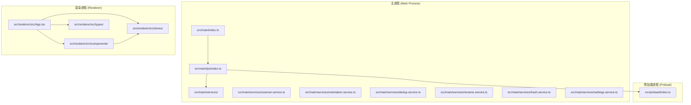
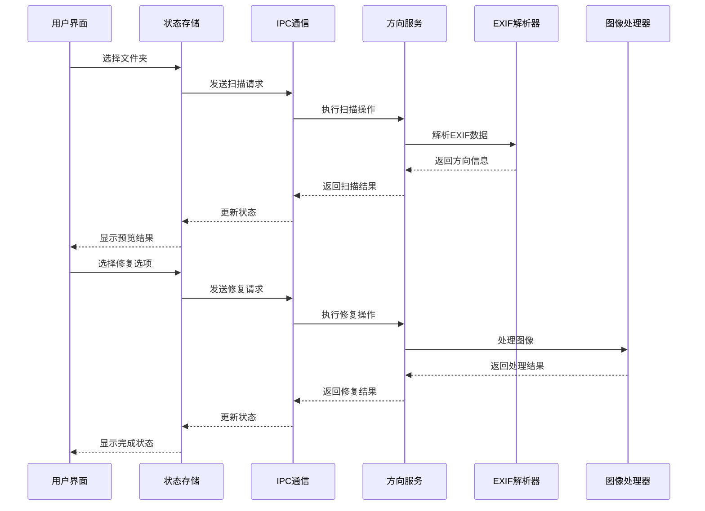
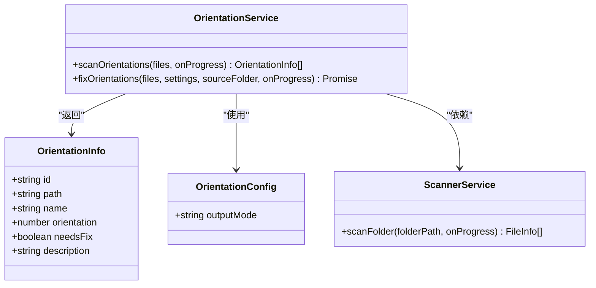
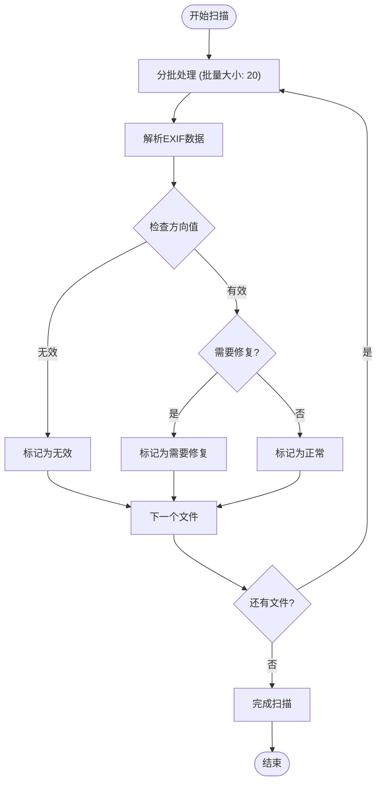
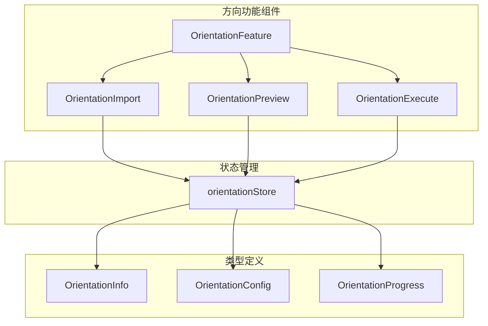
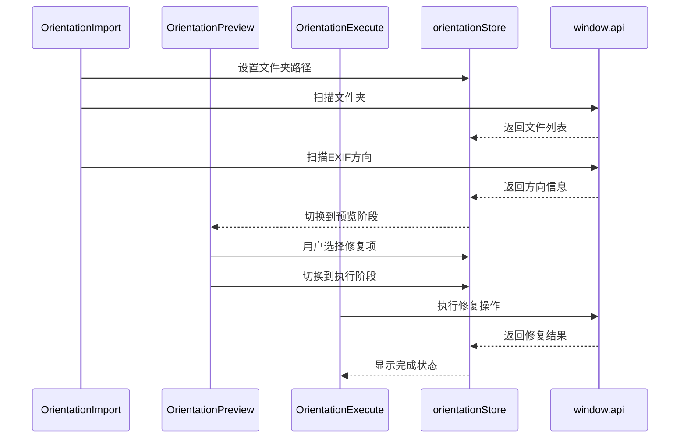
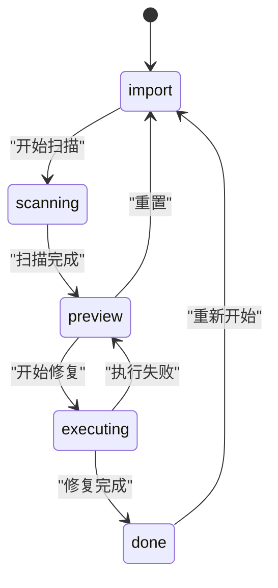

# EXIF方向校正

<cite>
**本文档引用的文件**
- [orientation.service.ts](file://src/main/services/orientation.service.ts)
- [OrientationFeature.tsx](file://src/renderer/src/components/orientation/OrientationFeature.tsx)
- [OrientationExecute.tsx](file://src/renderer/src/components/orientation/OrientationExecute.tsx)
- [orientationStore.ts](file://src/renderer/src/stores/orientationStore.ts)
- [index.ts](file://src/main/ipc/index.ts)
- [OrientationImport.tsx](file://src/renderer/src/components/orientation/OrientationImport.tsx)
- [OrientationPreview.tsx](file://src/renderer/src/components/orientation/OrientationPreview.tsx)
- [scanner.service.ts](file://src/main/services/scanner.service.ts)
- [index.ts](file://src/renderer/src/types/index.ts)
- [App.tsx](file://src/renderer/src/App.tsx)
- [index.ts](file://src/main/index.ts)
- [package.json](file://package.json)
</cite>

## 目录
1. [简介](#简介)
2. [项目结构](#项目结构)
3. [核心组件](#核心组件)
4. [架构概览](#架构概览)
5. [详细组件分析](#详细组件分析)
6. [依赖关系分析](#依赖关系分析)
7. [性能考虑](#性能考虑)
8. [故障排除指南](#故障排除指南)
9. [结论](#结论)

## 简介

RedoPhoto 是一个功能强大的照片管理桌面应用程序，专门用于照片的去重、智能重命名和EXIF方向校正。该项目采用现代技术栈构建，包括 Electron、React 和 TypeScript，为用户提供了一个直观且高效的照片管理解决方案。

本项目的核心功能之一是EXIF方向校正，它能够自动检测和修复照片中的方向问题，确保所有照片都以正确的方向显示。该功能支持多种输出模式，包括复制到新文件夹或直接在原位置修复，满足不同用户的需求。

## 项目结构

项目采用模块化的架构设计，主要分为三个层次：



**图表来源**
- [index.ts:1-62](file://src/main/index.ts#L1-L62)
- [index.ts:1-309](file://src/main/ipc/index.ts#L1-L309)

**章节来源**
- [index.ts:1-62](file://src/main/index.ts#L1-L62)
- [App.tsx:1-42](file://src/renderer/src/App.tsx#L1-L42)

## 核心组件

### EXIF方向服务

EXIF方向服务是整个应用的核心功能模块，负责扫描和修复照片的方向问题。该服务使用exifr库解析EXIF数据，并通过sharp库进行图像处理。

### 存储状态管理

使用Zustand状态管理库来管理应用的状态，包括当前阶段、文件列表、方向信息和用户选择等。

### IPC通信层

通过Electron的IPC机制实现主进程和渲染进程之间的通信，提供安全的API接口供前端调用。

**章节来源**
- [orientation.service.ts:1-153](file://src/main/services/orientation.service.ts#L1-L153)
- [orientationStore.ts:1-70](file://src/renderer/src/stores/orientationStore.ts#L1-L70)
- [index.ts:1-309](file://src/main/ipc/index.ts#L1-L309)

## 架构概览

系统采用客户端-服务器架构，结合了桌面应用的优势和Web技术的灵活性：



**图表来源**
- [OrientationFeature.tsx:1-33](file://src/renderer/src/components/orientation/OrientationFeature.tsx#L1-L33)
- [OrientationExecute.tsx:1-102](file://src/renderer/src/components/orientation/OrientationExecute.tsx#L1-L102)
- [index.ts:270-308](file://src/main/ipc/index.ts#L270-L308)

## 详细组件分析

### EXIF方向扫描服务

方向扫描服务负责检测照片的EXIF方向信息并确定是否需要修复：



**图表来源**
- [orientation.service.ts:7-18](file://src/main/services/orientation.service.ts#L7-L18)
- [scanner.service.ts:8-15](file://src/main/services/scanner.service.ts#L8-L15)

#### 扫描流程

扫描过程采用分批处理策略，避免大量文件同时处理导致的内存问题：



**图表来源**
- [orientation.service.ts:33-77](file://src/main/services/orientation.service.ts#L33-L77)

**章节来源**
- [orientation.service.ts:33-77](file://src/main/services/orientation.service.ts#L33-L77)

### 界面组件架构

应用采用模块化组件设计，每个功能模块都有独立的组件结构：



**图表来源**
- [OrientationFeature.tsx:1-33](file://src/renderer/src/components/orientation/OrientationFeature.tsx#L1-L33)
- [orientationStore.ts:1-70](file://src/renderer/src/stores/orientationStore.ts#L1-L70)
- [index.ts:108-123](file://src/renderer/src/types/index.ts#L108-L123)

#### 组件交互流程



**图表来源**
- [OrientationImport.tsx:23-44](file://src/renderer/src/components/orientation/OrientationImport.tsx#L23-L44)
- [OrientationPreview.tsx:82-93](file://src/renderer/src/components/orientation/OrientationPreview.tsx#L82-L93)
- [OrientationExecute.tsx:16-41](file://src/renderer/src/components/orientation/OrientationExecute.tsx#L16-L41)

**章节来源**
- [OrientationFeature.tsx:1-33](file://src/renderer/src/components/orientation/OrientationFeature.tsx#L1-L33)
- [OrientationImport.tsx:1-100](file://src/renderer/src/components/orientation/OrientationImport.tsx#L1-L100)
- [OrientationPreview.tsx:1-97](file://src/renderer/src/components/orientation/OrientationPreview.tsx#L1-L97)
- [OrientationExecute.tsx:1-102](file://src/renderer/src/components/orientation/OrientationExecute.tsx#L1-L102)

### 存储状态管理

使用Zustand实现轻量级状态管理，包含完整的CRUD操作：



**图表来源**
- [orientationStore.ts](file://src/renderer/src/stores/orientationStore.ts#L4)

**章节来源**
- [orientationStore.ts:1-70](file://src/renderer/src/stores/orientationStore.ts#L1-L70)

## 依赖关系分析

项目使用现代化的技术栈，主要依赖关系如下：

```mermaid
graph TB
subgraph "应用依赖"
A[exifr] --> B[EXIF解析]
C[sharp] --> D[图像处理]
E[zustand] --> F[状态管理]
G[electron-store] --> H[设置持久化]
end
subgraph "开发依赖"
I[electron-vite] --> J[构建工具]
K[react] --> L[UI框架]
M[tailwindcss] --> N[样式框架]
end
subgraph "Electron生态"
O[electron] --> P[桌面应用框架]
Q[@electron-toolkit] --> R[工具包]
end
```

**图表来源**
- [package.json:14-36](file://package.json#L14-L36)

### 核心依赖说明

- **exifr**: 专门用于解析EXIF元数据的JavaScript库，支持多种格式的EXIF信息提取
- **sharp**: 高性能的图像处理库，支持多种格式的图像转换和编辑
- **zustand**: 轻量级状态管理库，相比Redux更简单易用
- **electron**: 提供桌面应用开发的完整框架

**章节来源**
- [package.json:1-50](file://package.json#L1-L50)

## 性能考虑

### 批处理优化

系统采用分批处理策略来优化性能：

1. **EXIF扫描**: 每批处理20个文件，避免内存峰值
2. **图像修复**: 每批处理完成后让出控制权给事件循环
3. **文件扫描**: 使用两阶段扫描（路径收集+文件统计）减少I/O操作

### 内存管理

- 使用Set数据结构存储选中的文件ID，提高查找效率
- 及时清理临时文件和错误状态
- 合理的Promise链式调用避免内存泄漏

### 并发处理

- EXIF解析使用Promise.all并行处理
- 文件系统操作使用异步方法避免阻塞主线程

## 故障排除指南

### 常见问题及解决方案

#### EXIF数据读取失败

**症状**: 扫描结果显示"无法读取EXIF数据"

**可能原因**:
- 文件损坏或格式不支持
- EXIF数据缺失
- 权限问题

**解决方法**:
- 尝试使用其他图像查看器打开文件
- 检查文件权限
- 确认文件格式支持

#### 图像修复失败

**症状**: 修复过程中出现错误提示

**可能原因**:
- 磁盘空间不足
- 文件被其他程序占用
- 图像格式不受支持

**解决方法**:
- 清理磁盘空间
- 关闭占用文件的程序
- 尝试不同的输出模式

#### 性能问题

**症状**: 扫描或修复过程缓慢

**解决方法**:
- 减少同时处理的文件数量
- 关闭其他占用CPU的应用程序
- 检查磁盘性能

**章节来源**
- [orientation.service.ts:59-68](file://src/main/services/orientation.service.ts#L59-L68)
- [OrientationExecute.tsx:35-38](file://src/renderer/src/components/orientation/OrientationExecute.tsx#L35-L38)

## 结论

RedoPhoto的EXIF方向校正功能展现了现代桌面应用开发的最佳实践。通过合理的架构设计、高效的算法实现和友好的用户界面，该功能为用户提供了可靠的图像方向修复解决方案。

### 主要优势

1. **模块化设计**: 清晰的功能分离使得代码易于维护和扩展
2. **性能优化**: 采用分批处理和并发优化策略
3. **用户体验**: 直观的界面和实时进度反馈
4. **安全性**: 通过IPC机制实现安全的主进程通信

### 技术亮点

- 使用exifr库精确解析EXIF数据
- 通过sharp库实现高质量的图像处理
- 采用Zustand实现轻量级状态管理
- Electron框架提供跨平台支持

该系统为照片管理领域提供了一个优秀的开源解决方案，展示了如何将复杂的功能需求转化为简洁高效的代码实现。