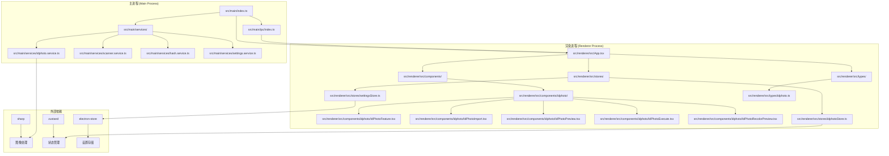
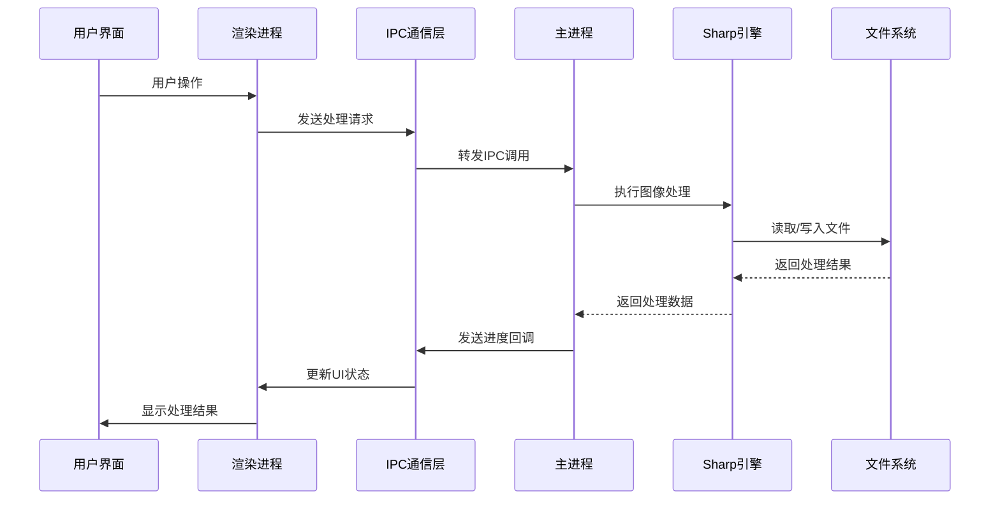
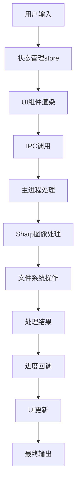
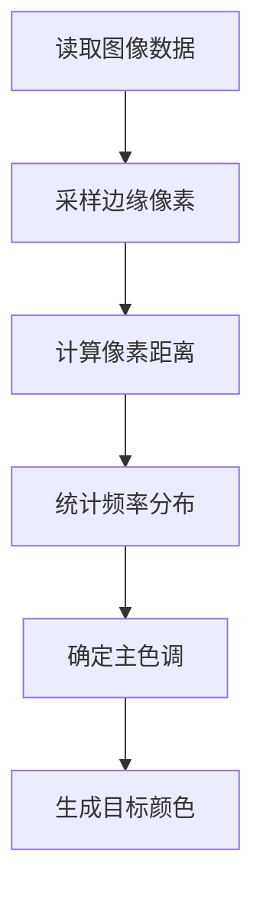
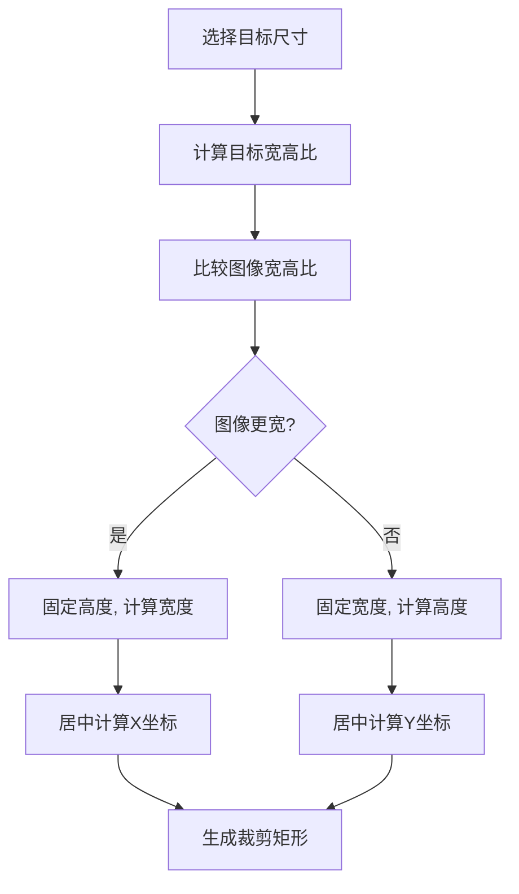
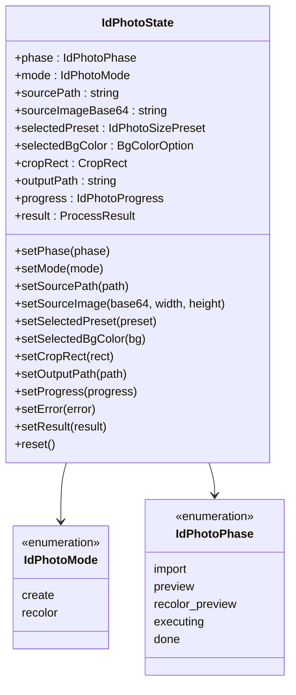
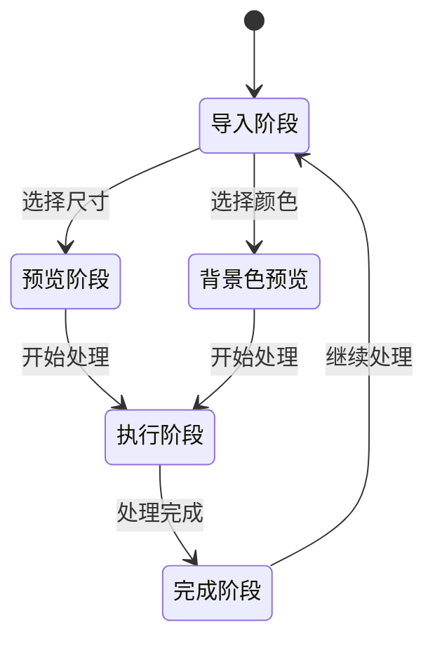
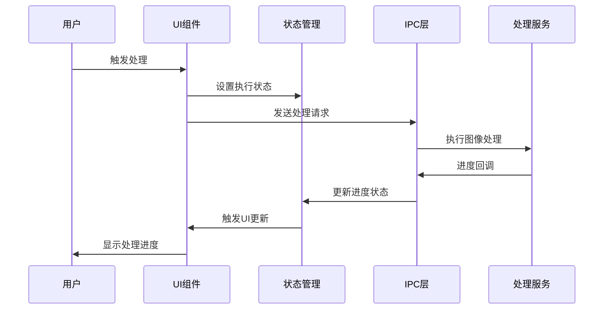
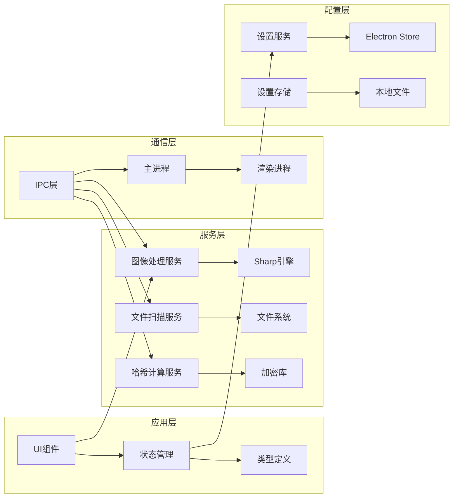
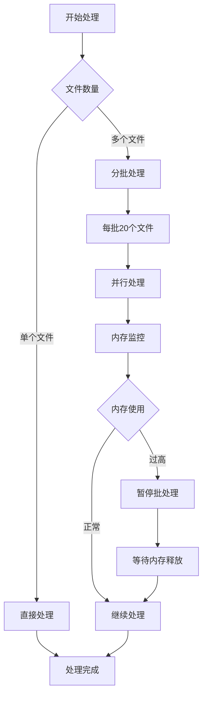

# ID照片处理服务

<cite>
**本文档引用的文件**
- [src/main/services/idphoto.service.ts](file://src/main/services/idphoto.service.ts)
- [src/main/ipc/index.ts](file://src/main/ipc/index.ts)
- [src/renderer/src/components/idphoto/IdPhotoFeature.tsx](file://src/renderer/src/components/idphoto/IdPhotoFeature.tsx)
- [src/renderer/src/stores/idphotoStore.ts](file://src/renderer/src/stores/idphotoStore.ts)
- [src/renderer/src/tabs/idphoto.ts](file://src/renderer/src/tabs/idphoto.ts)
- [src/renderer/src/types/idphoto.ts](file://src/renderer/src/types/idphoto.ts)
- [src/renderer/src/components/idphoto/IdPhotoImport.tsx](file://src/renderer/src/components/idphoto/IdPhotoImport.tsx)
- [src/renderer/src/components/idphoto/IdPhotoPreview.tsx](file://src/renderer/src/components/idphoto/IdPhotoPreview.tsx)
- [src/renderer/src/components/idphoto/IdPhotoExecute.tsx](file://src/renderer/src/components/idphoto/IdPhotoExecute.tsx)
- [src/renderer/src/components/idphoto/IdPhotoRecolorPreview.tsx](file://src/renderer/src/components/idphoto/IdPhotoRecolorPreview.tsx)
- [src/main/services/scanner.service.ts](file://src/main/services/scanner.service.ts)
- [src/main/services/hash.service.ts](file://src/main/services/hash.service.ts)
- [src/renderer/src/stores/settingsStore.ts](file://src/renderer/src/stores/settingsStore.ts)
- [src/renderer/src/App.tsx](file://src/renderer/src/App.tsx)
- [src/renderer/src/types/index.ts](file://src/renderer/src/types/index.ts)
- [src/main/services/settings.service.ts](file://src/main/services/settings.service.ts)
- [package.json](file://package.json)
</cite>

## 目录
1. [简介](#简介)
2. [项目结构](#项目结构)
3. [核心组件](#核心组件)
4. [架构概览](#架构概览)
5. [详细组件分析](#详细组件分析)
6. [依赖关系分析](#依赖关系分析)
7. [性能考虑](#性能考虑)
8. [故障排除指南](#故障排除指南)
9. [结论](#结论)

## 简介

ID照片处理服务是一个基于Electron的桌面应用程序，专门用于处理身份证件照片的自动化处理。该服务提供了完整的证件照制作流程，包括照片导入、智能裁剪、背景色替换、质量优化等功能。

本应用采用现代化的技术栈构建，使用React作为前端框架，Electron作为桌面应用框架，Sharp作为图像处理引擎，实现了高性能的照片处理能力。应用支持多种证件照尺寸标准，包括国内常用的一寸、二寸证件照以及护照、签证等国际通用尺寸。

## 项目结构

项目采用模块化架构设计，主要分为以下层次：

**图表来源**
- [src/main/index.ts](file://src/main/index.ts)
- [src/renderer/src/App.tsx](file://src/renderer/src/App.tsx)

**章节来源**
- [package.json:14-21](file://package.json#L14-L21)
- [src/main/services/idphoto.service.ts:1-319](file://src/main/services/idphoto.service.ts#L1-L319)

## 核心组件

### 图像处理服务

图像处理服务是整个应用的核心，基于Sharp库实现高质量的图像处理功能。主要包含以下核心功能：

1. **智能证件照制作**：支持多种标准尺寸，自动EXIF方向校正
2. **背景色智能检测与替换**：基于边缘像素采样的背景色检测算法
3. **高质量输出**：支持JPG和PNG格式，可配置质量参数和DPI元数据

### IPC通信层

IPC（Inter-Process Communication）层负责主进程和渲染进程之间的通信，提供安全的API接口：

- 文件选择和信息获取
- 进度回调机制
- 错误处理和状态同步

### 用户界面组件

应用采用响应式设计，包含多个专门的功能组件：

- **导入组件**：照片选择和参数配置
- **预览组件**：实时裁剪预览和交互式编辑
- **执行组件**：处理进度显示和结果反馈
- **设置组件**：全局配置和主题定制

**章节来源**
- [src/main/services/idphoto.service.ts:55-116](file://src/main/services/idphoto.service.ts#L55-L116)
- [src/main/ipc/index.ts:347-372](file://src/main/ipc/index.ts#L347-L372)
- [src/renderer/src/components/idphoto/IdPhotoFeature.tsx:12-23](file://src/renderer/src/components/idphoto/IdPhotoFeature.tsx#L12-L23)

## 架构概览

应用采用典型的Electron双进程架构，结合现代前端开发模式：

**图表来源**
- [src/main/ipc/index.ts:347-372](file://src/main/ipc/index.ts#L347-L372)
- [src/main/services/idphoto.service.ts:55-116](file://src/main/services/idphoto.service.ts#L55-L116)

### 数据流架构

**图表来源**
- [src/renderer/src/stores/idphotoStore.ts:49-93](file://src/renderer/src/stores/idphotoStore.ts#L49-L93)
- [src/renderer/src/components/idphoto/IdPhotoPreview.tsx:237-273](file://src/renderer/src/components/idphoto/IdPhotoPreview.tsx#L237-L273)

## 详细组件分析

### 图像处理核心算法

#### 背景色检测算法

应用实现了智能的背景色检测算法，通过采样边缘像素来确定背景色：

**图表来源**
- [src/main/services/idphoto.service.ts:121-172](file://src/main/services/idphoto.service.ts#L121-L172)

#### 裁剪预览算法

裁剪预览功能实现了智能的裁剪区域计算：

**图表来源**
- [src/renderer/src/components/idphoto/IdPhotoImport.tsx:41-62](file://src/renderer/src/components/idphoto/IdPhotoImport.tsx#L41-L62)

### 状态管理系统

应用使用Zustand实现轻量级状态管理：

**图表来源**
- [src/renderer/src/stores/idphotoStore.ts:7-45](file://src/renderer/src/stores/idphotoStore.ts#L7-L45)

**章节来源**
- [src/renderer/src/stores/idphotoStore.ts:49-93](file://src/renderer/src/stores/idphotoStore.ts#L49-L93)
- [src/renderer/src/types/idphoto.ts:1-193](file://src/renderer/src/types/idphoto.ts#L1-L193)

### UI组件架构

#### 功能切换机制

应用实现了灵活的功能切换机制，支持证件照制作和背景色替换两种模式：

**图表来源**
- [src/renderer/src/components/idphoto/IdPhotoFeature.tsx:12-23](file://src/renderer/src/components/idphoto/IdPhotoFeature.tsx#L12-L23)

#### 进度跟踪系统

应用实现了完整的进度跟踪机制，提供实时的处理状态反馈：

**图表来源**
- [src/main/ipc/index.ts:347-372](file://src/main/ipc/index.ts#L347-L372)
- [src/main/services/idphoto.service.ts:58-116](file://src/main/services/idphoto.service.ts#L58-L116)

**章节来源**
- [src/renderer/src/components/idphoto/IdPhotoFeature.tsx:12-23](file://src/renderer/src/components/idphoto/IdPhotoFeature.tsx#L12-L23)
- [src/renderer/src/components/idphoto/IdPhotoExecute.tsx:9-117](file://src/renderer/src/components/idphoto/IdPhotoExecute.tsx#L9-L117)

## 依赖关系分析

### 核心依赖关系

应用的依赖关系清晰明确，遵循单一职责原则：

**图表来源**
- [package.json:14-21](file://package.json#L14-L21)
- [src/main/services/idphoto.service.ts:1-319](file://src/main/services/idphoto.service.ts#L1-L319)

### 外部库集成

应用集成了多个专业库来实现特定功能：

| 库名称 | 版本 | 用途 | 依赖来源 |
|--------|------|------|----------|
| sharp | ^0.33.5 | 图像处理 | 图像编解码、格式转换、滤镜效果 |
| zustand | ^5.0.3 | 状态管理 | React应用状态管理 |
| electron-store | ^8.2.0 | 设置存储 | 应用配置持久化 |
| exifr | ^7.1.3 | EXIF数据解析 | 照片元数据提取 |

**章节来源**
- [package.json:14-21](file://package.json#L14-L21)
- [src/main/services/idphoto.service.ts:1-319](file://src/main/services/idphoto.service.ts#L1-L319)

## 性能考虑

### 图像处理优化

应用在图像处理方面采用了多项优化策略：

1. **渐进式处理**：分阶段执行图像处理任务，提供实时进度反馈
2. **内存管理**：使用Buffer对象直接操作像素数据，避免不必要的内存复制
3. **批处理机制**：对大量文件处理时采用批处理模式，控制内存使用
4. **缓存策略**：对频繁访问的数据进行缓存，减少重复计算

### 并发处理

应用支持并发处理多个文件，提高整体处理效率：

- **批量哈希计算**：支持20个文件一组的并行处理
- **批量感知哈希**：支持5个文件一组的并行处理
- **进度回调优化**：定期发送进度更新，避免UI阻塞

### 内存使用优化

## 故障排除指南

### 常见问题及解决方案

#### 图像处理失败

**症状**：处理过程中出现错误提示
**可能原因**：
- 输入文件格式不支持
- 文件损坏或权限不足
- 磁盘空间不足
- Sharp引擎异常

**解决步骤**：
1. 检查文件格式是否在支持列表中
2. 验证文件完整性和访问权限
3. 确认磁盘空间充足
4. 重启应用重试

#### 背景色检测不准确

**症状**：背景色替换效果不理想
**可能原因**：
- 照片背景复杂或渐变
- 采样点过少
- 颜色阈值设置不当

**解决方法**：
1. 使用更简单的背景照片
2. 调整容差参数
3. 手动选择目标背景色

#### 性能问题

**症状**：处理速度慢或内存占用高
**解决措施**：
1. 减少同时处理的文件数量
2. 关闭其他占用资源的应用程序
3. 增加系统内存
4. 优化图像分辨率

**章节来源**
- [src/main/services/idphoto.service.ts:109-115](file://src/main/services/idphoto.service.ts#L109-L115)
- [src/renderer/src/components/idphoto/IdPhotoExecute.tsx:95-105](file://src/renderer/src/components/idphoto/IdPhotoExecute.tsx#L95-L105)

## 结论

ID照片处理服务是一个功能完整、架构清晰的桌面应用程序。通过合理的设计和技术选型，成功实现了高效的图像处理功能。

### 主要优势

1. **技术架构先进**：采用Electron + React + TypeScript的现代化技术栈
2. **功能完整性**：涵盖从照片导入到成品输出的完整工作流程
3. **用户体验优秀**：提供直观的界面和实时的进度反馈
4. **性能表现良好**：通过多层优化确保处理效率

### 技术亮点

1. **智能算法**：背景色检测和裁剪预览算法具有良好的准确性
2. **状态管理**：使用Zustand实现轻量级但强大的状态管理
3. **IPC通信**：安全可靠的主进程与渲染进程通信机制
4. **错误处理**：完善的错误捕获和用户友好的错误提示

### 改进建议

1. **增加撤销功能**：允许用户撤销上一步操作
2. **批量处理增强**：支持更多自定义批量处理选项
3. **插件扩展**：考虑支持第三方插件扩展功能
4. **云端同步**：添加设置和配置的云端同步功能

该应用为用户提供了一个专业、易用的证件照处理解决方案，具有良好的扩展性和维护性。