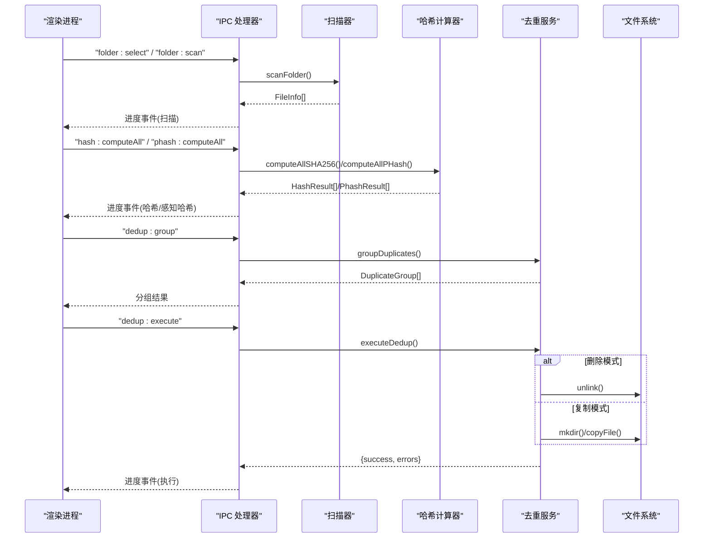
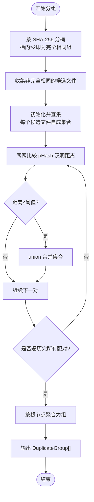
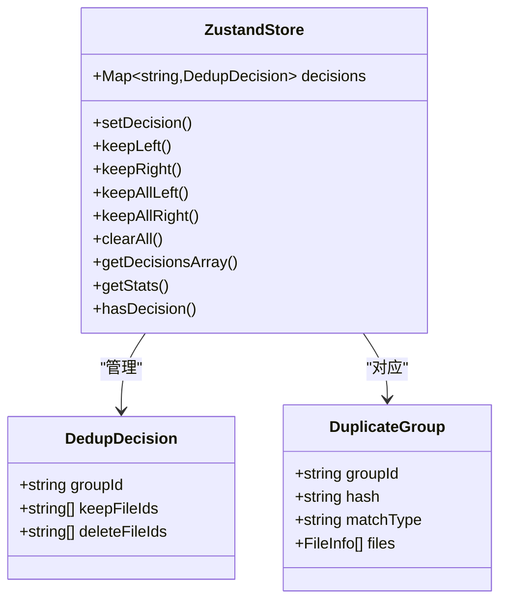
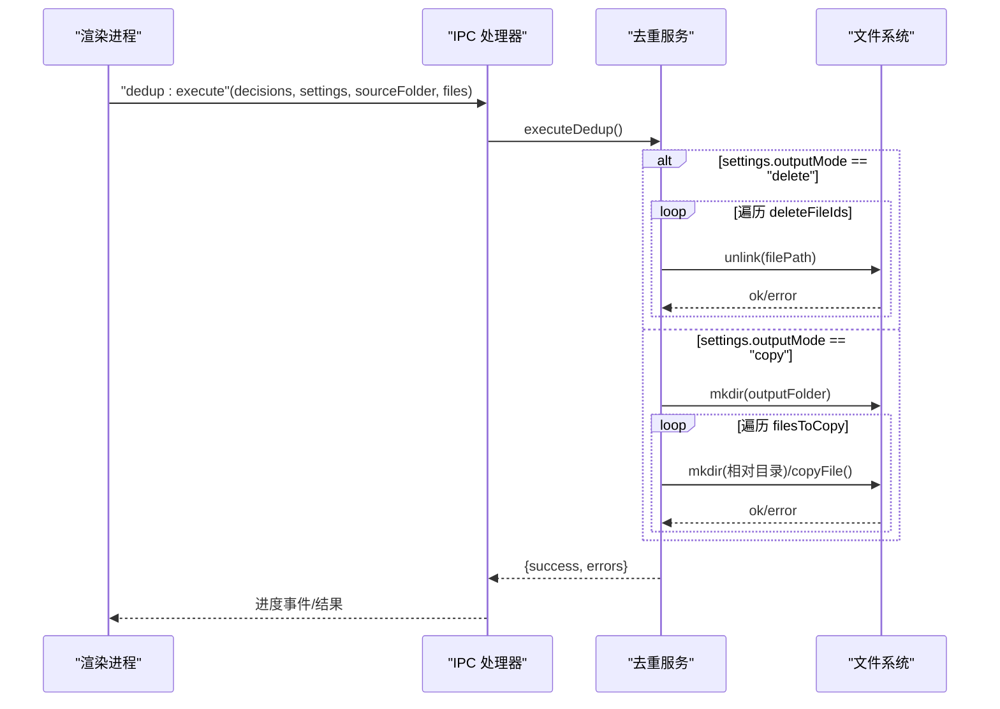
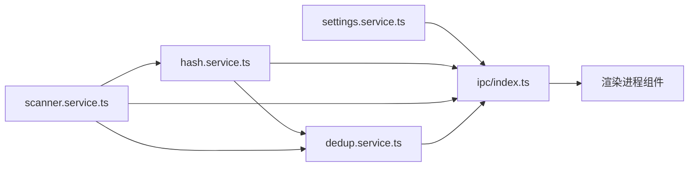

# 去重处理服务

<cite>
**本文引用的文件**
- [src/main/services/dedup.service.ts](file://src/main/services/dedup.service.ts)
- [src/main/services/hash.service.ts](file://src/main/services/hash.service.ts)
- [src/main/services/scanner.service.ts](file://src/main/services/scanner.service.ts)
- [src/main/services/settings.service.ts](file://src/main/services/settings.service.ts)
- [src/main/ipc/index.ts](file://src/main/ipc/index.ts)
- [src/main/index.ts](file://src/main/index.ts)
- [src/renderer/src/components/CompareStep.tsx](file://src/renderer/src/components/CompareStep.tsx)
- [src/renderer/src/components/ExecuteStep.tsx](file://src/renderer/src/components/ExecuteStep.tsx)
- [src/renderer/src/components/ImportStep.tsx](file://src/renderer/src/components/ImportStep.tsx)
- [src/renderer/src/stores/dedupStore.ts](file://src/renderer/src/stores/dedupStore.ts)
- [src/renderer/src/stores/scanStore.ts](file://src/renderer/src/stores/scanStore.ts)
- [src/renderer/src/stores/settingsStore.ts](file://src/renderer/src/stores/settingsStore.ts)
- [src/renderer/src/types/index.ts](file://src/renderer/src/types/index.ts)
- [package.json](file://package.json)
</cite>

## 目录
1. [简介](#简介)
2. [项目结构](#项目结构)
3. [核心组件](#核心组件)
4. [架构总览](#架构总览)
5. [详细组件分析](#详细组件分析)
6. [依赖关系分析](#依赖关系分析)
7. [性能考量](#性能考量)
8. [故障排查指南](#故障排查指南)
9. [结论](#结论)
10. [附录](#附录)

## 简介
本项目是一个桌面端照片去重工具，通过“精确匹配（SHA-256）+相似度匹配（感知哈希 pHash）”的双层算法识别重复或高度相似的照片，并提供交互式的分组展示与决策机制，最终执行删除或复制到新目录的去重操作。系统采用 Electron + React + TypeScript 架构，后端服务在主进程中运行，前端负责用户交互与状态管理。

## 项目结构
- 主进程（Electron）
  - 扫描器：遍历文件夹，收集受支持格式的文件信息
  - 哈希计算：SHA-256 与 pHash 计算，带批处理与进度回调
  - 去重服务：基于并查集的智能分组与执行策略
  - IPC：桥接前后端，暴露文件夹选择、扫描、哈希、分组、执行等接口
- 渲染进程（React）
  - 导入步骤：选择文件夹、显示扫描进度、触发哈希与分组
  - 对比步骤：按组展示重复文件，支持单组/全组决策
  - 执行步骤：执行去重，显示进度与结果
  - 状态管理：Zustand store 管理扫描状态、去重决策与应用设置

```mermaid
graph TB
subgraph "渲染进程"
UI_Import["导入步骤<br/>ImportStep.tsx"]
UI_Compare["对比步骤<br/>CompareStep.tsx"]
UI_Execute["执行步骤<br/>ExecuteStep.tsx"]
Store_Scan["扫描状态<br/>scanStore.ts"]
Store_Dedup["去重决策<br/>dedupStore.ts"]
Store_Settings["应用设置<br/>settingsStore.ts"]
end
subgraph "主进程"
IPC["IPC 处理器<br/>ipc/index.ts"]
Scanner["文件扫描<br/>scanner.service.ts"]
Hasher["哈希计算<br/>hash.service.ts"]
Deduper["去重服务<br/>dedup.service.ts"]
Settings["设置持久化<br/>settings.service.ts"]
end
UI_Import --> IPC
UI_Compare --> IPC
UI_Execute --> IPC
IPC --> Scanner
IPC --> Hasher
IPC --> Deduper
IPC --> Settings
Store_Scan <- --> UI_Import
Store_Scan <- --> UI_Compare
Store_Scan <- --> UI_Execute
Store_Dedup <- --> UI_Compare
Store_Settings <- --> UI_Import
```

图表来源
- [src/renderer/src/components/ImportStep.tsx:1-174](file://src/renderer/src/components/ImportStep.tsx#L1-L174)
- [src/renderer/src/components/CompareStep.tsx:1-279](file://src/renderer/src/components/CompareStep.tsx#L1-L279)
- [src/renderer/src/components/ExecuteStep.tsx:1-161](file://src/renderer/src/components/ExecuteStep.tsx#L1-L161)
- [src/renderer/src/stores/scanStore.ts:1-52](file://src/renderer/src/stores/scanStore.ts#L1-L52)
- [src/renderer/src/stores/dedupStore.ts:1-83](file://src/renderer/src/stores/dedupStore.ts#L1-L83)
- [src/renderer/src/stores/settingsStore.ts:1-41](file://src/renderer/src/stores/settingsStore.ts#L1-L41)
- [src/main/ipc/index.ts:1-156](file://src/main/ipc/index.ts#L1-L156)
- [src/main/services/scanner.service.ts:1-86](file://src/main/services/scanner.service.ts#L1-L86)
- [src/main/services/hash.service.ts:1-180](file://src/main/services/hash.service.ts#L1-L180)
- [src/main/services/dedup.service.ts:1-209](file://src/main/services/dedup.service.ts#L1-L209)
- [src/main/services/settings.service.ts:1-34](file://src/main/services/settings.service.ts#L1-L34)

章节来源
- [src/main/index.ts:1-61](file://src/main/index.ts#L1-L61)
- [src/main/ipc/index.ts:1-156](file://src/main/ipc/index.ts#L1-L156)

## 核心组件
- 文件扫描器：递归遍历文件夹，过滤受支持扩展名，生成 FileInfo 列表
- 哈希计算器：SHA-256 批量计算；pHash 计算（缩放、灰度、DCT、低频块、二进制哈希）
- 去重服务：精确分组（SHA-256 相同即为完全相同），相似分组（pHash 汉明距离阈值内视为高度相似）
- 并查集：用于 pHash 分组的连通性合并
- 决策存储：记录每组“保留/删除”的文件 ID 列表
- 执行器：删除模式直接删除选中文件；复制模式将非重复与被保留文件复制到新目录
- IPC 接口：统一暴露扫描、哈希、分组、执行、缩略图、设置读写等接口

章节来源
- [src/main/services/scanner.service.ts:1-86](file://src/main/services/scanner.service.ts#L1-L86)
- [src/main/services/hash.service.ts:1-180](file://src/main/services/hash.service.ts#L1-L180)
- [src/main/services/dedup.service.ts:1-209](file://src/main/services/dedup.service.ts#L1-L209)
- [src/main/services/settings.service.ts:1-34](file://src/main/services/settings.service.ts#L1-L34)
- [src/main/ipc/index.ts:1-156](file://src/main/ipc/index.ts#L1-L156)
- [src/renderer/src/stores/dedupStore.ts:1-83](file://src/renderer/src/stores/dedupStore.ts#L1-L83)

## 架构总览
系统采用“主进程服务 + 渲染进程 UI”的分层设计：
- 主进程负责 IO、计算密集型任务与系统级操作
- 渲染进程负责用户交互、状态管理与可视化
- IPC 作为桥接层，传递数据与控制信号



图表来源
- [src/main/ipc/index.ts:1-156](file://src/main/ipc/index.ts#L1-L156)
- [src/main/services/scanner.service.ts:1-86](file://src/main/services/scanner.service.ts#L1-L86)
- [src/main/services/hash.service.ts:1-180](file://src/main/services/hash.service.ts#L1-L180)
- [src/main/services/dedup.service.ts:1-209](file://src/main/services/dedup.service.ts#L1-L209)

## 详细组件分析

### 智能分组算法与并查集应用
- 精确分组（SHA-256）
  - 将所有文件按 SHA-256 分桶，桶内数量 ≥ 2 的即为“完全相同”重复组
  - 该阶段不考虑 pHash，避免误判
- 相似分组（pHash + 并查集）
  - 仅对“非完全相同”的文件进行 pHash 计算
  - 使用汉明距离作为相似度度量，阈值默认 5
  - 初始化并查集，对满足阈值的文件对执行 union，最终按根节点聚合形成“高度相似”组
- 并查集优化
  - 路径压缩：find 时将节点直接连接到根，降低后续查询复杂度
  - 合并时无额外排序，时间复杂度近似 O(α(N))，适合大规模文件场景



图表来源
- [src/main/services/dedup.service.ts:43-115](file://src/main/services/dedup.service.ts#L43-L115)
- [src/main/services/hash.service.ts:161-168](file://src/main/services/hash.service.ts#L161-L168)

章节来源
- [src/main/services/dedup.service.ts:25-115](file://src/main/services/dedup.service.ts#L25-L115)
- [src/main/services/hash.service.ts:161-168](file://src/main/services/hash.service.ts#L161-L168)

### 重复文件识别逻辑与阈值设置
- 精确匹配（SHA-256）
  - 适用于完全一致的文件（内容完全相同）
  - 优点：稳定可靠，无误判
  - 缺点：忽略重命名、元数据变化但内容相同的文件
- 相似度判断（pHash + 汉明距离）
  - 通过缩放、灰度、DCT、低频块均值生成 64 位二进制哈希
  - 汉明距离越小表示图像越相似
  - 阈值默认 5，可根据场景调整
- 组合策略
  - 先做精确分组，再对剩余文件做相似分组，避免重复计算

章节来源
- [src/main/services/hash.service.ts:58-101](file://src/main/services/hash.service.ts#L58-L101)
- [src/main/services/hash.service.ts:132-159](file://src/main/services/hash.service.ts#L132-L159)
- [src/main/services/dedup.service.ts:74-112](file://src/main/services/dedup.service.ts#L74-L112)
- [src/main/services/settings.service.ts:10-15](file://src/main/services/settings.service.ts#L10-L15)

### 用户决策处理机制
- 分组展示
  - 每组两个及以上文件，左侧为“保留”，右侧为“删除”
  - 支持“全部保留左侧/右侧”“清除选择”“分页浏览”
- 手动筛选
  - 单组内可选择保留最左或最右文件，其余自动标记为删除
- 批量操作
  - 一键全选左侧或右侧，快速完成所有组的决策
- 决策存储
  - 每组保存 keepFileIds 与 deleteFileIds，便于执行阶段使用



图表来源
- [src/renderer/src/stores/dedupStore.ts:1-83](file://src/renderer/src/stores/dedupStore.ts#L1-L83)
- [src/renderer/src/types/index.ts:20-36](file://src/renderer/src/types/index.ts#L20-L36)

章节来源
- [src/renderer/src/components/CompareStep.tsx:1-279](file://src/renderer/src/components/CompareStep.tsx#L1-L279)
- [src/renderer/src/stores/dedupStore.ts:1-83](file://src/renderer/src/stores/dedupStore.ts#L1-L83)
- [src/renderer/src/types/index.ts:20-36](file://src/renderer/src/types/index.ts#L20-L36)

### 去重执行流程
- 删除模式
  - 直接删除被标记为删除的文件路径
  - 逐个执行，支持进度回调
- 复制模式
  - 创建输出目录（基于源目录所在位置 + 自定义名称）
  - 复制两类文件：非重复文件 + 每组被保留的文件
  - 保持相对路径结构，逐个复制并支持进度回调
- 错误处理
  - 每次操作捕获异常并记录错误列表，不影响整体执行
  - 执行完成后返回成功数与错误数



图表来源
- [src/main/services/dedup.service.ts:117-209](file://src/main/services/dedup.service.ts#L117-L209)
- [src/main/ipc/index.ts:110-142](file://src/main/ipc/index.ts#L110-L142)

章节来源
- [src/main/services/dedup.service.ts:117-209](file://src/main/services/dedup.service.ts#L117-L209)
- [src/renderer/src/components/ExecuteStep.tsx:1-161](file://src/renderer/src/components/ExecuteStep.tsx#L1-L161)

### API 接口说明
- 文件夹选择
  - 渲染进程调用：window.api.selectFolder()
  - 主进程响应：返回所选目录路径
- 文件夹扫描
  - 渲染进程调用：window.api.scanFolder(folderPath)
  - 主进程响应：返回 FileInfo[]，期间发送扫描进度事件
- 哈希计算
  - 渲染进程调用：window.api.computeHashes(files) 或 window.api.computePhashes(uniqueFiles)
  - 主进程响应：返回 HashResult[] 或 PhashResult[]，期间发送哈希进度事件
- 分组去重
  - 渲染进程调用：window.api.groupDuplicates({ hashResults, phashResults?, phashThreshold? })
  - 主进程响应：返回 DuplicateGroup[]
- 执行去重
  - 渲染进程调用：window.api.executeDedup({ decisions, settings, sourceFolder, files? })
  - 主进程响应：返回 { success, errors }，期间发送执行进度事件
- 缩略图生成
  - 渲染进程调用：window.api.getThumbnail(filePath, maxSize?)
  - 主进程响应：返回 base64 数据 URL
- 设置读写
  - 渲染进程调用：window.api.getSettings() / window.api.setSettings(partial)
  - 主进程响应：返回当前设置对象

章节来源
- [src/main/ipc/index.ts:32-154](file://src/main/ipc/index.ts#L32-L154)
- [src/renderer/src/types/index.ts:45-57](file://src/renderer/src/types/index.ts#L45-L57)

## 依赖关系分析
- 外部依赖
  - sharp：图像处理（缩放、灰度、DCT、编码）
  - electron-store：设置持久化
  - zustand：轻量状态管理
- 模块耦合
  - 扫描器与哈希器解耦，便于独立优化
  - 去重服务依赖哈希结果与文件映射，保持低耦合
  - IPC 层集中暴露接口，前端通过 window.api 统一访问



图表来源
- [src/main/services/scanner.service.ts:1-86](file://src/main/services/scanner.service.ts#L1-L86)
- [src/main/services/hash.service.ts:1-180](file://src/main/services/hash.service.ts#L1-L180)
- [src/main/services/dedup.service.ts:1-209](file://src/main/services/dedup.service.ts#L1-L209)
- [src/main/services/settings.service.ts:1-34](file://src/main/services/settings.service.ts#L1-L34)
- [src/main/ipc/index.ts:1-156](file://src/main/ipc/index.ts#L1-L156)

章节来源
- [package.json:13-34](file://package.json#L13-L34)

## 性能考量
- 批处理与并发
  - SHA-256 与 pHash 计算采用固定批次大小，避免一次性占用过多内存
  - 在批次间让出事件循环，保证 UI 流畅
- 并查集优化
  - 路径压缩减少查询开销，适合大规模文件
- I/O 优化
  - 复制模式先创建目标目录树，减少多次 mkdir 调用
  - 删除模式按需 unlink，避免不必要的拷贝
- 图像处理
  - pHash 仅对候选文件计算，避免对已唯一文件重复计算
- 前端渲染
  - 分页展示分组，避免一次性渲染大量 DOM
  - 缩略图懒加载，失败回退

章节来源
- [src/main/services/hash.service.ts:16-56](file://src/main/services/hash.service.ts#L16-L56)
- [src/main/services/hash.service.ts:139-159](file://src/main/services/hash.service.ts#L139-L159)
- [src/main/services/dedup.service.ts:25-41](file://src/main/services/dedup.service.ts#L25-L41)
- [src/renderer/src/components/CompareStep.tsx:136-205](file://src/renderer/src/components/CompareStep.tsx#L136-L205)

## 故障排查指南
- 未发现重复文件
  - 可能原因：文件均为唯一或 pHash 阈值过高
  - 建议：调整设置中的 pHash 阈值或切换到“组合模式”
- 执行失败
  - 可能原因：权限不足、磁盘空间不足、文件被占用
  - 建议：检查输出目录权限与磁盘空间；关闭占用文件的程序后重试
- 进度卡住
  - 可能原因：大文件哈希或复制耗时较长
  - 建议：等待或重启应用；查看错误列表定位具体文件
- 缩略图加载失败
  - 可能原因：图像损坏或格式不受支持
  - 建议：跳过该文件或修复图像

章节来源
- [src/renderer/src/components/ExecuteStep.tsx:48-54](file://src/renderer/src/components/ExecuteStep.tsx#L48-L54)
- [src/main/services/dedup.service.ts:132-160](file://src/main/services/dedup.service.ts#L132-L160)

## 结论
本系统通过“精确匹配 + 相似度匹配”的双层策略，结合并查集高效分组与用户交互式决策，实现了高准确率与良好用户体验的去重方案。主进程专注计算与 I/O，渲染进程专注交互与状态管理，IPC 层提供清晰的接口契约，具备良好的可维护性与扩展性。

## 附录

### 实际使用案例
- 案例一：家庭相册整理
  - 场景：从多个设备导出的照片存在重复与轻微修改版本
  - 步骤：选择相册目录 → 扫描 → 组合模式（SHA-256 + pHash） → 对比分组 → 保留更清晰版本 → 执行复制到新目录
- 案例二：工作资料清理
  - 场景：同一份报告的不同命名与格式版本
  - 步骤：选择工作目录 → 精确匹配（SHA-256） → 删除多余版本 → 执行删除

### 性能优化技巧
- 调整 pHash 阈值：根据图像差异容忍度适当提高/降低阈值
- 使用“组合模式”：先精确匹配，再对候选文件做相似匹配，兼顾速度与精度
- 分批处理：确保批次大小适中，避免内存峰值过高
- 复制前预估空间：提前检查输出目录可用空间，避免中途失败