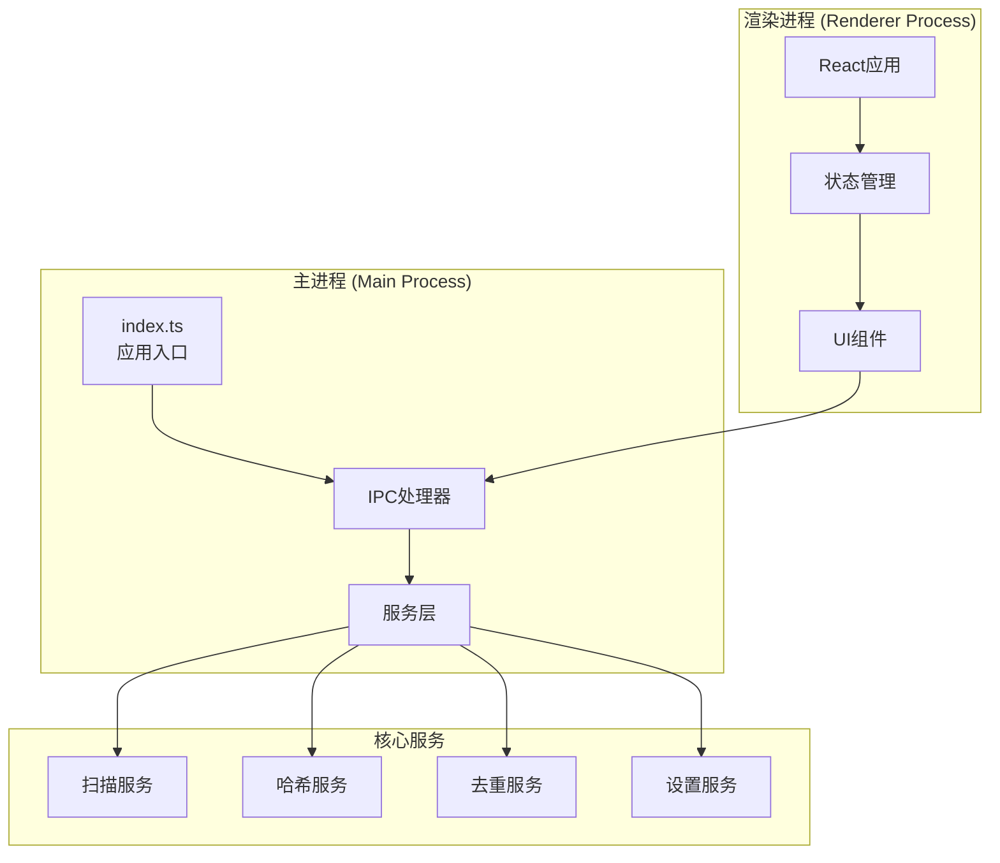
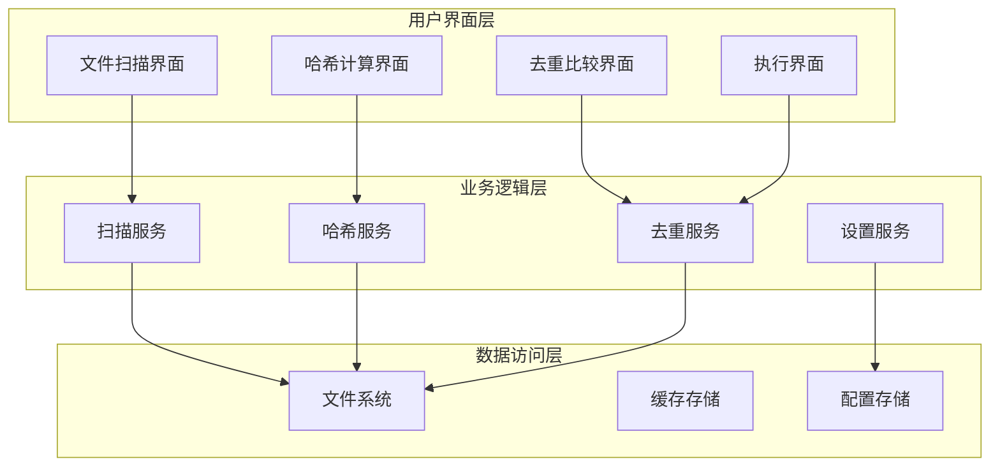
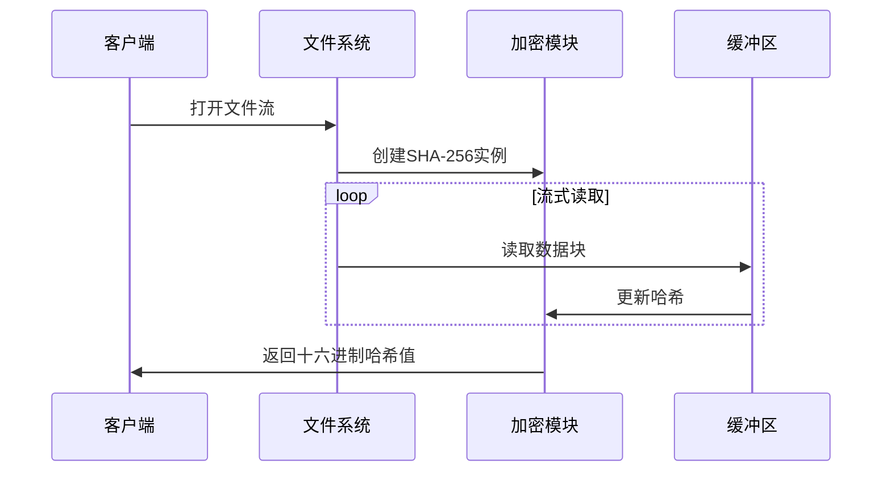
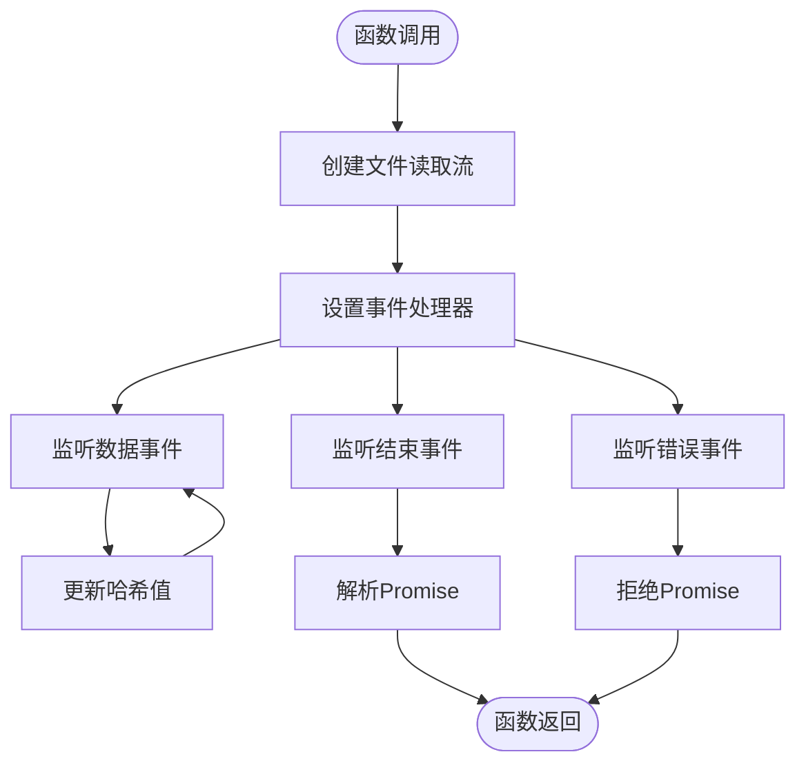
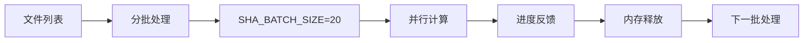
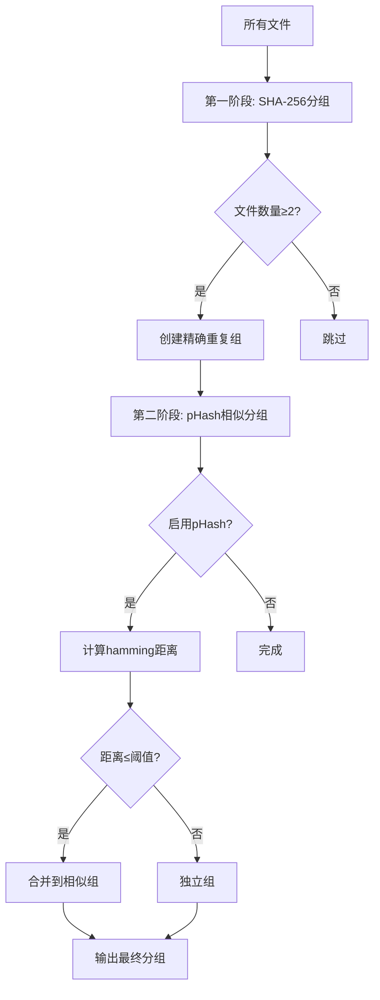
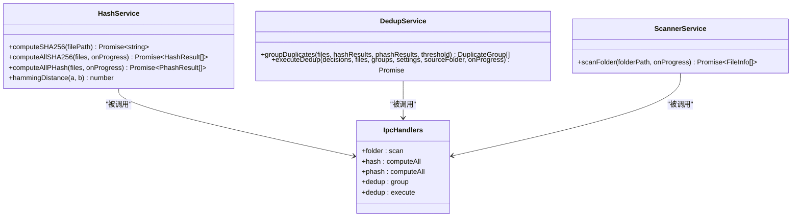
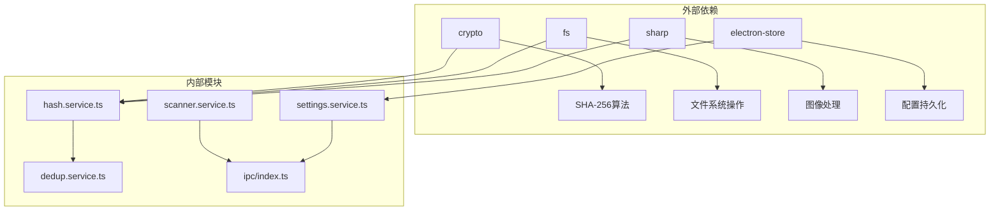

# SHA-256精确匹配算法

<cite>
**本文档引用的文件**
- [hash.service.ts](file://src/main/services/hash.service.ts)
- [dedup.service.ts](file://src/main/services/dedup.service.ts)
- [scanner.service.ts](file://src/main/services/scanner.service.ts)
- [ipc/index.ts](file://src/main/ipc/index.ts)
- [settings.service.ts](file://src/main/services/settings.service.ts)
- [dedupStore.ts](file://src/renderer/src/stores/dedupStore.ts)
- [CompareStep.tsx](file://src/renderer/src/components/CompareStep.tsx)
- [types/index.ts](file://src/renderer/src/types/index.ts)
- [index.ts](file://src/main/index.ts)
- [package.json](file://package.json)
</cite>

## 目录
1. [简介](#简介)
2. [项目结构](#项目结构)
3. [核心组件](#核心组件)
4. [架构概览](#架构概览)
5. [详细组件分析](#详细组件分析)
6. [依赖关系分析](#依赖关系分析)
7. [性能考量](#性能考量)
8. [故障排除指南](#故障排除指南)
9. [结论](#结论)
10. [附录](#附录)

## 简介

ReDoPhoto是一个基于Electron的桌面照片去重应用程序，专注于通过SHA-256精确匹配算法实现高质量的照片去重功能。该系统采用现代前端技术栈（React + TypeScript）构建用户界面，后端使用Node.js + Electron提供强大的文件处理能力。

本项目的核心创新在于实现了高效的SHA-256哈希算法，能够准确识别完全相同的文件内容，同时结合pHash算法实现相似图片的智能分组。系统支持大文件处理、内存优化和异步处理机制，确保在处理大量照片时仍能保持良好的性能表现。

## 项目结构

ReDoPhoto采用典型的Electron + React架构，主要分为以下层次：



**图表来源**
- [index.ts:1-61](file://src/main/index.ts#L1-L61)
- [ipc/index.ts:1-156](file://src/main/ipc/index.ts#L1-L156)

**章节来源**
- [index.ts:1-61](file://src/main/index.ts#L1-L61)
- [package.json:1-51](file://package.json#L1-L51)

## 核心组件

### 哈希计算服务

哈希服务是整个去重系统的核心，负责实现SHA-256精确匹配算法和pHash相似度匹配算法。

**章节来源**
- [hash.service.ts:1-180](file://src/main/services/hash.service.ts#L1-L180)

### 文件扫描服务

扫描服务负责遍历指定目录，收集支持格式的图片文件信息，包括文件路径、大小、修改时间等元数据。

**章节来源**
- [scanner.service.ts:1-86](file://src/main/services/scanner.service.ts#L1-L86)

### 去重逻辑服务

去重服务实现智能分组算法，结合SHA-256精确匹配和pHash相似度匹配，生成重复照片分组结果。

**章节来源**
- [dedup.service.ts:1-209](file://src/main/services/dedup.service.ts#L1-L209)

### IPC通信层

IPC层负责主进程与渲染进程之间的通信，提供文件扫描、哈希计算、去重执行等接口。

**章节来源**
- [ipc/index.ts:1-156](file://src/main/ipc/index.ts#L1-L156)

## 架构概览

ReDoPhoto采用分层架构设计，确保各组件职责清晰、耦合度低：



**图表来源**
- [ipc/index.ts:22-156](file://src/main/ipc/index.ts#L22-L156)
- [hash.service.ts:19-56](file://src/main/services/hash.service.ts#L19-L56)

## 详细组件分析

### SHA-256精确匹配算法实现

#### 算法原理

SHA-256是一种密码学哈希函数，具有以下重要特性：
- **确定性**: 相同输入始终产生相同输出
- **雪崩效应**: 输入微小变化导致输出巨大差异
- **抗碰撞性**: 难以找到两个不同输入产生相同输出
- **单向性**: 从输出难以推导原始输入

#### 实现细节



**图表来源**
- [hash.service.ts:19-27](file://src/main/services/hash.service.ts#L19-L27)

#### 流式读取机制

系统采用流式读取策略处理大文件：

1. **内存优化**: 使用`fs.createReadStream()`避免一次性加载整个文件到内存
2. **分块处理**: 将文件分割为多个数据块进行处理
3. **实时更新**: 每个数据块到达时立即更新哈希值
4. **错误处理**: 捕获文件读取过程中的异常情况

**章节来源**
- [hash.service.ts:19-27](file://src/main/services/hash.service.ts#L19-L27)

### computeSHA256函数深度解析

#### 函数签名与返回值



**图表来源**
- [hash.service.ts:19-27](file://src/main/services/hash.service.ts#L19-L27)

#### 异步处理与错误捕获

函数实现了完整的异步处理机制：
- **Promise包装**: 将回调模式转换为Promise模式
- **事件驱动**: 基于文件流的事件模型
- **错误传播**: 将底层错误传递给调用者
- **资源清理**: 自动关闭文件流

**章节来源**
- [hash.service.ts:19-27](file://src/main/services/hash.service.ts#L19-L27)

### 批量处理策略分析

#### 批处理设计

系统采用批处理策略优化性能和内存使用：



**图表来源**
- [hash.service.ts:36-56](file://src/main/services/hash.service.ts#L36-L56)

#### 并发控制机制

1. **批次大小控制**: 每批处理20个文件，平衡并发度和内存占用
2. **Promise.all并行**: 同一批次内的文件哈希计算并行执行
3. **事件循环让渡**: 使用`setImmediate`让渡控制权给事件循环
4. **进度监控**: 实时更新处理进度，提供用户体验

**章节来源**
- [hash.service.ts:36-56](file://src/main/services/hash.service.ts#L36-L56)

#### 内存管理策略

- **渐进式处理**: 处理完一批后立即释放内存
- **流式处理**: 避免将整个文件加载到内存
- **错误隔离**: 单个文件失败不影响其他文件处理
- **垃圾回收**: 及时释放临时对象和缓冲区

### 去重算法实现

#### 分组策略

去重服务实现了两阶段分组算法：



**图表来源**
- [dedup.service.ts:43-115](file://src/main/services/dedup.service.ts#L43-L115)

#### Union-Find数据结构

系统使用Union-Find（并查集）算法优化pHash相似分组：

- **路径压缩**: 优化查找效率
- **动态扩展**: 支持运行时添加新元素
- **连通分量**: 自动识别相似图片群组

**章节来源**
- [dedup.service.ts:25-41](file://src/main/services/dedup.service.ts#L25-L41)

### IPC通信接口

#### 主要接口定义



**图表来源**
- [ipc/index.ts:55-142](file://src/main/ipc/index.ts#L55-L142)

**章节来源**
- [ipc/index.ts:55-142](file://src/main/ipc/index.ts#L55-L142)

## 依赖关系分析

### 核心依赖关系



**图表来源**
- [package.json:13-18](file://package.json#L13-L18)
- [hash.service.ts:1-4](file://src/main/services/hash.service.ts#L1-L4)

### 模块间耦合度分析

- **低耦合**: 各服务模块相对独立，职责明确
- **清晰边界**: IPC层提供统一的接口抽象
- **可测试性**: 每个模块都可以独立测试
- **可维护性**: 模块间依赖关系简单明了

**章节来源**
- [package.json:13-18](file://package.json#L13-L18)

## 性能考量

### 内存优化策略

1. **流式处理**: 避免大文件一次性加载到内存
2. **批处理**: 控制并发数量，防止内存峰值
3. **及时释放**: 处理完成后立即释放临时对象
4. **垃圾回收**: 利用JavaScript引擎的自动垃圾回收

### 处理速度优化

- **并行计算**: 同一批次内文件哈希计算并行执行
- **事件循环让渡**: 避免阻塞UI线程
- **进度反馈**: 提供实时处理进度，改善用户体验
- **缓存策略**: 对于重复操作提供适当的缓存机制

### 大文件处理能力

系统能够有效处理大文件：
- **无内存限制**: 基于流的处理方式不受内存限制
- **渐进式响应**: 用户可以逐步看到处理结果
- **错误恢复**: 单个文件失败不影响整体处理流程

## 故障排除指南

### 常见问题及解决方案

#### 文件读取错误

**症状**: 哈希计算过程中出现文件读取异常
**原因**: 文件权限不足、文件损坏或路径不存在
**解决方案**: 
- 检查文件访问权限
- 验证文件完整性
- 确认文件路径正确性

#### 内存不足错误

**症状**: 处理大量文件时出现内存溢出
**原因**: 批次大小过大或系统内存不足
**解决方案**:
- 调整SHA_BATCH_SIZE参数
- 关闭其他内存密集型应用
- 增加系统虚拟内存

#### 性能问题

**症状**: 哈希计算速度缓慢
**原因**: 磁盘IO瓶颈或CPU资源不足
**解决方案**:
- 使用SSD存储设备
- 关闭不必要的后台程序
- 考虑升级硬件配置

**章节来源**
- [hash.service.ts:40-46](file://src/main/services/hash.service.ts#L40-L46)
- [scanner.service.ts:38-42](file://src/main/services/scanner.service.ts#L38-L42)

## 结论

ReDoPhoto的SHA-256精确匹配算法实现了高效、可靠的文件去重功能。通过流式处理、批处理和并行计算等技术手段，系统能够在保证准确性的同时提供优秀的性能表现。

### 主要优势

1. **高精度**: SHA-256算法确保完全相同的文件被准确识别
2. **高性能**: 流式处理和并行计算优化了处理速度
3. **内存友好**: 批处理策略有效控制了内存使用
4. **用户友好**: 渐进式处理和实时进度反馈改善了用户体验

### 技术创新点

1. **混合算法**: 结合SHA-256精确匹配和pHash相似度匹配
2. **智能分组**: 使用Union-Find算法优化相似图片识别
3. **模块化设计**: 清晰的分层架构便于维护和扩展
4. **跨平台支持**: 基于Electron的跨平台桌面应用

## 附录

### API使用示例

#### 基本使用流程

```typescript
// 1. 扫描文件夹
const files = await window.api.scanFolder(folderPath);

// 2. 计算SHA-256哈希
const hashResults = await window.api.computeAllSHA256(files);

// 3. 分组去重
const duplicateGroups = await window.api.groupDuplicates(hashResults);

// 4. 执行去重操作
await window.api.executeDedup(decisions, settings);
```

#### 参数验证建议

- **文件路径验证**: 确保路径存在且可访问
- **文件类型检查**: 验证文件扩展名是否受支持
- **内存容量评估**: 根据文件数量估算所需内存
- **磁盘空间预留**: 确保有足够的磁盘空间进行复制操作

#### 性能调优建议

1. **批处理大小调整**: 根据系统配置调整SHA_BATCH_SIZE
2. **并发控制**: 在多核CPU环境下适当增加并发度
3. **缓存策略**: 对于重复操作启用适当的缓存机制
4. **监控指标**: 建立性能监控体系，及时发现性能瓶颈

### 算法局限性分析

#### SHA-256算法局限性

1. **文件重命名问题**: 文件重命名但内容不变不会被识别为重复
2. **元数据变化**: EXIF信息等元数据变化不会影响哈希值
3. **存储位置**: 不同存储位置的相同文件会被视为独立文件

#### 应用场景建议

- **照片去重**: 非常适合照片文件的精确去重
- **备份管理**: 适用于备份文件的去重优化
- **媒体库整理**: 适合大型媒体库的重复文件清理