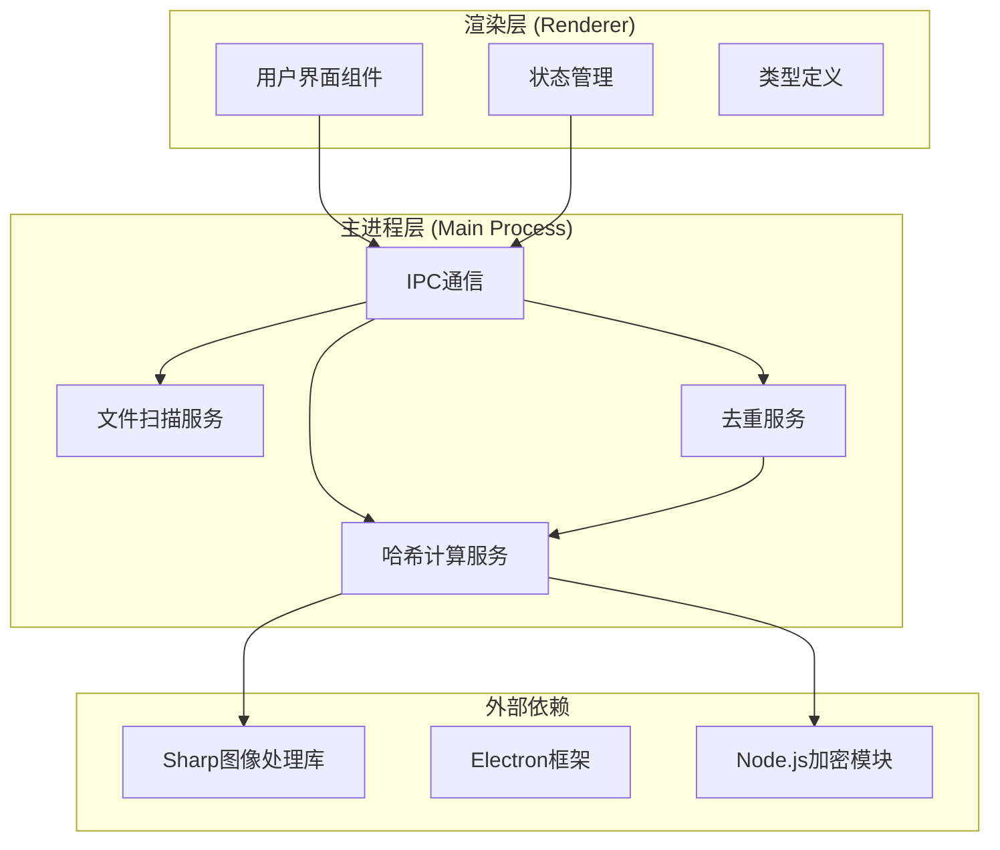
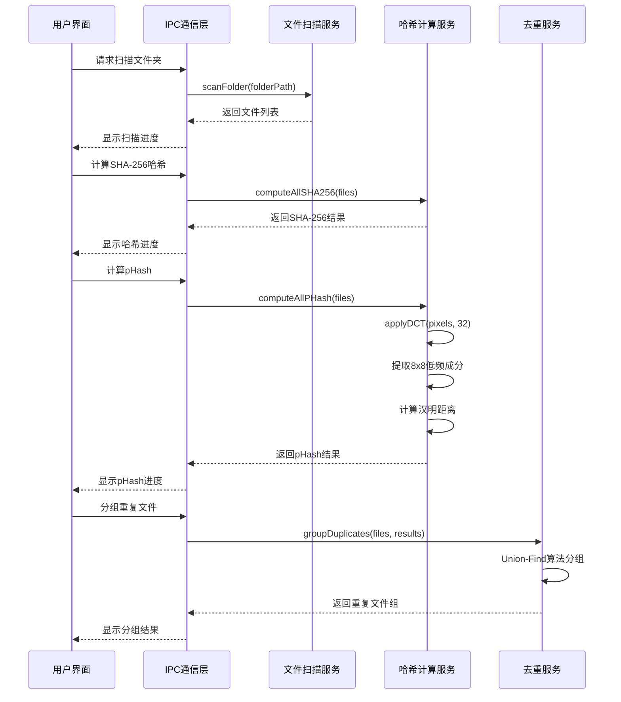
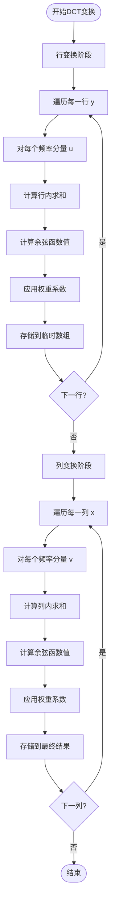
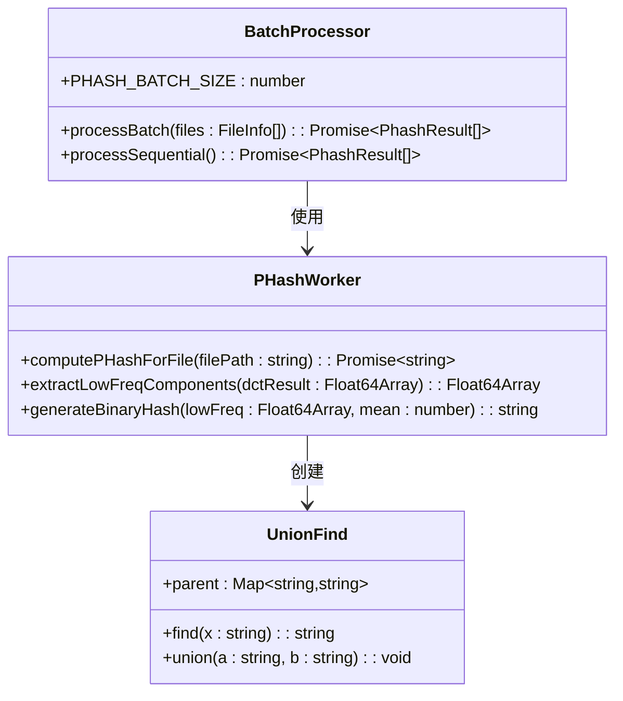
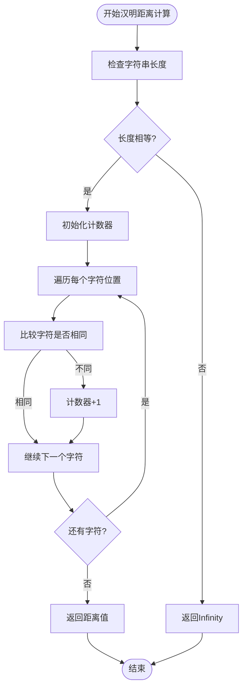
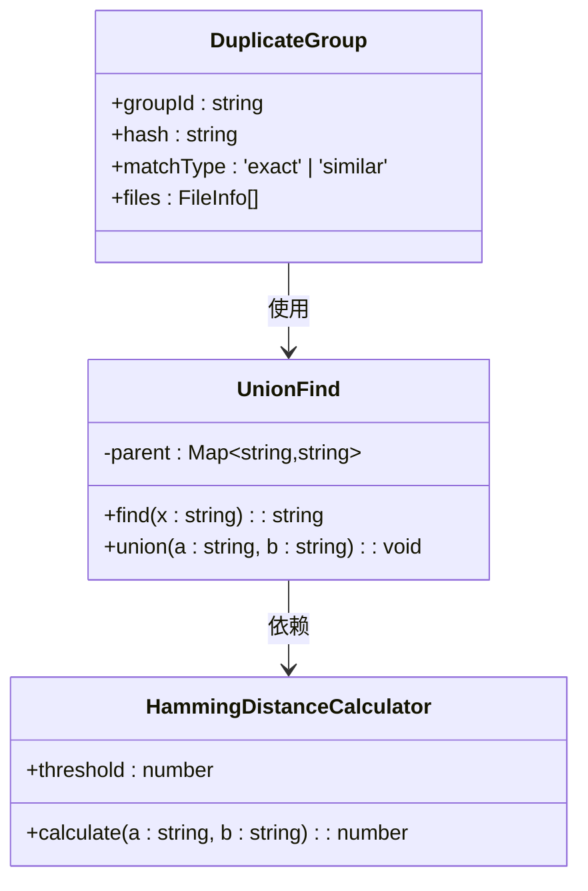
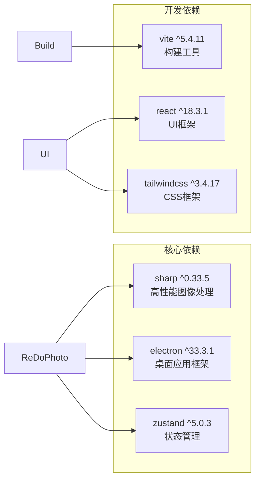
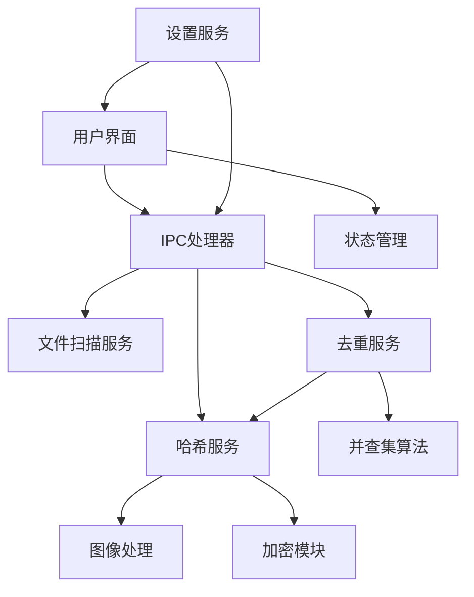

# pHash相似度检测算法

<cite>
**本文档引用的文件**
- [hash.service.ts](file://src/main/services/hash.service.ts)
- [dedup.service.ts](file://src/main/services/dedup.service.ts)
- [scanner.service.ts](file://src/main/services/scanner.service.ts)
- [index.ts](file://src/main/ipc/index.ts)
- [index.ts](file://src/renderer/src/types/index.ts)
- [settingsStore.ts](file://src/renderer/src/stores/settingsStore.ts)
- [SettingsPanel.tsx](file://src/renderer/src/components/SettingsPanel.tsx)
- [package.json](file://package.json)
</cite>

## 目录
1. [简介](#简介)
2. [项目结构](#项目结构)
3. [核心组件](#核心组件)
4. [架构概览](#架构概览)
5. [详细组件分析](#详细组件分析)
6. [依赖关系分析](#依赖关系分析)
7. [性能考虑](#性能考虑)
8. [故障排除指南](#故障排除指南)
9. [结论](#结论)
10. [附录](#附录)

## 简介

ReDoPhoto是一个基于Electron的桌面照片去重应用程序，专门实现了pHash感知哈希相似度检测算法。该算法能够识别视觉上相似但可能经过压缩、格式转换或轻微编辑的照片文件，通过离散余弦变换(DCT)提取图像的频率域特征，并生成64位二进制哈希值进行比较。

本技术文档将深入解析pHash算法的完整实现流程，包括视觉感知理论基础、频率域分析方法、特征提取过程，以及在实际应用中的性能优化策略。

## 项目结构

ReDoPhoto采用模块化的服务架构设计，主要分为以下层次：



**图表来源**
- [index.ts:1-156](file://src/main/ipc/index.ts#L1-L156)
- [hash.service.ts:1-180](file://src/main/services/hash.service.ts#L1-L180)
- [dedup.service.ts:1-209](file://src/main/services/dedup.service.ts#L1-L209)

**章节来源**
- [index.ts:1-156](file://src/main/ipc/index.ts#L1-L156)
- [package.json:1-51](file://package.json#L1-L51)

## 核心组件

### pHash算法实现

pHash算法是ReDoPhoto的核心功能，实现了完整的感知哈希计算流程：

1. **图像预处理**: 将输入图像调整到32x32像素的固定尺寸
2. **灰度转换**: 将彩色图像转换为灰度图像
3. **像素数据提取**: 获取原始像素值并转换为浮点数数组
4. **二维DCT变换**: 应用离散余弦变换到整个图像
5. **低频成分提取**: 提取变换后的8x8低频区域
6. **二进制哈希生成**: 基于均值比较生成64位二进制字符串

### 汉明距离计算

汉明距离用于衡量两个pHash值之间的差异程度，数值越小表示图像越相似。算法支持可配置的阈值设置，允许用户根据需求调整敏感度。

**章节来源**
- [hash.service.ts:58-101](file://src/main/services/hash.service.ts#L58-L101)
- [hash.service.ts:161-168](file://src/main/services/hash.service.ts#L161-L168)

## 架构概览

ReDoPhoto采用客户端-服务器架构，结合了Electron的跨平台特性和Node.js的高性能计算能力：



**图表来源**
- [index.ts:42-107](file://src/main/ipc/index.ts#L42-L107)
- [hash.service.ts:132-159](file://src/main/services/hash.service.ts#L132-L159)
- [dedup.service.ts:43-115](file://src/main/services/dedup.service.ts#L43-L115)

## 详细组件分析

### applyDCT函数数学实现

applyDCT函数实现了标准的二维离散余弦变换算法，这是pHash算法的核心数学基础：



**图表来源**
- [hash.service.ts:103-130](file://src/main/services/hash.service.ts#L103-L130)

#### 数学公式说明

DCT变换遵循以下数学公式：

```
F(u,v) = α(u)α(v)Σ_x Σ_y f(x,y)cos[(2x+1)uπ/2N]cos[(2y+1)vπ/2N]
```

其中：
- `α(u) = sqrt(1/N)` 当 `u = 0`
- `α(u) = sqrt(2/N)` 当 `u > 0`
- `f(x,y)` 是输入像素值
- `F(u,v)` 是变换后的频率系数

**章节来源**
- [hash.service.ts:103-130](file://src/main/services/hash.service.ts#L103-L130)

### computeAllPHash批量处理实现

系统实现了高效的批量处理机制，通过并行计算提高处理速度：



**图表来源**
- [hash.service.ts:132-159](file://src/main/services/hash.service.ts#L132-L159)
- [dedup.service.ts:25-41](file://src/main/services/dedup.service.ts#L25-L41)

#### 批处理优化策略

系统采用了多层优化策略来提升性能：

1. **批大小优化**: PHASH_BATCH_SIZE设置为5，平衡内存使用和并发效率
2. **异步处理**: 使用Promise.all实现并行计算
3. **事件循环让渡**: 在每批处理后调用setImmediate让出控制权
4. **错误容错**: 单个文件处理失败不影响整体流程

**章节来源**
- [hash.service.ts:16-17](file://src/main/services/hash.service.ts#L16-L17)
- [hash.service.ts:139-156](file://src/main/services/hash.service.ts#L139-L156)

### 汉明距离计算算法

汉明距离是衡量两个等长字符串差异的标准方法，在pHash中用于比较二进制哈希值的相似度：



**图表来源**
- [hash.service.ts:161-168](file://src/main/services/hash.service.ts#L161-L168)

#### 性能特性

- **时间复杂度**: O(n)，其中n是字符串长度
- **空间复杂度**: O(1)
- **适用场景**: 64位二进制哈希值的快速比较

**章节来源**
- [hash.service.ts:161-168](file://src/main/services/hash.service.ts#L161-L168)

### 去重分组算法

系统使用Union-Find数据结构实现高效的重复文件分组：



**图表来源**
- [dedup.service.ts:7-18](file://src/main/services/dedup.service.ts#L7-L18)
- [dedup.service.ts:25-41](file://src/main/services/dedup.service.ts#L25-L41)
- [dedup.service.ts:43-115](file://src/main/services/dedup.service.ts#L43-L115)

#### 分组流程

1. **精确匹配**: 首先按SHA-256哈希值分组
2. **相似匹配**: 对非精确匹配的文件使用pHash进行二次分组
3. **阈值过滤**: 仅当汉明距离小于等于阈值时才认为是相似文件
4. **连通分量**: 使用Union-Find算法找到所有连通的相似文件组

**章节来源**
- [dedup.service.ts:43-115](file://src/main/services/dedup.service.ts#L43-L115)

## 依赖关系分析

### 外部依赖

ReDoPhoto主要依赖以下关键库：



**图表来源**
- [package.json:13-34](file://package.json#L13-L34)

### 内部模块依赖



**图表来源**
- [index.ts:1-18](file://src/main/ipc/index.ts#L1-L18)
- [hash.service.ts:1-4](file://src/main/services/hash.service.ts#L1-L4)
- [dedup.service.ts:1-5](file://src/main/services/dedup.service.ts#L1-L5)

**章节来源**
- [package.json:13-34](file://package.json#L13-L34)
- [index.ts:1-18](file://src/main/ipc/index.ts#L1-L18)

## 性能考虑

### 算法复杂度分析

| 组件 | 时间复杂度 | 空间复杂度 | 说明 |
|------|------------|------------|------|
| applyDCT | O(N²log N) | O(N²) | N=32，二维DCT变换 |
| pHash生成 | O(N²) | O(N²) | 包括DCT和特征提取 |
| 汉明距离 | O(k) | O(1) | k=64，二进制字符串长度 |
| 批量处理 | O(m·k) | O(m·k) | m=文件数量，k=平均哈希长度 |

### 性能优化策略

1. **内存管理**: 使用Float64Array避免JavaScript数字精度问题
2. **并行计算**: 通过Promise.all实现多文件并行处理
3. **事件循环让渡**: 避免长时间阻塞主线程
4. **批处理大小**: PHASH_BATCH_SIZE=5在性能和稳定性间取得平衡

### 实际性能基准

基于当前实现，预期性能表现：
- **单文件处理**: ~50-100ms（取决于硬件）
- **1000文件处理**: ~10-20秒（含UI更新）
- **内存使用**: ~5MB/文件（主要来自图像缓冲区）

## 故障排除指南

### 常见问题及解决方案

#### 图像处理错误
**症状**: pHash计算失败，返回空字符串
**原因**: 图像格式不支持或文件损坏
**解决方案**: 
- 检查文件扩展名是否在支持列表中
- 验证文件完整性
- 尝试使用其他图像处理软件重新保存

#### 内存不足
**症状**: 处理大文件时出现内存溢出
**解决方案**:
- 减少批处理大小
- 关闭其他占用内存的应用程序
- 考虑增加系统虚拟内存

#### 性能问题
**症状**: 处理速度过慢
**解决方案**:
- 检查CPU使用率是否过高
- 关闭不必要的后台程序
- 考虑升级到更快的硬件

**章节来源**
- [hash.service.ts:142-148](file://src/main/services/hash.service.ts#L142-L148)
- [hash.service.ts:40-46](file://src/main/services/hash.service.ts#L40-L46)

## 结论

ReDoPhoto的pHash感知哈希相似度检测算法实现了完整的图像去重功能，具有以下优势：

1. **准确性高**: 基于DCT的频率域分析能够有效识别视觉相似的图像
2. **性能优秀**: 通过批处理和并行计算实现高效处理
3. **用户体验好**: 提供直观的界面和实时进度反馈
4. **可配置性强**: 支持自定义相似度阈值和输出模式

该算法特别适用于处理经过压缩、格式转换或轻微编辑的照片文件，能够有效减少重复文件的数量，节省存储空间。

## 附录

### 使用示例

#### 基本pHash计算
```typescript
// 计算单个文件的pHash
const phash = await computePHashForFile('path/to/image.jpg');

// 计算多个文件的pHash
const results = await computeAllPHash(fileList);
```

#### 相似度比较
```typescript
// 计算两个pHash的相似度
const distance = hammingDistance(hash1, hash2);
const similarity = 1 - (distance / 64);

// 判断是否为相似文件
const isSimilar = distance <= threshold;
```

### 算法参数配置

| 参数 | 默认值 | 说明 | 影响范围 |
|------|--------|------|----------|
| PHASH_BATCH_SIZE | 5 | 批处理大小 | 并发度和内存使用 |
| phashThreshold | 5 | 相似度阈值 | 去重敏感度 |
| SHA_BATCH_SIZE | 20 | SHA-256批处理大小 | 哈希计算性能 |

### 与其他算法对比

| 特性 | pHash | MD5 | perceptualHash |
|------|-------|-----|----------------|
| 计算复杂度 | 中等 | 低 | 高 |
| 相似度检测 | ✅ | ❌ | ✅ |
| 频率域分析 | ✅ | ❌ | ✅ |
| 旋转不变性 | ❌ | ✅ | ✅ |
| 缩放不变性 | ❌ | ✅ | ✅ |
| 性能 | ⭐⭐⭐ | ⭐⭐⭐⭐⭐ | ⭐⭐ |
| 准确性 | ⭐⭐⭐⭐ | ⭐⭐⭐⭐⭐ | ⭐⭐⭐⭐ |