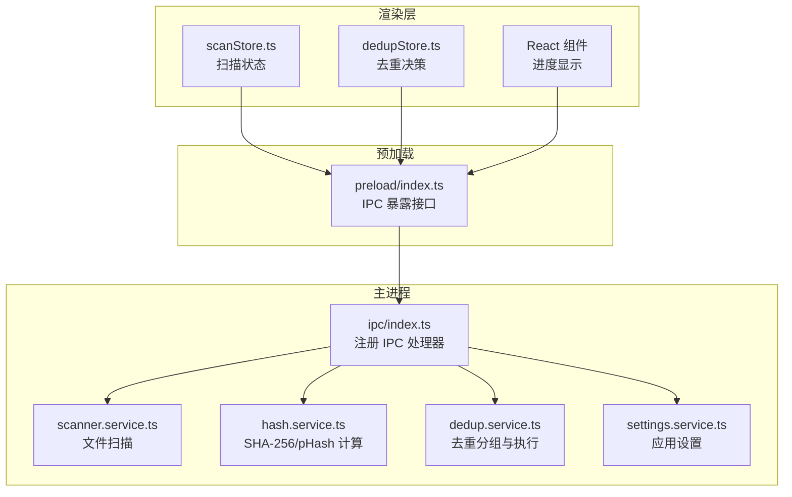
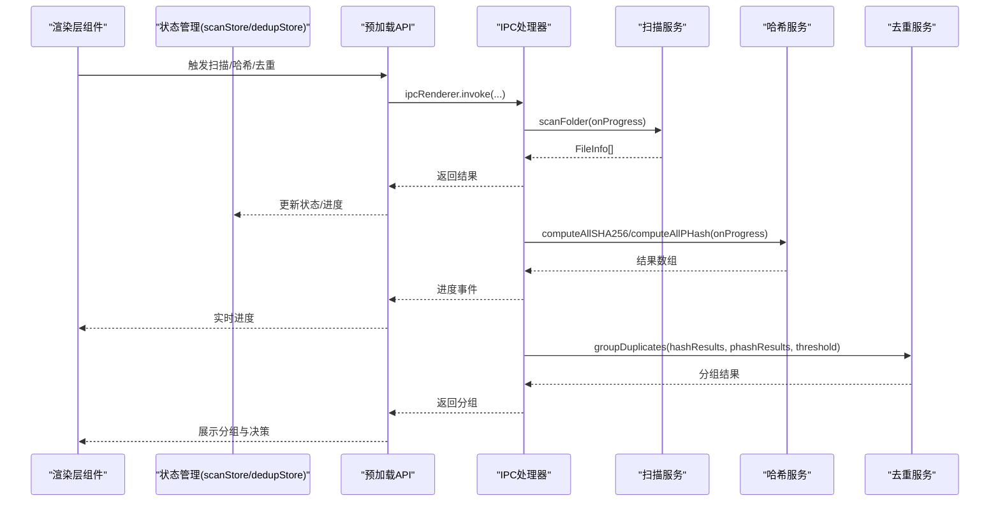
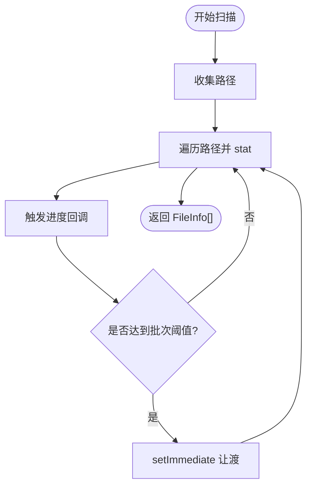
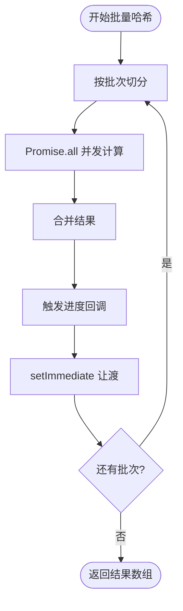
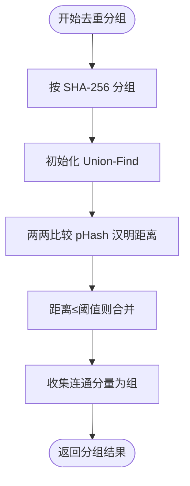
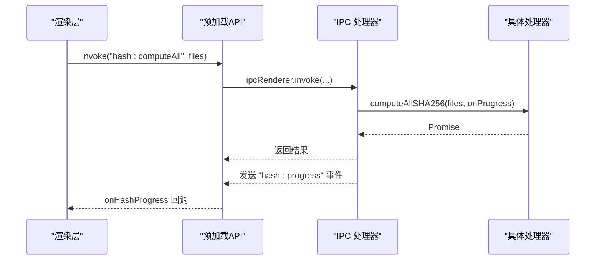
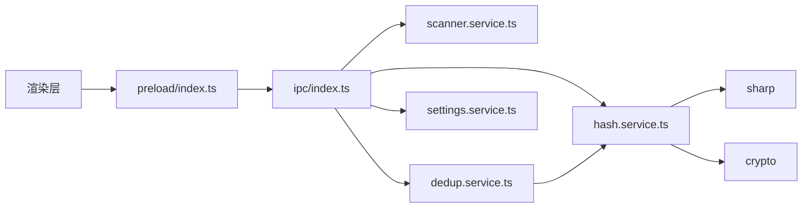

# 哈希计算性能优化

<cite>
**本文档引用的文件**
- [src\main\services\hash.service.ts](file://src\main\services\hash.service.ts)
- [src\main\services\dedup.service.ts](file://src\main\services\dedup.service.ts)
- [src\main\services\scanner.service.ts](file://src\main\services\scanner.service.ts)
- [src\main\ipc\index.ts](file://src\main\ipc\index.ts)
- [src\main\services\settings.service.ts](file://src\main\services\settings.service.ts)
- [src\renderer\src\stores\scanStore.ts](file://src\renderer\src\stores\scanStore.ts)
- [src\renderer\src\stores\dedupStore.ts](file://src\renderer\src\stores\dedupStore.ts)
- [src\preload\index.ts](file://src\preload\index.ts)
- [src\main\index.ts](file://src\main\index.ts)
</cite>

## 目录
1. [引言](#引言)
2. [项目结构](#项目结构)
3. [核心组件](#核心组件)
4. [架构概览](#架构概览)
5. [详细组件分析](#详细组件分析)
6. [依赖关系分析](#依赖关系分析)
7. [性能考量与优化策略](#性能考量与优化策略)
8. [故障排除指南](#故障排除指南)
9. [结论](#结论)
10. [附录：基准测试与最佳实践](#附录基准测试与最佳实践)

## 引言
本技术文档聚焦于哈希计算性能优化，系统性解析项目中两种核心算法的性能特征与适用场景：SHA-256 的精确匹配优势与 pHash 的相似度检测能力。文档深入阐述批量处理优化策略（SHA_BATCH_SIZE 与 PHASH_BATCH_SIZE 的选择依据）、内存使用优化与 CPU 资源分配；同时全面说明并发控制机制（Promise.all 的使用、setImmediate 的调度策略与异步任务管理）、进度监控实现（onProgress 回调、实时反馈与用户体验优化），并提供性能调优建议（文件大小分类处理、内存限制控制与错误恢复策略）。最后给出可操作的基准测试思路与最佳实践指南。

## 项目结构
该项目采用 Electron + React 架构，主进程负责文件扫描、哈希计算与去重执行，渲染层通过 IPC 与主进程通信，实现进度反馈与用户交互。关键模块如下：
- 主进程服务层：扫描、哈希、去重、设置
- IPC 层：桥接渲染层与主进程服务
- 渲染层状态管理：扫描状态、去重决策状态
- 预加载脚本：暴露安全的 API 给渲染层

**图表来源**
- [src\renderer\src\stores\scanStore.ts:1-52](file://src\renderer\src\stores\scanStore.ts#L1-L52)
- [src\renderer\src\stores\dedupStore.ts:1-83](file://src\renderer\src\stores\dedupStore.ts#L1-L83)
- [src\preload\index.ts:98-122](file://src\preload\index.ts#L98-L122)
- [src\main\ipc\index.ts:22-156](file://src\main\ipc\index.ts#L22-L156)
- [src\main\services\scanner.service.ts:28-86](file://src\main\services\scanner.service.ts#L28-L86)
- [src\main\services\hash.service.ts:19-179](file://src\main\services\hash.service.ts#L19-L179)
- [src\main\services\dedup.service.ts:43-130](file://src\main\services\dedup.service.ts#L43-L130)
- [src\main\services\settings.service.ts:1-34](file://src\main\services\settings.service.ts#L1-L34)

**章节来源**
- [src\main\index.ts:1-60](file://src\main\index.ts#L1-L60)
- [src\main\ipc\index.ts:22-156](file://src\main\ipc\index.ts#L22-L156)
- [src\main\services\scanner.service.ts:28-86](file://src\main\services\scanner.service.ts#L28-L86)
- [src\main\services\hash.service.ts:19-179](file://src\main\services\hash.service.ts#L19-L179)
- [src\main\services\dedup.service.ts:43-130](file://src\main\services\dedup.service.ts#L43-L130)
- [src\main\services\settings.service.ts:1-34](file://src\main\services\settings.service.ts#L1-L34)
- [src\renderer\src\stores\scanStore.ts:1-52](file://src\renderer\src\stores\scanStore.ts#L1-L52)
- [src\renderer\src\stores\dedupStore.ts:1-83](file://src\renderer\src\stores\dedupStore.ts#L1-L83)
- [src\preload\index.ts:98-122](file://src\preload\index.ts#L98-L122)

## 核心组件
- 扫描服务：递归遍历目录，收集受支持扩展名的文件，生成 FileInfo 列表，并在统计阶段进行进度回调与事件让渡。
- 哈希服务：提供单文件 SHA-256 流式计算与批量处理；提供 pHash 计算（基于 DCT 的感知哈希）与批量处理；提供汉明距离用于相似度判定。
- 去重服务：先按 SHA-256 精确分组，再对非精确组按 pHash 进行相似度分组（Union-Find + 汉明距离阈值）。
- IPC 层：统一处理扫描、哈希、pHash、分组、执行等 IPC 请求，并向渲染层发送进度事件。
- 设置服务：持久化应用设置（哈希模式、阈值、输出模式等）。
- 渲染状态：扫描状态与去重决策状态，支撑 UI 交互与进度展示。

**章节来源**
- [src\main\services\scanner.service.ts:28-86](file://src\main\services\scanner.service.ts#L28-L86)
- [src\main\services\hash.service.ts:19-179](file://src\main\services\hash.service.ts#L19-L179)
- [src\main\services\dedup.service.ts:43-130](file://src\main\services\dedup.service.ts#L43-L130)
- [src\main\ipc\index.ts:42-151](file://src\main\ipc\index.ts#L42-L151)
- [src\main\services\settings.service.ts:1-34](file://src\main\services\settings.service.ts#L1-L34)
- [src\renderer\src\stores\scanStore.ts:1-52](file://src\renderer\src\stores\scanStore.ts#L1-L52)
- [src\renderer\src\stores\dedupStore.ts:1-83](file://src\renderer\src\stores\dedupStore.ts#L1-L83)

## 架构概览
下图展示了从渲染层到主进程服务的完整流程，以及各阶段的并发与进度控制策略。

**图表来源**
- [src\main\ipc\index.ts:42-151](file://src\main\ipc\index.ts#L42-L151)
- [src\main\services\scanner.service.ts:28-86](file://src\main\services\scanner.service.ts#L28-L86)
- [src\main\services\hash.service.ts:29-159](file://src\main\services\hash.service.ts#L29-L159)
- [src\main\services\dedup.service.ts:43-130](file://src\main\services\dedup.service.ts#L43-L130)
- [src\renderer\src\stores\scanStore.ts:1-52](file://src\renderer\src\stores\scanStore.ts#L1-L52)
- [src\renderer\src\stores\dedupStore.ts:1-83](file://src\renderer\src\stores\dedupStore.ts#L1-L83)
- [src\preload\index.ts:98-122](file://src\preload\index.ts#L98-L122)

## 详细组件分析

### 扫描服务（文件发现与进度）
- 功能要点
  - 递归遍历目录，过滤受支持扩展名，生成 FileInfo 列表。
  - 在统计阶段逐个调用 fs.stat 并触发 onProgress 回调。
  - 每处理约 50 个文件后通过 setImmediate 让渡事件循环，避免阻塞。
- 性能影响
  - IO 密集型，事件让渡有助于保持 UI 响应。
  - 文件数较多时，建议结合文件大小或修改时间进行分批处理。

**图表来源**
- [src\main\services\scanner.service.ts:28-86](file://src\main\services\scanner.service.ts#L28-L86)

**章节来源**
- [src\main\services\scanner.service.ts:28-86](file://src\main\services\scanner.service.ts#L28-L86)

### 哈希服务（SHA-256 与 pHash 批量计算）
- SHA-256
  - 单文件：基于流式读取与 crypto 模块，边读边更新哈希，内存占用低。
  - 批量：固定批次大小（SHA_BATCH_SIZE=20），每批使用 Promise.all 并发计算，完成后触发进度回调并 setImmediate 让渡。
- pHash
  - 单文件：使用 sharp 将图像缩放至 32x32 灰度，提取原始像素，执行二维 DCT，取低频 8x8 区块，计算均值并生成 64 位二进制字符串。
  - 批量：固定批次大小（PHASH_BATCH_SIZE=5），并发计算，过滤空结果，触发进度回调并 setImmediate 让渡。
- 相似度判定
  - 使用汉明距离（hammingDistance）比较两个 pHash 字符串，距离越小越相似。

**图表来源**
- [src\main\services\hash.service.ts:29-56](file://src\main\services\hash.service.ts#L29-L56)
- [src\main\services\hash.service.ts:132-159](file://src\main\services\hash.service.ts#L132-L159)

**章节来源**
- [src\main\services\hash.service.ts:19-179](file://src\main\services\hash.service.ts#L19-L179)

### 去重服务（精确匹配与相似度分组）
- 精确匹配（SHA-256）
  - 先按 sha256 值分组，长度 ≥ 2 的组即为精确重复组。
- 相似度分组（pHash）
  - 对非精确组的文件进行 pHash 计算，使用 Union-Find 维护连通分量，汉明距离 ≤ 阈值则合并。
  - 收集最终的相似重复组，标记 matchType='similar'。
- 执行去重
  - 支持删除或复制模式，分别通过 executeDeleteMode 与 executeCopyMode 实现。
  - 在执行过程中定期 setImmediate 让渡，保证 UI 响应。

**图表来源**
- [src\main\services\dedup.service.ts:43-115](file://src\main\services\dedup.service.ts#L43-L115)

**章节来源**
- [src\main\services\dedup.service.ts:43-130](file://src\main\services\dedup.service.ts#L43-L130)

### IPC 层（进度事件与工作流编排）
- 提供 folder:scan、hash:computeAll、phash:computeAll、dedup:group、dedup:execute 等 IPC 接口。
- 将主进程内部的进度回调转换为统一的进度事件（phase、current、total、percentage），发送给渲染层。
- 缓存扫描结果，便于后续去重与执行阶段使用。

**图表来源**
- [src\main\ipc\index.ts:55-83](file://src\main\ipc\index.ts#L55-L83)
- [src\main\services\hash.service.ts:29-56](file://src\main\services\hash.service.ts#L29-L56)
- [src\preload\index.ts:98-122](file://src\preload\index.ts#L98-L122)

**章节来源**
- [src\main\ipc\index.ts:42-151](file://src\main\ipc\index.ts#L42-L151)
- [src\preload\index.ts:98-122](file://src\preload\index.ts#L98-L122)

## 依赖关系分析
- 模块耦合
  - IPC 层聚合扫描、哈希、去重服务，作为主进程唯一入口。
  - 去重服务依赖哈希服务的哈希结果与汉明距离工具。
  - 渲染层通过预加载 API 与 IPC 交互，状态管理驱动 UI。
- 外部依赖
  - crypto/sharp/fs/path：底层计算与文件系统访问。
  - electron-store：设置持久化。
  - zustand：轻量状态管理。

**图表来源**
- [src\main\ipc\index.ts:1-18](file://src\main\ipc\index.ts#L1-L18)
- [src\main\services\scanner.service.ts:1-6](file://src\main\services\scanner.service.ts#L1-L6)
- [src\main\services\hash.service.ts:1-4](file://src\main\services\hash.service.ts#L1-L4)
- [src\main\services\dedup.service.ts:1-5](file://src\main\services\dedup.service.ts#L1-L5)
- [src\main\services\settings.service.ts:1-34](file://src\main\services\settings.service.ts#L1-L34)
- [src\preload\index.ts:98-122](file://src\preload\index.ts#L98-L122)

**章节来源**
- [src\main\ipc\index.ts:1-18](file://src\main\ipc\index.ts#L1-L18)
- [src\main\services\hash.service.ts:1-4](file://src\main\services\hash.service.ts#L1-L4)
- [src\main\services\dedup.service.ts:1-5](file://src\main\services\dedup.service.ts#L1-L5)

## 性能考量与优化策略

### 批量处理参数选择（SHA_BATCH_SIZE 与 PHASH_BATCH_SIZE）
- 选择依据
  - SHA_BATCH_SIZE=20：IO 密集型（磁盘读取+哈希计算），适度并发可提升吞吐，同时避免过多文件句柄与内存峰值。
  - PHASH_BATCH_SIZE=5：CPU 密集型（DCT、像素处理），单次计算耗时较高，降低并发可减少内存抖动与上下文切换开销。
- 内存与 CPU 平衡
  - SHA-256：流式读取，内存占用稳定；并发主要受磁盘带宽与文件系统限制。
  - pHash：需要完整像素缓冲（32x32=1024 像素），Float64Array 占用较大，需谨慎控制并发度。
- 动态调整建议
  - 根据机器配置与文件大小分布动态调整批次大小；在 UI 中暴露设置项以满足不同场景。

**章节来源**
- [src\main\services\hash.service.ts:16-17](file://src\main\services\hash.service.ts#L16-L17)
- [src\main\services\hash.service.ts:29-56](file://src\main\services\hash.service.ts#L29-L56)
- [src\main\services\hash.service.ts:132-159](file://src\main\services\hash.service.ts#L132-L159)

### 并发控制与事件让渡
- Promise.all 并发：在每个批次内并行计算，最大化吞吐。
- setImmediate 让渡：在批次间与执行关键步骤后让渡事件循环，避免主线程阻塞，保障 UI 响应。
- 适用场景
  - 大文件列表：优先使用较小批次与更频繁的让渡。
  - SSD/高带宽：可适当增大 SHA 批次，减小 pHash 批次。

**章节来源**
- [src\main\services\hash.service.ts:38-52](file://src\main\services\hash.service.ts#L38-L52)
- [src\main\services\hash.service.ts:141-155](file://src\main\services\hash.service.ts#L141-L155)
- [src\main\services\scanner.service.ts:78-82](file://src\main\services\scanner.service.ts#L78-L82)
- [src\main\services\dedup.service.ts:154-156](file://src\main\services\dedup.service.ts#L154-L156)
- [src\main\services\dedup.service.ts:202-204](file://src\main\services\dedup.service.ts#L202-L204)

### 进度监控与用户体验
- 进度回调
  - 扫描：每统计约 50 个文件触发一次进度。
  - 哈希：每完成一个批次触发一次进度。
  - 去重执行：复制/删除阶段按文件计数触发进度。
- 实时反馈
  - IPC 将进度封装为统一格式（phase/current/total/percentage），渲染层据此更新进度条与百分比。
- 用户体验优化
  - 在渲染层显示当前处理文件名、剩余时间估算（可选）、暂停/取消按钮（可选）。

**章节来源**
- [src\main\services\scanner.service.ts:75-77](file://src\main\services\scanner.service.ts#L75-L77)
- [src\main\services\hash.service.ts:49-51](file://src\main\services\hash.service.ts#L49-L51)
- [src\main\services\hash.service.ts:152-154](file://src\main\services\hash.service.ts#L152-L154)
- [src\main\services\dedup.service.ts:147-148](file://src\main\services\dedup.service.ts#L147-L148)
- [src\main\ipc\index.ts:43-50](file://src\main\ipc\index.ts#L43-L50)
- [src\main\ipc\index.ts:59-66](file://src\main\ipc\index.ts#L59-L66)
- [src\main\ipc\index.ts:73-82](file://src\main\ipc\index.ts#L73-L82)
- [src\main\ipc\index.ts:132-139](file://src\main\ipc\index.ts#L132-L139)

### 错误处理与健壮性
- 单文件错误
  - 哈希计算捕获异常并返回占位符，避免中断整个批次。
  - pHash 批量过滤空结果，确保后续分组逻辑稳定。
- 执行阶段错误
  - 删除/复制失败记录错误列表，继续处理剩余文件，保证整体流程可控。
- 建议
  - 在 UI 中展示错误汇总，允许用户重试或跳过失败项。

**章节来源**
- [src\main\services\hash.service.ts:43-45](file://src\main\services\hash.service.ts#L43-L45)
- [src\main\services\hash.service.ts:146-148](file://src\main\services\hash.service.ts#L146-L148)
- [src\main\services\dedup.service.ts:151-153](file://src\main\services\dedup.service.ts#L151-L153)
- [src\main\services\dedup.service.ts:198-200](file://src\main\services\dedup.service.ts#L198-L200)

### 文件大小分类与资源控制
- 分类策略
  - 小文件（<1MB）：提高 SHA 批次，降低 pHash 批次。
  - 中等文件（1-10MB）：平衡批次大小。
  - 大文件（>10MB）：降低并发，增加 setImmediate 让渡频率。
- 内存限制
  - 控制批次大小与中间数组尺寸，避免峰值内存过高。
  - 对 pHash 的像素缓冲进行及时释放（由 GC 管理，但需控制并发度）。
- CPU 资源分配
  - 在 UI 中提供“后台运行”选项，降低批大小与让渡频率，减少对前台操作的影响。

**章节来源**
- [src\main\services\hash.service.ts:16-17](file://src\main\services\hash.service.ts#L16-L17)
- [src\main\services\hash.service.ts:36-53](file://src\main\services\hash.service.ts#L36-L53)
- [src\main\services\hash.service.ts:139-156](file://src\main\services\hash.service.ts#L139-L156)

## 故障排除指南
- 哈希计算卡顿
  - 检查批次大小是否过大；适当降低 PHASH_BATCH_SIZE 或增加 setImmediate 让渡频率。
  - 确认磁盘 IO 是否受限（机械硬盘 vs SSD）。
- pHash 结果为空
  - 某些文件可能无法解码或尺寸不满足要求；检查文件完整性与格式支持。
- 去重分组异常
  - 确保 SHA-256 结果无错误标记；检查汉明距离阈值设置是否合理。
- 执行阶段失败
  - 查看错误列表，确认权限与目标路径有效性；必要时分批重试。

**章节来源**
- [src\main\services\hash.service.ts:43-45](file://src\main\services\hash.service.ts#L43-L45)
- [src\main\services\hash.service.ts:146-148](file://src\main\services\hash.service.ts#L146-L148)
- [src\main\services\dedup.service.ts:151-153](file://src\main\services\dedup.service.ts#L151-L153)
- [src\main\services\dedup.service.ts:198-200](file://src\main\services\dedup.service.ts#L198-L200)

## 结论
本项目在哈希计算方面实现了清晰的分层设计与合理的并发控制：SHA-256 侧重精确匹配与高吞吐，pHash 侧重相似度检测与稳健性。通过固定批次大小、Promise.all 并发与 setImmediate 让渡，系统在不同硬件条件下均能保持较好的响应性与稳定性。建议在实际部署中结合文件规模分布与硬件配置动态调整批次参数，并完善 UI 反馈与错误处理，以获得最佳用户体验。

## 附录：基准测试与最佳实践

### 基准测试思路
- 测试环境
  - 不同存储介质（SSD/HDD）、不同 CPU（多核/单核）、不同文件规模分布。
- 指标
  - 总耗时、平均/峰值内存、CPU 利用率、UI 响应延迟、错误率。
- 方法
  - 固定文件集，分别测试仅 SHA-256、仅 pHash、两者组合三种模式。
  - 调整 SHA_BATCH_SIZE 与 PHASH_BATCH_SIZE，记录性能变化曲线。
  - 在不同 setImmediate 让渡频率下对比 UI 响应流畅度。

### 最佳实践
- 参数调优
  - 默认：SHA_BATCH_SIZE=20，PHASH_BATCH_SIZE=5；根据实测结果微调。
  - 高并发场景：优先保证 UI 响应，降低批次大小与让渡频率。
- 资源控制
  - 监控内存峰值，避免长时间高并发导致 OOM。
  - 对超大文件单独处理，避免拖慢整体进度。
- 错误恢复
  - 失败文件单独记录，支持重试与跳过；在 UI 中提供可视化提示。
- 用户体验
  - 显示当前处理文件名与预计剩余时间；提供暂停/继续功能（可选）。