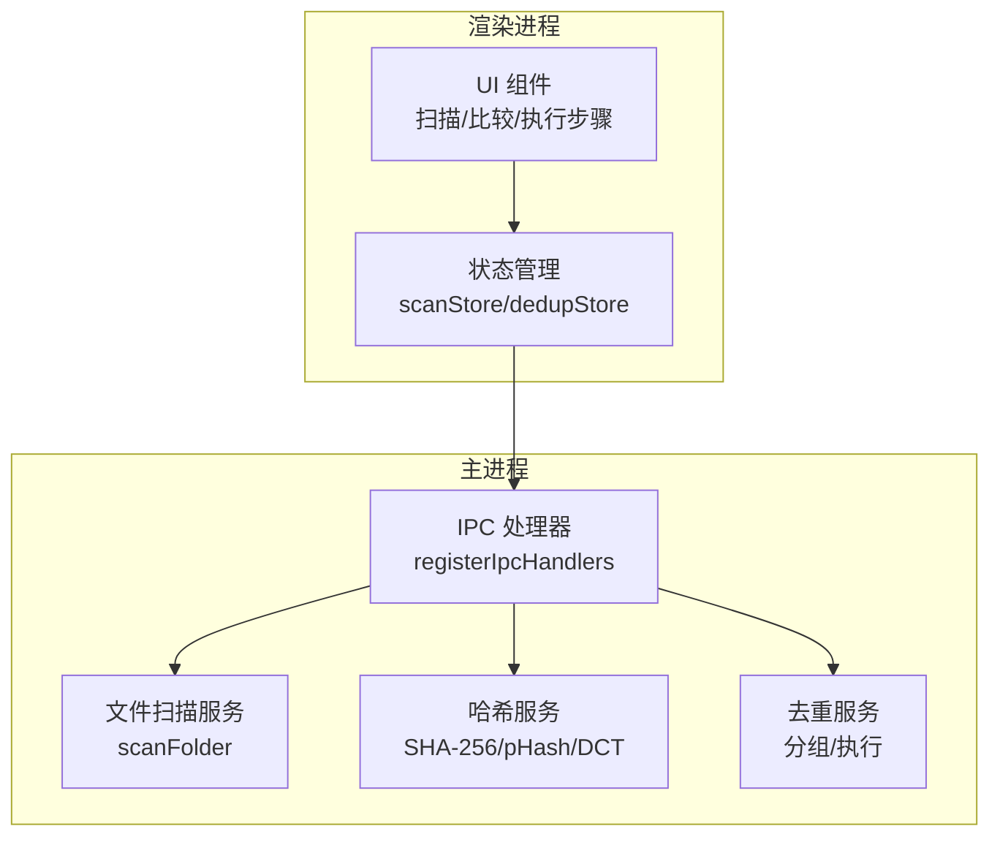
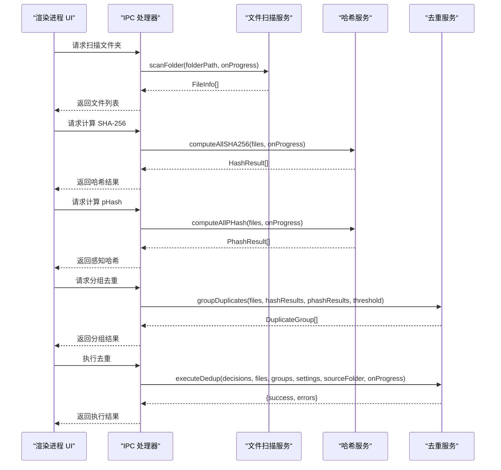
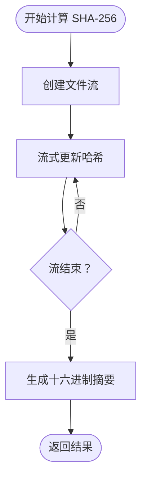
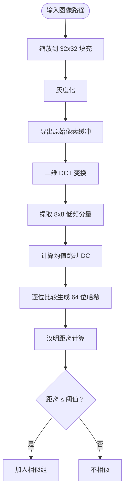
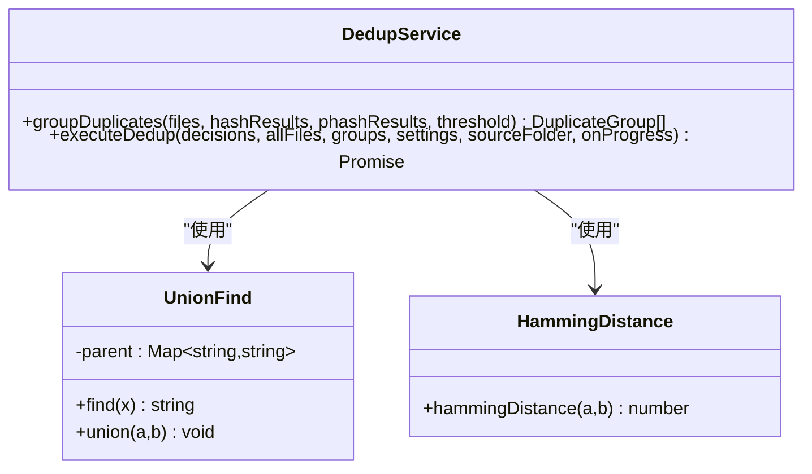
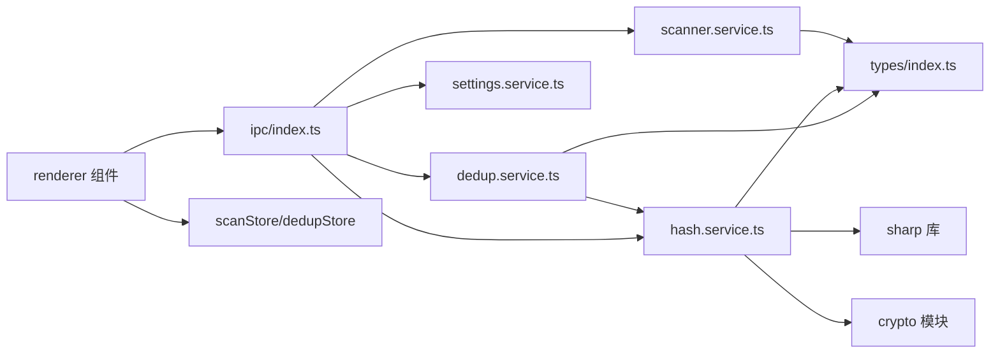

# 哈希计算服务

<cite>
**本文档引用的文件**
- [hash.service.ts](file://src/main/services/hash.service.ts)
- [dedup.service.ts](file://src/main/services/dedup.service.ts)
- [scanner.service.ts](file://src/main/services/scanner.service.ts)
- [ipc/index.ts](file://src/main/ipc/index.ts)
- [settings.service.ts](file://src/main/services/settings.service.ts)
- [scanStore.ts](file://src/renderer/src/stores/scanStore.ts)
- [dedupStore.ts](file://src/renderer/src/stores/dedupStore.ts)
- [CompareStep.tsx](file://src/renderer/src/components/CompareStep.tsx)
- [ExecuteStep.tsx](file://src/renderer/src/components/ExecuteStep.tsx)
- [index.ts](file://src/renderer/src/types/index.ts)
- [package.json](file://package.json)
</cite>

## 目录
1. [简介](#简介)
2. [项目结构](#项目结构)
3. [核心组件](#核心组件)
4. [架构总览](#架构总览)
5. [详细组件分析](#详细组件分析)
6. [依赖关系分析](#依赖关系分析)
7. [性能考量](#性能考量)
8. [故障排查指南](#故障排查指南)
9. [结论](#结论)
10. [附录](#附录)

## 简介
本项目是一个基于 Electron 的桌面照片去重应用，提供两类核心算法：
- SHA-256 精确匹配：通过流式读取文件内容进行哈希计算，确保完全相同的文件被识别为重复。
- pHash 相似度检测：对图像进行预处理（缩放、灰度、像素提取），执行二维离散余弦变换（DCT），提取低频分量并生成感知哈希，用于识别视觉上相似但不完全相同的图片。

系统采用主进程与渲染进程分离的设计，通过 IPC 消息桥接数据与进度反馈；支持批量处理优化（批大小控制、事件循环让渡）、内存管理（流式读取、缓冲区复用）以及可配置的阈值与输出模式。

## 项目结构
后端服务位于 src/main，前端位于 src/renderer。IPC 层负责桥接前后端交互，服务层封装具体业务逻辑。

图表来源
- [ipc/index.ts:22-156](file://src/main/ipc/index.ts#L22-L156)
- [scanner.service.ts:28-86](file://src/main/services/scanner.service.ts#L28-L86)
- [hash.service.ts:19-180](file://src/main/services/hash.service.ts#L19-L180)
- [dedup.service.ts:43-209](file://src/main/services/dedup.service.ts#L43-L209)

章节来源
- [ipc/index.ts:22-156](file://src/main/ipc/index.ts#L22-L156)
- [scanner.service.ts:28-86](file://src/main/services/scanner.service.ts#L28-L86)
- [hash.service.ts:19-180](file://src/main/services/hash.service.ts#L19-L180)
- [dedup.service.ts:43-209](file://src/main/services/dedup.service.ts#L43-L209)

## 核心组件
- 文件扫描服务：递归遍历目录，筛选支持的图片扩展名，生成 FileInfo 列表并提供进度回调。
- 哈希服务：提供 SHA-256 流式计算与 pHash 计算，支持批量处理与进度反馈；内置汉明距离计算工具。
- 去重服务：先按 SHA-256 分组得到精确重复，再对非精确组按 pHash 进行相似分组（并查集），最后根据用户决策执行删除或复制。
- IPC 层：注册窗口控制、文件夹选择、扫描、哈希、pHash、分组、执行、缩略图生成、设置读写等处理器。
- 设置服务：持久化应用设置（哈希模式、阈值、输出模式、输出文件夹后缀）。
- 前端状态与组件：扫描状态、去重决策状态、比较与执行 UI 步骤，以及缩略图生成与进度展示。

章节来源
- [scanner.service.ts:8-86](file://src/main/services/scanner.service.ts#L8-L86)
- [hash.service.ts:6-180](file://src/main/services/hash.service.ts#L6-L180)
- [dedup.service.ts:7-209](file://src/main/services/dedup.service.ts#L7-L209)
- [ipc/index.ts:22-156](file://src/main/ipc/index.ts#L22-L156)
- [settings.service.ts:3-34](file://src/main/services/settings.service.ts#L3-L34)
- [scanStore.ts:6-52](file://src/renderer/src/stores/scanStore.ts#L6-L52)
- [dedupStore.ts:4-83](file://src/renderer/src/stores/dedupStore.ts#L4-L83)

## 架构总览
系统采用“渲染进程 UI + 主进程服务”的分层架构。渲染进程通过 window.api 调用 IPC 接口，主进程在后台执行耗时操作并发送进度事件到渲染进程。

图表来源
- [ipc/index.ts:42-142](file://src/main/ipc/index.ts#L42-L142)
- [scanner.service.ts:28-86](file://src/main/services/scanner.service.ts#L28-L86)
- [hash.service.ts:29-159](file://src/main/services/hash.service.ts#L29-L159)
- [dedup.service.ts:43-209](file://src/main/services/dedup.service.ts#L43-L209)

## 详细组件分析

### SHA-256 精确匹配算法
- 实现方式：使用 Node.js crypto 模块创建 SHA-256 哈希对象，通过流式读取文件内容更新哈希，结束后以十六进制字符串返回摘要。
- 批量处理：按固定批次大小（默认 20）分批并发计算，每批完成后触发进度回调；批次间让渡事件循环以避免阻塞。
- 错误处理：单文件计算异常时返回特定错误标记，保证整体流程继续推进。
- 性能特征：I/O 密集型，受磁盘吞吐影响；内存占用小，适合大规模文件扫描。

图表来源
- [hash.service.ts:19-27](file://src/main/services/hash.service.ts#L19-L27)
- [hash.service.ts:29-56](file://src/main/services/hash.service.ts#L29-L56)

章节来源
- [hash.service.ts:19-56](file://src/main/services/hash.service.ts#L19-L56)

### pHash 相似度检测算法
- 图像预处理：使用 sharp 将图像缩放到 32x32 像素，强制填充以保持尺寸一致，转换为灰度并导出原始像素缓冲。
- DCT 变换：实现二维离散余弦变换（DCT），分别对行和列执行一维 DCT，得到频率域矩阵。
- 低频提取与哈希：从 32x32 频域矩阵中提取左上角 8x8 区域作为低频分量；跳过直流分量（DC）后计算其余 63 个系数的均值，逐位比较生成 64 位二进制字符串作为感知哈希。
- 相似度判定：使用汉明距离衡量两个哈希之间的差异，小于等于阈值（默认 5）视为相似。

图表来源
- [hash.service.ts:58-101](file://src/main/services/hash.service.ts#L58-L101)
- [hash.service.ts:103-130](file://src/main/services/hash.service.ts#L103-L130)
- [hash.service.ts:161-168](file://src/main/services/hash.service.ts#L161-L168)

章节来源
- [hash.service.ts:58-168](file://src/main/services/hash.service.ts#L58-L168)

### 去重分组与执行
- 分组策略：
  - 精确重复：按 SHA-256 哈希分组，长度 ≥ 2 的组即为完全重复。
  - 相似重复：对非精确组（或其代表）使用 pHash 并查集（Union-Find）合并，汉明距离 ≤ 阈值的文件归为一组。
- 执行策略：
  - 删除模式：直接删除决策中的删除文件 ID（在删除模式下，删除 ID 实际为文件路径）。
  - 复制模式：在源文件夹旁创建输出文件夹，复制非重复与用户保留的文件，保持相对路径结构。

图表来源
- [dedup.service.ts:25-41](file://src/main/services/dedup.service.ts#L25-L41)
- [dedup.service.ts:43-115](file://src/main/services/dedup.service.ts#L43-L115)
- [hash.service.ts:161-168](file://src/main/services/hash.service.ts#L161-L168)

章节来源
- [dedup.service.ts:43-115](file://src/main/services/dedup.service.ts#L43-L115)
- [dedup.service.ts:117-209](file://src/main/services/dedup.service.ts#L117-L209)

### 批量处理优化
- 并发控制：SHA-256 批大小为 20，pHash 批大小为 5；每批内部使用 Promise.all 并发计算，减少总等待时间。
- 内存管理：使用流式读取避免一次性加载大文件至内存；pHash 使用 Float64Array 存储像素与中间结果，及时释放临时数组。
- 进度反馈：每批完成后触发进度回调，渲染进程实时显示百分比与当前文件名。
- 事件让渡：批次之间与部分长耗时操作后调用 setImmediate 让渡事件循环，避免 UI 卡顿。

章节来源
- [hash.service.ts:16-56](file://src/main/services/hash.service.ts#L16-L56)
- [hash.service.ts:139-159](file://src/main/services/hash.service.ts#L139-L159)
- [scanner.service.ts:78-82](file://src/main/services/scanner.service.ts#L78-L82)
- [dedup.service.ts:154-157](file://src/main/services/dedup.service.ts#L154-L157)
- [dedup.service.ts:202-205](file://src/main/services/dedup.service.ts#L202-L205)

### API 接口文档
以下为 IPC 接口规范（参数、返回值、错误处理）：

- 窗口控制
  - 接口：window:minimize / window:maximize / window:close
  - 参数：无
  - 返回：无
  - 错误：由 Electron 窗口 API 抛出

- 文件夹选择
  - 接口：folder:select
  - 参数：无
  - 返回：选中目录路径或 null
  - 错误：用户取消选择返回 null

- 文件夹扫描
  - 接口：folder:scan
  - 参数：{ folderPath: string }
  - 返回：FileInfo[]（含 id、path、name、size、ext、modifiedTime）
  - 进度：扫描阶段，发送 scan:progress（phase='scanning'）

- 计算 SHA-256
  - 接口：hash:computeAll
  - 参数：{ files: FileInfo[] }
  - 返回：HashResult[]（id、sha256）
  - 进度：哈希阶段，发送 hash:progress（phase='hashing'）

- 计算 pHash
  - 接口：phash:computeAll
  - 参数：{ files: FileInfo[] }
  - 返回：PhashResult[]（id、phash）
  - 进度：哈希阶段，发送 hash:progress（phase='phashing'）

- 分组去重
  - 接口：dedup:group
  - 参数：{ hashResults: HashResult[], phashResults?: PhashResult[], phashThreshold?: number }
  - 返回：DuplicateGroup[]（groupId、hash、matchType、files）
  - 说明：matchType 为 'exact' 或 'similar'

- 执行去重
  - 接口：dedup:execute
  - 参数：{ decisions: DedupDecision[], settings: DedupSettings, sourceFolder: string, files: FileInfo[] }
  - 返回：{ success: number, errors: string[] }
  - 进度：执行阶段，发送 dedup:progress（current、total、currentFile、percentage）

- 缩略图生成
  - 接口：file:thumbnail
  - 参数：{ filePath: string, maxSize?: number }
  - 返回：data:image/jpeg;base64,... 字符串

- 设置读写
  - 接口：settings:get / settings:set
  - 参数：settings:get -> 无；settings:set -> partial: Partial<AppSettings>
  - 返回：settings:get -> AppSettings；settings:set -> 更新后的 AppSettings

章节来源
- [ipc/index.ts:22-156](file://src/main/ipc/index.ts#L22-L156)
- [index.ts:10-58](file://src/renderer/src/types/index.ts#L10-L58)

### 前端交互与状态
- 扫描状态：维护当前阶段（导入/扫描/比较/执行/完成）、文件列表、进度、错误、重复分组、执行结果。
- 去重决策：记录每个分组的保留与删除文件 ID，支持一键全选左右两侧。
- 比较步骤：分页展示重复组，支持缩略图加载、状态标记与决策操作。
- 执行步骤：监听执行进度，展示百分比与当前文件名，最终汇总成功/失败统计。

章节来源
- [scanStore.ts:6-52](file://src/renderer/src/stores/scanStore.ts#L6-L52)
- [dedupStore.ts:4-83](file://src/renderer/src/stores/dedupStore.ts#L4-L83)
- [CompareStep.tsx:136-279](file://src/renderer/src/components/CompareStep.tsx#L136-L279)
- [ExecuteStep.tsx:7-161](file://src/renderer/src/components/ExecuteStep.tsx#L7-L161)

## 依赖关系分析

图表来源
- [scanner.service.ts:1-86](file://src/main/services/scanner.service.ts#L1-L86)
- [hash.service.ts:1-180](file://src/main/services/hash.service.ts#L1-L180)
- [dedup.service.ts:1-209](file://src/main/services/dedup.service.ts#L1-L209)
- [ipc/index.ts:1-156](file://src/main/ipc/index.ts#L1-L156)
- [settings.service.ts:1-34](file://src/main/services/settings.service.ts#L1-L34)
- [index.ts:1-58](file://src/renderer/src/types/index.ts#L1-L58)

章节来源
- [package.json:13-34](file://package.json#L13-L34)

## 性能考量
- I/O 与 CPU 平衡
  - SHA-256：I/O 密集，批大小 20 合理平衡并发与磁盘压力；流式读取降低内存峰值。
  - pHash：CPU 密集，DCT 计算复杂度 O(n^4)，建议在可用核心较多的机器上运行；批大小 5 控制单次 CPU 占用。
- 内存占用
  - pHash 中使用 32x32 像素缓冲与中间数组，Float64Array 减少 GC 压力；图像缩放与灰度转换由 sharp 在底层优化。
- 并发与让渡
  - Promise.all 并发计算 + setImmediate 让渡事件循环，避免 UI 卡顿；分批处理避免一次性创建过多任务。
- 缓存策略
  - 当前未实现文件级缓存；可考虑在哈希计算后将结果写入本地缓存，避免重复扫描与计算。
- 阈值调优
  - pHash 阈值默认 5，可根据图片质量与相似容忍度调整；过高会漏判，过低会误判。

[本节为通用性能指导，无需特定文件来源]

## 故障排查指南
- 文件不可访问
  - 现象：扫描阶段跳过某些文件或报错。
  - 处理：检查文件权限与只读属性；确认路径有效且可读。
- pHash 计算失败
  - 现象：pHash 结果为空或部分为空。
  - 处理：确认 sharp 支持的图像格式；检查图像是否损坏；适当提高阈值。
- 执行删除失败
  - 现象：执行去重时出现错误列表。
  - 处理：检查目标文件是否被其他程序占用；确认删除权限；查看错误详情。
- UI 卡顿
  - 现象：计算过程中界面无响应。
  - 处理：降低批大小或减少同时打开的文件数；确保事件循环让渡正常工作。

章节来源
- [scanner.service.ts:62-74](file://src/main/services/scanner.service.ts#L62-L74)
- [hash.service.ts:142-148](file://src/main/services/hash.service.ts#L142-L148)
- [dedup.service.ts:148-153](file://src/main/services/dedup.service.ts#L148-L153)

## 结论
该哈希计算服务提供了稳定高效的精确匹配与感知相似度检测能力，结合批处理优化与进度反馈，适用于桌面端照片去重场景。SHA-256 保证完全重复的准确识别，pHash 提升对视觉相似但略有差异图片的识别能力。通过合理的并发控制与内存管理，系统在大数据量下仍能保持良好的用户体验。

[本节为总结性内容，无需特定文件来源]

## 附录

### 实际使用示例
- 扫描文件夹并显示进度
  - 调用 folder:scan，接收 FileInfo[]；在渲染进程订阅 scan:progress。
- 计算 SHA-256 并显示进度
  - 调用 hash:computeAll，接收 HashResult[]；订阅 hash:progress（phase='hashing'）。
- 计算 pHash 并显示进度
  - 调用 phash:computeAll，接收 PhashResult[]；订阅 hash:progress（phase='phashing'）。
- 分组去重
  - 调用 dedup:group，传入哈希与 pHash 结果及阈值，接收 DuplicateGroup[]。
- 执行去重
  - 调用 dedup:execute，传入决策、设置与源文件夹，订阅 dedup:progress 获取执行进度。

章节来源
- [ipc/index.ts:42-142](file://src/main/ipc/index.ts#L42-L142)

### 性能调优建议
- 批大小调优：根据 CPU 核心数与磁盘性能调整 SHA-256 与 pHash 的批大小。
- 阈值调优：根据图片类型与相似容忍度调整 pHash 阈值。
- 缓存策略：在首次计算后持久化哈希结果，后续扫描直接命中缓存。
- 并发限制：在高并发场景下限制同时进行的哈希计算任务数量，避免资源争用。
- 图像预处理：对超大图像先进行降采样或压缩，减少 DCT 计算开销。

[本节为通用建议，无需特定文件来源]