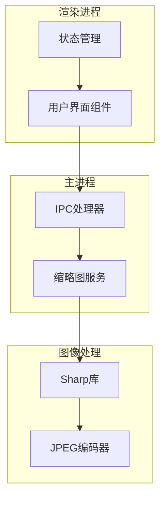
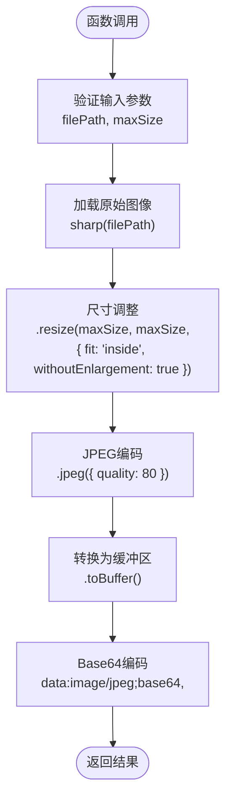
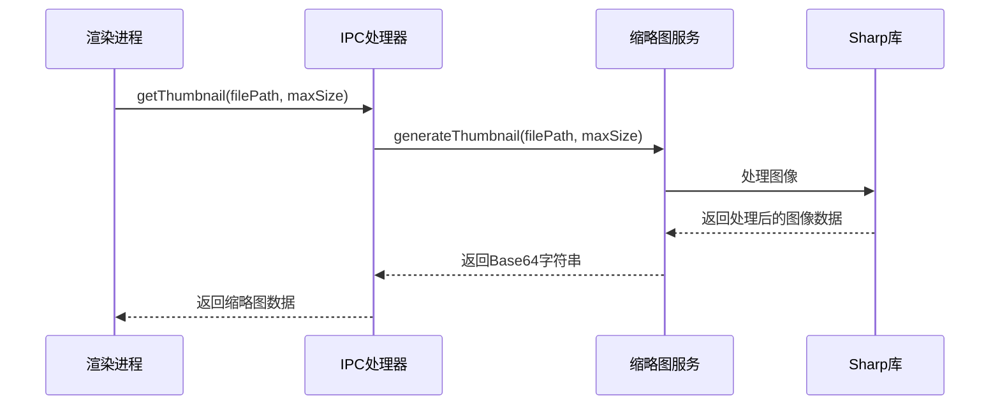
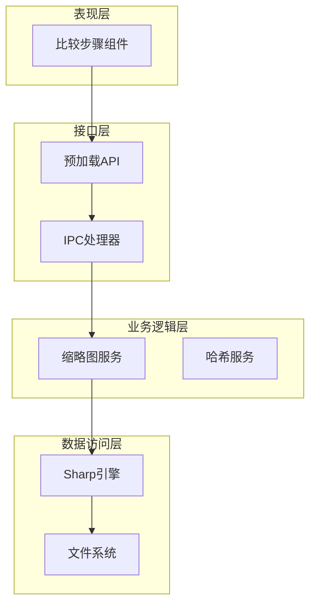
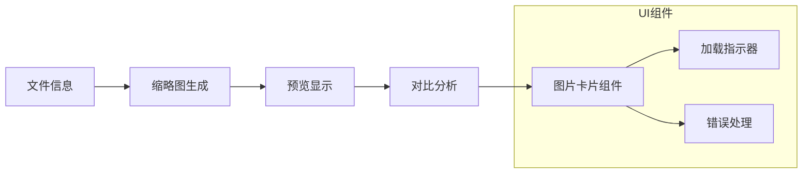
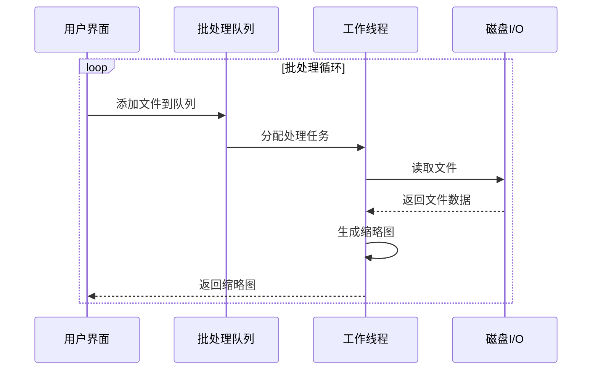
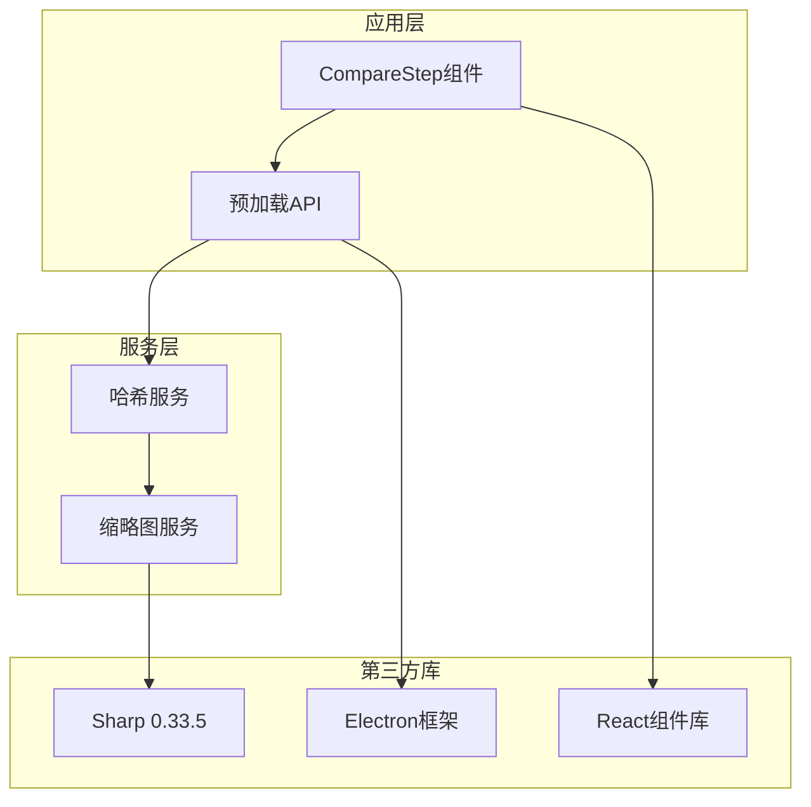
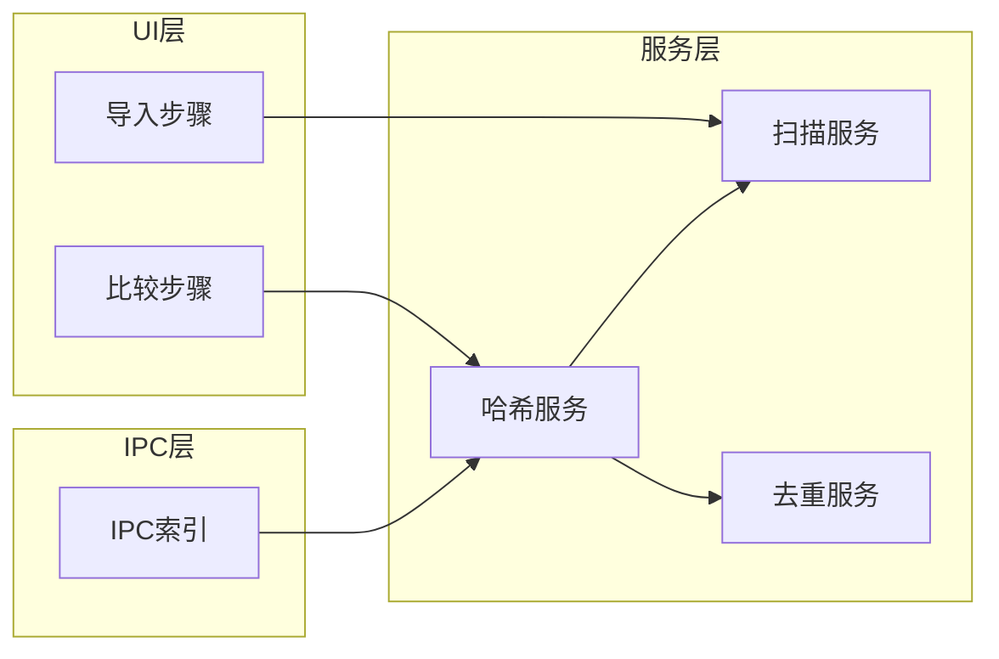
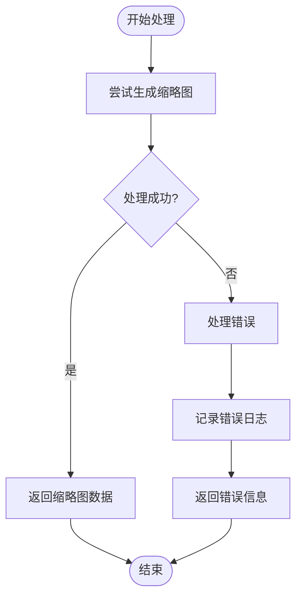

# 缩略图生成功能

<cite>
**本文档引用的文件**
- [hash.service.ts](file://src/main/services/hash.service.ts)
- [ipc/index.ts](file://src/main/ipc/index.ts)
- [preload/index.ts](file://src/preload/index.ts)
- [preload/index.d.ts](file://src/preload/index.d.ts)
- [CompareStep.tsx](file://src/renderer/src/components/CompareStep.tsx)
- [package.json](file://package.json)
</cite>

## 目录
1. [简介](#简介)
2. [项目结构](#项目结构)
3. [核心组件](#核心组件)
4. [架构概览](#架构概览)
5. [详细组件分析](#详细组件分析)
6. [依赖分析](#依赖分析)
7. [性能考虑](#性能考虑)
8. [故障排除指南](#故障排除指南)
9. [结论](#结论)

## 简介

本文档详细介绍了ReDoPhoto应用中缩略图生成功能的实现原理和技术细节。该功能基于Sharp图像处理库，提供了高效的JPEG缩略图生成能力，支持智能尺寸调整和质量控制。缩略图生成功能在用户界面中发挥着重要作用，特别是在文件预览、重复文件对比和视觉辅助判断等场景中。

## 项目结构

缩略图生成功能在整个应用架构中占据重要位置，涉及主进程、渲染进程和UI组件的协同工作：

**图表来源**
- [ipc/index.ts:144-150](file://src/main/ipc/index.ts#L144-L150)
- [hash.service.ts:170-179](file://src/main/services/hash.service.ts#L170-L179)

**章节来源**
- [ipc/index.ts:1-156](file://src/main/ipc/index.ts#L1-156)
- [hash.service.ts:1-180](file://src/main/services/hash.service.ts#L1-L180)

## 核心组件

### 1. 缩略图生成服务

缩略图生成功能的核心实现位于`generateThumbnail`函数中，该函数提供了完整的图像处理流程：

**图表来源**
- [hash.service.ts:170-179](file://src/main/services/hash.service.ts#L170-L179)

### 2. IPC接口层

主进程通过IPC接口暴露缩略图生成功能，供渲染进程调用：

**图表来源**
- [preload/index.ts:93-95](file://src/preload/index.ts#L93-L95)
- [ipc/index.ts:144-150](file://src/main/ipc/index.ts#L144-L150)

**章节来源**
- [hash.service.ts:170-179](file://src/main/services/hash.service.ts#L170-L179)
- [ipc/index.ts:144-150](file://src/main/ipc/index.ts#L144-L150)
- [preload/index.ts:93-95](file://src/preload/index.ts#L93-L95)

## 架构概览

缩略图生成功能采用分层架构设计，确保了良好的模块化和可维护性：

**图表来源**
- [CompareStep.tsx:12-24](file://src/renderer/src/components/CompareStep.tsx#L12-L24)
- [ipc/index.ts:144-150](file://src/main/ipc/index.ts#L144-L150)
- [hash.service.ts:170-179](file://src/main/services/hash.service.ts#L170-L179)

## 详细组件分析

### 1. 图像处理算法实现

#### 尺寸调整策略

缩略图生成采用了智能的尺寸调整算法，主要特点包括：

**maxSize参数作用**：
- 定义缩略图的最大边界尺寸
- 默认值为400像素，适用于大多数显示场景
- 可根据具体需求进行自定义调整

**fit: 'inside' 缩放模式**：
- 保持原始图像的宽高比
- 确保缩略图完全包含在指定尺寸范围内
- 防止图像变形或拉伸

**withoutEnlargement保护机制**：
- 防止对小于目标尺寸的图像进行放大
- 保护原始图像质量不受损害
- 对于小尺寸图像保持原样输出

#### JPEG编码配置

**质量参数选择**：
- 质量设置为80，平衡了文件大小和图像质量
- 在保证视觉效果的同时有效控制文件体积
- 适合网络传输和存储需求

**Base64编码传输格式**：
- 将二进制图像数据转换为文本格式
- 便于通过IPC接口进行传输
- 支持直接在HTML中使用

**章节来源**
- [hash.service.ts:170-179](file://src/main/services/hash.service.ts#L170-L179)

### 2. 用户界面集成

#### 文件预览场景

在比较步骤组件中，缩略图主要用于：

**图表来源**
- [CompareStep.tsx:12-24](file://src/renderer/src/components/CompareStep.tsx#L12-L24)
- [CompareStep.tsx:30-44](file://src/renderer/src/components/CompareStep.tsx#L30-L44)

#### 重复文件对比应用

缩略图在重复文件检测流程中的关键作用：

1. **快速视觉识别**：通过缩略图快速区分相似文件
2. **人工审核辅助**：为用户提供直观的视觉参考
3. **决策支持**：帮助用户做出准确的去重决策

**章节来源**
- [CompareStep.tsx:12-70](file://src/renderer/src/components/CompareStep.tsx#L12-L70)

### 3. 性能优化策略

#### 批处理机制

虽然缩略图生成功能本身是单文件处理，但整个应用采用了批处理优化：

#### 内存管理

- 使用流式处理避免大文件内存溢出
- 及时释放图像处理资源
- 控制并发处理数量防止系统过载

**章节来源**
- [hash.service.ts:139-159](file://src/main/services/hash.service.ts#L139-L159)

## 依赖分析

### 外部依赖关系

**图表来源**
- [package.json:13-18](file://package.json#L13-L18)
- [hash.service.ts:1-3](file://src/main/services/hash.service.ts#L1-L3)

### 内部模块依赖

缩略图功能与应用其他模块的集成关系：

**图表来源**
- [ipc/index.ts:1-19](file://src/main/ipc/index.ts#L1-L19)
- [hash.service.ts:1-4](file://src/main/services/hash.service.ts#L1-L4)

**章节来源**
- [package.json:13-18](file://package.json#L13-L18)
- [ipc/index.ts:1-19](file://src/main/ipc/index.ts#L1-L19)

## 性能考虑

### 1. 图像处理性能

**CPU优化**：
- Sharp库基于libvips，提供高性能的图像处理能力
- 支持多核并行处理，充分利用现代CPU资源
- 内存映射技术减少不必要的数据复制

**I/O优化**：
- 流式读取避免大文件一次性加载到内存
- 智能缓存机制减少重复文件的处理开销
- 异步处理避免阻塞主线程

### 2. 内存使用优化

**内存限制**：
- 合理设置maxSize参数控制内存使用
- 及时清理不再使用的图像数据
- 监控内存使用情况防止泄漏

**垃圾回收**：
- 自动垃圾回收机制释放无用对象
- 手动引用清理确保及时释放资源
- 避免闭包导致的内存泄漏

### 3. 网络传输优化

**Base64编码考虑**：
- Base64格式增加约33%的数据体积
- 适合小尺寸缩略图的快速传输
- 需要平衡传输速度和带宽消耗

**缓存策略**：
- 缓存已生成的缩略图避免重复计算
- 利用浏览器缓存机制提升用户体验
- 实现智能缓存失效机制

## 故障排除指南

### 常见问题及解决方案

#### 1. 图像格式兼容性问题

**问题描述**：某些特殊格式的图像无法正确处理

**解决方案**：
- 确保输入图像格式受Sharp支持
- 提供格式转换作为后备方案
- 实施详细的错误日志记录

#### 2. 内存不足错误

**问题描述**：处理大尺寸图像时出现内存溢出

**解决方案**：
- 降低maxSize参数值
- 实施更严格的内存监控
- 优化图像处理流程减少内存占用

#### 3. 性能问题

**问题描述**：缩略图生成速度过慢

**解决方案**：
- 调整并发处理数量
- 优化图像处理参数
- 实施智能缓存机制

**章节来源**
- [hash.service.ts:141-149](file://src/main/services/hash.service.ts#L141-L149)

### 错误处理机制

**图表来源**
- [hash.service.ts:141-149](file://src/main/services/hash.service.ts#L141-L149)

## 结论

缩略图生成功能通过Sharp图像处理库实现了高效、高质量的图像缩放和编码。该功能在ReDoPhoto应用中发挥着关键作用，为用户提供直观的视觉辅助，显著提升了重复文件检测的效率和准确性。

### 主要优势

1. **高性能处理**：基于Sharp的底层优化确保了快速的图像处理能力
2. **智能缩放**：保持宽高比和防止放大保护机制保证了图像质量
3. **灵活配置**：可调节的maxSize参数适应不同的使用场景
4. **良好集成**：与Electron框架无缝集成，提供流畅的用户体验

### 技术特色

- **质量控制**：80的质量参数在文件大小和视觉效果间取得最佳平衡
- **格式标准化**：Base64编码提供统一的传输格式
- **错误处理**：完善的异常处理机制确保系统稳定性
- **性能优化**：多层优化策略确保在各种硬件配置下的良好表现

该功能为整个ReDoPhoto应用提供了坚实的图像处理基础，为后续的功能扩展和性能优化奠定了良好的技术基础。