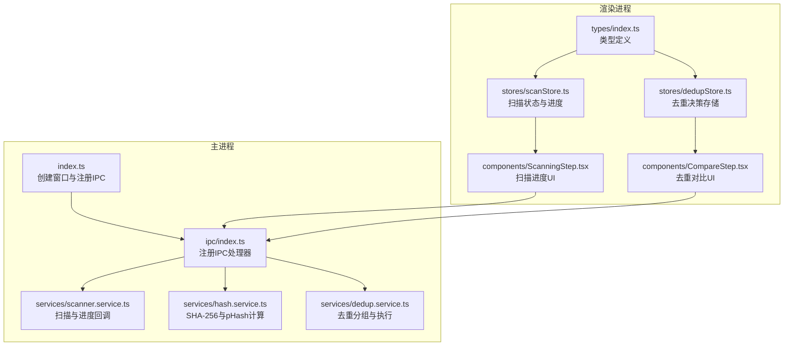
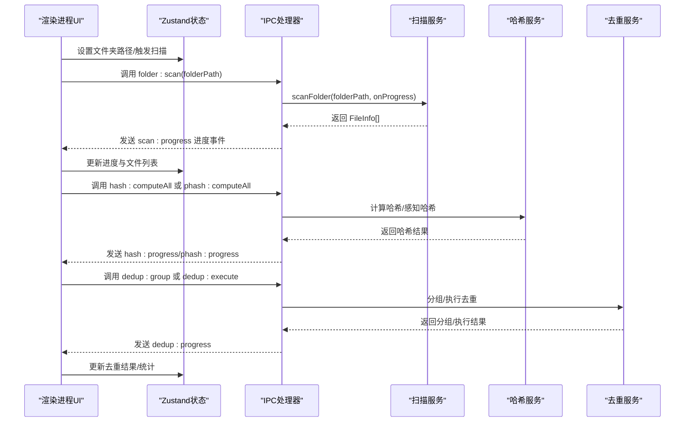
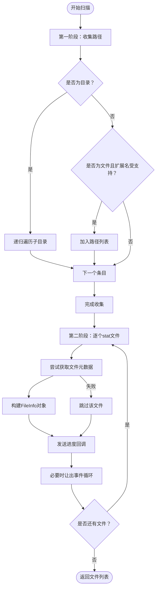
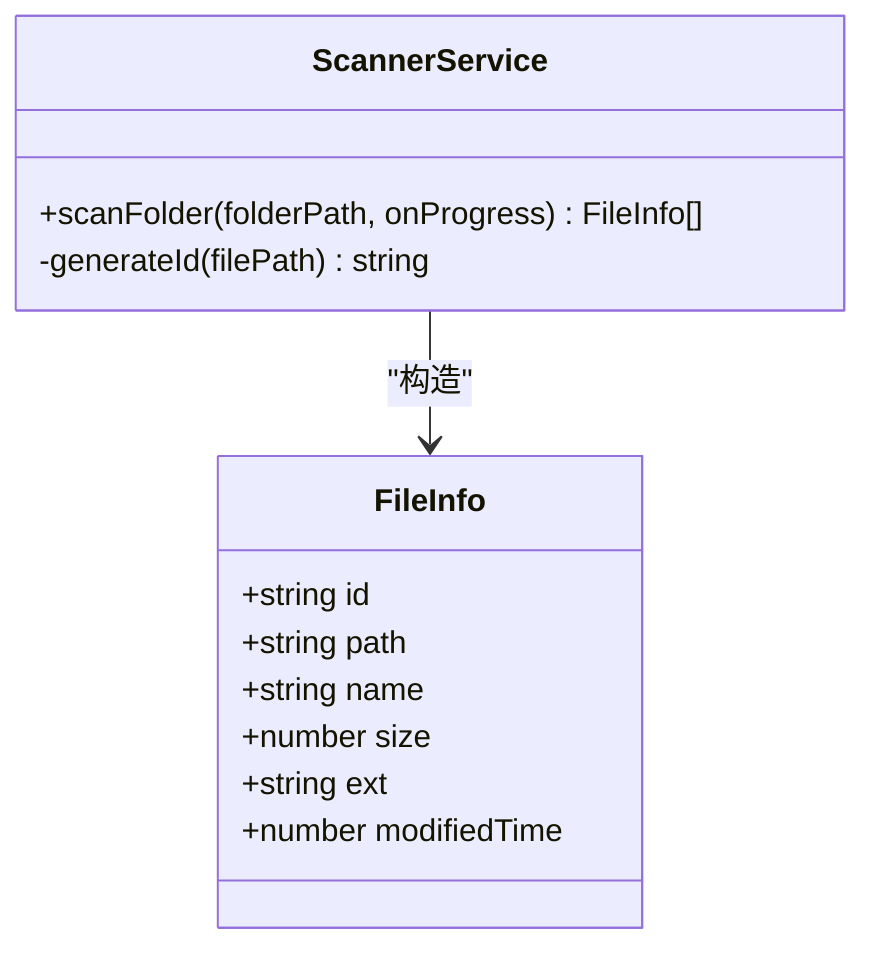
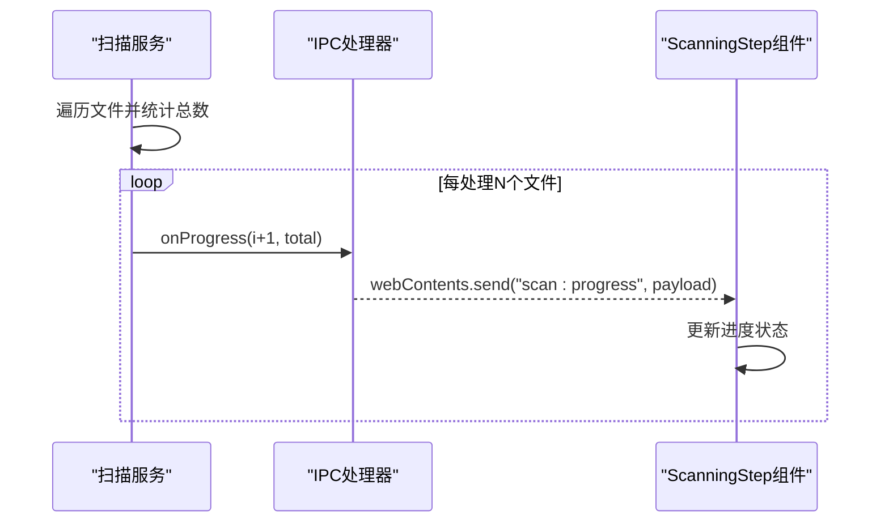
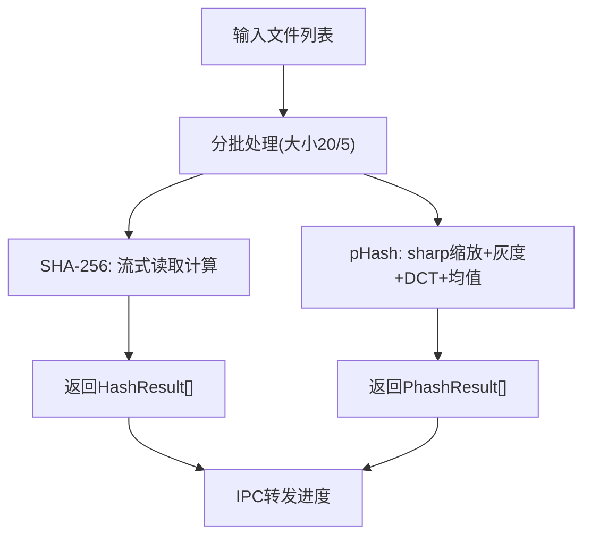
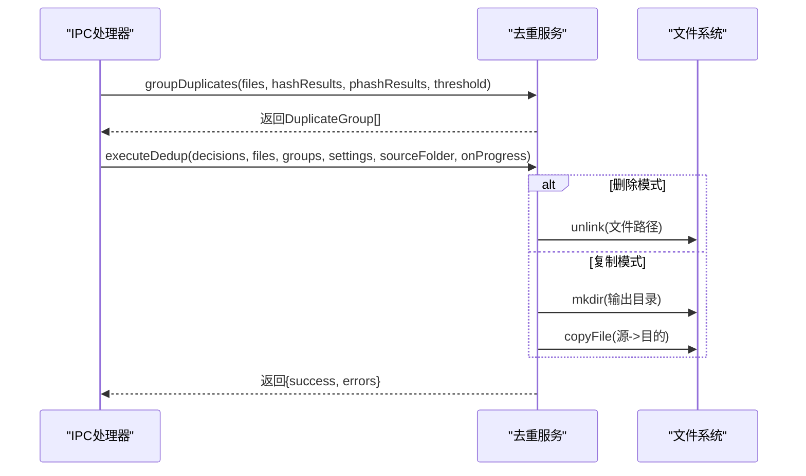
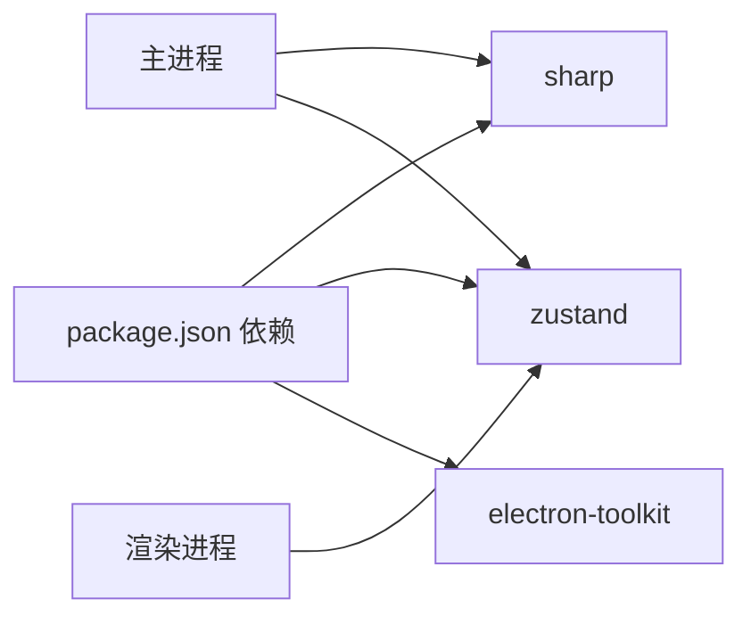

# 文件扫描服务

<cite>
**本文引用的文件**
- [src/main/services/scanner.service.ts](file://src/main/services/scanner.service.ts)
- [src/main/services/hash.service.ts](file://src/main/services/hash.service.ts)
- [src/main/services/dedup.service.ts](file://src/main/services/dedup.service.ts)
- [src/main/ipc/index.ts](file://src/main/ipc/index.ts)
- [src/main/index.ts](file://src/main/index.ts)
- [src/renderer/src/stores/scanStore.ts](file://src/renderer/src/stores/scanStore.ts)
- [src/renderer/src/stores/dedupStore.ts](file://src/renderer/src/stores/dedupStore.ts)
- [src/renderer/src/components/ScanningStep.tsx](file://src/renderer/src/components/ScanningStep.tsx)
- [src/renderer/src/components/CompareStep.tsx](file://src/renderer/src/components/CompareStep.tsx)
- [src/renderer/src/types/index.ts](file://src/renderer/src/types/index.ts)
- [package.json](file://package.json)
</cite>

## 目录
1. [简介](#简介)
2. [项目结构](#项目结构)
3. [核心组件](#核心组件)
4. [架构总览](#架构总览)
5. [详细组件分析](#详细组件分析)
6. [依赖关系分析](#依赖关系分析)
7. [性能考量](#性能考量)
8. [故障排查指南](#故障排查指南)
9. [结论](#结论)
10. [附录](#附录)

## 简介
本文件扫描服务是一个基于 Electron + React 的桌面应用，提供照片去重功能。其核心能力包括：
- 递归扫描指定文件夹，识别支持格式的图片文件
- 收集文件元数据（路径、名称、大小、扩展名、修改时间）
- 通过回调机制实时上报扫描进度
- 提供哈希与感知哈希计算，用于精确与近似重复检测
- 基于用户决策执行删除或复制输出

该文档将深入解析递归扫描算法、FileInfo 数据模型设计、进度监控机制、API 接口定义与最佳实践，并给出常见问题的解决方案。

## 项目结构
项目采用主进程（Electron）+ 渲染进程（React）分层架构，核心逻辑集中在主进程的服务模块中，渲染层负责状态管理与 UI 展示。

图表来源
- [src/main/index.ts:1-61](file://src/main/index.ts#L1-L61)
- [src/main/ipc/index.ts:1-156](file://src/main/ipc/index.ts#L1-L156)
- [src/main/services/scanner.service.ts:1-86](file://src/main/services/scanner.service.ts#L1-L86)
- [src/main/services/hash.service.ts:1-180](file://src/main/services/hash.service.ts#L1-L180)
- [src/main/services/dedup.service.ts:1-209](file://src/main/services/dedup.service.ts#L1-L209)
- [src/renderer/src/stores/scanStore.ts:1-52](file://src/renderer/src/stores/scanStore.ts#L1-L52)
- [src/renderer/src/stores/dedupStore.ts:1-83](file://src/renderer/src/stores/dedupStore.ts#L1-L83)
- [src/renderer/src/components/ScanningStep.tsx:1-84](file://src/renderer/src/components/ScanningStep.tsx#L1-L84)
- [src/renderer/src/components/CompareStep.tsx:1-279](file://src/renderer/src/components/CompareStep.tsx#L1-L279)
- [src/renderer/src/types/index.ts:1-58](file://src/renderer/src/types/index.ts#L1-L58)

章节来源
- [src/main/index.ts:1-61](file://src/main/index.ts#L1-L61)
- [src/main/ipc/index.ts:1-156](file://src/main/ipc/index.ts#L1-L156)
- [src/renderer/src/stores/scanStore.ts:1-52](file://src/renderer/src/stores/scanStore.ts#L1-L52)
- [src/renderer/src/stores/dedupStore.ts:1-83](file://src/renderer/src/stores/dedupStore.ts#L1-L83)
- [src/renderer/src/components/ScanningStep.tsx:1-84](file://src/renderer/src/components/ScanningStep.tsx#L1-L84)
- [src/renderer/src/components/CompareStep.tsx:1-279](file://src/renderer/src/components/CompareStep.tsx#L1-L279)
- [src/renderer/src/types/index.ts:1-58](file://src/renderer/src/types/index.ts#L1-L58)

## 核心组件
- 扫描服务：递归遍历目录、过滤文件、收集元数据、进度回调
- 哈希服务：SHA-256 批量计算、感知哈希（pHash）批量计算、汉明距离
- 去重服务：基于哈希与 pHash 的分组、决策执行（删除或复制）
- IPC 层：主进程与渲染进程通信，封装扫描、哈希、去重等操作
- 渲染状态：Zustand 状态管理，保存扫描结果、进度、去重决策
- UI 组件：扫描进度展示、重复组对比与决策

章节来源
- [src/main/services/scanner.service.ts:1-86](file://src/main/services/scanner.service.ts#L1-L86)
- [src/main/services/hash.service.ts:1-180](file://src/main/services/hash.service.ts#L1-L180)
- [src/main/services/dedup.service.ts:1-209](file://src/main/services/dedup.service.ts#L1-L209)
- [src/main/ipc/index.ts:1-156](file://src/main/ipc/index.ts#L1-L156)
- [src/renderer/src/stores/scanStore.ts:1-52](file://src/renderer/src/stores/scanStore.ts#L1-L52)
- [src/renderer/src/stores/dedupStore.ts:1-83](file://src/renderer/src/stores/dedupStore.ts#L1-L83)
- [src/renderer/src/components/ScanningStep.tsx:1-84](file://src/renderer/src/components/ScanningStep.tsx#L1-L84)
- [src/renderer/src/components/CompareStep.tsx:1-279](file://src/renderer/src/components/CompareStep.tsx#L1-L279)

## 架构总览
下图展示了从 UI 触发到主进程执行再到渲染层反馈的完整流程。

图表来源
- [src/main/ipc/index.ts:42-53](file://src/main/ipc/index.ts#L42-L53)
- [src/main/ipc/index.ts:56-68](file://src/main/ipc/index.ts#L56-L68)
- [src/main/ipc/index.ts:71-83](file://src/main/ipc/index.ts#L71-L83)
- [src/main/ipc/index.ts:86-107](file://src/main/ipc/index.ts#L86-L107)
- [src/main/ipc/index.ts:110-142](file://src/main/ipc/index.ts#L110-L142)
- [src/main/services/scanner.service.ts:28-85](file://src/main/services/scanner.service.ts#L28-L85)
- [src/main/services/hash.service.ts:29-56](file://src/main/services/hash.service.ts#L29-L56)
- [src/main/services/hash.service.ts:132-159](file://src/main/services/hash.service.ts#L132-L159)
- [src/main/services/dedup.service.ts:43-115](file://src/main/services/dedup.service.ts#L43-L115)
- [src/main/services/dedup.service.ts:117-209](file://src/main/services/dedup.service.ts#L117-L209)

## 详细组件分析

### 递归扫描算法与目录遍历策略
- 目录遍历：使用异步 readdir 遍历目录，withFileTypes 获取条目类型；对子目录递归调用，对文件根据扩展名集合进行过滤。
- 文件过滤：仅接受预定义的图片扩展名集合，避免无关文件进入后续处理。
- 两阶段扫描：
  - 第一阶段：收集所有符合条件的文件路径，便于后续统计总数与进度。
  - 第二阶段：逐个读取文件元数据（大小、修改时间），构建 FileInfo 列表。
- 进度回调：在第二阶段循环中按序发送当前进度，同时每处理一定数量文件让出事件循环以避免阻塞主线程。
- 错误处理：对不可访问目录与无法 stat 的文件进行跳过，保证扫描过程的鲁棒性。

图表来源
- [src/main/services/scanner.service.ts:36-54](file://src/main/services/scanner.service.ts#L36-L54)
- [src/main/services/scanner.service.ts:60-82](file://src/main/services/scanner.service.ts#L60-L82)

章节来源
- [src/main/services/scanner.service.ts:1-86](file://src/main/services/scanner.service.ts#L1-L86)

### FileInfo 数据模型设计
- 字段定义：id、path、name、size、ext、modifiedTime
- ID 生成算法：对绝对路径进行小写规范化，使用滚动哈希（类似 djb2）生成 32 位整数，再转为 36 进制并拼接文件名，确保唯一性与可读性。
- 元数据收集：通过 fs.promises.stat 获取大小与修改时间；扩展名统一转为小写。
- 错误处理：stat 失败时跳过该文件，避免中断整体扫描流程。

图表来源
- [src/main/services/scanner.service.ts:8-15](file://src/main/services/scanner.service.ts#L8-L15)
- [src/main/services/scanner.service.ts:17-26](file://src/main/services/scanner.service.ts#L17-L26)
- [src/main/services/scanner.service.ts:28-85](file://src/main/services/scanner.service.ts#L28-L85)

章节来源
- [src/main/services/scanner.service.ts:1-86](file://src/main/services/scanner.service.ts#L1-L86)
- [src/renderer/src/types/index.ts:1-8](file://src/renderer/src/types/index.ts#L1-L8)

### 扫描进度监控机制
- 回调函数：scanFolder 接收可选的 onProgress(current, total) 回调，在第二阶段循环中按序调用。
- 主进程转发：IPC 层在收到扫描结果后，将进度通过 webContents.send 发送到渲染进程。
- 渲染层展示：ScanningStep 组件根据进度更新 UI，显示百分比、当前/总计以及进度条。
- 用户体验优化：在处理大量文件时，通过 setImmediate 让出事件循环，保持界面响应。

图表来源
- [src/main/services/scanner.service.ts:75-82](file://src/main/services/scanner.service.ts#L75-L82)
- [src/main/ipc/index.ts:42-53](file://src/main/ipc/index.ts#L42-L53)
- [src/renderer/src/components/ScanningStep.tsx:44-77](file://src/renderer/src/components/ScanningStep.tsx#L44-L77)

章节来源
- [src/main/services/scanner.service.ts:28-85](file://src/main/services/scanner.service.ts#L28-L85)
- [src/main/ipc/index.ts:42-53](file://src/main/ipc/index.ts#L42-L53)
- [src/renderer/src/components/ScanningStep.tsx:1-84](file://src/renderer/src/components/ScanningStep.tsx#L1-L84)

### 哈希与感知哈希计算
- SHA-256：使用流式读取文件，分批计算，批大小为 20；遇到错误返回特殊标记，不影响其他文件。
- pHash：使用 sharp 将图像缩放至 32x32 灰度，提取像素数据，执行二维 DCT，取低频 8x8 区块，计算均值并生成 64 位二进制字符串作为哈希；批大小为 5。
- 汉明距离：比较两个等长字符串的差异位数，用于 pHash 分组阈值判断。
- 进度回调：两类计算均支持 onProgress 回调，主进程转发到渲染层。

图表来源
- [src/main/services/hash.service.ts:29-56](file://src/main/services/hash.service.ts#L29-L56)
- [src/main/services/hash.service.ts:132-159](file://src/main/services/hash.service.ts#L132-L159)
- [src/main/services/hash.service.ts:103-130](file://src/main/services/hash.service.ts#L103-L130)

章节来源
- [src/main/services/hash.service.ts:1-180](file://src/main/services/hash.service.ts#L1-L180)

### 去重分组与执行
- 分组策略：
  - 精确分组：按 SHA-256 哈希聚合，形成完全相同的重复组。
  - 近似分组：对不在精确组中的文件，基于 pHash 的汉明距离阈值（默认 5）使用并查集合并，形成“高度相似”组。
- 决策执行：
  - 删除模式：直接删除用户选择的重复文件，逐个 unlink 并报告成功/失败。
  - 复制模式：在目标文件夹创建与源文件夹相同的相对路径结构，复制非重复与被保留的文件，其余删除。
- 进度回调：执行阶段同样支持 onProgress，携带当前文件名以便用户了解处理对象。

图表来源
- [src/main/services/dedup.service.ts:43-115](file://src/main/services/dedup.service.ts#L43-L115)
- [src/main/services/dedup.service.ts:117-209](file://src/main/services/dedup.service.ts#L117-L209)

章节来源
- [src/main/services/dedup.service.ts:1-209](file://src/main/services/dedup.service.ts#L1-L209)

### API 接口说明
- 选择文件夹
  - IPC 名称：folder:select
  - 请求：无参数
  - 返回：所选目录路径或 null
- 扫描文件夹
  - IPC 名称：folder:scan
  - 请求：{ folderPath: string }
  - 返回：FileInfo[]（缓存于主进程，供后续步骤使用）
  - 进度：webContents 发送 scan:progress
- 计算 SHA-256
  - IPC 名称：hash:computeAll
  - 请求：{ files: FileInfo[] }
  - 返回：HashResult[]
  - 进度：webContents 发送 hash:progress
- 计算感知哈希
  - IPC 名称：phash:computeAll
  - 请求：{ files: FileInfo[] }
  - 返回：PhashResult[]
  - 进度：webContents 发送 hash:progress（phase=phashing）
- 分组去重
  - IPC 名称：dedup:group
  - 请求：{ hashResults, phashResults?, phashThreshold? }
  - 返回：DuplicateGroup[]
- 执行去重
  - IPC 名称：dedup:execute
  - 请求：{ decisions, settings, sourceFolder, files? }
  - 返回：{ success, errors }
  - 进度：webContents 发送 dedup:progress
- 生成缩略图
  - IPC 名称：file:thumbnail
  - 请求：{ filePath, maxSize? }
  - 返回：data:image/jpeg;base64,... 的图片数据
- 设置读取/写入
  - IPC 名称：settings:get / settings:set
  - 返回/请求：AppSettings 对象

章节来源
- [src/main/ipc/index.ts:32-39](file://src/main/ipc/index.ts#L32-L39)
- [src/main/ipc/index.ts:42-53](file://src/main/ipc/index.ts#L42-L53)
- [src/main/ipc/index.ts:56-68](file://src/main/ipc/index.ts#L56-L68)
- [src/main/ipc/index.ts:71-83](file://src/main/ipc/index.ts#L71-L83)
- [src/main/ipc/index.ts:86-107](file://src/main/ipc/index.ts#L86-L107)
- [src/main/ipc/index.ts:110-142](file://src/main/ipc/index.ts#L110-L142)
- [src/main/ipc/index.ts:145-150](file://src/main/ipc/index.ts#L145-L150)
- [src/main/ipc/index.ts:153-154](file://src/main/ipc/index.ts#L153-L154)

### 最佳实践
- 参数验证建议
  - folderPath 必须存在且可读
  - files 数组不能为空，否则哈希计算无意义
  - phashThreshold 合理范围（如 0~64），超出范围需降级处理
- 异常处理建议
  - 对不可访问目录与 stat 失败的文件进行跳过并记录日志
  - 哈希计算失败返回占位符，避免中断整体流程
  - 执行去重前校验决策完整性（确保每组都有明确保留/删除）
- 性能优化建议
  - 批量处理：哈希与 pHash 已采用批处理，可根据磁盘与 CPU 调整批大小
  - 事件让渡：扫描与执行阶段已使用 setImmediate，避免长时间阻塞
  - 缓存策略：扫描结果在主进程缓存，避免重复扫描

## 依赖关系分析
- Electron 主进程负责系统级文件操作与 IPC 通信
- 渲染进程负责 UI 与状态管理，通过 window.api 与主进程交互
- sharp 用于图像处理（pHash 与缩略图）
- Zustand 用于轻量状态管理

图表来源
- [package.json:13-18](file://package.json#L13-L18)
- [src/main/services/hash.service.ts:3](file://src/main/services/hash.service.ts#L3)
- [src/renderer/src/stores/scanStore.ts:1](file://src/renderer/src/stores/scanStore.ts#L1)

章节来源
- [package.json:1-51](file://package.json#L1-L51)

## 性能考量
- 扫描阶段
  - 使用两阶段扫描减少重复 IO
  - 每 N 个文件让出事件循环，避免 UI 卡顿
- 哈希阶段
  - 流式读取避免大文件内存占用
  - 批量并发计算，合理设置批大小平衡吞吐与资源
- pHash 阶段
  - 图像缩放与 DCT 计算较重，建议限制批大小并考虑硬件加速
- 去重执行
  - 删除模式直接 unlink，复制模式需要多次 mkdir/copy，注意磁盘 I/O 与权限

## 故障排查指南
- 扫描无进度或卡住
  - 检查 onProgress 是否正确传入
  - 确认 setImmediate 让渡是否生效
  - 排查是否存在大量不可访问目录导致过多跳过
- 哈希结果异常
  - 检查文件权限与只读属性
  - 确认文件未被其他程序占用
- pHash 结果为空
  - 检查 sharp 依赖安装与图像格式支持
  - 确认文件为有效图像
- 去重执行失败
  - 删除模式：检查磁盘权限与路径有效性
  - 复制模式：确认输出目录可写且磁盘空间充足

章节来源
- [src/main/services/scanner.service.ts:75-82](file://src/main/services/scanner.service.ts#L75-L82)
- [src/main/services/hash.service.ts:39-46](file://src/main/services/hash.service.ts#L39-L46)
- [src/main/services/hash.service.ts:142-149](file://src/main/services/hash.service.ts#L142-L149)
- [src/main/services/dedup.service.ts:145-157](file://src/main/services/dedup.service.ts#L145-L157)
- [src/main/services/dedup.service.ts:194-200](file://src/main/services/dedup.service.ts#L194-L200)

## 结论
该文件扫描服务通过清晰的分层架构与稳健的错误处理，实现了高效、可扩展的照片去重流程。递归扫描算法简洁可靠，FileInfo 数据模型设计兼顾唯一性与可读性，进度回调机制提升了用户体验。结合哈希与感知哈希的双重去重策略，能够覆盖精确与近似重复场景。建议在生产环境中进一步完善参数校验、日志记录与资源监控，以提升稳定性与可观测性。

## 附录
- 类型定义参考：[src/renderer/src/types/index.ts:1-58](file://src/renderer/src/types/index.ts#L1-L58)
- 状态管理参考：[src/renderer/src/stores/scanStore.ts:1-52](file://src/renderer/src/stores/scanStore.ts#L1-L52)、[src/renderer/src/stores/dedupStore.ts:1-83](file://src/renderer/src/stores/dedupStore.ts#L1-L83)
- UI 组件参考：[src/renderer/src/components/ScanningStep.tsx:1-84](file://src/renderer/src/components/ScanningStep.tsx#L1-L84)、[src/renderer/src/components/CompareStep.tsx:1-279](file://src/renderer/src/components/CompareStep.tsx#L1-L279)