# 智能批量重命名

<cite>
**本文档引用的文件**
- [src/main/services/rename.service.ts](file://src/main/services/rename.service.ts)
- [src/main/ipc/index.ts](file://src/main/ipc/index.ts)
- [src/renderer/src/components/rename/RenameFeature.tsx](file://src/renderer/src/components/rename/RenameFeature.tsx)
- [src/renderer/src/components/rename/RenameImport.tsx](file://src/renderer/src/components/rename/RenameImport.tsx)
- [src/renderer/src/components/rename/RenamePreview.tsx](file://src/renderer/src/components/rename/RenamePreview.tsx)
- [src/renderer/src/components/rename/RenameExecute.tsx](file://src/renderer/src/components/rename/RenameExecute.tsx)
- [src/renderer/src/stores/renameStore.ts](file://src/renderer/src/stores/renameStore.ts)
- [src/renderer/src/stores/settingsStore.ts](file://src/renderer/src/stores/settingsStore.ts)
- [src/renderer/src/types/index.ts](file://src/renderer/src/types/index.ts)
- [src/main/services/scanner.service.ts](file://src/main/services/scanner.service.ts)
- [src/preload/index.ts](file://src/preload/index.ts)
- [src/main/services/settings.service.ts](file://src/main/services/settings.service.ts)
- [src/renderer/src/App.tsx](file://src/renderer/src/App.tsx)
- [src/renderer/src/tabs/theme.ts](file://src/renderer/src/tabs/theme.ts)
- [electron.vite.config.ts](file://electron.vite.config.ts)
</cite>

## 目录
1. [简介](#简介)
2. [项目结构](#项目结构)
3. [核心组件](#核心组件)
4. [架构概览](#架构概览)
5. [详细组件分析](#详细组件分析)
6. [依赖关系分析](#依赖关系分析)
7. [性能考虑](#性能考虑)
8. [故障排除指南](#故障排除指南)
9. [结论](#结论)

## 简介

智能批量重命名是 ReDoPhoto 照片管理桌面工具中的一个核心功能模块，专门用于根据照片的 EXIF 信息进行智能化的批量重命名。该功能能够自动提取照片的时间戳、地理位置等元数据，生成符合用户需求的文件名格式，并支持复制或就地重命名两种操作模式。

ReDoPhoto 是一个基于 Electron 和 React 的跨平台桌面应用程序，提供了照片去重、智能重命名、方向修复等完整的照片管理解决方案。智能批量重命名功能通过 EXIF 数据驱动，为用户提供了一种高效、自动化的方式来整理和组织照片文件。

## 项目结构

ReDoPhoto 采用典型的 Electron 应用程序结构，分为主进程（Main Process）和渲染进程（Renderer Process）两个主要部分：

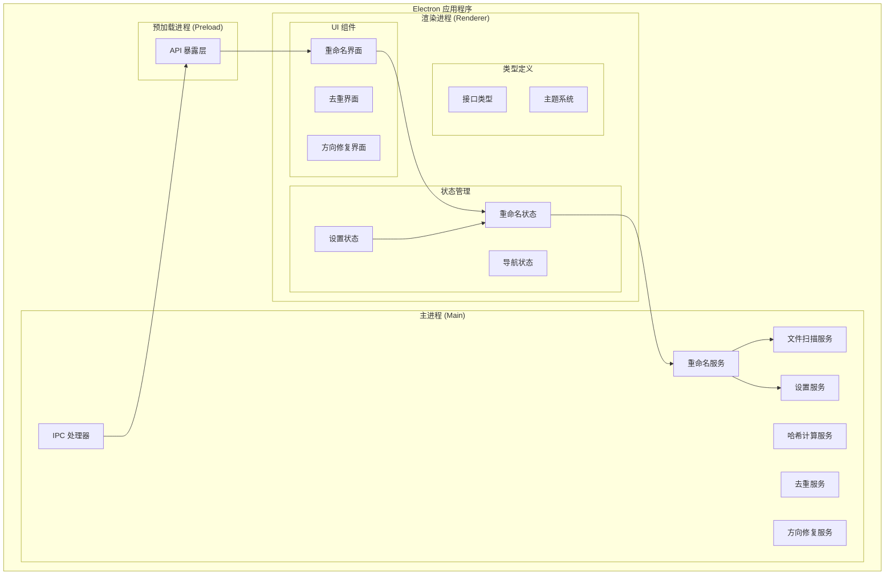

**图表来源**
- [src/main/ipc/index.ts:37-309](file://src/main/ipc/index.ts#L37-L309)
- [src/preload/index.ts:131-230](file://src/preload/index.ts#L131-L230)

**章节来源**
- [src/main/ipc/index.ts:1-309](file://src/main/ipc/index.ts#L1-L309)
- [src/preload/index.ts:1-230](file://src/preload/index.ts#L1-L230)
- [electron.vite.config.ts:1-26](file://electron.vite.config.ts#L1-L26)

## 核心组件

智能批量重命名功能由多个相互协作的组件构成，每个组件都有明确的职责和边界：

### 主要服务组件

1. **重命名服务 (Rename Service)**：负责 EXIF 数据提取、地理反编码、文件名生成和实际重命名操作
2. **文件扫描服务 (Scanner Service)**：递归扫描文件夹，收集支持格式的照片文件信息
3. **IPC 处理器**：建立主进程与渲染进程之间的通信桥梁
4. **预加载 API**：在安全的环境中暴露主进程功能给渲染进程使用

### 渲染层组件

1. **重命名功能入口**：根据当前阶段显示不同的界面组件
2. **导入组件**：用户选择文件夹和启动扫描流程
3. **预览组件**：展示重命名结果并允许用户自定义文件名
4. **执行组件**：处理实际的重命名操作并显示结果

**章节来源**
- [src/main/services/rename.service.ts:1-336](file://src/main/services/rename.service.ts#L1-L336)
- [src/renderer/src/components/rename/RenameFeature.tsx:1-33](file://src/renderer/src/components/rename/RenameFeature.tsx#L1-L33)
- [src/renderer/src/stores/renameStore.ts:1-72](file://src/renderer/src/stores/renameStore.ts#L1-L72)

## 架构概览

智能批量重命名功能采用了分层架构设计，确保了良好的可维护性和扩展性：

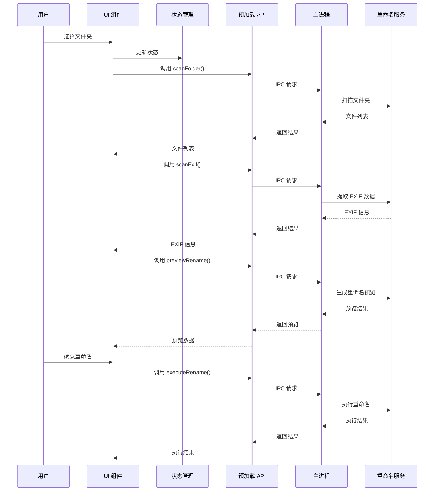

**图表来源**
- [src/renderer/src/components/rename/RenameImport.tsx:25-53](file://src/renderer/src/components/rename/RenameImport.tsx#L25-L53)
- [src/renderer/src/components/rename/RenamePreview.tsx:102-113](file://src/renderer/src/components/rename/RenamePreview.tsx#L102-L113)
- [src/renderer/src/components/rename/RenameExecute.tsx:22-41](file://src/renderer/src/components/rename/RenameExecute.tsx#L22-L41)

### 数据流架构

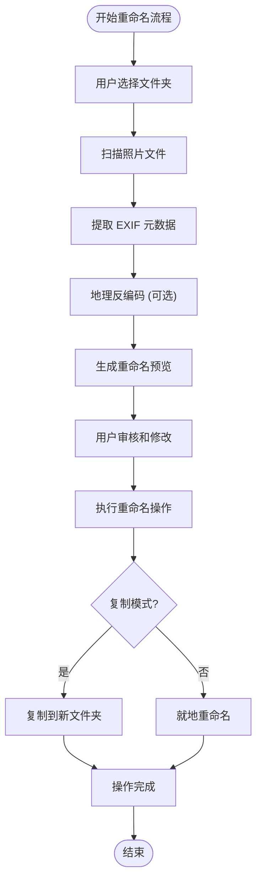

**图表来源**
- [src/main/services/rename.service.ts:167-258](file://src/main/services/rename.service.ts#L167-L258)
- [src/main/services/rename.service.ts:260-335](file://src/main/services/rename.service.ts#L260-L335)

## 详细组件分析

### 重命名服务 (Rename Service)

重命名服务是整个功能的核心，负责处理所有与重命名相关的业务逻辑：

#### 核心数据结构

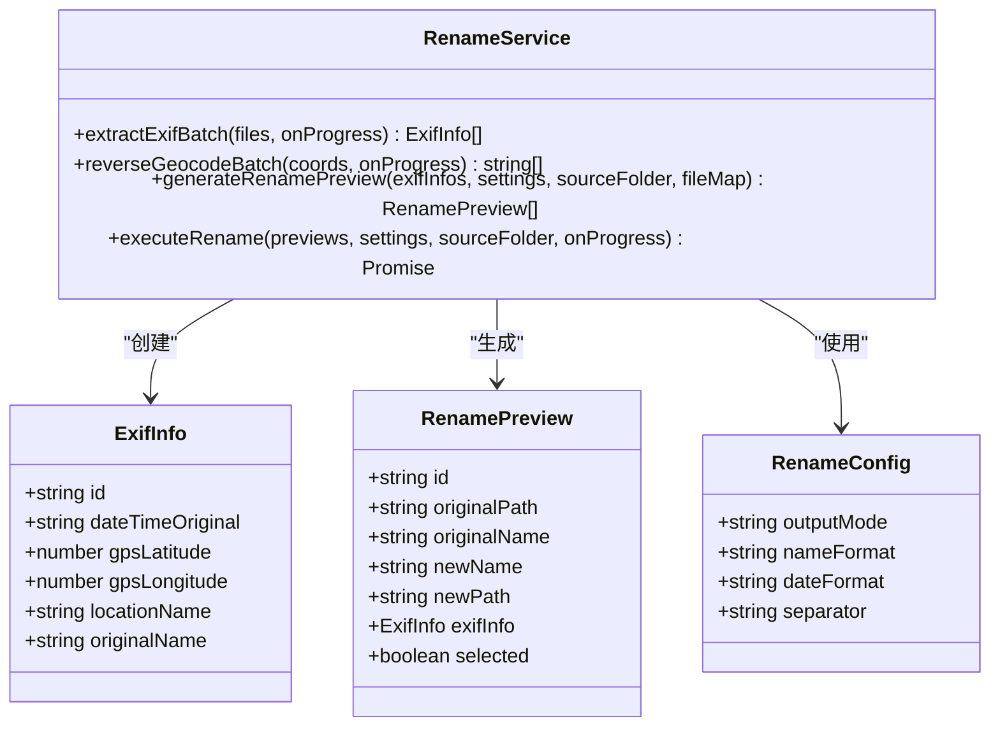

**图表来源**
- [src/main/services/rename.service.ts:6-30](file://src/main/services/rename.service.ts#L6-L30)
- [src/main/services/rename.service.ts:167-258](file://src/main/services/rename.service.ts#L167-L258)

#### EXIF 数据提取机制

重命名服务使用批处理方式提取照片的 EXIF 信息，支持以下关键字段：

- **拍摄时间**：从 `DateTimeOriginal` 字段提取，支持多种格式
- **地理位置**：从 GPS 纬度和经度字段提取
- **地理反编码**：通过 OpenStreetMap API 将坐标转换为地名

#### 地理反编码缓存策略

为了提高性能和遵守 API 限制，系统实现了智能缓存机制：

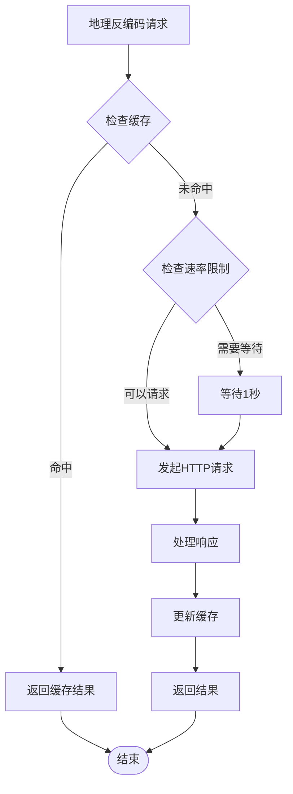

**图表来源**
- [src/main/services/rename.service.ts:104-150](file://src/main/services/rename.service.ts#L104-L150)

**章节来源**
- [src/main/services/rename.service.ts:41-102](file://src/main/services/rename.service.ts#L41-L102)
- [src/main/services/rename.service.ts:104-150](file://src/main/services/rename.service.ts#L104-L150)

### IPC 通信层

IPC 处理器建立了安全的通信通道，将渲染进程的用户操作转发到主进程的服务中：

#### IPC 处理器架构

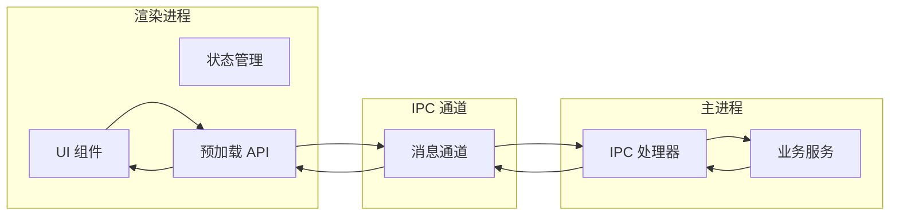

**图表来源**
- [src/main/ipc/index.ts:37-309](file://src/main/ipc/index.ts#L37-L309)
- [src/preload/index.ts:131-230](file://src/preload/index.ts#L131-L230)

#### 重命名相关 IPC 处理

IPC 处理器为重命名功能提供了三个关键的异步处理函数：

1. **`rename:scanExif`**：扫描并提取 EXIF 数据
2. **`rename:preview`**：生成重命名预览
3. **`rename:execute`**：执行实际的重命名操作

**章节来源**
- [src/main/ipc/index.ts:171-268](file://src/main/ipc/index.ts#L171-L268)
- [src/preload/index.ts:172-185](file://src/preload/index.ts#L172-L185)

### 渲染层组件

#### 重命名功能入口组件

RenameFeature 组件作为整个重命名功能的入口点，根据当前工作流程阶段显示相应的界面：

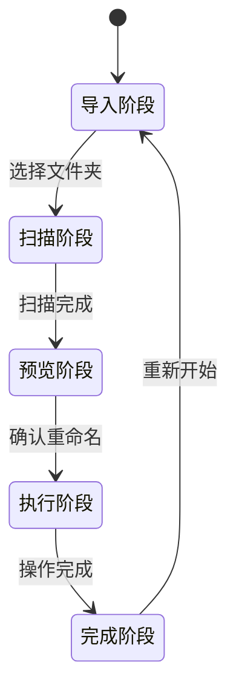

**图表来源**
- [src/renderer/src/components/rename/RenameFeature.tsx:11-32](file://src/renderer/src/components/rename/RenameFeature.tsx#L11-L32)

#### 状态管理系统

重命名状态管理使用 Zustand 库实现，提供了完整的状态持久化和响应式更新能力：

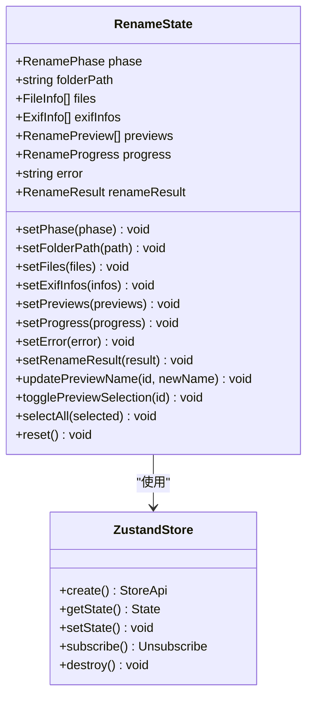

**图表来源**
- [src/renderer/src/stores/renameStore.ts:30-72](file://src/renderer/src/stores/renameStore.ts#L30-L72)

**章节来源**
- [src/renderer/src/stores/renameStore.ts:1-72](file://src/renderer/src/stores/renameStore.ts#L1-L72)
- [src/renderer/src/components/rename/RenameFeature.tsx:1-33](file://src/renderer/src/components/rename/RenameFeature.tsx#L1-L33)

### 文件扫描服务

文件扫描服务负责递归遍历指定目录，识别并收集支持格式的照片文件：

#### 支持的文件格式

系统默认支持以下图片格式：
- JPEG/JPG
- PNG
- GIF
- BMP
- WebP
- TIFF/TIF

#### 文件扫描算法

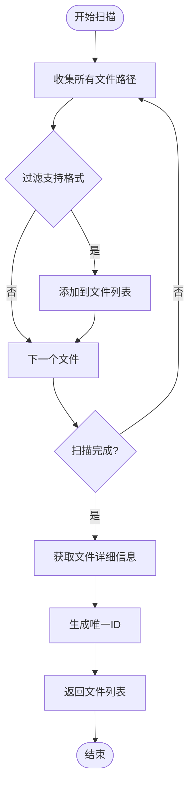

**图表来源**
- [src/main/services/scanner.service.ts:28-85](file://src/main/services/scanner.service.ts#L28-L85)

**章节来源**
- [src/main/services/scanner.service.ts:1-86](file://src/main/services/scanner.service.ts#L1-L86)

## 依赖关系分析

智能批量重命名功能涉及多个层面的依赖关系，包括外部库依赖、内部模块依赖和运行时依赖：

### 外部依赖

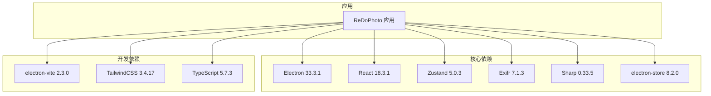

**图表来源**
- [package.json:14-36](file://package.json#L14-L36)

### 内部模块依赖

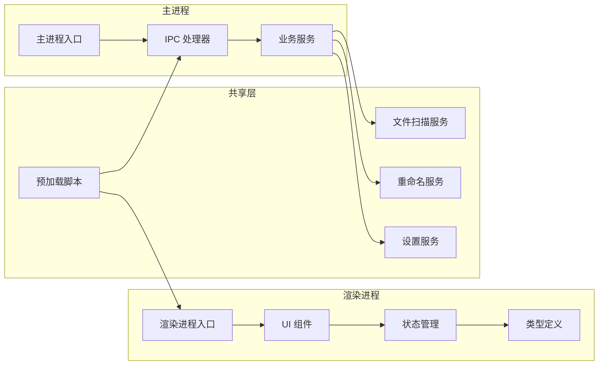

**图表来源**
- [src/main/ipc/index.ts:1-33](file://src/main/ipc/index.ts#L1-L33)
- [src/preload/index.ts:1-12](file://src/preload/index.ts#L1-L12)

**章节来源**
- [package.json:1-50](file://package.json#L1-L50)

## 性能考虑

智能批量重命名功能在设计时充分考虑了性能优化，采用了多种策略来确保流畅的用户体验：

### 并发处理策略

1. **EXIF 批处理**：每次处理 10 个文件，避免内存溢出和长时间阻塞
2. **地理反编码限速**：遵守 Nominatim API 1 秒请求间隔限制
3. **事件循环让渡**：定期调用 `setImmediate` 让出控制权给事件循环

### 缓存机制

1. **地理反编码缓存**：使用经纬度精度到小数点后两位的键值缓存
2. **重复坐标去重**：在批量处理前先去重，减少不必要的 API 调用
3. **临时文件名**：就地重命名时使用临时文件名避免冲突

### 内存管理

1. **渐进式处理**：文件扫描和处理都采用渐进式方法
2. **及时释放**：处理完成后及时清理缓存和中间结果
3. **错误恢复**：提供部分成功的情况下的错误恢复机制

## 故障排除指南

### 常见问题及解决方案

#### EXIF 数据提取失败

**症状**：某些照片无法提取 EXIF 信息
**可能原因**：
- 文件损坏或格式不受支持
- EXIF 数据缺失或格式异常
- 权限问题导致文件无法读取

**解决方法**：
1. 检查文件是否完整且格式受支持
2. 使用专业工具验证 EXIF 数据完整性
3. 确认应用程序具有文件读取权限

#### 地理反编码失败

**症状**：地理位置显示为坐标而非地名
**可能原因**：
- 网络连接问题
- OpenStreetMap API 服务不可用
- 坐标超出有效范围

**解决方法**：
1. 检查网络连接状态
2. 稍后重试或手动输入地名
3. 验证坐标的有效性

#### 重命名操作失败

**症状**：部分文件重命名失败
**可能原因**：
- 目标文件名已存在
- 权限不足
- 文件被其他程序占用

**解决方法**：
1. 检查目标文件夹权限
2. 关闭占用文件的程序
3. 修改文件名或选择其他输出模式

### 错误监控和日志

系统提供了完善的错误监控机制：

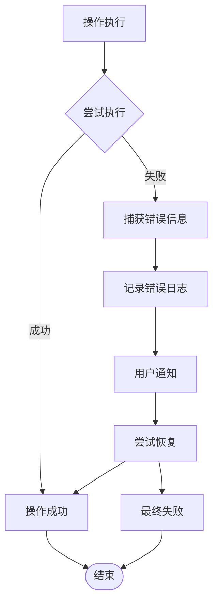

**图表来源**
- [src/main/services/rename.service.ts:260-335](file://src/main/services/rename.service.ts#L260-L335)

**章节来源**
- [src/main/services/rename.service.ts:260-335](file://src/main/services/rename.service.ts#L260-L335)

## 结论

智能批量重命名功能展现了现代桌面应用程序的最佳实践，通过精心设计的架构和优化的性能策略，为用户提供了高效、可靠的批量重命名体验。

### 主要优势

1. **智能化的数据驱动**：基于 EXIF 信息的智能重命名，无需人工干预
2. **灵活的配置选项**：支持多种命名格式和输出模式
3. **强大的错误处理**：完善的错误检测和恢复机制
4. **优秀的用户体验**：直观的界面设计和流畅的操作流程

### 技术亮点

1. **分层架构设计**：清晰的职责分离和良好的可维护性
2. **并发处理优化**：合理的并发策略确保系统响应性
3. **智能缓存机制**：提升性能的同时遵守外部服务限制
4. **安全的 IPC 通信**：通过预加载脚本实现安全的主渲染通信

### 未来改进方向

1. **批量处理优化**：进一步提升大文件夹的处理效率
2. **多语言支持**：扩展国际化支持
3. **插件系统**：允许用户自定义重命名规则
4. **云端同步**：支持与云存储服务集成

智能批量重命名功能不仅满足了基本的重命名需求，更重要的是为用户提供了智能化的照片管理解决方案，是 ReDoPhoto 应用程序的重要组成部分。