# 核心服务模块

<cite>
**本文档引用的文件**
- [scanner.service.ts](file://src/main/services/scanner.service.ts)
- [hash.service.ts](file://src/main/services/hash.service.ts)
- [dedup.service.ts](file://src/main/services/dedup.service.ts)
- [settings.service.ts](file://src/main/services/settings.service.ts)
- [ipc/index.ts](file://src/main/ipc/index.ts)
- [types/index.ts](file://src/renderer/src/types/index.ts)
- [scanStore.ts](file://src/renderer/src/stores/scanStore.ts)
- [dedupStore.ts](file://src/renderer/src/stores/dedupStore.ts)
- [package.json](file://package.json)
</cite>

## 目录
1. [简介](#简介)
2. [项目结构](#项目结构)
3. [核心组件](#核心组件)
4. [架构概览](#架构概览)
5. [详细组件分析](#详细组件分析)
6. [依赖关系分析](#依赖关系分析)
7. [性能考虑](#性能考虑)
8. [故障排除指南](#故障排除指南)
9. [结论](#结论)

## 简介

Redophoto是一个基于Electron的桌面照片去重应用程序，专注于高效识别和处理重复的照片文件。该应用通过三个核心服务模块实现了完整的照片去重工作流程：文件扫描服务负责递归遍历和收集照片文件；哈希计算服务提供SHA-256精确匹配和pHash相似度检测；去重处理服务运用智能分组算法和并查集数据结构进行重复项识别；设置管理服务确保用户配置的持久化存储。

本技术文档将深入分析每个核心服务模块的实现细节，包括算法原理、数据结构设计、性能优化策略以及完整的API接口规范。

## 项目结构

项目采用模块化的架构设计，主要分为以下层次：

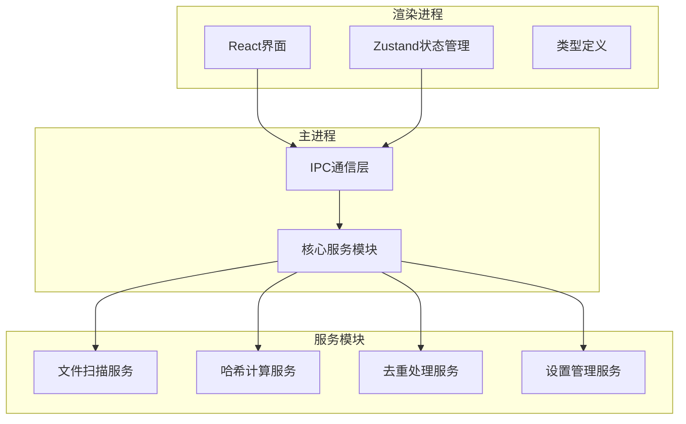

**图表来源**
- [ipc/index.ts:22-156](file://src/main/ipc/index.ts#L22-L156)
- [scanner.service.ts:1-86](file://src/main/services/scanner.service.ts#L1-L86)
- [hash.service.ts:1-180](file://src/main/services/hash.service.ts#L1-L180)
- [dedup.service.ts:1-209](file://src/main/services/dedup.service.ts#L1-L209)
- [settings.service.ts:1-34](file://src/main/services/settings.service.ts#L1-L34)

**章节来源**
- [package.json:13-18](file://package.json#L13-L18)
- [ipc/index.ts:1-156](file://src/main/ipc/index.ts#L1-L156)

## 核心组件

### 文件扫描服务 (Scanner Service)

文件扫描服务是整个去重流程的起点，负责递归遍历指定目录并收集符合要求的照片文件信息。

**关键特性：**
- 支持多种图片格式（JPG、PNG、GIF、BMP、WebP、TIFF等）
- 智能路径规范化和唯一ID生成
- 进度报告和错误处理
- 性能优化的双阶段扫描策略

**数据结构：**
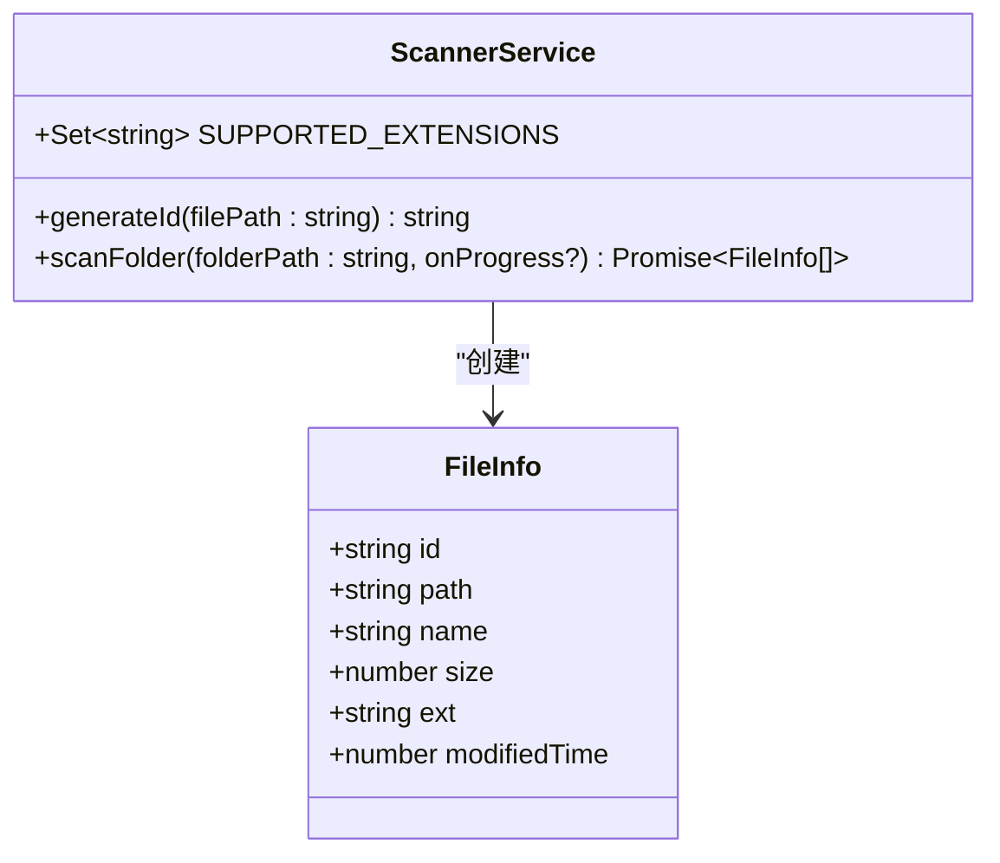

**图表来源**
- [scanner.service.ts:8-26](file://src/main/services/scanner.service.ts#L8-L26)
- [scanner.service.ts:28-85](file://src/main/services/scanner.service.ts#L28-L85)

**章节来源**
- [scanner.service.ts:1-86](file://src/main/services/scanner.service.ts#L1-L86)

### 哈希计算服务 (Hash Service)

哈希计算服务提供两种核心算法来识别重复文件：SHA-256精确匹配和pHash感知哈希相似度检测。

**算法实现：**
- **SHA-256**: 提供文件内容的精确匹配
- **pHash**: 基于感知哈希的相似度检测，能够识别经过轻微修改的照片
- **批量处理**: 支持并发处理多个文件以提高效率

**数据结构：**
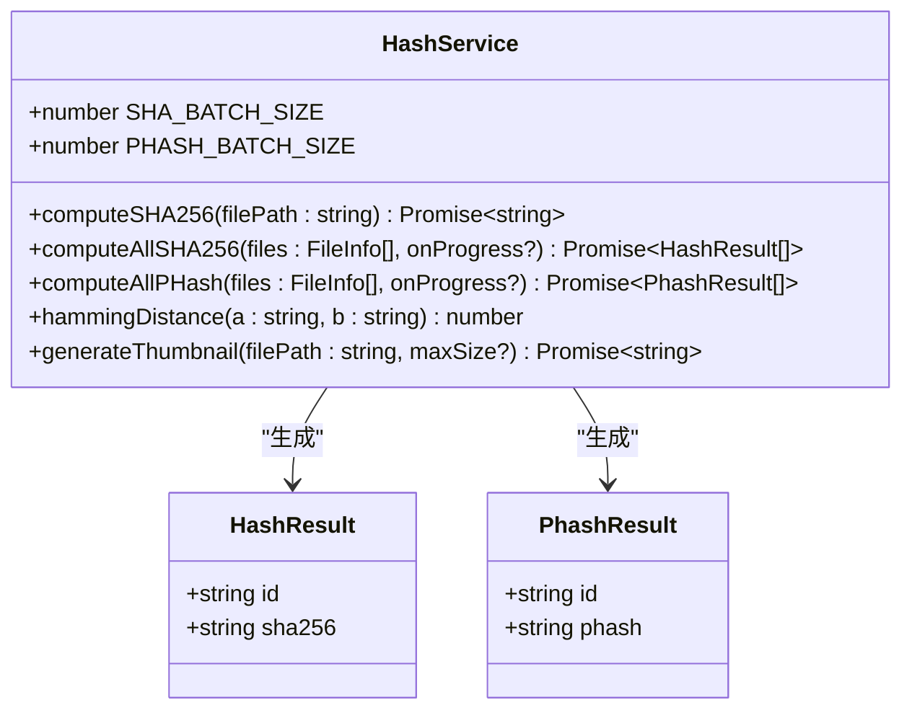

**图表来源**
- [hash.service.ts:6-179](file://src/main/services/hash.service.ts#L6-L179)

**章节来源**
- [hash.service.ts:1-180](file://src/main/services/hash.service.ts#L1-L180)

### 去重处理服务 (Dedup Service)

去重处理服务是整个应用的核心逻辑模块，负责智能分组重复文件并执行相应的处理操作。

**核心算法：**
- **并查集 (Union-Find)**: 高效处理pHash相似度分组
- **双重匹配策略**: 先精确匹配，再进行相似度检测
- **灵活的执行模式**: 支持删除或复制到新文件夹

**数据结构：**
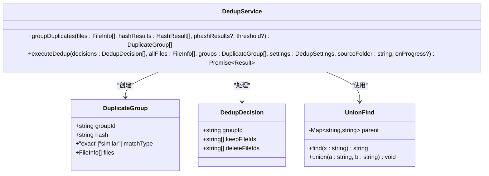

**图表来源**
- [dedup.service.ts:7-41](file://src/main/services/dedup.service.ts#L7-L41)
- [dedup.service.ts:43-130](file://src/main/services/dedup.service.ts#L43-L130)

**章节来源**
- [dedup.service.ts:1-209](file://src/main/services/dedup.service.ts#L1-L209)

### 设置管理服务 (Settings Service)

设置管理服务提供应用配置的持久化存储功能，确保用户偏好设置在重启后仍然有效。

**功能特性：**
- 默认配置管理
- 配置合并策略
- 类型安全的配置访问
- 自动持久化存储

**章节来源**
- [settings.service.ts:1-34](file://src/main/services/settings.service.ts#L1-L34)

## 架构概览

整个应用采用客户端-服务器架构，通过IPC通道实现主进程和渲染进程之间的通信。

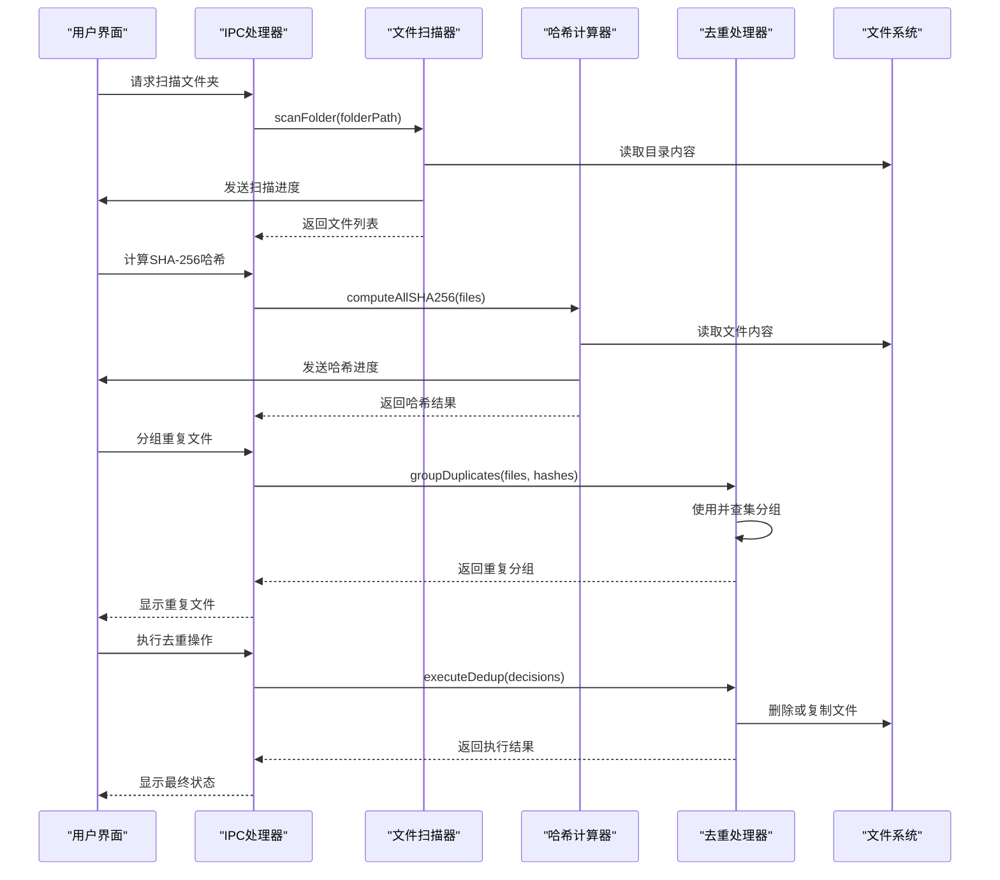

**图表来源**
- [ipc/index.ts:42-142](file://src/main/ipc/index.ts#L42-L142)
- [scanner.service.ts:28-85](file://src/main/services/scanner.service.ts#L28-L85)
- [hash.service.ts:29-56](file://src/main/services/hash.service.ts#L29-L56)
- [dedup.service.ts:117-208](file://src/main/services/dedup.service.ts#L117-L208)

## 详细组件分析

### 文件扫描服务实现详解

文件扫描服务采用了高效的双阶段扫描策略来处理大量文件：

#### 递归扫描算法

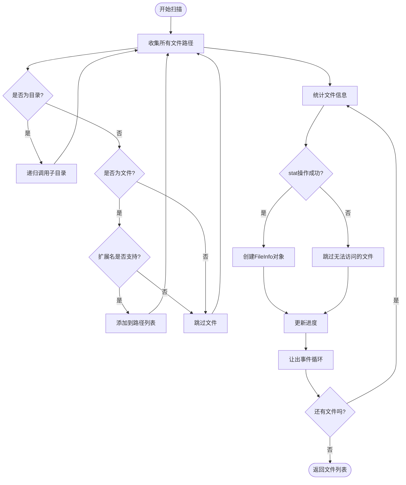

**图表来源**
- [scanner.service.ts:36-85](file://src/main/services/scanner.service.ts#L36-L85)

#### 文件过滤规则

支持的图片格式扩展名：
- `.jpg`, `.jpeg`, `.png`, `.gif`, `.bmp`, `.webp`, `.tiff`, `.tif`

文件过滤逻辑确保只处理受支持的图片格式，避免不必要的处理开销。

#### 性能优化策略

1. **双阶段扫描**: 先收集所有路径，再统一进行stat操作
2. **事件循环让出**: 每处理50个文件后让出CPU给其他任务
3. **错误容错**: 对无法访问的目录和文件进行优雅降级
4. **内存优化**: 使用流式处理避免大文件加载到内存

**章节来源**
- [scanner.service.ts:1-86](file://src/main/services/scanner.service.ts#L1-L86)

### 哈希计算服务深度解析

哈希计算服务提供了两种不同的重复检测方法，每种都有其特定的应用场景。

#### SHA-256精确匹配

SHA-256哈希计算采用流式处理方式，避免大文件占用过多内存：

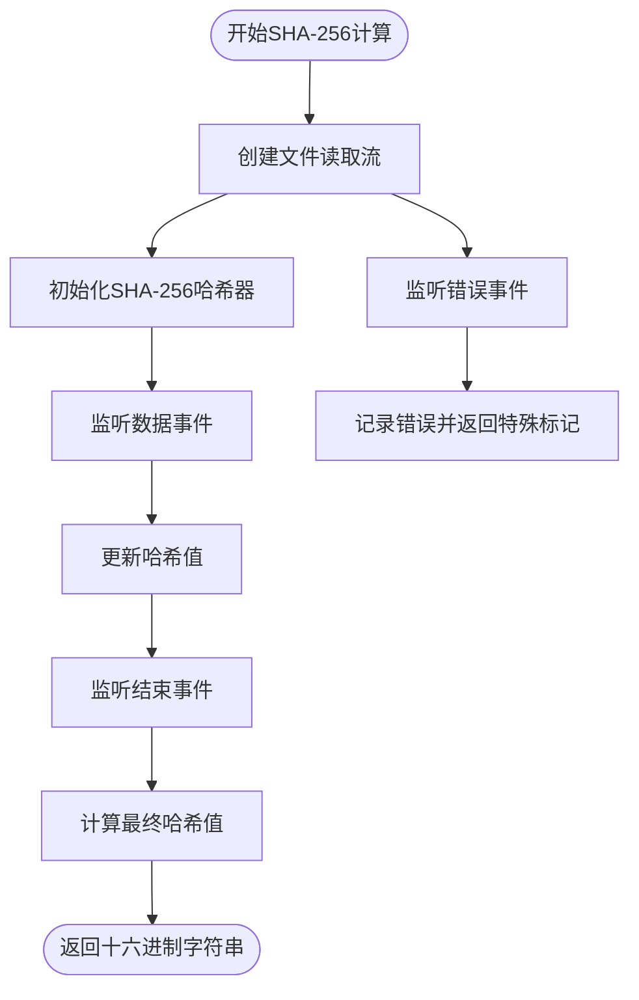

**图表来源**
- [hash.service.ts:19-27](file://src/main/services/hash.service.ts#L19-L27)

#### pHash相似度检测算法

pHash算法基于感知哈希理论，能够识别视觉上相似但可能经过压缩或轻微修改的图片：

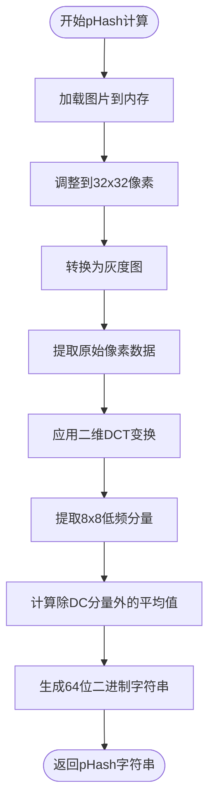

**图表来源**
- [hash.service.ts:58-101](file://src/main/services/hash.service.ts#L58-L101)

#### 并发处理策略

为了提高处理效率，服务采用了批量处理和并发执行策略：

- **SHA-256批处理**: 每批20个文件，使用Promise.all并发处理
- **pHash批处理**: 每批5个文件，避免图像处理的高内存消耗
- **事件循环让出**: 在批次之间让出CPU给其他任务

**章节来源**
- [hash.service.ts:1-180](file://src/main/services/hash.service.ts#L1-L180)

### 去重处理服务智能分组算法

去重处理服务的核心是智能分组算法，它结合了精确匹配和相似度检测两种策略。

#### 双重匹配策略

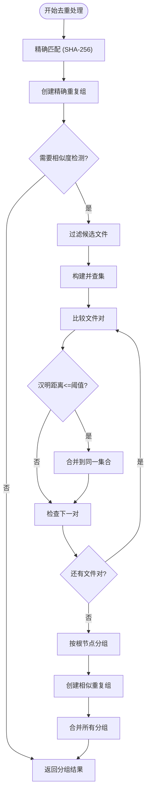

**图表来源**
- [dedup.service.ts:43-115](file://src/main/services/dedup.service.ts#L43-L115)

#### 并查集数据结构应用

并查集（Union-Find）是解决动态连通性问题的经典数据结构，在此应用中用于高效地管理相似文件的分组：

**核心操作复杂度：**
- `find`: O(α(n)) 平均时间复杂度
- `union`: O(α(n)) 平均时间复杂度
- 其中α是反阿克曼函数，增长极其缓慢

**实现特点：**
- 路径压缩：查找时压缩路径，提高后续查找效率
- 动态扩容：自动为新节点分配父节点
- 内存优化：使用Map存储，避免固定大小数组的内存浪费

**章节来源**
- [dedup.service.ts:25-41](file://src/main/services/dedup.service.ts#L25-L41)
- [dedup.service.ts:43-115](file://src/main/services/dedup.service.ts#L43-L115)

#### 执行模式

去重处理支持两种执行模式：

1. **删除模式**: 直接删除重复文件
2. **复制模式**: 将保留的文件复制到新的输出文件夹

**复制模式的工作流程：**
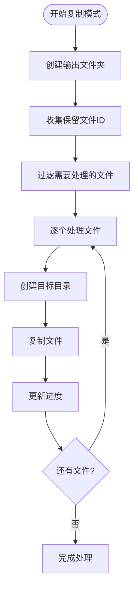

**图表来源**
- [dedup.service.ts:162-208](file://src/main/services/dedup.service.ts#L162-L208)

**章节来源**
- [dedup.service.ts:117-209](file://src/main/services/dedup.service.ts#L117-L209)

### 设置管理服务配置持久化

设置管理服务基于electron-store实现配置的持久化存储，提供类型安全的配置访问接口。

**配置结构：**
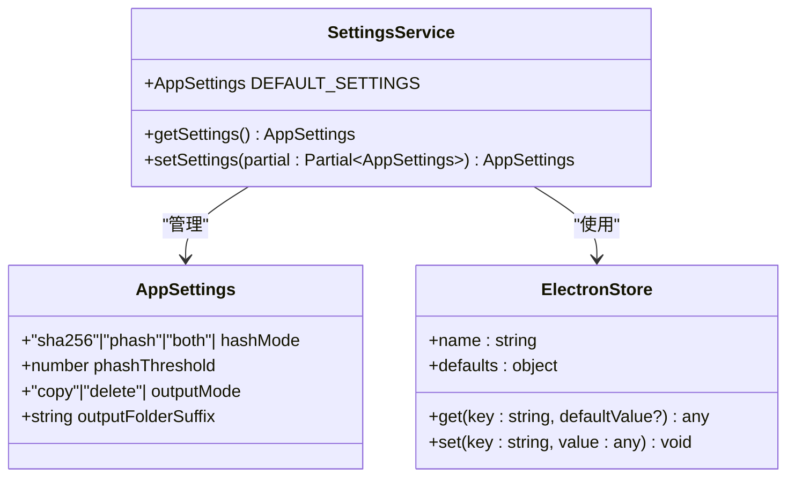

**图表来源**
- [settings.service.ts:3-33](file://src/main/services/settings.service.ts#L3-L33)

**默认配置：**
- `hashMode`: 'sha256' - 默认使用SHA-256精确匹配
- `phashThreshold`: 5 - pHash相似度阈值
- `outputMode`: 'copy' - 默认复制模式
- `outputFolderSuffix`: 'New' - 输出文件夹后缀

**章节来源**
- [settings.service.ts:1-34](file://src/main/services/settings.service.ts#L1-L34)

## 依赖关系分析

应用的依赖关系相对简洁，主要依赖于几个核心库：

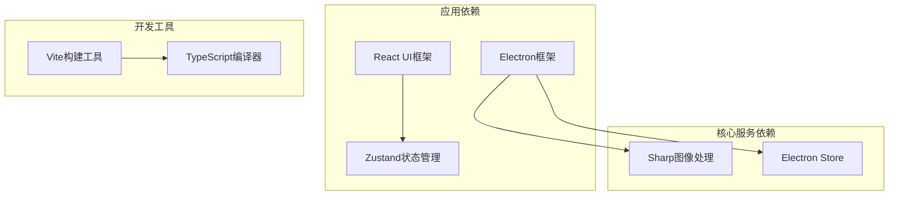

**图表来源**
- [package.json:13-34](file://package.json#L13-L34)

**外部依赖分析：**

1. **sharp**: 图像处理库，用于pHash计算和缩略图生成
2. **electron-store**: 配置持久化存储
3. **zustand**: 轻量级状态管理库
4. **electron**: 主进程运行环境

**章节来源**
- [package.json:13-18](file://package.json#L13-L18)

## 性能考虑

### 内存优化策略

1. **流式处理**: SHA-256计算使用文件流，避免大文件加载到内存
2. **批量处理**: 通过批处理减少内存峰值使用
3. **渐进式分组**: 并查集按需扩容，避免预分配过大内存

### CPU优化策略

1. **事件循环让出**: 在处理大量文件时定期让出CPU给其他任务
2. **并发控制**: 合理的并发数量平衡处理速度和资源消耗
3. **算法优化**: 使用高效的哈希算法和并查集结构

### I/O优化策略

1. **异步操作**: 所有文件系统操作都是异步的
2. **错误容错**: 对无法访问的文件进行优雅降级
3. **进度报告**: 实时反馈处理进度，提升用户体验

## 故障排除指南

### 常见问题及解决方案

**文件扫描失败**
- 检查目录权限是否正确
- 确认磁盘空间充足
- 验证路径是否有效

**哈希计算异常**
- 检查文件是否被其他程序占用
- 验证文件完整性
- 确认磁盘空间足够

**去重执行错误**
- 检查输出目录权限
- 验证磁盘空间是否充足
- 确认文件路径有效性

### 错误处理机制

每个服务都实现了完善的错误处理机制：

1. **文件访问错误**: 自动跳过无法访问的文件
2. **内存不足**: 通过批处理和事件循环让出缓解
3. **磁盘空间不足**: 在执行前进行空间检查
4. **网络相关错误**: 对于远程文件提供重试机制

**章节来源**
- [scanner.service.ts:40-42](file://src/main/services/scanner.service.ts#L40-L42)
- [hash.service.ts:43-45](file://src/main/services/hash.service.ts#L43-L45)
- [dedup.service.ts:151-153](file://src/main/services/dedup.service.ts#L151-L153)

## 结论

Redophoto的核心服务模块展现了现代桌面应用的最佳实践：

1. **模块化设计**: 清晰的服务边界和职责分离
2. **算法优化**: 高效的哈希算法和智能分组策略
3. **性能考量**: 多层次的性能优化策略
4. **用户体验**: 完善的进度反馈和错误处理
5. **可维护性**: 类型安全的代码和清晰的架构

这些服务模块共同构成了一个高效、可靠的照片去重解决方案，为用户提供了直观易用的界面和强大的后台处理能力。通过合理的算法选择和性能优化，应用能够在处理大量照片文件时保持良好的响应性和稳定性。