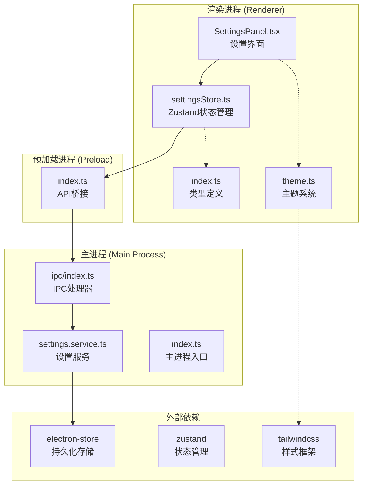
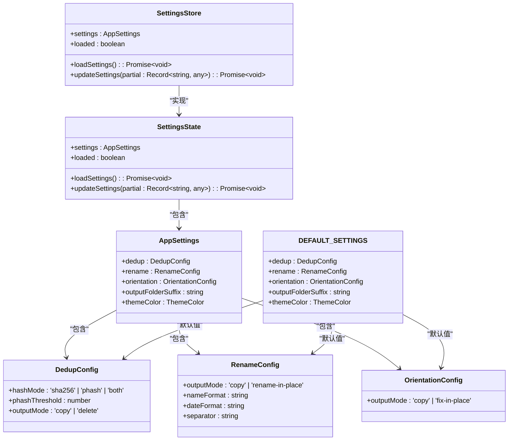
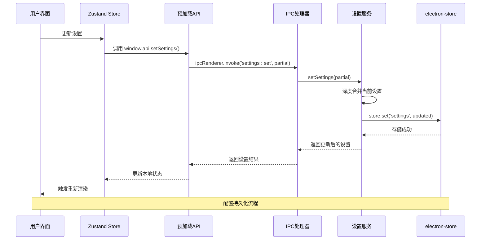
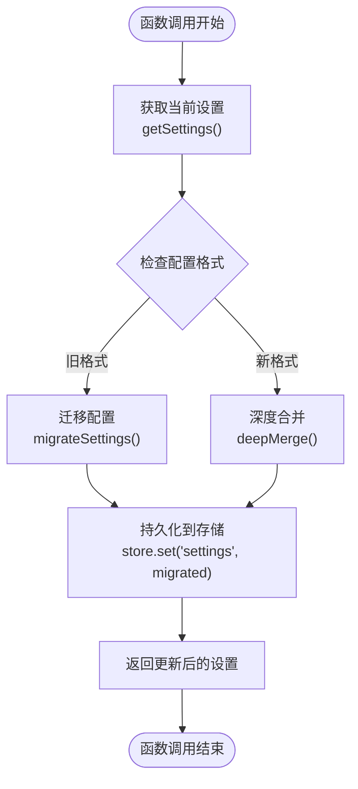
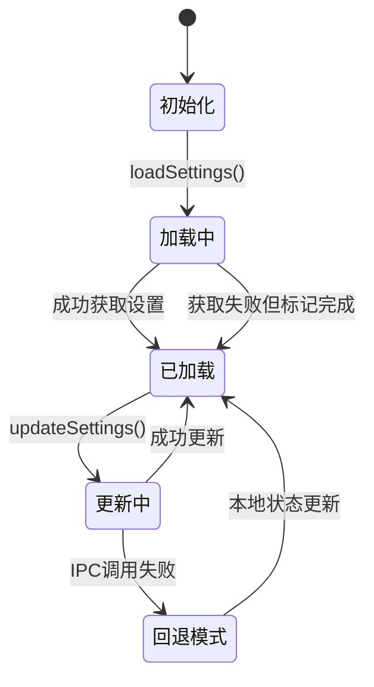
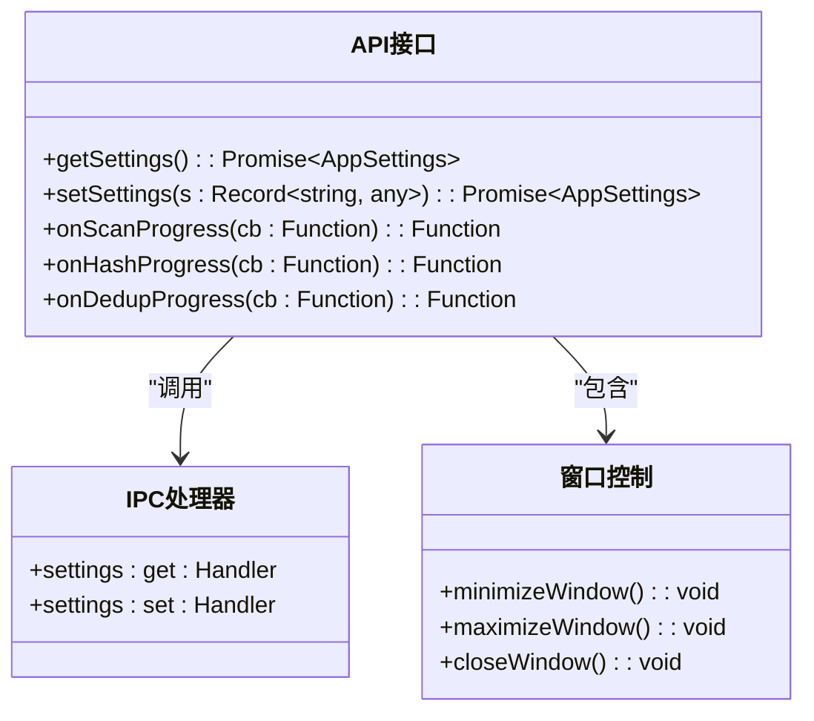
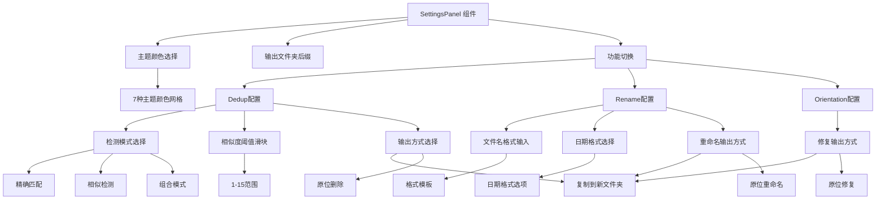
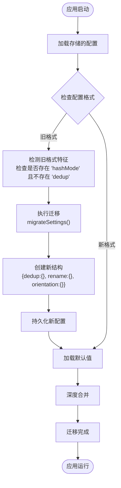
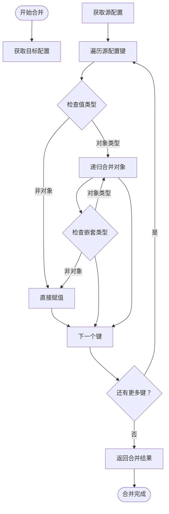

# 设置管理服务

<cite>
**本文档引用的文件**
- [settings.service.ts](file://src/main/services/settings.service.ts)
- [settingsStore.ts](file://src/renderer/src/stores/settingsStore.ts)
- [index.ts（主进程）](file://src/main/index.ts)
- [index.ts（IPC）](file://src/main/ipc/index.ts)
- [index.ts（预加载）](file://src/preload/index.ts)
- [SettingsPanel.tsx](file://src/renderer/src/components/SettingsPanel.tsx)
- [index.ts（类型定义）](file://src/renderer/src/types/index.ts)
- [theme.ts](file://src/renderer/src/types/theme.ts)
- [package.json](file://package.json)
</cite>

## 更新摘要
**所做更改**
- 重构设置管理架构，从平面结构迁移到功能特定的嵌套对象结构
- 新增去重、重命名、方向校正的独立配置对象
- 实现自动旧格式迁移机制，支持从旧版平面配置无缝升级
- 增强深度合并算法，支持多层级配置更新
- 更新设置界面，支持按功能模块的独立配置管理

## 目录
1. [简介](#简介)
2. [项目结构](#项目结构)
3. [核心组件](#核心组件)
4. [架构概览](#架构概览)
5. [详细组件分析](#详细组件分析)
6. [依赖关系分析](#依赖关系分析)
7. [性能考虑](#性能考虑)
8. [故障排除指南](#故障排除指南)
9. [结论](#结论)
10. [附录](#附录)

## 简介

设置管理服务是 Redophoto 照片去重桌面应用的核心配置管理系统。该系统负责管理应用程序的各种用户偏好设置，包括检测模式、输出策略、文件夹命名规则和主题颜色等。系统采用分层架构设计，通过 Electron 的 IPC 机制实现主进程与渲染进程之间的安全通信，确保配置数据在不同进程间的同步和一致性。

**更新** 系统已重构为支持功能特定配置的嵌套对象结构，将去重、重命名、方向校正等功能的配置分离到独立的对象中，提供更清晰的配置管理方式。新增自动迁移机制，能够从旧版平面配置结构无缝升级到新的嵌套结构。

本系统的主要特性包括：
- 基于 electron-store 的本地持久化存储
- 功能特定的嵌套配置结构，支持独立的功能配置管理
- 自动旧格式迁移机制，确保向后兼容性
- 深度合并算法，支持多层级配置更新
- 实时配置更新和热重载支持
- 完整的配置验证和默认值管理
- 前后端一致的配置状态同步

## 项目结构

设置管理服务在整个项目中的位置和组织方式如下：



**图表来源**
- [settings.service.ts:1-128](file://src/main/services/settings.service.ts#L1-L128)
- [index.ts（IPC）:152-155](file://src/main/ipc/index.ts#L152-L155)
- [index.ts（预加载）:97-100](file://src/preload/index.ts#L97-L100)

**章节来源**
- [settings.service.ts:1-128](file://src/main/services/settings.service.ts#L1-L128)
- [index.ts（主进程）:1-61](file://src/main/index.ts#L1-L61)
- [index.ts（IPC）:1-156](file://src/main/ipc/index.ts#L1-156)

## 核心组件

### 配置数据模型

设置管理服务的核心数据结构已重构为功能特定的嵌套对象结构，确保了类型安全和清晰的配置分离：



**图表来源**
- [settings.service.ts:22-47](file://src/main/services/settings.service.ts#L22-L47)
- [settingsStore.ts:4-28](file://src/renderer/src/stores/settingsStore.ts#L4-L28)

**更新** 配置数据模型已重构为嵌套对象结构，每个功能模块都有独立的配置对象，包括去重配置、重命名配置和方向校正配置，提供更清晰的配置分离和管理方式。

### 配置持久化机制

系统采用 electron-store 作为持久化存储解决方案，提供了以下特性：

- **自动序列化**：所有配置数据自动转换为 JSON 格式存储
- **默认值支持**：通过 defaults 配置提供可靠的初始状态
- **跨平台兼容**：支持 Windows、macOS 和 Linux 平台
- **类型安全**：结合 TypeScript 确保数据完整性
- **自动迁移**：支持从旧版平面配置结构的自动升级

**章节来源**
- [settings.service.ts:58-63](file://src/main/services/settings.service.ts#L58-L63)
- [package.json:16](file://package.json#L16)

## 架构概览

设置管理服务采用分层架构，确保了清晰的关注点分离和良好的可维护性：



**图表来源**
- [settingsStore.ts:43-54](file://src/renderer/src/stores/settingsStore.ts#L43-L54)
- [index.ts（预加载）:99](file://src/preload/index.ts#L99)
- [index.ts（IPC）:154](file://src/main/ipc/index.ts#L154)
- [settings.service.ts:122-127](file://src/main/services/settings.service.ts#L122-L127)

## 详细组件分析

### 主进程设置服务

主进程的设置服务是整个配置管理的核心，负责实际的数据持久化和业务逻辑处理：



**图表来源**
- [settings.service.ts:110-127](file://src/main/services/settings.service.ts#L110-L127)

**更新** 主进程设置服务已重构，新增自动格式检测和迁移机制，支持从旧版平面配置结构无缝升级到新的嵌套结构。

#### 关键实现特性

1. **格式检测机制**：通过 `isOldFormat()` 函数检测配置格式，自动识别旧版平面结构
2. **自动迁移功能**：使用 `migrateSettings()` 函数将旧配置转换为新的嵌套结构
3. **深度合并算法**：通过 `deepMerge()` 函数支持多层级配置的增量更新
4. **类型安全保障**：通过 TypeScript 确保传入参数的类型正确性

**章节来源**
- [settings.service.ts:65-108](file://src/main/services/settings.service.ts#L65-L108)

### 渲染进程状态管理

渲染进程使用 Zustand 进行本地状态管理，提供响应式的用户界面更新：



**图表来源**
- [settingsStore.ts:34-54](file://src/renderer/src/stores/settingsStore.ts#L34-L54)

**更新** 渲染进程状态管理已更新，支持新的嵌套配置结构，通过 `updateSettings()` 函数接收任意层级的配置更新。

#### 状态管理模式

1. **双层状态保护**：本地状态 + IPC 调用的双重保障机制
2. **错误回退策略**：IPC 调用失败时自动降级到本地状态更新
3. **异步加载机制**：应用启动时自动加载持久化的配置
4. **灵活更新支持**：支持任意层级的配置更新，包括嵌套对象

**章节来源**
- [settingsStore.ts:30-54](file://src/renderer/src/stores/settingsStore.ts#L30-L54)

### IPC 通信接口

预加载脚本暴露了安全的 API 接口，供渲染进程调用：



**图表来源**
- [index.ts（预加载）:61-122](file://src/preload/index.ts#L61-L122)
- [index.ts（IPC）:152-155](file://src/main/ipc/index.ts#L152-L155)

**章节来源**
- [index.ts（预加载）:97-100](file://src/preload/index.ts#L97-L100)
- [index.ts（IPC）:152-155](file://src/main/ipc/index.ts#L152-L155)

### 设置界面组件

设置面板提供了直观的用户交互界面，支持实时配置修改，包括按功能模块的独立配置管理：



**图表来源**
- [SettingsPanel.tsx:9-304](file://src/renderer/src/components/SettingsPanel.tsx#L9-L304)

**更新** 设置界面已重构，支持按功能模块的独立配置管理，每个功能模块都有专门的配置区域，包括去重、重命名和方向校正的独立设置界面。

**章节来源**
- [SettingsPanel.tsx:1-304](file://src/renderer/src/components/SettingsPanel.tsx#L1-L304)

### 配置迁移策略

系统实现了完整的配置迁移机制，确保从旧版平面结构到新版嵌套结构的无缝升级：



**图表来源**
- [settings.service.ts:65-81](file://src/main/services/settings.service.ts#L65-L81)
- [settings.service.ts:110-120](file://src/main/services/settings.service.ts#L110-L120)

**更新** 新增完整的配置迁移策略，包括格式检测、自动迁移和深度合并机制，确保用户配置的无缝升级。

**章节来源**
- [settings.service.ts:49-81](file://src/main/services/settings.service.ts#L49-L81)

### 深度合并算法

系统采用增强的深度合并算法，支持多层级配置的增量更新：



**图表来源**
- [settings.service.ts:87-108](file://src/main/services/settings.service.ts#L87-L108)

**更新** 深度合并算法已增强，支持多层级配置对象的递归合并，确保嵌套配置结构的正确更新。

**章节来源**
- [settings.service.ts:83-108](file://src/main/services/settings.service.ts#L83-L108)

## 依赖关系分析

设置管理服务的依赖关系体现了清晰的分层架构：

```mermaid
graph LR
subgraph "应用层"
UI[设置界面组件]
Store[状态管理Store]
Theme[主题系统]
end
subgraph "接口层"
PreloadAPI[预加载API]
IPCHandlers[IPC处理器]
end
subgraph "服务层"
SettingsService[设置服务]
end
subgraph "存储层"
ElectronStore[electron-store]
end
subgraph "外部依赖"
React[React框架]
Zustand[Zustand状态管理]
Electron[Electron框架]
TailwindCSS[Tailwind CSS]
End
UI --> Store
Store --> PreloadAPI
PreloadAPI --> IPCHandlers
IPCHandlers --> SettingsService
SettingsService --> ElectronStore
UI --> Theme
Theme --> TailwindCSS
UI -.-> React
Store -.-> Zustand
PreloadAPI -.-> Electron
IPCHandlers -.-> Electron
SettingsService -.-> Electron
```

**图表来源**
- [package.json:13-18](file://package.json#L13-L18)
- [index.ts（主进程）:4](file://src/main/index.ts#L4)

### 外部依赖分析

系统主要依赖以下关键包：

- **electron-store (v8.2.0)**：提供跨平台的配置持久化能力
- **zustand (v5.0.3)**：轻量级的状态管理解决方案
- **@electron-toolkit/preload**：增强的预加载脚本工具包
- **tailwindcss**：实用优先的CSS框架，支持主题系统

**章节来源**
- [package.json:13-18](file://package.json#L13-L18)

## 性能考虑

设置管理服务在设计时充分考虑了性能优化：

### 存储性能优化

1. **增量更新**：只更新发生变化的配置字段，减少不必要的存储操作
2. **批量处理**：避免频繁的 IPC 调用，在用户操作期间延迟更新
3. **内存缓存**：渲染进程维护本地状态缓存，减少重复的 IPC 请求
4. **深度合并优化**：只对非数组对象进行递归合并，提高性能

### 网络和IPC性能

1. **异步处理**：所有 IPC 操作都是异步的，不会阻塞主线程
2. **错误容错**：IPC 调用失败时自动降级到本地状态，保证用户体验
3. **连接复用**：单个 IPC 连接用于所有配置操作

### 内存管理

1. **状态清理**：组件卸载时自动清理事件监听器
2. **引用优化**：使用浅拷贝避免深层对象的昂贵复制操作
3. **主题缓存**：主题类映射结果缓存，避免重复计算
4. **迁移缓存**：迁移结果缓存，避免重复的格式检测

**更新** 新增深度合并算法的性能优化，包括对象类型检查和递归合并的效率提升。

## 故障排除指南

### 常见问题及解决方案

#### 配置无法保存

**症状**：用户更新设置后重启应用发现配置恢复默认值

**可能原因**：
1. electron-store 存储权限问题
2. 应用程序崩溃导致数据丢失
3. 文件系统权限不足

**解决步骤**：
1. 检查应用程序是否有足够的文件系统权限
2. 验证配置文件是否被其他程序锁定
3. 尝试重启应用程序以释放存储锁

#### IPC 调用失败

**症状**：设置更新后界面没有反映最新的配置

**可能原因**：
1. 预加载脚本未正确初始化
2. IPC 通道断开
3. 类型不匹配导致的序列化错误

**解决步骤**：
1. 检查预加载 API 是否正确暴露
2. 验证 IPC 处理器是否注册成功
3. 确认数据类型与接口定义一致

#### 状态同步问题

**症状**：主进程和渲染进程显示不同的配置状态

**可能原因**：
1. 缓存状态未及时更新
2. 异步操作竞态条件
3. 错误回退机制触发

**解决步骤**：
1. 确保每次设置更新后都重新加载状态
2. 检查异步操作的执行顺序
3. 验证错误回退逻辑的正确性

#### 配置迁移失败

**症状**：应用启动后配置重置为默认值

**可能原因**：
1. 旧格式检测失败
2. 迁移函数执行错误
3. 存储写入失败

**解决步骤**：
1. 检查旧配置格式是否符合预期
2. 验证迁移函数的逻辑正确性
3. 确认 electron-store 的写入权限

#### 深度合并错误

**症状**：配置更新后出现意外的配置行为

**可能原因**：
1. 递归合并逻辑错误
2. 类型检查失败
3. 数组类型处理不当

**解决步骤**：
1. 检查深度合并算法的实现
2. 验证类型检查逻辑
3. 确认数组类型的特殊处理

**更新** 新增配置迁移和深度合并相关的故障排除指南。

**章节来源**
- [settingsStore.ts:43-54](file://src/renderer/src/stores/settingsStore.ts#L43-L54)
- [index.ts（预加载）:97-100](file://src/preload/index.ts#L97-L100)

## 结论

设置管理服务通过精心设计的分层架构和完善的错误处理机制，为 Redophoto 应用提供了可靠、高效的配置管理能力。系统的关键优势包括：

1. **类型安全**：完整的 TypeScript 支持确保编译时类型检查
2. **持久化可靠**：基于 electron-store 的跨平台存储解决方案
3. **架构先进**：功能特定的嵌套配置结构提供清晰的配置分离
4. **迁移友好**：自动格式检测和迁移机制确保向后兼容性
5. **用户体验**：即时反馈和错误回退机制提升用户满意度
6. **扩展性强**：模块化设计便于未来功能扩展
7. **性能优化**：深度合并算法和缓存机制提升系统性能

**更新** 新的嵌套配置架构显著提升了配置管理的清晰度和可维护性，自动迁移机制确保了用户配置的无缝升级，深度合并算法提供了灵活的配置更新支持。

该系统为照片去重应用提供了坚实的基础配置管理能力，支持用户根据需求灵活调整检测模式、输出策略、文件命名规则和界面主题等关键参数。

## 附录

### API 接口文档

#### 主进程设置服务 API

| 方法 | 参数 | 返回值 | 描述 |
|------|------|--------|------|
| getSettings() | 无 | AppSettings | 获取当前配置设置，支持嵌套结构 |
| setSettings(partial) | DeepPartial<AppSettings> | AppSettings | 更新部分配置设置，支持深度合并 |

#### 渲染进程 Store API

| 方法 | 参数 | 返回值 | 描述 |
|------|------|--------|------|
| loadSettings() | 无 | Promise<void> | 异步加载配置设置 |
| updateSettings(partial) | Record<string, any> | Promise<void> | 异步更新配置设置，支持嵌套对象 |

#### 预加载 API 接口

| 方法 | 参数 | 返回值 | 描述 |
|------|------|--------|------|
| getSettings() | 无 | Promise<AppSettings> | 获取当前配置设置 |
| setSettings(s) | Record<string, any> | Promise<AppSettings> | 更新配置设置，支持嵌套结构 |

**更新** API 接口现在支持新的嵌套配置结构，包括深度合并和自动迁移功能。

### 配置验证规则

系统采用以下验证规则确保配置数据的有效性：

1. **嵌套结构验证**：确保 dedup、rename、orientation 对象存在
2. **枚举值验证**：各功能模块的枚举值必须在允许范围内
3. **数值范围验证**：phashThreshold 必须在 1-15 范围内
4. **输出模式验证**：各功能模块的输出模式必须有效
5. **字符串验证**：nameFormat、dateFormat、separator 必须有效
6. **主题颜色验证**：themeColor 必须是有效的主题枚举值

**更新** 新增嵌套结构验证规则，确保配置对象的完整性和有效性。

### 默认值管理

系统提供以下默认配置值：

```typescript
const DEFAULT_SETTINGS: AppSettings = {
  dedup: {
    hashMode: 'sha256',
    phashThreshold: 5,
    outputMode: 'copy'
  },
  rename: {
    outputMode: 'copy',
    nameFormat: '{date}_{location}_{seq}',
    dateFormat: 'YYYY-MM-DD',
    separator: '_'
  },
  orientation: {
    outputMode: 'copy'
  },
  outputFolderSuffix: 'New',
  themeColor: 'black'
}
```

**更新** 默认值现在支持新的嵌套配置结构，每个功能模块都有独立的默认配置。

### 配置迁移策略

系统采用以下迁移策略确保向后兼容性：

1. **格式检测**：通过 `isOldFormat()` 函数检测配置格式
2. **自动迁移**：使用 `migrateSettings()` 函数执行配置转换
3. **深度合并**：使用 `deepMerge()` 函数合并默认值和存储值
4. **向后兼容**：新字段自动使用默认值，旧字段保持不变

**更新** 新增完整的配置迁移策略，包括格式检测、自动迁移和深度合并机制。

### 配置结构说明

新的嵌套配置结构包含以下主要部分：

```typescript
interface AppSettings {
  dedup: DedupConfig        // 去重功能配置
  rename: RenameConfig      // 重命名功能配置  
  orientation: OrientationConfig  // 方向校正配置
  outputFolderSuffix: string   // 全局输出设置
  themeColor: ThemeColor       // 主题颜色设置
}

interface DedupConfig {
  hashMode: 'sha256' | 'phash' | 'both'
  phashThreshold: number
  outputMode: 'copy' | 'delete'
}

interface RenameConfig {
  outputMode: 'copy' | 'rename-in-place'
  nameFormat: string
  dateFormat: string
  separator: string
}

interface OrientationConfig {
  outputMode: 'copy' | 'fix-in-place'
}
```

**更新** 新增详细的配置结构说明，展示新的嵌套对象结构和各功能模块的独立配置。

### 最佳实践建议

1. **配置更新时机**：建议在用户完成设置操作后再进行持久化保存
2. **错误处理**：始终处理 IPC 调用的异常情况
3. **状态同步**：确保主进程和渲染进程的状态保持一致
4. **性能优化**：避免频繁的配置更新操作
5. **用户体验**：提供即时的视觉反馈确认配置变更
6. **配置备份**：定期备份重要配置，防止意外丢失
7. **迁移测试**：在新版本发布前充分测试配置迁移功能
8. **深度合并**：合理使用深度合并功能，避免意外的配置覆盖
9. **类型安全**：充分利用 TypeScript 的类型检查功能
10. **向后兼容**：新功能开发时考虑向后兼容性要求