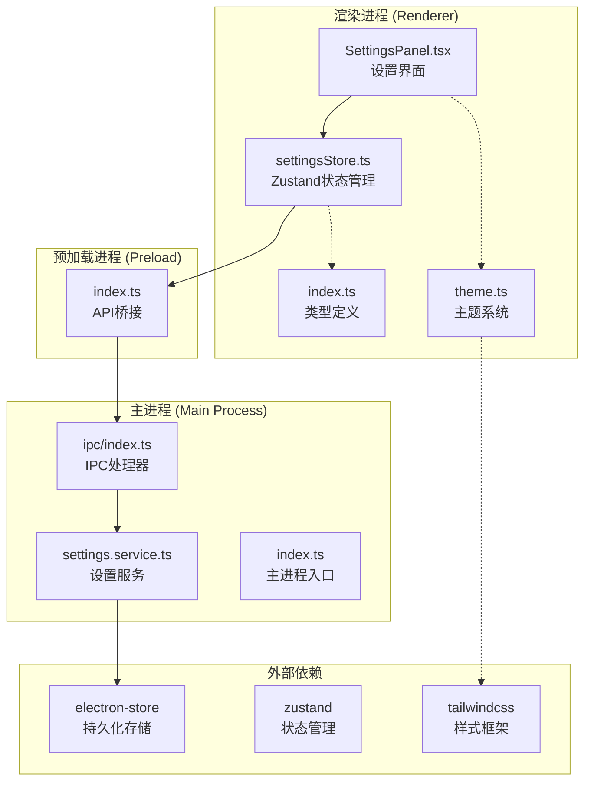
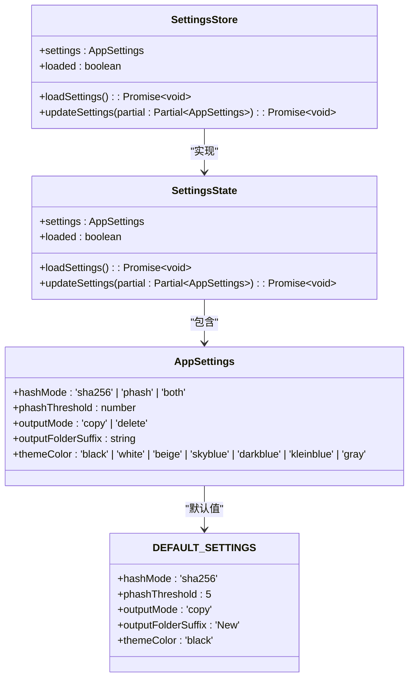
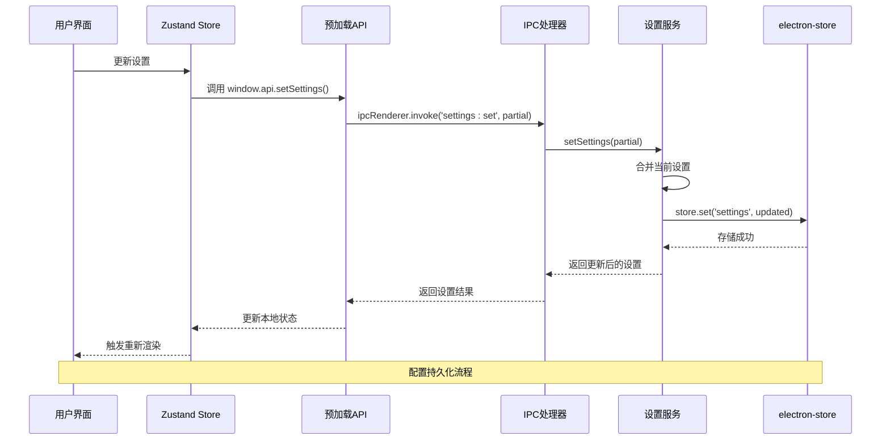
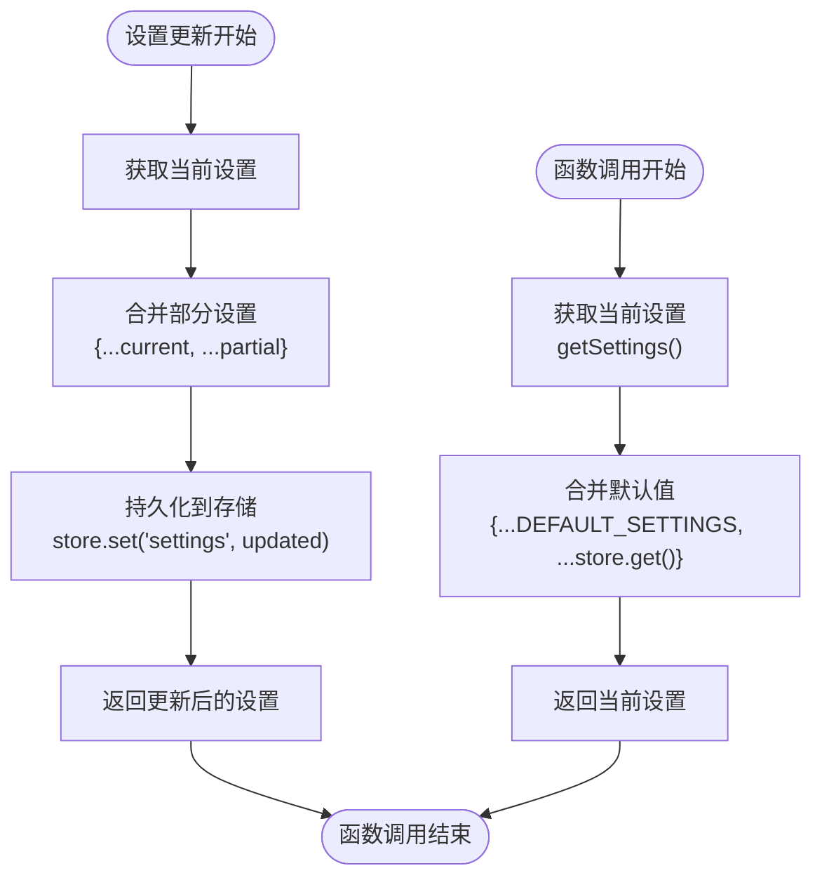
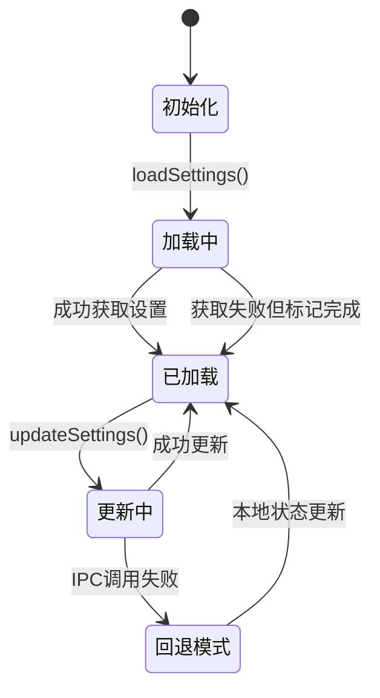
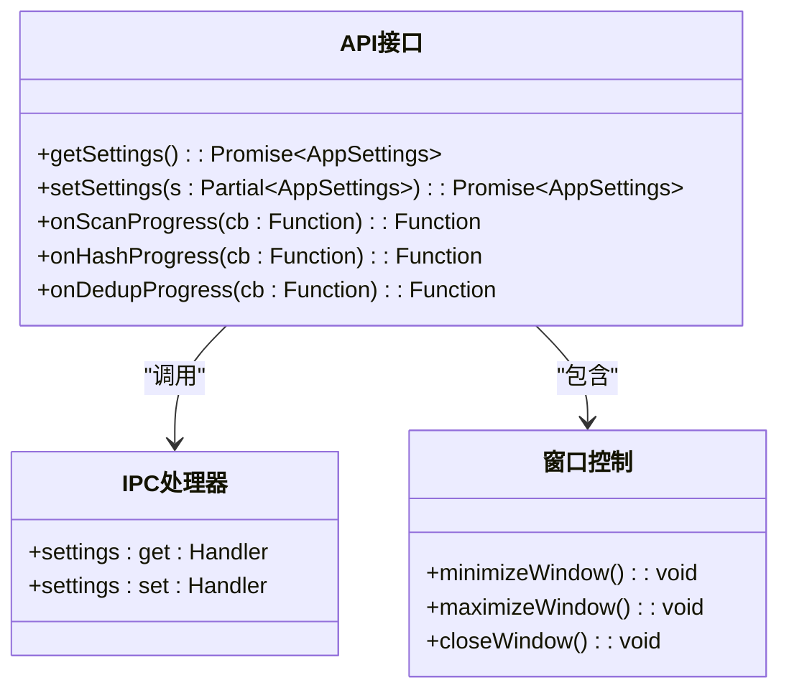
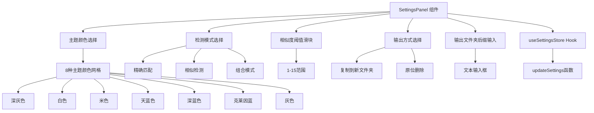
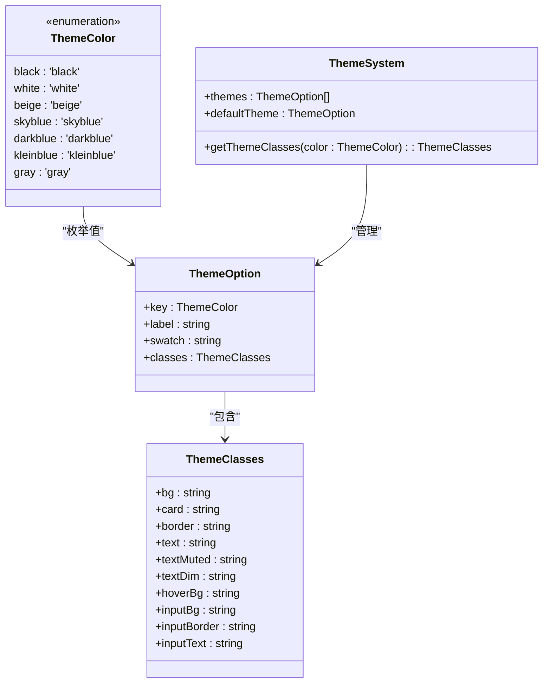

# 设置管理服务

<cite>
**本文档引用的文件**
- [settings.service.ts](file://src/main/services/settings.service.ts)
- [settingsStore.ts](file://src/renderer/src/stores/settingsStore.ts)
- [index.ts（主进程）](file://src/main/index.ts)
- [index.ts（IPC）](file://src/main/ipc/index.ts)
- [index.ts（预加载）](file://src/preload/index.ts)
- [SettingsPanel.tsx](file://src/renderer/src/components/SettingsPanel.tsx)
- [index.ts（类型定义）](file://src/renderer/src/types/index.ts)
- [theme.ts](file://src/renderer/src/types/theme.ts)
- [package.json](file://package.json)
</cite>

## 更新摘要
**所做更改**
- 更新了主题颜色枚举，从七种颜色扩展为八种颜色，新增 'gray' 灰色主题
- 更新了配置数据模型，包含新的主题颜色选项
- 扩展了默认设置值，添加 themeColor: 'black'
- 更新了设置界面组件，显示八种主题颜色选择
- 完善了主题颜色系统，包含灰色主题的完整实现

## 目录
1. [简介](#简介)
2. [项目结构](#项目结构)
3. [核心组件](#核心组件)
4. [架构概览](#架构概览)
5. [详细组件分析](#详细组件分析)
6. [依赖关系分析](#依赖关系分析)
7. [性能考虑](#性能考虑)
8. [故障排除指南](#故障排除指南)
9. [结论](#结论)
10. [附录](#附录)

## 简介

设置管理服务是 Redophoto 照片去重桌面应用的核心配置管理系统。该系统负责管理应用程序的各种用户偏好设置，包括检测模式、输出策略、文件夹命名规则和主题颜色等。系统采用分层架构设计，通过 Electron 的 IPC 机制实现主进程与渲染进程之间的安全通信，确保配置数据在不同进程间的同步和一致性。

**更新** 新增主题颜色管理功能，支持用户自定义界面主题，包括深灰色、白色、米色、天蓝色、深蓝色、克莱因蓝、群青色和灰色等多种主题选项，现已扩展为八种预定义主题。

本系统的主要特性包括：
- 基于 electron-store 的本地持久化存储
- 类型安全的配置数据模型，包含主题颜色支持
- 实时配置更新和热重载支持
- 完整的配置验证和默认值管理
- 前后端一致的配置状态同步
- 丰富的主题颜色选择系统，现已支持八种主题

## 项目结构

设置管理服务在整个项目中的位置和组织方式如下：



**图表来源**
- [settings.service.ts:1-36](file://src/main/services/settings.service.ts#L1-L36)
- [index.ts（IPC）:152-155](file://src/main/ipc/index.ts#L152-L155)
- [index.ts（预加载）:97-100](file://src/preload/index.ts#L97-L100)

**章节来源**
- [settings.service.ts:1-36](file://src/main/services/settings.service.ts#L1-L36)
- [index.ts（主进程）:1-61](file://src/main/index.ts#L1-L61)
- [index.ts（IPC）:1-156](file://src/main/ipc/index.ts#L1-156)

## 核心组件

### 配置数据模型

设置管理服务的核心数据结构定义在多个位置，确保了类型安全和一致性：



**图表来源**
- [settings.service.ts:3-17](file://src/main/services/settings.service.ts#L3-L17)
- [settingsStore.ts:4-18](file://src/renderer/src/stores/settingsStore.ts#L4-L18)

**更新** 新增 themeColor 字段，支持主题颜色的持久化存储，包含八种预定义主题选项，新增的灰色主题为 'gray'。

### 配置持久化机制

系统采用 electron-store 作为持久化存储解决方案，提供了以下特性：

- **自动序列化**：所有配置数据自动转换为 JSON 格式存储
- **默认值支持**：通过 defaults 配置提供可靠的初始状态
- **跨平台兼容**：支持 Windows、macOS 和 Linux 平台
- **类型安全**：结合 TypeScript 确保数据完整性

**章节来源**
- [settings.service.ts:19-24](file://src/main/services/settings.service.ts#L19-L24)
- [package.json:16](file://package.json#L16)

## 架构概览

设置管理服务采用分层架构，确保了清晰的关注点分离和良好的可维护性：



**图表来源**
- [settingsStore.ts:30-40](file://src/renderer/src/stores/settingsStore.ts#L30-L40)
- [index.ts（预加载）:99](file://src/preload/index.ts#L99)
- [index.ts（IPC）:154](file://src/main/ipc/index.ts#L154)
- [settings.service.ts:30-35](file://src/main/services/settings.service.ts#L30-L35)

## 详细组件分析

### 主进程设置服务

主进程的设置服务是整个配置管理的核心，负责实际的数据持久化和业务逻辑处理：



**图表来源**
- [settings.service.ts:26-35](file://src/main/services/settings.service.ts#L26-L35)

**更新** 新增 themeColor 字段的处理，确保主题颜色配置能够正确持久化和恢复，包括新增的灰色主题选项。

#### 关键实现特性

1. **默认值优先级**：系统采用 `默认值覆盖存储值` 的策略，确保新字段的可用性
2. **部分更新支持**：允许只更新配置的一部分字段，包括新增的 themeColor 属性
3. **类型安全保障**：通过 TypeScript 确保传入参数的类型正确性

**章节来源**
- [settings.service.ts:26-35](file://src/main/services/settings.service.ts#L26-L35)

### 渲染进程状态管理

渲染进程使用 Zustand 进行本地状态管理，提供响应式的用户界面更新：



**图表来源**
- [settingsStore.ts:11-41](file://src/renderer/src/stores/settingsStore.ts#L11-L41)

**更新** 新增 themeColor 字段的本地状态管理，确保主题颜色变化能够即时反映在用户界面中，包括新增的灰色主题。

#### 状态管理模式

1. **双层状态保护**：本地状态 + IPC 调用的双重保障机制
2. **错误回退策略**：IPC 调用失败时自动降级到本地状态更新
3. **异步加载机制**：应用启动时自动加载持久化的配置，包括主题颜色设置

**章节来源**
- [settingsStore.ts:21-40](file://src/renderer/src/stores/settingsStore.ts#L21-L40)

### IPC 通信接口

预加载脚本暴露了安全的 API 接口，供渲染进程调用：



**图表来源**
- [index.ts（预加载）:61-122](file://src/preload/index.ts#L61-L122)
- [index.ts（IPC）:152-155](file://src/main/ipc/index.ts#L152-L155)

**章节来源**
- [index.ts（预加载）:97-100](file://src/preload/index.ts#L97-L100)
- [index.ts（IPC）:152-155](file://src/main/ipc/index.ts#L152-L155)

### 设置界面组件

设置面板提供了直观的用户交互界面，支持实时配置修改，包括新增的主题颜色选择功能：



**图表来源**
- [SettingsPanel.tsx:33-56](file://src/renderer/src/components/SettingsPanel.tsx#L33-L56)
- [SettingsPanel.tsx:28-179](file://src/renderer/src/components/SettingsPanel.tsx#L28-L179)

**更新** 新增主题颜色选择区域，提供八种预定义主题供用户选择，每种主题都有对应的颜色预览和标签显示，包括新增的灰色主题。

**章节来源**
- [SettingsPanel.tsx:8-179](file://src/renderer/src/components/SettingsPanel.tsx#L8-L179)

### 主题颜色系统

系统集成了完整的主题颜色管理功能，提供丰富的视觉体验：



**图表来源**
- [theme.ts:1-150](file://src/renderer/src/types/theme.ts#L1-150)

**更新** 新增完整的主题颜色系统，包含八种预定义主题的完整实现，支持颜色预览、标签显示和样式类映射，新增的灰色主题为 'gray'。

**章节来源**
- [theme.ts:20-150](file://src/renderer/src/types/theme.ts#L20-L150)

## 依赖关系分析

设置管理服务的依赖关系体现了清晰的分层架构：

```mermaid
graph LR
subgraph "应用层"
UI[设置界面组件]
Store[状态管理Store]
Theme[主题系统]
end
subgraph "接口层"
PreloadAPI[预加载API]
IPCHandlers[IPC处理器]
end
subgraph "服务层"
SettingsService[设置服务]
end
subgraph "存储层"
ElectronStore[electron-store]
end
subgraph "外部依赖"
React[React框架]
Zustand[Zustand状态管理]
Electron[Electron框架]
TailwindCSS[Tailwind CSS]
End
UI --> Store
Store --> PreloadAPI
PreloadAPI --> IPCHandlers
IPCHandlers --> SettingsService
SettingsService --> ElectronStore
UI --> Theme
Theme --> TailwindCSS
UI -.-> React
Store -.-> Zustand
PreloadAPI -.-> Electron
IPCHandlers -.-> Electron
SettingsService -.-> Electron
```

**图表来源**
- [package.json:13-18](file://package.json#L13-L18)
- [index.ts（主进程）:4](file://src/main/index.ts#L4)

### 外部依赖分析

系统主要依赖以下关键包：

- **electron-store (v8.2.0)**：提供跨平台的配置持久化能力
- **zustand (v5.0.3)**：轻量级的状态管理解决方案
- **@electron-toolkit/preload**：增强的预加载脚本工具包
- **tailwindcss**：实用优先的CSS框架，支持主题系统

**更新** 新增 Tailwind CSS 依赖，用于支持主题颜色的样式应用。

**章节来源**
- [package.json:13-18](file://package.json#L13-L18)

## 性能考虑

设置管理服务在设计时充分考虑了性能优化：

### 存储性能优化

1. **增量更新**：只更新发生变化的配置字段，减少不必要的存储操作
2. **批量处理**：避免频繁的 IPC 调用，在用户操作期间延迟更新
3. **内存缓存**：渲染进程维护本地状态缓存，减少重复的 IPC 请求

### 网络和IPC性能

1. **异步处理**：所有 IPC 操作都是异步的，不会阻塞主线程
2. **错误容错**：IPC 调用失败时自动降级到本地状态，保证用户体验
3. **连接复用**：单个 IPC 连接用于所有配置操作

### 内存管理

1. **状态清理**：组件卸载时自动清理事件监听器
2. **引用优化**：使用浅拷贝避免深层对象的昂贵复制操作
3. **主题缓存**：主题类映射结果缓存，避免重复计算

**更新** 新增主题颜色选择的性能优化，包括主题类映射缓存和颜色预览的高效渲染。

## 故障排除指南

### 常见问题及解决方案

#### 配置无法保存

**症状**：用户更新设置后重启应用发现配置恢复默认值

**可能原因**：
1. electron-store 存储权限问题
2. 应用程序崩溃导致数据丢失
3. 文件系统权限不足

**解决步骤**：
1. 检查应用程序是否有足够的文件系统权限
2. 验证配置文件是否被其他程序锁定
3. 尝试重启应用程序以释放存储锁

#### IPC 调用失败

**症状**：设置更新后界面没有反映最新的配置

**可能原因**：
1. 预加载脚本未正确初始化
2. IPC 通道断开
3. 类型不匹配导致的序列化错误

**解决步骤**：
1. 检查预加载 API 是否正确暴露
2. 验证 IPC 处理器是否注册成功
3. 确认数据类型与接口定义一致

#### 状态同步问题

**症状**：主进程和渲染进程显示不同的配置状态

**可能原因**：
1. 缓存状态未及时更新
2. 异步操作竞态条件
3. 错误回退机制触发

**解决步骤**：
1. 确保每次设置更新后都重新加载状态
2. 检查异步操作的执行顺序
3. 验证错误回退逻辑的正确性

#### 主题颜色不生效

**症状**：用户选择主题颜色后界面没有相应变化

**可能原因**：
1. 主题类映射未正确应用
2. CSS 类名拼写错误
3. Tailwind CSS 配置问题

**解决步骤**：
1. 检查主题类映射函数是否正确返回样式类
2. 验证 CSS 类名与 Tailwind 配置一致
3. 确认主题颜色枚举值与预定义主题匹配

**更新** 新增主题颜色相关的故障排除指南，包括新增灰色主题的故障排除。

**章节来源**
- [settingsStore.ts:34-38](file://src/renderer/src/stores/settingsStore.ts#L34-L38)
- [index.ts（预加载）:97-100](file://src/preload/index.ts#L97-L100)

## 结论

设置管理服务通过精心设计的分层架构和完善的错误处理机制，为 Redophoto 应用提供了可靠、高效的配置管理能力。系统的关键优势包括：

1. **类型安全**：完整的 TypeScript 支持确保编译时类型检查
2. **持久化可靠**：基于 electron-store 的跨平台存储解决方案
3. **用户体验**：即时反馈和错误回退机制提升用户满意度
4. **扩展性强**：模块化设计便于未来功能扩展
5. **视觉丰富**：完整的主题颜色系统提供多样化的界面体验，现已支持八种预定义主题

**更新** 新增的主题颜色管理功能显著提升了用户的个性化体验，支持八种预定义主题，满足不同用户的视觉偏好，包括新增的灰色主题选项。

该系统为照片去重应用提供了坚实的基础配置管理能力，支持用户根据需求灵活调整检测模式、输出策略和界面主题等关键参数。

## 附录

### API 接口文档

#### 主进程设置服务 API

| 方法 | 参数 | 返回值 | 描述 |
|------|------|--------|------|
| getSettings() | 无 | AppSettings | 获取当前配置设置，包含主题颜色 |
| setSettings(partial) | Partial<AppSettings> | AppSettings | 更新部分配置设置，包括主题颜色 |

#### 渲染进程 Store API

| 方法 | 参数 | 返回值 | 描述 |
|------|------|--------|------|
| loadSettings() | 无 | Promise<void> | 异步加载配置设置，包含主题颜色 |
| updateSettings(partial) | Partial<AppSettings> | Promise<void> | 异步更新配置设置，包括主题颜色 |

#### 预加载 API 接口

| 方法 | 参数 | 返回值 | 描述 |
|------|------|--------|------|
| getSettings() | 无 | Promise<AppSettings> | 获取当前配置设置 |
| setSettings(s) | Partial<AppSettings> | Promise<AppSettings> | 更新配置设置，包括主题颜色 |

**更新** API 接口现在支持主题颜色属性的完整生命周期管理，包括新增的灰色主题选项。

### 配置验证规则

系统采用以下验证规则确保配置数据的有效性：

1. **枚举值验证**：hashMode 必须是 'sha256' | 'phash' | 'both'
2. **数值范围验证**：phashThreshold 必须在 1-15 范围内
3. **输出模式验证**：outputMode 必须是 'copy' | 'delete'
4. **字符串验证**：outputFolderSuffix 必须是非空字符串
5. **主题颜色验证**：themeColor 必须是 'black' | 'white' | 'beige' | 'skyblue' | 'darkblue' | 'kleinblue' | 'gray'

**更新** 新增主题颜色的枚举值验证规则，包括新增的灰色主题选项。

### 默认值管理

系统提供以下默认配置值：

- hashMode: 'sha256'
- phashThreshold: 5
- outputMode: 'copy'
- outputFolderSuffix: 'New'
- themeColor: 'black'

**更新** 新增 themeColor 的默认值 'black'，保持与主题系统的默认主题一致。

### 配置迁移策略

由于当前版本的配置结构相对简单，系统采用以下迁移策略：

1. **向后兼容**：新增字段会自动使用默认值，包括 themeColor
2. **类型升级**：枚举类型的变更通过类型检查确保兼容
3. **数据清理**：旧版本的无效配置会被忽略
4. **主题兼容**：新版本的 themeColor 字段自动初始化为 'black'

**更新** 新增主题颜色字段的迁移策略，包括新增灰色主题的兼容性处理。

### 主题颜色选项

系统提供以下主题颜色选项：

| 主题名称 | 颜色值 | CSS 类前缀 | 适用场景 |
|----------|--------|------------|----------|
| 深灰色 | #0f172a | bg-slate-900 | 夜间模式、专业界面 |
| 白色 | #f8fafc | bg-gray-50 | 明亮环境、高对比度 |
| 米色 | #f5f0e8 | bg-amber-50 | 温暖色调、舒适感 |
| 天蓝色 | #e0f2fe | bg-sky-100 | 清新风格、海洋主题 |
| 深蓝色 | #172554 | bg-blue-950 | 科技感、商务风格 |
| 克莱因蓝 | #002FA7 | bg-indigo-950 | 艺术感、经典风格 |
| 灰色 | #6b7280 | bg-gray-800 | 中性风格、现代感 |
| 群青色 | #1e40af | bg-blue-900 | 现代感、活力风格 |

**更新** 新增完整的主题颜色选项说明，包括新增的灰色主题选项。

### 最佳实践建议

1. **配置更新时机**：建议在用户完成设置操作后再进行持久化保存
2. **错误处理**：始终处理 IPC 调用的异常情况
3. **状态同步**：确保主进程和渲染进程的状态保持一致
4. **性能优化**：避免频繁的配置更新操作
5. **用户体验**：提供即时的视觉反馈确认配置变更
6. **主题选择**：建议用户根据使用环境选择合适的主题颜色
7. **主题一致性**：确保主题颜色在整个应用中的一致性应用
8. **主题扩展**：如需添加新主题，建议遵循现有的主题类映射规范

**更新** 新增主题颜色选择的最佳实践建议，包括新增灰色主题的使用建议。