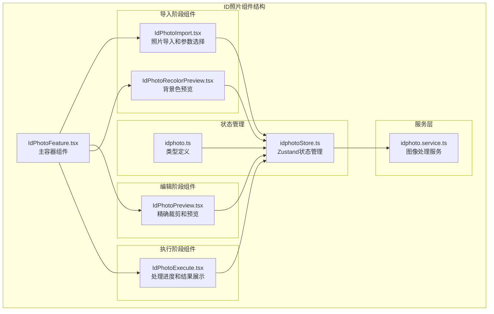
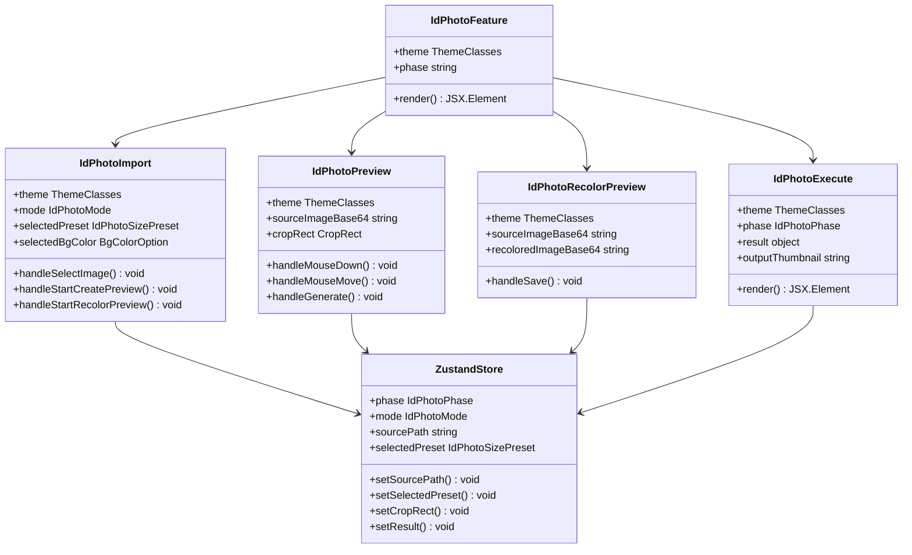
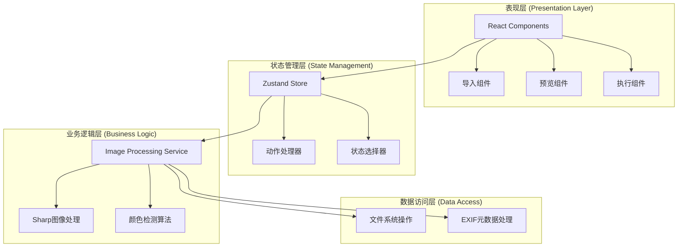
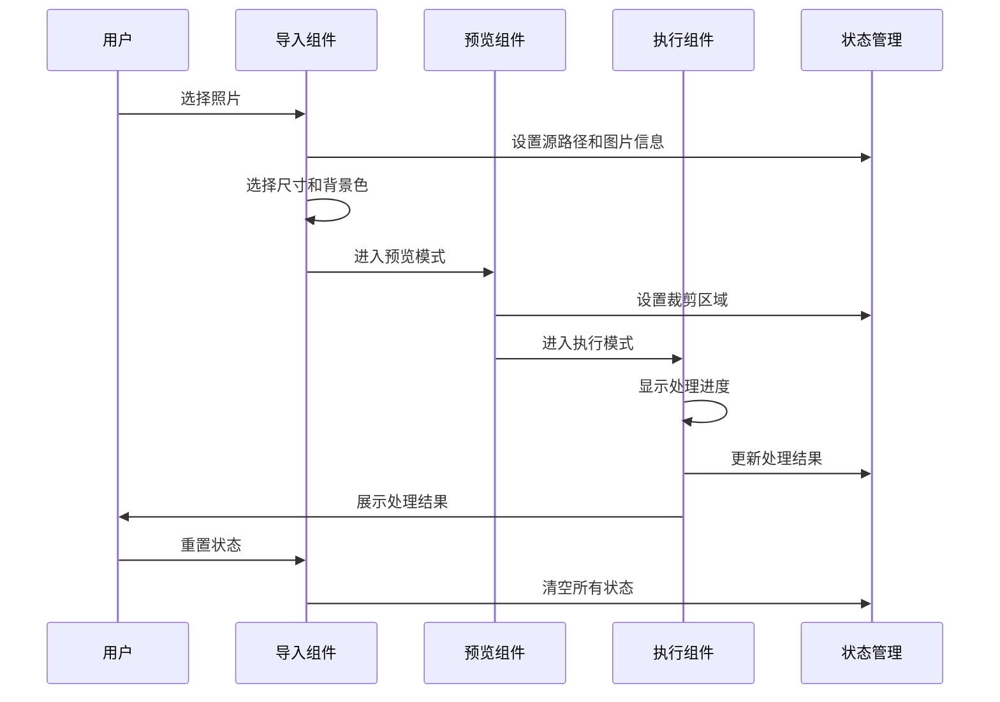
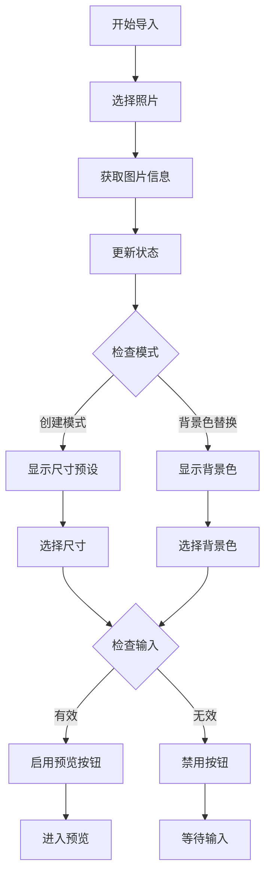
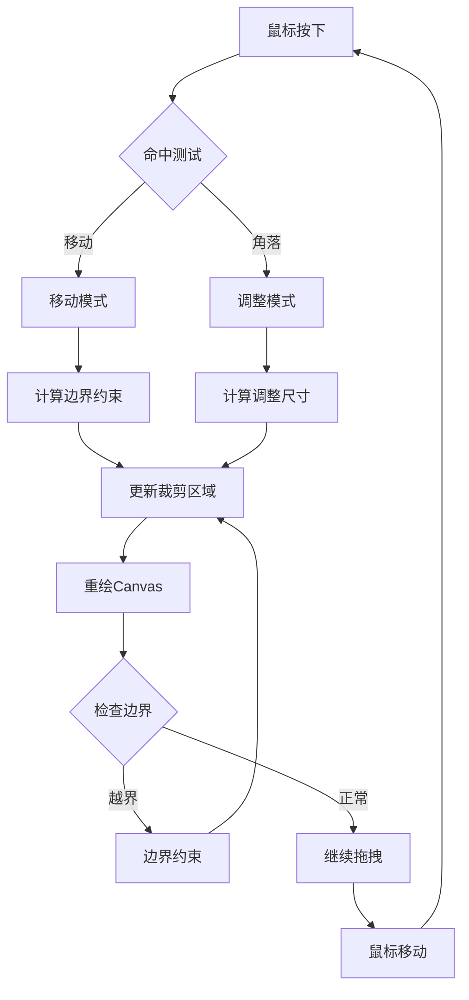
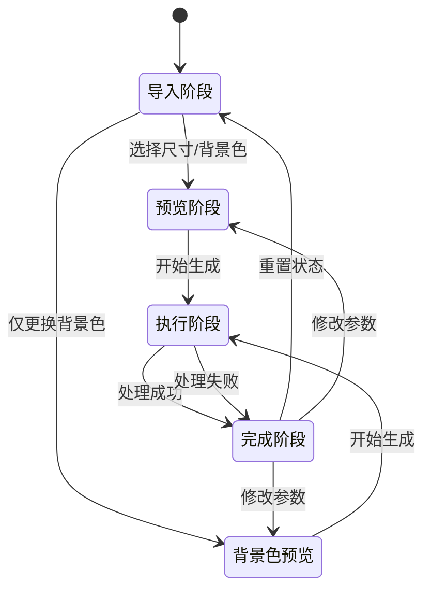
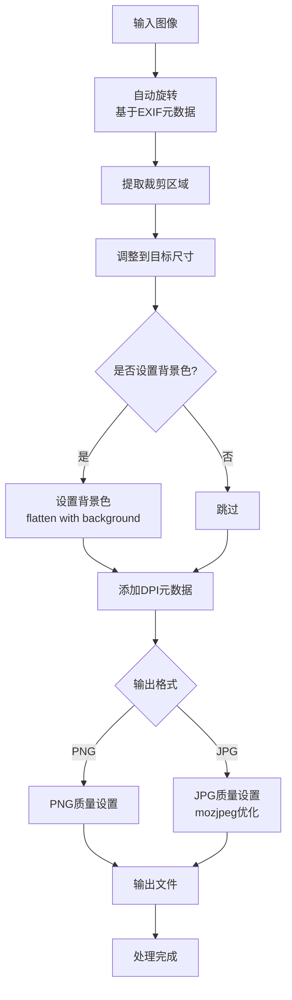
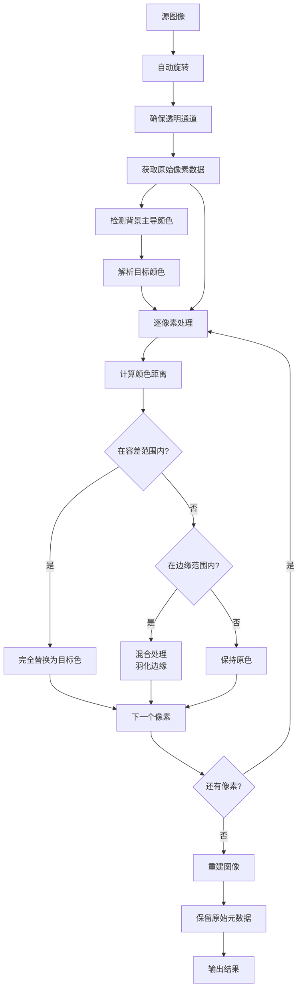

# ID照片UI组件

<cite>
**本文档引用的文件**
- [IdPhotoFeature.tsx](file://src/renderer/src/components/idphoto/IdPhotoFeature.tsx)
- [IdPhotoImport.tsx](file://src/renderer/src/components/idphoto/IdPhotoImport.tsx)
- [IdPhotoPreview.tsx](file://src/renderer/src/components/idphoto/IdPhotoPreview.tsx)
- [IdPhotoExecute.tsx](file://src/renderer/src/components/idphoto/IdPhotoExecute.tsx)
- [IdPhotoRecolorPreview.tsx](file://src/renderer/src/components/idphoto/IdPhotoRecolorPreview.tsx)
- [idphotoStore.ts](file://src/renderer/src/stores/idphotoStore.ts)
- [idphoto.ts](file://src/renderer/src/types/idphoto.ts)
- [idphoto.service.ts](file://src/main/services/idphoto.service.ts)
- [theme.ts](file://src/renderer/src/types/theme.ts)
- [App.tsx](file://src/renderer/src/App.tsx)
- [package.json](file://package.json)
</cite>

## 目录
1. [简介](#简介)
2. [项目结构](#项目结构)
3. [核心组件](#核心组件)
4. [架构概览](#架构概览)
5. [详细组件分析](#详细组件分析)
6. [状态管理](#状态管理)
7. [数据流分析](#数据流分析)
8. [性能考虑](#性能考虑)
9. [故障排除指南](#故障排除指南)
10. [总结](#总结)

## 简介

ID照片UI组件是Redophoto照片管理桌面应用中的核心功能模块，提供专业的证件照制作和背景色替换功能。该组件支持多种证件照尺寸预设、智能背景色检测与替换、实时预览和高质量图像处理。

该组件采用React + Electron架构，结合sharp图像处理库，实现了从照片导入到最终输出的完整工作流程。用户可以通过直观的界面完成证件照的制作，包括尺寸选择、背景色设置、精确裁剪和最终导出。

## 项目结构

ID照片功能位于渲染器进程的组件目录中，采用模块化设计，每个功能都封装在独立的组件文件中：



**图表来源**
- [IdPhotoFeature.tsx:1-24](file://src/renderer/src/components/idphoto/IdPhotoFeature.tsx#L1-L24)
- [idphotoStore.ts:1-94](file://src/renderer/src/stores/idphotoStore.ts#L1-L94)

**章节来源**
- [IdPhotoFeature.tsx:1-24](file://src/renderer/src/components/idphoto/IdPhotoFeature.tsx#L1-L24)
- [idphotoStore.ts:1-94](file://src/renderer/src/stores/idphotoStore.ts#L1-L94)

## 核心组件

### 主要组件层次结构

ID照片功能由多个相互协作的组件构成，形成清晰的功能分层：



**图表来源**
- [IdPhotoFeature.tsx:8-23](file://src/renderer/src/components/idphoto/IdPhotoFeature.tsx#L8-L23)
- [idphotoStore.ts:7-45](file://src/renderer/src/stores/idphotoStore.ts#L7-L45)

### 支持的证件照尺寸预设

系统内置了丰富的证件照尺寸预设，涵盖常用尺寸、护照签证和特殊用途：

| 类别 | 尺寸标签 | 尺寸(mm) | 像素(px) | DPI |
|------|----------|----------|----------|-----|
| 常用尺寸 | 1寸 | 25×35 | 295×413 | 300 |
| 常用尺寸 | 2寸 | 35×49 | 413×579 | 300 |
| 常用尺寸 | 小1寸 | 22×32 | 260×378 | 300 |
| 常用尺寸 | 大2寸 | 35×53 | 413×626 | 300 |
| 护照/签证 | 护照 | 33×48 | 390×567 | 300 |
| 护照/签证 | 美国签证 | 51×51 | 600×600 | 300 |
| 特殊用途 | 驾驶证 | 22×32 | 260×378 | 300 |
| 特殊用途 | 社保卡 | 26×32 | 358×441 | 350 |

**章节来源**
- [idphoto.ts:43-179](file://src/renderer/src/types/idphoto.ts#L43-L179)

## 架构概览

### 整体架构设计

ID照片功能采用分层架构设计，确保各层职责明确、耦合度低：



**图表来源**
- [App.tsx:13-43](file://src/renderer/src/App.tsx#L13-L43)
- [idphotoStore.ts:49-93](file://src/renderer/src/stores/idphotoStore.ts#L49-L93)

### 组件交互流程

用户在不同组件间的切换遵循严格的流程控制：



**图表来源**
- [IdPhotoImport.tsx:25-78](file://src/renderer/src/components/idphoto/IdPhotoImport.tsx#L25-L78)
- [IdPhotoPreview.tsx:237-273](file://src/renderer/src/components/idphoto/IdPhotoPreview.tsx#L237-L273)
- [IdPhotoExecute.tsx:13-17](file://src/renderer/src/components/idphoto/IdPhotoExecute.tsx#L13-L17)

## 详细组件分析

### 导入组件 (IdPhotoImport)

导入组件是用户交互的第一入口，负责处理照片选择、参数配置和模式切换：

#### 核心功能特性

1. **双模式支持**
   - 证件照制作模式：完整的尺寸选择和背景色设置
   - 背景色替换模式：仅进行背景色处理

2. **智能尺寸选择**
   - 支持三种尺寸类别：常用、护照/签证、特殊用途
   - 实时计算目标宽高比以确保精确裁剪

3. **背景色选项**
   - 内置多种预设背景色（白、蓝、红）
   - 支持保持原背景色选项

#### 关键实现细节



**图表来源**
- [IdPhotoImport.tsx:25-78](file://src/renderer/src/components/idphoto/IdPhotoImport.tsx#L25-L78)
- [IdPhotoImport.tsx:206-235](file://src/renderer/src/components/idphoto/IdPhotoImport.tsx#L206-L235)

**章节来源**
- [IdPhotoImport.tsx:15-326](file://src/renderer/src/components/idphoto/IdPhotoImport.tsx#L15-L326)

### 预览组件 (IdPhotoPreview)

预览组件提供精确的图像裁剪功能，支持鼠标拖拽和键盘快捷键操作：

#### 交互功能

1. **精确裁剪控制**
   - 鼠标拖拽移动裁剪框
   - 四角拖拽调整大小，保持宽高比
   - 规则三分线辅助构图

2. **实时预览**
   - Canvas绘制实时裁剪效果
   - 边缘羽化处理平滑过渡
   - 实时显示裁剪参数

3. **生成处理**
   - 自动文件名生成
   - 质量和格式设置
   - 异步处理和进度跟踪

#### 裁剪算法实现



**图表来源**
- [IdPhotoPreview.tsx:168-235](file://src/renderer/src/components/idphoto/IdPhotoPreview.tsx#L168-L235)
- [IdPhotoPreview.tsx:65-132](file://src/renderer/src/components/idphoto/IdPhotoPreview.tsx#L65-L132)

**章节来源**
- [IdPhotoPreview.tsx:11-386](file://src/renderer/src/components/idphoto/IdPhotoPreview.tsx#L11-L386)

### 执行组件 (IdPhotoExecute)

执行组件负责处理图像生成过程，提供进度反馈和结果展示：

#### 处理流程

1. **进度监控**
   - 分阶段处理进度显示
   - 实时状态更新
   - 错误处理和恢复

2. **结果展示**
   - 成功状态：缩略图预览和详细信息
   - 失败状态：错误信息和重试选项
   - 操作按钮：重置和继续使用

3. **文件输出**
   - 自动文件名生成
   - 格式和质量设置
   - 输出路径确认

**章节来源**
- [IdPhotoExecute.tsx:9-118](file://src/renderer/src/components/idphoto/IdPhotoExecute.tsx#L9-L118)

### 背景色预览组件 (IdPhotoRecolorPreview)

背景色预览组件专门处理背景色替换功能，提供对比预览和一键生成：

#### 预览功能

1. **双面板对比**
   - 左侧显示原始照片
   - 右侧显示替换效果
   - 中间箭头指示变化

2. **智能颜色检测**
   - 自动检测背景主导颜色
   - 基于颜色距离算法
   - 边缘羽化处理

3. **实时预览生成**
   - 小尺寸快速预览
   - 高质量最终输出
   - 缓存机制优化性能

**章节来源**
- [IdPhotoRecolorPreview.tsx:9-126](file://src/renderer/src/components/idphoto/IdPhotoRecolorPreview.tsx#L9-L126)

## 状态管理

### Zustand状态架构

ID照片功能使用Zustand作为状态管理解决方案，提供了轻量级且易于使用的状态管理：

```mermaid
graph LR
subgraph "状态结构"
Phase[phase: 'import' | 'preview' | 'recolor_preview' | 'executing' | 'done']
Mode[mode: 'create' | 'recolor']
subgraph "导入阶段"
SourcePath[sourcePath: string]
SourceImage[ImageInfo]
SelectedPreset[IdPhotoSizePreset]
SelectedBgColor[BgColorOption]
Error[string]
end
subgraph "预览阶段"
CropRect[CropRect]
end
subgraph "执行阶段"
OutputPath[string]
Progress[IdPhotoProgress]
Result[ProcessResult]
end
end
subgraph "动作处理器"
SetPhase[setPhase]
SetMode[setMode]
SetSource[setSourcePath/setSourceImage]
SetPreset[setSelectedPreset]
SetBgColor[setSelectedBgColor]
SetCrop[setCropRect]
SetResult[setResult]
Reset[reset]
end
Phase --> SetPhase
Mode --> SetMode
SourcePath --> SetSource
SelectedPreset --> SetPreset
SelectedBgColor --> SetBgColor
CropRect --> SetCrop
Result --> SetResult
Mode --> Reset
```

**图表来源**
- [idphotoStore.ts:7-45](file://src/renderer/src/stores/idphotoStore.ts#L7-L45)
- [idphotoStore.ts:49-93](file://src/renderer/src/stores/idphotoStore.ts#L49-L93)

### 状态转换流程



**图表来源**
- [idphotoStore.ts:4-5](file://src/renderer/src/stores/idphotoStore.ts#L4-L5)

**章节来源**
- [idphotoStore.ts:1-94](file://src/renderer/src/stores/idphotoStore.ts#L1-L94)

## 数据流分析

### 图像处理管道

ID照片功能的核心是基于sharp的图像处理管道，实现了高效的图像变换和输出：



**图表来源**
- [idphoto.service.ts:55-116](file://src/main/services/idphoto.service.ts#L55-L116)

### 背景色替换算法

背景色替换功能采用了智能的颜色检测和替换算法：



**图表来源**
- [idphoto.service.ts:184-228](file://src/main/services/idphoto.service.ts#L184-L228)
- [idphoto.service.ts:233-318](file://src/main/services/idphoto.service.ts#L233-L318)

**章节来源**
- [idphoto.service.ts:1-319](file://src/main/services/idphoto.service.ts#L1-L319)

## 性能考虑

### 优化策略

1. **异步处理**
   - 图像处理在后台线程执行
   - 非阻塞UI更新
   - 进度回调机制

2. **内存管理**
   - 原始图像数据及时释放
   - Canvas缓存策略
   - Base64图像压缩

3. **算法优化**
   - 颜色检测采样优化
   - 边缘处理羽化算法
   - 分阶段进度报告

### 性能指标

- **图像处理速度**: 基于硬件配置，单张照片处理时间通常在2-10秒之间
- **内存使用**: 处理过程中峰值内存占用约为原始图像大小的2-3倍
- **CPU利用率**: 处理期间CPU使用率可达80-100%

## 故障排除指南

### 常见问题及解决方案

1. **照片无法选择**
   - 检查文件格式是否受支持（JPG、PNG、BMP、WebP）
   - 确认文件路径权限
   - 验证磁盘空间充足

2. **裁剪功能异常**
   - 确认选择了有效的尺寸预设
   - 检查图像分辨率是否足够
   - 重新启动应用尝试

3. **处理失败**
   - 查看错误日志详情
   - 检查输出路径权限
   - 降低质量设置重试

4. **背景色替换不准确**
   - 调整容差值设置
   - 选择更接近的背景色
   - 确保拍摄光线均匀

**章节来源**
- [IdPhotoImport.tsx:36-38](file://src/renderer/src/components/idphoto/IdPhotoImport.tsx#L36-L38)
- [IdPhotoPreview.tsx:269-272](file://src/renderer/src/components/idphoto/IdPhotoPreview.tsx#L269-L272)

## 总结

ID照片UI组件是一个功能完整、用户体验优秀的专业证件照制作工具。通过精心设计的组件架构、高效的状态管理和强大的图像处理能力，为用户提供了流畅的证件照制作体验。

### 核心优势

1. **直观易用**: 清晰的步骤引导和实时预览
2. **功能全面**: 支持多种尺寸、背景色和输出格式
3. **质量保证**: 基于sharp的专业图像处理
4. **性能优秀**: 异步处理和内存优化
5. **可扩展性**: 模块化设计便于功能扩展

### 技术亮点

- 基于React Hooks的状态管理
- Canvas实现的精确图像编辑
- 智能颜色检测算法
- 分阶段的处理进度反馈
- 多主题支持的UI设计

该组件为Redophoto应用提供了坚实的基础，展现了现代桌面应用开发的最佳实践。