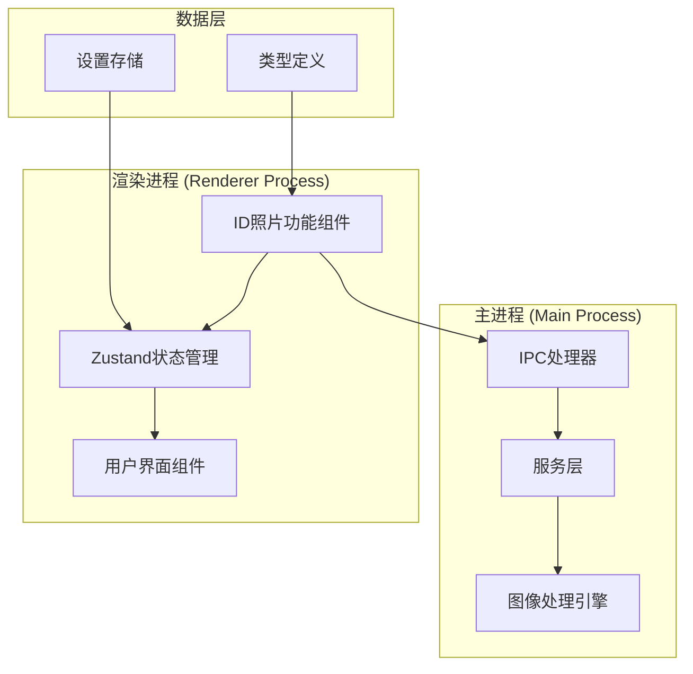
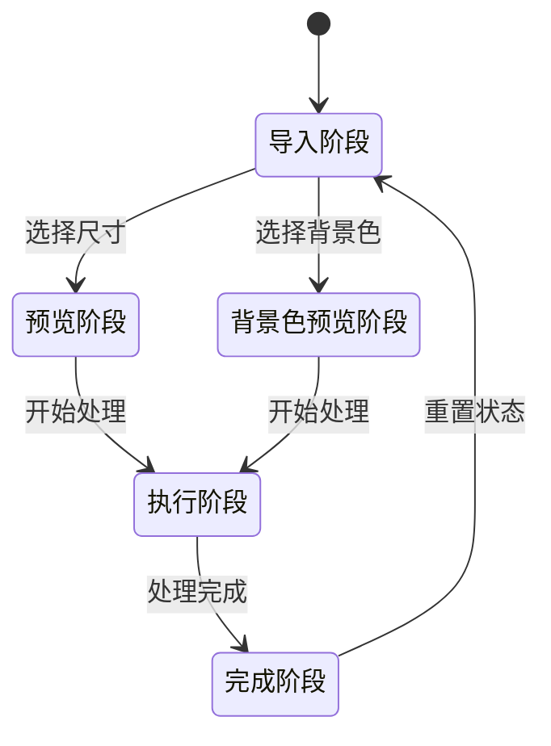
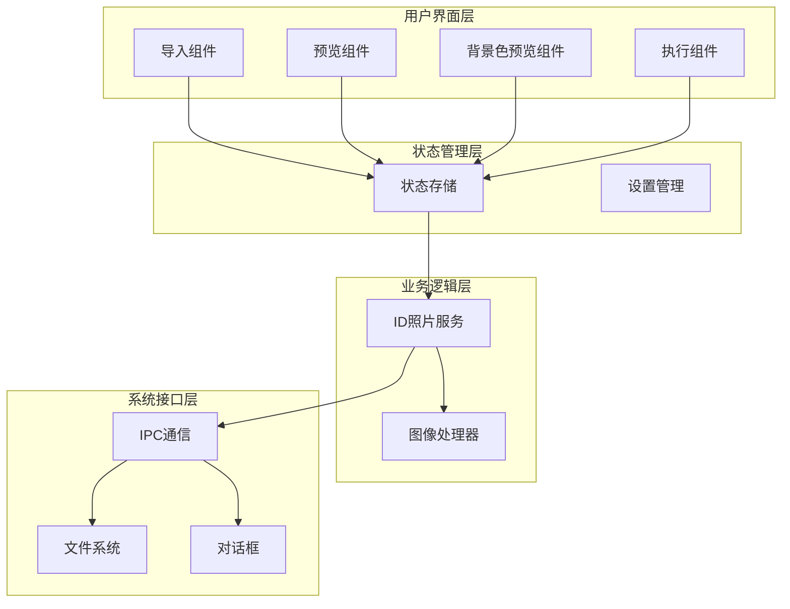
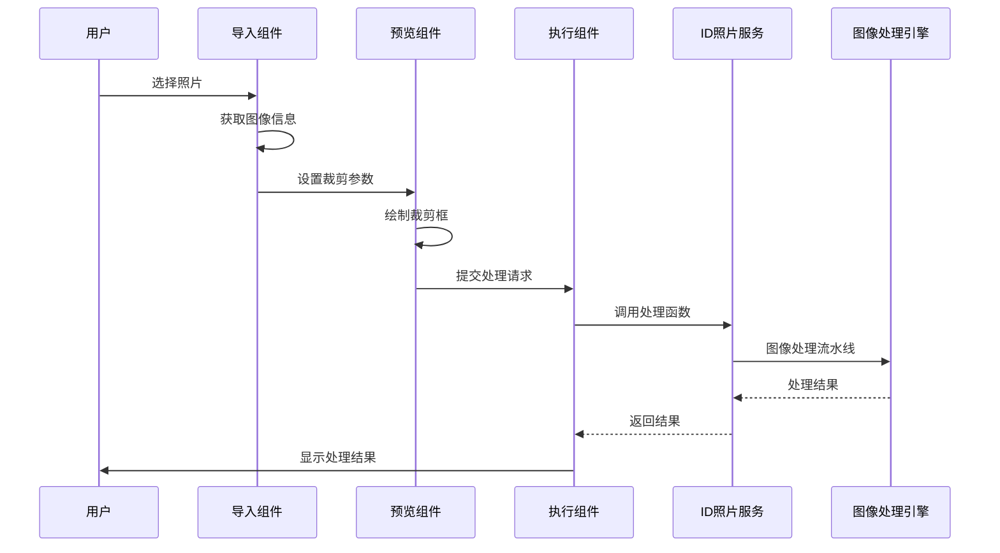
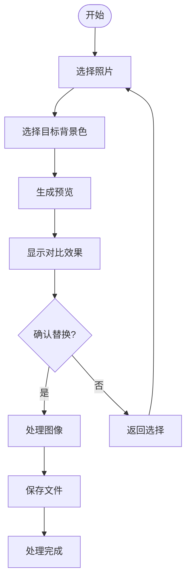
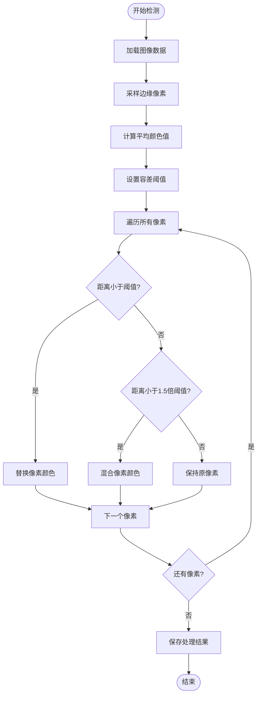
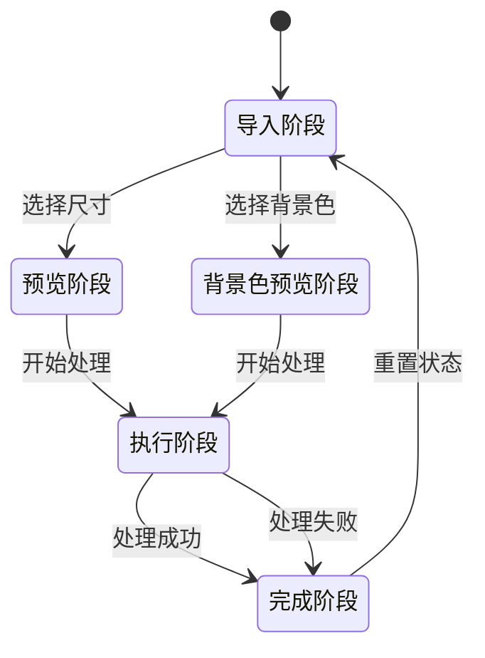
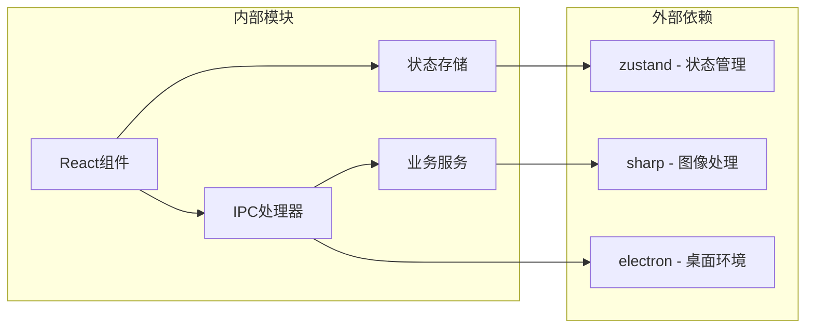
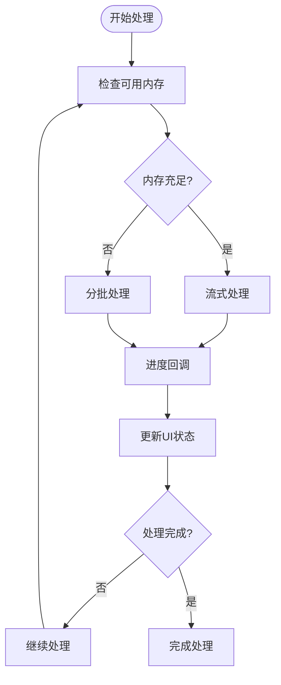

# ID照片状态管理

<cite>
**本文档引用的文件**
- [idphoto.service.ts](file://src/main/services/idphoto.service.ts)
- [idphotoStore.ts](file://src/renderer/src/stores/idphotoStore.ts)
- [IdPhotoFeature.tsx](file://src/renderer/src/components/idphoto/IdPhotoFeature.tsx)
- [idphoto.ts](file://src/renderer/src/types/idphoto.ts)
- [index.ts](file://src/main/ipc/index.ts)
- [IdPhotoImport.tsx](file://src/renderer/src/components/idphoto/IdPhotoImport.tsx)
- [IdPhotoPreview.tsx](file://src/renderer/src/components/idphoto/IdPhotoPreview.tsx)
- [IdPhotoExecute.tsx](file://src/renderer/src/components/idphoto/IdPhotoExecute.tsx)
- [IdPhotoRecolorPreview.tsx](file://src/renderer/src/components/idphoto/IdPhotoRecolorPreview.tsx)
- [settingsStore.ts](file://src/renderer/src/stores/settingsStore.ts)
- [settings.service.ts](file://src/main/services/settings.service.ts)
- [App.tsx](file://src/renderer/src/App.tsx)
- [package.json](file://package.json)
</cite>

## 目录
1. [简介](#简介)
2. [项目结构](#项目结构)
3. [核心组件](#核心组件)
4. [架构概览](#架构概览)
5. [详细组件分析](#详细组件分析)
6. [依赖关系分析](#依赖关系分析)
7. [性能考虑](#性能考虑)
8. [故障排除指南](#故障排除指南)
9. [结论](#结论)

## 简介

ID照片状态管理系统是Redophoto照片管理桌面应用中的核心功能模块，专门用于处理身份证件照片的制作和背景色替换。该系统采用Electron + React + TypeScript技术栈构建，提供了完整的照片处理工作流程，包括照片导入、裁剪预览、背景色替换、质量控制等功能。

系统的核心特性包括：
- 支持多种标准证件照尺寸（常见尺寸、护照签证、特殊用途）
- 智能背景色检测和替换算法
- 实时进度反馈和错误处理
- 可配置的输出质量和格式设置
- 用户友好的图形界面交互

## 项目结构

Redophoto项目采用模块化架构设计，ID照片功能位于独立的功能模块中，与去重、重命名、方向修复等功能并列存在。

**图表来源**
- [index.ts:1-373](file://src/main/ipc/index.ts#L1-L373)
- [idphotoStore.ts:1-94](file://src/renderer/src/stores/idphotoStore.ts#L1-L94)

**章节来源**
- [package.json:1-50](file://package.json#L1-L50)
- [App.tsx:1-44](file://src/renderer/src/App.tsx#L1-L44)

## 核心组件

### 状态管理架构

ID照片功能采用Zustand进行状态管理，实现了完整的多阶段工作流程控制：

**图表来源**
- [idphotoStore.ts:4-45](file://src/renderer/src/stores/idphotoStore.ts#L4-L45)

### 数据模型

系统定义了完整的数据模型来描述证件照处理过程：

- **尺寸预设**: 包含常见尺寸、护照签证、特殊用途三类标准规格
- **背景色选项**: 支持保持原背景、白色、蓝色、红色等预设颜色
- **裁剪区域**: 精确的矩形裁剪参数
- **处理参数**: 输出格式、质量、DPI等配置信息

**章节来源**
- [idphoto.ts:1-193](file://src/renderer/src/types/idphoto.ts#L1-L193)
- [idphotoStore.ts:1-94](file://src/renderer/src/stores/idphotoStore.ts#L1-L94)

## 架构概览

ID照片处理系统采用分层架构设计，确保了清晰的职责分离和良好的可维护性。

**图表来源**
- [IdPhotoFeature.tsx:1-24](file://src/renderer/src/components/idphoto/IdPhotoFeature.tsx#L1-L24)
- [index.ts:347-372](file://src/main/ipc/index.ts#L347-L372)

## 详细组件分析

### 主要工作流程

系统实现了两种主要的证件照处理模式：完整制作模式和背景色替换模式。

#### 完整制作流程

**图表来源**
- [IdPhotoImport.tsx:25-62](file://src/renderer/src/components/idphoto/IdPhotoImport.tsx#L25-L62)
- [IdPhotoPreview.tsx:237-273](file://src/renderer/src/components/idphoto/IdPhotoPreview.tsx#L237-L273)
- [idphoto.service.ts:55-116](file://src/main/services/idphoto.service.ts#L55-L116)

#### 背景色替换流程

**图表来源**
- [IdPhotoImport.tsx:64-78](file://src/renderer/src/components/idphoto/IdPhotoImport.tsx#L64-L78)
- [IdPhotoRecolorPreview.tsx:17-49](file://src/renderer/src/components/idphoto/IdPhotoRecolorPreview.tsx#L17-L49)

### 核心算法实现

#### 背景色检测算法

系统实现了智能的背景色检测算法，通过采样图像边缘像素来确定背景色：

**图表来源**
- [idphoto.service.ts:121-228](file://src/main/services/idphoto.service.ts#L121-L228)

**章节来源**
- [idphoto.service.ts:1-319](file://src/main/services/idphoto.service.ts#L1-L319)

### 状态管理机制

#### 多阶段状态流转

系统使用明确的状态机来管理整个处理流程：

**图表来源**
- [idphotoStore.ts:4-45](file://src/renderer/src/stores/idphotoStore.ts#L4-L45)

#### 数据持久化策略

系统采用分层的数据持久化策略：

- **临时状态**: 使用Zustand进行内存状态管理
- **用户设置**: 使用electron-store进行本地存储
- **处理结果**: 通过IPC通信传递到主进程

**章节来源**
- [idphotoStore.ts:1-94](file://src/renderer/src/stores/idphotoStore.ts#L1-L94)
- [settingsStore.ts:1-59](file://src/renderer/src/stores/settingsStore.ts#L1-L59)

## 依赖关系分析

### 核心依赖关系

**图表来源**
- [package.json:14-21](file://package.json#L14-L21)
- [index.ts:1-40](file://src/main/ipc/index.ts#L1-L40)

### 关键接口依赖

系统的关键接口依赖关系如下：

- **IPC接口**: 提供主进程与渲染进程之间的通信通道
- **图像处理接口**: 基于sharp库提供完整的图像处理能力
- **状态管理接口**: 通过Zustand提供响应式的状态管理
- **UI组件接口**: React组件提供用户交互界面

**章节来源**
- [index.ts:347-372](file://src/main/ipc/index.ts#L347-L372)
- [idphoto.service.ts:1-319](file://src/main/services/idphoto.service.ts#L1-L319)

## 性能考虑

### 图像处理优化

系统在图像处理方面采用了多项优化策略：

1. **渐进式处理**: 通过进度回调提供实时反馈
2. **内存管理**: 使用流式处理避免大图像内存溢出
3. **缓存机制**: 预览图像使用base64缓存减少重复计算
4. **异步处理**: 所有耗时操作都采用异步方式执行

### 并发处理策略

**图表来源**
- [idphoto.service.ts:55-116](file://src/main/services/idphoto.service.ts#L55-L116)

## 故障排除指南

### 常见问题及解决方案

#### 图像处理失败

**问题症状**: 处理过程中出现错误提示

**可能原因**:
- 文件权限不足
- 磁盘空间不足
- 图像格式不支持
- 内存不足

**解决步骤**:
1. 检查文件权限和磁盘空间
2. 验证图像格式是否受支持
3. 关闭其他占用内存的应用程序
4. 重启应用程序重试

#### 背景色检测不准确

**问题症状**: 背景色替换效果不理想

**可能原因**:
- 背景与主体颜色相近
- 图像质量过低
- 容差阈值设置不当

**解决步骤**:
1. 调整容差阈值参数
2. 选择高质量的源图像
3. 手动微调裁剪区域
4. 尝试不同的目标背景色

#### 性能问题

**问题症状**: 处理速度缓慢或界面卡顿

**解决步骤**:
1. 检查系统资源使用情况
2. 关闭不必要的应用程序
3. 调整图像质量和格式设置
4. 考虑升级硬件配置

**章节来源**
- [idphoto.service.ts:109-115](file://src/main/services/idphoto.service.ts#L109-L115)
- [IdPhotoExecute.tsx:95-105](file://src/renderer/src/components/idphoto/IdPhotoExecute.tsx#L95-L105)

## 结论

ID照片状态管理系统是一个设计精良的照片处理解决方案，具有以下特点：

**优势**:
- 清晰的模块化架构设计
- 完善的状态管理和用户交互流程
- 高效的图像处理算法
- 良好的错误处理和用户体验

**技术亮点**:
- 基于React + Electron的现代桌面应用架构
- 智能的背景色检测和替换算法
- 实时进度反馈和可视化预览
- 可配置的处理参数和输出设置

**改进建议**:
- 添加更多的图像格式支持
- 实现批量处理功能
- 增加撤销/重做机制
- 优化移动端适配

该系统为用户提供了一个专业级的证件照处理工具，满足了日常证件照制作的各种需求。