# 侧边栏导航系统

<cite>
**本文档引用的文件**
- [Sidebar.tsx](file://src/renderer/src/components/Sidebar.tsx)
- [navStore.ts](file://src/renderer/src/stores/navStore.ts)
- [App.tsx](file://src/renderer/src/App.tsx)
- [theme.ts](file://src/renderer/src/types/theme.ts)
- [SettingsPanel.tsx](file://src/renderer/src/components/SettingsPanel.tsx)
- [index.ts](file://src/main/index.ts)
- [ipc/index.ts](file://src/main/ipc/index.ts)
- [settingsStore.ts](file://src/renderer/src/stores/settingsStore.ts)
- [index.ts](file://src/renderer/src/types/index.ts)
- [DedupFeature.tsx](file://src/renderer/src/components/dedup/DedupFeature.tsx)
- [RenameFeature.tsx](file://src/renderer/src/components/rename/RenameFeature.tsx)
- [OrientationFeature.tsx](file://src/renderer/src/components/orientation/OrientationFeature.tsx)
- [package.json](file://package.json)
</cite>

## 目录
1. [简介](#简介)
2. [项目结构](#项目结构)
3. [核心组件](#核心组件)
4. [架构概览](#架构概览)
5. [详细组件分析](#详细组件分析)
6. [依赖关系分析](#依赖关系分析)
7. [性能考虑](#性能考虑)
8. [故障排除指南](#故障排除指南)
9. [结论](#结论)

## 简介

ReDoPhoto 是一个基于 Electron 和 React 的桌面照片管理工具，专注于提供三个核心功能：照片去重、智能批量重命名和无损旋转/裁剪。该系统采用现代化的前端架构，使用 Zustand 进行状态管理，TailwindCSS 进行样式设计，并通过 IPC 机制与主进程通信。

侧边栏导航系统是整个应用的核心交互组件，负责在不同的功能模块之间进行切换，并提供统一的主题管理和设置入口。

## 项目结构

ReDoPhoto 采用典型的 Electron + React 架构，主要分为以下层次：

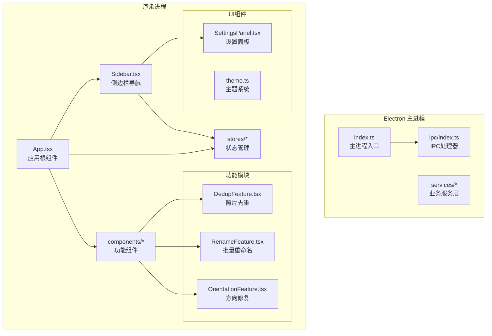

**图表来源**
- [index.ts:1-62](file://src/main/index.ts#L1-L62)
- [App.tsx:1-42](file://src/renderer/src/App.tsx#L1-L42)
- [Sidebar.tsx:1-100](file://src/renderer/src/components/Sidebar.tsx#L1-L100)

**章节来源**
- [package.json:1-50](file://package.json#L1-L50)
- [index.ts:1-62](file://src/main/index.ts#L1-L62)

## 核心组件

### 导航状态管理

导航系统的核心是基于 Zustand 的状态管理，提供了简洁高效的跨组件状态共享机制。

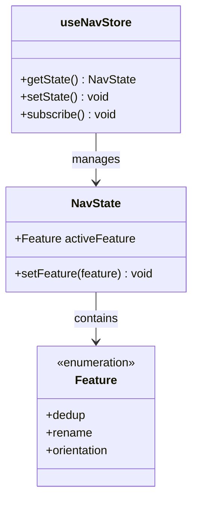

**图表来源**
- [navStore.ts:1-14](file://src/renderer/src/stores/navStore.ts#L1-L14)

导航状态包含以下关键属性：
- `activeFeature`: 当前激活的功能模块（'dedup' | 'rename' | 'orientation'）
- `setFeature()`: 更新当前激活功能的方法

**章节来源**
- [navStore.ts:1-14](file://src/renderer/src/stores/navStore.ts#L1-L14)

### 侧边栏组件架构

侧边栏组件采用函数式组件设计，结合 React Hooks 实现响应式状态更新。

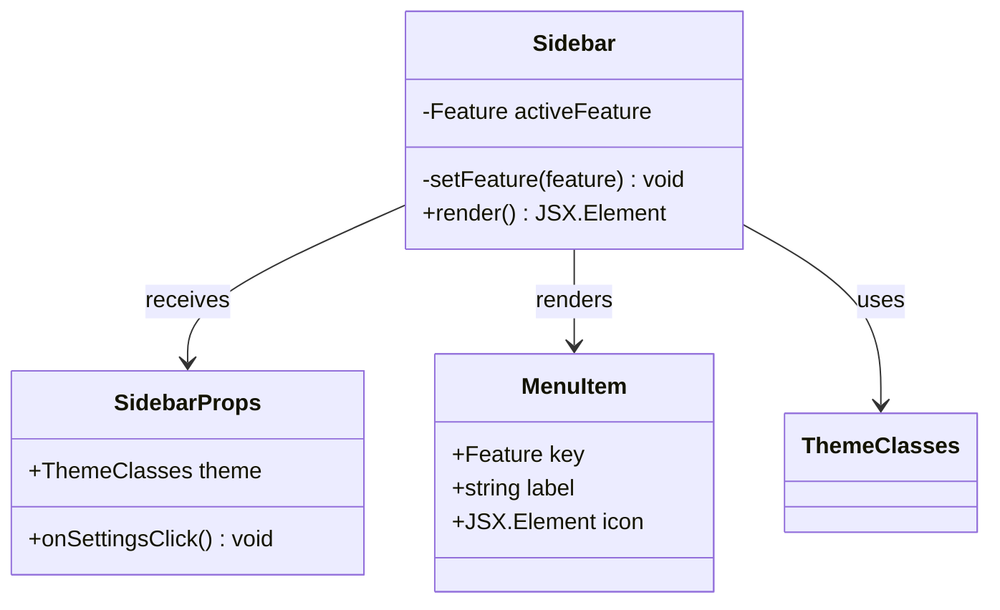

**图表来源**
- [Sidebar.tsx:1-100](file://src/renderer/src/components/Sidebar.tsx#L1-L100)

侧边栏包含三个主要菜单项：
1. **照片去重** - 图标：网格布局
2. **智能批量重命名** - 图标：编辑笔
3. **无损旋转/裁剪** - 图标：旋转箭头

每个菜单项都支持悬停效果和选中状态高亮。

**章节来源**
- [Sidebar.tsx:1-100](file://src/renderer/src/components/Sidebar.tsx#L1-L100)

## 架构概览

ReDoPhoto 采用分层架构设计，确保了清晰的关注点分离和良好的可维护性。

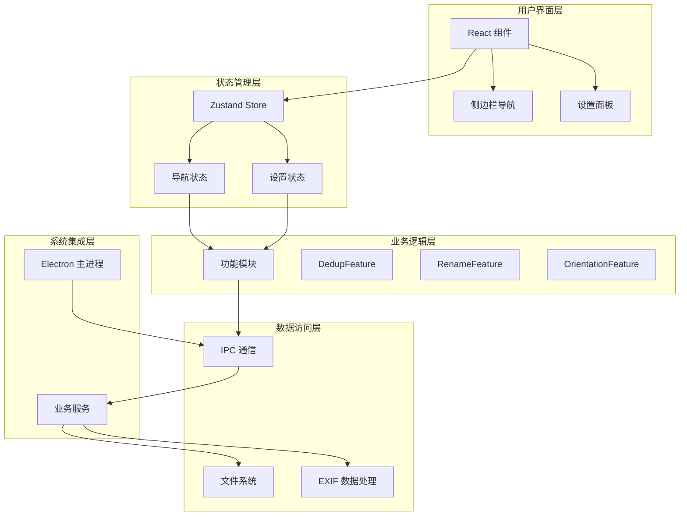

**图表来源**
- [App.tsx:1-42](file://src/renderer/src/App.tsx#L1-L42)
- [ipc/index.ts:1-309](file://src/main/ipc/index.ts#L1-L309)

## 详细组件分析

### 侧边栏导航组件

侧边栏组件实现了完整的导航功能，包括菜单项渲染、状态管理和交互响应。

#### 菜单项配置

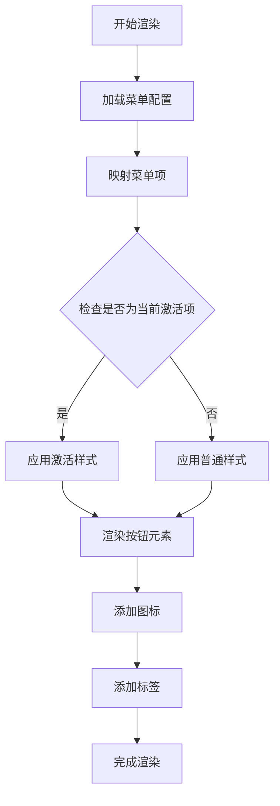

**图表来源**
- [Sidebar.tsx:9-40](file://src/renderer/src/components/Sidebar.tsx#L9-L40)

#### 设置按钮实现

设置按钮位于侧边栏底部，提供全局设置访问入口：

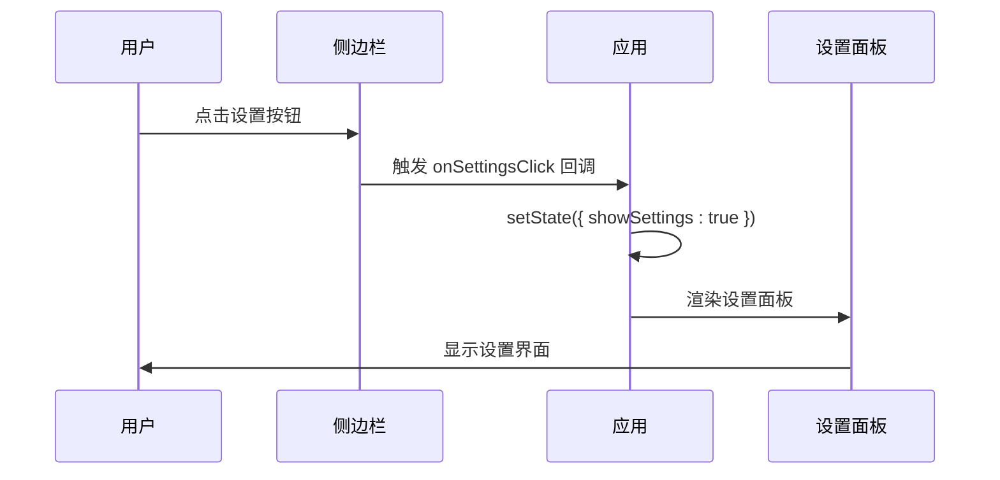

**图表来源**
- [Sidebar.tsx:83-96](file://src/renderer/src/components/Sidebar.tsx#L83-L96)
- [App.tsx:16-38](file://src/renderer/src/App.tsx#L16-L38)

**章节来源**
- [Sidebar.tsx:1-100](file://src/renderer/src/components/Sidebar.tsx#L1-L100)

### 应用根组件集成

应用根组件负责协调所有子组件的生命周期和状态同步。

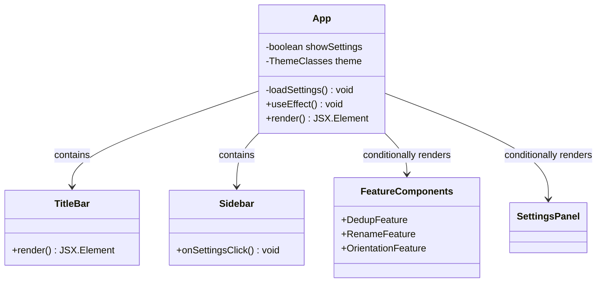

**图表来源**
- [App.tsx:1-42](file://src/renderer/src/App.tsx#L1-L42)

应用组件的关键职责：
1. 加载用户设置并应用主题
2. 根据导航状态动态渲染对应功能组件
3. 管理设置面板的显示/隐藏状态

**章节来源**
- [App.tsx:1-42](file://src/renderer/src/App.tsx#L1-L42)

### 主题系统集成

主题系统通过统一的类名映射实现一致的视觉体验。

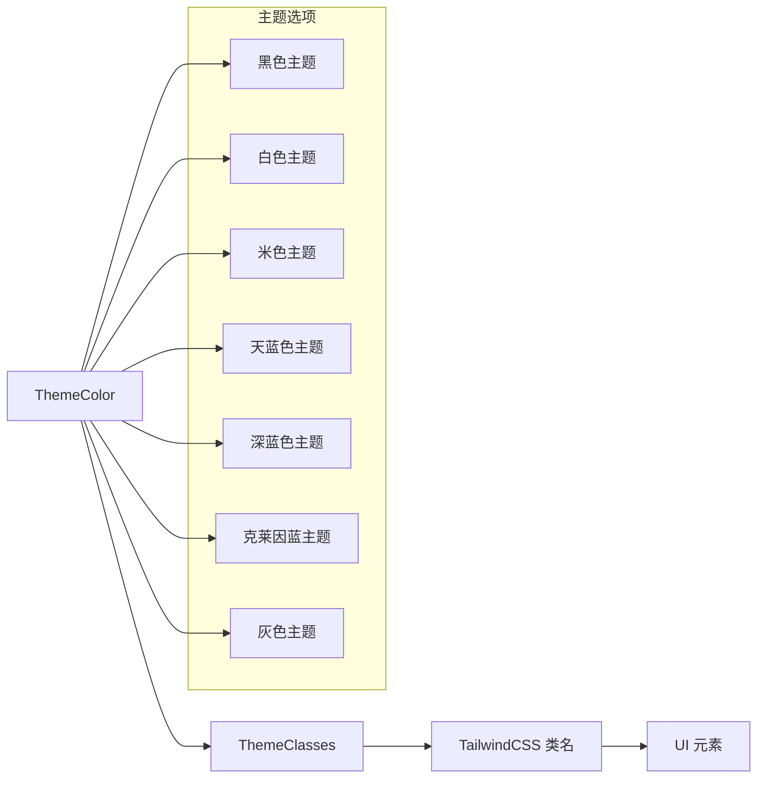

**图表来源**
- [theme.ts:23-143](file://src/renderer/src/types/theme.ts#L23-L143)

每种主题都定义了完整的颜色方案：
- 背景色 (`bg`)
- 卡片背景色 (`card`)
- 边框颜色 (`border`)
- 文本颜色 (`text`)
- 次要文本颜色 (`textMuted`)
- 淡化文本颜色 (`textDim`)
- 悬停背景色 (`hoverBg`)
- 输入框背景色 (`inputBg`)
- 输入框边框色 (`inputBorder`)
- 输入框文本色 (`inputText`)

**章节来源**
- [theme.ts:1-150](file://src/renderer/src/types/theme.ts#L1-L150)

### 设置面板功能

设置面板提供全局配置和各功能模块的特定设置。

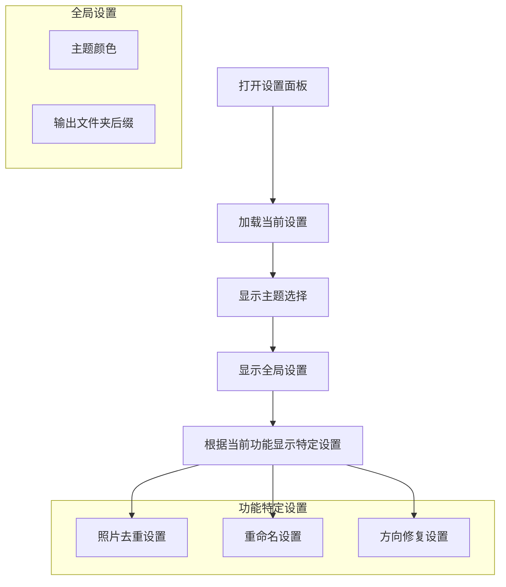

**图表来源**
- [SettingsPanel.tsx:1-304](file://src/renderer/src/components/SettingsPanel.tsx#L1-L304)

**章节来源**
- [SettingsPanel.tsx:1-304](file://src/renderer/src/components/SettingsPanel.tsx#L1-L304)

## 依赖关系分析

### 外部依赖

ReDoPhoto 使用了现代化的前端技术栈，主要依赖包括：

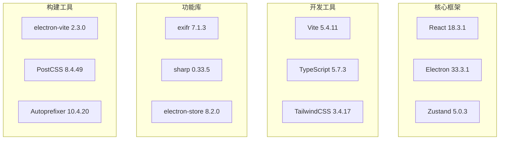

**图表来源**
- [package.json:14-36](file://package.json#L14-L36)

### 内部模块依赖

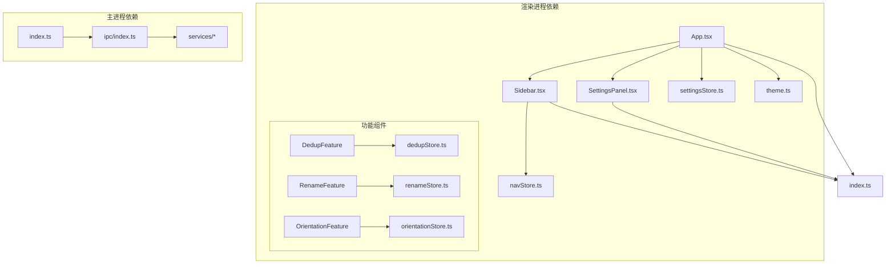

**图表来源**
- [App.tsx:1-11](file://src/renderer/src/App.tsx#L1-L11)
- [Sidebar.tsx:1-7](file://src/renderer/src/components/Sidebar.tsx#L1-L7)

**章节来源**
- [package.json:1-50](file://package.json#L1-L50)

## 性能考虑

### 状态管理优化

系统采用 Zustand 作为状态管理解决方案，相比 Redux 具有以下优势：
- 更小的包体积
- 更简单的 API 设计
- 更好的 TypeScript 支持
- 更低的内存开销

### 渲染性能优化

1. **条件渲染**: 功能组件仅在需要时渲染，减少不必要的 DOM 更新
2. **主题缓存**: 主题类名计算结果被缓存，避免重复计算
3. **事件委托**: 导航点击事件通过 props 传递，避免重复绑定

### 内存管理

1. **组件卸载**: React 自动清理事件监听器和定时器
2. **状态清理**: 设置面板关闭时不会保留不必要的状态
3. **垃圾回收**: Electron 环境下的内存管理由系统自动处理

## 故障排除指南

### 常见问题及解决方案

#### 导航状态不更新

**症状**: 点击菜单项后界面没有变化

**可能原因**:
1. Zustand 状态未正确更新
2. 组件未正确订阅状态变化
3. 主题类名计算错误

**解决方法**:
1. 检查 `useNavStore` 的状态更新逻辑
2. 确认组件正确使用 `useNavStore` Hook
3. 验证主题类名映射的正确性

#### 设置面板无法打开

**症状**: 点击设置按钮无反应

**可能原因**:
1. 事件回调未正确传递
2. 状态管理问题
3. 样式冲突

**解决方法**:
1. 检查 `onSettingsClick` 属性的传递
2. 验证 `useState` 状态管理
3. 检查 CSS 类名冲突

#### 主题切换无效

**症状**: 切换主题后界面颜色未改变

**可能原因**:
1. 主题类名映射错误
2. TailwindCSS 缓存问题
3. 样式优先级冲突

**解决方法**:
1. 验证 `getThemeClasses` 函数的实现
2. 清除 TailwindCSS 缓存并重新编译
3. 检查样式优先级和冲突

**章节来源**
- [navStore.ts:1-14](file://src/renderer/src/stores/navStore.ts#L1-L14)
- [settingsStore.ts:1-55](file://src/renderer/src/stores/settingsStore.ts#L1-L55)

## 结论

ReDoPhoto 的侧边栏导航系统展现了现代桌面应用开发的最佳实践。通过精心设计的状态管理、清晰的组件架构和灵活的主题系统，该系统为用户提供了流畅且直观的使用体验。

### 主要优势

1. **简洁的架构**: 基于 React 和 Zustand 的轻量级设计
2. **响应式交互**: 即时的状态更新和视觉反馈
3. **可扩展性**: 模块化的组件设计便于功能扩展
4. **用户体验**: 一致的主题系统和直观的导航流程

### 技术亮点

- **状态管理**: 使用 Zustand 实现高效的状态共享
- **主题系统**: 完整的颜色方案支持和动态切换
- **IPC 通信**: 安全的主进程-渲染进程通信机制
- **类型安全**: 完整的 TypeScript 类型定义

该导航系统为 ReDoPhoto 提供了坚实的基础，使得照片去重、批量重命名和方向修复等功能能够以统一的方式呈现给用户。通过持续的优化和扩展，该系统有望支持更多高级功能和更好的用户体验。