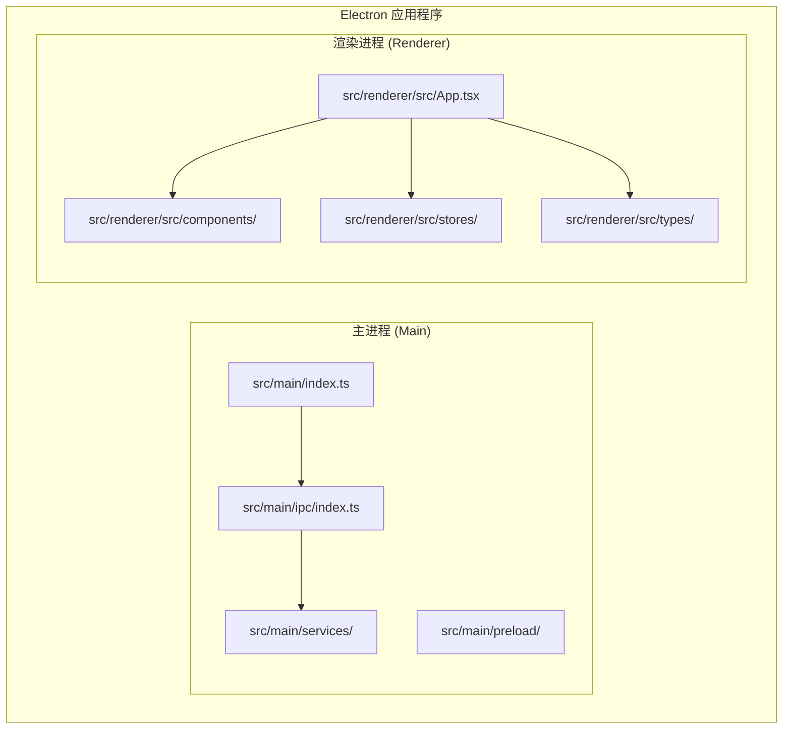
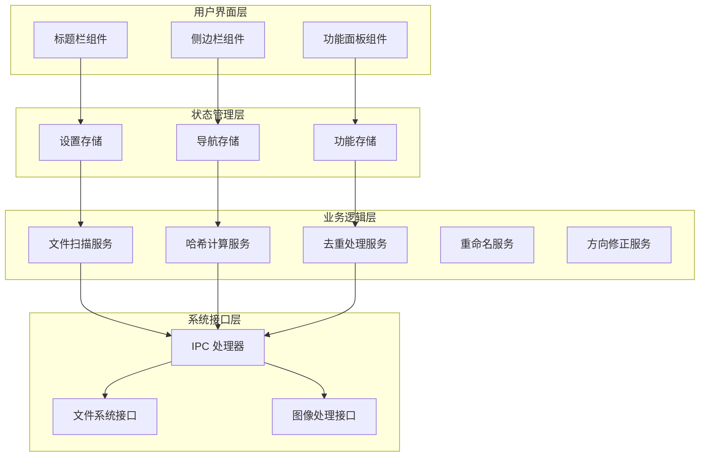
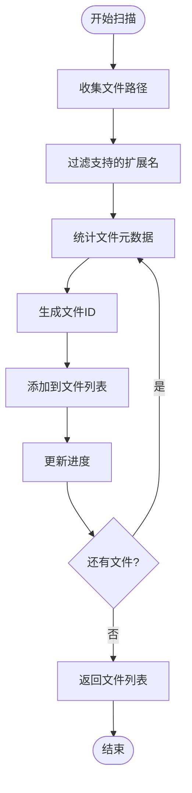
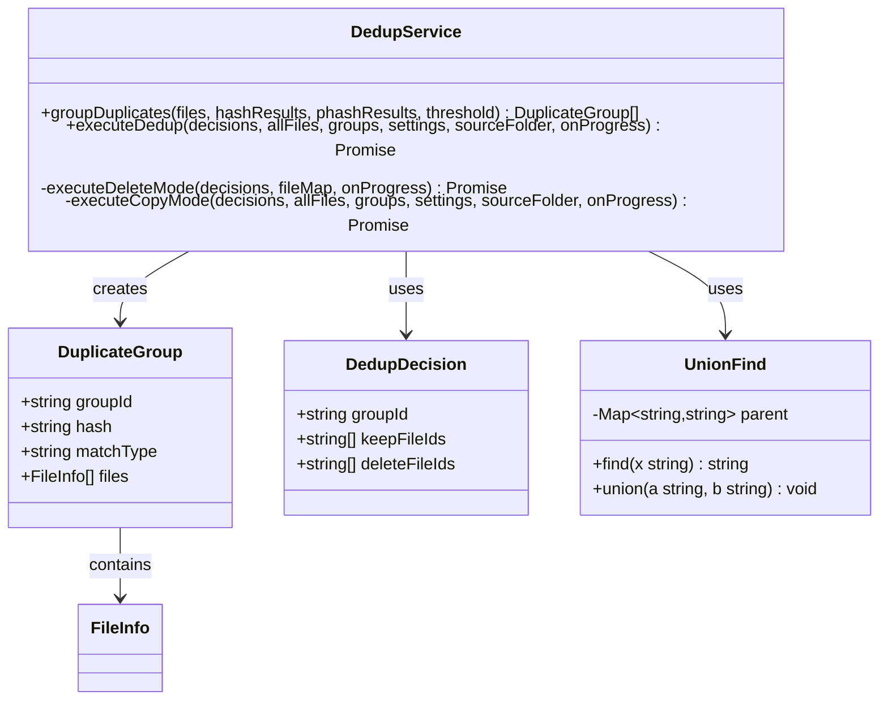
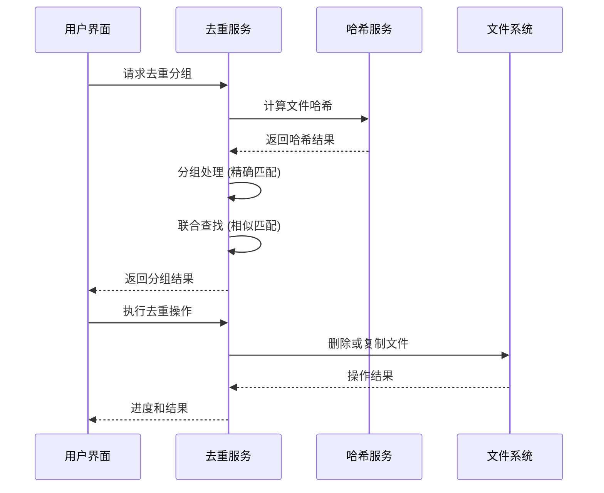
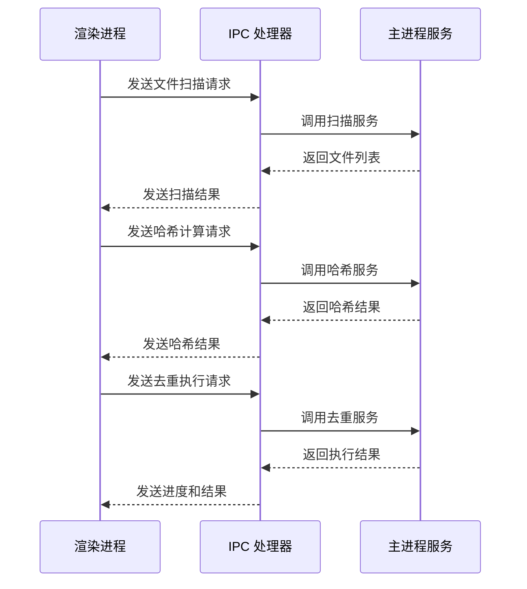
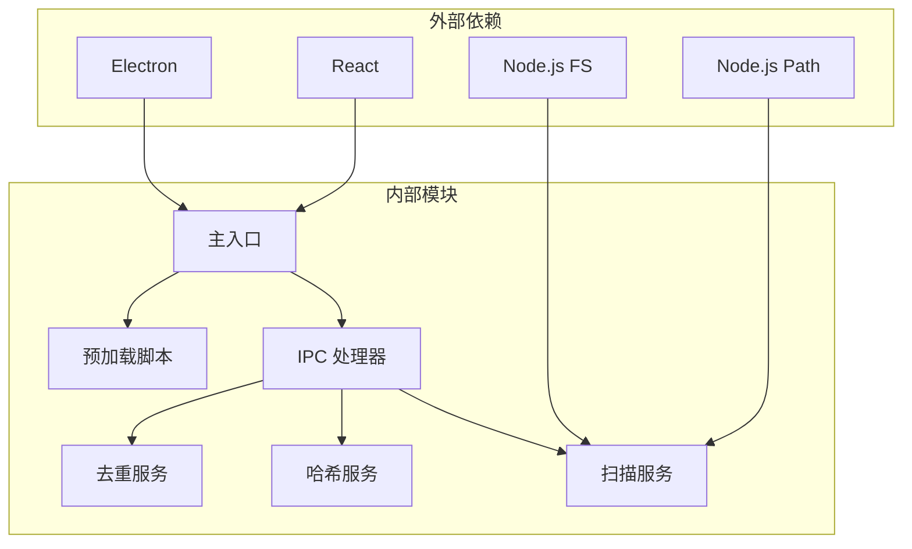

# 像素级同步比较

<cite>
**本文档引用的文件**
- [src/main/index.ts](file://src/main/index.ts)
- [src/renderer/src/App.tsx](file://src/renderer/src/App.tsx)
- [src/main/ipc/index.ts](file://src/main/ipc/index.ts)
- [src/main/services/scanner.service.ts](file://src/main/services/scanner.service.ts)
- [src/main/services/dedup.service.ts](file://src/main/services/dedup.service.ts)
- [src/main/services/hash.service.ts](file://src/main/services/hash.service.ts)
</cite>

## 目录
1. [简介](#简介)
2. [项目结构](#项目结构)
3. [核心组件](#核心组件)
4. [架构概览](#架构概览)
5. [详细组件分析](#详细组件分析)
6. [依赖关系分析](#依赖关系分析)
7. [性能考虑](#性能考虑)
8. [故障排除指南](#故障排除指南)
9. [结论](#结论)

## 简介

像素级同步比较是一个基于 Electron 的桌面应用程序，专门用于照片文件的去重、重命名和方向修正功能。该应用通过智能的哈希算法和感知哈希技术，实现对照片文件的精确识别和批量处理。

应用程序采用现代化的 React 前端框架配合 Electron 后端架构，提供了直观的用户界面和强大的文件处理能力。系统支持多种图像格式，包括 JPG、PNG、GIF、BMP、WebP、TIFF 等主流格式。

## 项目结构

该项目采用典型的 Electron 应用程序结构，分为主进程（main process）和渲染进程（renderer process）两个主要部分：

**图表来源**
- [src/main/index.ts:1-62](file://src/main/index.ts#L1-L62)
- [src/renderer/src/App.tsx:1-42](file://src/renderer/src/App.tsx#L1-L42)

**章节来源**
- [src/main/index.ts:1-62](file://src/main/index.ts#L1-L62)
- [src/renderer/src/App.tsx:1-42](file://src/renderer/src/App.tsx#L1-L42)

## 核心组件

### 主窗口管理器
应用程序的主窗口通过 Electron 的 BrowserWindow API 创建和管理，配置了现代化的窗口属性，包括无边框设计、自定义标题栏样式和安全的 Web 预加载机制。

### IPC 通信层
跨进程通信通过 Electron 的 IPC 机制实现，主进程监听来自渲染进程的各种请求，执行相应的文件操作，并将结果返回给前端界面。

### 文件扫描服务
提供递归文件扫描功能，支持多种图像格式的自动识别和过滤，同时计算文件的元数据信息如大小、修改时间等。

### 哈希计算服务
实现 SHA-256 和感知哈希（pHash）两种哈希算法，用于精确和近似的文件内容比较。

### 去重处理引擎
基于 Union-Find 数据结构实现高效的重复文件分组，支持精确匹配和相似匹配两种模式。

**章节来源**
- [src/main/index.ts:8-47](file://src/main/index.ts#L8-L47)
- [src/main/ipc/index.ts:37-309](file://src/main/ipc/index.ts#L37-L309)
- [src/main/services/scanner.service.ts:28-86](file://src/main/services/scanner.service.ts#L28-L86)

## 架构概览

应用程序采用分层架构设计，清晰分离了用户界面、业务逻辑和数据访问层：

**图表来源**
- [src/renderer/src/App.tsx:12-41](file://src/renderer/src/App.tsx#L12-L41)
- [src/main/ipc/index.ts:37-309](file://src/main/ipc/index.ts#L37-L309)

## 详细组件分析

### 文件扫描服务

文件扫描服务实现了高效的递归目录遍历，支持多种图像格式的自动识别：

**图表来源**
- [src/main/services/scanner.service.ts:28-86](file://src/main/services/scanner.service.ts#L28-L86)

该服务的核心特性包括：
- 支持 8 种主流图像格式：JPG、PNG、GIF、BMP、WebP、TIFF、TIF
- 基于文件路径生成唯一 ID，确保文件标识的稳定性
- 异步文件统计，避免阻塞主线程
- 进度回调机制，提供实时的扫描进度反馈

**章节来源**
- [src/main/services/scanner.service.ts:4-26](file://src/main/services/scanner.service.ts#L4-L26)
- [src/main/services/scanner.service.ts:28-86](file://src/main/services/scanner.service.ts#L28-L86)

### 去重处理引擎

去重处理引擎采用了先进的算法组合，实现了精确和相似文件的双重检测：

**图表来源**
- [src/main/services/dedup.service.ts:7-18](file://src/main/services/dedup.service.ts#L7-L18)
- [src/main/services/dedup.service.ts:25-41](file://src/main/services/dedup.service.ts#L25-L41)
- [src/main/services/dedup.service.ts:43-115](file://src/main/services/dedup.service.ts#L43-L115)

去重算法的核心流程：

**图表来源**
- [src/main/services/dedup.service.ts:43-115](file://src/main/services/dedup.service.ts#L43-L115)
- [src/main/services/dedup.service.ts:117-133](file://src/main/services/dedup.service.ts#L117-L133)

**章节来源**
- [src/main/services/dedup.service.ts:7-115](file://src/main/services/dedup.service.ts#L7-L115)
- [src/main/services/dedup.service.ts:117-219](file://src/main/services/dedup.service.ts#L117-L219)

### IPC 通信机制

IPC 层负责协调主进程和渲染进程之间的所有通信：

**图表来源**
- [src/main/ipc/index.ts:57-68](file://src/main/ipc/index.ts#L57-L68)
- [src/main/ipc/index.ts:71-83](file://src/main/ipc/index.ts#L71-L83)
- [src/main/ipc/index.ts:101-122](file://src/main/ipc/index.ts#L101-L122)

**章节来源**
- [src/main/ipc/index.ts:37-309](file://src/main/ipc/index.ts#L37-L309)

## 依赖关系分析

应用程序的模块间依赖关系清晰明确，遵循单一职责原则：

**图表来源**
- [src/main/index.ts:1-62](file://src/main/index.ts#L1-L62)
- [src/main/ipc/index.ts:1-33](file://src/main/ipc/index.ts#L1-L33)

**章节来源**
- [src/main/index.ts:1-62](file://src/main/index.ts#L1-L62)
- [src/main/ipc/index.ts:1-33](file://src/main/ipc/index.ts#L1-L33)

## 性能考虑

### 并发处理策略
应用程序采用了多种并发优化策略来提升性能：

1. **异步文件操作**：所有文件系统操作都使用 Promise 版本，避免阻塞主线程
2. **事件循环让渡**：在大量文件处理时定期调用 `setImmediate` 让出控制权
3. **分批处理**：大文件集合按批次处理，支持进度反馈
4. **内存缓存**：使用 Map 结构缓存文件信息，提高查找效率

### 内存管理
- 使用弱引用和及时释放策略避免内存泄漏
- 对大型数据结构进行分页处理
- 及时清理临时文件和中间结果

### 网络和 I/O 优化
- 批量文件操作减少系统调用次数
- 异步读写避免磁盘 I/O 阻塞
- 进度回调机制提供良好的用户体验

## 故障排除指南

### 常见问题及解决方案

**文件扫描失败**
- 检查文件夹权限和访问权限
- 确认目标文件夹存在且可读
- 查看错误日志中的具体错误信息

**哈希计算异常**
- 验证文件完整性，排除损坏文件
- 检查磁盘空间是否充足
- 确认文件格式受支持

**去重操作失败**
- 检查目标文件夹的写入权限
- 验证磁盘空间是否满足复制需求
- 确认文件锁定状态

**性能问题**
- 减少同时处理的文件数量
- 关闭不必要的后台应用程序
- 检查磁盘健康状况

**章节来源**
- [src/main/services/dedup.service.ts:135-166](file://src/main/services/dedup.service.ts#L135-L166)
- [src/main/services/scanner.service.ts:38-42](file://src/main/services/scanner.service.ts#L38-L42)

## 结论

像素级同步比较应用程序展现了现代桌面应用开发的最佳实践。通过精心设计的架构和高效的算法实现，该应用成功解决了照片文件管理中的核心痛点。

### 主要优势

1. **算法先进性**：结合精确哈希和感知哈希，实现高精度的文件识别
2. **用户体验优秀**：直观的界面设计和实时进度反馈
3. **性能表现优异**：多线程处理和内存优化确保流畅运行
4. **扩展性强**：模块化设计便于功能扩展和维护

### 技术亮点

- 基于 Electron 的跨平台桌面应用
- React + TypeScript 的现代化前端栈
- 自研的去重算法和文件处理引擎
- 完善的错误处理和进度监控机制

该应用程序为照片管理和文件组织提供了强大而可靠的解决方案，特别适合需要处理大量照片文件的用户和专业摄影师使用。