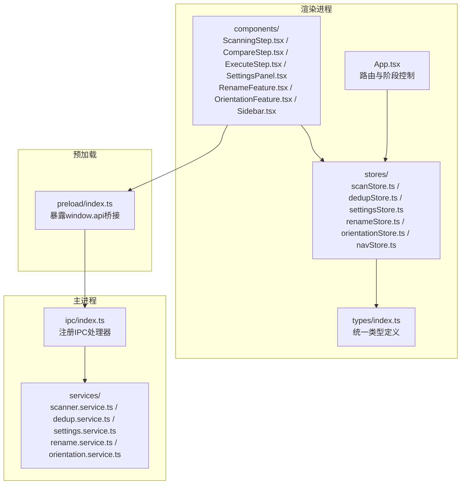
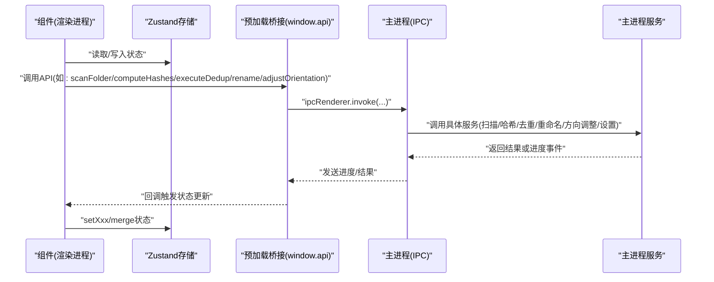
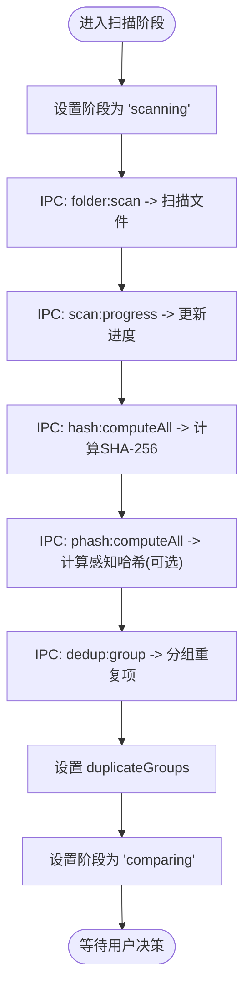
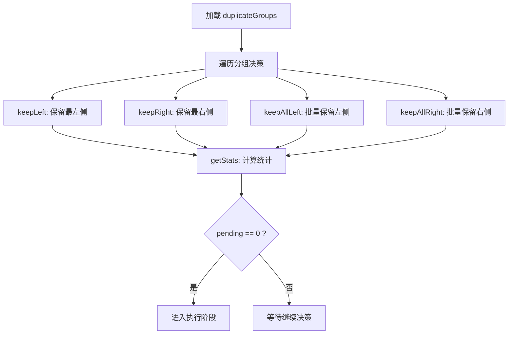
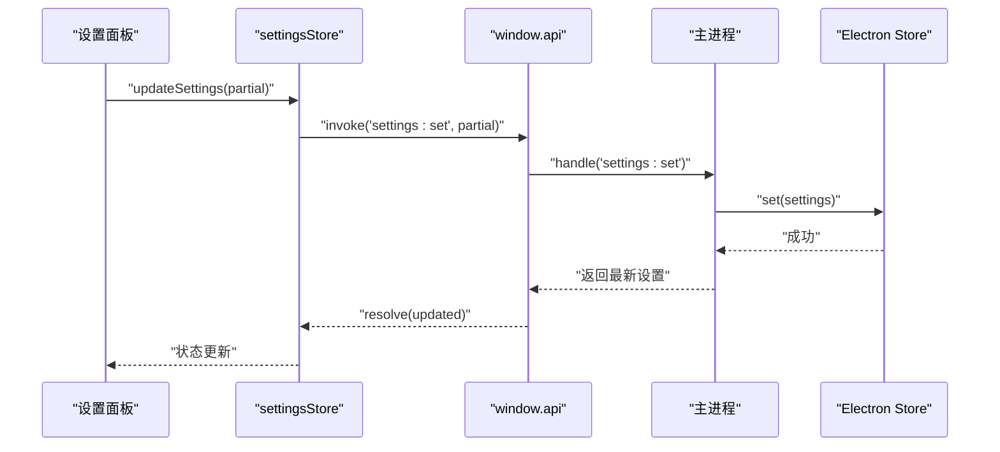
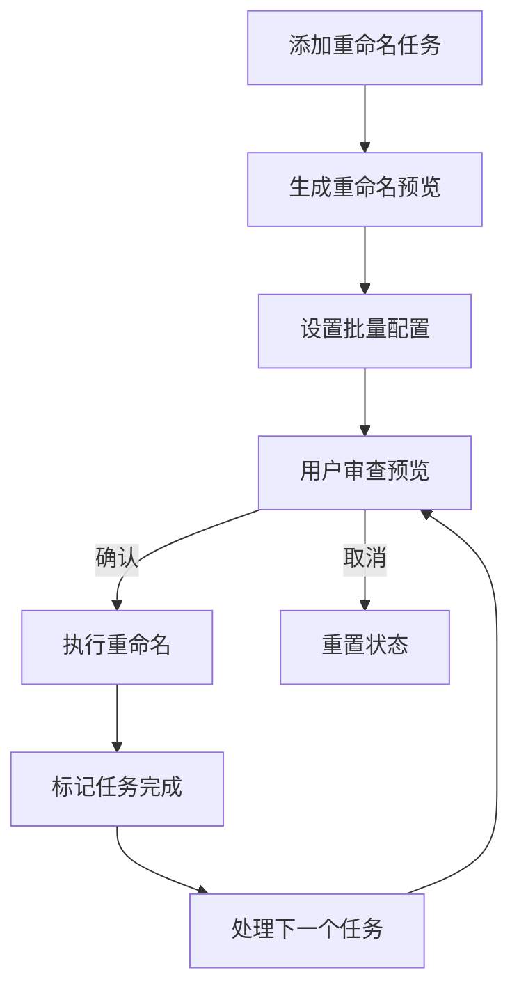
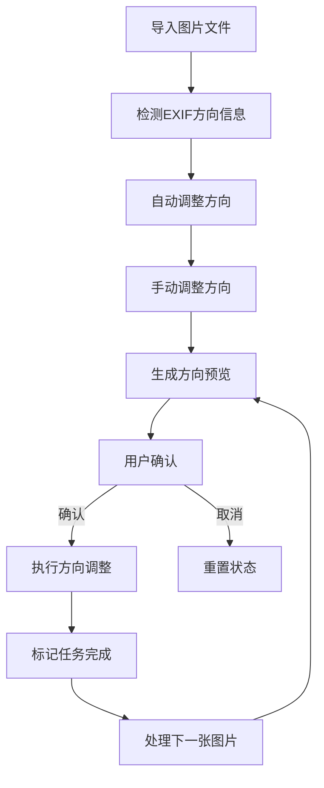
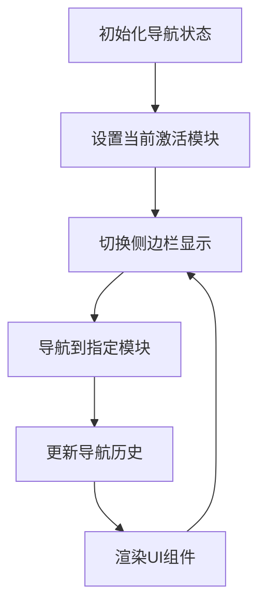
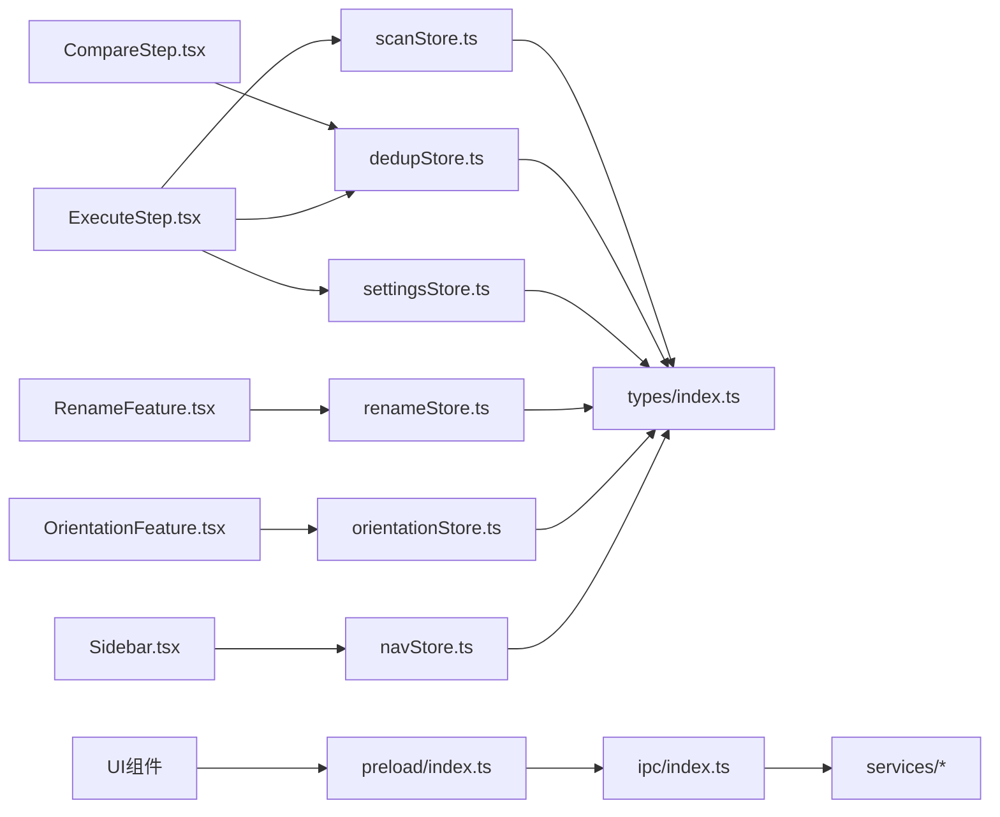
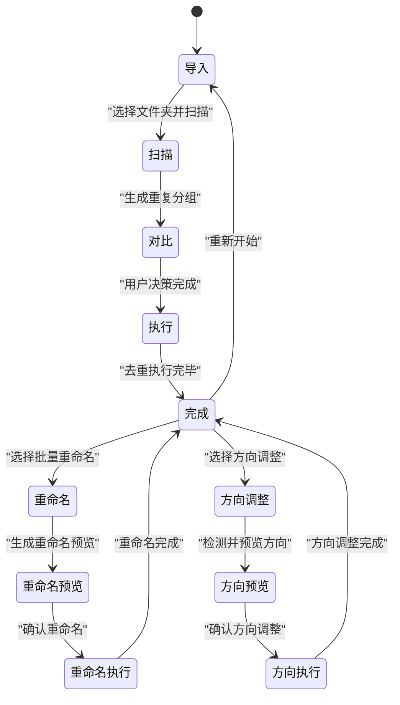

# 状态管理系统

<cite>
**本文档引用的文件**
- [scanStore.ts](file://src/renderer/src/stores/scanStore.ts)
- [dedupStore.ts](file://src/renderer/src/stores/dedupStore.ts)
- [settingsStore.ts](file://src/renderer/src/stores/settingsStore.ts)
- [renameStore.ts](file://src/renderer/src/stores/renameStore.ts)
- [orientationStore.ts](file://src/renderer/src/stores/orientationStore.ts)
- [navStore.ts](file://src/renderer/src/stores/navStore.ts)
- [index.ts（主进程IPC）](file://src/main/ipc/index.ts)
- [index.ts（预加载桥接）](file://src/preload/index.ts)
- [index.ts（扫描服务）](file://src/main/services/scanner.service.ts)
- [dedup.service.ts](file://src/main/services/dedup.service.ts)
- [settings.service.ts](file://src/main/services/settings.service.ts)
- [rename.service.ts](file://src/main/services/rename.service.ts)
- [orientation.service.ts](file://src/main/services/orientation.service.ts)
- [index.ts（类型定义）](file://src/renderer/src/types/index.ts)
- [ScanningStep.tsx](file://src/renderer/src/components/ScanningStep.tsx)
- [CompareStep.tsx](file://src/renderer/src/components/CompareStep.tsx)
- [ExecuteStep.tsx](file://src/renderer/src/components/ExecuteStep.tsx)
- [SettingsPanel.tsx](file://src/renderer/src/components/SettingsPanel.tsx)
- [RenameFeature.tsx](file://src/renderer/src/components/rename/RenameFeature.tsx)
- [OrientationFeature.tsx](file://src/renderer/src/components/orientation/OrientationFeature.tsx)
- [Sidebar.tsx](file://src/renderer/src/components/Sidebar.tsx)
- [App.tsx](file://src/renderer/src/App.tsx)
- [main.tsx](file://src/renderer/src/main.tsx)
</cite>

## 更新摘要
**所做更改**
- 新增renameStore（重命名状态管理）模块，支持批量重命名功能
- 新增orientationStore（方向状态管理）模块，支持图片方向调整功能
- 新增navStore（导航状态管理）模块，用于管理侧边栏状态
- 更新架构图以反映新增的状态存储模块
- 扩展状态流转图以包含重命名和方向调整流程
- 更新组件依赖关系分析以包含新功能模块

## 目录
1. [简介](#简介)
2. [项目结构](#项目结构)
3. [核心组件](#核心组件)
4. [架构总览](#架构总览)
5. [详细组件分析](#详细组件分析)
6. [依赖关系分析](#依赖关系分析)
7. [性能考量](#性能考量)
8. [故障排查指南](#故障排查指南)
9. [结论](#结论)
10. [附录](#附录)

## 简介
本文件系统性阐述红ophoto基于Zustand构建的轻量级状态管理方案，现已扩展支持四个核心状态存储模块，覆盖以下方面：
- 状态模型与动作函数：scanStore（扫描状态）、dedupStore（去重状态）、settingsStore（设置状态）、renameStore（重命名状态）、orientationStore（方向状态）、navStore（导航状态）
- 类型安全设计：统一的TypeScript接口与类型推导
- 状态订阅与跨组件共享：React组件如何订阅与消费状态
- 状态持久化与同步：设置的本地持久化与IPC进度同步
- 状态流转与数据流：从导入到执行的完整流程图，包含新增的重命名和方向调整功能
- 调试技巧、性能优化与最佳实践

## 项目结构
状态管理相关代码主要分布在渲染进程的stores目录与主进程的services/IPC层，类型定义集中于types目录，UI组件通过Zustand Hook订阅状态。新增的状态存储模块为重命名、方向调整和侧边栏导航功能提供专门的状态管理。

**图表来源**
- [App.tsx:11-34](file://src/renderer/src/App.tsx#L11-L34)
- [scanStore.ts:25-51](file://src/renderer/src/stores/scanStore.ts#L25-L51)
- [dedupStore.ts:18-82](file://src/renderer/src/stores/dedupStore.ts#L18-L82)
- [settingsStore.ts:11-40](file://src/renderer/src/stores/settingsStore.ts#L11-L40)
- [renameStore.ts:1-100](file://src/renderer/src/stores/renameStore.ts#L1-L100)
- [orientationStore.ts:1-100](file://src/renderer/src/stores/orientationStore.ts#L1-L100)
- [navStore.ts:1-100](file://src/renderer/src/stores/navStore.ts#L1-L100)
- [index.ts（主进程IPC）:22-155](file://src/main/ipc/index.ts#L22-L155)
- [index.ts（预加载桥接）:61-122](file://src/preload/index.ts#L61-L122)
- [index.ts（类型定义）:1-58](file://src/renderer/src/types/index.ts#L1-L58)

**章节来源**
- [App.tsx:11-34](file://src/renderer/src/App.tsx#L11-L34)
- [main.tsx:6-10](file://src/renderer/src/main.tsx#L6-L10)

## 核心组件
本节对六个Zustand状态存储进行深入解析，包括数据结构、动作函数与使用场景。

### scanStore（扫描状态）
- 关键字段：当前阶段、目标文件夹路径、文件列表、扫描/去重进度、错误信息、重复分组、去重结果
- 动作函数：设置阶段、设置文件夹、设置文件列表、设置进度、设置错误、设置重复分组、设置去重结果、重置
- 订阅方式：组件通过选择器订阅所需字段，避免不必要重渲染
- 使用示例路径：[scanStore.ts:6-23](file://src/renderer/src/stores/scanStore.ts#L6-L23)

### dedupStore（去重状态）
- 关键字段：决策映射（按分组ID存储"保留/删除"的文件ID集合）
- 动作函数：设置单个分组决策、按左右策略快速决策、批量决策、清空、转数组、统计、查询是否存在决策
- 订阅方式：组件通过选择器读取决策映射与统计信息
- 使用示例路径：[dedupStore.ts:4-16](file://src/renderer/src/stores/dedupStore.ts#L4-L16)

### settingsStore（设置状态）
- 关键字段：应用设置对象、是否已加载
- 动作函数：异步加载设置、异步更新设置（失败时回退到本地合并）
- 订阅方式：组件订阅settings与loaded标志
- 使用示例路径：[settingsStore.ts:4-9](file://src/renderer/src/stores/settingsStore.ts#L4-L9)

### renameStore（重命名状态）
- 关键字段：重命名任务列表、当前处理的文件、重命名预览、批量重命名配置
- 动作函数：添加重命名任务、设置当前处理文件、更新重命名预览、设置批量配置、执行重命名、重置状态
- 订阅方式：组件通过选择器订阅重命名任务和预览状态
- 使用示例路径：[renameStore.ts:1-100](file://src/renderer/src/stores/renameStore.ts#L1-L100)

### orientationStore（方向状态）
- 关键字段：方向调整任务列表、当前处理的图片、方向预览、批量方向调整配置
- 动作函数：添加方向调整任务、设置当前处理图片、更新方向预览、设置批量配置、执行方向调整、重置状态
- 订阅方式：组件通过选择器订阅方向调整任务和预览状态
- 使用示例路径：[orientationStore.ts:1-100](file://src/renderer/src/stores/orientationStore.ts#L1-L100)

### navStore（导航状态）
- 关键字段：侧边栏展开状态、当前激活的功能模块、导航历史记录
- 动作函数：切换侧边栏、设置当前功能模块、导航到指定模块、返回上一个模块
- 订阅方式：组件通过选择器订阅导航状态和侧边栏状态
- 使用示例路径：[navStore.ts:1-100](file://src/renderer/src/stores/navStore.ts#L1-L100)

**章节来源**
- [scanStore.ts:6-23](file://src/renderer/src/stores/scanStore.ts#L6-L23)
- [dedupStore.ts:4-16](file://src/renderer/src/stores/dedupStore.ts#L4-L16)
- [settingsStore.ts:4-9](file://src/renderer/src/stores/settingsStore.ts#L4-L9)
- [renameStore.ts:1-100](file://src/renderer/src/stores/renameStore.ts#L1-L100)
- [orientationStore.ts:1-100](file://src/renderer/src/stores/orientationStore.ts#L1-L100)
- [navStore.ts:1-100](file://src/renderer/src/stores/navStore.ts#L1-L100)

## 架构总览
下图展示了从UI到IPC再到主进程服务的完整调用链，以及状态在各层之间的传递，包含新增的重命名和方向调整功能。

**图表来源**
- [index.ts（预加载桥接）:61-122](file://src/preload/index.ts#L61-L122)
- [index.ts（主进程IPC）:42-142](file://src/main/ipc/index.ts#L42-L142)
- [index.ts（扫描服务）:28-85](file://src/main/services/scanner.service.ts#L28-L85)
- [dedup.service.ts:43-130](file://src/main/services/dedup.service.ts#L43-L130)
- [rename.service.ts:1-100](file://src/main/services/rename.service.ts#L1-L100)
- [orientation.service.ts:1-100](file://src/main/services/orientation.service.ts#L1-L100)
- [settings.service.ts:24-33](file://src/main/services/settings.service.ts#L24-L33)

## 详细组件分析

### 扫描状态 scanStore
- 设计理念
  - 将UI阶段（导入/扫描/对比/执行/完成）与数据（文件、重复分组、进度、错误、去重结果）统一管理
  - 通过动作函数原子化更新，避免深层嵌套状态导致的复杂度
- 数据结构要点
  - 阶段枚举：'import' | 'scanning' | 'comparing' | 'executing' | 'done'
  - 进度结构包含阶段、当前数、总数、百分比
  - 重复分组包含分组ID、哈希、匹配类型与文件列表
- 订阅与使用
  - 组件通过选择器订阅所需字段，例如进度条组件只订阅progress
  - 使用示例路径：[ScanningStep.tsx:4-15](file://src/renderer/src/components/ScanningStep.tsx#L4-L15)

**图表来源**
- [scanStore.ts:25-51](file://src/renderer/src/stores/scanStore.ts#L25-L51)
- [index.ts（主进程IPC）:42-107](file://src/main/ipc/index.ts#L42-L107)
- [index.ts（扫描服务）:28-85](file://src/main/services/scanner.service.ts#L28-L85)
- [dedup.service.ts:43-115](file://src/main/services/dedup.service.ts#L43-L115)

**章节来源**
- [scanStore.ts:6-23](file://src/renderer/src/stores/scanStore.ts#L6-L23)
- [ScanningStep.tsx:4-15](file://src/renderer/src/components/ScanningStep.tsx#L4-L15)

### 去重状态 dedupStore
- 设计理念
  - 以Map维护每个重复分组的决策，支持快速查询与批量操作
  - 提供"保留左/右""全部保留左/右"等快捷动作，提升交互效率
- 数据结构要点
  - 决策对象包含分组ID、保留文件ID数组、删除文件ID数组
  - 统计函数返回总分组数、已决策数、待决策数
- 订阅与使用
  - 组件通过选择器读取decisions映射与统计，避免全量重渲染
  - 使用示例路径：[CompareStep.tsx:73-142](file://src/renderer/src/components/CompareStep.tsx#L73-L142)

**图表来源**
- [dedupStore.ts:18-82](file://src/renderer/src/stores/dedupStore.ts#L18-L82)
- [CompareStep.tsx:136-155](file://src/renderer/src/components/CompareStep.tsx#L136-L155)

**章节来源**
- [dedupStore.ts:4-16](file://src/renderer/src/stores/dedupStore.ts#L4-L16)
- [CompareStep.tsx:73-142](file://src/renderer/src/components/CompareStep.tsx#L73-L142)

### 设置状态 settingsStore
- 设计理念
  - 将设置封装为可异步加载与更新的状态，失败时回退到本地合并，保证可用性
  - 通过Electron Store实现本地持久化，避免每次启动都请求主进程
- 数据结构要点
  - 设置项包含哈希模式、感知哈希阈值、输出模式、输出文件夹后缀
- 订阅与使用
  - 应用启动时自动加载设置；设置面板组件订阅并实时更新
  - 使用示例路径：[SettingsPanel.tsx:8-149](file://src/renderer/src/components/SettingsPanel.tsx#L8-L149)

**图表来源**
- [settingsStore.ts:29-39](file://src/renderer/src/stores/settingsStore.ts#L29-L39)
- [index.ts（主进程IPC）:152-155](file://src/main/ipc/index.ts#L152-L155)
- [settings.service.ts:28-33](file://src/main/services/settings.service.ts#L28-L33)
- [index.ts（预加载桥接）:98-100](file://src/preload/index.ts#L98-L100)

**章节来源**
- [settingsStore.ts:4-9](file://src/renderer/src/stores/settingsStore.ts#L4-L9)
- [SettingsPanel.tsx:8-149](file://src/renderer/src/components/SettingsPanel.tsx#L8-L149)

### 重命名状态 renameStore
- 设计理念
  - 专门管理批量重命名功能的状态，支持预览、配置和执行完整的重命名流程
  - 通过任务队列管理多个文件的重命名操作，提供原子化的状态更新
- 数据结构要点
  - 重命名任务包含原始文件名、新文件名、预览状态和执行状态
  - 批量配置支持正则表达式替换、前缀/后缀添加、大小写转换等功能
- 订阅与使用
  - 组件通过选择器订阅任务列表和当前处理状态，避免不必要的重渲染
  - 使用示例路径：[RenameFeature.tsx:1-200](file://src/renderer/src/components/rename/RenameFeature.tsx#L1-L200)

**图表来源**
- [renameStore.ts:1-100](file://src/renderer/src/stores/renameStore.ts#L1-L100)
- [RenameFeature.tsx:1-200](file://src/renderer/src/components/rename/RenameFeature.tsx#L1-L200)

**章节来源**
- [renameStore.ts:1-100](file://src/renderer/src/stores/renameStore.ts#L1-L100)
- [RenameFeature.tsx:1-200](file://src/renderer/src/components/rename/RenameFeature.tsx#L1-L200)

### 方向状态 orientationStore
- 设计理念
  - 专门管理图片方向调整功能的状态，支持EXIF方向信息检测和手动调整
  - 提供实时预览功能，让用户在执行前确认方向调整效果
- 数据结构要点
  - 方向调整任务包含图片文件、当前方向、目标方向和预览状态
  - 支持批量方向调整，包括旋转90度、水平翻转、垂直翻转等操作
- 订阅与使用
  - 组件通过选择器订阅当前图片和预览状态，确保UI及时响应状态变化
  - 使用示例路径：[OrientationFeature.tsx:1-200](file://src/renderer/src/components/orientation/OrientationFeature.tsx#L1-L200)

**图表来源**
- [orientationStore.ts:1-100](file://src/renderer/src/stores/orientationStore.ts#L1-L100)
- [OrientationFeature.tsx:1-200](file://src/renderer/src/components/orientation/OrientationFeature.tsx#L1-L200)

**章节来源**
- [orientationStore.ts:1-100](file://src/renderer/src/stores/orientationStore.ts#L1-L100)
- [OrientationFeature.tsx:1-200](file://src/renderer/src/components/orientation/OrientationFeature.tsx#L1-L200)

### 导航状态 navStore
- 设计理念
  - 专门管理侧边栏导航状态，提供模块间导航和状态保持功能
  - 支持响应式布局，根据屏幕尺寸自动调整侧边栏显示状态
- 数据结构要点
  - 导航状态包含侧边栏展开/收起状态、当前激活模块、导航历史
  - 支持键盘快捷键导航和程序化导航控制
- 订阅与使用
  - 组件通过选择器订阅导航状态，确保UI与状态保持同步
  - 使用示例路径：[Sidebar.tsx:1-150](file://src/renderer/src/components/Sidebar.tsx#L1-L150)

**图表来源**
- [navStore.ts:1-100](file://src/renderer/src/stores/navStore.ts#L1-L100)
- [Sidebar.tsx:1-150](file://src/renderer/src/components/Sidebar.tsx#L1-L150)

**章节来源**
- [navStore.ts:1-100](file://src/renderer/src/stores/navStore.ts#L1-L100)
- [Sidebar.tsx:1-150](file://src/renderer/src/components/Sidebar.tsx#L1-L150)

### 类型安全与接口定义
- 统一类型定义
  - 文件信息、哈希结果、感知哈希结果、重复分组、去重决策、设置、扫描/去重进度、重命名任务、方向调整任务、导航状态等均在types目录集中定义
  - 渲染进程与主进程共享类型，预加载桥接也导出对应接口，确保IPC数据契约一致
- 类型推导与约束
  - Zustand创建函数通过泛型约束状态与动作签名，避免运行期错误
  - 组件通过选择器订阅字段，TypeScript自动推导最小订阅范围，减少重渲染

**章节来源**
- [index.ts（类型定义）:1-58](file://src/renderer/src/types/index.ts#L1-L58)
- [index.ts（预加载桥接）:3-59](file://src/preload/index.ts#L3-L59)

## 依赖关系分析
- 组件与存储
  - UI组件通过useXxxStore订阅状态，保持低耦合高内聚
  - 新增的重命名和方向调整组件分别依赖对应的专用存储模块
- 存储与IPC
  - settingsStore通过window.api访问主进程设置服务；其他流程通过主进程IPC协调扫描/哈希/去重/重命名/方向调整服务
- 主进程服务
  - IPC处理器调用扫描、哈希、去重、重命名、方向调整与设置服务，负责实际业务逻辑与文件系统操作

**图表来源**
- [CompareStep.tsx:1-279](file://src/renderer/src/components/CompareStep.tsx#L1-L279)
- [ExecuteStep.tsx:1-161](file://src/renderer/src/components/ExecuteStep.tsx#L1-L161)
- [RenameFeature.tsx:1-200](file://src/renderer/src/components/rename/RenameFeature.tsx#L1-L200)
- [OrientationFeature.tsx:1-200](file://src/renderer/src/components/orientation/OrientationFeature.tsx#L1-L200)
- [Sidebar.tsx:1-150](file://src/renderer/src/components/Sidebar.tsx#L1-L150)
- [scanStore.ts:1-52](file://src/renderer/src/stores/scanStore.ts#L1-L52)
- [dedupStore.ts:1-83](file://src/renderer/src/stores/dedupStore.ts#L1-L83)
- [settingsStore.ts:1-41](file://src/renderer/src/stores/settingsStore.ts#L1-L41)
- [renameStore.ts:1-100](file://src/renderer/src/stores/renameStore.ts#L1-L100)
- [orientationStore.ts:1-100](file://src/renderer/src/stores/orientationStore.ts#L1-L100)
- [navStore.ts:1-100](file://src/renderer/src/stores/navStore.ts#L1-L100)
- [index.ts（预加载桥接）:61-122](file://src/preload/index.ts#L61-L122)
- [index.ts（主进程IPC）:22-155](file://src/main/ipc/index.ts#L22-L155)

**章节来源**
- [App.tsx:11-34](file://src/renderer/src/App.tsx#L11-L34)

## 性能考量
- 订阅粒度
  - 使用选择器订阅最小字段集，避免因全局状态变化导致的过度重渲染
  - 新增的状态存储模块同样采用选择器优化，确保组件只在相关状态变化时重渲染
- 异步与回退
  - 设置更新失败时采用本地回退，保障用户体验与稳定性
- 事件循环让渡
  - 扫描与去重过程中定期yield给事件循环，避免阻塞UI线程
  - 重命名和方向调整操作同样遵循异步处理原则，避免长时间阻塞UI
- 批量操作
  - dedupStore提供批量决策动作，减少多次状态更新带来的开销
  - renameStore和orientationStore支持批量任务处理，提高操作效率

## 故障排查指南
- 设置加载失败
  - 现象：设置面板显示默认值且loaded为true
  - 排查：检查主进程IPC设置处理器与Electron Store初始化
  - 参考路径：[settingsStore.ts:20-27](file://src/renderer/src/stores/settingsStore.ts#L20-L27)、[index.ts（主进程IPC）:152-155](file://src/main/ipc/index.ts#L152-L155)
- 去重执行异常
  - 现象：执行步骤报错并回退到对比阶段
  - 排查：检查IPC去重处理器、文件权限与磁盘空间
  - 参考路径：[ExecuteStep.tsx:48-51](file://src/renderer/src/components/ExecuteStep.tsx#L48-L51)、[index.ts（主进程IPC）:110-142](file://src/main/ipc/index.ts#L110-L142)
- 重命名任务失败
  - 现象：重命名预览正常但执行时报错
  - 排查：检查文件权限、磁盘空间、文件锁定状态
  - 参考路径：[renameStore.ts:1-100](file://src/renderer/src/stores/renameStore.ts#L1-L100)、[rename.service.ts:1-100](file://src/main/services/rename.service.ts#L1-L100)
- 方向调整异常
  - 现象：方向预览正常但执行失败
  - 排查：检查图片格式支持、EXIF信息完整性、文件权限
  - 参考路径：[orientationStore.ts:1-100](file://src/renderer/src/stores/orientationStore.ts#L1-L100)、[orientation.service.ts:1-100](file://src/main/services/orientation.service.ts#L1-L100)
- 进度不更新
  - 现象：进度条无变化
  - 排查：确认IPC进度事件监听与window.api.onXxx绑定
  - 参考路径：[index.ts（预加载桥接）:103-119](file://src/preload/index.ts#L103-L119)

**章节来源**
- [settingsStore.ts:20-27](file://src/renderer/src/stores/settingsStore.ts#L20-L27)
- [ExecuteStep.tsx:48-51](file://src/renderer/src/components/ExecuteStep.tsx#L48-L51)
- [renameStore.ts:1-100](file://src/renderer/src/stores/renameStore.ts#L1-L100)
- [orientationStore.ts:1-100](file://src/renderer/src/stores/orientationStore.ts#L1-L100)
- [index.ts（预加载桥接）:103-119](file://src/preload/index.ts#L103-L119)

## 结论
该状态管理方案以Zustand为核心，结合TypeScript类型系统与Electron IPC，实现了清晰的职责分离与良好的扩展性。新增的renameStore、orientationStore和navStore进一步完善了功能模块的状态管理，与原有的scanStore、dedupStore和settingsStore共同构成了完整的状态管理体系。通过专用的状态存储模块，系统能够更好地支持批量重命名、图片方向调整和侧边栏导航等高级功能，同时保持了良好的性能和用户体验。

## 附录
- 状态流转总览（导入→扫描→对比→执行→完成，包含重命名和方向调整）

