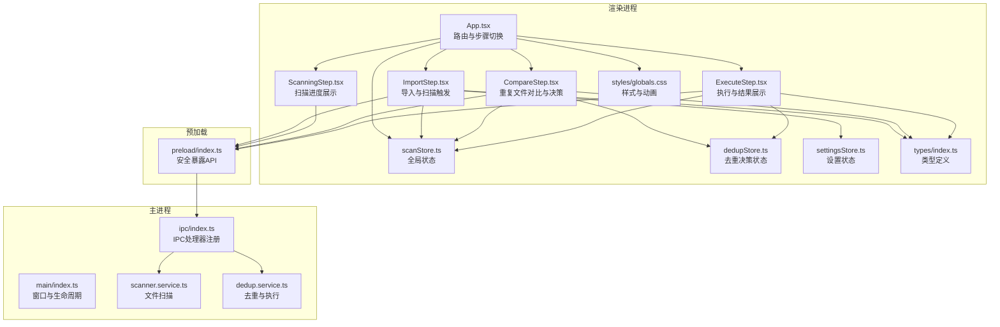
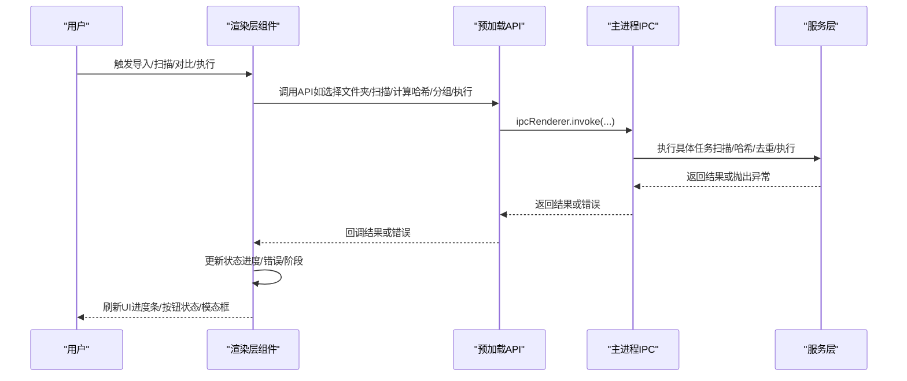
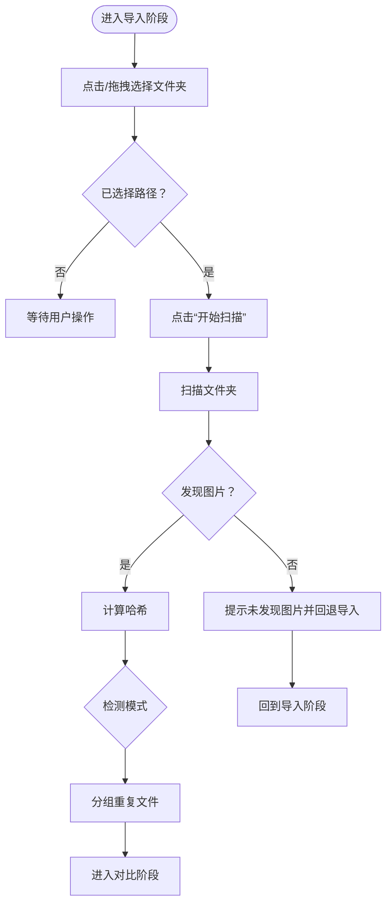
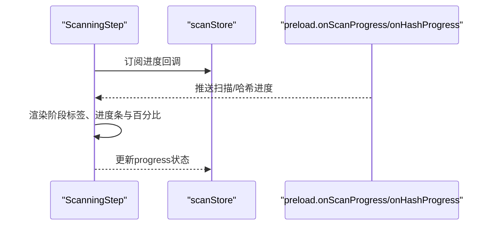
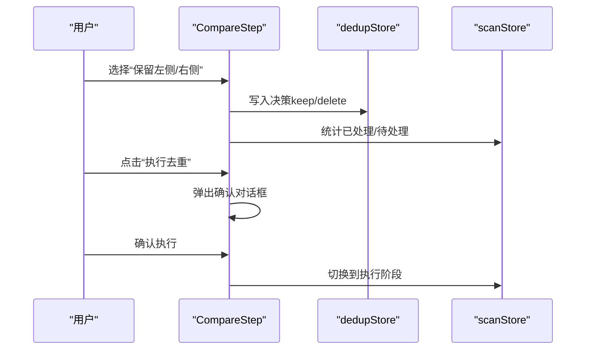
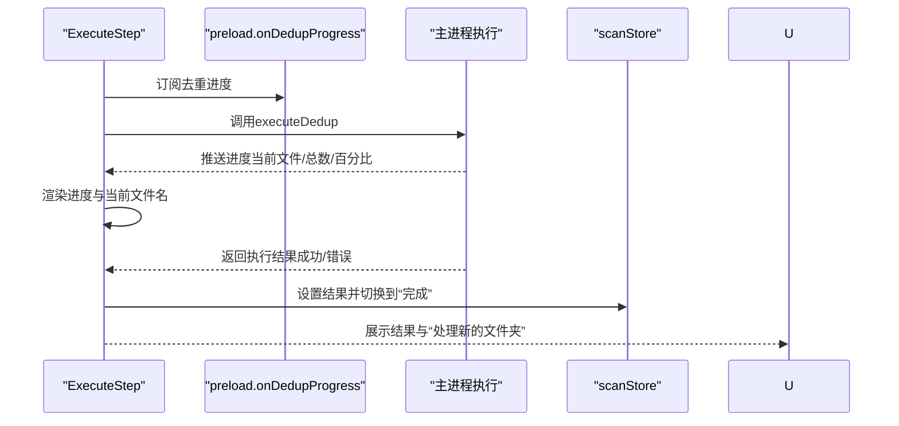
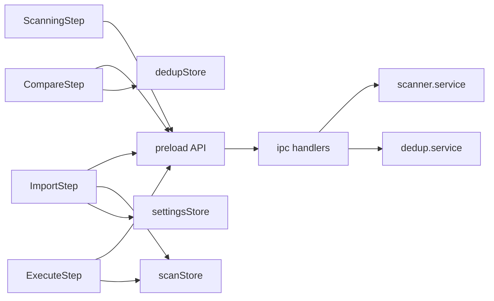
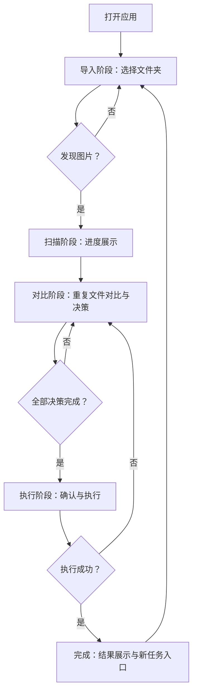
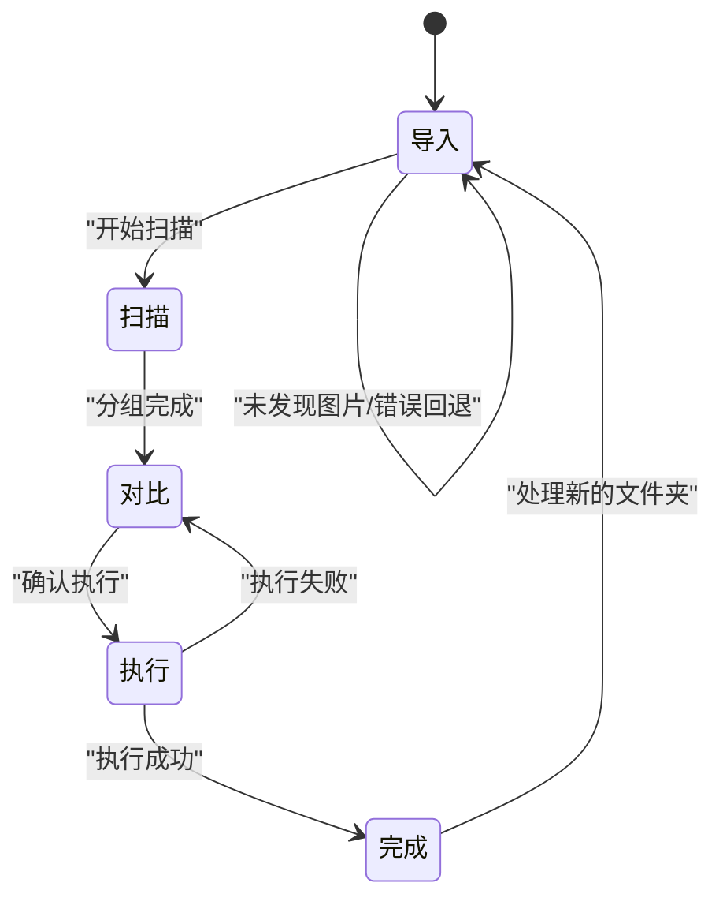

# 用户交互流程

<cite>
**本文引用的文件**
- [src/renderer/src/App.tsx](file://src/renderer/src/App.tsx)
- [src/renderer/src/main.tsx](file://src/renderer/src/main.tsx)
- [src/main/index.ts](file://src/main/index.ts)
- [src/preload/index.ts](file://src/preload/index.ts)
- [src/renderer/src/components/ImportStep.tsx](file://src/renderer/src/components/ImportStep.tsx)
- [src/renderer/src/components/ScanningStep.tsx](file://src/renderer/src/components/ScanningStep.tsx)
- [src/renderer/src/components/CompareStep.tsx](file://src/renderer/src/components/CompareStep.tsx)
- [src/renderer/src/components/ExecuteStep.tsx](file://src/renderer/src/components/ExecuteStep.tsx)
- [src/renderer/src/stores/scanStore.ts](file://src/renderer/src/stores/scanStore.ts)
- [src/renderer/src/stores/dedupStore.ts](file://src/renderer/src/stores/dedupStore.ts)
- [src/renderer/src/stores/settingsStore.ts](file://src/renderer/src/stores/settingsStore.ts)
- [src/main/ipc/index.ts](file://src/main/ipc/index.ts)
- [src/main/services/scanner.service.ts](file://src/main/services/scanner.service.ts)
- [src/main/services/dedup.service.ts](file://src/main/services/dedup.service.ts)
- [src/renderer/src/types/index.ts](file://src/renderer/src/types/index.ts)
- [src/renderer/src/styles/globals.css](file://src/renderer/src/styles/globals.css)
</cite>

## 目录
1. [简介](#简介)
2. [项目结构](#项目结构)
3. [核心组件](#核心组件)
4. [架构总览](#架构总览)
5. [详细组件分析](#详细组件分析)
6. [依赖关系分析](#依赖关系分析)
7. [性能考虑](#性能考虑)
8. [故障排查指南](#故障排查指南)
9. [结论](#结论)
10. [附录](#附录)

## 简介
本文件面向红ophoto的用户交互流程，系统性梳理“渐进式四步操作流程”的完整用户体验：导入阶段（文件夹选择与权限验证）、扫描阶段（进度指示与结果呈现）、比较阶段（重复文件对比与用户决策）、执行阶段（结果确认与后续操作）。文档重点解释每一步的用户引导策略、错误处理与反馈机制，并覆盖交互模式（按钮状态变化、进度条更新、模态框显示）以及无障碍访问（屏幕阅读器支持、键盘导航、高对比度模式）。最后提供用户操作流程图与状态转换图，帮助开发者与产品人员统一理解端到端的用户旅程。

## 项目结构
应用采用 Electron + React 架构，渲染层使用 Zustand 状态管理，通过 preload 暴露安全的 IPC 接口给渲染进程调用；主进程负责文件系统扫描、哈希计算、去重分组与执行。

图表来源
- [src/renderer/src/App.tsx:11-34](file://src/renderer/src/App.tsx#L11-L34)
- [src/renderer/src/components/ImportStep.tsx:5-82](file://src/renderer/src/components/ImportStep.tsx#L5-L82)
- [src/renderer/src/components/ScanningStep.tsx:3-83](file://src/renderer/src/components/ScanningStep.tsx#L3-L83)
- [src/renderer/src/components/CompareStep.tsx:136-278](file://src/renderer/src/components/CompareStep.tsx#L136-L278)
- [src/renderer/src/components/ExecuteStep.tsx:7-160](file://src/renderer/src/components/ExecuteStep.tsx#L7-L160)
- [src/renderer/src/stores/scanStore.ts:25-51](file://src/renderer/src/stores/scanStore.ts#L25-L51)
- [src/renderer/src/stores/dedupStore.ts:18-82](file://src/renderer/src/stores/dedupStore.ts#L18-L82)
- [src/renderer/src/stores/settingsStore.ts:11-40](file://src/renderer/src/stores/settingsStore.ts#L11-L40)
- [src/main/index.ts:8-46](file://src/main/index.ts#L8-L46)
- [src/main/ipc/index.ts:22-155](file://src/main/ipc/index.ts#L22-L155)
- [src/main/services/scanner.service.ts:28-85](file://src/main/services/scanner.service.ts#L28-L85)
- [src/main/services/dedup.service.ts:43-208](file://src/main/services/dedup.service.ts#L43-L208)
- [src/preload/index.ts:61-122](file://src/preload/index.ts#L61-L122)
- [src/renderer/src/types/index.ts:1-58](file://src/renderer/src/types/index.ts#L1-L58)
- [src/renderer/src/styles/globals.css:1-64](file://src/renderer/src/styles/globals.css#L1-L64)

章节来源
- [src/renderer/src/App.tsx:11-34](file://src/renderer/src/App.tsx#L11-L34)
- [src/main/index.ts:8-46](file://src/main/index.ts#L8-L46)

## 核心组件
- 应用入口与路由：根据当前阶段渲染对应步骤组件，统一承载标题栏与设置面板。
- 步骤组件：导入、扫描、对比、执行四个步骤各自负责特定的用户交互与状态流转。
- 状态管理：scanStore 管理全局阶段、文件列表、进度、错误与去重结果；dedupStore 管理每组重复文件的决策；settingsStore 管理应用设置。
- 预加载接口：封装文件夹选择、扫描、哈希计算、分组、执行、缩略图生成、设置读取/写入及进度事件监听。
- 主进程服务：文件扫描、哈希计算、去重分组、执行复制/删除、缩略图生成与设置持久化。

章节来源
- [src/renderer/src/App.tsx:11-34](file://src/renderer/src/App.tsx#L11-L34)
- [src/renderer/src/stores/scanStore.ts:25-51](file://src/renderer/src/stores/scanStore.ts#L25-L51)
- [src/renderer/src/stores/dedupStore.ts:18-82](file://src/renderer/src/stores/dedupStore.ts#L18-L82)
- [src/renderer/src/stores/settingsStore.ts:11-40](file://src/renderer/src/stores/settingsStore.ts#L11-L40)
- [src/preload/index.ts:61-122](file://src/preload/index.ts#L61-L122)
- [src/main/ipc/index.ts:22-155](file://src/main/ipc/index.ts#L22-L155)

## 架构总览
渲染层通过 preload 暴露的安全 API 与主进程通信，主进程在后台执行耗时任务并通过 IPC 实时推送进度事件，渲染层据此更新 UI 并驱动状态变更。

图表来源
- [src/preload/index.ts:61-122](file://src/preload/index.ts#L61-L122)
- [src/main/ipc/index.ts:22-155](file://src/main/ipc/index.ts#L22-L155)
- [src/main/services/scanner.service.ts:28-85](file://src/main/services/scanner.service.ts#L28-L85)
- [src/main/services/dedup.service.ts:117-208](file://src/main/services/dedup.service.ts#L117-L208)

## 详细组件分析

### 导入阶段：文件夹选择与权限验证
- 用户引导策略
  - 步骤指示器清晰标示“导入”为当前步骤。
  - 支持点击与拖拽两种文件夹选择方式，视觉反馈（边框高亮、背景色变化）增强可操作性。
  - 显示所选文件夹路径与统计信息（数量、总大小），提升透明度与信任感。
  - 根据是否已选择文件夹启用/禁用“开始扫描”按钮，避免误操作。
- 权限验证与错误处理
  - 通过对话框选择文件夹，若取消则不改变状态。
  - 扫描阶段先进行扫描与哈希计算，若未发现图片文件，提示用户并回退到导入阶段。
  - 若扫描或哈希过程中发生异常，捕获错误并提示，同时回退到导入阶段。
- 进度与反馈
  - 在导入阶段内部通过进度对象模拟“哈希”阶段，为后续步骤做准备。
  - 哈希模式指示器显示当前检测模式（精确匹配/相似检测/组合模式）。
- 交互模式
  - 按钮状态：未选择文件夹时禁用，选择后启用并带脉冲发光效果。
  - 模态框：无显式模态框，错误通过顶部提示块展示。
  - 键盘快捷键：未实现专用快捷键，但具备可访问性基础（焦点可见、语义化标签）。

图表来源
- [src/renderer/src/components/ImportStep.tsx:10-82](file://src/renderer/src/components/ImportStep.tsx#L10-L82)
- [src/main/ipc/index.ts:42-53](file://src/main/ipc/index.ts#L42-L53)
- [src/main/services/scanner.service.ts:28-85](file://src/main/services/scanner.service.ts#L28-L85)

章节来源
- [src/renderer/src/components/ImportStep.tsx:5-174](file://src/renderer/src/components/ImportStep.tsx#L5-L174)
- [src/renderer/src/stores/scanStore.ts:25-51](file://src/renderer/src/stores/scanStore.ts#L25-L51)
- [src/renderer/src/stores/settingsStore.ts:11-40](file://src/renderer/src/stores/settingsStore.ts#L11-L40)

### 扫描阶段：进度指示与结果展示
- 用户引导策略
  - 步骤指示器显示“导入”已完成，“扫描”进行中。
  - 以阶段图标与文字描述当前处理阶段（扫描文件夹、计算哈希、计算感知哈希、分组）。
- 进度展示
  - 展示当前文件数/总数与百分比，进度条实时更新。
  - 当无进度数据时显示“准备中”旋转指示器。
- 错误处理
  - 该阶段主要由导入阶段触发，扫描异常已在导入阶段捕获并回退。
- 交互模式
  - 按钮状态：仅显示，不可点击。
  - 模态框：无。
  - 键盘快捷键：无。

图表来源
- [src/renderer/src/components/ScanningStep.tsx:3-83](file://src/renderer/src/components/ScanningStep.tsx#L3-L83)
- [src/renderer/src/stores/scanStore.ts:25-51](file://src/renderer/src/stores/scanStore.ts#L25-L51)
- [src/preload/index.ts:103-119](file://src/preload/index.ts#L103-L119)

章节来源
- [src/renderer/src/components/ScanningStep.tsx:3-83](file://src/renderer/src/components/ScanningStep.tsx#L3-L83)
- [src/preload/index.ts:103-119](file://src/preload/index.ts#L103-L119)

### 比较阶段：重复文件对比与用户决策
- 用户引导策略
  - 顶部显示重复组总数与已处理/待处理统计，辅助用户把握工作量。
  - 提供“全部保留左侧/右侧”“清除选择”等批量操作，提高效率。
- 对比与决策
  - 每组重复文件以卡片形式左右并排展示，支持快速视觉对比。
  - 图片卡片包含缩略图、尺寸、格式、修改日期等元信息。
  - 每组提供“保留左侧/保留右侧”按钮，支持单组决策。
  - 已决策组显示“已决策”徽章，便于追踪。
- 错误处理与反馈
  - 执行按钮在仍有待处理组时禁用，防止误操作。
  - 提供“重新开始”按钮一键清空状态并回到导入阶段。
- 交互模式
  - 按钮状态：根据决策状态动态高亮；待处理时禁用执行按钮。
  - 模态框：执行前弹出确认对话框，二次确认风险操作。
  - 键盘快捷键：未实现专用快捷键。
- 分页与滚动
  - 每页最多展示固定数量的重复组，支持上一页/下一页导航。

图表来源
- [src/renderer/src/components/CompareStep.tsx:136-278](file://src/renderer/src/components/CompareStep.tsx#L136-L278)
- [src/renderer/src/stores/dedupStore.ts:18-82](file://src/renderer/src/stores/dedupStore.ts#L18-L82)
- [src/renderer/src/stores/scanStore.ts:25-51](file://src/renderer/src/stores/scanStore.ts#L25-L51)

章节来源
- [src/renderer/src/components/CompareStep.tsx:12-279](file://src/renderer/src/components/CompareStep.tsx#L12-L279)
- [src/renderer/src/stores/dedupStore.ts:18-82](file://src/renderer/src/stores/dedupStore.ts#L18-L82)

### 执行阶段：结果确认与后续操作
- 用户引导策略
  - 显示“正在执行去重”状态，实时展示当前文件名、进度与百分比。
  - 执行完成后展示成功/跳过数量与输出目录（复制模式）。
- 结果确认与错误处理
  - 执行前通过确认对话框再次提醒用户风险。
  - 执行失败时显示错误信息并回退到对比阶段，允许用户修正决策。
- 交互模式
  - 按钮状态：执行中禁用输入；完成后显示“处理新的文件夹”按钮。
  - 模态框：执行前确认与错误提示。
  - 键盘快捷键：无。
- 后续操作
  - 完成后可直接开始新一轮处理，或查看输出目录（复制模式）。

图表来源
- [src/renderer/src/components/ExecuteStep.tsx:7-160](file://src/renderer/src/components/ExecuteStep.tsx#L7-L160)
- [src/preload/index.ts:115-119](file://src/preload/index.ts#L115-L119)
- [src/main/ipc/index.ts:110-142](file://src/main/ipc/index.ts#L110-L142)
- [src/main/services/dedup.service.ts:117-208](file://src/main/services/dedup.service.ts#L117-L208)

章节来源
- [src/renderer/src/components/ExecuteStep.tsx:7-160](file://src/renderer/src/components/ExecuteStep.tsx#L7-L160)
- [src/renderer/src/stores/scanStore.ts:25-51](file://src/renderer/src/stores/scanStore.ts#L25-L51)

## 依赖关系分析
- 组件耦合
  - App 作为根容器，按阶段渲染子组件，低耦合。
  - CompareStep 依赖 scanStore 的重复组与 folderPath，依赖 dedupStore 的决策状态。
  - ExecuteStep 依赖 scanStore 的文件列表、重复组与结果，依赖 dedupStore 的决策数组。
- 数据流
  - 导入阶段：选择文件夹 -> 扫描 -> 哈希 -> 分组 -> 切换对比阶段。
  - 对比阶段：用户决策 -> 统计状态 -> 执行按钮启用 -> 执行阶段。
  - 执行阶段：订阅进度 -> 执行 -> 结果 -> 切换完成阶段。
- 外部依赖
  - Electron 窗口控制、对话框、IPC。
  - 文件系统扫描、哈希计算、去重分组与执行。
  - 缩略图生成与设置持久化。

图表来源
- [src/renderer/src/components/ImportStep.tsx:5-82](file://src/renderer/src/components/ImportStep.tsx#L5-L82)
- [src/renderer/src/components/ScanningStep.tsx:3-83](file://src/renderer/src/components/ScanningStep.tsx#L3-L83)
- [src/renderer/src/components/CompareStep.tsx:136-278](file://src/renderer/src/components/CompareStep.tsx#L136-L278)
- [src/renderer/src/components/ExecuteStep.tsx:7-160](file://src/renderer/src/components/ExecuteStep.tsx#L7-L160)
- [src/preload/index.ts:61-122](file://src/preload/index.ts#L61-L122)
- [src/main/ipc/index.ts:22-155](file://src/main/ipc/index.ts#L22-L155)
- [src/main/services/scanner.service.ts:28-85](file://src/main/services/scanner.service.ts#L28-L85)
- [src/main/services/dedup.service.ts:43-208](file://src/main/services/dedup.service.ts#L43-L208)
- [src/renderer/src/stores/dedupStore.ts:18-82](file://src/renderer/src/stores/dedupStore.ts#L18-L82)
- [src/renderer/src/stores/scanStore.ts:25-51](file://src/renderer/src/stores/scanStore.ts#L25-L51)
- [src/renderer/src/stores/settingsStore.ts:11-40](file://src/renderer/src/stores/settingsStore.ts#L11-L40)

章节来源
- [src/renderer/src/App.tsx:11-34](file://src/renderer/src/App.tsx#L11-L34)
- [src/preload/index.ts:61-122](file://src/preload/index.ts#L61-L122)
- [src/main/ipc/index.ts:22-155](file://src/main/ipc/index.ts#L22-L155)

## 性能考虑
- 事件让渡与节流
  - 扫描阶段每处理一定数量文件后让渡事件循环，避免 UI 卡顿。
  - 去重执行阶段同样按批次处理，减少长时间阻塞。
- 进度更新频率
  - 通过 IPC 以固定频率推送进度，避免过度重绘。
- 图像预览
  - 使用缩略图生成接口，限制最大尺寸，降低内存占用与渲染压力。
- 存储与状态
  - 使用 Map 存储去重决策，查询与更新高效；Zustand 状态粒度合理，避免不必要的重渲染。

章节来源
- [src/main/services/scanner.service.ts:75-82](file://src/main/services/scanner.service.ts#L75-L82)
- [src/main/services/dedup.service.ts:145-157](file://src/main/services/dedup.service.ts#L145-L157)
- [src/main/services/dedup.service.ts:187-205](file://src/main/services/dedup.service.ts#L187-L205)
- [src/main/ipc/index.ts:132-139](file://src/main/ipc/index.ts#L132-L139)

## 故障排查指南
- 无法选择文件夹
  - 检查对话框是否被拦截或取消；确认主进程已正确注册文件夹选择处理函数。
- 未发现图片文件
  - 确认所选文件夹包含受支持的扩展名；检查扫描阶段回调是否正常触发。
- 扫描/哈希/去重过程卡住
  - 查看进度事件是否持续推送；确认主进程服务未抛出异常。
- 执行失败
  - 查看错误提示并回退到对比阶段修正决策；检查目标输出目录权限。
- UI 不响应
  - 确认订阅的进度清理函数是否正确释放；避免重复订阅导致内存泄漏。

章节来源
- [src/main/ipc/index.ts:32-53](file://src/main/ipc/index.ts#L32-L53)
- [src/renderer/src/components/ImportStep.tsx:78-82](file://src/renderer/src/components/ImportStep.tsx#L78-L82)
- [src/renderer/src/components/ExecuteStep.tsx:48-55](file://src/renderer/src/components/ExecuteStep.tsx#L48-L55)

## 结论
红ophoto 的用户交互流程围绕“导入—扫描—对比—执行”四步展开，通过明确的步骤指示、实时进度反馈与稳健的错误处理，确保用户在复杂文件去重任务中的可控与可预期体验。渲染层与主进程通过安全的 IPC 接口协作，既保证了性能也兼顾了安全性。建议在后续版本中补充键盘快捷键与无障碍增强（如屏幕阅读器标签与高对比度主题），进一步提升可用性。

## 附录

### 用户操作流程图（端到端）

图表来源
- [src/renderer/src/components/ImportStep.tsx:10-82](file://src/renderer/src/components/ImportStep.tsx#L10-L82)
- [src/renderer/src/components/ScanningStep.tsx:3-83](file://src/renderer/src/components/ScanningStep.tsx#L3-L83)
- [src/renderer/src/components/CompareStep.tsx:136-278](file://src/renderer/src/components/CompareStep.tsx#L136-L278)
- [src/renderer/src/components/ExecuteStep.tsx:7-160](file://src/renderer/src/components/ExecuteStep.tsx#L7-L160)

### 状态转换图（阶段流转）

图表来源
- [src/renderer/src/stores/scanStore.ts:25-51](file://src/renderer/src/stores/scanStore.ts#L25-L51)
- [src/renderer/src/components/ImportStep.tsx:71-82](file://src/renderer/src/components/ImportStep.tsx#L71-L82)
- [src/renderer/src/components/ExecuteStep.tsx:48-55](file://src/renderer/src/components/ExecuteStep.tsx#L48-L55)

### 无障碍访问建议
- 屏幕阅读器支持
  - 为关键按钮与进度文本添加语义化标签与描述，确保读屏软件可正确朗读。
- 键盘导航
  - 确保所有可交互元素可通过 Tab 键聚焦，提供键盘激活方式（Enter/Space）。
- 高对比度模式
  - 使用 Tailwind 的前景/背景色变量，确保在高对比度主题下仍具备良好可读性。
- 动画与焦点
  - 控制动画时长与频闪，避免对光敏用户造成不适；保持焦点可见轮廓。

章节来源
- [src/renderer/src/styles/globals.css:11-15](file://src/renderer/src/styles/globals.css#L11-L15)
- [src/renderer/src/styles/globals.css:47-63](file://src/renderer/src/styles/globals.css#L47-L63)