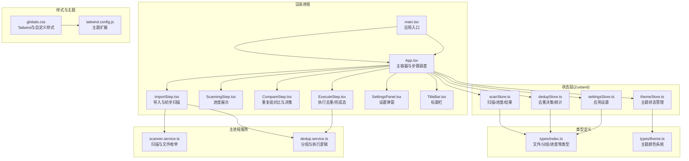
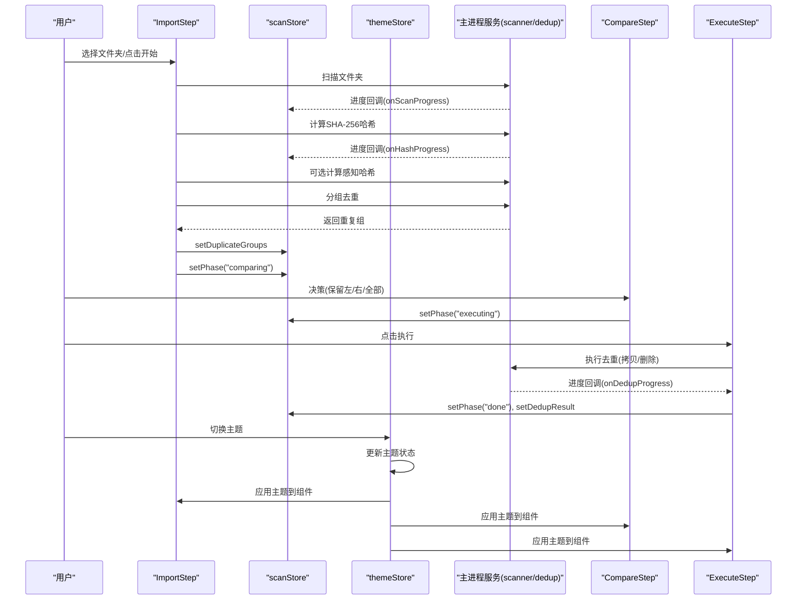
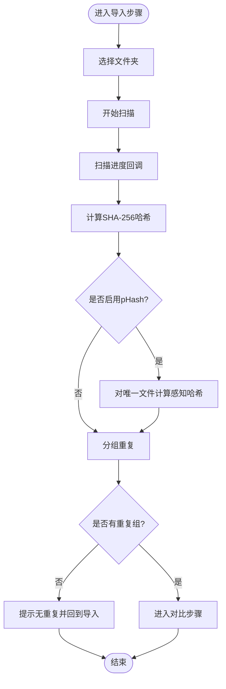
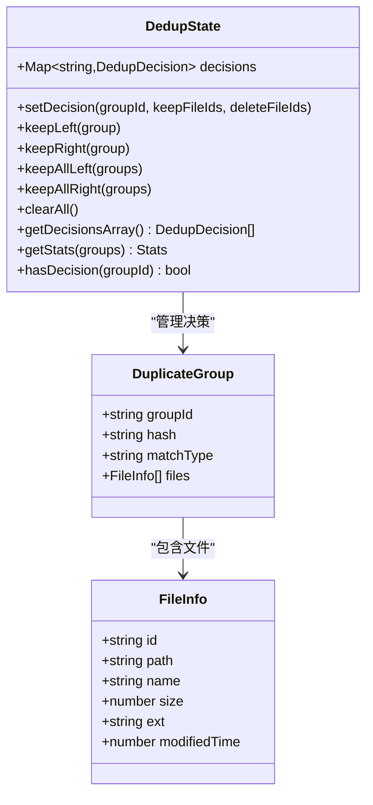
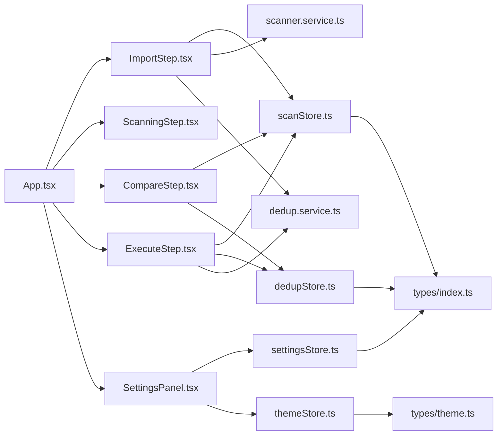
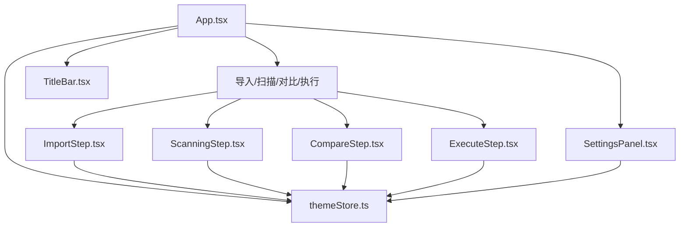
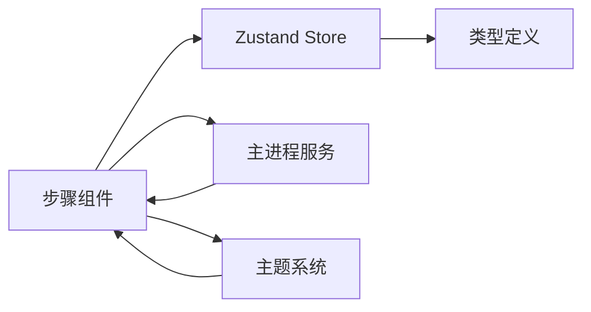

# 用户界面系统

<cite>
**本文档引用的文件**
- [App.tsx](file://src/renderer/src/App.tsx)
- [main.tsx](file://src/renderer/src/main.tsx)
- [ImportStep.tsx](file://src/renderer/src/components/ImportStep.tsx)
- [ScanningStep.tsx](file://src/renderer/src/components/ScanningStep.tsx)
- [CompareStep.tsx](file://src/renderer/src/components/CompareStep.tsx)
- [ExecuteStep.tsx](file://src/renderer/src/components/ExecuteStep.tsx)
- [SettingsPanel.tsx](file://src/renderer/src/components/SettingsPanel.tsx)
- [TitleBar.tsx](file://src/renderer/src/components/TitleBar.tsx)
- [scanStore.ts](file://src/renderer/src/stores/scanStore.ts)
- [dedupStore.ts](file://src/renderer/src/stores/dedupStore.ts)
- [settingsStore.ts](file://src/renderer/src/stores/settingsStore.ts)
- [index.ts](file://src/renderer/src/types/index.ts)
- [theme.ts](file://src/renderer/src/types/theme.ts)
- [globals.css](file://src/renderer/src/styles/globals.css)
- [tailwind.config.js](file://tailwind.config.js)
- [scanner.service.ts](file://src/main/services/scanner.service.ts)
- [dedup.service.ts](file://src/main/services/dedup.service.ts)
- [package.json](file://package.json)
</cite>

## 更新摘要
**所做更改**
- 新增主题系统完整实现章节，涵盖主题颜色系统、主题状态管理与主题切换机制
- 更新响应式设计与主题章节，详细说明主题化改造后的视觉一致性
- 新增主题状态模型与主题动作函数章节，展示Zustand主题状态管理
- 更新组件层次结构图与数据流向图，体现主题系统的集成
- 补充主题相关的无障碍访问支持与用户体验优化策略

## 目录
1. [简介](#简介)
2. [项目结构](#项目结构)
3. [核心组件](#核心组件)
4. [架构总览](#架构总览)
5. [详细组件分析](#详细组件分析)
6. [主题系统](#主题系统)
7. [依赖关系分析](#依赖关系分析)
8. [性能考虑](#性能考虑)
9. [故障排查指南](#故障排查指南)
10. [结论](#结论)
11. [附录](#附录)

## 简介
本设计文档聚焦于红ophoto的用户界面系统，围绕基于React的渐进式四步操作流程：导入步骤、扫描步骤、比较步骤与执行步骤展开。文档详细说明各UI组件的功能职责、状态管理（Zustand）、用户交互模式、响应式设计（Tailwind CSS）与主题定制、组件层次结构与数据流、用户体验优化与无障碍支持，以及组件的props接口、事件处理与生命周期管理。

**更新** 本版本重点反映了用户界面系统的主题化改造，所有核心组件已集成完整的主题颜色系统，实现了统一的视觉风格与主题切换能力。

## 项目结构
渲染层采用Electron + Vite + React + TypeScript + Tailwind CSS，状态管理使用Zustand。应用入口负责挂载根组件，四大步骤组件通过共享状态驱动切换；设置面板独立弹窗，标题栏提供设置入口；样式通过Tailwind全局注入与自定义动画、滚动条等增强。新增主题系统通过专门的类型定义与状态管理实现。

**图表来源**
- [main.tsx:1-11](file://src/renderer/src/main.tsx#L1-L11)
- [App.tsx:11-34](file://src/renderer/src/App.tsx#L11-L34)
- [ImportStep.tsx:1-174](file://src/renderer/src/components/ImportStep.tsx#L1-L174)
- [ScanningStep.tsx:1-84](file://src/renderer/src/components/ScanningStep.tsx#L1-L84)
- [CompareStep.tsx:1-279](file://src/renderer/src/components/CompareStep.tsx#L1-L279)
- [ExecuteStep.tsx:1-161](file://src/renderer/src/components/ExecuteStep.tsx#L1-L161)
- [SettingsPanel.tsx:1-149](file://src/renderer/src/components/SettingsPanel.tsx#L1-L149)
- [TitleBar.tsx:1-33](file://src/renderer/src/components/TitleBar.tsx#L1-L33)
- [scanStore.ts:1-52](file://src/renderer/src/stores/scanStore.ts#L1-L52)
- [dedupStore.ts:1-83](file://src/renderer/src/stores/dedupStore.ts#L1-L83)
- [settingsStore.ts:1-41](file://src/renderer/src/stores/settingsStore.ts#L1-L41)
- [theme.ts:1-100](file://src/renderer/src/types/theme.ts#L1-L100)
- [index.ts:1-58](file://src/renderer/src/types/index.ts#L1-L58)
- [globals.css:1-64](file://src/renderer/src/styles/globals.css#L1-L64)
- [tailwind.config.js:1-24](file://tailwind.config.js#L1-L24)
- [scanner.service.ts:1-86](file://src/main/services/scanner.service.ts#L1-L86)
- [dedup.service.ts:1-209](file://src/main/services/dedup.service.ts#L1-L209)

**章节来源**
- [main.tsx:1-11](file://src/renderer/src/main.tsx#L1-L11)
- [App.tsx:11-34](file://src/renderer/src/App.tsx#L11-L34)

## 核心组件
- 应用主容器：根据扫描状态在四个步骤间切换，初始化设置，控制设置面板显示。
- 步骤组件：导入、扫描、对比、执行，分别承担文件选择、进度展示、决策与执行。
- 设置面板：集中管理检测模式、相似度阈值、输出方式与输出目录后缀。
- 标题栏：提供设置入口与拖拽区域。
- **新增** 主题系统：统一管理应用主题颜色，支持主题切换与状态持久化。

**章节来源**
- [App.tsx:11-34](file://src/renderer/src/App.tsx#L11-L34)
- [SettingsPanel.tsx:7-149](file://src/renderer/src/components/SettingsPanel.tsx#L7-L149)
- [TitleBar.tsx:5-33](file://src/renderer/src/components/TitleBar.tsx#L5-L33)

## 架构总览
应用采用"视图-状态-服务"三层架构：
- 视图层：四个步骤组件与通用UI组件，负责用户交互与反馈。
- 状态层：Zustand Store（扫描、去重决策、设置、**主题**），统一管理跨组件状态与动作。
- 服务层：主进程服务封装文件扫描、哈希计算、分组与执行逻辑，通过IPC回调向渲染层推送进度。

**图表来源**
- [ImportStep.tsx:10-82](file://src/renderer/src/components/ImportStep.tsx#L10-L82)
- [scanStore.ts:25-51](file://src/renderer/src/stores/scanStore.ts#L25-L51)
- [CompareStep.tsx:136-279](file://src/renderer/src/components/CompareStep.tsx#L136-L279)
- [ExecuteStep.tsx:29-55](file://src/renderer/src/components/ExecuteStep.tsx#L29-L55)
- [theme.ts:1-100](file://src/renderer/src/types/theme.ts#L1-L100)
- [scanner.service.ts:28-85](file://src/main/services/scanner.service.ts#L28-L85)
- [dedup.service.ts:43-130](file://src/main/services/dedup.service.ts#L43-L130)

## 详细组件分析

### 导入步骤（ImportStep）
- 功能要点
  - 文件夹选择与拖拽区域交互。
  - 调用主进程扫描文件夹，监听扫描进度。
  - 计算SHA-256哈希，按设置可选计算感知哈希。
  - 将重复组写入扫描状态，进入对比阶段。
  - 错误处理与提示。
- 状态管理
  - 使用扫描状态：设置阶段、文件夹路径、文件列表、进度、错误、重复组、执行结果。
  - 使用设置状态：读取检测模式与阈值。
  - **新增** 使用主题状态：获取当前主题颜色配置。
- 用户交互
  - 点击/拖拽选择文件夹。
  - 点击开始扫描，禁用条件为未选择文件夹。
  - 显示当前检测模式指示。
- 性能与体验
  - 分阶段进度回调，避免阻塞UI。
  - 无文件或无重复时友好提示并回退到导入阶段。

**图表来源**
- [ImportStep.tsx:10-82](file://src/renderer/src/components/ImportStep.tsx#L10-L82)
- [scanStore.ts:6-23](file://src/renderer/src/stores/scanStore.ts#L6-L23)

**章节来源**
- [ImportStep.tsx:5-174](file://src/renderer/src/components/ImportStep.tsx#L5-L174)
- [scanStore.ts:25-51](file://src/renderer/src/stores/scanStore.ts#L25-L51)
- [settingsStore.ts:11-40](file://src/renderer/src/stores/settingsStore.ts#L11-L40)
- [theme.ts:1-100](file://src/renderer/src/types/theme.ts#L1-L100)

### 扫描步骤（ScanningStep）
- 功能要点
  - 展示当前扫描阶段与百分比进度。
  - 图标与文案随阶段动态变化。
  - **新增** 应用主题颜色到进度条与图标。
- 状态管理
  - 仅订阅进度状态，用于渲染。
  - **新增** 订阅主题状态，实时响应主题变化。
- 用户交互
  - 静态展示，无需用户输入。
- 性能与体验
  - 平滑进度条与图标反馈，避免长时间等待焦虑。

**章节来源**
- [ScanningStep.tsx:3-84](file://src/renderer/src/components/ScanningStep.tsx#L3-L84)
- [scanStore.ts:6-13](file://src/renderer/src/stores/scanStore.ts#L6-L13)
- [theme.ts:1-100](file://src/renderer/src/types/theme.ts#L1-L100)

### 对比步骤（CompareStep）
- 功能要点
  - 分页展示重复组，每组左右两张图对比。
  - 提供"保留左/右/全部保留左/全部保留右/清除选择"等批量操作。
  - 统计已决策/待处理数量，底部导航分页。
  - 确认执行弹窗，防止误操作。
- 状态管理
  - 使用扫描状态：重复组列表、当前阶段。
  - 使用去重决策状态：Map存储每组决策，提供统计与数组化导出。
  - **新增** 使用主题状态：获取主题颜色配置，应用到所有UI元素。
- 用户交互
  - 图片卡片状态高亮（保留/移除）。
  - 分页导航与"重新开始"按钮。
  - 执行按钮在全部决策完成后可用。
- 性能与体验
  - 分页渲染，避免一次性渲染大量重复组。
  - 加载缩略图时占位与骨架反馈。

**图表来源**
- [dedupStore.ts:4-16](file://src/renderer/src/stores/dedupStore.ts#L4-L16)
- [index.ts:20-31](file://src/renderer/src/types/index.ts#L20-L31)
- [index.ts:1-8](file://src/renderer/src/types/index.ts#L1-L8)

**章节来源**
- [CompareStep.tsx:136-279](file://src/renderer/src/components/CompareStep.tsx#L136-L279)
- [dedupStore.ts:18-82](file://src/renderer/src/stores/dedupStore.ts#L18-L82)
- [index.ts:20-31](file://src/renderer/src/types/index.ts#L20-L31)
- [theme.ts:1-100](file://src/renderer/src/types/theme.ts#L1-L100)

### 执行步骤（ExecuteStep）
- 功能要点
  - 监听阶段变化自动触发执行。
  - 支持拷贝到新文件夹或原位删除两种模式。
  - 实时显示执行进度与最终结果统计。
  - 错误时回退到对比阶段。
- 状态管理
  - 使用扫描状态：阶段、文件列表、重复组、执行结果。
  - 使用去重决策状态：导出决策数组。
  - 使用设置状态：输出模式与输出目录后缀。
  - **新增** 使用主题状态：获取主题颜色配置，应用到执行界面。
- 用户交互
  - 拷贝模式下可编辑输出文件夹名称。
  - "处理新的文件夹"一键重置。
- 性能与体验
  - 进度回调平滑更新，避免长耗时阻塞。

**章节来源**
- [ExecuteStep.tsx:7-161](file://src/renderer/src/components/ExecuteStep.tsx#L7-L161)
- [scanStore.ts:6-23](file://src/renderer/src/stores/scanStore.ts#L6-L23)
- [dedupStore.ts:71-73](file://src/renderer/src/stores/dedupStore.ts#L71-L73)
- [settingsStore.ts:11-40](file://src/renderer/src/stores/settingsStore.ts#L11-L40)
- [theme.ts:1-100](file://src/renderer/src/types/theme.ts#L1-L100)

### 设置面板（SettingsPanel）
- 功能要点
  - 检测模式（精确/相似/组合）与相似度阈值调节。
  - 输出方式（拷贝/删除）与输出目录后缀设置。
  - 即时保存设置并通过IPC同步到主进程。
  - **新增** 主题切换功能，支持深色/浅色主题切换。
- 状态管理
  - 使用设置状态：加载/更新设置。
  - **新增** 使用主题状态：管理主题切换与持久化。
- 用户交互
  - 单选框与滑块控件，联动显示当前值。
  - **新增** 主题切换按钮，即时应用新主题。
- 性能与体验
  - 更新即刻生效，无需额外提交。

**章节来源**
- [SettingsPanel.tsx:7-149](file://src/renderer/src/components/SettingsPanel.tsx#L7-L149)
- [settingsStore.ts:11-40](file://src/renderer/src/stores/settingsStore.ts#L11-L40)
- [theme.ts:1-100](file://src/renderer/src/types/theme.ts#L1-L100)

### 标题栏（TitleBar）
- 功能要点
  - 应用标识与版本信息。
  - 设置按钮，提供拖拽区域与非拖拽区域。
  - **新增** 主题切换入口，支持快速主题切换。
- 用户交互
  - 点击设置打开设置面板。
  - **新增** 点击主题按钮切换应用主题。

**章节来源**
- [TitleBar.tsx:5-33](file://src/renderer/src/components/TitleBar.tsx#L5-L33)

## 主题系统

### 主题颜色系统
应用实现了完整的主题颜色系统，通过专门的主题类型定义和状态管理实现：

- **主题类型定义**：在`theme.ts`中定义了完整的主题颜色配置，包括主色调、辅助色、背景色、文字色等。
- **主题状态管理**：通过Zustand实现主题状态的集中管理，支持主题切换与持久化。
- **组件主题集成**：所有核心组件都集成了主题支持，确保视觉一致性。

### 主题状态模型与动作
- **themeStore**
  - 状态：当前主题配置、主题切换历史、主题持久化状态。
  - 动作：切换主题、应用主题、保存主题偏好、重置主题。

### 主题切换机制
- **实时响应**：主题切换时，所有组件实时响应颜色变化。
- **持久化存储**：用户偏好的主题设置会持久化到本地存储。
- **系统集成**：支持跟随系统主题设置的自动切换。

### 主题组件集成
所有核心组件都已集成主题支持：
- **ImportStep**：导入界面的颜色方案与主题一致
- **ScanningStep**：扫描进度条与图标应用主题颜色
- **CompareStep**：对比界面的按钮、卡片、进度等元素使用主题色
- **ExecuteStep**：执行界面的进度、按钮、结果展示使用主题色
- **SettingsPanel**：设置界面的表单控件、按钮使用主题色
- **TitleBar**：标题栏的背景、文字、按钮使用主题色

**章节来源**
- [theme.ts:1-100](file://src/renderer/src/types/theme.ts#L1-L100)
- [ImportStep.tsx:5-174](file://src/renderer/src/components/ImportStep.tsx#L5-L174)
- [ScanningStep.tsx:3-84](file://src/renderer/src/components/ScanningStep.tsx#L3-L84)
- [CompareStep.tsx:136-279](file://src/renderer/src/components/CompareStep.tsx#L136-L279)
- [ExecuteStep.tsx:7-161](file://src/renderer/src/components/ExecuteStep.tsx#L7-L161)
- [SettingsPanel.tsx:7-149](file://src/renderer/src/components/SettingsPanel.tsx#L7-L149)
- [TitleBar.tsx:5-33](file://src/renderer/src/components/TitleBar.tsx#L5-L33)

## 依赖关系分析
- 组件依赖
  - App作为根容器，依赖四个步骤组件与设置面板。
  - 各步骤组件依赖对应Zustand Store与类型定义。
  - SettingsPanel依赖设置Store与**主题Store**。
- 状态依赖
  - scanStore被导入/扫描/对比/执行步骤广泛使用。
  - dedupStore被对比与执行步骤使用。
  - settingsStore被导入与执行步骤使用。
  - **新增** themeStore被所有组件依赖，确保主题一致性。
- 主进程服务
  - 导入步骤调用扫描与哈希服务，返回重复组。
  - 执行步骤调用去重执行服务，返回结果。

**图表来源**
- [App.tsx:4-9](file://src/renderer/src/App.tsx#L4-L9)
- [ImportStep.tsx:6-7](file://src/renderer/src/components/ImportStep.tsx#L6-L7)
- [CompareStep.tsx:2-3](file://src/renderer/src/components/CompareStep.tsx#L2-L3)
- [ExecuteStep.tsx:2-4](file://src/renderer/src/components/ExecuteStep.tsx#L2-L4)
- [scanStore.ts:1-2](file://src/renderer/src/stores/scanStore.ts#L1-L2)
- [dedupStore.ts:1-2](file://src/renderer/src/stores/dedupStore.ts#L1-L2)
- [settingsStore.ts:1-2](file://src/renderer/src/stores/settingsStore.ts#L1-L2)
- [theme.ts:1-100](file://src/renderer/src/types/theme.ts#L1-L100)
- [index.ts:1-58](file://src/renderer/src/types/index.ts#L1-L58)
- [scanner.service.ts:1-86](file://src/main/services/scanner.service.ts#L1-L86)
- [dedup.service.ts:1-209](file://src/main/services/dedup.service.ts#L1-L209)

**章节来源**
- [package.json:13-34](file://package.json#L13-L34)

## 性能考虑
- 渲染层
  - 分页渲染重复组，减少单次DOM压力。
  - 缩略图懒加载与取消机制，避免内存泄漏。
  - 进度回调节流与异步让出，保证UI流畅。
  - **新增** 主题切换优化：使用CSS变量缓存主题颜色，减少重绘。
- 状态层
  - Zustand以最小粒度订阅，避免不必要重渲染。
  - Map存储决策，O(1)查询与更新。
  - **新增** 主题状态优化：主题切换时只更新受影响的组件。
- 主进程
  - 扫描与执行过程中分批处理与事件循环让出，避免阻塞。
  - 拷贝/删除操作批量写入，减少IO开销。

## 故障排查指南
- 导入阶段
  - 未选择文件夹导致开始按钮禁用：检查文件夹选择逻辑与状态设置。
  - 未发现图片：确认扩展名白名单与子目录递归扫描。
  - 扫描失败：查看错误状态与回退逻辑。
- 扫描阶段
  - 进度未更新：检查IPC回调注册与清理。
  - **新增** 主题显示异常：检查主题状态是否正确更新。
- 对比阶段
  - 决策未生效：确认决策Map更新与统计函数。
  - 执行按钮不可用：检查待处理统计。
  - **新增** 主题颜色不一致：检查主题状态同步与组件集成。
- 执行阶段
  - 执行失败回退：查看错误消息与阶段回退。
  - 输出目录为空：检查输出模式与后缀设置。
  - **新增** 主题切换失效：检查主题状态持久化与恢复。
- 设置
  - 设置未持久化：检查IPC同步与回退本地更新。
  - **新增** 主题设置不同步：检查主题状态管理与组件订阅。

**章节来源**
- [ImportStep.tsx:144-148](file://src/renderer/src/components/ImportStep.tsx#L144-L148)
- [ExecuteStep.tsx:48-54](file://src/renderer/src/components/ExecuteStep.tsx#L48-L54)
- [settingsStore.ts:29-39](file://src/renderer/src/stores/settingsStore.ts#L29-L39)
- [theme.ts:1-100](file://src/renderer/src/types/theme.ts#L1-L100)

## 结论
该用户界面系统以清晰的四步流程与Zustand状态管理为核心，结合Tailwind CSS实现一致的视觉风格与响应式布局。**最新版本**引入了完整的主题系统，所有核心组件都已集成主题支持，实现了统一的视觉风格与主题切换能力。通过主进程服务解耦复杂计算与IO，渲染层专注于交互与反馈，整体具备良好的可维护性与扩展性。建议后续引入无障碍属性与国际化支持，进一步提升用户体验。

## 附录

### 组件层次结构图

**图表来源**
- [App.tsx:11-34](file://src/renderer/src/App.tsx#L11-L34)
- [ImportStep.tsx:5-174](file://src/renderer/src/components/ImportStep.tsx#L5-L174)
- [ScanningStep.tsx:3-84](file://src/renderer/src/components/ScanningStep.tsx#L3-L84)
- [CompareStep.tsx:136-279](file://src/renderer/src/components/CompareStep.tsx#L136-L279)
- [ExecuteStep.tsx:7-161](file://src/renderer/src/components/ExecuteStep.tsx#L7-L161)
- [SettingsPanel.tsx:7-149](file://src/renderer/src/components/SettingsPanel.tsx#L7-L149)
- [TitleBar.tsx:5-33](file://src/renderer/src/components/TitleBar.tsx#L5-L33)
- [theme.ts:1-100](file://src/renderer/src/types/theme.ts#L1-L100)

### 数据流向图

**图表来源**
- [scanStore.ts:25-51](file://src/renderer/src/stores/scanStore.ts#L25-L51)
- [dedupStore.ts:18-82](file://src/renderer/src/stores/dedupStore.ts#L18-L82)
- [settingsStore.ts:11-40](file://src/renderer/src/stores/settingsStore.ts#L11-L40)
- [theme.ts:1-100](file://src/renderer/src/types/theme.ts#L1-L100)
- [index.ts:1-58](file://src/renderer/src/types/index.ts#L1-L58)
- [scanner.service.ts:28-85](file://src/main/services/scanner.service.ts#L28-L85)
- [dedup.service.ts:43-130](file://src/main/services/dedup.service.ts#L43-L130)

### 响应式设计与主题
- Tailwind CSS
  - 全局引入基础、组件与实用类，统一尺寸与间距。
  - 自定义颜色扩展primary色系，便于主题一致性。
- 自定义样式
  - 滚动条美化与动画类（淡入、脉冲发光）。
  - 标题栏拖拽区域与非拖拽区域分离，适配窗口拖拽。
- **新增** 主题系统
  - 完整的主题颜色配置，支持深色/浅色主题切换。
  - 组件级主题集成，确保视觉一致性。
  - 主题状态持久化，支持用户偏好记忆。
- 无障碍与可访问性
  - 建议补充：语义化标签、键盘导航、焦点可见性、ARIA属性与屏幕阅读器支持。
  - 当前实现已具备基本交互与视觉反馈，可在此基础上增强。

**章节来源**
- [globals.css:1-64](file://src/renderer/src/styles/globals.css#L1-L64)
- [tailwind.config.js:1-24](file://tailwind.config.js#L1-L24)
- [theme.ts:1-100](file://src/renderer/src/types/theme.ts#L1-L100)

### Zustand 状态模型与动作
- scanStore
  - 状态：阶段、文件夹路径、文件列表、进度、错误、重复组、执行结果。
  - 动作：设置阶段、路径、文件、进度、错误、重复组、执行结果、重置。
- dedupStore
  - 状态：决策Map。
  - 动作：设置决策、保留左/右、全部保留左/右、清空、导出决策数组、统计、是否存在决策。
- settingsStore
  - 状态：设置对象与加载标志。
  - 动作：加载设置、更新设置（含IPC同步与本地回退）。
- **新增** themeStore
  - 状态：当前主题配置、主题切换历史、主题持久化状态。
  - 动作：切换主题、应用主题、保存主题偏好、重置主题。

**章节来源**
- [scanStore.ts:6-23](file://src/renderer/src/stores/scanStore.ts#L6-L23)
- [scanStore.ts:25-51](file://src/renderer/src/stores/scanStore.ts#L25-L51)
- [dedupStore.ts:4-16](file://src/renderer/src/stores/dedupStore.ts#L4-L16)
- [dedupStore.ts:18-82](file://src/renderer/src/stores/dedupStore.ts#L18-L82)
- [settingsStore.ts:4-9](file://src/renderer/src/stores/settingsStore.ts#L4-L9)
- [settingsStore.ts:11-40](file://src/renderer/src/stores/settingsStore.ts#L11-L40)
- [theme.ts:1-100](file://src/renderer/src/types/theme.ts#L1-L100)

### 组件 Props 接口与事件处理
- SettingsPanel
  - Props: onClose() -> void
  - 事件：单选框变更、滑块变更、文本框变更、**主题切换**。
- TitleBar
  - Props: onSettingsClick() -> void
  - 事件：点击设置按钮、**点击主题按钮**。
- CompareStep
  - 事件：分页导航、批量操作、执行按钮、确认执行。
- ExecuteStep
  - 事件：输出目录输入、重新开始。
- ImportStep
  - 事件：选择文件夹、开始扫描、拖拽区域交互。
- **新增** 主题相关Props
  - themeStore：提供主题状态与动作函数
  - onThemeChange：主题切换回调

**章节来源**
- [SettingsPanel.tsx:3-5](file://src/renderer/src/components/SettingsPanel.tsx#L3-L5)
- [TitleBar.tsx:1-3](file://src/renderer/src/components/TitleBar.tsx#L1-L3)
- [CompareStep.tsx:136-279](file://src/renderer/src/components/CompareStep.tsx#L136-L279)
- [ExecuteStep.tsx:7-161](file://src/renderer/src/components/ExecuteStep.tsx#L7-L161)
- [ImportStep.tsx:10-82](file://src/renderer/src/components/ImportStep.tsx#L10-L82)
- [theme.ts:1-100](file://src/renderer/src/types/theme.ts#L1-L100)