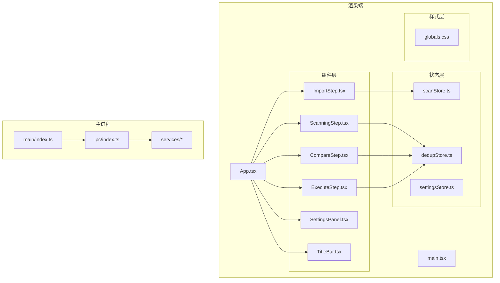
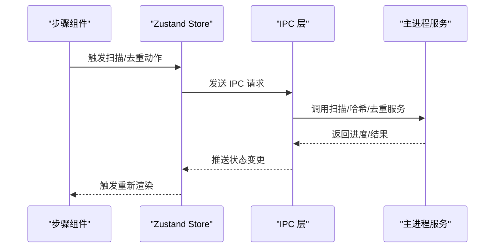
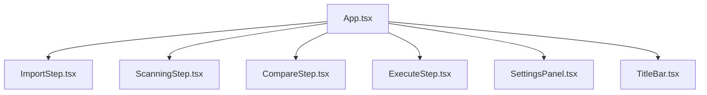
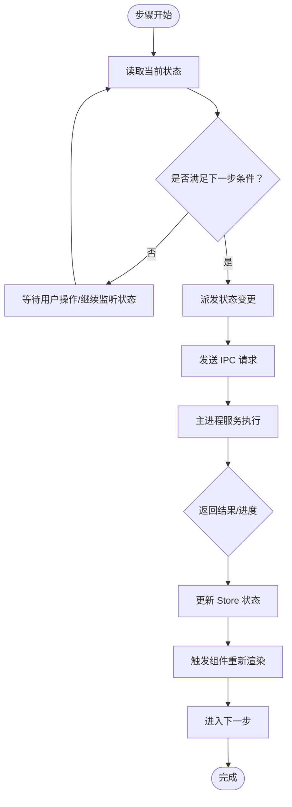
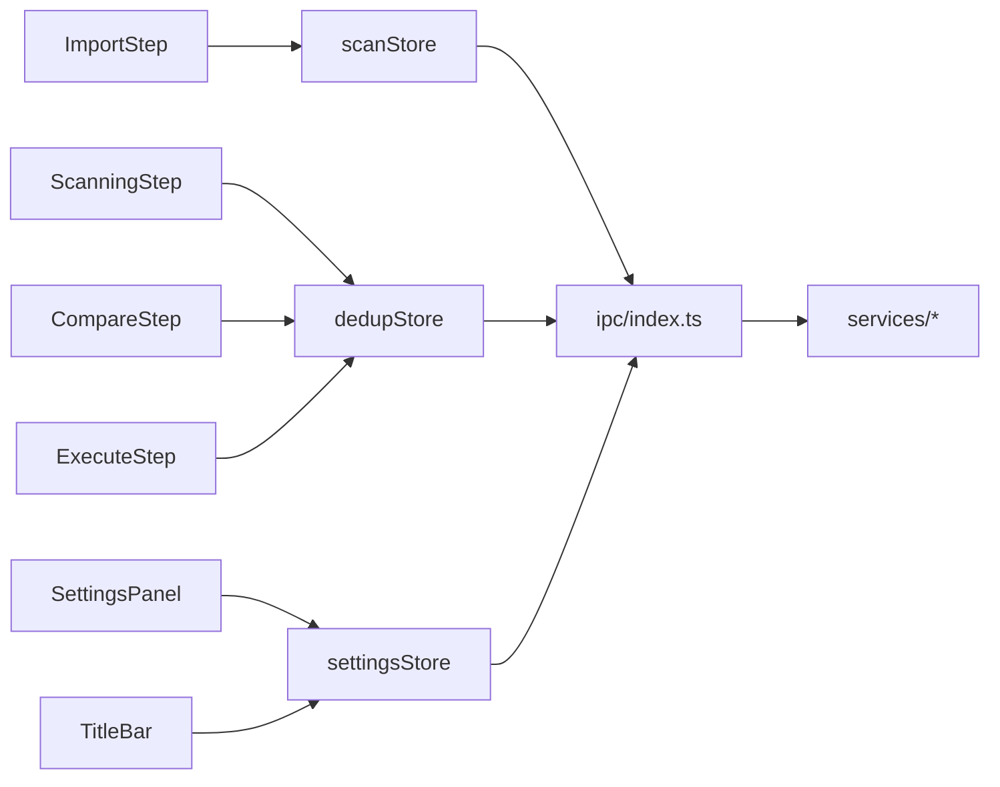

# 组件架构设计

<cite>
**本文档引用的文件**
- [App.tsx](file://src/renderer/src/App.tsx)
- [main.tsx](file://src/renderer/src/main.tsx)
- [ImportStep.tsx](file://src/renderer/src/components/ImportStep.tsx)
- [ScanningStep.tsx](file://src/renderer/src/components/ScanningStep.tsx)
- [CompareStep.tsx](file://src/renderer/src/components/CompareStep.tsx)
- [ExecuteStep.tsx](file://src/renderer/src/components/ExecuteStep.tsx)
- [SettingsPanel.tsx](file://src/renderer/src/components/SettingsPanel.tsx)
- [TitleBar.tsx](file://src/renderer/src/components/TitleBar.tsx)
- [dedupStore.ts](file://src/renderer/src/stores/dedupStore.ts)
- [scanStore.ts](file://src/renderer/src/stores/scanStore.ts)
- [settingsStore.ts](file://src/renderer/src/stores/settingsStore.ts)
- [globals.css](file://src/renderer/src/styles/globals.css)
- [index.ts](file://src/main/services/index.ts)
- [scanner.service.ts](file://src/main/services/scanner.service.ts)
- [hash.service.ts](file://src/main/services/hash.service.ts)
- [dedup.service.ts](file://src/main/services/dedup.service.ts)
- [settings.service.ts](file://src/main/services/settings.service.ts)
- [ipc/index.ts](file://src/main/ipc/index.ts)
- [preload/index.ts](file://src/preload/index.ts)
- [electron.vite.config.ts](file://electron.vite.config.ts)
- [tailwind.config.js](file://tailwind.config.js)
- [postcss.config.js](file://postcss.config.js)
- [package.json](file://package.json)
</cite>

## 目录
1. [简介](#简介)
2. [项目结构](#项目结构)
3. [核心组件](#核心组件)
4. [架构总览](#架构总览)
5. [详细组件分析](#详细组件分析)
6. [依赖分析](#依赖分析)
7. [性能考虑](#性能考虑)
8. [故障排除指南](#故障排除指南)
9. [结论](#结论)
10. [附录](#附录)

## 简介
本文件针对 Redophoto 的组件架构进行深入技术文档化，重点围绕基于 React 的渐进式四步操作流程：导入步骤（ImportStep）、扫描步骤（ScanningStep）、比较步骤（CompareStep）与执行步骤（ExecuteStep）。文档将从组件层次结构、父子关系、组件间通信机制入手，阐述职责边界、接口设计与生命周期管理；同时覆盖响应式布局、主题系统与 Tailwind CSS 使用模式，并总结组件复用策略、错误边界处理与性能优化实践。

## 项目结构
项目采用 Electron + React 渲染端 + 主进程服务层的分层架构。渲染端通过自定义 Store（基于 Zustand）管理状态，主进程提供文件扫描、哈希计算与去重等服务，并通过 IPC 进行通信。组件位于渲染端的 components 目录下，按功能步骤划分，形成清晰的步骤化 UI 流程。

**图表来源**
- [App.tsx](file://src/renderer/src/App.tsx)
- [main.tsx](file://src/renderer/src/main.tsx)
- [ImportStep.tsx](file://src/renderer/src/components/ImportStep.tsx)
- [ScanningStep.tsx](file://src/renderer/src/components/ScanningStep.tsx)
- [CompareStep.tsx](file://src/renderer/src/components/CompareStep.tsx)
- [ExecuteStep.tsx](file://src/renderer/src/components/ExecuteStep.tsx)
- [settingsStore.ts](file://src/renderer/src/stores/settingsStore.ts)
- [scanStore.ts](file://src/renderer/src/stores/scanStore.ts)
- [dedupStore.ts](file://src/renderer/src/stores/dedupStore.ts)
- [ipc/index.ts](file://src/main/ipc/index.ts)
- [index.ts](file://src/main/services/index.ts)

**章节来源**
- [App.tsx](file://src/renderer/src/App.tsx)
- [main.tsx](file://src/renderer/src/main.tsx)
- [globals.css](file://src/renderer/src/styles/globals.css)

## 核心组件
- 导入步骤（ImportStep）：负责文件夹选择与初始配置，触发扫描流程并推进到扫描步骤。
- 扫描步骤（ScanningStep）：展示扫描进度与结果，调用主进程服务执行扫描与哈希计算。
- 比较步骤（CompareStep）：呈现重复文件集合，提供用户决策界面以决定保留或删除。
- 执行步骤（ExecuteStep）：展示处理结果与最终状态，支持回滚与导出报告。
- 设置面板（SettingsPanel）与标题栏（TitleBar）：提供应用设置与窗口控制。
- 状态存储（Zustand Store）：dedupStore、scanStore、settingsStore 分别承载去重任务、扫描状态与用户设置。

职责边界与接口设计要点：
- 组件间通过状态存储解耦，避免直接跨层级通信。
- 步骤组件遵循单向数据流：上一步组件仅负责推进流程，下一步组件仅消费状态。
- 生命周期管理集中在步骤组件内部，确保资源释放与清理。

**章节来源**
- [ImportStep.tsx](file://src/renderer/src/components/ImportStep.tsx)
- [ScanningStep.tsx](file://src/renderer/src/components/ScanningStep.tsx)
- [CompareStep.tsx](file://src/renderer/src/components/CompareStep.tsx)
- [ExecuteStep.tsx](file://src/renderer/src/components/ExecuteStep.tsx)
- [dedupStore.ts](file://src/renderer/src/stores/dedupStore.ts)
- [scanStore.ts](file://src/renderer/src/stores/scanStore.ts)
- [settingsStore.ts](file://src/renderer/src/stores/settingsStore.ts)

## 架构总览
渲染端与主进程通过 IPC 协作，渲染端发起请求，主进程在后台线程执行耗时任务（扫描、哈希、去重），并通过回调或事件推送结果至渲染端 Store，UI 自动更新。

**图表来源**
- [ipc/index.ts](file://src/main/ipc/index.ts)
- [index.ts](file://src/main/services/index.ts)
- [scanner.service.ts](file://src/main/services/scanner.service.ts)
- [hash.service.ts](file://src/main/services/hash.service.ts)
- [dedup.service.ts](file://src/main/services/dedup.service.ts)

## 详细组件分析

### 组件层次与父子关系
- App.tsx 作为根容器，根据当前步骤状态渲染对应步骤组件。
- 各步骤组件为叶子节点，不包含子步骤组件，保持单一职责。
- SettingsPanel 与 TitleBar 作为通用横切组件，独立于步骤流程，通过 Store 读取设置。

**图表来源**
- [App.tsx](file://src/renderer/src/App.tsx)
- [ImportStep.tsx](file://src/renderer/src/components/ImportStep.tsx)
- [ScanningStep.tsx](file://src/renderer/src/components/ScanningStep.tsx)
- [CompareStep.tsx](file://src/renderer/src/components/CompareStep.tsx)
- [ExecuteStep.tsx](file://src/renderer/src/components/ExecuteStep.tsx)
- [SettingsPanel.tsx](file://src/renderer/src/components/SettingsPanel.tsx)
- [TitleBar.tsx](file://src/renderer/src/components/TitleBar.tsx)

**章节来源**
- [App.tsx](file://src/renderer/src/App.tsx)

### 组件间通信机制
- 状态驱动：各步骤组件通过对应的 Store（scanStore、dedupStore、settingsStore）读写状态，实现松耦合通信。
- 事件驱动：主进程服务通过 IPC 将进度与结果推送到 Store，组件自动响应。
- 参数传递：步骤切换通过路由参数或状态标志位实现，避免深层嵌套。

**图表来源**
- [scanStore.ts](file://src/renderer/src/stores/scanStore.ts)
- [dedupStore.ts](file://src/renderer/src/stores/dedupStore.ts)
- [ipc/index.ts](file://src/main/ipc/index.ts)
- [index.ts](file://src/main/services/index.ts)

**章节来源**
- [scanStore.ts](file://src/renderer/src/stores/scanStore.ts)
- [dedupStore.ts](file://src/renderer/src/stores/dedupStore.ts)
- [ipc/index.ts](file://src/main/ipc/index.ts)

### 导入步骤（ImportStep）
职责边界：
- 提供文件夹选择入口与基础设置项。
- 校验输入合法性后推进到扫描步骤。

接口设计：
- 输入：用户选择的目录路径与可选过滤规则。
- 输出：触发扫描流程并写入 scanStore。

生命周期管理：
- 挂载时初始化默认设置。
- 卸载时清理临时状态与事件监听。

**章节来源**
- [ImportStep.tsx](file://src/renderer/src/components/ImportStep.tsx)
- [scanStore.ts](file://src/renderer/src/stores/scanStore.ts)

### 扫描步骤（ScanningStep）
职责边界：
- 展示扫描进度条与实时统计信息。
- 调用主进程服务执行扫描与哈希计算。

接口设计：
- 输入：扫描目标目录、过滤规则。
- 输出：扫描结果与哈希摘要列表。

生命周期管理：
- 开始扫描时启动轮询或订阅进度事件。
- 结束时停止轮询并持久化中间结果。

**章节来源**
- [ScanningStep.tsx](file://src/renderer/src/components/ScanningStep.tsx)
- [scanner.service.ts](file://src/main/services/scanner.service.ts)
- [hash.service.ts](file://src/main/services/hash.service.ts)

### 比较步骤（CompareStep）
职责边界：
- 呈现重复文件分组，允许用户对每组进行“保留/删除”决策。
- 支持批量操作与撤销。

接口设计：
- 输入：去重候选集（按哈希分组）。
- 输出：用户决策集合与去重计划。

生命周期管理：
- 加载时构建决策树与缓存。
- 卸载时保存未提交的决策。

**章节来源**
- [CompareStep.tsx](file://src/renderer/src/components/CompareStep.tsx)
- [dedupStore.ts](file://src/renderer/src/stores/dedupStore.ts)

### 执行步骤（ExecuteStep）
职责边界：
- 执行去重操作，展示最终结果与统计报表。
- 提供回滚入口与导出报告。

接口设计：
- 输入：去重计划与执行上下文。
- 输出：执行日志与最终状态。

生命周期管理：
- 执行前备份元数据，执行后清理临时数据。
- 失败时触发错误边界并回滚。

**章节来源**
- [ExecuteStep.tsx](file://src/renderer/src/components/ExecuteStep.tsx)
- [dedup.service.ts](file://src/main/services/dedup.service.ts)

### 设置面板（SettingsPanel）与标题栏（TitleBar）
职责边界：
- SettingsPanel：读取与写入 settingsStore，提供主题、语言、扫描深度等选项。
- TitleBar：提供窗口最小化、最大化、关闭等系统级操作。

接口设计：
- SettingsPanel：通过 settingsStore 订阅设置变化，触发全局样式更新。
- TitleBar：通过 IPC 调用主进程窗口控制 API。

**章节来源**
- [SettingsPanel.tsx](file://src/renderer/src/components/SettingsPanel.tsx)
- [TitleBar.tsx](file://src/renderer/src/components/TitleBar.tsx)
- [settingsStore.ts](file://src/renderer/src/stores/settingsStore.ts)
- [settings.service.ts](file://src/main/services/settings.service.ts)

## 依赖分析
- 组件依赖：步骤组件仅依赖对应 Store 与通用 UI 组件；SettingsPanel 与 TitleBar 依赖 settingsStore 与 IPC。
- 状态依赖：scanStore 与 dedupStore 通过 IPC 与主进程服务交互。
- 外部依赖：Tailwind CSS 用于样式系统，PostCSS 与 Tailwind 配置用于构建期样式处理。

**图表来源**
- [ImportStep.tsx](file://src/renderer/src/components/ImportStep.tsx)
- [ScanningStep.tsx](file://src/renderer/src/components/ScanningStep.tsx)
- [CompareStep.tsx](file://src/renderer/src/components/CompareStep.tsx)
- [ExecuteStep.tsx](file://src/renderer/src/components/ExecuteStep.tsx)
- [SettingsPanel.tsx](file://src/renderer/src/components/SettingsPanel.tsx)
- [TitleBar.tsx](file://src/renderer/src/components/TitleBar.tsx)
- [scanStore.ts](file://src/renderer/src/stores/scanStore.ts)
- [dedupStore.ts](file://src/renderer/src/stores/dedupStore.ts)
- [settingsStore.ts](file://src/renderer/src/stores/settingsStore.ts)
- [ipc/index.ts](file://src/main/ipc/index.ts)
- [index.ts](file://src/main/services/index.ts)

**章节来源**
- [package.json](file://package.json)
- [tailwind.config.js](file://tailwind.config.js)
- [postcss.config.js](file://postcss.config.js)

## 性能考虑
- 组件复用策略：将通用 UI 元素（如按钮、进度条、对话框）抽象为独立组件，减少重复代码与渲染开销。
- 状态分片：将扫描与去重状态分离到不同 Store，避免无关状态变更导致的重渲染。
- 异步处理：扫描与去重在主进程执行，渲染端仅接收增量更新，降低主线程阻塞风险。
- 样式优化：Tailwind 类名按需组合，避免生成冗余样式；通过 PostCSS 与 Tailwind 配置裁剪未使用样式。
- 图像与大列表：在 CompareStep 中对重复文件列表进行虚拟滚动与懒加载，提升交互流畅度。

[本节为通用指导，无需列出具体文件来源]

## 故障排除指南
- 扫描无结果或卡死：检查扫描路径权限与过滤规则，确认 IPC 通道正常；查看主进程服务日志。
- 去重失败：核对用户决策一致性，检查去重计划与文件系统状态；必要时启用回滚。
- UI 不更新：确认 Store 状态已正确更新，检查 IPC 回调链路与事件订阅。
- 样式异常：验证 Tailwind 配置与 PostCSS 处理流程，确保类名拼写与作用域正确。

**章节来源**
- [ipc/index.ts](file://src/main/ipc/index.ts)
- [index.ts](file://src/main/services/index.ts)
- [dedupStore.ts](file://src/renderer/src/stores/dedupStore.ts)
- [scanStore.ts](file://src/renderer/src/stores/scanStore.ts)

## 结论
Redophoto 的组件架构通过“步骤化 UI + Store 驱动 + IPC 服务”的模式，实现了清晰的职责分离与良好的扩展性。导入、扫描、比较与执行四个步骤分别承担不同阶段的任务，配合状态存储与主进程服务，形成稳定高效的处理流水线。建议在后续迭代中进一步完善错误边界与性能监控，增强用户体验与系统可靠性。

[本节为总结性内容，无需列出具体文件来源]

## 附录

### 响应式布局与主题系统
- 响应式布局：通过 Tailwind 的断点类与 flex/grid 容器实现自适应布局，适配不同屏幕尺寸。
- 主题系统：通过 settingsStore 控制主题变量，结合 CSS 变量与 Tailwind 配置实现明暗主题切换。

**章节来源**
- [globals.css](file://src/renderer/src/styles/globals.css)
- [settingsStore.ts](file://src/renderer/src/stores/settingsStore.ts)
- [tailwind.config.js](file://tailwind.config.js)

### Tailwind CSS 类使用模式
- 语义化命名：优先使用语义化类名描述元素功能而非外观，便于维护与重构。
- 组合式样式：将常用样式组合为可复用的组件样式块，减少重复定义。
- 条件样式：根据状态动态切换类名，实现交互反馈与视觉提示。

**章节来源**
- [ImportStep.tsx](file://src/renderer/src/components/ImportStep.tsx)
- [ScanningStep.tsx](file://src/renderer/src/components/ScanningStep.tsx)
- [CompareStep.tsx](file://src/renderer/src/components/CompareStep.tsx)
- [ExecuteStep.tsx](file://src/renderer/src/components/ExecuteStep.tsx)