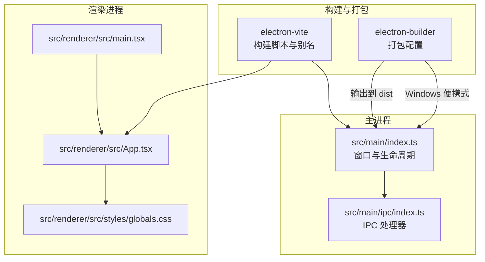
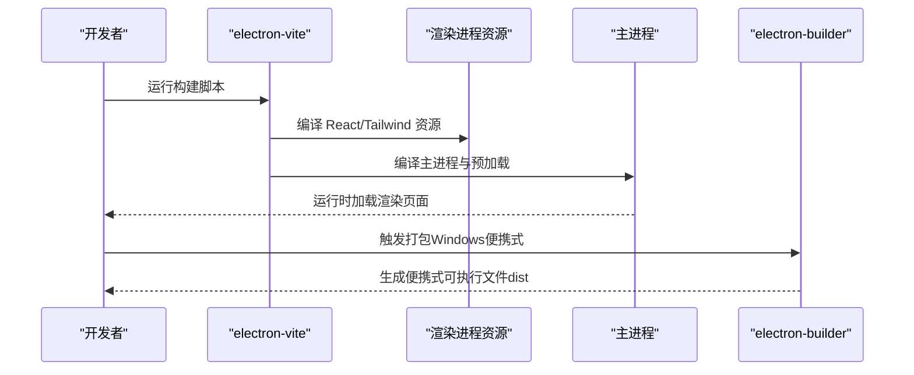
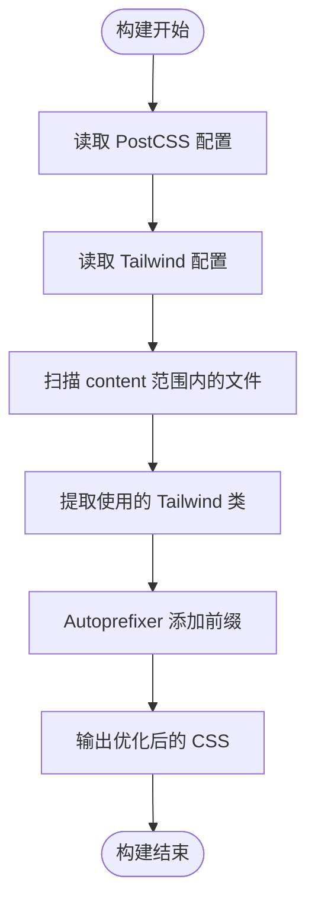
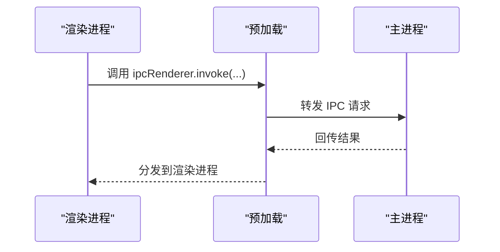
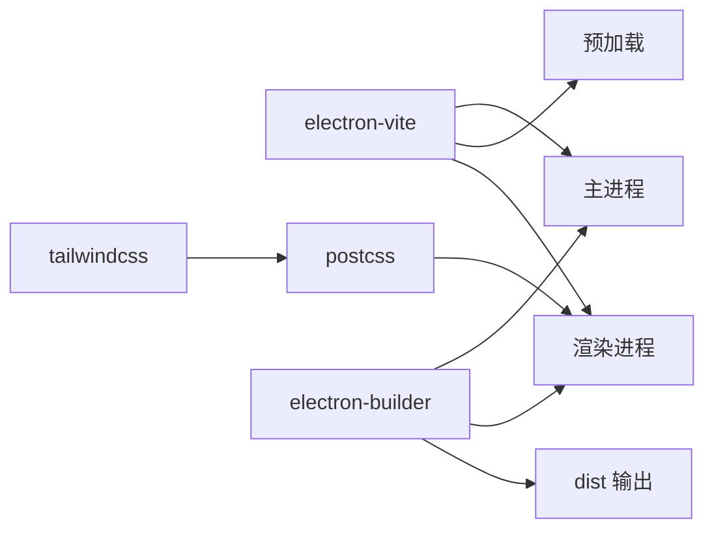

# 打包设置

<cite>
**本文引用的文件**
- [package.json](file://package.json)
- [electron.vite.config.ts](file://electron.vite.config.ts)
- [postcss.config.js](file://postcss.config.js)
- [tailwind.config.js](file://tailwind.config.js)
- [src/main/index.ts](file://src/main/index.ts)
- [src/main/ipc/index.ts](file://src/main/ipc/index.ts)
- [src/renderer/src/styles/globals.css](file://src/renderer/src/styles/globals.css)
</cite>

## 更新摘要
**变更内容**
- 版本号更新：从2.0.0升级到2.0.1
- Windows打包配置增强：新增icon字段确保正确的图标嵌入到Windows便携式可执行文件中
- 图标配置一致性：主进程和打包配置都使用build/icon.ico路径
- 移除安装目录配置相关的所有NSIS选项
- 简化Windows平台打包流程，提升用户体验

## 目录
1. [简介](#简介)
2. [项目结构](#项目结构)
3. [核心组件](#核心组件)
4. [架构总览](#架构总览)
5. [详细组件分析](#详细组件分析)
6. [依赖关系分析](#依赖关系分析)
7. [性能考量](#性能考量)
8. [故障排查指南](#故障排查指南)
9. [结论](#结论)
10. [附录](#附录)

## 简介
本文件面向红ophoto项目的打包与发布流程，系统性说明以下内容：
- Electron Builder 配置：应用元数据、图标、目标平台（Windows 便携式可执行文件）等。
- Windows 便携式可执行文件配置：简化安装过程、无需安装目录配置、即开即用体验。
- Tailwind CSS 与 PostCSS 构建配置：样式处理、CSS 优化与响应式支持。
- 不同操作系统的打包差异与特殊要求。
- 代码签名、自动更新与应用权限建议（基于现有配置的现状说明与最佳实践指引）。
- 打包常见问题与调试方法。

## 项目结构
红ophoto 使用 Electron-Vite 作为开发与构建工具链，前端采用 React + Tailwind CSS，后端逻辑在 Electron 主进程中通过 IPC 与渲染进程交互。打包阶段由 Electron Builder 负责生成便携式Windows可执行文件。

**图表来源**
- [electron.vite.config.ts:1-26](file://electron.vite.config.ts#L1-L26)
- [package.json:35-49](file://package.json#L35-L49)
- [src/main/index.ts:1-62](file://src/main/index.ts#L1-L62)
- [src/main/ipc/index.ts:1-309](file://src/main/ipc/index.ts#L1-L309)
- [src/renderer/src/styles/globals.css:1-64](file://src/renderer/src/styles/globals.css#L1-L64)

**章节来源**
- [electron.vite.config.ts:1-26](file://electron.vite.config.ts#L1-L26)
- [package.json:35-49](file://package.json#L35-L49)

## 核心组件
- 应用元数据与打包入口
  - 应用标识、产品名称、版本号、输出目录、Windows 平台目标与便携式配置均在 package.json 的 build 字段中定义。
  - 主进程入口指向构建产物 out/main/index.js。
- 构建别名与插件
  - electron-vite 配置了主进程、预加载与渲染进程的路径别名与插件，确保开发与构建一致性。
- 样式体系
  - PostCSS 启用 Tailwind CSS 与 Autoprefixer；Tailwind 通过 content 指定扫描范围，主题扩展自定义颜色。

**章节来源**
- [package.json:35-49](file://package.json#L35-L49)
- [package.json:5-11](file://package.json#L5-L11)
- [electron.vite.config.ts:5-25](file://electron.vite.config.ts#L5-L25)
- [postcss.config.js:1-7](file://postcss.config.js#L1-L7)
- [tailwind.config.js:1-24](file://tailwind.config.js#L1-L24)

## 架构总览
下图展示从构建到打包的关键流程：Vite/React 构建渲染资源，Electron 主进程启动窗口与 IPC，最终由 Electron Builder 产出 Windows 便携式可执行文件。

**图表来源**
- [package.json:6-12](file://package.json#L6-L12)
- [electron.vite.config.ts:1-26](file://electron.vite.config.ts#L1-L26)
- [src/main/index.ts:39-45](file://src/main/index.ts#L39-L45)
- [package.json:35-49](file://package.json#L35-L49)

## 详细组件分析

### Electron Builder 配置
- 应用元数据
  - appId：用于包标识与更新机制的唯一键。
  - productName：安装包显示名称。
  - version：应用版本号，当前为2.0.1。
  - directories.output：打包输出目录。
- Windows 平台配置
  - target：使用 portable（便携式）格式，无需安装程序。
  - icon：指定build/icon.ico作为Windows可执行文件图标。
  - signAndEditExecutable：false，不进行代码签名编辑。
- 便携式配置优势
  - 即开即用，无需安装步骤。
  - 无安装目录限制，可直接运行。
  - 减少系统注册表修改需求。

上述配置位于 package.json 的 build 字段中，对应脚本通过 npm run build:win 触发打包。

**章节来源**
- [package.json:35-49](file://package.json#L35-L49)
- [package.json:11](file://package.json#L11)

### Windows 便携式可执行文件配置
- 便携式格式特点
  - 无需安装程序，直接生成可执行文件。
  - 用户可将应用文件夹复制到任意位置运行。
  - 简化了安装过程，提升了用户体验。
- 配置参数
  - target: "portable" - 指定便携式格式。
  - icon: "build/icon.ico" - 指定Windows图标文件。
  - signAndEditExecutable: false - 不进行代码签名编辑。
- 产物特性
  - 输出至 dist 目录，包含完整的可执行文件。
  - 文件大小相比传统安装包更小。
  - 启动速度快，无需等待安装过程。

**章节来源**
- [package.json:41-47](file://package.json#L41-L47)

### 图标配置与管理
- 图标路径一致性
  - 打包配置使用build/icon.ico作为Windows图标。
  - 主进程窗口同样使用相同的图标路径，确保运行时显示正确图标。
  - 图标文件应放置在build目录下，与打包配置保持一致。
- 图标格式要求
  - 建议使用ICO格式，支持多分辨率。
  - 包含16x16、32x32、48x48、256x256等常用尺寸。
- 图标管理流程
  - 构建过程中确保图标文件存在且可访问。
  - 便携式格式下，图标会嵌入到可执行文件中。

**章节来源**
- [package.json:45](file://package.json#L45)
- [src/main/index.ts:16](file://src/main/index.ts#L16)

### Tailwind CSS 与 PostCSS 构建配置
- PostCSS 插件链
  - tailwindcss：解析与生成 Tailwind 指令。
  - autoprefixer：自动添加浏览器前缀。
- Tailwind 内容扫描
  - content 指向渲染侧源码与 HTML，确保仅生成使用到的样式，减少体积。
- 自定义主题
  - 扩展了 primary 颜色集，便于在组件中统一使用。
- 样式入口
  - 渲染入口引入全局样式，确保构建时包含 Tailwind 指令。

**图表来源**
- [postcss.config.js:1-7](file://postcss.config.js#L1-L7)
- [tailwind.config.js:3](file://tailwind.config.js#L3)
- [src/renderer/src/styles/globals.css:1-3](file://src/renderer/src/styles/globals.css#L1-L3)

**章节来源**
- [postcss.config.js:1-7](file://postcss.config.js#L1-L7)
- [tailwind.config.js:1-24](file://tailwind.config.js#L1-L24)
- [src/renderer/src/styles/globals.css:1-64](file://src/renderer/src/styles/globals.css#L1-L64)

### 主进程与 IPC 流程（对打包的影响）
- 主进程窗口初始化
  - 设置窗口尺寸、标题栏样式、沙箱与上下文隔离策略，影响安装后运行时行为。
  - 使用build/icon.ico作为窗口图标，确保便携式格式下图标正确显示。
- IPC 注册
  - 提供窗口控制、文件夹选择、扫描、哈希计算、去重分组与执行、缩略图生成、设置读写等接口。
- 打包注意事项
  - 便携式格式下，预加载脚本与主进程通信需保持稳定；打包后路径与开发时不同，需确保资源加载与对话框行为一致。

**图表来源**
- [src/main/index.ts:1-62](file://src/main/index.ts#L1-L62)
- [src/main/ipc/index.ts:1-309](file://src/main/ipc/index.ts#L1-L309)

**章节来源**
- [src/main/index.ts:1-62](file://src/main/index.ts#L1-L62)
- [src/main/ipc/index.ts:1-309](file://src/main/ipc/index.ts#L1-L309)

### 打包脚本与命令
- 开发与构建
  - dev：启动开发服务器。
  - build：构建主进程、预加载与渲染进程。
  - preview：本地预览构建产物。
- 打包
  - postinstall：安装/更新依赖后执行安装应用依赖。
  - build:win：先清理dist目录，再构建，最后调用 electron-builder 打包 Windows（便携式），并读取配置。

**章节来源**
- [package.json:6-12](file://package.json#L6-L12)

## 依赖关系分析
- 构建工具链
  - electron-vite：统一管理主进程、预加载与渲染进程的构建与别名。
  - vite + @vitejs/plugin-react：渲染侧构建与热更新。
- 样式工具链
  - tailwindcss + autoprefixer：样式处理与兼容性优化。
- 打包工具
  - electron-builder：跨平台打包，当前配置聚焦 Windows 便携式格式。
- 运行时依赖
  - electron-store：持久化存储。
  - sharp：图像处理（与去重流程相关）。
  - zustand：状态管理（渲染侧）。

**图表来源**
- [electron.vite.config.ts:1-26](file://electron.vite.config.ts#L1-L26)
- [postcss.config.js:1-7](file://postcss.config.js#L1-L7)
- [tailwind.config.js:1-24](file://tailwind.config.js#L1-L24)
- [package.json:20-34](file://package.json#L20-L34)
- [package.json:35-49](file://package.json#L35-L49)

**章节来源**
- [electron.vite.config.ts:1-26](file://electron.vite.config.ts#L1-L26)
- [postcss.config.js:1-7](file://postcss.config.js#L1-L7)
- [tailwind.config.js:1-24](file://tailwind.config.js#L1-L24)
- [package.json:20-34](file://package.json#L20-L34)
- [package.json:35-49](file://package.json#L35-L49)

## 性能考量
- 样式体积控制
  - Tailwind content 范围明确，避免生成未使用类导致的体积膨胀。
  - Autoprefixer 在生产构建中减少手动前缀维护成本。
- 构建速度
  - electron-vite 的外部化依赖插件有助于减少主进程打包体积与时间。
- 运行时性能
  - 主进程禁用沙箱但开启上下文隔离，结合最小权限原则，降低安全风险同时保证功能可用性。
- 便携式格式优势
  - 减少了安装程序的额外开销。
  - 启动速度更快，内存占用更少。

**章节来源**
- [tailwind.config.js:3](file://tailwind.config.js#L3)
- [postcss.config.js:1-7](file://postcss.config.js#L1-L7)
- [electron.vite.config.ts:7](file://electron.vite.config.ts#L7)
- [src/main/index.ts:22-27](file://src/main/index.ts#L22-L27)

## 故障排查指南
- 打包失败或产物缺失
  - 确认已先执行构建脚本再触发打包命令。
  - 检查主进程入口是否指向实际产物路径。
- Windows 便携式可执行文件无法运行
  - 确认便携式配置正确设置为 "portable"。
  - 检查 icon 配置是否指向有效的build/icon.ico文件。
  - 验证 dist 目录中是否包含完整的可执行文件。
- 图标显示异常
  - 确认build目录下存在icon.ico文件。
  - 检查图标文件格式是否为有效的ICO格式。
  - 验证主进程和打包配置使用相同的图标路径。
- 样式未生效或构建报错
  - 检查 Tailwind content 路径是否覆盖到新增组件。
  - 确保 PostCSS 插件顺序正确（tailwindcss → autoprefixer）。
- 运行时窗口与 IPC 异常
  - 核对预加载与主进程通信接口是否与渲染侧调用一致。
  - 开发模式下 ELECTRON_RENDERER_URL 是否正确指向本地地址。
- 便携式格式特定问题
  - 确保应用不需要系统级权限或注册表修改。
  - 验证用户数据存储路径在便携式环境下的可用性。

**章节来源**
- [package.json:6-12](file://package.json#L6-L12)
- [package.json:35-49](file://package.json#L35-L49)
- [postcss.config.js:1-7](file://postcss.config.js#L1-L7)
- [tailwind.config.js:3](file://tailwind.config.js#L3)
- [src/main/index.ts:39-45](file://src/main/index.ts#L39-L45)
- [src/main/ipc/index.ts:22-309](file://src/main/ipc/index.ts#L22-L309)

## 结论
红ophoto 的打包配置以 Electron Builder 为核心，结合 electron-vite 与 Tailwind CSS/PostCSS，实现了简洁高效的跨平台构建与打包流程。当前 Windows 平台采用便携式可执行文件格式，显著简化了安装过程，提升了用户体验。相比传统的NSIS安装程序，便携式格式具有即开即用、无需安装目录配置、启动速度快等优势。版本号已更新至2.0.1，图标配置得到增强，确保Windows环境下正确的图标显示。样式体系通过 Tailwind 的按需生成与 Autoprefixer 的兼容处理，兼顾体积与可维护性。后续可根据需要扩展代码签名与自动更新能力，同时保持便携式格式的优势。

## 附录

### 不同操作系统平台的打包差异与特殊要求
- Windows（便携式）
  - 支持便携式可执行文件格式，无需安装程序。
  - 即开即用，简化了安装过程。
  - 适用于个人用户和便携式使用场景。
  - 需要有效的图标文件用于可执行文件显示。
- macOS（未在当前配置中启用）
  - 建议配置 DMG 或 PKG，配合代码签名与公证流程。
- Linux（未在当前配置中启用）
  - 可选 DEB/RPM 或 AppImage；需考虑权限与桌面集成。

**章节来源**
- [package.json:35-49](file://package.json#L35-L49)

### 便携式格式与传统安装程序对比
- 便携式格式优势
  - 无需安装步骤，直接运行。
  - 无系统注册表修改需求。
  - 更小的文件体积。
  - 更快的启动速度。
  - 支持多用户共享。
- 传统安装程序优势
  - 可以创建桌面/开始菜单快捷方式。
  - 可以进行系统级集成。
  - 支持卸载程序。
  - 可以进行系统级权限配置。

### 代码签名与自动更新建议
- 代码签名
  - Windows：使用 p12 证书与 Electron Builder 的 signingHashAlgorithms、publisherName 等字段进行签名。
  - macOS/Linux：遵循平台签名与公证流程，确保安装包可信。
- 自动更新
  - 使用 S3、GitHub Releases 或私有更新服务器；在主进程中集成 autoUpdater 并在构建配置中启用 publish。
- 权限设置
  - Windows：便携式格式下通常不需要特殊权限；如需系统级访问，可考虑传统安装程序。
  - macOS/Linux：遵循最小权限原则，必要时请求用户授权。

### 版本管理最佳实践
- 版本号更新
  - 采用语义化版本控制（MAJOR.MINOR.PATCH）。
  - 重大功能更新时增加主版本号。
  - 功能改进时增加次版本号。
  - 修复bug时增加补丁版本号。
- 发布流程
  - 更新package.json中的version字段。
  - 确保图标和其他资源文件同步更新。
  - 进行充分的测试验证新版本功能。
  - 记录版本变更日志。