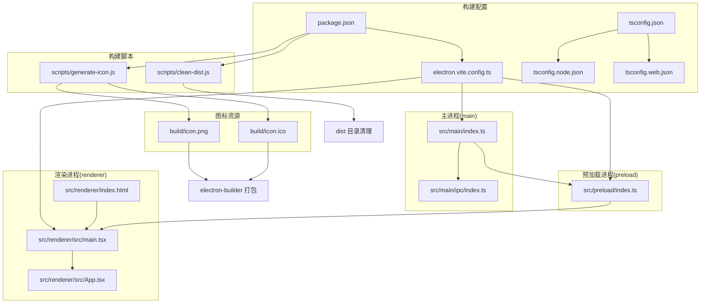
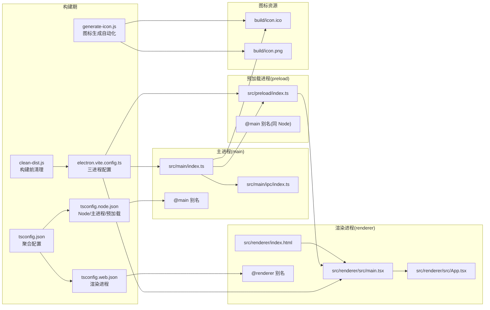
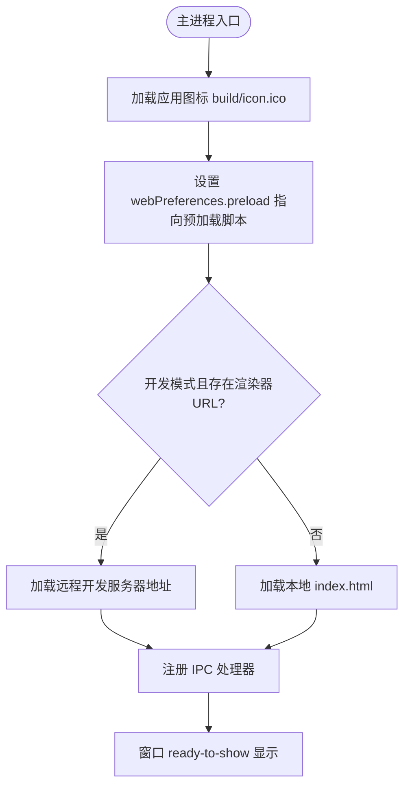
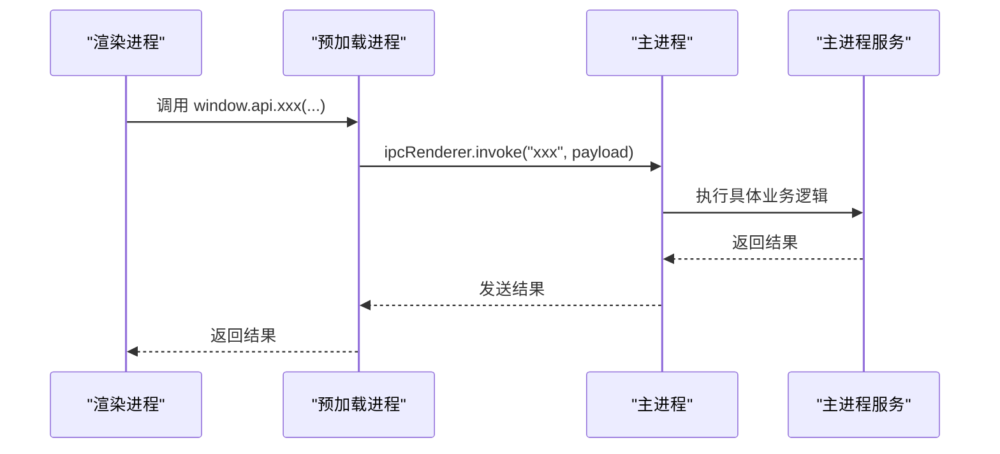
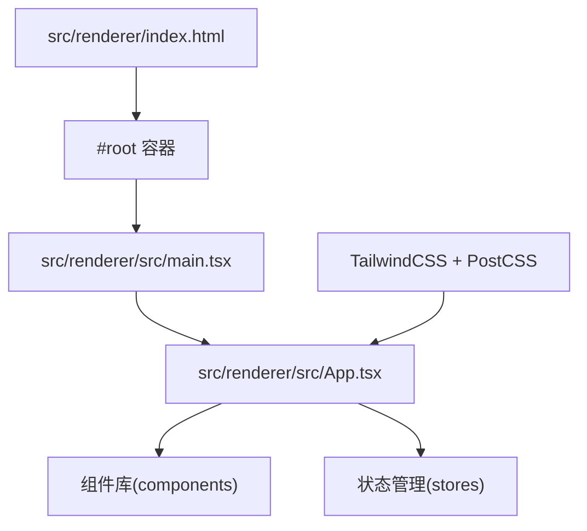
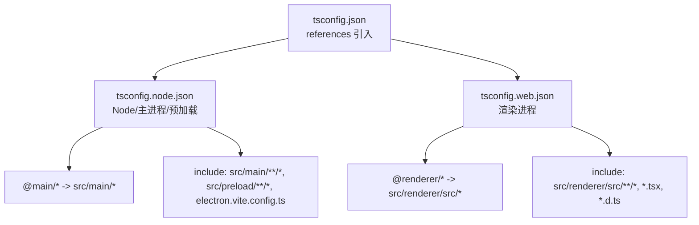
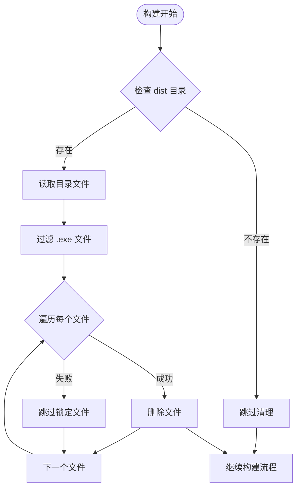
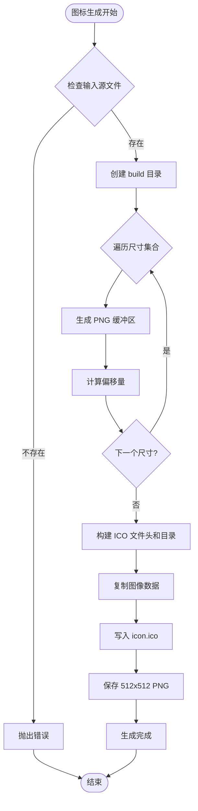
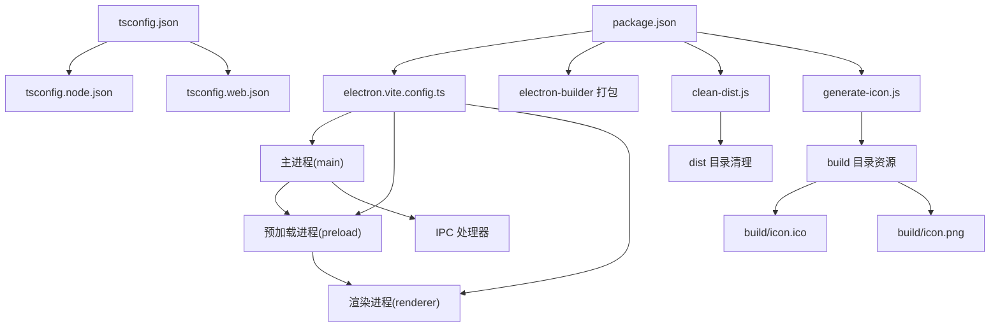

# 构建配置

<cite>
**本文引用的文件**
- [electron.vite.config.ts](file://electron.vite.config.ts)
- [package.json](file://package.json)
- [scripts/clean-dist.js](file://scripts/clean-dist.js)
- [scripts/generate-icon.js](file://scripts/generate-icon.js)
- [tsconfig.json](file://tsconfig.json)
- [tsconfig.node.json](file://tsconfig.node.json)
- [tsconfig.web.json](file://tsconfig.web.json)
- [src/main/index.ts](file://src/main/index.ts)
- [src/main/ipc/index.ts](file://src/main/ipc/index.ts)
- [src/preload/index.ts](file://src/preload/index.ts)
- [src/renderer/src/main.tsx](file://src/renderer/src/main.tsx)
- [src/renderer/src/App.tsx](file://src/renderer/src/App.tsx)
- [src/renderer/index.html](file://src/renderer/index.html)
- [postcss.config.js](file://postcss.config.js)
- [tailwind.config.js](file://tailwind.config.js)
</cite>

## 目录
1. [简介](#简介)
2. [项目结构](#项目结构)
3. [核心组件](#核心组件)
4. [架构总览](#架构总览)
5. [详细组件分析](#详细组件分析)
6. [依赖关系分析](#依赖关系分析)
7. [性能考虑](#性能考虑)
8. [故障排查指南](#故障排查指南)
9. [结论](#结论)
10. [附录](#附录)

## 简介
本文件系统性梳理红ophoto项目的构建配置，重点围绕 electron-vite 的三进程分离构建策略：主进程（main）、预加载进程（preload）与渲染进程（renderer）。文档将解释各进程的独立配置、TypeScript 多 tsconfig 的组织方式（tsconfig.json、tsconfig.node.json、tsconfig.web.json），路径别名（@main、@renderer）的定义与作用，开发与生产环境的构建差异，外部依赖处理插件 externalizeDepsPlugin 的使用，以及新增的构建前清理脚本 clean-dist.js 和图标生成脚本 generate-icon.js 的功能。同时提供构建优化建议与常见问题的解决方案。

**更新** 版本从 2.0.0 升级到 2.0.1，并新增图标生成自动化流程

## 项目结构
项目采用按职责分层的目录组织：
- 主进程：src/main，包含应用入口、IPC 注册与服务调用
- 预加载进程：src/preload，通过 contextBridge 暴露受控 API 至渲染进程
- 渲染进程：src/renderer，React 应用入口与页面模板
- 构建配置：electron.vite.config.ts、tsconfig.json 及其子配置、package.json 脚本与打包配置
- 构建脚本：scripts/clean-dist.js，用于清理旧的安装包文件
- 图标生成：scripts/generate-icon.js，使用 Sharp 库生成多分辨率图标

**更新** 新增 scripts/generate-icon.js 脚本，专门用于自动生成多分辨率图标资源

图表来源
- [electron.vite.config.ts:1-26](file://electron.vite.config.ts#L1-L26)
- [tsconfig.json:1-8](file://tsconfig.json#L1-L8)
- [tsconfig.node.json:1-21](file://tsconfig.node.json#L1-L21)
- [tsconfig.web.json:1-22](file://tsconfig.web.json#L1-L22)
- [package.json:1-50](file://package.json#L1-L50)
- [scripts/clean-dist.js:1-20](file://scripts/clean-dist.js#L1-L20)
- [scripts/generate-icon.js:1-75](file://scripts/generate-icon.js#L1-L75)

章节来源
- [electron.vite.config.ts:1-26](file://electron.vite.config.ts#L1-L26)
- [package.json:1-50](file://package.json#L1-L50)
- [scripts/clean-dist.js:1-20](file://scripts/clean-dist.js#L1-L20)
- [scripts/generate-icon.js:1-75](file://scripts/generate-icon.js#L1-L75)

## 核心组件
- 三进程分离构建策略
  - 主进程：使用 externalizeDepsPlugin 外部化依赖，避免打包 Node 依赖；配置 @main 路径别名指向 src/main
  - 预加载进程：使用 externalizeDepsPlugin 外部化依赖；无额外路径别名
  - 渲染进程：启用 React 插件，配置 @renderer 路径别名指向 src/renderer/src
- TypeScript 多配置
  - tsconfig.json 作为聚合入口，引用 tsconfig.node.json 与 tsconfig.web.json
  - tsconfig.node.json 面向 Node/主进程与预加载，启用 composite、Node 模块解析、paths 映射 @main/*
  - tsconfig.web.json 面向浏览器端渲染，启用 ESNext 模块解析、Bundler、paths 映射 @renderer/*
- 构建前清理机制
  - clean-dist.js：在 Windows 构建前自动清理 dist 目录中的 .exe 文件，防止过时构建产物占用磁盘空间
  - 通过 npm run clean:dist 脚本触发，确保每次构建都有干净的输出环境
- 图标生成自动化
  - generate-icon.js：使用 Sharp 库自动生成多分辨率 ICO 和 PNG 图标，支持 16×16 到 256×256 的完整尺寸集
  - 自动生成 512×512 PNG 用于 macOS/Linux 平台
  - 内存高效处理：批量生成 PNG 缓冲区，然后一次性构建 ICO 文件
- 开发与生产
  - 开发脚本：electron-vite dev；生产构建：electron-vite build；预览：electron-vite preview
  - Windows 打包：npm run build:win，自动执行清理、构建和打包流程
  - 打包：electron-builder，支持 Windows 安装包生成

**更新** 新增图标生成自动化流程，版本升级到 2.0.1，增强构建工具链的完整性

章节来源
- [electron.vite.config.ts:5-24](file://electron.vite.config.ts#L5-L24)
- [tsconfig.json:1-8](file://tsconfig.json#L1-L8)
- [tsconfig.node.json:1-21](file://tsconfig.node.json#L1-L21)
- [tsconfig.web.json:1-22](file://tsconfig.web.json#L1-L22)
- [package.json:6-12](file://package.json#L6-L12)
- [scripts/clean-dist.js:1-20](file://scripts/clean-dist.js#L1-L20)
- [scripts/generate-icon.js:1-75](file://scripts/generate-icon.js#L1-L75)

## 架构总览
下图展示三进程在构建期与运行期的交互关系，以及路径别名与模块解析如何影响导入行为。新增的构建前清理流程和图标生成自动化也在此图中体现。

**更新** 新增 generate-icon.js 脚本在构建流程中的位置，确保图标资源的自动生成和更新

图表来源
- [electron.vite.config.ts:5-24](file://electron.vite.config.ts#L5-L24)
- [tsconfig.json:1-8](file://tsconfig.json#L1-L8)
- [tsconfig.node.json:11-13](file://tsconfig.node.json#L11-L13)
- [tsconfig.web.json:12-14](file://tsconfig.web.json#L12-L14)
- [src/main/index.ts:16](file://src/main/index.ts#L16)
- [src/preload/index.ts:1-124](file://src/preload/index.ts#L1-L124)
- [src/renderer/src/main.tsx:1-11](file://src/renderer/src/main.tsx#L1-L11)
- [src/renderer/src/App.tsx:1-35](file://src/renderer/src/App.tsx#L1-L35)
- [src/renderer/index.html:1-13](file://src/renderer/index.html#L1-L13)
- [scripts/clean-dist.js:1-20](file://scripts/clean-dist.js#L1-L20)
- [scripts/generate-icon.js:1-75](file://scripts/generate-icon.js#L1-L75)

## 详细组件分析

### 主进程构建配置（main）
- 外部化依赖：使用 externalizeDepsPlugin，避免将 Electron/Node 依赖打包进主进程产物，提升启动速度与减小体积
- 路径别名：@main 指向 src/main，便于在主进程与预加载中统一导入
- 运行时行为：在开发模式下通过环境变量加载渲染进程 URL；否则加载本地 index.html
- 图标配置：从 build/icon.ico 加载应用图标，确保跨平台一致的视觉体验

**更新** 主进程配置保持不变，但受益于图标生成自动化，确保图标资源的及时更新

图表来源
- [src/main/index.ts:8-46](file://src/main/index.ts#L8-L46)

章节来源
- [electron.vite.config.ts:6-13](file://electron.vite.config.ts#L6-L13)
- [src/main/index.ts:1-62](file://src/main/index.ts#L1-L62)

### 预加载进程构建配置（preload）
- 外部化依赖：同样使用 externalizeDepsPlugin，确保预加载不被打包 Electron 依赖
- API 暴露：通过 contextBridge 将受控方法暴露到 window.api，供渲染进程调用
- 类型安全：定义 FileInfo、HashResult、PhashResult、DuplicateGroup、DedupDecision、AppSettings、ScanProgress、DedupProgress、RenamePreview、OrientationInfo 等接口

**更新** 预加载进程配置保持不变，但构建前清理确保预加载文件的完整性

图表来源
- [src/preload/index.ts:61-122](file://src/preload/index.ts#L61-L122)
- [src/main/ipc/index.ts:22-155](file://src/main/ipc/index.ts#L22-155)

章节来源
- [electron.vite.config.ts:14-16](file://electron.vite.config.ts#L14-L16)
- [src/preload/index.ts:1-230](file://src/preload/index.ts#L1-L230)

### 渲染进程构建配置（renderer）
- React 插件：启用 @vitejs/plugin-react，支持 JSX 与 React 18
- 路径别名：@renderer 指向 src/renderer/src，简化组件与样式导入
- 入口与模板：index.html 中挂载 #root，main.tsx 创建根节点并渲染 App
- 样式与工具：集成 TailwindCSS 与 PostCSS，content 覆盖渲染侧资源

**更新** 渲染进程配置保持不变，但构建前清理确保渲染资源的最新性

图表来源
- [src/renderer/index.html:8-10](file://src/renderer/index.html#L8-L10)
- [src/renderer/src/main.tsx:1-11](file://src/renderer/src/main.tsx#L1-L11)
- [src/renderer/src/App.tsx:1-35](file://src/renderer/src/App.tsx#L1-L35)
- [postcss.config.js:1-7](file://postcss.config.js#L1-L7)
- [tailwind.config.js:1-24](file://tailwind.config.js#L1-L24)

章节来源
- [electron.vite.config.ts:17-24](file://electron.vite.config.ts#L17-L24)
- [src/renderer/index.html:1-13](file://src/renderer/index.html#L1-L13)
- [src/renderer/src/main.tsx:1-11](file://src/renderer/src/main.tsx#L1-L11)
- [src/renderer/src/App.tsx:1-35](file://src/renderer/src/App.tsx#L1-L35)
- [postcss.config.js:1-7](file://postcss.config.js#L1-L7)
- [tailwind.config.js:1-24](file://tailwind.config.js#L1-L24)

### TypeScript 编译配置（tsconfig.json、tsconfig.node.json、tsconfig.web.json）
- 聚合入口：tsconfig.json 通过 references 引入两个子配置，形成复合工程
- Node 子配置（tsconfig.node.json）
  - composite=true：启用增量编译与项目引用
  - module=ESNext，moduleResolution=Node：面向 Node/主进程/预加载
  - paths 映射 @main/* -> ./src/main/*
  - include 覆盖主进程、预加载与构建配置文件
- Web 子配置（tsconfig.web.json）
  - composite=true，jsx=react-jsx，module=ESNext，moduleResolution=Bundler
  - lib 包含 ES2022、DOM、DOM.Iterable
  - paths 映射 @renderer/* -> ./src/renderer/src/*
  - include 覆盖渲染侧源码与类型声明

**更新** TypeScript 配置保持不变，但受益于构建前清理，确保编译环境的纯净性

图表来源
- [tsconfig.json:1-8](file://tsconfig.json#L1-L8)
- [tsconfig.node.json:1-21](file://tsconfig.node.json#L1-L21)
- [tsconfig.web.json:1-22](file://tsconfig.web.json#L1-L22)

章节来源
- [tsconfig.json:1-8](file://tsconfig.json#L1-L8)
- [tsconfig.node.json:1-21](file://tsconfig.node.json#L1-L21)
- [tsconfig.web.json:1-22](file://tsconfig.web.json#L1-L22)

### 路径别名配置（@main 与 @renderer）
- @main：在 Node/主进程与预加载中生效，映射至 src/main，便于集中管理主进程与预加载的模块导入
- @renderer：在渲染进程中生效，映射至 src/renderer/src，统一组件、样式与类型导入路径
- 实现方式：分别在 electron.vite.config.ts 与 tsconfig.web.json 中配置 paths 与 resolve.alias

**更新** 路径别名配置保持不变，但构建前清理确保别名解析的准确性

章节来源
- [electron.vite.config.ts:8-22](file://electron.vite.config.ts#L8-L22)
- [tsconfig.node.json:11-13](file://tsconfig.node.json#L11-L13)
- [tsconfig.web.json:12-14](file://tsconfig.web.json#L12-L14)

### 构建前清理机制（clean-dist.js）
- 功能概述：在 Windows 构建前自动清理 dist 目录中的旧 .exe 安装包文件
- 执行时机：通过 npm run build:win 脚本自动调用 npm run clean:dist
- 清理逻辑：
  - 读取 dist 目录中的所有文件
  - 过滤出以 .exe 结尾的文件（Windows 安装包）
  - 逐个删除锁定的文件会跳过并记录警告
  - 若 dist 目录不存在则忽略错误
- 作用价值：防止过时构建产物占用磁盘空间，确保每次构建都有干净的输出环境

**新增** 专门的构建前清理机制，确保构建环境的整洁性

图表来源
- [scripts/clean-dist.js:6-19](file://scripts/clean-dist.js#L6-L19)

章节来源
- [scripts/clean-dist.js:1-20](file://scripts/clean-dist.js#L1-L20)
- [package.json:11-12](file://package.json#L11-L12)

### 图标生成自动化（generate-icon.js）
- 功能概述：使用 Sharp 库自动生成多分辨率图标，支持 Windows ICO 和 macOS/Linux PNG 格式
- 依赖库：sharp ^0.33.5，提供高性能的图像处理能力
- 生成流程：
  - 输入：icon-source.jpg（原始图标源文件）
  - 输出：build/icon.ico（多分辨率 ICO 文件）和 build/icon.png（512×512 PNG 文件）
  - 支持尺寸：16×16、32×32、48×48、64×64、128×128、256×256
- 内存高效处理：
  - 批量生成 PNG 缓冲区，避免重复内存分配
  - 一次性构建 ICO 文件，减少 I/O 操作
  - 计算偏移量确保图像数据正确排列
- 执行时机：通过 electron-builder 配置自动集成到构建流程中
- 作用价值：自动化图标生成，确保跨平台图标的一致性和质量

**新增** 完整的图标生成自动化流程，使用 Sharp 库实现高性能多分辨率图标生成

图表来源
- [scripts/generate-icon.js:9-75](file://scripts/generate-icon.js#L9-L75)

章节来源
- [scripts/generate-icon.js:1-75](file://scripts/generate-icon.js#L1-L75)
- [package.json:19](file://package.json#L19)
- [package.json:45](file://package.json#L45)

### 开发与生产构建策略
- 开发模式
  - electron-vite dev 启动三进程开发服务器
  - 主进程通过环境变量加载渲染器 URL，实现热更新
- 生产构建
  - electron-vite build 产出三进程产物
  - package.json 中 main 指向 out/main/index.js，配合 electron-builder 打包
  - npm run build:win 自动执行清理、构建和打包流程
  - 自动集成图标生成和清理流程
- 预览
  - electron-vite preview 在本地预览构建产物

**更新** 新增 build:win 脚本，自动集成构建前清理流程和图标生成

章节来源
- [src/main/index.ts:39-43](file://src/main/index.ts#L39-L43)
- [package.json:5-12](file://package.json#L5-L12)

### 外部依赖处理插件 externalizeDepsPlugin 使用
- 位置：主进程与预加载均启用 externalizeDepsPlugin
- 作用：将 Electron、Node 原生模块与第三方依赖从构建产物中排除，仅在运行时通过 require 加载
- 建议：确保 package.json 中的依赖被正确识别，避免遗漏导致运行时报错

**更新** 外部依赖处理保持不变，但构建前清理确保依赖文件的完整性

章节来源
- [electron.vite.config.ts:7](file://electron.vite.config.ts#L7)
- [electron.vite.config.ts:15](file://electron.vite.config.ts#L15)

## 依赖关系分析
- 构建期耦合
  - electron.vite.config.ts 决定三进程的插件与别名
  - tsconfig.json 通过 references 组织 Node 与 Web 两套编译配置
  - package.json 提供脚本与打包配置，包含构建前清理脚本和图标生成配置
  - clean-dist.js 作为独立脚本参与构建流程
  - generate-icon.js 通过 electron-builder 集成到打包流程
- 运行期耦合
  - 主进程负责创建窗口、加载预加载与渲染资源
  - 预加载通过 contextBridge 暴露 API，渲染进程通过 window.api 调用
  - IPC 在主进程注册处理函数，实现前后端数据流

**更新** 新增 generate-icon.js 与 dist 目录清理的关系，完善构建流程图

图表来源
- [electron.vite.config.ts:1-26](file://electron.vite.config.ts#L1-L26)
- [tsconfig.json:1-8](file://tsconfig.json#L1-L8)
- [package.json:1-50](file://package.json#L1-L50)
- [scripts/clean-dist.js:1-20](file://scripts/clean-dist.js#L1-L20)
- [scripts/generate-icon.js:1-75](file://scripts/generate-icon.js#L1-L75)

章节来源
- [electron.vite.config.ts:1-26](file://electron.vite.config.ts#L1-L26)
- [tsconfig.json:1-8](file://tsconfig.json#L1-L8)
- [package.json:1-50](file://package.json#L1-L50)
- [scripts/clean-dist.js:1-20](file://scripts/clean-dist.js#L1-L20)
- [scripts/generate-icon.js:1-75](file://scripts/generate-icon.js#L1-L75)

## 性能考虑
- 外部化依赖
  - 使用 externalizeDepsPlugin 减少打包体积，缩短启动时间
  - 注意：仅对外部可运行的依赖启用外部化，避免运行时找不到模块
- 模块解析优化
  - Node 侧使用 Node 解析，Web 侧使用 Bundler 解析，减少不必要的转换
  - 合理使用路径别名，避免深层相对路径导致的解析开销
- 构建缓存
  - tsconfig.node.json 与 tsconfig.web.json 设置 composite=true，启用增量编译
- 打包体积
  - electron-builder 默认会将依赖打入安装包，结合 externalizeDepsPlugin 可进一步瘦身
- 磁盘空间管理
  - clean-dist.js 自动清理旧的 .exe 文件，防止磁盘空间浪费
  - 构建前清理确保每次构建都有充足的磁盘空间
- 图标生成优化
  - Sharp 库提供高性能的图像处理能力，支持多线程处理
  - 批量生成缓冲区减少内存分配次数
  - 一次性写入文件减少 I/O 操作

**更新** 新增图标生成性能优化考虑，强调 Sharp 库的高效处理能力

## 故障排查指南
- 预加载无法访问 window.api
  - 检查主进程是否正确设置 webPreferences.preload
  - 确认预加载已通过 contextBridge.exposeInMainWorld 暴露 api
  - 参考：[src/main/index.ts:22-27](file://src/main/index.ts#L22-L27)、[src/preload/index.ts:230](file://src/preload/index.ts#L230)
- 路径别名导入失败
  - 确认 electron.vite.config.ts 中 @main 与 @renderer 别名配置正确
  - 确认 tsconfig.web.json 中 @renderer/* 的 paths 映射
  - 参考：[electron.vite.config.ts:8-22](file://electron.vite.config.ts#L8-L22)、[tsconfig.web.json:12-14](file://tsconfig.web.json#L12-L14)
- 开发模式渲染器无法热更新
  - 确认环境变量 ELECTRON_RENDERER_URL 是否设置
  - 参考：[src/main/index.ts:40-41](file://src/main/index.ts#L40-L41)
- 打包后运行报"找不到模块"
  - 检查 externalizeDepsPlugin 是否正确识别依赖
  - 确认 package.json 中依赖版本与实际使用一致
  - 参考：[electron.vite.config.ts:7](file://electron.vite.config.ts#L7)、[electron.vite.config.ts:15](file://electron.vite.config.ts#L15)
- Tailwind 样式未生效
  - 检查 tailwind.config.js 的 content 路径是否覆盖渲染侧资源
  - 参考：[tailwind.config.js:3](file://tailwind.config.js#L3)
- 构建前清理失败
  - 检查 dist 目录权限是否足够
  - 确认 .exe 文件是否被其他进程占用
  - 参考：[scripts/clean-dist.js:6-19](file://scripts/clean-dist.js#L6-L19)
- Windows 构建产物异常
  - 确认 npm run build:win 脚本是否正确执行清理步骤
  - 检查 clean-dist.js 是否正常输出清理日志
  - 参考：[package.json:11-12](file://package.json#L11-L12)
- 图标生成失败
  - 检查 icon-source.jpg 是否存在且格式正确
  - 确认 Sharp 依赖是否正确安装
  - 验证 build 目录是否有写入权限
  - 参考：[scripts/generate-icon.js:5](file://scripts/generate-icon.js#L5)、[scripts/generate-icon.js:16](file://scripts/generate-icon.js#L16)
- 版本管理问题
  - 确认 package.json 中 version 已更新到 2.0.1
  - 检查 git 标签是否同步更新
  - 参考：[package.json:3](file://package.json#L3)

**更新** 新增图标生成和版本管理相关的故障排查指南

章节来源
- [src/main/index.ts:22-27](file://src/main/index.ts#L22-L27)
- [src/preload/index.ts:230](file://src/preload/index.ts#L230)
- [electron.vite.config.ts:7-22](file://electron.vite.config.ts#L7-L22)
- [tsconfig.web.json:12-14](file://tsconfig.web.json#L12-L14)
- [src/main/index.ts:40-41](file://src/main/index.ts#L40-L41)
- [tailwind.config.js:3](file://tailwind.config.js#L3)
- [scripts/clean-dist.js:6-19](file://scripts/clean-dist.js#L6-L19)
- [package.json:11-12](file://package.json#L11-L12)
- [scripts/generate-icon.js:5](file://scripts/generate-icon.js#L5)
- [scripts/generate-icon.js:16](file://scripts/generate-icon.js#L16)
- [package.json:3](file://package.json#L3)

## 结论
红ophoto 项目通过 electron-vite 的三进程分离构建策略，实现了主进程、预加载与渲染进程的清晰边界与高效开发体验。借助 externalizeDepsPlugin 与复合 tsconfig 的组织方式，项目在开发与生产阶段均具备良好的可维护性与性能表现。路径别名与模块解析策略进一步提升了导入效率与一致性。

**更新** 通过 clean-dist.js 脚本和 generate-icon.js 的引入，项目建立了完善的构建前清理机制和图标生成自动化流程，有效防止了磁盘空间浪费和过时构建产物的问题。版本从 2.0.0 升级到 2.0.1，体现了项目的持续演进和改进。这些机制与现有的构建策略完美结合，确保了构建环境的整洁性和可靠性，同时提升了开发效率和用户体验。

建议在后续迭代中持续关注依赖外部化策略与打包体积优化，同时可以考虑扩展 clean-dist.js 的功能，支持更多类型的构建产物清理，以获得更佳的用户体验和更高效的开发流程。

## 附录
- 常用命令
  - 开发：npm run dev
  - 构建：npm run build
  - 预览：npm run preview
  - Windows 打包：npm run build:win（自动执行清理、构建和打包）
  - 清理 dist：npm run clean:dist（手动执行清理）
  - 图标生成：npm run build（通过 electron-builder 自动触发）
- 关键文件定位
  - 构建配置：electron.vite.config.ts
  - TypeScript 聚合：tsconfig.json
  - Node/主进程/预加载：tsconfig.node.json
  - 渲染进程：tsconfig.web.json
  - 主进程入口：src/main/index.ts
  - 预加载入口：src/preload/index.ts
  - 渲染入口：src/renderer/src/main.tsx
  - 渲染模板：src/renderer/index.html
  - Tailwind 配置：tailwind.config.js
  - PostCSS 配置：postcss.config.js
  - 构建前清理：scripts/clean-dist.js
  - 图标生成：scripts/generate-icon.js
  - 版本信息：package.json（version: 2.0.1）