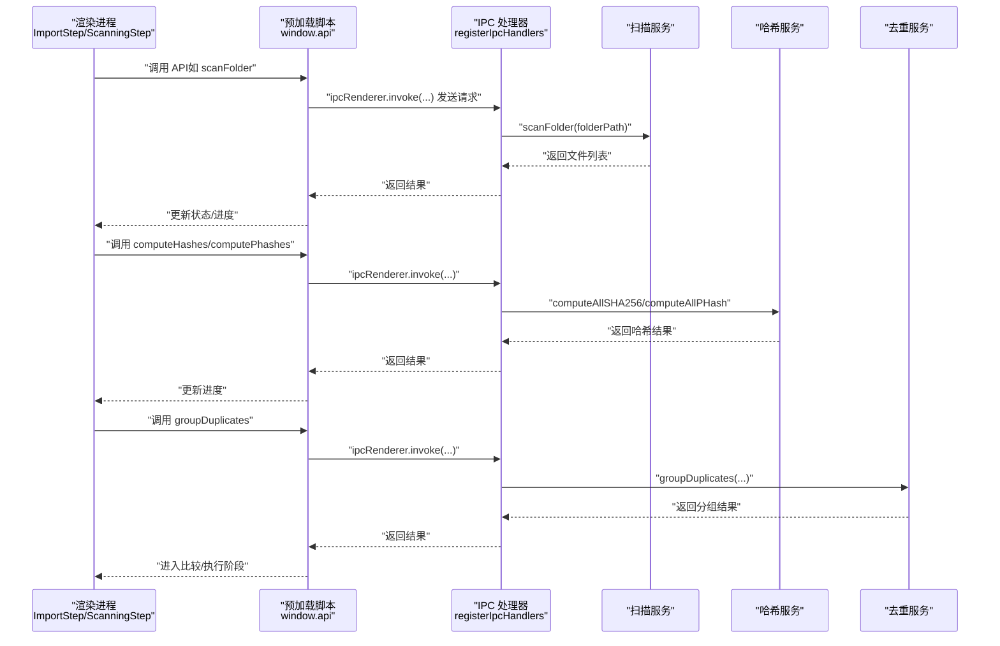
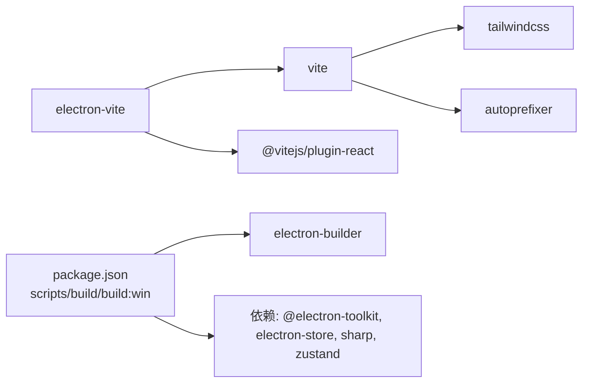

# 部署指南

<cite>
**本文引用的文件**
- [package.json](file://package.json)
- [electron.vite.config.ts](file://electron.vite.config.ts)
- [src/main/index.ts](file://src/main/index.ts)
- [src/preload/index.ts](file://src/preload/index.ts)
- [src/main/ipc/index.ts](file://src/main/ipc/index.ts)
- [src/main/services/scanner.service.ts](file://src/main/services/scanner.service.ts)
- [src/main/services/hash.service.ts](file://src/main/services/hash.service.ts)
- [src/main/services/dedup.service.ts](file://src/main/services/dedup.service.ts)
- [src/main/services/settings.service.ts](file://src/main/services/settings.service.ts)
- [src/renderer/src/App.tsx](file://src/renderer/src/App.tsx)
- [src/renderer/src/components/ImportStep.tsx](file://src/renderer/src/components/ImportStep.tsx)
- [src/renderer/src/components/ScanningStep.tsx](file://src/renderer/src/components/ScanningStep.tsx)
- [src/renderer/src/stores/scanStore.ts](file://src/renderer/src/stores/scanStore.ts)
- [src/renderer/src/stores/dedupStore.ts](file://src/renderer/src/stores/dedupStore.ts)
- [tailwind.config.js](file://tailwind.config.js)
- [dist/builder-effective-config.yaml](file://dist/builder-effective-config.yaml)
- [dist/builder-debug.yml](file://dist/builder-debug.yml)
- [README.md](file://README.md)
</cite>

## 更新摘要
**已做变更**
- 更新了 Windows 打包配置部分，反映从 NSIS 安装程序迁移到便携式可执行文件格式
- 新增了便携式部署的注意事项和使用说明
- 更新了构建产物说明，强调便携式可执行文件的直接运行特性

## 目录
1. [简介](#简介)
2. [项目结构](#项目结构)
3. [核心组件](#核心组件)
4. [架构总览](#架构总览)
5. [详细组件分析](#详细组件分析)
6. [依赖关系分析](#依赖关系分析)
7. [性能考虑](#性能考虑)
8. [跨平台部署流程](#跨平台部署流程)
9. [CI/CD 集成最佳实践](#cicd-集成最佳实践)
10. [部署后故障排除与回滚策略](#部署后故障排除与回滚策略)
11. [应用分发渠道与维护](#应用分发渠道与维护)
12. [结论](#结论)

## 简介
本指南面向红ophoto项目的部署与运维团队，提供从开发到生产的完整跨平台部署流程，覆盖 Windows、macOS 和 Linux 的差异化要求；详述生产构建（代码压缩、资源优化、依赖打包）策略；给出 CI/CD 最佳实践（自动化测试、构建流水线、发布流程）；并包含性能监控与内存优化建议、部署后故障排除与回滚策略，以及分发渠道选择与维护要求。

## 项目结构
该项目采用 Electron + React + Vite 的混合架构，主进程负责窗口、IPC、系统交互与业务逻辑协调，渲染进程负责 UI 与状态管理，预加载脚本桥接安全的渲染进程 API。

```mermaid
graph TB
subgraph "主进程"
MIDX["src/main/index.ts"]
MIPC["src/main/ipc/index.ts"]
MSS["src/main/services/scanner.service.ts"]
MHS["src/main/services/hash.service.ts"]
MDS["src/main/services/dedup.service.ts"]
MST["src/main/services/settings.service.ts"]
end
subgraph "预加载"
PIDX["src/preload/index.ts"]
end
subgraph "渲染进程"
APP["src/renderer/src/App.tsx"]
IMP["src/renderer/src/components/ImportStep.tsx"]
SCN["src/renderer/src/components/ScanningStep.tsx"]
SSCAN["src/renderer/src/stores/scanStore.ts"]
DEDUP["src/renderer/src/stores/dedupStore.ts"]
end
MIDX --> MIPC
MIPC --> MSS
MIPC --> MHS
MIPC --> MDS
MIPC --> MST
PIDX <- --> APP
APP --> IMP
APP --> SCN
APP --> SSCAN
APP --> DEDUP
```

**图表来源**
- [src/main/index.ts:1-61](file://src/main/index.ts#L1-L61)
- [src/main/ipc/index.ts:1-156](file://src/main/ipc/index.ts#L1-L156)
- [src/main/services/scanner.service.ts:1-86](file://src/main/services/scanner.service.ts#L1-L86)
- [src/main/services/hash.service.ts:1-180](file://src/main/services/hash.service.ts#L1-L180)
- [src/main/services/dedup.service.ts:1-209](file://src/main/services/dedup.service.ts#L1-L209)
- [src/main/services/settings.service.ts:1-34](file://src/main/services/settings.service.ts#L1-L34)
- [src/preload/index.ts:1-123](file://src/preload/index.ts#L1-L123)
- [src/renderer/src/App.tsx:1-35](file://src/renderer/src/App.tsx#L1-L35)
- [src/renderer/src/components/ImportStep.tsx:1-174](file://src/renderer/src/components/ImportStep.tsx#L1-L174)
- [src/renderer/src/components/ScanningStep.tsx:1-84](file://src/renderer/src/components/ScanningStep.tsx#L1-L84)
- [src/renderer/src/stores/scanStore.ts:1-52](file://src/renderer/src/stores/scanStore.ts#L1-L52)
- [src/renderer/src/stores/dedupStore.ts:1-83](file://src/renderer/src/stores/dedupStore.ts#L1-L83)

**章节来源**
- [package.json:1-47](file://package.json#L1-L47)
- [electron.vite.config.ts:1-26](file://electron.vite.config.ts#L1-L26)

## 核心组件
- 主进程入口与窗口生命周期：负责创建窗口、加载渲染页面、处理系统级事件与窗口控制。
- 预加载脚本：通过 contextBridge 暴露受控 API 至渲染进程，封装文件夹选择、扫描、哈希计算、去重、缩略图生成与设置读取。
- IPC 层：集中注册所有 ipcMain.handle 处理器，向渲染进程发送进度事件，并调用各服务实现具体功能。
- 扫描服务：递归扫描指定目录，过滤支持的图片格式，生成文件信息列表。
- 哈希服务：并行计算 SHA-256 与感知哈希（pHash），支持批量与进度回调。
- 去重服务：基于 SHA-256 精确分组与可选 pHash 相似分组，支持删除或复制输出模式。
- 设置服务：基于 electron-store 的本地持久化配置。
- 渲染层：使用 Zustand 管理扫描与去重状态，组件按阶段驱动 UI 流程。

**章节来源**
- [src/main/index.ts:1-61](file://src/main/index.ts#L1-L61)
- [src/preload/index.ts:1-123](file://src/preload/index.ts#L1-L123)
- [src/main/ipc/index.ts:1-156](file://src/main/ipc/index.ts#L1-L156)
- [src/main/services/scanner.service.ts:1-86](file://src/main/services/scanner.service.ts#L1-L86)
- [src/main/services/hash.service.ts:1-180](file://src/main/services/hash.service.ts#L1-L180)
- [src/main/services/dedup.service.ts:1-209](file://src/main/services/dedup.service.ts#L1-L209)
- [src/main/services/settings.service.ts:1-34](file://src/main/services/settings.service.ts#L1-L34)
- [src/renderer/src/stores/scanStore.ts:1-52](file://src/renderer/src/stores/scanStore.ts#L1-L52)
- [src/renderer/src/stores/dedupStore.ts:1-83](file://src/renderer/src/stores/dedupStore.ts#L1-L83)

## 架构总览
下图展示从用户操作到系统调用的端到端流程，包括渲染层触发、IPC 调用、主进程服务处理与文件系统交互。



**图表来源**
- [src/renderer/src/components/ImportStep.tsx:1-174](file://src/renderer/src/components/ImportStep.tsx#L1-L174)
- [src/renderer/src/components/ScanningStep.tsx:1-84](file://src/renderer/src/components/ScanningStep.tsx#L1-L84)
- [src/preload/index.ts:1-123](file://src/preload/index.ts#L1-L123)
- [src/main/ipc/index.ts:1-156](file://src/main/ipc/index.ts#L1-L156)
- [src/main/services/scanner.service.ts:1-86](file://src/main/services/scanner.service.ts#L1-L86)
- [src/main/services/hash.service.ts:1-180](file://src/main/services/hash.service.ts#L1-L180)
- [src/main/services/dedup.service.ts:1-209](file://src/main/services/dedup.service.ts#L1-L209)

## 详细组件分析

### 主进程与窗口生命周期
- 创建窗口时启用无边框标题栏、隐藏式标题栏覆盖、禁用沙箱但开启上下文隔离，确保安全与自定义外观。
- 开发模式下从环境变量加载渲染地址，否则加载打包后的 HTML。
- 注册 IPC 处理器以响应窗口控制、文件夹选择、扫描、哈希、去重、缩略图与设置读写。

**章节来源**
- [src/main/index.ts:1-61](file://src/main/index.ts#L1-L61)
- [src/main/ipc/index.ts:1-156](file://src/main/ipc/index.ts#L1-L156)

### 预加载脚本与 API 暴露
- 定义 FileInfo、HashResult、PhashResult、DuplicateGroup、DedupDecision、AppSettings、ScanProgress、DedupProgress 等接口，保证类型安全。
- 暴露窗口控制、文件夹选择、扫描、哈希、去重、缩略图与设置相关 API，并提供进度监听器订阅机制。

**章节来源**
- [src/preload/index.ts:1-123](file://src/preload/index.ts#L1-L123)

### 扫描服务（文件枚举与统计）
- 支持的扩展名集合限定在常见图片格式。
- 两阶段扫描：第一遍收集路径，第二遍统计文件元数据，期间对不可访问文件进行容错处理。
- 进度回调每处理约 50 个文件让出事件循环，避免阻塞。

**章节来源**
- [src/main/services/scanner.service.ts:1-86](file://src/main/services/scanner.service.ts#L1-L86)

### 哈希服务（SHA-256 与 pHash）
- SHA-256 使用流式读取与 Promise 包装，批量处理（批次大小 20），并行计算。
- pHash 实现包含图像缩放、灰度化、原始像素提取、二维 DCT、低频块提取与二进制哈希生成。
- 提供感知哈希批量计算与进度回调，批次大小 5。
- 提供缩略图生成接口，限制最大尺寸并进行 JPEG 压缩。

**章节来源**
- [src/main/services/hash.service.ts:1-180](file://src/main/services/hash.service.ts#L1-L180)

### 去重服务（分组与执行）
- 先按 SHA-256 分组，再对非精确组按 pHash 进行并查集合并，阈值可配置。
- 支持两种输出模式：删除（直接删除文件）与复制（复制保留文件至新目录）。
- 执行阶段提供进度回调，批量写入时定期让出事件循环以保持 UI 响应。

**章节来源**
- [src/main/services/dedup.service.ts:1-209](file://src/main/services/dedup.service.ts#L1-L209)

### 设置服务（本地持久化）
- 默认设置包含哈希模式、pHash 阈值、输出模式与输出目录后缀。
- 使用 electron-store 在用户目录保存配置，提供读取与更新接口。

**章节来源**
- [src/main/services/settings.service.ts:1-34](file://src/main/services/settings.service.ts#L1-L34)

### 渲染层状态与组件
- App 组件根据当前阶段渲染不同步骤组件。
- ImportStep 负责选择文件夹、触发扫描、计算哈希、调用去重并推进阶段。
- ScanningStep 展示扫描与哈希进度。
- scanStore 与 dedupStore 使用 Zustand 管理全局状态与决策。

**章节来源**
- [src/renderer/src/App.tsx:1-35](file://src/renderer/src/App.tsx#L1-L35)
- [src/renderer/src/components/ImportStep.tsx:1-174](file://src/renderer/src/components/ImportStep.tsx#L1-L174)
- [src/renderer/src/components/ScanningStep.tsx:1-84](file://src/renderer/src/components/ScanningStep.tsx#L1-L84)
- [src/renderer/src/stores/scanStore.ts:1-52](file://src/renderer/src/stores/scanStore.ts#L1-L52)
- [src/renderer/src/stores/dedupStore.ts:1-83](file://src/renderer/src/stores/dedupStore.ts#L1-L83)

## 依赖关系分析
- 构建工具链：electron-vite 驱动开发与构建，Vite 提供 React 插件与热更新；Tailwind CSS 用于样式；PostCSS 自动前缀。
- 运行时依赖：@electron-toolkit 工具、electron-store、sharp（图像处理）、zustand（状态管理）。
- 打包工具：electron-builder 用于多平台安装包生成，配置在 package.json 的 build 字段中。



**图表来源**
- [package.json:1-47](file://package.json#L1-L47)
- [electron.vite.config.ts:1-26](file://electron.vite.config.ts#L1-L26)
- [tailwind.config.js:1-24](file://tailwind.config.js#L1-L24)

**章节来源**
- [package.json:1-47](file://package.json#L1-L47)
- [electron.vite.config.ts:1-26](file://electron.vite.config.ts#L1-L26)
- [tailwind.config.js:1-24](file://tailwind.config.js#L1-L24)

## 性能考虑
- 启动时间优化
  - 主进程窗口创建时延迟显示，待 ready-to-show 再显示，减少白屏时间。
  - 开发模式下从环境变量加载渲染地址，避免本地文件 I/O。
  - 预加载脚本仅暴露必要 API，降低上下文桥接开销。
- 计算密集型任务
  - 扫描与哈希计算采用分批并行策略，批次大小分别为 50 与 20/5，结合 setImmediate 让出事件循环。
  - pHash 计算使用 DCT 与二进制哈希，尽量避免大对象频繁分配。
- I/O 与磁盘
  - 去重执行复制模式时，先创建目标目录，再按相对路径逐个写入，避免重复创建目录。
  - 删除模式按需分批 unlink，错误累积但不中断整体流程。
- 内存使用
  - 文件扫描阶段仅在内存中持有文件元数据，不加载图片内容。
  - 哈希与 pHash 结果以数组形式返回，避免长期缓存。
- UI 响应
  - 所有进度事件通过 IPC 发送到渲染进程，避免主进程阻塞。
  - 渲染层使用轻量状态管理，避免深层嵌套导致的重渲染。

**章节来源**
- [src/main/index.ts:1-61](file://src/main/index.ts#L1-L61)
- [src/main/services/scanner.service.ts:1-86](file://src/main/services/scanner.service.ts#L1-L86)
- [src/main/services/hash.service.ts:1-180](file://src/main/services/hash.service.ts#L1-L180)
- [src/main/services/dedup.service.ts:1-209](file://src/main/services/dedup.service.ts#L1-L209)

## 跨平台部署流程

### Windows
- 系统要求
  - Node.js 与 Python（用于编译 sharp 依赖）。
  - Windows SDK 或 Visual Studio 构建工具（若需要原生模块）。
- 构建步骤
  - 安装依赖：npm ci 或 npm install。
  - 生产构建：npm run build。
  - 打包便携式可执行文件：npm run build:win（使用 electron-builder 生成便携式可执行文件，无需安装）。
- **更新** 便携式部署特性
  - 产物为单个可执行文件（.exe），无需安装程序，双击即可运行。
  - 便携模式下自动设置 PORTABLE_EXECUTABLE_DIR 环境变量指向可执行文件所在目录。
  - 支持命令行参数传递给应用程序（如 force-run、allusers 等）。
- 注意事项
  - 便携式版本不创建桌面快捷方式，需要手动创建快捷方式。
  - 首次运行可能需要管理员权限以设置必要的环境变量。
  - 若 sharp 编译失败，检查 Python 版本与 VS 构建工具是否正确安装。
- 产物
  - 输出目录 dist，包含便携式可执行文件（ReDoPhoto.exe）及相关资源文件。

**章节来源**
- [package.json:1-47](file://package.json#L1-L47)
- [dist/builder-effective-config.yaml:1-11](file://dist/builder-effective-config.yaml#L1-L11)
- [dist/builder-debug.yml:1-17](file://dist/builder-debug.yml#L1-L17)
- [README.md:138-144](file://README.md#L138-L144)

### macOS
- 系统要求
  - Xcode Command Line Tools。
  - Node.js 与 Python。
- 构建步骤
  - 安装依赖：npm ci。
  - 生产构建：npm run build。
  - 打包 DMG：在 package.json 的 build 配置中添加 macOS 目标（如需要）。
- 注意事项
  - 若 sharp 在 Apple Silicon 与 Intel 平台交叉编译失败，建议在对应架构机器上构建。
  - 如需签名与公证，需在 CI 中配置 Apple 证书与团队信息。

**章节来源**
- [package.json:1-47](file://package.json#L1-L47)

### Linux
- 系统要求
  - libvips（sharp 依赖）与相应开发头文件。
  - Node.js 与 Python。
- 构建步骤
  - 安装依赖：npm ci。
  - 生产构建：npm run build。
  - 打包 AppImage 或 DEB：在 package.json 的 build 配置中添加对应 target。
- 注意事项
  - 不同发行版的 libvips 版本差异可能导致运行时问题，建议在目标版本容器内构建。
  - AppImage 可独立运行，无需系统安装。

**章节来源**
- [package.json:1-47](file://package.json#L1-L47)

## CI/CD 集成最佳实践

### 自动化测试
- 单元测试：针对扫描、哈希与去重服务的关键函数编写测试，覆盖边界条件与错误分支。
- 端到端测试：使用自动化框架（如 Playwright 或 Spectron）模拟用户操作，验证 UI 流程与 IPC 交互。
- 性能回归：记录关键操作（如 1000 张图片扫描与哈希）的耗时阈值，纳入 CI 报告。

### 构建流水线
- 多平台矩阵：分别在 Windows、macOS、Linux Runner 上执行构建与打包。
- 依赖缓存：缓存 npm/yarn 依赖与 electron-builder 缓存目录，提升速度。
- 构建脚本：统一使用 npm scripts，确保本地与 CI 行为一致。

### 发布流程
- 版本标签：使用语义化版本打标签，触发发布作业。
- 便携式产物上传：将生成的便携式可执行文件上传至发布平台（如 GitHub Releases、企业应用商店）。
- 自动更新（可选）：配置应用内自动更新通道，确保用户及时获得修复与改进。

## 部署后故障排除与回滚策略

### 常见问题定位
- 应用无法启动
  - 检查主进程日志与系统权限（尤其是访问用户相册目录）。
  - 确认打包后的渲染 HTML 路径与预加载脚本存在。
  - **新增** 便携式版本检查 PORTABLE_EXECUTABLE_DIR 环境变量是否正确设置。
- 图片扫描为空
  - 确认所选目录包含受支持的图片扩展名。
  - 检查文件系统权限与只读属性。
- 哈希计算异常
  - 检查 sharp 是否正常编译，确认 libvips 版本兼容性。
  - 查看错误累积列表，定位具体文件。
- 去重执行失败
  - 删除模式下检查文件权限与只读属性。
  - 复制模式下检查目标目录空间与权限。

### 回滚策略
- 版本标记：每次发布打上 Git 标签，便于快速回滚。
- 产物备份：保留最近 N 个版本的便携式可执行文件与变更日志。
- 快速回滚：通过发布平台回退到上一个稳定版本；若为在线更新，临时关闭更新通道。

**章节来源**
- [src/main/services/scanner.service.ts:1-86](file://src/main/services/scanner.service.ts#L1-L86)
- [src/main/services/hash.service.ts:1-180](file://src/main/services/hash.service.ts#L1-L180)
- [src/main/services/dedup.service.ts:1-209](file://src/main/services/dedup.service.ts#L1-L209)

## 应用分发渠道与维护

### 分发渠道选择
- Windows
  - **更新** 便携式可执行文件（推荐）：GitHub Releases 直接下载，无需安装。
  - 官方网站直链下载（推荐配合签名与哈希校验）。
  - 第三方软件站（需注意版权与病毒扫描）。
- macOS
  - Mac App Store（需审核）。
  - 官方网站直链下载（DMG 包含公证）。
- Linux
  - AppImage（无需安装，适合个人与开发者）。
  - DEB/RPM 包（适合企业与发行版生态）。

### 维护要求
- 自动更新：在应用内实现更新检查与安装流程（如需）。
- 用户反馈：收集崩溃日志与错误报告，建立问题跟踪。
- 安全与合规：定期更新依赖，关注 sharp 与 Electron 的安全公告。

## 结论
本指南提供了红ophoto项目的完整部署方案，涵盖跨平台构建、生产优化、CI/CD 集成、性能监控与内存优化、故障排除与回滚策略，以及分发渠道选择。**重要更新**：Windows 平台现已采用便携式可执行文件格式，提供更直接的执行体验，用户可直接双击运行而无需安装程序。建议在生产环境中结合自动化测试与发布流程，持续监控应用性能与稳定性，确保用户体验与数据安全。